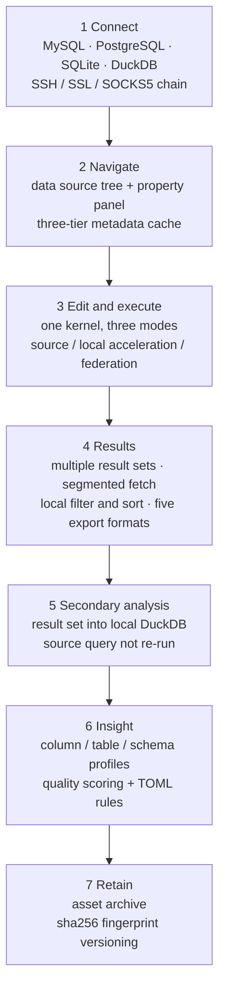
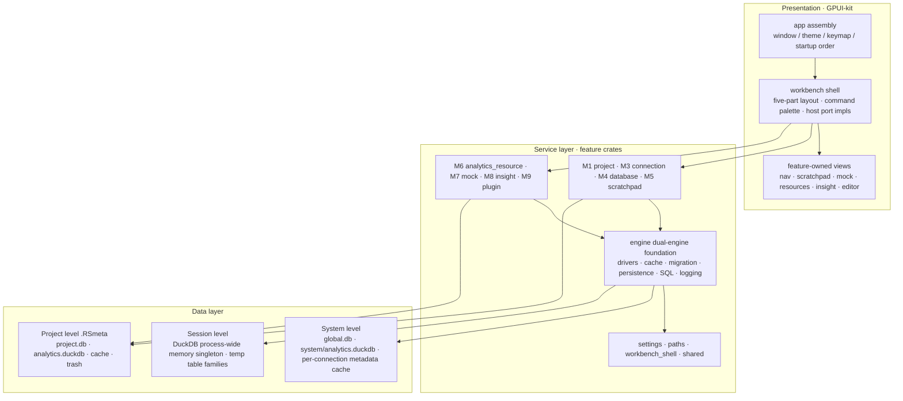
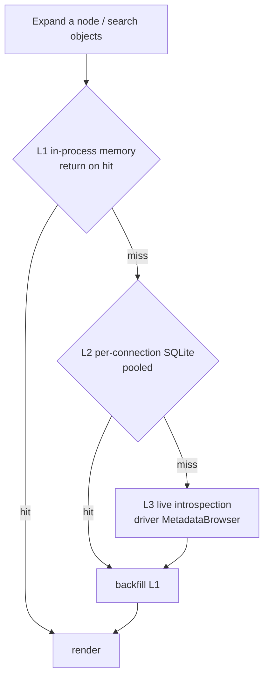

<div align="center">

<picture>
  <source media="(prefers-color-scheme: dark)" srcset="assets/public/rds-icon-dark.png">
  <source media="(prefers-color-scheme: light)" srcset="assets/public/rds-icon-light.png">
  
</picture>

<h1>RdataStation v2</h1>

**A local-first workstation for database analysis and querying**

*Analysis begins where the query ends.*
*取数立本，分析明道；数不虚取，析不妄断。*

[](https://www.rust-lang.org)
[](https://gpui-kit.com)
[](https://duckdb.org)
[](https://sqlite.org)
[](#architecture)
[](#roadmap--known-boundaries)
[](LICENSE)

[简体中文](README.md) · **English**

</div>

---

> **The query finished. Now what?**
>
> Export to CSV → Excel chokes on it → switch to Python and write pandas → paste into Jupyter…
> RdataStation v2 exists to close that gap: **keep the work that happens *after* the query inside one tool.**

## Contents

- [What this is](#what-this-is)
- [Seven highlights](#seven-highlights)
- [UI preview (design prototypes)](#ui-preview-design-prototypes)
- [One main line: from connection to conclusion](#one-main-line-from-connection-to-conclusion)
- [Architecture](#architecture)
- [Modules & progress](#modules--progress)
- [How it compares](#how-it-compares)
- [Tech stack](#tech-stack)
- [Quick start](#quick-start)
- [Quality & verification](#quality--verification)
- [Documentation map](#documentation-map)
- [Roadmap & known boundaries](#roadmap--known-boundaries)
- [Credits & notes](#credits--notes)

## What this is

RdataStation v2 is a desktop database workbench rebuilt on **Rust + GPUI-kit**: a single application, 16 crates organized by business capability, dependencies pointing strictly downward with no cycles, and **no telemetry, no cloud sync, no accounts**.

It does not try to be "yet another do-everything database client." It concentrates on three stages that are usually split apart:

| Stage | How it's usually done | How RdataStation does it |
| --- | --- | --- |
| **Getting data** | Connect, browse, write SQL | The same — but with a thick foundation: 4 engine families · three-tier metadata cache · paginated large schemas |
| **Analyzing** | Export to Excel / pandas / Jupyter | **One click sends a result set into local DuckDB** (without re-running the source query) · column / table / schema profiling · TOML rule engine |
| **Keeping evidence** | Results scattered in temp files | An **asset archive**: read-only, versioned, with provenance and a sha256 fingerprint — reproducible |

Two supporting pieces round it out: a **scratchpad** (a project-private exploration area) and **mock data generation** (turn a table's *structure* into usable test data — written only into the analysis engine, never back to the source database).

### Explicitly out of scope

Charts / dashboards / reports (left to the plugin ecosystem) · cross-source writes · in-grid result editing · an ODBC / ADBC backbone · filling empty states with fabricated data.

### Project size

| Metric | Value |
| --- | --- |
| Workspace crates | **16** (15 business/foundation crates + the `app` assembly layer) |
| Rust code | **221,971 lines** across 440 `.rs` files (excluding the `v1/` archive) |
| Migration assets | **4** SQLite / DuckDB migration sets, with two separate version ledgers |
| Built-in drivers | **6**, covering 4 engine families |
| Documentation | 5 kinds of module docs (entry / prototype / interactive mockup / architecture / dev plan / user guide) |

## Seven highlights

### ① Dual engine · two-layer data

SQLite holds transactional metadata (connections, history, drafts, resource catalog, insight cache, logs); DuckDB does the analytical compute (secondary analysis, federation, profiling, mock generation, snapshots). **Two migrators and two version ledgers that must never be mixed** — the SQLite migrator outright rejects `ProjectAnalysis`, and database creation asserts the `DUCK` magic number in the file header.

Data lives on two layers: **system-level, shared across projects** (reusable connections and analysis databases) and **project-level, physically isolated** (`.RSmeta/` travels with the project; projects cannot see each other).

### ② Analysis *after* the query

Click "analyze" on any result set: the rows are bridged into local DuckDB for aggregation, and the **source query is never re-run** — so it still works if the source connection dropped, or if you simply don't want to pay for that slow query twice. You analyze the exact data in front of you. The 20,000-row cap is **stated in the UI** (truncation reports "another N rows were not included"), and the conclusion lands in a **new result set** while the original is left untouched.

### ③ A metadata pipeline built for 100,000-table schemas

Three tiers: **L1 in-process memory** (sub-0.1 ms on hit) → **L2 per-connection SQLite** (under 5 ms, pooled) → **L3 live introspection** (10–500 ms, *not a cache* — it is the source of truth). A hit returns immediately; L2 and L3 results backfill the tiers above them.

Large schemas aren't brute-forced: above 500 objects the first screen pulls a single page from the index, with "load more" appending by offset; counts come straight from the index, so expanding a schema no longer materializes everything just to fill in a number in the title; and the introspection level degrades adaptively based on object count.

### ④ Mock data: turn a table's structure into usable test data

It **never reads your data, only the structure** (column names, types, nullability, primary keys). **143 generators in 15 categories**, including log-normal / Poisson / exponential / Pareto / Beta / binomial distribution families (implemented in-house rather than pulling a distribution crate) and time-series values. A **working calendar lives on the column**: work-week masks such as `1111100`, holiday skip lists, make-up work days, and custom `HH:MM` work-hour windows that may cross midnight.

Three hard boundaries: generation ≠ writing (generation produces only in-memory temp tables and a preview) · output can only go to the analysis engine and project files (**there is no code path that writes to a source database**) · an exit never overwrites an existing table. Same seed plus same config yields a value-for-value identical sequence.

### ⑤ Insight: one more TOML file, one more rule

Five tabs — column profile, table probe, multi-column, schema report, snapshot history — with **one target, one conclusion**, and the sampling basis always visible on screen (`LIMIT 500`).

The rule engine has three scopes (16 built-ins → global → project) and treats **files as the single source of truth** for rule bodies: they go into git, they diff, and editing the directory hot-reloads them. Two safety gates: rule SQL passes a parse-time static gate, and project rules pass a trust gate. The quality score is a weighted four-dimension measure (completeness / uniqueness / type consistency / distribution, thresholds 85 / 70 / 50 / 30) — and an **empty table is never given a fake score**.

### ⑥ Local-first, credentials stay put

No telemetry, no cloud sync, no account system. Connection passwords are stored with **AES-256-GCM** (an `AES:` prefix, idempotent encryption, with a one-time migration of any plaintext at startup). The network chain supports SSH tunnels, TLS, and SOCKS5 proxies, including known-hosts verification. **Strict mode never silently degrades**: a missing auth or network profile is reported honestly rather than quietly reconnecting in plaintext.

### ⑦ Engineering discipline: ports and contracts

The view layer's core pattern is the **host port** — a feature crate defines `trait XxxHost` and ships its own view, `workbench` only forwards, and `workbench_shell` holds the pure data both sides share. The four background-job modules are isomorphic (a process-level single worker thread, a result slot, and a periodic pump), and **`render` is a pure read path**.

Automated contract tests enforce two rules: **no raw sizes** (dimensions come only from constants in `crates/workbench_shell/src/ui.rs`) and **no raw colors** (color comes only from theme tokens). The project's own documentation keeps a standing rule: "numbers serve the narrative; authority belongs to the module docs."

## UI preview (design prototypes)

> ⚠️ **These are design prototypes, not app screenshots.** The `*-prototype.html` / `*-showcase.html` files in this repository are **self-contained, offline-openable** interactive mockups (switchable light/dark themes, clickable states) used to lock down layout and interaction before implementation. They share their source of truth with the UI spec and theme design docs — but they are **not screenshots of the running application**.

**How to view them**: clone the repo and open the file in a browser (no build step, no network needed). Prefixing a GitHub file URL with `https://htmlpreview.github.io/?` also renders it in the browser — that preview service is not part of this project and is not guaranteed to be available.

| Module | Prototype file (open in a browser) | What you'll see |
| --- | --- | --- |
| Workbench layout | [`layout/layout-proposal.html`](docs/architecture/layout/layout-proposal.html) | The five-part layout: title bar / activity bars / docks / status bar |
| SQL editor | [`editor/editor-prototype.html`](docs/architecture/editor/editor-prototype.html) | Three modes (text / SQL / analysis) · running and cancelled states · result-set cap eviction · quick filter · cell runs and stale marks |
| Data source tree | [`database/database-navigator-prototype.html`](docs/architecture/database/database-navigator-prototype.html) | Dual-channel badges · ownership column · the "Filter ▾" popover · context menu · empty states · v5→v7 density comparison |
| Insight | [`insight/insight-prototype.html`](docs/architecture/insight/insight-prototype.html) | Five switchable tabs · quality color scale · rule dialog (including disabled rules and validation failures) · empty / skeleton / stale-error states |
| Mock data | [`mock/mock-prototype.html`](docs/architecture/mock/mock-prototype.html) | **18 switchable scenarios**: import structure · generating · generator categories and search · column editing · scenario templates · multi-table results |
| Asset archive | [`analytics_resource/analytics-resource-prototype.html`](docs/architecture/analytics_resource/analytics-resource-prototype.html) | **12 switchable scenarios**: archive · checkout · version history · trash · index repair · read-only rejection |
| Scratchpad | [`scratchpad/scratchpad-prototype.html`](docs/architecture/scratchpad/scratchpad-prototype.html) | The project workspace · tree and interactions |
| Project management | [`project/project-prototype.html`](docs/architecture/project/project-prototype.html) | Picker · card menu · create / settings · greyed-out read-only · typing the name to delete |
| Connections | [`connection/connection-dialog-prototype.html`](docs/architecture/connection/connection-dialog-prototype.html) | The new-connection dialog · five tabs |
| Quick Open | [`quick_open/quick-open-prototype.html`](docs/architecture/quick_open/quick-open-prototype.html) | **9 switchable scenarios**: name / full-text / command (`>`) / single-character threshold / no match |
| Settings | [`settings/settings-prototype.html`](docs/architecture/settings/settings-prototype.html) | Segmented controls · switches · search · restore defaults · dark mode |
| Light/dark theme | [`theme/theme-preview.html`](docs/architecture/theme/theme-preview.html) | RDS Light / Dark color cards side by side |

For a **narrated visual walkthrough**, open the `*-showcase.html` file in each module directory (its hero is a workbench wireframe with clickable states).

## One main line: from connection to conclusion



The workbench uses a **five-part layout**: 36 px title bar · 48 px activity bars · left and right docks (starting at 240 px and 280 px, scaled by font size) · status bar. Sidebars have three modes (shown / hidden / collapsed), and the **authoritative sync point is `render`**, flowing one-way from shared state into the dock.

### The editor: one kernel, three capability tiers

Text mode (a notepad that never talks to a database) ⊂ SQL mode (a script window) ⊂ analysis mode (the document becomes executable units). **The mode only decides which services and result chrome are attached**; SQL is always the core.

- **Execution**: current statement / selection / all / batch / new result tab — five entry points across **three execution channels** (source database · local DuckDB acceleration · federation). Unavailable channels are greyed out with the reason written next to them.
- **Results**: at most 5 result sets (the oldest unselected one is evicted) · the first segment is 1,000 rows, scrolling to the bottom continues automatically, and an unknown total is shown as `N+` · local filter and sort · frozen columns · "rows from N" positioning.
- **Honesty**: a row's provenance (lineage), its connection, elapsed time, and affected-row count are all shown in the toolbar; failures are recorded rather than backfilled with fake values. Nothing is advertised before it is registered — a shortcut that isn't bound doesn't go into the docs.

## Architecture

### Three layers and 16 crates



**Dependency rule**: `app → feature → engine / shared → gpui-kit`. A feature may not depend back on the app shell, nor reach into another feature's internals; features cooperate through explicit commands, events, and ports. Shared crates have a bar to clear: a capability goes into `shared/` only when it has a clear name **and at least two real consumers**.

### The metadata read path



There is a **single gate** for metadata access, `database::MetadataService`, sitting on top of the driver's `MetadataBrowser`. The cache **only grows and is never auto-deleted** — it is a user-visible, manageable asset (a cache-management dialog shows per-connection size and allows deletion). This is a deliberate stance: a connection pointing at the same physical database should reopen instantly, which means the cache has to be on disk.

### Module reference

| Crate | One line | Internal dependencies |
| --- | --- | --- |
| `app` | App shell: startup assembly, keymap, theme, global database initialization | nearly everything |
| `workbench` | Five-part layout, shared state, command palette, **all host port implementations** | several feature crates |
| `workbench_shell` | Pure data + size constants + product tokens (zero reverse dependencies) | gpui-kit / serde |
| `project` (M1) | Project lifecycle, `.RSmeta`, instance lock, registry | engine / shared / paths |
| `connection` (M3) | Transport: protocol chain (SSH / SSL / proxy), URLs, DuckDB Secrets | shared |
| `database` (M4) | Navigation domain model + `NavigatorService` + `MetadataService` + cache | engine / shared / workbench_shell |
| `engine` (M2) | Dual engine, driver layer, connection management, multi-tier cache, migration, persistence, SQL services, logging | shared / paths |
| `editor` | SQL editor kernel + execution orchestration + results / history | engine / shared |
| `scratchpad` (M5) | Scratchpad: file semantics + trash + file watching | shared / gpui-kit / workbench_shell |
| `analytics_resource` (M6) | Asset archive / checkout / versioning (sha256 fingerprint) | engine / shared |
| `mock` (M7) | Metadata-driven data generation (analysis engine only) | engine / shared |
| `insight` (M8) | Column / table / schema profiling + TOML rule engine | engine / shared |
| `plugin` (M9) | WASM / Sidecar host (**not wired up**) | engine / shared |
| `settings` | App-level preference registry / persistence / settings page | gpui-kit / workbench_shell / paths |
| `paths` | The single runtime path resolver (lowest layer) | dirs |
| `shared` | Errors / models / crypto / drag-and-drop (entry requires **≥2 consumers**) | paths / gpui-kit |

### Repository layout

```
RdataStation-v2/
├── Cargo.toml               # workspace: 16 crates + the single dependency entry point
├── .cargo/config.toml       # command aliases / RUST_MIN_STACK / DUCKDB_LIB_DIR / RDS_HOME
├── .agents/skills/          # 5 in-repo agent skills: architecture / GPUI-kit / layout / theme / UI spec
├── assets/
│   ├── themes/              # theme definitions and product semantic tokens
│   └── icons/  public/      # app icons and brand assets
├── crates/                  # the 16 crates (see table above)
├── docs/
│   ├── architecture/        # module doc sets: entry / prototype / mockup / architecture / plan / guide
│   ├── migration/           # v1 → v2 mapping and retired commands
│   └── README.scaffold.md   # early v2 scaffolding notes (archived)
├── third_party/duckdb/      # prebuilt DuckDB kernel (not tracked; fetched by script)
├── tools/                   # fetch / size guard / catalog generation scripts
└── v1/                      # v1 source archive (Vue 3 + Tauri; not compiled)
```

## Modules & progress

Status vocabulary: **✅ main line live** · **🟡 partial** (with named gaps) · **⛔ not wired**. Every gap listed below comes from the module's own authoritative to-do list — nothing is glossed over.

| Module | One-line positioning | Status | Representative capabilities | Known gaps |
| --- | --- | --- | --- | --- |
| **M1 project** | One instance, one project; registry and body kept apart; OS byte lock | ✅ | Project picker (facet search / pin / recent) · unsaved-draft interception and read-only escape hatch · rename without changing the on-disk directory name · bundled sample project | Window-exit draft fallback · moving a project directory · promote / snapshot |
| **M2 engine** | Dual-engine foundation + unified data access layer | ✅ | 6 drivers behind two trait faces · dual migration ledgers · the single `sqlglot` entry point · hand-written statement splitter that handles half-typed SQL | Cache and persistence layers still hold zero-caller items (list in the wiring matrix §7) · incremental sync not wired |
| **M3 connection** | Getting "how to connect to a data source" right, and honest | ✅ | Five-tab dialog · **test connection performs a real connection** · protocol chain and tunnel registry · DuckDB Secret acceleration channel · zero UI-fabricated data | SSH host keys allowed by default · Secrets lack a gated cleanup |
| **M4 database** | Making "which sources exist and what's inside" a readable tree | ✅ | Ownership domain `P/G/GP` column · groups = structure, tags = retrieval · dual-channel badge · three-tier cache + index paging · cross-connection search (name tier + `#` content tier) · **locating a search hit in the tree** (with page jumping for large schemas) · warm-up and adjacency prefetch | Virtual list · PostgreSQL cross-database browsing · the navigation panel itself exposes no content tier |
| **M5 scratchpad** | A scratch area private to a single project | ✅ | Import vs. reference · project-level trash with an undo bar · content search and replace-all · file watching · conflict strip plus line-level diff (judged by content, not mtime) | Phase D (archive / checkout / versions) · OS drag-in import · jumping to a hit's line |
| **M6 analytics_resource** | A read-only, versioned, provenance-carrying archive | ✅ | The fingerprint decides versioning (unchanged content, no new version) · three-part provenance · index repair for three classes of orphans · triple read-only guard · project-level trash | Phase 4 analysis-table archive · Phase 5 reference archive · content preview |
| **M7 mock** | Turning table structure into usable test data | ✅ | 143 generators / 15 categories · distribution families and time series · column-level work calendar · 6 scenario templates with column dependencies · cross-database direct write · four exits | Exits are not cancellable · large exports are not streamed · concurrent generation |
| **M8 insight** | Turning data into conclusions | ✅ | Five-tab panel · four-dimension quality score · 16 built-in rules with three scopes and hot reload · snapshot version comparison · structural insight via driver metadata (works on SQLite) | Analysis-table archive entry · parse-level policy gate · table / schema snapshots |
| **M9 plugin** | WASM / Sidecar host with four extension points | ⛔ | Design docs and package structure are in place | **No crate depends on it**; two zero-byte modules; awaiting beta 3 planning |
| **editor** | One kernel, three capability tiers | ✅ | Three execution channels · segmented fetch · real transactions and cancellation · five export formats · formatting / transpiling to 10 dialects / execution plans · completion and snippets · sessions surviving restart | Phase 1c analysis units (deferred) · value preview / editing · lineage persistence |
| **federation** | Multiple sources attached to one DuckDB session, read-only | 🟡 | Source list overlay · primary-source semantics · tiered strategy L1 / L2 · explicit extension management (auto-download disabled) · credential scrubbing at the exit | L3 bridge · SQL Server on real hardware · scan-volume visibility |
| **quick_open** | Metadata search and command palette | ✅ | Three prefixes (`>` commands / `#` full-text / `@`) · the name tier runs on `metadata_index` · the content tier runs on `metadata_fts` (trigram) · 100k-object latency **158 ms → 1.5 ms** · **`⌥↵` locates a hit in the tree** | View / routine definition text is not in the FTS corpus · `@` current-connection scoping (Phase 2) · recent items / empty-state suggestions |
| **settings** | Preference registry + atomic persistence + settings page | ✅ | Three-way scope split (app / project / session) · a registry with five admission rules · atomic writes | The `effect` field has no consumer · no cross-process write lock |

### The full picture of what isn't wired

This repository documents its own state in more detail than most: `docs/architecture/core-design-current.md` carries a "design health table" and a "documentation drift list" stating item by item which capabilities are live, which have zero callers, and which documents are out of date. **Read it before changing anything** — it is newer than any single architecture document.

## How it compares

> **Comparison ground rules (important)**
> For other products, this section states only their **public shape and product orientation**; it does not infer internal implementation. DataGrip is closed-source commercial software, and even for DBeaver the citable material sits at the product-behavior level. This repository's full statement of that ground rule is in `docs/architecture/database/metadata-cache-vs-dbeaver-datagrip.md`.
> Every cell about RdataStation is grounded in code and tests (baseline dates in [Quality & verification](#quality--verification)).
> **The conclusion here is not "who is better" — it is "where the trade-offs differ."**

| Dimension | DBeaver | DataGrip | Navicat | TablePlus | Beekeeper Studio | **RdataStation v2** |
| --- | --- | --- | --- | --- | --- | --- |
| Shape · license | Open-source community edition + commercial | Closed-source commercial (IDE) | Closed-source commercial | Commercial, with a free tier | Open-source community edition + commercial | Open-source project · **MIT** |
| Engine coverage | JDBC ecosystem, very broad | Built-in multi-dialect | Multiple editions per engine | Mainstream engines | Mainstream engines | 4 engine families / 6 drivers + Oracle via federation |
| Metadata cache | Session-scoped memory; re-fetch on reconnect | Persistent local model + introspection levels | Persistent cache, mature | Lightweight, mostly session-scoped | Lightweight, mostly session-scoped | Per-connection SQLite + L1 memory + a **user-manageable asset** |
| 100k-table schemas | Lazy loading + client-side filtering | Introspection levels + per-database lazy loading | Lazy loading | Lazy loading | Lazy loading | **Indexed chunked paging** (above 500 objects, one page first) |
| Metadata search at scale | Loaded nodes or on-demand query | Search Everywhere, served from the local cache | Object search | Object search | Object search | Cross-connection name search on `metadata_index` |
| After the query | Export / data editing / charts | Analysis charts + IDE intelligence | Data migration / sync / backup | Focused on query and edit | Focused on query and edit | **Result set straight into DuckDB for secondary analysis · profiling · archiving** |
| Extensibility | Mature Java plugin ecosystem | IDE plugin ecosystem | Limited | Limited | Limited | WASM / Sidecar host (**designed, not wired**) |

### Where each one shines

These products do different things at a very high level, and that deserves to be said plainly:

- **DBeaver** — a gift to the open-source community. Its JDBC ecosystem gives it the widest engine reach, its "refresh means refresh" mental model is the simplest, and both its plugin ecosystem and data editing are mature.
- **DataGrip** — the benchmark for SQL editing. Its persistent local object model means structure, completion, and whole-database search (Search Everywhere) all work even while disconnected, and introspection levels give large databases the best experience — this project's introspection levels and "search from cache" exist precisely because of what it demonstrated.
- **Navicat** — known for stability and ease of use. Data sync, transfer, backup, and scheduled jobs — the daily operations work of databases — are its most complete area, and it is the default choice for many enterprise users.
- **TablePlus** — native, fast, restrained. Startup and interaction feel excellent, it supports many engines without becoming bloated, and it suits "open it for a quick look" usage perfectly.
- **Beekeeper Studio** — a modern, friendly open-source option. A clean interface and a low learning curve; the community edition is more than enough for day-to-day querying on a small team.

### Which to pick, by scenario

- Many engine types to connect to (Oracle / DB2 / Snowflake / others) → **DBeaver** has the least friction.
- IDE-grade SQL intelligence, refactoring, and team workflows → **DataGrip**.
- Commercial-grade data sync / migration / backup / scheduled jobs → **Navicat**.
- Fast, lightweight, open-and-go → **TablePlus** or **Beekeeper Studio**.
- If your work often stalls at "the results are in — now what?" — that is exactly the segment RdataStation aims to cover.

### Self-imposed constraints: why this project didn't copy

While benchmarking against these products, the repository imposed three hard constraints on itself (see §3 of the comparison document). They explain why some "easier" approaches were rejected:

1. **The metadata cache is an asset, not a temporary artifact** — it is persisted and **never auto-deleted**, so the project must be able to answer "whose file is this, can I delete it, and what happens if I do." DBeaver keeps nothing on disk and never has to answer that.
2. **More than navigation depends on it** — importing column structure into mock generation and the column templates for generated SQL read the same cache, so what gets cached is the **driver-layer structure** (`SchemaObject` / `ColumnDetail`), not "UI nodes."
3. **Single process + project lock** — only one instance of a project runs at a time, which makes "one SQLite file per connection with WAL" a safe choice. Multiple instances writing the same cache file would require handling cross-process consistency the way DataGrip does.

Two things are **deliberately not copied**: keeping the cache in memory only (this project needs structure available with no live connection), and introducing a second source of truth via a local-model ↔ database-structure diff (only "what the driver last reported" is stored; staleness is decided solely by `fresh` and a TTL).

## Tech stack

| Area | Choice | Purpose |
| --- | --- | --- |
| Language | Rust · edition 2024 | The whole stack — including the UI; there is no JS runtime |
| UI | **GPUI-kit 0.6.1** | View layer; version-locked to `gpui-base` / `gpui-component` and upgraded as one set |
| Analysis engine | **DuckDB 1.5.5** (dynamically linked; crate `1.10505.0`) | Secondary analysis / federation / profiling / mock data / snapshots |
| Metadata store | **rusqlite 0.40** (bundled) | Transactional metadata + the L2 tier of the metadata cache |
| Drivers | sqlx 0.9 (MySQL / PostgreSQL) · `mysql_async` · `tokio-postgres` · rusqlite · duckdb-rs | 6 drivers; MySQL and PostgreSQL each have two implementations (sqlx and official client) |
| Connection security | russh 0.63 (ring backend) · native-tls · tokio-socks · x509-parser | SSH tunnels / TLS / SOCKS5 proxies / certificate parsing |
| SQL toolchain | **sqlglot-rust 0.10.29** (pinned) | Parsing / formatting / transpiling / tokenizing for highlighting / filter rewriting / DDL building |
| Async | tokio 1.53 · tokio-util · futures · async-trait | Async throughout; navigation keeps its own process-level bridge runtime |
| Crypto | aes-gcm 0.11 · sha2 · hex · base64 | Credentials with AES-256-GCM; sha256 content fingerprints for assets |
| Observability | tracing · tracing-subscriber · tracing-appender | One event, three sinks (stderr / daily files / an `app_logs` table) plus redaction |
| Data & files | fake 5.1 · notify 7 · rfd 0.17 · similar 3.2 · opener | Mock corpora / scratchpad watching / native file dialogs / line diffs / reveal in file manager |
| Plugin host | extism 1.30 · reqwest 0.12 | WASM runtime and Sidecar JSON-RPC (**not wired up yet**) |

Dependency governance: **one entry point for versions**, in the workspace `[workspace.dependencies]`, with every crate writing `dep.workspace = true`. Four things are version-pinned: the gpui-kit family, `specta`, `sqlglot-rust`, and `arrow` (which follows duckdb). See `docs/architecture/dependencies/dependency-strategy.md`.

## Quick start

### 0. Prerequisite: fetch the prebuilt DuckDB kernel

DuckDB is **dynamically linked** (the `bundled` feature is off): compiling the C++ kernel takes minutes, and linking static libraries concurrently exhausts memory.

```bash
# Once per machine / per version. On Windows, run this in Git-Bash or MSYS.
tools/fetch-duckdb.sh

# Verify
cargo check -p rds-engine
```

The library lands in `third_party/duckdb/1.5.5/` (gitignored; `cargo clean` does not remove it). **The crate version and the library version must be upgraded as a pair**: `1.10505.0` ↔ DuckDB `v1.5.5` (the second segment, `10505`, decodes to `1.5.5`). A mismatch shows up at **runtime as missing symbols**, not as a compile error.

### 1. Build and run

```bash
cargo check --workspace     # check the workspace
cargo run -p rds-app        # launch the workbench

cargo check-all             # = check --workspace --all-targets
cargo test-all              # = test --workspace -j 2 (concurrency must be limited)
cargo clippy-all            # = clippy --workspace --all-targets
```

### Things worth knowing

| Item | Why |
| --- | --- |
| **Always `-j 2`** | During a full build, several rustc processes linking heavy crates at once exhaust memory |
| **Don't drop `RUST_MIN_STACK`** | Under edition 2024 the view layer's deeply chained builders recurse further during codegen; without it, `cargo check` passes while `cargo build` / `cargo test` crash |
| The default build excludes `plugin` | `default-members = ["crates/app"]`, and `plugin` is not on the app's dependency graph — a bare `cargo test` won't cover it either |
| The dev data root is `.rds/` | `RDS_HOME` and `TEMP` are both pinned inside the repository so a `cargo clean` can't wipe `global.db` or the key store; an explicit `RDS_HOME=<path>` on the command line still wins |
| `target/` grows | `tools/target-guard.sh` reports on it (60 GB threshold by default, exit code 1 above it); `tools/target-guard.sh --clean` removes regenerable files |
| Linux / macOS | Set `LD_LIBRARY_PATH` to `third_party/duckdb/1.5.5` (on Windows, `build.rs` copies the DLL for you) |

## Quality & verification

Tests are layered in four tiers: **pure unit tests** → **GPUI headless window tests** → **integration / contract tests** → **real-machine probes** (requiring actual databases, `#[ignore]` by default, following the convention that "a default `cargo test` must not require external services").

| Suite | Measured this round (2026-09-19) |
| --- | --- |
| **Whole workspace** | **84 targets · 1990 passed · 51 ignored · 0 failed** (includes 1 local-only diagnostic script, see below) |
| `rds-engine --lib` | **446 passed / 24 ignored** |
| `rds-editor --lib` | **377** |
| `rds-insight` | lib **227** + end-to-end **14** |
| `rds-mock` | lib **190** + engine integration **37** + persistence round-trip **5** + history/templates **4** + cleanup **2** |
| `rds-workbench --lib` | **116** |
| `rds-analytics-resource` | lib **125** + panel window **18** + dialog window **9** |
| `rds-connection` | lib **48** + `tunnel_roundtrip` **4** |
| `rds-project` | lib **43** + integration **5** |
| `rds-database` | lib **55** |
| `rds-scratchpad` | lib **37** |
| `rds-shared` · `rds-settings` · `rds-plugin` · `rds-paths` · `rds-workbench-shell` | **22** · **21** · **11** · **11** · **1** |
| `ui_contract` | **7** (no raw sizes / no raw colors / panel registry / shared-field allowlist) |

> The table above comes from **one single `cargo test-all` run** (Windows · stable · `-j 2`). **The per-target ledger and the reproduction commands are in [`docs/architecture/module-status.md`](docs/architecture/module-status.md)**; the workspace currently compiles with zero warnings (`cargo check --workspace --all-targets`).
>
> **Scope**: 1 of those 84 targets is `rds-workbench --test zz_fixture_probe` — a **local-only diagnostic script** (self-checking four real connections) that has been removed from version control and added to the ignore rules (the local file is kept). Excluding it, **the project's own suite is 83 targets / 1989 passed**. It passes this round; in the previous round it failed because the target DuckDB file was locked by another program (`File is already open in … dbeaver.exe`), which is **unrelated to the code**. In the same run, that script's MySQL / PostgreSQL / SQLite paths — six checks in total — **all passed**.

Real-machine probes (environment variables required, not run by default): `editor_exec_real` (6 drivers) · `duckdb_accel_probe` · `duckdb_export_probe` · `federation_probe` · `federation_credentials_probe` · `oracle_probe` / `oracle_federation` · `sqlglot_capabilities` · `transaction_affinity` · `insight_schema_real` / `insight_source_real`.

### How this project treats its own defects

Worth calling out separately: the repository records "what the docs claim" and "what the code actually does" as two distinct things. Every entry in `core-design-current.md` is tagged **［doc］** the design document says this / **［verified］** the code measures this way / **［drift］** the two disagree, and it maintains a list of fixed defects — for example: project creation once produced an `analytics.duckdb` in SQLite format, `delete_schema` referenced a non-existent table so refresh silently did nothing, the L1 cache was always empty because nothing ever filled it, and every cache access reopened the SQLite file. The v1 → v2 migration also fixed a batch of foundations that "looked present but were fake": score cards that were always empty, an acceleration button hardcoded to `false` that therefore never appeared, and test files that had never once compiled.

## Documentation map

The fastest way in, depending on what you want:

| What you want | Start here |
| --- | --- |
| **The quickest full picture** | `docs/architecture/core-design-current.md` — the current-state core design, with a health table and a documentation drift list |
| **Module status and test baselines** | [`docs/architecture/module-status.md`](docs/architecture/module-status.md) — the one measured ledger in this repo: per-crate baselines, wiring status, reproduction commands |
| Architecture overview | `docs/architecture/overview.md` |
| Individual modules (M1–M9) | `docs/architecture/<module>/README.md` is the entry point; each module has five kinds of docs: entry / prototype design / interactive mockup / architecture / dev plan / user guide |
| Layout / theme / UI spec | `docs/architecture/layout/` · `theme/` · `ui/ui-design-spec.md` |
| Dependencies and DuckDB linking | `docs/architecture/dependencies/` |
| The v1 → v2 migration | `docs/migration/v1-to-v2-mapping.md` |
| Interactive prototypes (open in a browser) | The `*-prototype.html` and `*-showcase.html` files under [`docs/architecture/`](docs/architecture/) (self-contained and offline-openable; **design prototypes, not app screenshots**) |

Each module's doc set is self-contained: a pasteable "one page" write-up, a visual showcase page, a prototype design, an architecture and design-rationale document, a dev plan, and a user guide. Look at the prototype for "what does it look like," the architecture doc for "why is it built this way," and §0 of the dev plan for "how far along is it."

## Roadmap & known boundaries

This project **labels what it has not done yet**, ordered here by how close each item is to being usable:

**Near term (with explicit trigger conditions)**

- **Editor analysis units (Phase 1c, deferred)**: making analysis mode a notebook-style collection of units, sessions, and outputs.
- **Full-text metadata search**: **wired** (name tier on `metadata_index` with infix matching; content tier on `metadata_fts` using trigram, covering comments and data types, via Quick Open's `#` mode with a 3-character minimum). **Still missing**: view / routine definition text is not in the FTS corpus.
- **Locating a search hit in the tree**: **both entry points are wired** — the "locate" action on a navigation search result, and `⌥↵` on a Quick Open metadata hit (both expand the chain and select the node; large schemas jump straight to the target's page). **Still missing**: a window-level check that the tree actually scrolls the target into view (selection and render window are pinned by unit tests).
- **Virtual list for the navigation tree**: today the row count is bounded by paging (one page plus "load more"); 100k rows on screen is not yet verified.
- **Federation L3 bridge**: pulling rows into temp tables to bring in sources that have no scanner.

**Medium term**

- **Plugin host (M9)**: the four extension points (driver / panel / command / setting) have designs and package structure, but **nothing is wired up**; awaiting beta 3 planning.
- **Analysis-table archive (M6 Phase 4)**: letting mock output and editor results be archived as "query / analysis" assets.
- **Freezing dead code**: zero-caller items remain in the engine's cache and persistence layers (including 5 leftover v1 tables); a mechanism is needed to stop further growth. About 4.3k lines were cleaned up first this round (the `dbi` dead layer, duplicated extension management, persistence v1) — item-by-item list in [`data-layer-wiring-matrix.md`](docs/architecture/data-layer-wiring-matrix.md) §7.

**Engineering to-dos**

- **No CI and no formatting gate yet** (there is no `.github/`, and the workspace has not been run through `cargo fmt`).
- Per-module test baselines used to be snapshots taken on different dates; they are now consolidated into one measured ledger at `docs/architecture/module-status.md` — please update it when you change the implementation.
- **License**: **MIT** (see [`LICENSE`](LICENSE)).

## Credits & notes

RdataStation was inspired by many excellent products, and its architecture genuinely learned from them (introspection levels follow DataGrip's lead; the property panel and result-set experience follow DBeaver's; the driver descriptor model was informed by DBeaver's driver definitions). Here is what the v1 README said, quoted as-is:

> DBeaver is a treasure of the open-source community. DataGrip sets the benchmark for SQL editing experience. Navicat is known for its stability and ease of use. We have deep respect for all of them.

RdataStation does not exist to replace them. It exists to answer a question that, for historical and architectural reasons, they have not focused on yet: **after the query runs and you get a few hundred thousand rows back, what do you want to do next?**

### A friendly warning

This project is in **alpha**, and **how much is wired up varies a lot between modules**: M1 / M3 / M4 / M5 / M6 / M7 / M8 and the editor's execution chain are live, while the M9 plugin crate is entirely unwired. Please evaluate it yourself before production use, and note the "known gaps" recorded in each module's documentation.

---

<div align="center">

**Analysis begins where the query ends.**

[⬆ Back to top](#contents) · [简体中文](README.md) · [Current architecture](docs/architecture/core-design-current.md)

</div>
