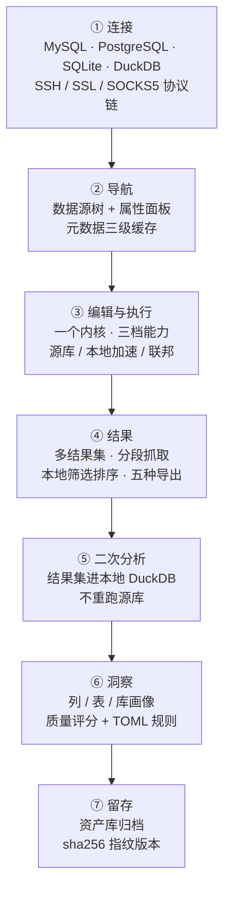
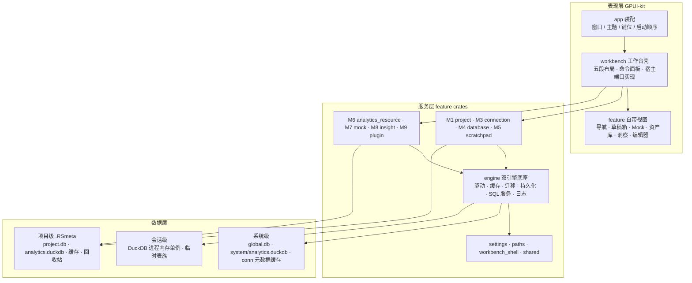
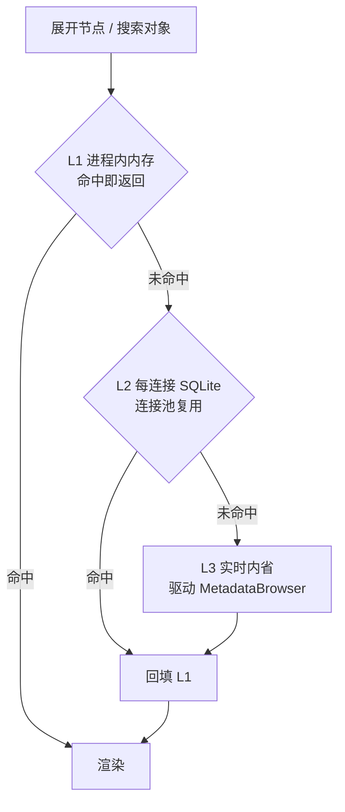

<div align="center">

<picture>
  <source media="(prefers-color-scheme: dark)" srcset="assets/public/rds-icon-dark.png">
  <source media="(prefers-color-scheme: light)" srcset="assets/public/rds-icon-light.png">
  
</picture>

<h1>RdataStation v2</h1>

**本地优先的数据库分析与查询工作台**

*Analysis begins where the query ends.*
*取数立本，分析明道；数不虚取，析不妄断。*

[](https://www.rust-lang.org)
[](https://gpui-kit.com)
[](https://duckdb.org)
[](https://sqlite.org)
[](#架构)
[](#路线图与已知边界)
[](LICENSE)

**简体中文** · [English](README.en.md)

</div>

---

> **查询跑完了，接下来呢？**
>
> 导出 CSV → Excel 打不开 → 换 Python 写 pandas → 再贴进 Jupyter……
> RdataStation v2 想补的正是这一段：**让「查询之后」的分析留在同一个工具里。**

## 目录

- [这是什么](#这是什么)
- [七个亮点](#七个亮点)
- [界面预览（设计原型）](#界面预览设计原型)
- [一条主线：从连接到结论](#一条主线从连接到结论)
- [架构](#架构)
- [模块与进度](#模块与进度)
- [与主流工具的对照](#与主流工具的对照)
- [技术栈](#技术栈)
- [快速开始](#快速开始)
- [质量与验证](#质量与验证)
- [文档地图](#文档地图)
- [路线图与已知边界](#路线图与已知边界)
- [致谢与声明](#致谢与声明)

## 这是什么

RdataStation v2 是用 **Rust + GPUI-kit** 重构的桌面数据库工作台：单体应用，16 个按业务能力组织的 crate，依赖只向下、无环，**零遥测、零云同步、零登录**。

它不试图做「又一个全能数据库客户端」。它把重心放在三段常被割裂的工作上：

| 阶段 | 通常的做法 | RdataStation 的做法 |
| --- | --- | --- |
| **取数** | 连接、浏览、写 SQL | 照做，但把地基做厚：4 类引擎 · 元数据三级缓存 · 大 schema 分页 |
| **分析** | 导出到 Excel / pandas / Jupyter | **结果集一键进本地 DuckDB**（不重跑源库）· 列 / 表 / 库画像 · TOML 规则引擎 |
| **留证** | 结果散落在临时文件里 | **资产库**：只读、有版本、带来源与 sha256 指纹，可复现 |

再加两件周边：**草稿箱**（项目私有的临时探索区）与 **Mock 造数**（把表结构变成可用测试数据，只写分析引擎，永不回源库）。

### 明确不做的事

图表 / 仪表盘 / 报表（留给插件生态）· 跨源写入 · 结果网格就地编辑 · ODBC / ADBC 主干 · 用假数据填充空态。

### 项目规模

| 指标 | 数值 |
| --- | --- |
| 工作区 crate | **16**（15 个业务/基础 crate + `app` 装配层） |
| Rust 代码 | **221,971 行**，440 个 `.rs` 文件（不含 `v1/` 历史区） |
| 迁移资产 | **4 套** SQLite / DuckDB 迁移目录，双版本账本 |
| 内置驱动 | **6 个**，覆盖 4 类引擎 |
| 文档 | 5 类模块文档集（入口 / 原型 / 交互稿 / 架构 / 开发方案 / 手册） |

## 七个亮点

### ① 双引擎 · 双层数据

SQLite 记事务元数据（连接、历史、草稿、资源目录、洞察缓存、日志），DuckDB 做分析计算（二次分析、联邦查询、画像、造数、快照）。**两套迁移器、两本版本账本，不可混用**——`ProjectAnalysis` 会被 SQLite 迁移器直接拒绝，建库产物还要断言头部 `DUCK` 魔数。

数据分两层：**系统级共享**（跨项目复用的连接与分析库）+ **项目级物理隔离**（`.RSmeta/` 随项目走，项目之间互不可见）。

### ② 查询之后的二次分析

对任意结果集点「分析」：数据被桥接进本地 DuckDB 做聚合，**不重跑源库查询**——源库断了、慢查询不想再跑一遍，照样能分析；分析的对象就是你眼前这份数据。上限 20,000 行**明示**（截断会写清「另有 N 行超出上限未参与」），结论落**新结果集**，原结果一行不动。

### ③ 为十万张表准备的元数据管线

三级缓存：**L1 进程内内存**（命中 <0.1ms）→ **L2 每连接 SQLite**（<5ms，连接池复用）→ **L3 实时内省**（10~500ms，*不是缓存*，是事实源）。命中即返回，L2 / L3 结果逐级回填。

大 schema 不硬扛：对象数 > 500 时首屏只从索引取一页 + 「加载更多」按 offset 追加；计数直接来自索引，展开 schema 不再为标题里的数字全量物化；内省级别按对象数自适应降级。

### ④ Mock：把表结构变成可用的测试数据

**不读你的数据，只读结构**（列名 / 类型 / 可空 / 主键）。**143 种生成器 · 15 个分类**，含对数正态 / 泊松 / 指数 / 帕累托 / Beta / 二项等分布族（自建实现，不引第三方分布库）与时序数值；**工作日历落在列上**（工作周掩码 `1111100`、节假日、调休、可跨零点的上下班时段）。

三条硬边界：生成 ≠ 写入（生成只产内存临时表 + 预览）· 只能落分析引擎与项目文件（**代码里没有任何一条写回源库的路径**）· 出口绝不覆盖已有表。同 seed 同配置 → 逐值可复现。

### ⑤ 洞察：加一个 TOML 就多一种规则

列画像 / 表探查 / 多列 / Schema 报告 / 快照历史五个 Tab，一个目标一份结论，**采样口径永远写在界面上**（`LIMIT 500`）。

规则引擎三层作用域（内置 16 条 → 全局 → 项目），**正文以文件为唯一真相源**（进 git、可 diff、目录一改即热加载）；两道安全门：规则 SQL 过解析期静态门，项目规则过信任门。四维加权质量分（完整度 / 唯一性 / 类型一致性 / 分布，阈值 85 / 70 / 50 / 30），**空表不给假分数**。

### ⑥ 本地优先，凭据不出门

无遥测、无云同步、无账号体系。连接密码以 **AES-256-GCM** 落盘（`AES:` 前缀、幂等加密，启动时一次性迁移明文存量）。网络链支持 SSH 隧道 / SSL / SOCKS5 代理，含 known_hosts 校验。**严格模式不做静默降级**：缺少认证或网络档案时如实报错，而不是悄悄用明文重连。

### ⑦ 工程纪律：端口与契约

视图层的核心模式是**宿主端口**——feature crate 定义 `trait XxxHost` 并自带视图，`workbench` 只做转接，`workbench_shell` 只放两侧共用的纯数据。四个后台任务模块同构（进程级单工作线程 + 结果槽 + 定时泵），**`render` 是纯读路径**。

有自动化契约测试盯着两条硬规矩：**零裸尺寸**（尺寸只走 `crates/workbench_shell/src/ui.rs` 常量）与**零裸色值**（取色只走主题 token）。规则文档写着「宣传稿的铁律：数字只为表达服务，口径以模块文档为准」。

## 界面预览（设计原型）

> ⚠️ **这些是设计原型，不是应用截图。** 仓库自带的 `*-prototype.html` / `*-showcase.html` 是**自包含、可离线打开**的交互稿（明暗双主题可切、多状态可点），用来在实现前锁定布局与交互；它们与《UI 规格》《主题设计》同源，但**不是运行中应用的截图**。

**怎么看**：克隆仓库后用浏览器直接打开对应文件即可（无需构建、无需联网）。在 GitHub 文件地址前加 `https://htmlpreview.github.io/?` 也能在浏览器里直接预览——该预览服务非本项目提供，可用性不保证。

| 模块 | 原型文件（浏览器打开） | 能看到什么 |
| --- | --- | --- |
| 工作台整体布局 | [`layout/layout-proposal.html`](docs/architecture/layout/layout-proposal.html) | 五段布局：标题栏 / 活动栏 / 左右 Dock / 状态栏 |
| SQL 编辑器 | [`editor/editor-prototype.html`](docs/architecture/editor/editor-prototype.html) | 三模式（文本 / SQL / 分析）· 执行中与中断 · 结果集上限淘汰 · 快速过滤 · 单元运行与 stale |
| 数据源树 | [`database/database-navigator-prototype.html`](docs/architecture/database/database-navigator-prototype.html) | 双通道徽标 · 归属域列 · 「筛选 ▾」弹层 · 右键菜单 · 空态 · v5→v7 密度对比 |
| 洞察 | [`insight/insight-prototype.html`](docs/architecture/insight/insight-prototype.html) | 五个 Tab 可切换 · 质量色阶 · 规则对话框（含禁用与校验失败）· 空态 / 骨架 / 过期错误 |
| Mock 造数 | [`mock/mock-prototype.html`](docs/architecture/mock/mock-prototype.html) | **18 个场景**：导入结构 · 生成中 · 生成器分类与搜索 · 列编辑 · 场景模板 · 多表结果 |
| 资产库 | [`analytics_resource/analytics-resource-prototype.html`](docs/architecture/analytics_resource/analytics-resource-prototype.html) | **12 个场景**：归档 · 取回 · 版本历史 · 回收站 · 索引修复 · 只读被拒 |
| 草稿箱 | [`scratchpad/scratchpad-prototype.html`](docs/architecture/scratchpad/scratchpad-prototype.html) | 项目工作区 · 树与交互 |
| 项目管理 | [`project/project-prototype.html`](docs/architecture/project/project-prototype.html) | 选择器 · 卡片菜单 · 新建 / 设置 · 只读置灰 · 删除需输入项目名 |
| 数据源连接 | [`connection/connection-dialog-prototype.html`](docs/architecture/connection/connection-dialog-prototype.html) | 新增连接对话框 · 五个 Tab |
| Quick Open | [`quick_open/quick-open-prototype.html`](docs/architecture/quick_open/quick-open-prototype.html) | **9 个场景**：名称 / 全文档 / 命令（`>`）/ 单字符门槛 / 无匹配 |
| 设置页 | [`settings/settings-prototype.html`](docs/architecture/settings/settings-prototype.html) | 分段 · 开关 · 搜索 · 恢复默认 · 深色 |
| 明暗主题 | [`theme/theme-preview.html`](docs/architecture/theme/theme-preview.html) | RDS Light / Dark 色卡对照 |

想看带讲解的**视觉版宣传页**，可打开各模块目录下的 `*-showcase.html`（首屏是工作台线框，可点着切状态）。

## 一条主线：从连接到结论



工作台是**五段布局**：标题栏 36px · 左右活动栏 48px · 左右 Dock 边栏（起步 240 / 280，随字号缩放）· 状态栏。边栏三模式（显示 / 隐藏 / 收起），**状态权威同步点在 `render`**，单向从共享状态流向 Dock。

### 编辑器：一个内核，三档能力

文本模式（不与数据库通信的记事本）⊂ SQL 模式（脚本窗口）⊂ 分析模式（文档变成可执行单元）。**模式只决定挂上哪些服务与结果区**，核心始终是 SQL。

- **执行**：当前语句 / 选区 / 全部 / 批量 / 新结果标签页，五条入口 × **三条执行通道**（源库 · 本地 DuckDB 加速 · 联邦），不可用的通道会置灰并写明原因。
- **结果**：结果集上限 5 个（淘汰最久未选中的）· 首段 1000 行、滚到底自动续取、未知总数写 `N+` · 本地筛选排序 · 冻结列 · 「从 N 行起」按行定位。
- **真实**：行的来源（血缘）、连接、耗时、影响行数都写在工具栏上；失败也留痕，不回填假值。「注册了才宣传」——没绑定的快捷键不写进文档。

## 架构

### 三层与 16 个 crate



**依赖规则**：`app → feature → engine / shared → gpui-kit`。Feature 不得反向依赖 App Shell，也不得进入另一个 Feature 的内部；彼此协作走明确的 command / event / 端口。共享 crate 有门槛：**同一能力有清晰名称且 ≥2 个真实使用方**才进 `shared/`。

### 元数据读取路径



元数据访问有**唯一闸门** `database::MetadataService`，下接驱动 `MetadataBrowser`。缓存**只增不自动删**，是用户可见、可管理的资产（提供《缓存管理》对话框按连接查看大小与删除）——这是刻意的取向：指向同一物理库的连接重开后应当秒开，所以缓存必须落盘。

### 模块速查

| crate | 一句话 | 内部依赖 |
| --- | --- | --- |
| `app` | App Shell：启动装配、键位、主题、全局库初始化 | 几乎全部 |
| `workbench` | 五段布局、共享状态、命令面板、**所有宿主端口实现** | 多个 feature crate |
| `workbench_shell` | 纯数据 + 尺寸常量 + 产品 token（零反向依赖） | gpui-kit / serde |
| `project` (M1) | 项目生命周期、`.RSmeta`、实例锁、名册 | engine / shared / paths |
| `connection` (M3) | 传输层：协议链（SSH / SSL / 代理）、URL、DuckDB Secret | shared |
| `database` (M4) | 导航域模型 + `NavigatorService` + `MetadataService` + 缓存 | engine / shared / workbench_shell |
| `engine` (M2) | 双引擎、驱动层、连接管理、多级缓存、迁移、持久化、SQL 服务、日志 | shared / paths |
| `editor` | SQL 编辑器内核 + 执行编排 + 结果 / 历史 | engine / shared |
| `scratchpad` (M5) | 草稿箱：文件语义 + 回收站 + 监控 | shared / gpui-kit / workbench_shell |
| `analytics_resource` (M6) | 资产归档 / 取回 / 版本（sha256 指纹） | engine / shared |
| `mock` (M7) | 元数据驱动造数（只进分析引擎） | engine / shared |
| `insight` (M8) | 列 / 表 / 库画像 + TOML 规则引擎 | engine / shared |
| `plugin` (M9) | WASM / Sidecar 宿主（**未接通**） | engine / shared |
| `settings` | 应用级偏好登记 / 持久化 / 设置页 | gpui-kit / workbench_shell / paths |
| `paths` | 运行时路径唯一解析点（最底层） | dirs |
| `shared` | 错误 / 模型 / 加密 / 拖放（**≥2 使用方才可进入**） | paths / gpui-kit |

### 目录结构

```
RdataStation-v2/
├── Cargo.toml               # workspace：16 个 crate + 依赖唯一入口 [workspace.dependencies]
├── .cargo/config.toml       # 命令别名 / RUST_MIN_STACK / DUCKDB_LIB_DIR / RDS_HOME
├── .agents/skills/          # 5 份项目内 Agent 技能：架构 / GPUI-kit / 布局 / 主题 / UI 规格
├── assets/
│   ├── themes/              # 主题定义与产品语义 token
│   ├── icons/  public/      # 应用图标与品牌资产
├── crates/                  # 16 个 crate（见上表）
├── docs/
│   ├── architecture/        # 架构说明（模块文档集：入口 / 原型 / 交互稿 / 架构 / 方案 / 手册）
│   ├── migration/           # v1 → v2 迁移映射与命令退役记录
│   └── README.scaffold.md   # v2 初期的脚手架与迁移说明（存档）
├── third_party/duckdb/      # DuckDB 预编译内核（不入库，由脚本获取）
├── tools/                   # 取库 / 体积体检 / 目录生成脚本
└── v1/                      # v1 源码暂存区（Vue3 + Tauri，不参与编译）
```

## 模块与进度

状态口径：**✅ 主线可用** · **🟡 部分可用**（有具名缺口） · **⛔ 未接通**。缺口一列全部取自各模块文档的权威待办清单，不做美化。

| 模块 | 一句话定位 | 状态 | 代表性能力 | 已知缺口 |
| --- | --- | --- | --- | --- |
| **M1 project** | 一实例一项目；名册与本体分离；OS 字节锁 | ✅ | 项目选择器（facet 搜索 / 固定 / 最近）· 未保存拦截与只读逃生口 · 重命名不改磁盘目录名 · 内置示例项目 | 窗口退出草稿兜底 · 项目目录移动 · 提升 / 快照 |
| **M2 engine** | 双引擎底座 + 统一数据访问层 | ✅ | 6 驱动两层 trait · 双迁移账本 · `sqlglot` 唯一接入点 · 自写语句切分（能吃半截 SQL） | 缓存层与持久化层仍有零调用项（清单见接线矩阵 §7）· 增量同步未接 |
| **M3 connection** | 把「一个数据源该怎么连」做完整、做诚实 | ✅ | 五 Tab 对话框 · **测试连接 = 真实连一次** · 协议链与隧道注册表 · DuckDB Secret 加速通道 · 零 UI 造数据 | SSH 主机密钥默认放行 · Secret 无门控不清理 |
| **M4 database** | 把「有哪些数据源、里面有什么」做成一眼可读的树 | ✅ | 归属域 `P/G/GP` 列 · 分组=结构 / 标签=检索 · 双通道徽标 · 三级缓存 + 索引分页 · 跨连接搜索（名称档 + 内容档 `#`）· **搜索结果「在树中定位」**（含大 schema 跳页）· 预热与邻接预取 | 虚拟列表 · PG 跨库浏览 · 导航面板内不提供内容档 |
| **M5 scratchpad** | 单个项目私有的临时探索工作区 | ✅ | 导入 vs 引用 · 项目级回收站 + 撤销栏 · 内容搜索与全局替换 · 文件监控 · 冲突条 + 行级 diff（判据是内容不是 mtime） | Phase D（归档 / 取回 / 版本）· 系统拖入导入 · 命中跳转到行 |
| **M6 analytics_resource** | 只读、有版本、带来源的正式存档 | ✅ | 指纹决定版本（未变不增版）· 归档凭证三件套 · 三类孤儿索引修复 · 只读三重守卫 · 项目级回收站 | Phase 4 分析表档 · Phase 5 引用档 · 内容预览 |
| **M7 mock** | 把表结构变成可用的测试数据 | ✅ | 143 生成器 / 15 分类 · 分布族与时序 · 列级工作日历 · 6 套场景模板与列依赖 · 跨库直写落库 · 四条出口 | 出口不可取消 · 大导出非流式 · 并发生成 |
| **M8 insight** | 把数据变成结论 | ✅ | 五 Tab 面板 · 四维质量分 · 16 条内置规则 + 三层作用域 + 热加载 · 快照版本对比 · 结构洞察走驱动元数据（SQLite 可用） | 分析表型存档入口 · 解析级策略门 · 表 / 库级快照 |
| **M9 plugin** | WASM / Sidecar 宿主，四类扩展点 | ⛔ | 设计文档与包结构已就绪 | **整包无调用方**；两个 0 字节模块；等 beta3 立项 |
| **editor** | 一个内核、三档能力 | ✅ | 三条执行通道 · 分段抓取 · 真实事务与中断 · 五种导出 · 格式化 / 十种方言转译 / 执行计划 · 补全与模板 · 会话跨重启 | Phase 1c 分析单元（搁置）· 值预览 / 编辑 · 血缘持久化 |
| **federation** | 多源挂进同一条 DuckDB 会话的只读跨源查询 | 🟡 | 源清单浮层 · 主源语义 · 层级策略 L1 / L2 · 扩展显式管理（关掉自动下载）· 凭据脱敏出口 | L3 桥接 · SQL Server 真机 · 扫描量可见 |
| **quick_open** | 元数据搜索与命令面板 | ✅ | 三前缀（`>` 命令 / `#` 全文档 / `@`）· 名称档走 `metadata_index` · 内容档走 `metadata_fts` trigram · 十万对象延迟 **158ms → 1.5ms** | 源码（视图 / 例程定义）未进 FTS · 命中后树内定位（导航面板已接，**Quick Open 命中行未接**）· `@` 当前连接限定（Phase 2） |
| **settings** | 偏好登记 + 原子持久化 + 设置页 | ✅ | 三分法作用域（应用 / 项目 / 会话）· 登记表 + 准入五条 · 原子写 | `effect` 字段无人消费 · 无跨进程写锁 |

### 未接通与已知缺口的完整口径

本仓库对自身状态的记录比多数项目更细：`docs/architecture/core-design-current.md` 有一张「设计健康度总表」和一份「文档偏差清单」，逐项说明哪些能力是活的、哪些是零调用、哪些文档已经过期。**改实现前请读它**——它比任何单篇架构文档都新。

## 与主流工具的对照

> **对照口径（重要）**
> 关于其他产品，本文只陈述其**公开的形态与产品取向**，不推断内部实现——DataGrip 为闭源商业产品，DBeaver 的可引用资料也集中在产品行为层面。本仓对该口径的完整说明见 `docs/architecture/database/metadata-cache-vs-dbeaver-datagrip.md`。
> 关于 RdataStation 的每一格，都有代码与测试为依据（基线日期见 [质量与验证](#质量与验证)）。
> **本节的结论不是「谁更好」，而是「各自的取舍在哪里」。**

| 维度 | DBeaver | DataGrip | Navicat | TablePlus | Beekeeper Studio | **RdataStation v2** |
| --- | --- | --- | --- | --- | --- | --- |
| 形态 · 许可 | 开源社区版 + 商业版 | 闭源商业（IDE） | 闭源商业 | 商业 · 有免费额度 | 开源社区版 + 商业版 | 开源项目 · **MIT** |
| 引擎覆盖 | JDBC 生态，覆盖面广 | 内置多方言 | 多引擎分版本 | 常见主流引擎 | 常见主流引擎 | 4 类引擎 / 6 个驱动 + 联邦挂载 Oracle |
| 元数据缓存 | 会话内内存，重连重拉 | 本地持久模型 + 内省级别 | 持久缓存，成熟 | 轻量，会话为主 | 轻量，会话为主 | 每连接 SQLite + L1 内存 + **用户可管理的资产** |
| 十万表大库 | 懒加载 + 客户端过滤 | 内省级别 + 分库懒加载 | 懒加载 | 懒加载 | 懒加载 | **索引分块分页**（>500 首屏只取一页） |
| 大库元数据搜索 | 基于已加载 / 按需查询 | Search Everywhere（走本地缓存） | 有对象搜索 | 有对象搜索 | 有对象搜索 | 跨连接名称搜索（走 `metadata_index`，索引级） |
| 查询之后 | 导出 / 数据编辑 / 图形化 | 分析图表 + IDE 智能 | 数据迁移 / 同步 / 备份 | 专注查询与编辑 | 专注查询与编辑 | **结果集就地进 DuckDB 二次分析 · 画像 · 归档** |
| 扩展方式 | Java 插件生态，成熟 | IDE 插件生态 | 有限 | 有限 | 有限 | WASM / Sidecar 宿主（**设计中，未接通**） |

### 各有所长

这几款产品把不同的事做到了很高水准，值得单独说清楚：

- **DBeaver** —— 开源社区的一份厚礼。JDBC 生态让它能连的引擎种类最广，「刷新就是刷新」的心智模型最简单；插件生态与数据编辑能力都很成熟。
- **DataGrip** —— SQL 编辑体验的标杆。本地持久化的对象模型让断连也能看结构、能补全、能全库搜索（Search Everywhere），内省级别让大库体验最好——本项目的内省级别与「从缓存搜索」正是向它学习的结果。
- **Navicat** —— 以稳定与易用著称。数据同步 / 传输 / 备份 / 定时任务这类「数据库运维日常」做得最完整，是很多企业用户的默认选择。
- **TablePlus** —— 原生、轻快、克制。启动与交互手感极佳，多引擎支持却不臃肿，适合「随时打开看一眼」的用法。
- **Beekeeper Studio** —— 现代友好的开源选择。界面清爽、上手成本低，社区版对小团队的日常查询足够好用。

### 分场景建议

- 要连的引擎种类多（Oracle / DB2 / Snowflake / 国产库……）→ **DBeaver** 的覆盖面最省心。
- 要 IDE 级的 SQL 智能、重构与团队协作 → **DataGrip**。
- 要商业级的数据同步 / 迁移 / 备份 / 定时任务 → **Navicat**。
- 要即开即用、轻快顺手 → **TablePlus** 或 **Beekeeper Studio**。
- 如果工作常常停在「结果出来了，接下来呢」——那正是 RdataStation 想补的那一段。

### 本项目的自我约束：为什么不照抄

对标产品的同时，本仓给自己立了三条硬约束（详见对比文档 §3），它们解释了为什么有些「更省事」的做法没有被采用：

1. **元数据缓存是资产，不是临时物**——落盘且**永不自动删除**，因此必须能回答「这个文件是谁的、能删吗、删了会怎样」。DBeaver 不落盘，不需要操心这件事。
2. **要服务的不止导航**——Mock 导入列结构、SQL 生成的列模板读的是同一份缓存，所以缓存记录的是**驱动层结构**（`SchemaObject` / `ColumnDetail`），不是「UI 节点」。
3. **单进程 + 项目锁**——同一项目同时只有一个实例，让「每连接一个 SQLite 文件 + WAL」成为安全选择；换成多实例并发写同一缓存文件，就必须像 DataGrip 那样处理跨进程一致性。

也**有意不学**两点：不照搬「会话内不落盘」（本项目需要无活连接时也能出结构），不引入「本地模型 ↔ 库结构」的双真相源（只存「上次从驱动读到的事实」，过期判断只靠 `fresh` 与 TTL）。

## 技术栈

| 领域 | 选型 | 用途 |
| --- | --- | --- |
| 语言 | Rust · edition 2024 | 全栈（前端也是 Rust，无 JS 运行时） |
| UI | **GPUI-kit 0.6.1** | 视图层；与 `gpui-base` / `gpui-component` 版本强绑定，整体升降 |
| 分析引擎 | **DuckDB 1.5.5**（动态链接，crate `1.10505.0`） | 二次分析 / 联邦 / 画像 / 造数 / 快照 |
| 元数据库 | **rusqlite 0.40**（bundled） | 事务元数据 + 三层缓存的 L2 |
| 驱动 | sqlx 0.9（MySQL / PostgreSQL）· `mysql_async` · `tokio-postgres` · rusqlite · duckdb-rs | 6 个驱动，2 个引擎各两条实现（sqlx 版与官方客户端版） |
| 连接安全 | russh 0.63（ring 后端）· native-tls · tokio-socks · x509-parser | SSH 隧道 / TLS / SOCKS5 代理 / 证书解析 |
| SQL 工具链 | **sqlglot-rust 0.10.29**（精确锁定） | 解析 / 格式化 / 转译 / 令牌化高亮 / 筛选改写 / DDL 构造 |
| 异步 | tokio 1.53 · tokio-util · futures · async-trait | 全域异步；导航侧另有进程级桥接运行时 |
| 加密 | aes-gcm 0.11 · sha2 · hex · base64 | 凭据 AES-256-GCM；资产 sha256 内容指纹 |
| 可观测 | tracing · tracing-subscriber · tracing-appender | 一条事件三出口（stderr / 按天文件 / `app_logs` 表）+ 脱敏 |
| 造数与文件 | fake 5.1 · notify 7 · rfd 0.17 · similar 3.2 · opener | Mock 语料 / 草稿箱监控 / 原生文件对话框 / 行级 diff / 资源管理器定位 |
| 插件宿主 | extism 1.30 · reqwest 0.12 | WASM 运行时与 Sidecar JSON-RPC（**尚未接通**） |

依赖治理：**版本唯一入口**在根 `[workspace.dependencies]`，crate 内一律 `dep.workspace = true`；gpui-kit 家族 / `specta` / `sqlglot-rust` / `arrow`（跟随 duckdb）四者精确锁定。详见 `docs/architecture/dependencies/dependency-strategy.md`。

## 快速开始

### 0. 前置：取 DuckDB 预编译内核

DuckDB 内核走**动态链接**（不再开 `bundled`）：编 C++ 内核单次数分钟，且并发链接静态库会耗尽内存。

```bash
# 每台机器 / 每个版本跑一次；Windows 请在 Git-Bash 或 MSYS 中运行
tools/fetch-duckdb.sh

# 取完自检
cargo check -p rds-engine
```

库落在 `third_party/duckdb/1.5.5/`（已 gitignore，`cargo clean` 不会删它）。**crate 版本与库版本必须成对升级**：`1.10505.0` ↔ DuckDB `v1.5.5`（第二段十进制数 `10505` → `1.5.5`）；版本不匹配会在**运行时**表现为缺符号，而不是编译报错。

### 1. 构建与运行

```bash
cargo check --workspace     # 工作区检查
cargo run -p rds-app        # 启动工作台窗口

cargo check-all             # = check --workspace --all-targets
cargo test-all              # = test --workspace -j 2（必须限制并发）
cargo clippy-all            # = clippy --workspace --all-targets
```

### 需要注意的几件事

| 事项 | 说明 |
| --- | --- |
| **必须 `-j 2`** | 全量编译时多个 rustc 同时链接重型 crate 会耗尽内存 |
| **不要去掉 `RUST_MIN_STACK`** | edition 2024 下视图层深链式 builder 在 codegen 阶段递归更深；缺了它会表现为 `cargo check` 正常但 `cargo build` / `cargo test` 崩溃 |
| 默认构建不含 `plugin` | `default-members = ["crates/app"]`，`plugin` 不在 app 依赖图上，裸 `cargo test` 也不会覆盖它 |
| 开发期数据根是 `.rds/` | `RDS_HOME` 与 `TEMP` 都被钉到仓库内，避免一次 `cargo clean` 清掉 `global.db` 与密钥库；命令行显式 `RDS_HOME=<某处>` 仍可覆盖 |
| `target/` 会膨胀 | `tools/target-guard.sh` 体检（默认 60 GB 阈值，超出退出码 1），`tools/target-guard.sh --clean` 清理可再生文件 |
| Linux / macOS | 需 `LD_LIBRARY_PATH` 指向 `third_party/duckdb/1.5.5`（Windows 由 `build.rs` 自动拷贝 dll） |

## 质量与验证

测试分四层：**纯函数单测** → **GPUI headless 窗口测试** → **集成 / 契约测试** → **真机探针**（需真数据库，默认 `#[ignore]`，约定「默认 `cargo test` 不依赖外部服务」）。

| 套件 | 本轮实测（2026-09-19） |
| --- | --- |
| **全工作区** | **84 个目标 · 1983 通过 · 51 忽略 · 0 失败**（含 1 项本机诊断脚本，见下） |
| `rds-engine --lib` | **443 通过 / 24 ignored** |
| `rds-editor --lib` | **377** |
| `rds-insight` | lib **227** + 端到端集成 **14** |
| `rds-mock` | lib **190** + 引擎集成 **37** + 持久化往返 **5** + 历史模板 **4** + 清理 **2** |
| `rds-workbench --lib` | **113** |
| `rds-analytics-resource` | lib **125** + 面板窗口 **18** + 对话框窗口 **9** |
| `rds-connection` | lib **48** + `tunnel_roundtrip` **4** |
| `rds-project` | lib **43** + 集成 **5** |
| `rds-database` | lib **54** |
| `rds-scratchpad` | lib **37** |
| `rds-shared` · `rds-settings` · `rds-plugin` · `rds-paths` · `rds-workbench-shell` | **22** · **21** · **11** · **11** · **1** |
| `ui_contract`（界面契约） | **7**（零裸尺寸 / 零裸色值 / 面板登记 / 共享字段白名单） |

> 上表是**同一次 `cargo test-all`** 的实测结果（Windows · stable · `-j 2`）。**逐目标台账与复现命令见 [`docs/architecture/module-status.md`](docs/architecture/module-status.md)**；当前全仓编译零告警（`cargo check --workspace --all-targets`）。
>
> **口径**：84 个目标里有 1 个是 `rds-workbench --test zz_fixture_probe`——一个**本机专用诊断脚本**（四条真机连接自检），已从版本控制中移除并加入忽略规则（本机文件保留）。去掉它，**项目自身套件 = 83 个目标 / 1982 项通过**。它本轮通过；上一轮曾因目标 DuckDB 文件被别的程序占用而失败（`File is already open in … dbeaver.exe`），**与代码无关**。同一轮里该脚本的 MySQL / PostgreSQL / SQLite 六条链路（测试连接 + 真实连接）**全部通过**。

真机探针（需环境变量，默认不跑）：`editor_exec_real`（6 驱动）· `duckdb_accel_probe` · `duckdb_export_probe` · `federation_probe` · `federation_credentials_probe` · `oracle_probe` / `oracle_federation` · `sqlglot_capabilities` · `transaction_affinity` · `insight_schema_real` / `insight_source_real`。

### 这个项目如何对待自己的缺陷

值得单独一提：仓库把「文档声称」与「代码实测」分开记录。`core-design-current.md` 每一条都标 **［档］**设计文档如此 / **［验］**代码实测如此 / **［偏］**两者有偏差，并保留一份**已修缺陷清单**（例如：建项目曾产出 SQLite 格式的 `analytics.duckdb`、`delete_schema` 引用不存在的表导致刷新静默失效、L1 缓存恒空只失效不填充、每次缓存访问都重开 SQLite）。v1 → v2 迁移过程中还修掉了一批「看着有、实际是假」的底座（永远为空的评分卡、硬编码 `false` 因而从未显示过的加速按钮、从未编译过的测试文件）。

## 文档地图

想深入哪一块，从这个顺序进去最快：

| 你想了解 | 从这里开始 |
| --- | --- |
| **最快建立全貌** | `docs/architecture/core-design-current.md` —— 现状版核心设计，含健康度总表与文档偏差清单 |
| **模块状态与测试基线** | [`docs/architecture/module-status.md`](docs/architecture/module-status.md) —— 全仓唯一一份「刚跑过」的台账：逐包基线、接通状态、复现命令 |
| 架构总览 | `docs/architecture/overview.md` |
| 各模块（M1–M9） | `docs/architecture/<模块>/README.md` 是入口，每个模块配五类文档：入口 / 原型设计 / 交互稿 / 架构 / 开发方案 / 使用手册 |
| 布局 / 主题 / UI 规格 | `docs/architecture/layout/` · `theme/` · `ui/ui-design-spec.md` |
| 依赖与 DuckDB 链接 | `docs/architecture/dependencies/` |
| v1 → v2 迁移 | `docs/migration/v1-to-v2-mapping.md` |
| 可交互原型（浏览器直接打开） | [`docs/architecture/`](docs/architecture/) 下各模块的 `*-prototype.html` 与 `*-showcase.html`（自包含、可离线；**是设计原型，不是应用截图**） |

模块文档集自成体系，各有 6 类文档（可贴版宣传页 / 视觉版宣传页 / 原型设计 / 架构与设计理念 / 开发方案 / 使用手册）。想知道「长什么样」看原型，「为什么这样设计」看架构，「做到哪了」看开发方案的 §0 进度记录。

## 路线图与已知边界

本项目**诚实标注自己还没做到的事**，这一节按「离可用有多远」排序：

**近期（有明确触发条件）**

- **编辑器分析单元（Phase 1c，已搁置）**：把分析模式做成 notebook 式单元 + 会话 + 输出。
- **元数据全文搜索**：**已接线**（名称档 `metadata_index` 中缀；内容档 `metadata_fts` trigram，注释 / 数据类型，Quick Open `#` 档 ≥ 3 字）。**仍缺**：视图 / 例程**定义文本**未进 FTS。
- **搜索结果在树中定位**：**导航面板已接**（搜索结果行的「定位」→ 展开链路并选中；大 schema 按位次直达那一页）。**仍缺**：Quick Open 命中行（跨面板：需展开左 Dock 并把焦点交给导航树）。
- **导航树虚拟列表**：当前靠分页限制条数（首屏一页 + 加载更多），十万行同屏尚未验证。
- **联邦 L3 桥接**：把无 scanner 的源按「拉行 → 临时表」接进来。

**中期**

- **插件宿主（M9）**：WASM / Sidecar 四类扩展点（驱动 / 面板 / 命令 / 设置）已有设计与包结构，**整包尚未接通**，等 beta3 立项。
- **分析表型存档（M6 Phase 4）**：让 M7 Mock 产物与 M5 编辑器结果能归档为「查询 / 分析」类存档。
- **冻结零调用**：engine 缓存层与持久化层仍有零调用项（含 5 张 v1 遗留表），需要一套机制阻止继续增长；本轮已先清理约 4.3k 行（`dbi` 死层 / 重复的扩展管理 / 持久化 v1），逐项清单见 [`data-layer-wiring-matrix.md`](docs/architecture/data-layer-wiring-matrix.md) §7。

**工程化待补**

- **CI 与格式化门禁尚未建立**（当前无 `.github/`，工作区未过 `cargo fmt`）。
- 各模块测试基线是**不同日期**的快照；现已汇总为一份实测台账 `docs/architecture/module-status.md`，改了实现请顺手更新它。
- **许可证**：**MIT**（见 [`LICENSE`](LICENSE)）。

## 致谢与声明

RdataStation 受许多优秀产品启发，架构中也确实向它们学习过（内省级别对标 DataGrip，属性面板与结果集体验对标 DBeaver，驱动描述模型参考 DBeaver 的驱动定义）。v1 的 README 里写过一段话，这里原样保留：

> DBeaver is a treasure of the open-source community. DataGrip sets the benchmark for SQL editing experience. Navicat is known for its stability and ease of use. We have deep respect for all of them.

RdataStation 不是为了取代它们而存在，而是想回答一个因历史与架构原因它们尚未聚焦的问题：**查询跑完、拿到几十万行之后，你打算做什么？**

### 友情提示

本项目处于 **alpha** 阶段，**主线可用但接通度不平均**：M1 / M3 / M4 / M5 / M6 / M7 / M8 与编辑器执行链是活的，M9 插件整包未接通。用于生产环境前请自行评估，并注意项目文档中标注的「已知缺口」。

---

<div align="center">

**取数立本，分析明道；数不虚取，析不妄断。**

[⬆ 回到顶部](#目录) · [English README](README.en.md) · [架构现状](docs/architecture/core-design-current.md)

</div>
