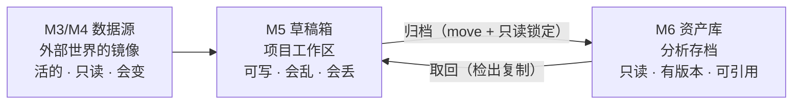
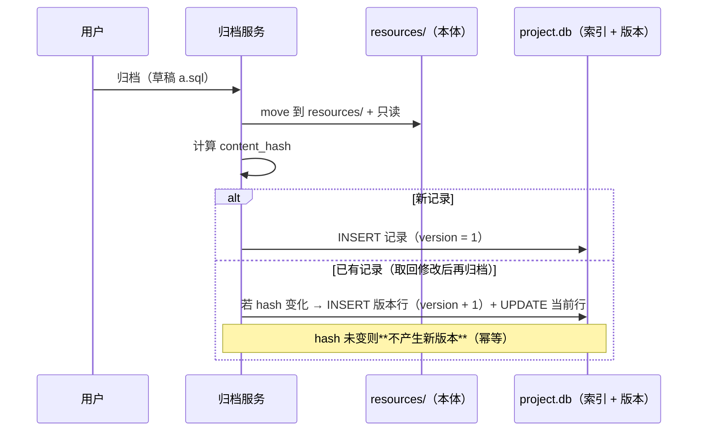

# 资产库 / 分析存档模块（M6）· 设计理念与架构

> 状态：**设计定稿（2026-09-15）；Phase 0–3 主体与 Phase 2 前七刀已落地**——领域类型、本体层、迁移 020 + 新列接入、归档→取回→再归档闭环 + 变更事件、索引修复、面板与详情、五个对话框（含回收站）、项目级回收站（P0.8 已上提中性化）、历史保留 / 默认排序 / 分组折叠三个设置项均可用；124 单测 + 27 窗口测试全绿，逐项证据见 `analytics-resource-dev-plan.md` §0。
> 仍待：`F2` 重命名（等重命名入口）、批量标签 / 分组（Phase 2）、内容预览、头部可编辑、默认分组、拖拽到分组头、`analytics_recycle_bin` 表的物理删除（现为“弃用 + 空置”）。
> 前置：v1 蓝本 `v1/backend/src/core/persistence/analytics_resource_store/` + `v1/docs/backend/ANALYTICS_RESOURCE_MANAGER_DESIGN.md`；v2 现状见 `analytics-resource-dev-plan.md` §1。
> 关联：`analytics-resource-prototype-design.md`（长什么样）、`analytics-resource-prototype.html`（交互稿）、`analytics-resource-dev-plan.md`（做什么）、`../overview.md`（M6 定位）、`../scratchpad/scratchpad-dev-plan.md` Phase D（上游）。
>
> **本文是一份语义裁决书**：它回答"资源到底是什么"，并给出由此决定的数据模型与契约。**在它被推翻之前，任何实现都应服从本文**。

## 0. 裁决摘要（一页读完）

| # | 问题 | 裁决 | 影响 |
| --- | --- | --- | --- |
| D1 | 资源是什么？ | **归档凭证**：来源 + 代码 + 内容指纹 三件套，而不是"一行元数据指向某处" | 全局 |
| D2 | 本体存在哪？ | **按 kind 分本体**（C 模型）：`File` 落 `resources/`、`Analysis` 落 `analysis.duckdb`、`TableRef` 落远端 | §2.2、§3 |
| D3 | 版本版本化什么？ | **内容指纹**（`content_hash`）变化才产生新版本；无 hash 不得递增版本 | §5 |
| D4 | 历史内容保留吗？ | **默认保留最近 5 份内容**，超出只留元数据；设置可调（`0` = 只留元数据，`-1` = 全留） | §5.2 |
| D5 | 回收站走哪套？ | **统一走项目级 `ProjectTrash`**；v1 的 `analytics_recycle_bin` 表弃用 | §7 |
| D6 | `scope`（global/project/session）？ | **改为派生只读量**（住哪个库 = 什么作用域），禁止手填 | §4.3 |
| D7 | `config` JSON 万能袋？ | **降级为 kind 专属扩展位**；核心字段必须进独立列 | §4.2 |
| D8 | 组织方式？ | **标签扶正**（多值、跨 kind）；**文件夹降级为单层分组**，不做自引用树 | 原型 §4.3 |
| D9 | 命名？ | 模块 = **资产库**；单位 = **分析存档**；动作 = **归档 / 取回**；"提升"一词**只给 M1**（项目→系统级） | §2.4 |
| D10 | 第一期做哪些 kind？ | **只做 `File`**；`Analysis` 第二期；`TableRef` 最后或不承诺 | §2.2、开发方案 §6 |

## 1. 定位与边界

| 维度 | 结论 |
| --- | --- |
| 一句话定位 | 项目的**分析存档**：把"值得留存、需被引用、要能复现"的分析产物，从工作区转成**只读、有版本、带来源、可组织**的正式资产 |
| 负责 | 归档与取回（`File` 型）、存档登记与索引、版本与内容指纹、标签与分组、搜索与检索、项目级回收站的资源侧、索引修复（孤儿检测） |
| 不负责 | 数据源连接与内省（M3/M4）、工作区文件读写（M5）、DuckDB 计算本身（M2）、Mock 生成（M7）、洞察计算（M8）、项目级→系统级提升（M1，另立设计） |
| 核心载体 | 左 Dock `LeftPanel::Resources` 面板（`workbench/src/panels/`）+ 右侧详情属性面板 + 对话框 |
| 关键约束 | **文件系统是本体权威、登记表是索引**；归档后本体不可写；版本必须绑定内容指纹；render 期零 I/O；零裸色值 / 零裸 `px` |
| 面板职责一句话 | **留证据 + 找回来**；组织归标签与分组，详情归右侧属性面板 |

### 1.1 与 M4 / M5 的三段式



| 模块 | 回答的问题 | 数据性质 |
| --- | --- | --- |
| M4 数据库导航 | 我能看到什么数据？ | 实时镜像，随源变化 |
| M5 草稿箱 | 我正在做什么？ | 工作区，可自由改动 |
| **M6 资产库** | **我留下了什么？它当时长什么样？** | **冻结的存档 + 来源凭证** |

> 边界规则：**M6 不自己取数、不自己计算、不改工作区文件**。它只做"搬运 + 登记 + 冻结 + 检索"。

## 2. 概念模型

### 2.1 实体

```
分析存档（Archive）
├── 身份：resource_id（稳定，永不变）· name · kind
├── 版本：version · content_hash · 版本链（历史行 id）
├── 来源：source（连接 / 表 / 草稿路径 / 生成器）—— 归档凭证的"出处"
├── 本体引用：file_rel_path（File）| table_name + definition_sql（Analysis）| connection_id + 表名（TableRef）
├── 组织：tags（多值）· group_id（单层分组，可空）
└── 状态：readonly · archived_at · updated_at · 回收站态（由 ProjectTrash 承载，不在登记表内）
```

### 2.2 三种 kind：本体在哪，决定复现强度

| | **`File`（第一期）** | **`Analysis`（第二期）** | **`TableRef`（最后/不承诺）** |
| --- | --- | --- | --- |
| 典型内容 | `.sql` / `.py` / `.rdsnote` / `.csv` / `.parquet` / `.md` / 图表定义 | DuckDB 表 / 视图（Mock 产物、编辑器结果落库） | 远端库表引用 |
| 本体 | `{project}/resources/<path>` | `{project}/.RSmeta/analytics.duckdb` | 远端（不在本机） |
| 可移动/冻结？ | ✅ 文件级 move + 只读 | ⚠️ 表不可移动；靠 `definition_sql` 重建 | ❌ 不可控 |
| 内容指纹取什么 | 文件字节 hash（`sha256`） | `definition_sql` + schema + 行数 的摘要 | 无（不可指纹） |
| 复现强度 | **强**：内容冻结，重跑得同解 | **中**：定义冻结，数据可重建 | **弱**：只记"当时指向哪" |
| 失效可能 | 低（文件在项目内） | 中（表被 drop / DuckDB 重建） | **高**（连接删、表改、权限变） |
| 上游 | M5 草稿箱归档 | M7 Mock 产物 · M5 编辑器结果 | M4 导航右键"登记为存档" |
| UI 标注 | `已归档` | `分析表` + 定义可查 | `引用`（**必须显式标注可能失效**） |
| 第一期 | ✅ 做 | ❌ | ❌（复核价值后再定） |

> **为什么要分 kind 而不是统一成文件**：M7 的产物是 DuckDB 表、M5 的结果集也是表。如果只有 `File` 一档，为了塞进文件模型就要"导出为 CSV"，那是本末倒置。分 kind 让每类产物用**自己最自然的本体**，代价是 UI 需要按 kind 分派（承认并接受）。
>
> **为什么 `TableRef` 排最后**：它的复现强度最弱、失效风险最高、最容易变成"死书签"——正是 v1 的老路（v1 的资源几乎全是这种）。先把强复现的两档做扎实，再决定是否需要它。

### 2.3 归档凭证 = 来源 + 代码 + 内容指纹

这三样是 M6 **不可替代的部分**，也是与"书签册"的分水岭：

| 要素 | 存哪 | 为什么必须有 |
| --- | --- | --- |
| **来源** | `source_connection_id` / `source_table` / `promoted_from`（草稿相对路径） | 回答"这结论是用什么数据得出的" |
| **代码** | 本体文件本身（`File`）或 `definition_sql`（`Analysis`） | 回答"怎么算的"——没有它就无法复算 |
| **内容指纹** | `content_hash` | 回答"还是不是当初那份"——没有它版本就是装饰 |

> M8 洞察报告、M7 Mock 产物、M5 编辑器笔记将来都可以归档到这里。**kind 会增长**，所以模型必须一开始就支持"按 kind 分派"，而不是一个万能 `config`。

### 2.4 术语表（本项目内固定）

| 术语 | 含义 | 反例（不要这样用） |
| --- | --- | --- |
| **资产库** | M6 模块名（活动栏 / 面板标题 / 文档标题） | ~~资源管理器~~、~~资源分析~~ |
| **分析存档 / 存档** | 资产库中的一条记录（实体） | ~~资源~~（歧义：与"数据源"混） |
| **归档（archive）** | 动作：草稿 → 资产库（move + 只读锁定） | ~~提升为分析资源~~（"提升"已归 M1） |
| **取回（checkout）** | 动作：资产库 → 草稿箱（复制出可编辑工作副本） | ~~检出~~、~~下载~~ |
| **提升（promote）** | 动作：**项目级 → 系统级**（M1，另立设计，本期不做） | 不要用它描述归档 |
| **本体（payload）** | 存档所指的实体内容（文件 / DuckDB 表 / 远端表） | — |
| **索引（registry）** | `project.db` 中的登记表（`analytics_resources` 等） | — |
| **复现强度** | 该存档"能否重算出同样结论"的保证等级（强/中/弱，对应 kind） | — |

> 代码标识保留 `resource` 词根（`resource_id` / `AnalyticsResourceStore` / crate 名 `analytics_resource`）——改名成本高于收益。**产品文案一律用"资产库 / 存档"，代码注释可混用但需一致。**

## 3. 存储布局：本体与索引分离

```
{project}/
├── resources/                          ← 【本体】受管文件（可见、只读、可被编辑器打开）
│   ├── analysis/dau_report.sql
│   └── data/sample.parquet
├── scratchpad/                         ← M5 工作区（可写）
└── .RSmeta/                            ← 隐藏：项目内部元数据
    ├── project.db                      ← 【索引】登记表 / 版本 / 标签 / 分组
    ├── analytics.duckdb                ← 【本体】kind=Analysis 的表与视图
    ├── resources/
    │   └── versions/<resource_id>/<version>/   ← 【本体·历史】保留的历史内容（见 §5.2）
    └── trash/                          ← 项目级回收站（M5 共用，origin = "resources"）
```

**真相源规则（硬约束）**：

| 规则 | 说明 |
| --- | --- |
| 文件系统是本体权威 | `resources/` 里有什么，就是有什么；登记表只是索引 |
| 索引可重建 | 提供"重建索引"动作：扫 `resources/` 补记录、标记无本体的记录为 `缺失`（**不做自动删除**） |
| 内部态不泄露 | `.RSmeta/**` 与点前缀路径不得经任何 API 访问（沿用 M5 `resolve_path` 的拒绝规则） |
| 单向写入 | 归档 = 写本体 + 写索引（本体成功、索引失败 → 靠重建索引自愈；索引成功、本体缺失 → 标记 `缺失`） |

> **`resources/` 目录是"受管文件模型成立"的物理证据**：它存在，说明本体真的被搬进来了。这也是拒绝纯指针模型（v1 语义）的直接理由——纯指针不需要这个目录，而 `../scratchpad/scratchpad-prototype-design.md` §1.1 已把 `resources/` 写进了项目结构（已确认决策 1/2）。

## 4. 数据模型：对 v1 `007` 的处置

### 4.1 表处置

| v1 表 | 处置 | 说明 |
| --- | --- | --- |
| `analytics_resources` | **改造**（加列 + 换语义） | 见 §4.2 |
| `analytics_resource_versions` | **改造** | 版本语义换为内容指纹版本（§5），`UNIQUE(resource_id, version)` 保留 |
| `analytics_folders` | **保留**（降级为单层分组） | 不再使用 `parent_folder_id`；`sort_order` 语义落地（或删列） |
| `analytics_resource_folder` | **保留** | 改名争议：语义变为"分组" → 建议保留表名减少噪音，文档标注 |
| `analytics_tags` / `analytics_resource_tags` | **保留**（扶正为主组织方式） | 部分唯一索引 `(name, scope) WHERE deleted_at IS NULL` 保留 |
| `analytics_recycle_bin` | **弃用** | 改走 `ProjectTrash`（§7）；表保留空置一轮再删，避免迁移期炸旧数据 |
| `resource_references` / `audit_log` | **不建** | v1 设计文档有、v1 实现从未建、v2 不承诺（依赖追踪不在本期范围） |

### 4.2 新增列（迁移 `project_meta/020_analytics_resource_archive.sql`）

> 编号说明：**编号先到先得，建文件前必须重新核对**。当前 `project_meta/` 已到 018，且 `019` 已被 M8 洞察的规则索引占用（`019_insight_rule_index.sql`）；M6 取 **020**（若届时已被占则顺延）。**不改 007**，只追加。

| 列 | 类型 | 用途 |
| --- | --- | --- |
| `kind` | `TEXT NOT NULL` + `CHECK(kind IN ('file','analysis','table_ref'))` | 三家分派的本体类型 |
| `content_hash` | `TEXT` | 内容指纹（`File`：文件 sha256；`Analysis`：定义+结构摘要）。`TableRef` 为空 |
| `file_rel_path` | `TEXT` | `resources/` 下的相对路径（`kind=file`） |
| `readonly` | `INTEGER NOT NULL DEFAULT 1` | 归档后只读标记（应用层守卫；文件系统属性是第二层，见 §6.3） |
| `promoted_from` | `TEXT` | 来源草稿相对路径（归档凭证的"出处"） |
| `source_connection_id` | `TEXT` | 来源连接（可空） |
| `source_table` | `TEXT` | 来源表 `schema.table`（可空） |
| `definition_sql` | `TEXT` | `kind=analysis` 的重建定义（可空） |
| `archived_at` | `TEXT` | 归档时间（与 `updated_at` 区分开） |

**`config`（JSON）的降级规则**：

1. 核心语义**必须**进独立列（上表）；
2. `config` 只承载 **kind 专属的可选扩展**（例：图表定义、列宽、导出选项）；
3. 任何进入 `config` 的字段**必须在 UI 有明确入口**，否则视为死字段；
4. 不新增 `CHECK(json_valid())` 之外的约束（v1 已有该 CHECK，保留）。

> 这是对 v1 最直接的纠偏：v1 把"连接 id、表名、文件路径"全塞进 `config`，导致无法建索引、无法做表单、搜索只能 `LIKE name OR alias`。

### 4.3 `scope` 的处置

| | v1 / 现行 v2 | v2 裁决 |
| --- | --- | --- |
| 形态 | 可自由填写的列（`global` / `project` / `session`）+ `CHECK` | **派生只读量**：住哪个库 = 什么作用域 |
| 落点 | 数据永远住项目库，"global" 只是标签（假全局） | 第一期只产 `project`；`global` 由 M1 提升后住在 global 库时**派生** |
| UI | 作用域筛选器（v1 `FilterBar` 有） | 不作为可编辑字段；详情面板**只读展示** |

理由：M1 的"项目级 → 系统级"（`../project/project-dev-plan.md` 明确"范围外、另立设计"）一旦落地，作用域必须由**存储位置**决定；若继续允许手填，届时需做数据迁移，且必然出现"标着 global 却躺在项目库"的脏数据（v1 已如此）。

## 5. 版本语义

### 5.1 内容指纹是版本的唯一触发条件



**与 v1 的本质差别**：

| | v1（写前快照） | v2（内容指纹） |
| --- | --- | --- |
| 存什么 | 更新前的**元数据行** JSON | 内容指纹 + 登记行 + 来源绑定 |
| 触发 | 任何 `update_resource` 调用 | **只有内容真的变了** |
| 改个别名 | 消耗一个版本号 | 不产生版本 |
| 内容变了但没走 update | 版本不变（假版本） | hash 变化即新版本 |
| 并发冲突 | `INSERT OR IGNORE` 静默吞掉 | 冲突即报错（`UNIQUE(resource_id, version)`） |
| 清理 | 无，永久膨胀 | 内容按§5.2 保留；元数据版本行保留（一行 JSON 很小） |

### 5.2 历史内容保留策略（默认保留最近 5 份）

| 项 | 规则 |
| --- | --- |
| 默认 | **保留最近 5 个版本的内容副本**（`.RSmeta/resources/versions/<resource_id>/<version>/`） |
| 超出 | 只删**内容副本**，版本行（元数据 + hash）**永久保留** |
| 可配置 | 设置项 `resources.keep_versions`（`0` = 只留元数据；`-1` = 全留；默认 5），落 `settings.json`——**已接**（2026-09-18）：主线程读设置 → `KeepVersions::from_setting` → 随归档 / 版本还原作业带入服务；归档对话框的「保留历史内容」可本次覆盖（同样接 `-1`） |
| 为什么 | 只读锁定下内容只在"取回→改→再归档"时变化，副本增长可控；而对做报告/合规的场景，旧内容是刚需 |
| 不做的 | 不做内容去重（同 hash 多版本共用副本的成本优化推迟）、不做自动过期清理（用户显式管理） |

> 备选方案（未采纳）：只留元数据不留内容副本（最省盘，但"可复现"退化为"记录过曾有的 hash"）；或内容寻址存储（最优雅，但需要对用户隐藏目录结构，第一期过重）。

### 5.3 版本链

- 版本行新增"上一版本行 id"语义（复用 v1 的 `parent_version_id` 列，**语义重定义**）。
- v1 的 `parent_version_id` 恒等于自身 `id`（`crates/analytics_resource/src/resource.rs:83` 附近传 `Some(&current.id)`）——**无信息量，必须修**。
- 若实现中发现链式检索无实际用途（版本本来就是线性序列），允许**直接废掉该列**（迁移 `DROP COLUMN`），不留噪声字段。

## 6. 归档与取回（跨模块契约）

### 6.1 依赖方向

```
scratchpad ──► analytics_resource ──► engine, shared
（发起方）        （服务方）              （底座）
```

- **M5 发起，M6 执行**：草稿箱知道"我有什么"，资产库知道"该放到哪、怎么登记"。
- M6 **不依赖 M5**：归档入参是 `PathBuf` + 元数据（来源绑定、标签），不是 `ScratchpadStore` 的类型。这样 M7/M8 将来也能用同一个入口。
- 视图互不依赖：草稿箱面板不 import 资产库视图，通过 service + 事件协作。

### 6.2 事件契约（替代 v1 的死事件）

| 事件 | 载荷 | 消费方 |
| --- | --- | --- |
| `ResourcesChanged` | `{ reason: Archived / Updated / CheckedOut / Undone / Restored / Trashed / Untrashed, resource_id }`（**当前已实现这七个**；`IndexRebuilt` 随索引修复的批量重建落地） | 资产库面板（刷新列表）、草稿箱面板（刷新树）、编辑器（只读态/标签失效） |

- v1 的 `analytics-resource-changed` 是 Tauri `app.emit`，**前端零监听**（链路是断的）。v2 没有 Tauri 事件总线，改用**服务上的可观察状态 + 订阅**（`watch` 通道或共享 `Entity`），并且**发/收两端同时落地**才有意义。
- 事件必须带 `reason`：面板据此决定"局部更新"还是"整表刷新"（v1 只有无载荷的"变了"）。

### 6.3 归档动作的完整语义（顺序敏感）

| 步 | 动作 | 失败处理 |
| --- | --- | --- |
| 1 | 校验源文件存在、非隐藏、未在资产库内 | 失败即中止（不改动任何状态） |
| 2 | 目标路径冲突检查（`resources/<相对路径>`） | 冲突 → 询问（改名 / 取消），不静默覆盖 |
| 3 | 计算 `content_hash` | 失败即中止 |
| 4 | **move** 本体到 `resources/`（跨设备退回复制+删除，沿用 M5 `rename→copy` 兜底） | 失败即中止 |
| 5 | 设只读：文件系统属性 + `readonly = 1` 双保险（应用守卫为主，属性为辅） | 属性设置失败只警告（不阻塞，Windows 只读属性语义弱） |
| 6 | 写登记（+ 版本行） | 失败 → **回滚步骤 4**（move 回去）；回滚也失败 → 记入待修复，靠"重建索引"兜底 |
| 7 | 发 `ResourcesChanged { Archived }` | 失败只警告（UI 兜底轮询） |
| 8 | 可选：删除原草稿的关联元数据（`file_meta`） | 失败只警告 |

> 与 v1 的关键差别：v1 的 promote 是"先建资源记录、再删草稿文件"（`scratchpad_commands.rs:544-558`），**第二步失败就留下重复**（草稿还在、资源已建），且没有幂等键。v2 改为"先 move 本体、后写索引"，且**索引失败靠本体回滚**——因为本体才是权威。

### 6.4 取回（检出）

| 项 | 规则 |
| --- | --- |
| 动作 | **复制**（不是移动）`resources/<...>` → `{project}/scratchpad/<目标相对路径>` |
| 本体 | **不动**（存档保持只读与完整） |
| 默认名 | `<原名>（工作副本）.sql` 之类（沿用 M5 的改名避让逻辑） |
| 派生关系 | 草稿侧记录 `derived_from_resource_id`（写 M5 的 `file_meta`，**不写 M6 的索引**，避免 M6 关心草稿状态） |
| 再次归档 | 走 §5.1：`resource_id` 稳定，hash 变化则版本 +1 |
| 冲突 | 目标已存在 → 改名避让（不覆盖） |

## 7. 回收站与索引修复

### 7.1 统一走项目级回收站

| 项 | 裁决 |
| --- | --- |
| 载体 | `ProjectTrash`（`{project}/.RSmeta/trash/`，自包含目录：`payload` + `manifest.json`） |
| 来源标记 | `origin = "resources"` |
| 删除语义 | 本体 move 进回收站 + **索引行软删**（`deleted_at`，靠过滤隐藏而不是删行）——两者必须一起，否则重现 v1“回收站有条目、主表还在”的不一致。软删而非硬删的理由：标签 / 分组是资源 id 上的关联，硬删会留下孤儿归属（缺陷 #6），软删才能把别名 / 指纹 / 标签一起还原 |
| 还原 | 只接受 `origin == "resources"` 的条目（跨模块还原必须被拒绝）；同名不覆盖——回收站层避让改名，登记行的本体路径**跟着改** |
| 永久删除 | `purge` 真删 payload + 删登记行与其标签 / 分组关联（v1 只删回收站行，主表与版本行永久残留）；「清空」走 `empty_origin("resources")`——**只清自己的**，共用一处仓库不等于可以替对方清空 |

> **落地现状（2026-09-18，P0.8 已落）**：`ProjectTrash` 已上提到 `engine::persistence::trash`（中性化完成，见下文“复用成本”已消解）；删除 / 还原 / 永久删除 / 清空四个动作在 `ArchiveService`，回收站对话框在 `dialogs/trash.rs`（只列 `origin = "resources"` 的条目，别人的只给一句说明）。

**复用成本（已消解，2026-09-18）**：上述四处上提前的改造已于 P0.8 完成——中性类型 `TrashKind`、`restore` 返回 `TrashRestoreOutcome`（不再返回 M5 类型）、`origin` 由字符串携带（落哪个根由调用方给 `dest_root`，**校验也是调用方的纪律**）、归属落在 `engine::persistence::trash`。原计划的第 3 项（`restore` 内部按 `origin` 分派目标根）**刻意没做**：中性层不知道也不该知道各模块的根在哪里，分派留在两个调用方（`scratchpad` 给模块根、M6 给 `resources/`）。

### 7.2 索引修复（孤儿处理，v1 完全没有的能力）

| 情形 | 处理 |
| --- | --- |
| 有文件、无记录 | "重建索引"扫描 `resources/`，**列出**可补登的文件，用户确认后补记录（不静默导入） |
| 有记录、无文件 | 记录标记 `缺失`（详情面板显示"本体缺失" + 提供"从回收站还原"/"删除记录"），**列表用灰色 + 徽标呈现，不隐藏** |
| hash 不匹配 | 记录标记 `内容已变`（只读属性被绕过/外部工具修改），提供"接受当前内容（生成新版本）"/"从历史还原" |

> 这三条是"文件系统 + 索引"双真相源的必然代价。**必须实现**，否则用户无法理解"为什么列表里有一个打不开的东西"。

## 8. 分层与依赖

### 8.1 crate 内文件切分（目标）

| 文件 | 职责 | 现状（2026-09-20 核实：全部已落地，行数为实测） |
| --- | --- | --- |
| `model.rs` | 领域类型（`Archive` / `ArchiveKind` / `ArchiveSource` / `ArchiveStatus` / 请求响应） | ✅ 已实现（370 行） |
| `models.rs` | 持久层行模型（v1 遗留，逐步并入 `model.rs`） | ✅ 已迁移（119 行） |
| `store/` | 索引读写（`resource` / `folder` / `tag` / `version`），只管 `project.db` | ✅ 已迁移（`recycle.rs` 已删，回收站走 `ProjectTrash` + `deleted_at` 软删） |
| `payload.rs` | 本体层：`resources/` 文件操作、只读设置、hash、历史副本 | ✅ 已实现（993 行） |
| `service.rs` | 门面：归档 / 取回 / 检索 / 修复 编排 + 事件 | ✅ 已实现（1909 行） |
| `indexer.rs` | 索引修复（扫描 / 孤儿检测 / 重建） | ✅ 已实现（508 行） |
| `resource_view.rs` | 左 Dock 面板（列表 + 工具栏 + 状态行） | ✅ 已实现（2402 行） |
| `detail_view.rs` | 右侧详情属性面板 | ✅ 已实现（651 行） |
| `version_view.rs` / `recycle_view.rs` / `folder_view.rs` / `tag_view.rs` | 对话框 | ✅ 四者均已落（`dialogs/{version,trash,group,tag}.rs`） |
| `commands.rs` | Action 与快捷键 | ✅ 已实现（36 行：`FocusSearch` / `ClearSearch` / `DeleteSelected` / `SelectAllRows` / `OpenSelected`） |

### 8.2 视图归属（对齐 `../overview.md`）

`overview.md` 明确"Feature 可以直接依赖 `gpui-kit`，同一业务能力的 model/service/view/command/dialog 应放在同一 feature crate"，`insight-dev-plan.md` §3.1 也把两者列为待拍板。**M6 建议采用"入 crate"方案**（对齐 `project` 先例与 `overview.md`），理由：M6 的视图与本 crate 的 model/service 强耦合（kind 分派贯穿列表/详情/对话框），拆到 `workbench` 会造成"视图在 A、类型在 B"的来回跳。

同向证据（后续新增）：`crates/editor`（新 crates，Phase 0 已落地空壳）在 `Cargo.toml` 的依赖方向注释里已写明 **1a 起加入 `gpui-kit`（视图层）**，即编辑器也走"入 crate"。

→ 若最终拍板"留 workbench"，本文件的 §8.1 切分表在 `workbench/src/components/` 下同样成立。

### 8.3 接线缺口（开工前必补）

| 缺口 | 位置 |
| --- | --- |
| ~~workspace 未声明别名~~ | ✅ 已补：`Cargo.toml` 的 `[workspace.dependencies]` 新增 `analytics_resource = { path = "crates/analytics_resource", package = "rds-analytics-resource" }`（惰性条目） |
| workbench 未依赖 | `crates/workbench/Cargo.toml`（⬜ Phase 1 接线） |
| ~~crate 无入口文档~~ | ✅ 已补：`crates/analytics_resource/README.md` |

## 9. 决策表

| # | 决策 | 取舍理由 |
| --- | --- | --- |
| D1 | 三种 kind（C 模型）而非单一模型 | 产物本体天然不同；统一成文件会逼出"导出为 CSV"的伪需求 |
| D2 | 文件系统为本体权威，登记表为索引 | 归档的物理证据是文件；索引可重建，本体不可重建 |
| D3 | 版本以 `content_hash` 触发 | 否则版本化的是"改过名字"而不是"内容" |
| D4 | 默认保留 5 份历史内容 | 兼顾可复现与磁盘；用户可调 |
| D5 | 回收站统一 `ProjectTrash` | 文件本体必须真被移走；跨模块来源可校验 |
| D6 | `scope` 派生只读 | 为 M1 提升留位，杜绝"假全局"脏数据 |
| D7 | `config` 降级 | 核心字段进列才能建索引、做表单、搜得着 |
| D8 | 标签扶正、文件夹降为单层分组 | v1 的文件夹树是残的（无改名/删除/移动/排序），投入产出比差 |
| D9 | 归档后不可写，修改走取回 | 与 git"签出→改→提交"同构，用户已有心智模型；保住 hash 与版本的意义 |
| D10 | 第一期只做 `File` | 上游（草稿箱归档）是唯一确定且已设计好的入口 |
| D11 | 归档 = move + 只读（而非复制） | "草稿与正式资产分叉"是 v1 没有机制去避免的失败模式（`scratchpad-dev-plan.md` §4 风险表已列出该风险） |
| D12 | 不做 `TableRef`（第一期不承诺） | 复现最弱、失效最高，是 v1 变"书签册"的直接原因 |

## 10. 降级矩阵

| 场景 | 行为 |
| --- | --- |
| `resources/` 不存在 | 首次归档时创建（`ensure_dir`）；面板空态引导"从草稿箱归档" |
| 只读属性设置失败（Windows / 网络盘） | 只警告；应用层守卫（`readonly` 列 + 打开路径拦截）仍是硬约束 |
| 本体缺失 | 记录标 `缺失`，详情面板给出还原/删除动作；列表灰显不隐藏 |
| hash 不匹配 | 标 `内容已变`，提供"接受当前内容"/"从历史还原" |
| 历史内容被用户手工删除 | 版本行保留、副本标 `缺失`（不影响当前版本可用性） |
| 回收站条目缺失（payload 被手工删） | 还原动作报错并保留条目（不静默删除） |
| 索引库损坏 | 提供"重建索引"（从 `resources/` 反推）；标签/分组关系丢失（已在文档明示的代价） |
| 磁盘满 / 权限拒绝 | 归档在第 4/6 步中止并回滚，不留下半成品（§6.3） |

## 11. 测试策略

| 层 | 覆盖 |
| --- | --- |
| pure test | 路径解析与越界拒绝（`resources/` 内 + `.RSmeta` 拒绝）、hash 计算、版本触发条件（hash 相同不增版本）、排序/分页边界（`page_size = 0` / `page` 越界 / 非法排序字段） |
| 存储测试 | 登记 CRUD、标签多对多、分组、版本链、软删除与还原（沿用 v1 15 个用例，改为走 `engine::migration` 建表而非 `include_str!` 单文件） |
| 服务测试 | 归档全链路（含回滚）、取回（复制不移动、改名避让）、索引修复三类孤儿、事件发出 |
| 窗口测试 | 面板渲染与空态、列表选中/键盘漫游、只读态渲染、详情面板按 kind 分派 |
| 真机场景 | 大文件（>100MB）、非 ASCII 文件名、跨设备（`rename` 失败走复制）、只读属性在 Windows/macOS/Linux 三平台的实际效果 |

**基线**：不得少于现有 15 个用例；新增功能的测试随 Phase 落地（见开发方案 §9 的 T1–T16）。

## 12. 实现映射（现状 → 目标）

| 目标 | 现状 | 动作 |
| --- | --- | --- |
| `model.rs` 领域类型 | 3 行占位 | ✅ 已实现（`ArchiveKind` / `ReproductionStrength` / `ArchiveStatus` / `ArchiveBinding` / 请求响应） |
| `payload.rs` 本体层 | 不存在 | ✅ 已实现（`PayloadStore`：守卫 / 搬运 / 只读 / 指纹 / 历史副本） |
| `service.rs` 门面 | 不存在 | 新写 |
| `indexer.rs` 修复 | 不存在 | 新写 |
| `store/*` 索引层 | ✅ 逐字搬运（约 1300 行可用） | 改造：加列、换版本语义、废 `recycle.rs` |
| `recycle.rs` 回收站 | ✅ 419 行 | **已整体作废**（P0.8 删文件）：改走 `ProjectTrash` + 登记行软删 |
| `version.rs` | ✅ 83 行 | 重写为内容指纹版本 |
| `resource.rs` 分页/搜索/排序 | ✅ 462 行 | 保留骨架，修边界（除零/负数/转义），加 kind 过滤 |
| `folder.rs` / `tag.rs` | ✅ 511 行 | 保留；文件夹去掉 `parent_folder_id` 用法 |
| 视图四处占位 | 3 行 × 4 | ✅ 已实现（2026-09-20 核实）：`resource_view.rs` 2402 行真面板 / `model.rs` 370 / `commands.rs` 36 / `recycle_bin_dialog.rs` → `dialogs/trash.rs` 564；余项见开发方案 §0 第九刀后的「仍余」 |
| `LeftPanel::Resources` 标签 | "资源分析"（`workbench/src/view.rs:80`） | ✅ 已改"资产库"（P1.7） |
| 面板占位渲染 | `panels/mod.rs::render_resources_placeholder` "分析资源（下一轮接入）· 数据源连接引用 · DuckDB 分析表" | ✅ 已替换为真面板（`workbench/src/panels/resources.rs`，P1.1）；占位渲染已下线 |
| 迁移 | 007（v1 原样） | ✅ 已新增 `project_meta/020_analytics_resource_archive.sql`（9 列 + 3 索引） |
| crate 入口 | 无 README | ✅ 已补 `crates/analytics_resource/README.md` |

## 13. 已知问题（权威）

### 13.1 从 v1 继承、必须在改造中修掉

> 状态标记：✅ 已在 Phase 0 首切片修复（逐项证据见 `analytics-resource-dev-plan.md` §0 进度记录）· 🟡 部分 · ⬜ 未动。

| # | 问题 | 位置 | 状态 |
| --- | --- | --- | --- |
| 1 | `permanent_delete` 只删回收站行，主表与版本行永久残留 | `crates/analytics_resource/src/recycle.rs:399-418`（文件已删） | ✅ 随 P0.8 消解：`purge_deleted_row` / `purge_all_deleted` 删本体 + 登记行 + 关联 |
| 2 | `total_pages` 在 `page_size == 0` 时整数除零 panic；`page_size < 0` 使 SQLite `LIMIT -N` 变"无上限" | `resource.rs:448-452` | ✅ `normalize_pagination` 夹紧到 [1, 500] |
| 3 | `delete_resource` 4 条语句无事务，可留中间态 | `recycle.rs:7-88`（文件已删） | ✅ 随 P0.8 消解：删除路径（`delete_row_with_links` / `purge_all_deleted`）均在 `BEGIN IMMEDIATE` 事务内 |
| 4 | `update_resource` 连接嵌套（一次操作占 2 条连接，池只有 3 条） | `resource.rs:53-94` + `:96` + `version.rs:60` | ✅ 新增 `get_resource_by_id_on`（单连接） |
| 5 | `parent_version_id` 恒等于自身 `id` | `resource.rs:83` 附近 | ✅ 改为指向本次写入的快照行 id |
| 6 | 恢复只还原主行，标签/分组归属丢失 | `recycle.rs:296-397`（文件已删） | ✅ 随 P0.8 消解：软删保留整行（含标签与分组归属），还原只清 `deleted_at` |
| 7 | JSON 解析策略不一致（列表宽容 / 单行硬报错） | `resource.rs` 多处 | ✅ 统一为宽容 + warn（单一 `map_resource_row`） |
| 8 | 搜索 `LIKE` 未转义 `%` / `_`；计数与取页非同快照 | `resource.rs:337-342`、`:350-405` | 🟡 转义已补（`ESCAPE '\'`）；同快照待做 |
| 9 | 剪辑副本默认名乱码 `(鍓湰)`（应为"副本"） | `resource.rs:261` | ✅ 改为「（副本）」 |
| 10 | 更新影响 0 行不检查（更新已删资源会"成功"） | `resource.rs:68-91` | ✅ `affected == 0` 即报错 |
| 11 | `created_by` / `deleted_by` 永远为 NULL | `resource.rs:18-21`、`recycle.rs:16-19` | ⬜（待定：填真值或删列） |
| 12 | 测试用 `include_str!` 直接跑 007 SQL，绕过迁移系统 | `crates/analytics_resource/src/tests.rs:9-10` | 🟡 `mod tests` 已接线（此前根本未编译）+ 新增 020 契约测试；仍待改走 `engine::migration` 公共入口 |

### 13.2 底座缺陷（属 `engine`，但不修则 M6 会卡死）

| # | 问题 | 影响 |
| --- | --- | --- |
| 13 | 连接池 `Drop` 用 `try_lock`，拿不到就丢连接 → 池可缩到 0 且不报错；`acquire` 空池时无限自旋（无超时） | 在 GPUI 里会把"卡住一个命令"升级为"卡住 UI" |
| 14 | 缺 `PRAGMA busy_timeout` | 多连接并发写直接 `database is locked` |
| 15 | rusqlite 同步调用直接跑在 async fn 里（无 `spawn_blocking`） | 阻塞 executor |
| 16 | 项目元数据目录常量**同一值 5 处各自声明**（拼写统一工作在连接模块 C22 ③ 已完成，残的是去重）：`project::store::RS_META_DIR_NAME`、`project::lock::META_DIR`、`engine::connection_org_store::RS_META_DIR_NAME`、`scratchpad::store::META_DIR_NAME`，另 `engine::project_db` 里直接写字面量 | 仍待收敛为单点定义（建议落到 `engine` 的中性模块，因 `project → engine` 方向已定）并补大小写敏感回归测试。**M6 未新增第 6 处**：`payload::META_DIR_NAME` 直接引用 `engine::…::RS_META_DIR_NAME` |

### 13.3 上游未定（不阻塞 M6 第一期，但会回来）

| # | 项 | 说明 |
| --- | --- | --- |
| 17 | M1 的 promote / snapshot（项目→系统级） | `../project/project-dev-plan.md` 标明"范围外、另立设计"；D6 已为它留位 |
| 18 | M7 Mock 产物是否直接归档到 M6 | 现行 `persist_as_asset` 只做 DuckDB 表（`crates/mock/src/engine.rs:601`），文档曾写"保存到分析资源管理器"——**v2 需二选一并与文档同步** |
| 19 | M5 编辑器"分析资源锁定"只读来源 | 已在编辑器原型 §1.4 假定（`../editor/editor-prototype-design.md:63-67`），M6 落地后需接上 |

**#17 附注（提升 / 引用 / 落到项目）**：用户口径是"项目 A 把资源提升到全局、全局可降级到项目 B、项目之间不得直接传输"。方向对，但落地前要钉住三条，否则会绕开本模块的硬约束（文件系统是本体权威、归档后不可写）：

1. **提升是"快照 + 锁定"，不是移动**：直接 move 会让 A 的那条存档变成"有记录无本体"（正是 §7.2 的孤儿），且 A 的分析不再可复现。正确形态是系统级落一份不可变快照、A 侧仍持本体并锁定版本（`../overview.md`："提升 … 落库前生成不可变版本快照；项目锁定版本，分析可复现"）。
2. **"降级到项目 B" 要拆成两个动作**：`引用`（本体在系统级、B 不可写，只锁版本）与 `落到项目`（复制进 `{B}/resources/`，此后与全局版**分叉**，但必须看得出"来自系统资产 X 的 vN"）。混用一个词，"降级之后全局那份还在不在"会自相矛盾。
3. **项目间不得直传**——写成代码级硬约束：`ArchiveService` 不接受"源项目路径 + 目标项目"这种入参，跨项目一律经系统级中转。三条理由：越权读（B 不该能碰到 A 的 `resources/`）、审计断链（凭证只记了 A，B 拿着看不出来路）、副本漂移（同一本体两份互相不知道）。

**前置**：`created_by` 要填真值（§13.1 #11 现恒 NULL）；系统级的家在 `{RDS_HOME}/data/`（索引 `global.sqlite` / 本体 `shared.duckdb`，见 `../runtime/data-paths.md` §2）；M6 侧要补 `system_asset_id` + `locked_version` 两个字段承载"引用 / 锁定"，搬运与指纹仍复用本体层。`analysis` 档（Phase 4）到位后"提升"的价值才完整——`file` 型提升只是换个保管位置，`analysis` 提升才真正共享"可重建的定义"。

### 13.4 搬运期遗漏（Phase 0 已修，记录以免重犯）

这两项不是 v1 的缺陷，而是 **v1 → v2 搬运过程**的遗漏，且已有文档建立在错误假设之上，故单列记录：

| # | 问题 | 处置 |
| --- | --- | --- |
| 20 | `tests.rs`（560 行）未在 `lib.rs` 声明 `mod tests` → 在 v2 **从未被编译**，`cargo test -p rds-analytics-resource` 报 0 项；而文档（本文件 §11、开发方案、模块入口）一直按"15 项基线"描述 | 已补声明（`lib.rs` 末尾，附注释说明原因）；现 16 项存储用例全绿 |
| 21 | v1 的 `t015_concurrent_update_same_resource` 断言 3 条版本，在写前快照 + `UNIQUE(resource_id, version)` 语义下**任何并发交错都不可满足** | 已按真实不变式重写（两次更新各留一条写前快照、资源行版本号递增到 3）；同时修掉实现侧真正的问题（`INSERT OR IGNORE` 静默吞并发冲突 → 裸 `INSERT` + `BEGIN IMMEDIATE`） |
