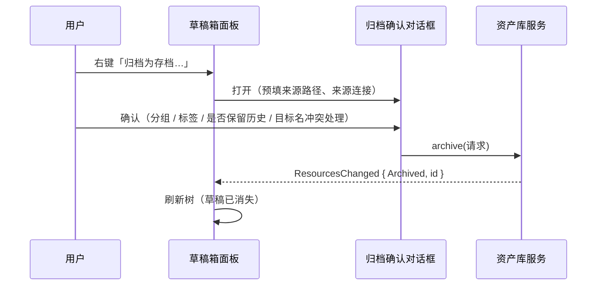

# 资产库 / 分析存档模块（M6）· 原型设计

> 状态：**设计定稿（原型 v1，2026-09-15）；后端 Phase 0 骨架已落地，面板未开始** · 关联文件：`analytics-resource-prototype.html`（可交互原型）、`analytics-resource-architecture.md`（语义裁决与数据流）、`analytics-resource-dev-plan.md`（开发方案）
> 技术栈：gpui-kit 0.6（五段布局见 `../layout/layout-design.md`；左 Dock 起步宽 15rem = 240px，右侧详情面板默认 20rem）
> 前置：v1 蓝本 `v1/frontend/extensions/builtin/analytics-resource/`（**前端仅占位卡片列表**，15 个组件未接线，见 §10）
> 关联文档：`../overview.md`（M6 定位）、`../ui/ui-design-spec.md`（三层约束）、`../database/database-navigator-prototype-design.md`（连接行降密与属性面板先例）、`../scratchpad/scratchpad-prototype-design.md`（归档上游）

## 1. 设计基准

| 项 | 取值 | 来源 |
| --- | --- | --- |
| 面板位置 | 左 Dock（活动栏第 3 项） | `workbench/src/view.rs:35-44` `LeftPanel::Resources` |
| 面板宽 | 起步 15rem = 240px，可拖拽 | `ui::LEFT_DOCK_WIDTH` |
| 详情面板 | 编辑区右侧，默认 20rem，范围 13.75–47.5rem，**宽度记忆存 `settings.json`** | `ui::PROPERTY_PANEL_*`（沿用 M4 决策 3） |
| 行高 | 1.5rem = 24px（与 M4 树 / M5 列表一致） | `ui::ROW_HEIGHT` |
| 面板头高 | 2.25rem = 36px | `ui::PANEL_HEADER_HEIGHT` |
| 契约 | 零裸色值 / 零裸 `px`；组件不手搓；render 期零 I/O | `../ui/ui-design-spec.md`、`.agents/skills/rds-ui-spec/SKILL.md`（仓库根相对，下同） |

**三条界面原则**（由语义裁决推出，不是审美偏好）：

1. **复现强度必须可见**：`已归档`（强）/ `分析表`（中）/ `引用`（弱）在列表行与详情面板都要常显 —— 用户必须一眼知道"这东西半年后还打不打得开"。
2. **本体与显示名分离**：`name` 是显示名（可改），`file_rel_path` 是物理路径（归档时定，**不随重命名变化**）。改显示名不动文件，避免破坏外部引用与 git 历史。
3. **只读是常态**：存档本体不可写。要改 → 走"取回"（检出）。面板上不提供"编辑资源"入口（有入口就一定有用户点了才发现不能存）。

## 2. 面板解剖

```
┌──────────────────────────────────────────┐  ┌─ 活动栏
│ ⛁ 资产库                    ＋ ▾   ⋯     │  │
├──────────────────────────────────────────┤  │
│ ⌕ 搜索存档            [筛选 ▾]  [排序 ▾] │  │
├──────────────────────────────────────────┤  │
│ ▾ 全部分组                    12 项      │  │  ← 分组折叠区
│   ▾ 未分组                               │  │
│     ▤ dau_report.sql        v3  ●已归档  │  │  ← 行：图标 名称 版本 强度
│     ▤ 临时订单分析.sql      v1  ●已归档  │  │
│   ▾ 报表                                 │  │
│     ▤ monthly.md            v2  ●已归档  │  │
│     ▦ mock_orders           v1  ●分析表  │  │
├──────────────────────────────────────────┤  │
│ 12 项 · 已归档 11 · 分析表 1 · 缺失 0     │  │  ← 状态行
└──────────────────────────────────────────┘  │
```

### 2.1 面板头（高 2.25rem）

| 元素 | 规格 | 行为 |
| --- | --- | --- |
| 标题 | `text_sm` + 中等字重；前缀图标 `icons/chart-column.svg` | 点击 = 折叠/展开（沿用 M4/M5 面板头行为） |
| `＋ ▾` 主操作 | `CONTROL_HEIGHT_SM` 紧凑按钮 | 菜单两项：**从草稿箱归档…**（打开草稿多选对话框）/ **从本地文件归档…**（系统文件选择） |
| `⋯` 更多 | 同上 | 重建索引… / 打开资源目录 / 回收站… / 刷新 |

> **为什么主操作不是"新建存档"**：存档的本体必须来自某处（草稿 / 本地文件 / 分析表），**不存在凭空创建的存档**。这与 v1"填 JSON 建资源"的入口形成对照——v1 正是因此没人用。
>
> **落地现状（2026-09-17，两批，2026-09-18 补一笔）**：`＋ ▾` 两项已落（**从草稿箱归档…** 走草稿多选对话框：单选→完整确认、多选→默认名批量；**从本地文件归档…** 走系统文件选择）；`⋯` 四项**均为真实现**（**重建索引…** 与状态行「修复…」同一条路、**打开资源目录** 用系统文件管理器开 `resources/`、**回收站…** 开回收站对话框（P0.8 已落）、**刷新** 与切换项目同一条取数路径）；标题前缀图标已落。**标题点击折叠/展开未落**：M4/M5 面板头由 Dock 的 tab 呈现、不自绘，单独给 M6 会让同一个动作只在一处可用——等“自绘面板头统一”那一批一起做。**草稿箱右键**那个入口属草稿箱 crate，仍未接。

### 2.2 工具栏（高 2rem）

| 控件 | 规格 | 说明 |
| --- | --- | --- |
| 搜索框 | 高 `CONTROL_HEIGHT_SM`，占满剩余宽 | 匹配 **显示名 / 别名 / 标签 / 来源表**（不再只 `LIKE name OR alias`）；`Ctrl+F` 聚焦；`Esc` 清空 |
| `筛选 ▾` | 紧凑按钮 + 弹层 | 三维：**kind**（文件 / 分析表 / 引用）、**强度**（已归档 / 分析表 / 引用 · 可"仅显示可能失效"）、**标签**（多选 · **已落，见下**） |
| `排序 ▾` | 紧凑按钮 + 弹层 | 名称 / 归档时间 / 更新时间 / 大小 / 版本号；箭头上再点翻转（沿用 M4 与 v1 `use-pagination` 语义）。按钮上显示当前字段 + 箭头（四个字的字段在按钮上用两字短名：归档 / 更新） |

> **落地现状（2026-09-18，第四刀）**：**五个排序键已全部落地**（`filter::SortField::ALL` 就是菜单顺序的单一来源）。与规格的一处补强：比较的是**行上的原始值**（时间戳 / 字节数）而不是尾巴里格式化过的字符串（`1.2 KB` vs `900 B` 会得出错误顺序），且**缺值（无体积 / 无归档时间）在两个方向上都排最后**——“不知道”不该在降序里冒充“最大”。为了「大小」不是空功能，归档 / 再归档 / 版本还原 / 补登 / 接受当前内容这五条路径都在写指纹时同批登记本体字节数（`PayloadStore::file_size`）。按钮文案用两字短名（归档 / 更新 / 版本），**四个字的全名留在菜单里**——按钮要跟搜索框抢 240px 面板的宽度。
> **排序会被记住（2026-09-18，第六刀）**：面板里点一次排序就写回设置 `resources.default_sort`，下次打开项目还是这一列（“默认排序” = 上次用的那个，不另给一份设置）；只存**字段**不存方向，方向按字段惯例（名称升序，时间 / 大小 / 版本降序）。
> 搜索框仍只匹配**显示名 + 尾部字段**（原型要的别名 / 标签 / 来源表需要行上再带那几个字段，P2.3 余项）；筛选菜单的**强度维**未单独做（kind 维 + “只看需处理”已覆盖它的实际用途——强度由 kind 决定，多一维就是同一个条件说两遍）。

### 2.3 列表行解剖（高 1.5rem）

```
▤  dau_report.sql            v3   ●已归档   1.2 KB   3 天前
│  │                          │    │          │        └ 相对时间（悬浮显示绝对时间）
│  │                          │    │          └ 大小（analysis 型显示"行数 × 列数"）
│  │                          │    └ 复现强度徽标（唯一色块，见 §6）
│  │                          └ 版本徽标（v1 时不显示，减少噪声）
│  └ 显示名（text_sm）；本体缺失时加删除线 + `danger` 点
└ kind 图标：文件 / 分析表 / 引用（三档形状不同，不只靠颜色）
```

| 交互 | 行为 |
| --- | --- |
| 单击 | 选中（右侧详情面板随之切换） |
| Ctrl / Shift + 单击 | 多选 / 区间选择 |
| 双击 / Enter | **打开（只读）**：`File` → 编辑器只读模式；`Analysis` → 结果表格；`TableRef` → 先校验存在性 |
| ↑ / ↓ | 键盘漫游（含跨分组） |
| F2 | 重命名**显示名**（不重命名文件，见 §1 原则 2） |
| Delete | 移入回收站（底部出现撤销条，沿用 M5） |

> **落地现状（2026-09-18，第二刀补一笔）**：`↑/↓` 的“含跨分组”已满足——分组头也是列表的一项（它参与漫游位置但不参与选中：头被点 / 选到时面板的选中不会被改成一条分组），所以上下键会跨过分组头继续走到下一组的行。`F2` 重命名仍未落（等重命名入口）。
| Ctrl+A | 全选当前分组 |
| 右键 | 见 §3.2 |

> **落地现状（2026-09-17）**：行渲染用 `list::List`（虚拟化 + 组件化 hover / 选中 / 键盘漫游），**行首 kind 图标已接**（`FileText` / `Table` / `ExternalLink`，一律 `muted`），**行内不摆常驻按钮**——动作走右键菜单（§3.2）。键鼠交互已归位：**单击=选中、`Ctrl`=切换入选择集、`Shift`=区间、双击=打开**（行自己接管点击，因为组件默认把单击也接到确认上）、`Ctrl+A` 全选可见行、`Enter` 打开、`↑↓` 漫游、`Delete` 对选择集生效。**`F2` 重命名待重命名入口（Phase 2）**；行内 hover 动作仍未做（原型把它们归给详情面板批）。

**字段优先级（240px 内的取舍规则）**：显示名 > 复现强度徽标 > 版本徽标 > 相对时间 > 大小。

- `version = 1` 时**不显示**版本徽标（减少噪声）；
- `File` 行：大小与相对时间合并为一个 `muted` 字段；
- `Analysis` 行：显示「行数 × 列数」替代大小；
- `TableRef` 行：显示「无指纹」替代大小；
- 放不下的信息一律省略号 + hover tooltip 补全（**不缩减行高、不做两行行**——紧凑一致性优先于信息完整）。

### 2.4 分组折叠区（替代文件夹树）

- 分组 = **单层**（`../analytics-resource-architecture.md` D8）：`全部分组` → `未分组` → 各分组。
- 分组头：左侧 2px 色条（`ui::NAV_GROUP_BAR_WIDTH`，沿用 M4 分组头做法）+ 名称 + 计数；折叠状态持久化。
- 拖动行到分组头 = 移动（沿用 M5 的行拖拽实现，不做"拖到编辑器"）。
- **不做**：多级嵌套、面包屑、排序号手动调整。

> **落地现状（2026-09-18，第二 / 三刀）**：**三层分区、折叠与管理入口均已落**（`filter::build_visible_items` + 分组头行 + 分组头右键菜单；色条用 `list_active_border`）——分组头与存档行一样是列表的一项（虚拟化 / 漫游 / 滚动只维护一份）；**计数从当前可见行现算**（筛选后头里的数就是眼前的行数），没分组时不出头（空库不多两行噪声）；分组头右键：重命名… / 删除分组（成员回未分组）/ 新建分组…。两处与规格的差异：**折叠状态是会话级**（“持久化”要等 P2.4 的设置项，不假装持久化）；**拖拽到分组头未做**（已用行右键「移动到分组 ›」子菜单提供等价入口，拖拽单独一刀）。

### 2.5 底部状态行（高 1.5rem）

`N 项 · 已归档 X · 分析表 Y · 引用 Z · 缺失 W · 索引异常 V`

- `缺失` / `索引异常` 非 0 时，该段可点击 → 打开"索引修复"对话框（§4.6）。这是把"文件系统 + 索引"双真相源的代价**变成可见、可处理**的入口。

## 3. 详情面板与操作

### 3.1 右侧详情属性面板（默认 20rem）

按 kind 分派分节，`File` 型如下：

| 分节 | 内容 |
| --- | --- |
| 头部 | kind 图标 + 显示名（可点改）+ 别名 + 版本徽标 |
| 基本信息 | 大小 / 修改时间 / 归档时间 / 只读态（锁形标记 + "归档后不可写，需取回编辑"提示） |
| 来源 | 来源草稿路径 / 来源连接（可点跳 M4 定位）/ 来源表 / 内容指纹（前 12 位，可复制） |
| 版本 | 最近 3 条 + "查看全部…"（打开版本历史对话框） |
| 标签与分组 | 标签 chips（可加/删）+ 分组选择 |

> **落地现状（2026-09-18，Phase 2 第一刀）**：**标签那一半已落**——详情面板新增「标签」分区：chips（每枚带 ×，点了就去掉）+ 「＋ 标签」开标签对话框（勾选 / 新建并打上 / 差集提交）；筛选菜单也多了标签组（id 多选、并集、带用量）。与规格的一处差异：**标签颜色不上色**（用户填的 hex 不进 UI；颜色一律走主题 token）。**分组选择仍在下一刀**（P2.2：单层分组的建 / 改 / 删 / 移 + 面板分组折叠区）。
| 内容预览 | 文本型显示前 20 行（**只读**）；二进制/大文件显示"仅元信息" |
| 危险区 | 移入回收站（`danger` 文字按钮） |

> `TableRef` 型的详情面板**必须在最顶部显示失效警告条**（`warning` 描边，沿用编辑器只读条样式）："这是引用，源表可能已变更或被删除" + "立即校验"按钮。

**落地现状**：只读信息区（头部 / 基本信息 / **来源** / **版本** / 标签与分组）+ **底部动作区「打开（只读）」与「取回（检出）…」** + **危险区「移入回收站」**（P0.8，danger 按钮）已实现，落在**右 Dock 的「存档详情」档位**（`RightPanel::Archive`）而不是本节说的编辑区右侧 20rem 属性面板——`h_resizable` 属性面板那条路要等 M4 接线，宽度口径暂按 `RIGHT_DOCK_WIDTH`（17.5rem）取。**版本分区自 2026-09-17 起总是出现**（值为“N 个历史版本”或“只有当前版本”）并带「查看全部…」入口（打开版本历史对话框）。尚未做：头部可编辑（改显示名 / 别名）、版本区的“最近 3 条”明细（需要一次批量“每存档最近 N 版”取数）、内容预览；`TableRef` 的提示条已由 `alert_line` 覆盖（引用型常态提示）。

### 3.2 右键菜单

| 项 | 条件 | 说明 |
| --- | --- | --- |
| 打开（只读） | 单/多选 → 单选可用 | 等效双击 |
| **取回（检出）…** | 单选 | 打开取回对话框（§4.2） |
| 版本历史… | 单选 | 版本对话框 |
| 重命名 / 打标签 / 移动到分组 | 多选时分别变为"批量打标签 / 批量移动" | — |
| 在系统中显示 · 复制路径 | 单选 | 调 `opener`（沿用 `project` 的 `reveal_in_explorer`） |
| ────── | | 破坏性项用分隔线隔离 |
| 移入回收站 | 多选可用 | 二次确认（多选时显示数量） |

> **落地现状（2026-09-17，2026-09-18 补两笔）**：打开（只读）/ **取回（检出）…（已接对话框与真执行）** / 版本历史…（已接对话框与三个真动作）/ **移入回收站（P0.8 起是真执行：本体进项目级回收站 + 登记行软删，可从「⋯ → 回收站…」还原）** / **移动到分组 ›（Phase 2 第三刀：子菜单列出未分组与各分组 + 新建分组…；多选也走这一条）** / **复制路径** / **在系统中显示** 已接在行的右键菜单上，破坏性项用分隔线隔离；**多选态已接**：选择集 > 1 时单选项（含打开 / 取回 / 版本历史 / 复制路径 / 在系统中显示）全部置灰，**删除项变“移入回收站（N 项）”并对整个选择集生效**（批量中途失败时回执会交代“已移入 N 项”）。本体异常（缺失 / 内容已变）与只读项目下「取回」置灰（详情面板的动作区同一判据）；**本体不可定位**（缺失 / 旧行没登记路径）时「复制路径」「在系统中显示」也置灰。**打标签**（“批量打标签”那一项）仍在 Phase 2 后续（目前打标在详情面板与标签对话框里）。

## 4. 核心交互

### 4.1 归档（上游发起，M6 执行）



归档确认对话框字段：

| 字段 | 默认 | 说明 |
| --- | --- | --- |
| 显示名 | 文件名（去扩展名） | 可改 |
| 目标位置 | `resources/<草稿相对路径>` | 不可编辑（保留目录结构，避免同名冲突） |
| 分组 / 标签 | 空 / 空 | 可空 |
| 来源连接 | 草稿 `file_meta.last_connection_id` | **自动带出**（归档凭证的关键一环） |
| 保留历史内容 | 跟随设置（默认 5 份） | 对话框里可单次覆盖；填 `-1` = 全部保留 |
| 冲突处理 | 询问 | 目标已存在 → 改名 / 取消（不静默覆盖） |

**归档后给撤销条**：底部出现撤销条（沿用 M5 撤销栏；自动消失时长随 M5 一并补）——**撤回 = 本体移回草稿箱 + 删除登记行**。归档是"把文件从工作区搬走"的不可逆动作（开发方案 R2），必须给一个立即反悔的窗口。

> **落地现状（2026-09-17）**：对话框已落（crate 内 `dialogs/archive.rs`）——来源 / 目标位置 / 来源连接只读摆出，显示名 / 标签 / 保留历史内容可填，**目标被占时把"将归档为 resources/x-2.sql"原样摆出**（确认按钮同步改文案）。**撤销栏已落**（面板底部，5 秒窗口；撤回 = 本体移回原位 + 删登记行，原位置被占则拒绝）。**草稿来源已接**（面板头 `＋ ▾` → 草稿多选 → 单选展开本对话框）：`source_connection` 与 `promoted_from` 由草稿的 `file_meta` 与相对路径自动带出，**目标位置保目录结构**（`resources/reports/a.sql`）。本地文件那条的这两项仍留空（它没有草稿来路）。分组 / 别名字段等 Phase 2 的分组与重命名入口。
> **保留历史内容已接设置**（2026-09-18，P2.4 前半）：“跟随设置”读的是设置页「资产库 › 历史内容保留」（`resources.keep_versions`，含 `-1` = 全部保留）；对话框里填了值就单次覆盖，填 `-1` 时行下会给一句“全部保留：不裁剪任何历史内容副本”（哨兵值不说明就等于让用户猜）。

### 4.2 取回（检出）

- 触发：右键"取回（检出）…"。
- 对话框：目标名（默认 `<显示名>（工作副本）<扩展名>`）、目标目录（默认草稿箱根）、"是否同时打开"。
- 结果：草稿箱出现副本（本体不动）；草稿侧记录 `derived_from_resource_id`；回执提示"修改后再次归档将生成 v4"。

> **落地现状（2026-09-17）**：对话框与真执行已落（`dialogs/checkout.rs` + workbench `resource_host` / `resource_jobs`）——三字段齐备（目标目录只读展示，由宿主解析），重名避让（`-2`…）在动文件前定死，回执提示"改完再归档将生成 vN+1"，勾了"打开"就递 `Shared::request_open_in_editor`。**未做**：草稿侧记 `derived_from_resource_id`（需草稿箱侧加字段，属 M5）。

### 4.3 版本历史对话框

| 区域 | 内容 |
| --- | --- |
| 版本列表 | 版本号 / 归档时间 / 大小 / 指纹前 12 位 / 内容副本是否存在（`缺失` 徽标） |
| 差异 | 相邻版本显示"大小 ±N · 指纹变化"（**不做行级 diff**——文本 diff 归编辑器） |
| 动作 | **选中版本后出现在表格下方的动作栏**（而非每行行内按钮，768px 装不下 7 列）：还原为当前版本（生成新版本，不覆盖历史）/ 取回该版本为草稿 / 删除该版本的内容副本（保留元数据行） |

> **不做"原地回滚"**：存档只追加不修改。回滚在语义上是"用旧内容产生新版本"，与 git `revert` 同构。

> **落地现状（2026-09-17）**：对话框已落（`dialogs/version.rs` + `present::build_version_rows` + 宿主接线）。六列**含当前版本那一行**（写前快照语义下版本表里没有它）；动作栏选中历史行后出场，三个动作都是真执行（还原 = 生成新版本；取回该版本 = 草稿箱里一份“（vN 工作副本）”文件；删副本走 `AlertDialog` 二次确认，副本不进回收站）；动作完成后宿主**再取一次版本并把行换掉**，所以不必关窗重开。**两处有意留白**：版本列表最多 50 行（多的明说“还有 N 个更早的未列出”，不静默截断，也不为它手搓虚拟化）；列里不给“最近 3 条”那种明细。

### 4.4 回收站对话框

沿用 M5 的回收站对话框形态（列表 + 还原 + 永久删除 + 清空），**但只显示 `origin = "resources"` 的条目**，并在跨模块条目上显示"属于草稿箱，请在草稿箱还原"的禁用提示（语义已在 `ProjectTrash` 层保证，UI 只做呈现）。

> **落地现状（2026-09-18，P0.8）**：对话框已落（`dialogs/trash.rs` + `present::build_trash_snapshot` + 宿主接线，入口 = 面板头「⋯ → 回收站…」）。表单：条目表格（名称+类型 / **原位置** / 删除时间 / 大小）+ 行内动作（**还原**、**永久删除**（`AlertDialog` 确认））+ 页脚「**清空回收站**」（`AlertDialog` 确认，文案说明**只清资产库的条目**）+ 「关闭」；行多时滚动，最多列 100 条并**明说**还有多少未列。与规格的一处差异：跨模块条目**不列成行**，只在下方给一句“另有 N 条「草稿箱」的条目共用一个回收站——请在那个模块的界面里处理”——列出来等于摆一个必然被拒的「还原」（origin 校验在服务层）。只读项目下三个动作全部置灰；忙态由宿主收放（动作后重取并换行，不关窗）。

### 4.5 索引修复对话框（§4.6 同）

三类问题分组呈现，每组给"修复"动作：

| 分组 | 呈现 | 动作 |
| --- | --- | --- |
| 有文件、无记录 | 文件路径列表 | 补登为存档（选择 kind / 来源留空） |
| 有记录、无文件 | 存档名 + 期望路径 | 从回收站还原 / 删除记录 |
| 指纹不匹配 | 存档名 + 期望/实际指纹 | 接受当前内容（生成新版本）/ 从历史还原 |

**不做自动修复**：全部需要用户确认（静默导入会让“资源”变成用户没同意过的东西）。

> **落地现状（2026-09-17，2026-09-18 补一笔）**：对话框已落（`dialogs/index_repair.rs` + `present::build_repair_rows` + 宿主接线），两个入口（状态行「修复…」/ 面板头「重建索引…」）都是真实现。三组行内动作：**补登为存档**（固定文件型——`resources/` 里只可能是文件，所以不摆只有一项的 kind 选择器；来源无从得知留空）/ **从回收站还原**（P0.8 起可用：按登记行的原相对路径去回收站里找条目；找不到就明说“本体已不可恢复，只能删掉这条记录”）/ **删除记录**（`AlertDialog` 确认）/ **接受当前内容**（回执明说“旧内容不可得，那一版只留元数据”）；第三组的“从历史还原”在本对话框里就是**「打开版本历史…」**（挑哪一版是版本历史的活，不在这里重复挑选 UI）。修完一项自动重扫并换行，对话框不关。

### 4.6 只读的强制与提示（三重）

| 层 | 手段 |
| --- | --- |
| 应用守卫 | 所有写入 API 在路径落在 `resources/` 时直接拒绝（沿用 M5 `resolve_path` 的点前缀/越界拒绝逻辑扩展） |
| 编辑器 | 以只读模式打开（编辑器专门的"分析资源锁定"只读来源，`../editor/editor-prototype-design.md:63-67`） |
| 文件系统 | 只读属性（辅助，Windows/网络盘不可靠，失败只警告） |

> **落地现状（2026-09-17）**：三层已全部接上——①应用守卫（Phase 0 的 `PayloadStore` 写入拒绝）、②**编辑器只读**（`editor::persist::open_file_read_only`，只读维度由发起方经 `OpenInEditorRequest` 传入，宿主走 `open_in_editor_with`）、③文件系统只读属性（辅助，失败只警告）。

## 5. 状态与空态矩阵

| 状态 | 呈现 |
| --- | --- |
| 空库 | 大图标 + "还没有任何存档" + 双按钮：**从草稿箱归档…** / 了解资产库能做什么。**若草稿箱有内容**，附加"草稿箱里有 3 个文件看起来值得归档"的建议行（首屏不留白） |
| 加载中 | 骨架行（3–5 行灰条），不用转圈 |
| 搜索无结果 | "没有匹配的存档" + 清空筛选按钮（**不是空库态**，两者文案必须区分） |
| 本体缺失 | 行灰显 + `danger` 点 + 详情面板横幅 + 修复入口 |
| 指纹不匹配 | 行内 `warning` 徽标"内容已变" |
| 索引异常（N > 0） | 状态行对应段高亮可点；首次进入时顶部一次性提示条 |
| `TableRef` 未校验 | 详情面板顶部 warning 条 + "立即校验" |
| 写入被拒（只读） | 任何试图写入的路径返回明确错误："这是归档本体，请先取回" |
| render 期 | 只读内存快照；I/O 一律后台任务 + 结果回填（沿用 M4 `nav_jobs` 模式） |

> **落地现状（2026-09-17）**：空库（**双按钮已落**：从草稿箱归档… / 从本地文件归档…）/ 搜索无结果 / 本体缺失 / 指纹不匹配 / 索引异常（状态行段 + 修复入口，对话框待 Phase 3）/ 写入被拒 / render 期 均已落。**加载中已落**（3 行骨架 + 状态行「加载中… ·」前缀，且取数期间不摆空态）。尚未做：空库的"草稿箱有 N 个文件值得归档"建议行、索引异常首次进入的顶部一次性提示条、`TableRef` 的"立即校验"。

## 6. 主题映射（token → 视觉）

> 全部使用既有角色，**不新增产品语义 token**（`danger` / `success` / `warning` / `info` 已足够表达三档强度）。

| 区域 / 元素 | 角色 |
| --- | --- |
| 面板背景 / 分隔 | `background` / `border` |
| 面板头 | 标题 `foreground`；动作按钮 `secondary` + hover `secondary_hover` |
| 工具栏输入框 | 底 `background`，边 `input_border`，聚焦 `ring` |
| 列表行 | `list` / hover `list_hover` / 选中 `list_active` + `list_active_border` |
| 分组头 | 色条 `list_active_border`（**不用 `sidebar_accent`**：该角色在浅色下与面板底几乎同色，M4 原型已因此改用此角色）；文字 `muted_foreground` |
| **复现强度徽标** | `已归档` = `success`；`分析表` = `info`；`引用` = `warning` |
| 缺失 / 错误 | `danger`（点 / 纹理 / 文字，不整行染色） |
| 只读提示条 | `warning` 描边（与编辑器只读条一致） |
| 内容已变 | `warning` 徽标 |
| 状态行 | `muted_foreground`；异常段 `warning` / `danger` |
| 空态图标 | `muted_foreground` |

**kind 图标（形状区分，不靠颜色）**：`File` = 文档形；`Analysis` = 表格/数据库形；`TableRef` = 链接/箭头形。图标一律用 `muted_foreground`，**不按 kind 各自带色**——这样**复现强度徽标是行内唯一的色块**（视觉通道预算：一行只允许一个颜色信号）。图标从 `assets/icons` 既有资产选取（`gpui-kit-assets` 全量目录），缺图标时按资产路径补。

**色值基准（硬约束）**：

1. 实现一律取 `cx.theme().colors.*`，**禁止硬编码**；注意 `*.background` / `*.foreground` 是**成对角色**（填充色 + 其上文字色），不是“浅底深字”的弱色对。
2. 视觉稿（原型 HTML）的取值口径沿用本仓既有原型稿的语义前景配对（同 `../scratchpad/scratchpad-prototype-design.md` §6.1）：浅色 `success` `#16A34A` / `warning` `#B45309` / `info` `#2563EB` / `danger` `#DC2626`；暗色 `#89D185` / `#CCA700` / `#3794FF` / `#F14C4C`。
3. 行内徽标与提示条的**底色从语义色派生**（`color-mix` 10–14% 叠底），不硬编码第三组 hex；若将来要改成“实底徽标”，则用 `*.background` + `*.foreground` 成对填充。

> 已知欠债：旧原型稿里出现的 `#0F2A4A` / `#3A3105` / `#4A1A1A` 等语义底色**不在主题资产中**，属自创值——以本文件的口径为准，旧稿待顺手校正。

## 7. 尺寸常量（**已落到 crate 内的 `crates/analytics_resource/src/ui.rs`**）

原计划写进 `crates/workbench_shell/src/ui.rs`，实现时改为 **crate 内声明**：视图随能力同 crate（架构 §8.2），依赖方向不允许视图反向读 workbench 的常量（与 `project::ui` 同例）；值与 workbench 同源同值。

| 常量 | 倍率 | @16px | 用途 | 现状 |
| --- | --- | --- | --- | --- |
| `ARCHIVE_BADGE_HEIGHT` | 1.125 | 18 | 版本 / 强度徽标高（与 `NAV_BADGE_SIZE` 同值，独立命名便于各自演进） | ✅ |
| `ARCHIVE_EMPTY_ICON_SIZE` | 3.0 | 48 | 空态大图标（v1 空态同为 48px） | ✅ |
| `ROW_HEIGHT` / `PANEL_HEADER_HEIGHT` / `ICON_SIZE_SM` | 1.5 / 2.25 / 0.875 | 24 / 36 / 14 | 行高 / 面板头 / 小图标（复用既有口径） | ✅ |
| `DETAIL_LABEL_WIDTH` | 5.5 | 88 | 详情面板标签列宽（值列弹性） | ✅ |
| `TOOLBAR_HEIGHT` | 2.0 | 32 | 工具栏行高（§2.2） | ✅ |
| `CONTROL_HEIGHT_SM` | 1.625 | 26 | 工具栏搜索框高 | ✅ |
| `ARCHIVE_DIALOG_WIDTH` / `CHECKOUT_DIALOG_WIDTH` | 34.0 / 30.0 | 544 / 480 | 归档 / 取回对话框宽（§7.1；对话框的 `.w()` 只收 `Pixels`，故用 `font_size × 倍率`） | ✅ |
| `VERSION_DIALOG_WIDTH` | 48.0 | 768 | 版本历史对话框宽（§7.1） | ✅ |
| `VERSION_LIST_MAX_HEIGHT` | 20.0 | 320 | 版本列表最大高（版本行可积上百条，靠滚动） | ✅ |
| `VERSION_COL_*`（5 个） | 3.5 / 8 / 5 / 9 / 5 | 56 / 128 / 80 / 144 / 80 | 版本表格的列宽：版本 / 时间 / 大小 / 指纹 / 副本；变化列弹性 | ✅ |
| `DETAIL_PANEL_DEFAULT_WIDTH` | 20.0 | 320 | 详情面板默认宽（接入右侧 Dock 时落） | ⬜ |
| `ARCHIVE_STATUS_BAR_HEIGHT` | 1.5 | 24 | 底部状态行（当前复用 `ROW_HEIGHT`；语义独立命名待接） | ⬜ |

> **契约测试现状**：`crates/workbench/tests/ui_contract.rs` 扫的是**显式文件清单**（workbench `view.rs` / `panels/` + connection_dialog + editor 视图），**不含本 crate 视图**——本文档与 `ui.rs` 的一致性目前靠评审 + 单测；若要纳入契约测试，得先给它加一个跳 crate 的扫描入口。

### 7.1 对话框宽度（`Dialog::w` 只能收 `Pixels` → 用 `cx.theme().font_size * N`）

沿用 `../theme/ui-constraints.md` §5 的既有约定（连接对话框 61.25rem）。M6 五个对话框：

| 对话框 | 倍率 | @16px | 说明 |
| --- | --- | --- | --- |
| 归档确认 | 34.0 | 544 | 表单型（显示名 / 标签 / 来源 / 历史），六字段 | ✅ |
| 取回（检出） | 30.0 | 480 | 三字段 + 预览 | ✅ |
| 版本历史 | 48.0 | 768 | 版本表格（多列），需较宽 | ✅ |
| 回收站 | 40.0 | 640 | 列表 + 操作列 |
| 索引修复 | 54.0 | 864 | 三分组 + 表格 + 动作列 |

> 宽度按「内容最密处一行不折行」定；表内长文本省略号 + tooltip，不靠加宽解决。

## 8. GPUI 落点（组件选型，禁止手搓）

| 需要 | 用 | 备注 |
| --- | --- | --- |
| 面板容器 | `gpui_kit::component::dock::{BasePanel, Panel}` | 与 M4/M5 面板同一装配方式 |
| 列表（含虚拟化） | `v_virtual_list`（沿用 M5 草稿树 / M4 树的做法） | >100 项必须虚拟化；行渲染函数需可被闭包复用 |
| 搜索框 | `component::input`（`TextInput` 或 `Editor` 单行） | 不手搓输入框 |
| 筛选 / 排序 / 更多 | `Button` + `DropdownMenu` / `PopupMenu` | 菜单项带勾选态用 `DropdownMenu` |
| 右键菜单 | `PopupMenu`（沿用 M4/M5） | — |
| 对话框 | `Dialog` / `AlertDialog`（`gpui_kit::component::dialog`） | 破坏性操作（永久删除 / 清空）用 `AlertDialog` |
| 版本历史 / 回收站 / 索引修复 | `Dialog` + 内部表格（`component::table::{DataTable, TableDelegate}`） | 版本行数可能上百，需虚拟化 |
| 详情面板 | `h_resizable` 容器 + 折叠区组件 | 宽度记忆（settings） |
| 标签 chips | 自绘行内控件（按 `ui-constraints` §6：行内轻量动作允许自绘） | 颜色一律 token |
| 悬浮提示 | gpui-kit tooltip | 相对时间显示绝对时间等 |
| 图标 | `IconName` + `gpui-kit-assets` | 缺图标按资产路径从全量目录加载 |
| 底部状态行 | 自绘（`StatusBar` 属应用级，编辑器/面板各自的状态行自绘） | 同 M5 面板底部统计做法 |

## 9. 快捷键

| 键 | 行为 | 上下文 |
| --- | --- | --- |
| `Ctrl+F` | 聚焦搜索 | 面板聚焦时 |
| `↑` / `↓` | 行漫游 | 同上 |
| `Enter` | 打开（只读） | 同上 |
| `F2` | 重命名显示名 | 同上 |
| `Delete` | 移入回收站（可撤销） | 同上 |
| `Ctrl+A` | 全选当前分组（分组未落 → 当前即全部可见行） | 同上 |
| `Esc` | 清空搜索 / 关菜单 | 同上 |
| `Ctrl+Shift+A` | 归档当前草稿（草稿箱上下文，**快捷键注册在草稿箱**） | 全局 |

> Action 定义在 `crates/analytics_resource/src/commands.rs`，绑定在 `crates/app/src/main.rs`（`analytics-resource` context），与 M4 的 `database-nav` context 同构。
>
> **落地现状（2026-09-17）**：`Ctrl+F` / `Esc` / `Delete` / `Ctrl+A` / `↑` / `↓` / `Enter` 均已可用；鼠标手势（单击 / `Ctrl` / `Shift` / 双击）由行自己接管（`classify_row_click`，因为组件默认把单击也接到确认上）。**`F2` 重命名待重命名入口（Phase 2）**；`Ctrl+Shift+A` 注册在草稿箱 context（不在本模块绑）。

## 10. 与 V1 的逐项对照

| v1 内容 | 处置 | 原因 |
| --- | --- | --- |
| `store.ts`（602 行，41 方法）的行为契约 | **照搬语义** | 分页/排序/选择/标签/版本/回收站的行为规格清晰，是 v1 最有价值的产物 |
| 文件夹树（`FolderList` + `parent_folder_id`） | **重设计为单层分组** | v1 无改名/删除/移动/排序/面包屑，树是残的 |
| 标签（`TagManager` + 双向查询） | **照搬 + 扶正为主组织方式** | 实现完整（`tag.rs` 314 行）、多值、跨 kind 通用 |
| 卡片网格列表（`AnalyticsResourceManager.vue`） | **重设计为紧凑行列表** | 240px 面板放不下 300px 卡片；行列表与 M4/M5 一致 |
| 分页（`Pagination`，10/20/50/100） | **不迁** | 面板内滚动 + 虚拟列表，不做页码翻页（桌面应用语义） |
| 前端 LRU + TTL 缓存（`use-cache.ts`） | **不迁** | 本地 SQLite 无 IPC 成本；且 v1 该实现本身有缺陷（`updateConfig` 改 `maxSize` 无效、`folderCache` 死缓存） |
| 虚拟滚动（`use-virtual-scroll.ts`，行高 72 与 CSS 56 不一致） | **重接为 `v_virtual_list`** | 行高必须与 `ui.rs` 常量同源，避免 v1 的滚动漂移 |
| 拖拽到 SQL 编辑器（`manager-design.md` 承诺） | **不迁** | 有"取回→打开"路径；跨面板拖拽的价值不足以承担复杂度 |
| 多选 + 批量删除 | **照搬 + 扩展批量打标签/移动** | v1 多选态右键仍按单选处理 |
| 设置面板（`SettingsModal`，4 标签页） | **部分迁** | 迁移 `keepVersions`（✅ 已落：设置页「资产库」节，`resources.keep_versions`） / 默认排序（✅ 已落：`resources.default_sort`，面板内点排序即记住） / 默认分组；**不迁**显示开关与"快捷键只读展示" |
| 8 条快捷键（仅在设置页展示、无实现） | **重设计** | 只保留 §9 九条并真正实现 |
| `config` JSON 编辑框（`CreateResourceModal`） | **不迁** | 用户不该手写 JSON；字段进表单、扩展进详情面板 |
| 版本历史（`VersionHistoryModal`） | **重设计** | 从"看 JSON 快照"改为"版本 + 指纹 + 拷取回/还原"，不做行级 diff |
| 回收站（`RecycleBinModal`，用原生 `confirm()`） | **重接** | 走 `ProjectTrash`；确认用 `AlertDialog`；只显示 `origin = "resources"` |
| 作用域筛选（global/project/session） | **不迁为可编辑维度** | 作用域改为派生只读（架构 §4.3） |
| 事件 `analytics-resource-changed`（发了没人听） | **重接** | 换成带 `reason` 的 `ResourcesChanged`，发/收两端同时落地 |
| `tree_view.rs` 式"占位后永不接线"的组件 | **警戒项** | v1 的 15 个孤立组件是"设计有、代码有、没人用"的典型；v2 的验收必须包含"入口可达 + 端到端可走" |

## 11. 已确认决策

| # | 决策 |
| --- | --- |
| 1 | 面板放左 Dock（活动栏第 3 项），标签由"资源分析"改为**资产库** |
| 2 | 详情用**右侧属性面板**（默认 20rem，宽度记忆），不用模态框（对齐 M4 决策 4） |
| 3 | 列表为**紧凑行**（1.5rem），不做卡片网格与页码分页 |
| 4 | 组织方式：**标签为主 + 单层分组**；不做多级文件夹树 |
| 5 | **复现强度常显**（已归档 / 分析表 / 引用），引用必须带失效警告条 |
| 6 | **只读是常态**，面板不提供"编辑资源"；修改走"取回（检出）" |
| 7 | 重命名只改**显示名**，不改物理路径 |
| 8 | 归档入口在**草稿箱右键 + 面板头下拉**两处；不存在"凭空新建存档" |
| 9 | 版本**只追加**：回滚 = 用旧内容生成新版本（不做原地回滚、不做行级 diff） |
| 10 | 回收站复用项目级 `ProjectTrash`，UI 只显示 `origin = "resources"` 条目 |
| 11 | 索引修复必须**人工确认**，不静默导入/删除 |
| 12 | 不新增产品语义 token；四档语义色（success/info/warning/danger）表达强度与异常 |
