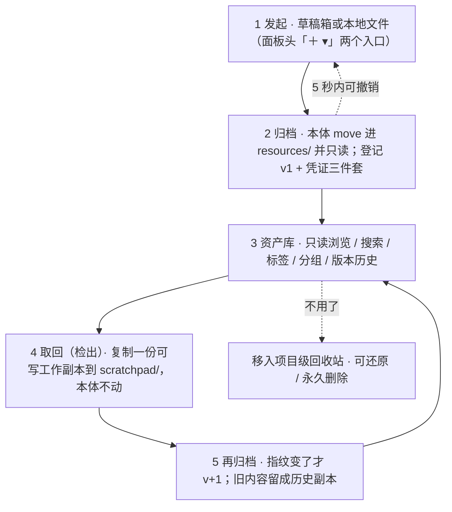
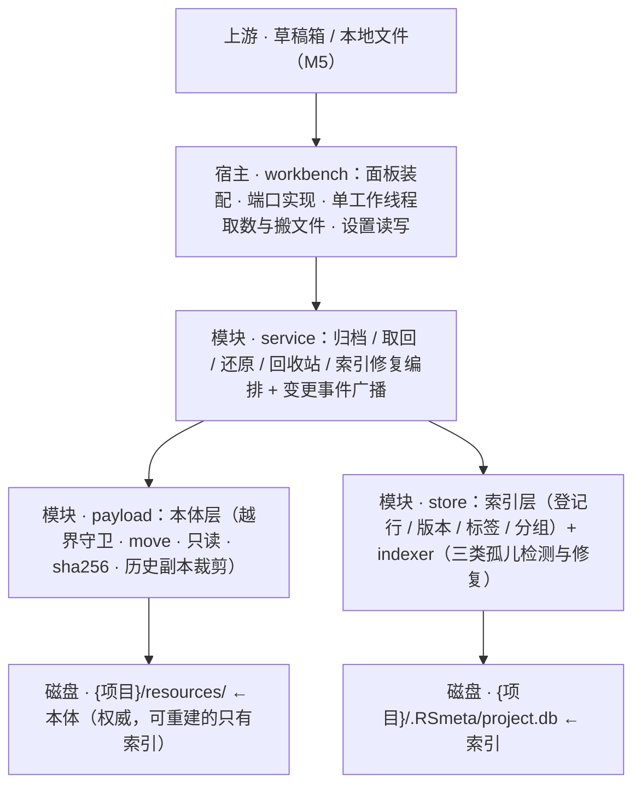

# 资产库 / 分析存档（M6）· 一页看懂

> **一句话版本**：把「这次结论是怎么来的」连同文件一起冻结下来——每次归档留下**来源 + 代码 + 内容指纹**三件套；本体归档即只读，要改就**取回**一份工作副本，改完再归档，**只有内容真的变了才产生新版本**。
>
> 本页是**宣传 / 分享稿**（快照日期 2026-09-18），数字与口径以模块文档为准（见文末文档地图）；视觉版孪生：`analytics-resource-showcase.html`（自包含、明暗双主题、离线可开）。

---

## 关键数字

| 数字 | 含义 |
| --- | --- |
| **3 种存档类型** | 文件（本体 = `resources/` 里的文件）· 分析表（本体 = 分析引擎里的表）· 引用（本体 = 远端表）——一期落地的是文件档，后两档属 Phase 4 / 5 |
| **sha256 内容指纹** | 版本号只跟指纹走：改显示名、打标签、归组都不涨版本 |
| **5 秒撤销窗口** | 归档后立刻反悔可一键撤回（本体移回 + 删登记行） |
| **三重只读守卫** | 应用层拒绝写入 + 编辑器只读打开 + 文件系统只读属性（辅助） |
| **125 + 27 项测试** | 模块单测 125 · 面板窗口 18 · 对话框窗口 9；含「归档回滚 / 指纹未变不增版本 / 跨模块还原被拒 / 三类孤儿」等场景 |

---

## 它回答三个问题

| 你会问 | 它给你的答案 |
| --- | --- |
| 哪一版才是当时发出去那份？ | **版本历史**：每版一条记录（时间 / 大小 / 指纹 / 副本是否还在）；"还原"生成新版本、**不覆盖历史** |
| 这个结论是用什么数据算的？ | **归档凭证三件套**：来源连接 / 来源草稿路径 / 来源表 + 定义 SQL + 内容指纹，随存档一起留 |
| 借出去改乱了原件怎么办？ | **只读是常态**：修改走「取回（检出）」——复制一份工作副本到草稿箱，本体永远不动 |

> 纪律：**指纹没变就不产生版本**——版本化的是「内容」，不是「改过名字」。

---

## 核心闭环：归档 → 取回 → 再归档



- **先本体、后索引**：先算指纹 → 再搬文件 → 最后写索引；索引写失败会把本体移回原处（不留半成品）。
- **版本只追加**：历史版本可「还原」（生成新版本）或「取回为草稿」；版本行永久保留，内容副本按 `keepVersions` 裁剪（默认 5 份，可设「只留元数据」或「全部保留」）。
- **归档可反悔**：5 秒撤销条；再归档的"反悔"是版本回退，不在撤销条里承诺。

---

## 架构：谁负责什么



依赖只向下：`workbench → analytics_resource → engine, shared`；**M6 不依赖 M5**，归档入参只是「路径 + 元数据」。

| 关注点 | 落点 |
| --- | --- |
| 编排与不变式（三条） | `crates/analytics_resource/src/service.rs` |
| 本体层（守卫 / 搬运 / 指纹 / 副本） | `crates/analytics_resource/src/payload.rs` |
| 索引层（登记 / 版本 / 标签 / 分组） | `crates/analytics_resource/src/{resource,version,tag,folder}.rs` |
| 索引修复（三类孤儿） | `crates/analytics_resource/src/indexer.rs` |
| 面板与详情（视图随 crate） | `crates/analytics_resource/src/{resource_view,detail_view,filter,present}.rs` |
| 宿主接线（端口 / 作业 / 设置） | `crates/workbench/src/{components/resource_host.rs,services/resource_jobs.rs,panels/resources.rs}` |
| 项目级回收站（与草稿箱共用） | `crates/engine/src/persistence/trash.rs` |

---

## 七个值得说的特点

1. **版本由内容说了算**——`content_hash` 未变即幂等返回，不产生"假版本"；历史内容副本按策略裁剪，而版本行（元数据 + 指纹）永久保留。
2. **自带凭证**——来源连接 / 来源草稿路径 / 来源表 + 定义 SQL + 内容指纹一起留；复盘第一个问题"它从哪来"有确定答案。
3. **只读三重守卫**——应用守卫是硬约束（Windows / 网络盘的只读属性只是辅助），编辑器以只读态打开本体。
4. **组织方式：标签为主、分组为辅**——标签多值、跨类型通用，可改名 / 删除（删标签不动存档）；分组是**单层**的，折叠状态会被记住。
5. **检索与排序**——搜索 + 三维筛选（类型 / 只看需处理 / 标签）+ **五个排序键**（名称 / 归档时间 / 更新时间 / 大小 / 版本号）；排序比的是原始时间戳与字节数，缺值的行总是排在最后。
6. **坏了自己能修**——索引修复覆盖三类差异（有文件无记录 / 有记录无本体 / 指纹不匹配），**全部人工确认**后执行：补登 / 删记录 / 接受当前内容 / 从回收站还原。
7. **回收站是项目级的**——与草稿箱共用一处仓库，按来源隔离：只列、只清自己名下的条目。

---

## 归档对话框：五个字段都真的生效

| 字段 | 说明 |
| --- | --- |
| 显示名 | 只改显示名，不动物理文件名（避免破坏引用与版本线索） |
| 别名 | 可空；进检索与详情，不影响本体路径 |
| 分组 | 下拉选已有分组或「未分组」（建组入口在面板：行菜单 / 分组头右键） |
| 标签 | 逗号分隔；**不存在就地新建**，同名复用 |
| 保留历史内容 | 留空 = 跟随设置；`0` = 只留元数据；`-1` = 全部保留 |

> 附属项（标签 / 分组）失败**不回滚归档**——文件已经归档好了；失败原因写进同一句回执（如「已归档「x」v1 → …（分组未归入：…）」），不静默。

---

## 界面骨架（左面板 · 右详情）

```text
┌ 资产库（左 Dock，起步 240px）────────────┐  ┌ 存档详情（右 Dock）──────┐
│ ⛁ 资产库                    ＋ ▾   ⋯     │  │ 基本信息：显示名 / 类型 / 指纹 │
│ ⌕ 搜索存档        [筛选 ▾]  [更新 ↓ ▾]   │  │ 来源：连接 / 草稿 / 来源表     │
├─────────────────────────────────────────┤  │ 标签：chips + ＋ 标签          │
│ ▾ 全部分组                       12 项   │  │ 版本：3 个版本 · 查看全部…      │
│   ▾ 未分组                               │  │ 动作：打开（只读）/ 取回…       │
│     ▤ dau_report.sql  v3  1.2 KB · 3 天前│  │ 危险区：移入回收站             │
│   ▸ 报表                          3 项   │  └───────────────────────────┘
│ 12 项 · 已归档 10 · 分析表 1 · 缺失 1  修复…│
└─────────────────────────────────────────┘
```

键鼠：`Ctrl+F` 聚焦搜索 · `Esc` 清搜索 / 关菜单 · 单击选中、`Ctrl` 加选、`Shift` 区间、双击或 `Enter` 打开（只读）· `Ctrl+A` 全选可见行 · `↑↓` 漫游（跨分组头）· `Delete` 移入回收站（可还原）· `F2` 重命名显示名（规划中）。

---

## 能力清单（诚实版）

| ✅ 已经能用 | ○ 正在路上 |
| --- | --- |
| 归档闭环（两条入口 + 表单五字段真的生效） | 分析表档 / 引用档（Phase 4 / 5） |
| 撤销归档（5 秒）+ 版本历史（还原 / 取回 / 删副本） | 拖拽到分组头（现用「移动到分组 ›」等价替代） |
| 标签（打 / 去标、改名、删除）+ 单层分组（建 / 改名 / 删 / 移动、折叠记忆） | 搜索匹配别名 / 标签 / 来源表 |
| 搜索 · 三维筛选 · 五键排序（记住上次选择） | 默认分组 · `F2` 重命名 · 批量打标签 / 批量移动 |
| 虚拟化列表 · 多选 · 右键菜单 · 加载骨架 · 两种空态 | 详情内容预览与头部可编辑 |
| 详情面板（只读区 + 标签 chips + 版本区 + 动作区 + 危险区） | |
| 项目级回收站（移入 / 还原 / 永久删除 / 清空） | |
| 索引修复（三类差异 + 五个真动作） | |
| 只读三重守卫 · 三个设置项（保留策略 / 默认排序 / 折叠记忆） | |

---

## 写进代码的硬约束（选六条）

| 约束 | 为什么 |
| --- | --- |
| 本体权威，索引可重建 | 文件系统有什么就是有什么；索引坏了能从本体重建，反之不行 |
| 先本体、后索引 | 顺序固定并带回滚，绝不留下"文件没了、列表里也没有" |
| 渲染期零 I/O | 取数 / 扫描 / 搬文件都在后台线程；面板只读自己持有的快照 |
| 依赖只向下 | 模块不反向依赖上游与宿主；设置项由宿主读好后作为参数传入 |
| 零裸值 | 颜色走主题 token、尺寸常量单一来源，深色主题与缩放不靠猜 |
| 不静默 | 失败要么拒绝、要么写进回执；附属项没落上也会说明 |

---

## 质量与验证

| 项 | 数值（2026-09-18 实测） |
| --- | --- |
| 模块单测 | **125** |
| 面板窗口测试 | **18** |
| 对话框窗口测试 | **9** |
| 宿主回归（workbench lib + 界面契约） | **102 + 7** |
| `cargo check --all-targets` | 零告警 |
| 测试场景 | T1–T16（归档回滚 / 指纹未变不增版本 / 历史裁剪 / 跨模块还原被拒 / 三类孤儿 / 越界写入 / 跨设备 move …） |

---

## 正在路上

- **分析表档**：本体 = 分析引擎里的表；配套 M7 Mock 产物 / M5 编辑器结果两处上游接入（Phase 4）。
- **引用档**：远端表的可校验指针 + 系统级提升衔接（Phase 5，不承诺）。
- **检索补全**：搜索匹配别名 / 标签 / 来源表（行模型带这几列之后）。
- **交互补全**：拖拽到分组头、`F2` 重命名显示名、批量打标签 / 批量移动、详情内容预览。
- **默认分组**：归档时预选的分组（语义待拍板：设置页预设 vs 记住上次选择）。

---

## 文档地图

| 文档 | 什么时候读 |
| --- | --- |
| `README.md` | 模块入口：一句话定位 · 边界 · 代码地图 · 改前必守 12 条 · 文档地图 |
| `analytics-resource-architecture.md` | 为什么这样设计：D1–D12 裁决书 · 三种类型与复现强度 · 凭证三件套 · 存储布局与真相源 · 版本语义 · 归档取回契约 · 降级矩阵 · 已知问题 |
| `analytics-resource-prototype-design.md` / `analytics-resource-prototype.html` | 长什么样、怎么交互（面板解剖 / 详情 / 五条交互 / 与 V1 逐项对照 / 12 场景交互稿） |
| `analytics-resource-dev-plan.md` | 做什么、做到哪：§0 进度记录（逐刀）· Phase 0–5 · 测试场景 T1–T16 · 风险 · 验证命令 |
| `analytics-resource-user-guide.md` | 怎么用：界面导览 · 典型流程 · 一次操作落到哪 · 只读与数据安全 · FAQ · USIT 清单 |
| `analytics-resource-showcase.html` | 本页的**视觉版**（自包含、明暗双主题、离线可开） |

> 宣传稿的铁律：**数字只为表达服务，口径以模块文档为准**。改了实现请顺手核对本页的关键数字（3 / 5 / 125+27 与验证基线）。
