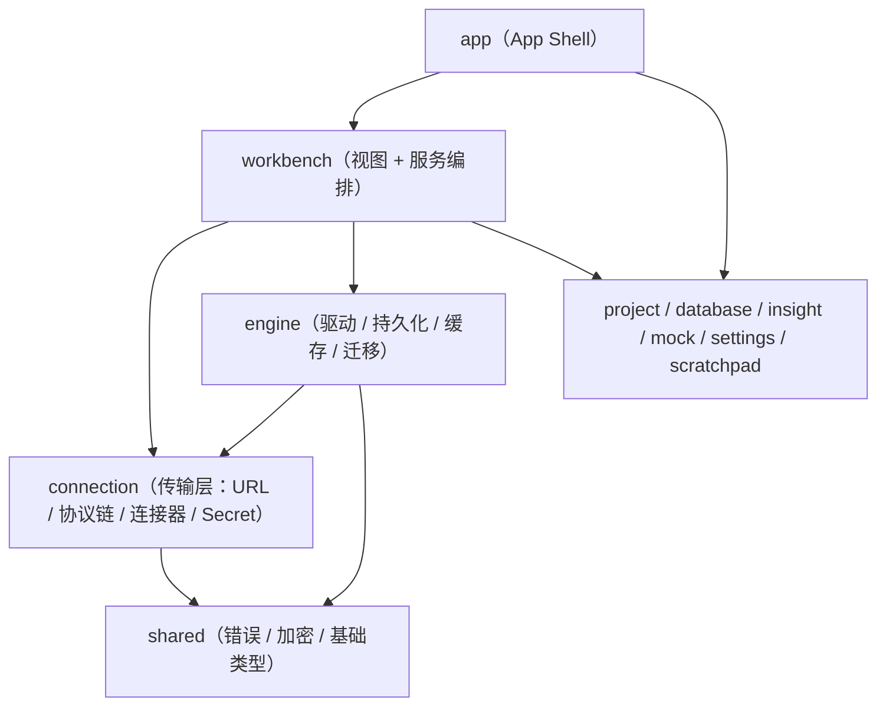
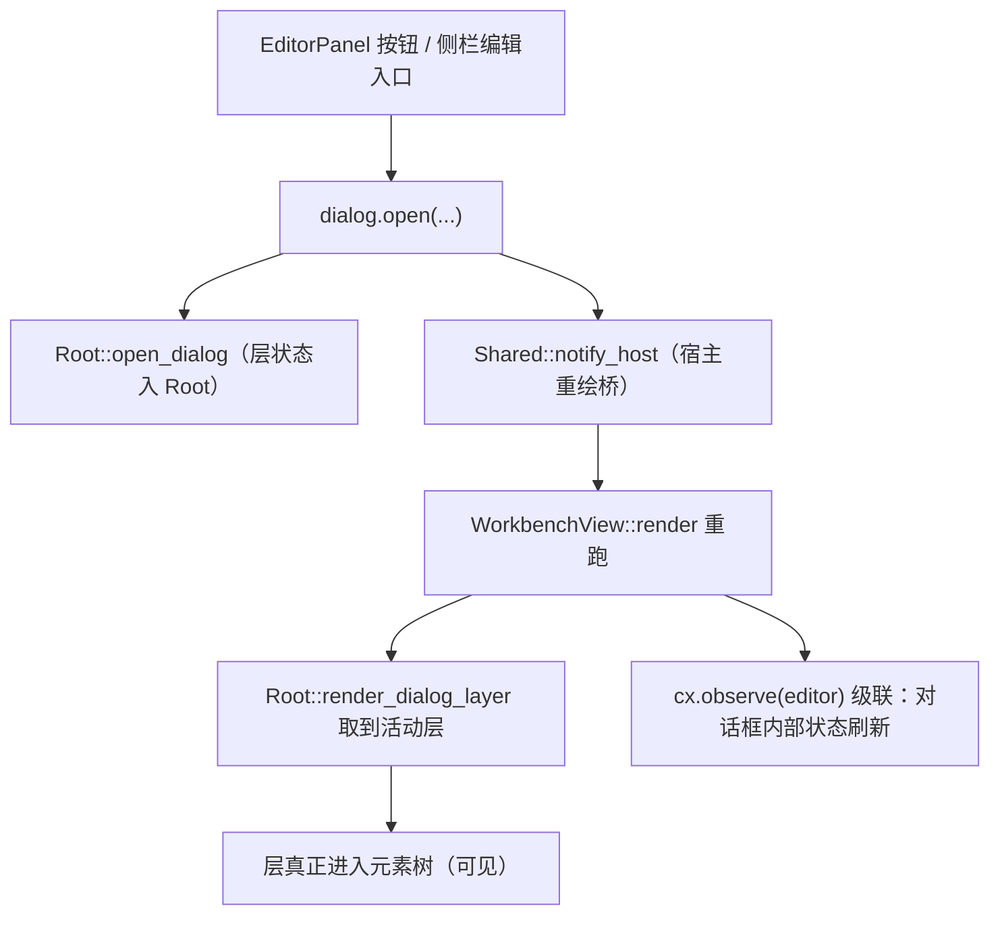
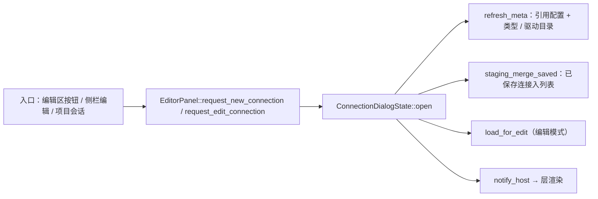
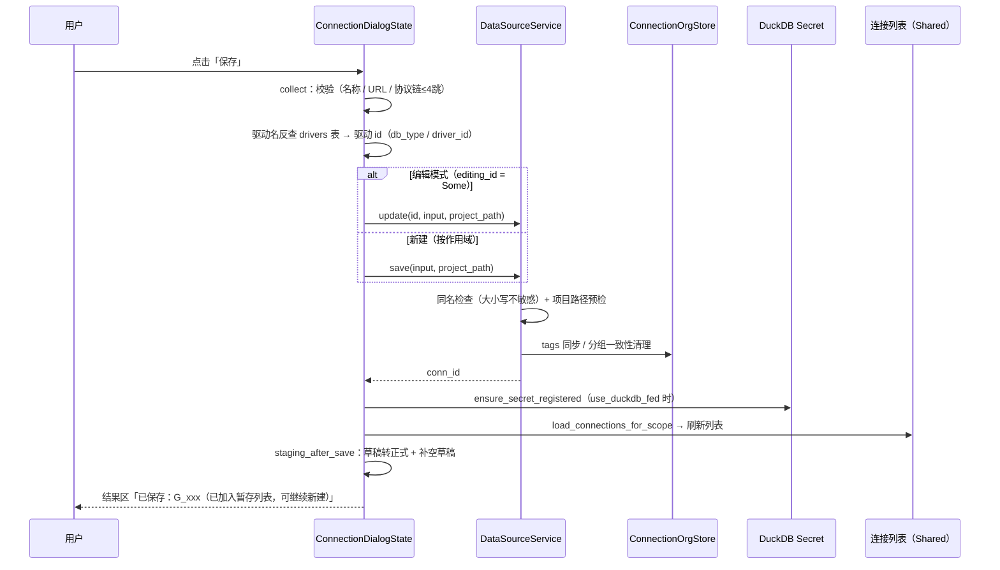
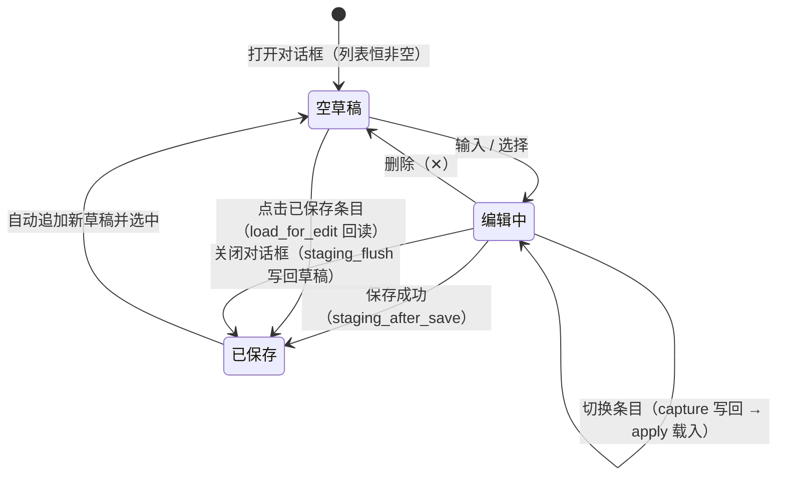
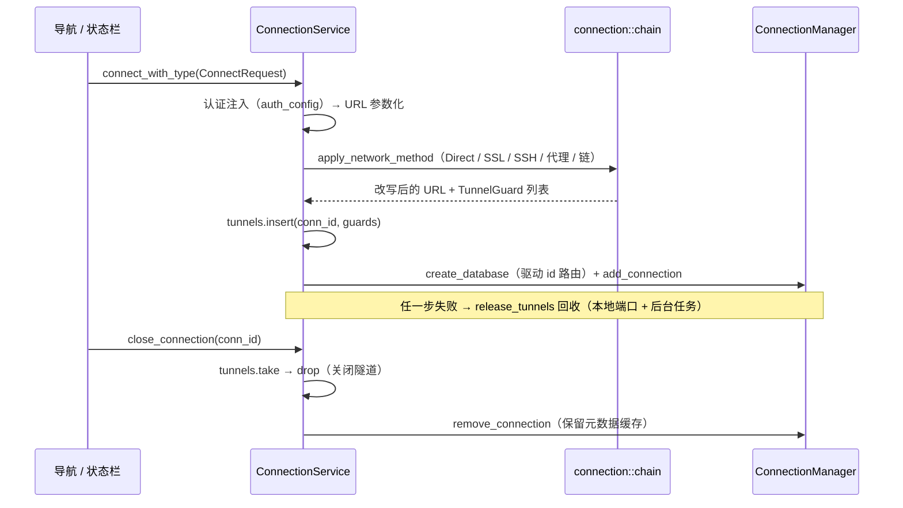
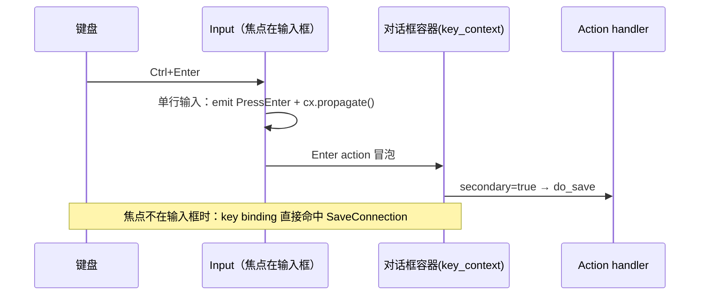

# 数据源连接模块 · 设计架构与数据流（M3）

> 状态：Phase A/B + Phase C（C1/C2/C3/C5）已实现；C4（模板导入导出）暂缓 · 2026-09-11
> 关联：`connection-prototype-design.md`（原型设计，含 §2.2 暂存列表规格）、`connection-dialog-prototype.html`（交互稿）、`connection-dev-plan.md`（开发方案与逐轮记录）
> 读者：参与本模块维护 / 扩展的开发者；也用于排查「入口没反应」「保存后列表没刷新」这类跨层问题

---

## 1. 定位与边界

| 维度 | 结论 |
| --- | --- |
| 负责 | 连接的**新增 / 编辑 / 删除 / 测试**、作用域路由（G_/P_/GP_）、DuckDB Secret 加速、运行态连接与隧道、连接组织元数据（标签 / 分组）的读写入口 |
| 不负责 | 数据源**导航树与对象浏览**（属 database-nav）、元数据内省实现（属 database crate + engine 缓存）、分析资产 |
| 核心交互载体 | 「新建 / 编辑数据源连接」模态对话框（一个对话框内可连续编辑多个连接） |
| 关键约束 | 视图层零裸色值（`cx.theme()`）、I/O 不在 render 中、`connection` crate 不得依赖 `engine`（依赖方向见 §2.1） |

---

## 2. 分层架构

### 2.1 依赖方向（硬约束）

> 规则：**Feature crates → engine, shared, gpui-kit**；`connection` 只允许依赖 `shared`。
> 因此「连接服务」拆成了两半：不依赖 engine 的传输/协议层下沉 `connection`；依赖 engine（持久化、驱动路由）的编排层留在 `workbench`。这就是 C3 分批收敛的由来。

### 2.2 文件落点

| 层 | 文件 | 职责 |
| --- | --- | --- |
| 视图 | `crates/workbench/src/components/connection_dialog/` | 对话框（五 Tab / Header / 侧栏暂存列表 / 三管理器覆盖层）——按职责拆分： |
| 视图 | ├ `mod.rs` | 模块声明与 re-export、常量、`ConnectionDialogState` 字段、输入控件工厂 |
| 视图 | ├ `state.rs` | 构造 / 元数据刷新 / 编辑回读 / `ClonedDialogState`（保存按钮的轻量视图） |
| 视图 | ├ `staging.rs` | `ConnectionDraft` / `Hop`、暂存状态机、持久化映射（`draft_to_row` / `row_to_draft`）、来源短码 |
| 视图 | ├ `render.rs` | `open()`：对话框元素树（Header / Tab / 侧栏 / footer / 快捷键 handler） |
| 视图 | ├ `managers.rs` | 三管理器覆盖层（认证 / 网络 / 环境）CRUD |
| 视图 | └ `helpers.rs` | 图标、Select 赋值、原型卡片/只读行、URL 重拼、作用域标签 |
| 视图 | `crates/workbench/src/panels.rs`（`EditorPanel` / `Shared`） | 入口（`request_new_connection` / `request_edit_connection`）、宿主重绘桥、面板级共享状态 |
| 视图 | `crates/workbench/src/view.rs`（`WorkbenchView`） | 对话框层挂载（`Root::render_dialog_layer`）、观察编辑面板（通知级联） |
| 服务 | `crates/workbench/src/services/data_source_service.rs` | CRUD / 测试连接 / 同名检查 / 作用域路由 / 摘要解析（`parse_url_host_port_db`） |
| 服务 | `crates/workbench/src/services/workspace_loader.rs` | 列表可见性合并（全局 + 项目侧）、运行态 `connected` 填充、删除路由 |
| 服务 | `crates/workbench/src/services/connection_service.rs` | 会话生命周期（connect / close / 列表 / 元数据路径）、隧道登记与回收 |
| 服务 | `crates/workbench/src/services/secret_integration.rs` | DuckDB Secret 注册 / 注销（按 `use_duckdb_fed` 门控） |
| 传输 | `crates/connection/src/{url,url_params,chain,config,connector,factory,stream,known_hosts,secret,model}.rs` | URL 组装与脱敏、参数注入、协议链执行 + `TunnelRegistry`、连接器与流、Secret 语句 |
| 持久 | `crates/engine/src/persistence/{global_db,project_db,connection_store,project_connection_store,connection_org_store,connection_draft_store,driver_store,auth_store,network_store,env_store}.rs` | 全局库 / 项目库 / 最近连接 / 组织元数据 / **暂存草稿** / 驱动与类型目录 / 三类引用配置 |
| 持久 | `crates/engine/migrations/{global,project_meta}/*.sql` | 表结构演进（暂存草稿 = `global/020_add_connection_drafts.sql`） |
| 持久 | `crates/engine/src/migration/*` | 全局系统库初始化（`initialize_global_system` / `install_global_db_manager`）、DuckDB 迁移执行器 |

---

## 3. 概念模型

### 3.1 两层目录：数据库类型 vs 驱动实现

这是最容易误解的一组概念（曾出现「驱动类型下拉绑到了数据库类型」的实现错误）：

| 概念 | 表 | 例子 | 出现位置 |
| --- | --- | --- | --- |
| **数据库类型**（`DataSourceType`） | `data_source_types` | MySQL / PostgreSQL / SQLite / DuckDB / MariaDB / Oracle / ClickHouse…（按 `category`：relational / file-based / analytics / nosql） | 对话框**侧栏分类树**（行首显示类型 `icon` emoji） |
| **驱动实现**（`Driver`） | `drivers` | `MySQL (sqlx)` / `MySQL (Official)` / `SQLite (rusqlite)` / `DuckDB (duckdb-rs)` | 对话框 **Header「驱动」下拉**（只显示**实现短名**，如 `sqlx`） |

- 一个数据库类型下可有多个驱动实现（`drivers.type_id → data_source_types.id`）。
- **UI 分工（2026-09-11 去噪）**：类型只在左侧栏选（暂存条目最左侧显示缩小的类型 UI = 类型 `icon`）；右侧驱动下拉**不再重复类型名**，仅列当前类型的启用驱动并显示实现短名（`driver_short_name`：取 `name` 括号内部分，无括号时原值）。同一类型下短名唯一，跨类型同名（如两个 `Official`）不冲突——下拉选项按类型过滤。
- **落库语义**：连接记录的 `db_type` 与 `driver_id` 都存**驱动 id**（`drivers.id`，如 `mysql_native`）——与之对齐的是引擎运行时 `DriverRegistry` 的 key（`create_database(db_type)` → `DataSourceRouter::route` → registry），选错驱动即连不上。
- 文件型判定用驱动元数据 `drivers.is_file`（不再按名字硬编码）。
- 侧栏点击类型 → 自动选中该类型下第一个启用驱动（Header 联动）；草稿同时记录 `type_id` 与 `driver_id`（恢复时先定类型再定驱动）。

### 3.2 连接记录与作用域（G_/P_/GP_）

| 作用域 | ID 前缀 | 落库位置 | 语义 |
| --- | --- | --- | --- |
| 仅全局 | `G_` | `global.db` 的 `global_connections` | 系统级，所有项目可见 |
| 仅项目 | `P_` | 当前项目 `.RSMETA/project.db` 的 `connections` | 项目私有 |
| 全局 + 项目 | `G_` 定义 + `GP_` 快照 | 全局库 + 项目库各一条 | 项目引用全局快照；规则：项目可引用全局，全局不引用项目私有 |

`update` 按 ID 前缀路由（`id_prefix::{is_project, is_snapshot}`）；`save` 按 UI 作用域选择落库；项目作用域必须提供项目根（未打开项目时由当前项目会话预填，可手改）。

### 3.3 复用引用（认证 / 网络 / 环境）

三类「可复用配置」贯穿连接配置：`auth_configs`（凭据，AES-256-GCM）、`network_configs`（协议链档案）、`environments`（含 5 类策略）。对话框内为「下拉引用 + 管理入口（覆盖层 CRUD）」；选中引用后字段只读（改档案一处全量生效）。

### 3.4 DuckDB Secret 本地加速

- 开启 `use_duckdb_fed` 的连接，保存后把源库凭据注册为 DuckDB `PERSISTENT SECRET`（`SET secret_directory` 指向应用目录，**不写用户主目录**；名称统一小写以匹配 DuckDB 标识符折叠）。
- 关闭开关时清理对应 Secret；Secret 注册失败只告警，不影响连接本身（加速是增强而非依赖）。

### 3.5 暂存草稿（`ConnectionDraft`）

一个对话框内可同时存在多个「正在编辑的连接」：

| 类型 | 特征 | 说明 |
| --- | --- | --- |
| **草稿（Draft）** | `saved_id = None` | 全部字段为内存快照；`✕` 可删除；保存成功后转正式；当前条目有未写回修改时名称旁显示`●` |
| **已保存（Saved）** | `saved_id = Some(id)` | 打开对话框时由 `DataSourceService::list()` 合并生成；点击走 `load_for_edit` 回读；**不在暂存列表删除**（删除入口归导航栏）；名称旁显示来源短码 `P/G/GP` |

- 快照字段 = Header + 五 Tab 的全部可编辑状态（`type_id` 数据库类型、`driver_id` 驱动 id、`driver_name` 实现短名、URL、凭据、作用域与项目路径、SSL、协议链 `Vec<Hop>`、驱动属性、策略覆盖、三类引用）。
- **内存 + 跨会话持久化**：关闭对话框不丢失（状态挂在 `EditorPanel` 的对话框句柄上）；变更与关闭时写入 global.db 的 `connection_drafts` 表（迁移 `020`），重启后首次打开自动恢复。
- **凭据安全边界**：持久化表**不含密码列**（`ConnectionDraftRow` 无 password 字段，恢复后密码框为空），只随正式保存写入连接库（AES-256-GCM）。

---

## 4. 状态所有权与生命周期

### 4.1 状态地图

| 状态 | 存放 | 生命周期 | 谁写 | 谁读 |
| --- | --- | --- | --- | --- |
| 连接列表 / 选中 / 通知文案 | `Shared`（`Rc`） | 应用 | `workspace_loader`、对话框保存 / 删除后 | 侧栏、编辑区、状态栏 |
| 宿主重绘桥 `host_redraw` | `Shared`（`Rc<dyn Fn(&mut App)>`） | 应用 | `WorkbenchView::new` 注入 | 对话框打开 / 关闭、暂存操作 |
| 对话框状态（含草稿列表） | `EditorPanel.dialog: Option<Rc<ConnectionDialogState>>` | 首次打开 → 应用退出 | 对话框自身 | 对话框渲染、侧栏回调 |
| 草稿列表 / 光标 | `ConnectionDialogState.{drafts, draft_cursor}` | 同上 | `staging_*` 方法 | 暂存列表渲染 |
| 三类引用 / 驱动目录 | `ConnectionDialogState.{auth_list, network_list, env_list, types, drivers}` | 对话框打开时刷新 | `refresh_meta` | 各 Tab / 侧栏 |
| 运行时连接 / 隧道守卫 | `ConnectionService`（`ConnectionManager` + `TunnelRegistry`） | 连接建立 → 断开 | `connect_with_type` / `close_connection` | 状态点、元数据服务 |

### 4.2 对话框层挂载与宿主重绘（关键机制）

gpui 的 `cx.notify()` **只重渲染该视图子树**；而 `Root::open_dialog` 只通知 `Root`。对话框层挂在 `WorkbenchView::render` 中，因此：

- **打开 / 关闭**都必须通知宿主：打开漏通知 → 点了没反应；关闭漏通知 → 层残留。
- 对话框**内部**状态刷新（切 Tab、增删协议链跳、暂存切换、测试结果）走 `EditorPanel` 的 notify，由 `WorkbenchView` 的 `cx.observe` 级联到宿主。
- `WorkbenchView` 的事件回调（如侧边栏「编辑」）本身处于宿主 update 上下文，**不能**回调 `notify_host`（借用重入），依赖该回调末尾既有的 `cx.notify()`。

### 4.3 对话框打开 / 关闭语义

| 时机 | 行为 |
| --- | --- |
| 打开（新建） | `open(none)`：重入保护（先 `close_dialog`）→ 刷新引用 / 驱动目录 → 合并已保存连接入暂存列表 → 项目根预填（不覆盖已填值） |
| 打开（编辑） | `open(Some(id))`：额外 `load_for_edit(id)` 回读全部字段 |
| 保存成功 | **不关闭**：草稿转正式 + 自动补空草稿（连续编辑），结果区提示；连接列表即时刷新 |
| 取消 / Esc / 点遮罩 | `staging_flush`（写回当前草稿）→ `close_dialog` → 通知宿主移除层 |

---

## 5. 数据流

### 5.1 打开对话框

### 5.2 保存链路（新建 / 编辑）

### 5.3 暂存列表状态机（多连接连续编辑）

capture / apply 的数据边界（切换条目的正确性依赖它）：

| 方向 | 覆盖内容 |
| --- | --- |
| `capture_draft`（表单 → 草稿） | 名称 / 类型与驱动（`type_id` + `driver_id` + 实现短名）/ URL / 用户名密码 / 备注 / 作用域与项目路径 / SSL 四项 / 缓存路径 / 联邦开关 / 当前 Tab / 协议链 / 驱动属性 / 策略覆盖 / 三类引用 |
| `apply_draft`（草稿 → 表单） | 同上；驱动先恢复类型再按驱动 id（回退短名）选中；字符串型 Select 为空时清空选中（`set_selected_index(None)`） |

持久化时机（`connection_drafts` 表；详见 §3.5）：

| 时机 | 行为 |
| --- | --- |
| 首次打开对话框 | `staging_restore`：仅当仍为初始「单个空草稿」时用库中条目替换（避免覆盖本会话已编辑内容），并 `apply_draft(0)` 载入表单 |
| 变更操作（添加 / 切换 / 删除 / 保存后） | `staging_persist`：全量替换写入（条目通常个位数） |
| 关闭对话框（保存并关闭 / 取消 / Esc / 遮罩） | `staging_flush`：先写回当前表单再落库 |

### 5.4 运行时连接与隧道

### 5.5 键盘快捷键（Action + key context）

对话框层独立于「workbench」key context，快捷键在为对话框容器声明的 `"connection-dialog"` 上下文中生效（app 层 `bind_keys`，见 `crates/app/src/main.rs`）：

| 按键 | Action | 说明 |
| --- | --- | --- |
| `Ctrl+Enter` | `SaveConnection` | 保存；焦点在输入框内时由 Input 的 `Enter` action（`secondary = true`）冒泡到容器兜底 |
| `Ctrl+T` | `TestConnection` | 测试连接 |
| `↑` / `↓` | `DraftPrev` / `DraftNext` | 切换暂存条目（焦点在输入框内时 ↑↓ 仍归 Input 的光标移动） |
| `Esc` | gpui-base `Cancel` | 关闭对话框（组件内置，context "Dialog"；关闭路径与取消一致写回草稿） |

---

## 6. 关键设计决策与取舍

| # | 决策 | 理由 / 代价 |
| --- | --- | --- |
| 1 | 传输/协议层下沉 `connection`，编排层留 `workbench` | 依赖方向硬约束；代价是「连接服务」被拆两处，需按职责定位 |
| 2 | `db_type` / `driver_id` 存**驱动 id** | 与引擎 `DriverRegistry` key 对齐；驱动目录可扩展（多实现同库） |
| 3 | 对话框状态用 `Rc<ConnectionDialogState>` | 侧栏 / 管理器的回调需要克隆状态句柄调用方法；代价是 `EditorPanel` 字段非 `Entity`（不参与 gpui 观察，靠 `host_redraw` + `observe` 显式驱动） |
| 4 | 打开 / 关闭显式通知宿主重绘 | 绕开「Root 的 notify 到不了子视图」；代价是每个新入口都要记得调用（已有 4 类测试兜底） |
| 5 | 保存后**不关闭**对话框，另提供「保存并关闭」 | 连续编辑多个连接的前提；「保存并关闭」兼容会话式操作（`do_save` 共用同一闭包） |
| 6 | 草稿**跨会话持久化**到 `connection_drafts`（无密码列） | 应用退出不丢草稿；凭据不落此表，恢复后密码框为空，安全边界不变 |
| 7 | 已保存连接在暂存列表**不提供删除** | 删除是不可逆操作，入口统一收敛到导航栏（有确认与作用域路由） |
| 8 | 引用配置「选中即只读」 | 复用语义（改一处全量生效）的强制体现；代价是不能局部覆盖引用字段 |
| 9 | 图标按资产路径加载（`lucide()`） | `IconName` 只含组件默认子集；`AllAssets` 注册全量 Lucide，按路径可用 |
| 10 | 测试/编译固定 `-j 2` | 并发链接 DuckDB 静态库会耗尽内存（rustc 崩溃 + 宿主卡顿，见 `.cargo/config.toml`） |
| 11 | 暂存条目直显来源短码（`P/G/GP`）与脏标记（`●`） | 连续编辑时快速辨识作用域与未写回修改；不引入自绘 tooltip（gpui-kit 0.6 需 TooltipOverlay 集成，收益不值） |
| 12 | 快捷键用 Action + `key_context("connection-dialog")` | 对话框层不在 workbench 元素子树内，需独立 context；焦点在输入框时靠 `Enter` action 冒泡兜底 |
| 13 | 对话框拆为 `connection_dialog/{mod,state,staging,render,managers,helpers}.rs` | 单文件降至 176 行（入口）；子模块 `use super::*` 共享导入，公开路径不变；同步删除废弃的 `collect`/`hops_valid` 副本 |
| 14 | 草稿存储双入口：生产需全局单例，测试 `set_db_path_override` | 未初始化全局系统的进程（测试 / 降级启动）拒绝写库，避免误写用户真实 `global.db` |
| 15 | 类型在左侧选、驱动只显示实现短名 | 消除重复噪音（每个驱动项不再携带类型名）；代价是驱动短名依赖 `name` 括号约定，靠 `driver_short_name` 纯函数 + 单测兜底（无括号时原值不丢信息） |
| 16 | 暂存条目类型徽标用类型 `icon`（emoji） | 与左侧类型树同一套视觉语言，零图标资产成本；无类型/旧草稿时回退状态点，Header 同步提示（“请先在左侧选择数据库类型”） |

---

## 7. 测试策略

| 层次 | 文件 | 覆盖 |
| --- | --- | --- |
| 传输单测 | `crates/connection/src/*`（含 `chain.rs`） | URL 处理族 / 参数注入 / 隧道注册表 / Secret |
| 传输集成 | `crates/connection/tests/tunnel_roundtrip.rs` | SOCKS5 / HTTP CONNECT / 两跳链真实数据往返 + 守卫释放关闭 |
| 服务层 | `crates/workbench/tests/data_source_lifecycle.rs` | 保存 / 回读 / 更新 / 删除 / 同名拦截 / 作用域预检 / tags 同步 |
| 服务层 | `real_connections.rs` / `connection_scope_and_state.rs` / `global_service_singleton.rs` | 加载器契约 / 可见性与运行态 / 单例生产路径 |
| 服务层 | `connection_tunnel_cleanup.rs` | 连接失败后隧道回滚（`tunnel_count == 0`） |
| 窗口 | `connection_dialog_ui.rs` | 打开 / 渲染 / 关闭、五 Tab、编辑入口、状态保留、重入不叠加 |
| 窗口 | `dialog_host_layer.rs` | 入口调起（`debug_bounds("dialog-layer")`）、关闭移除层、面板 notify 级联 |
| 窗口 | `connection_staging.rs` | 暂存：切换保留字段 / 删至最后补位 / 保存后转正式补位 / 已保存不参与删除 |
| 窗口 | `connection_drafts_persist.rs` | 跨会话恢复：变更落库 → 新状态恢复草稿与表单；**密码不落库**（恢复后为空） |
| 窗口 | `connection_type_driver.rs` | 类型 × 驱动两层选择：选类型→下拉切到该类型启用驱动并默认选中（短名）；按驱动 id 回读（跨类型同名短名不歧义）；快照携带 `type_id` / `driver_id` |
| 单测 | `connection_dialog/helpers.rs`（内嵌） | `driver_short_name` 括号提取与回退 / `find_driver_by_value` 三路匹配 / 类型过滤 / 类型徽标 emoji 回退 |
| 窗口+服务 | `connection_multi_save.rs` | 连续保存两条连接（单例临时库）：暂存列表转正式 + 补空草稿；库中两条可读回 |
| 存储单测 | `engine::persistence::connection_draft_store`（内嵌） | 行序 roundtrip / 全量替换语义 / 表无 password 列（安全约定） |

约定：测试全部落临时目录、不触真实库；`#[gpui_kit::test]` 且**禁用通配导入**（避免 `#[test]` 宏遮蔽，见 gpui-kit-dev skill）。

---

## 8. 实现进度与后续

已实现（本轮）：

| # | 项 | 实现位置 |
| --- | --- | --- |
| 1 | 「保存并关闭」按钮 | `render.rs` footer（与保存共用 `do_save` 闭包） |
| 2 | 草稿跨会话持久化（无密码） | `global/020_add_connection_drafts.sql` + `engine::persistence::connection_draft_store` + `staging_{restore,persist}` |
| 3 | 侧栏条目来源短码 / 脏标记 | `staging.rs::saved_scope_short` + `staging.rs::draft_dirty`（render 处徽标与 `●`） |
| 4 | 键盘导航 | `crates/workbench/src/commands.rs`（actions）+ `app/main.rs`（bind_keys）+ `render.rs`（容器 handler） |
| 5 | 拆分对话框单文件 | `components/connection_dialog/{mod,state,staging,render,managers,helpers}.rs` |
| 6 | 导航栏「在对话框中编辑」入口 | `panels.rs::render_connection_row`（✎ 按钮 → `shared.open_edit`） |
| 7 | 真机集成用例 | `tests/connection_multi_save.rs`（连续保存两条） |
| 8 | 文档防腐 | 本文（§2.2 / §3.5 / §5.3 / §5.5 / §6 / §7 / §9） |
| 9 | 类型 × 驱动两层选择去噪（左侧选类型 / 右侧驱动实现短名；未选类型时 Header 提示） | `helpers.rs`（`driver_short_name` / `type_badge`）、`state.rs`（`select_type` / `set_driver_by_value`）、`render.rs` |
| 10 | 暂存条目类型徽标 + 草稿 `type_id` / `driver_id`（迁移 `021`） | `staging.rs`、`global/021_add_draft_type_driver.sql` |
| 11 | **布局稳定**：Tab 内容区固定高度 + 内部滚动（切 Tab 不再改变对话框高度） | `render.rs`（`tab_body` + `overflow_y_scrollbar`） |
| 12 | **性能修复**：元数据 / 暂存恢复一次性（`meta_refreshed`）——避免 dialog builder 重渲染反复建 runtime + 查库 | `mod.rs` 字段 + `render.rs` + `panels.rs::request_*` |
| 13 | **Header 去拥挤**：作用域三态分段按钮 + 项目名（悬停气泡显示完整路径；未打开项目保留可编辑路径） | `render.rs`（`project_hover`） |
| 14 | **标签 / 分组入口**：常规 Tab「组织」卡片（标签输入 + 项目分组勾选）；服务与存储同步（替换语义，迁移 `022`） | `render.rs`、`data_source_service.rs`、`connection_org_store.rs::set_connection_groups` |
| 15 | 文档体系补全：用户指南（含 USIT 清单）+ 数据字典 / 降级矩阵 / 性能可观测安全 / 成熟度评估 | `connection-user-guide.md`、本文 §10–§13 |

后续可选（未做）：

| # | 项 | 价值 | 前置 |
| --- | --- | --- | --- |
| A | C4 模板导入导出（无密码） | 团队间共享连接配置；与草稿快照结构天然同源 | 按用户决策暂缓（本轮不做） |
| B | 暂存条目拖拽排序 / 「测试全部」 | 批量配置的可用性 | gpui-kit 0.6 无开箱拖拽，可用上下移替代 |
| C | 自绘 tooltip（暂存条目短码释义） | 减少认知成本 | 需接入 gpui-base `TooltipOverlay` |
| D | 分组 / 标签管理与视图（新建分组、按标签检索） | 组织能力的消费侧 | 导航模块（database-nav） |
| E | 国际化 / 可访问性 / 指标（§13 缺口） | 平台级能力 | 全局排期 |

---

## 9. 实现位置映射

| 设计决策 | 代码 |
| --- | --- |
| 对话框（五 Tab / Header / 侧栏 / 暂存列表 / 管理器） | `crates/workbench/src/components/connection_dialog/{render,managers,helpers}.rs` |
| 草稿快照与暂存方法 | `connection_dialog/staging.rs`（`ConnectionDraft` + `staging_*`） |
| 快捷键 Action | `crates/workbench/src/commands.rs` + `crates/app/src/main.rs` |
| 入口与宿主重绘桥 | `crates/workbench/src/panels.rs`（`EditorPanel::{request_new_connection, request_edit_connection}`、`Shared::{host_redraw, notify_host}`） |
| 对话框层挂载与通知级联 | `crates/workbench/src/view.rs`（`Root::render_dialog_layer`、`cx.observe(editor)`） |
| 连接 CRUD / 测试 / 作用域路由 | `crates/workbench/src/services/data_source_service.rs` |
| 列表可见性与运行态 | `crates/workbench/src/services/workspace_loader.rs` |
| 会话与隧道登记 | `crates/workbench/src/services/connection_service.rs` + `crates/connection/src/chain.rs` |
| 驱动 / 类型目录与三类引用 | `crates/engine/src/persistence/{driver_store,auth_store,network_store,env_store}.rs` |
| 组织元数据（标签 / 分组） | `crates/engine/src/persistence/connection_org_store.rs` |
| 暂存草稿持久化 | `crates/engine/src/persistence/connection_draft_store.rs` + `crates/engine/migrations/global/020_add_connection_drafts.sql` |
| Secret 加速 | `crates/workbench/src/services/secret_integration.rs` + `crates/connection/src/secret.rs` |
| 暂存行为测试 | `crates/workbench/tests/connection_staging.rs`、`connection_drafts_persist.rs`、`connection_multi_save.rs` |
| 类型 × 驱动与去噪 | `connection_dialog/{helpers,state}.rs`（`driver_short_name` / `find_driver_by_value` / `select_type`）、`tests/connection_type_driver.rs` |
| 标签 / 分组入口 | `connection_dialog/{render,staging,state}.rs`（组织卡片 + 草稿字段）、`services/data_source_service.rs`（`list_groups` / `groups_of` / `set_connection_groups`）、`engine/connection_org_store.rs`（`set_connection_groups`） |
| Layout 稳定与性能标记 | `render.rs`（`tab_body` 固定高度 + `overflow_y_scrollbar`；`meta_refreshed` / `project_hover` 字段） |
| 用户使用指南 | `docs/architecture/connection/connection-user-guide.md` |

---

## 10. 数据字典与迁移

### 10.1 表一览（连接模块相关）

| 表 | 库 | 关键列 | 用途 |
| --- | --- | --- | --- |
| `global_connections` | global | `id`(G_)、`name`、`db_type`、`driver_id`、`url`、`username`、`password_encrypted`、`scope` 相关、`tags`、`advanced_options`、`driver_properties`、`use_duckdb_fed`、`metadata_path` | 连接定义（全局） |
| `connections` | project | 同上（P_/GP_） | 连接定义（项目侧） |
| `data_source_types` | global | `id`、`name`、`category`、`icon` | 侧栏类型目录（icon 为首字符 emoji） |
| `drivers` | global | `id`、`type_id`、`name`、`driver_kind`、`is_file`、`default_port`、`url_template`、`config_schema`、`capabilities`、`driver_properties`、`enabled` | 驱动目录 |
| `auth_configs` | global | `id`、`name`、`auth_type`、`auth_data`(AES) | 认证引用 |
| `network_configs` | global | `id`、`name`、`method`、`chain`(JSON)、`capabilities` | 网络引用（协议链） |
| `environments` | global | `id`、`name`、`policies`(JSON) | 环境 + 策略 |
| `connection_tags` | global + project | `connection_id`、`tag` | 标签**权威检索表** |
| `connection_groups` / `connection_group_members` | project | `id`/`name`/`sort_order`；`group_id`/`connection_id`/`sort_order` | 项目级分组（多对多 + 组内排序） |
| `connection_drafts` | global | `position`、`name`、`saved_id`、`type_id`、`driver_id`、`driver_name`、`url`、`username`、`remark`、`scope`、`project_path`、`ssl_*`、`cache_path`、`duckdb_fed`、`active_tab`、`hops_json`、`props_json`、`sec_overrides_json`、`auth_ref`、`network_ref`、`env`、`tags`、`groups_json` | 对话框暂存列表（**无密码列**） |

### 10.2 字段语义要点

- `db_type` / `driver_id`：**均为驱动 id**（如 `mysql_native`），与引擎 `DriverRegistry` key 对齐；显示名（`MySQL (sqlx)`）仅存于 `drivers.name`，UI 展示用 `driver_short_name` 取括号内实现名。
- `tags`：JSON 数组文本；检索与导航消费统一读 `connection_tags`（`tags` 为兼容投影）。
- `advanced_options`：内嵌 `ssl`（mode/ca/cert/key）与 `policy_overrides`。
- `connection_drafts.position`：列表下标即主键（全量替换写入）。

### 10.3 迁移清单（连接模块相关）

| 迁移 | 内容 |
| --- | --- |
| `global/008` | 数据源模块建表（types / drivers / connections / 引用配置） |
| `global/009` | ID 前缀约定 |
| `global/010` | `auth_method` |
| `global/011` | 配置索引 |
| `global/012` | 网络配置 `auth_config_id` |
| `global/013` | 原生驱动（`mysql_native` / `postgres_native`） |
| `global/014` | 驱动 ID 与 Registry key 对齐 |
| `global/016` | 驱动属性 |
| `global/017` | 网络能力集 |
| `global/020` | `connection_drafts`（暂存列表） |
| `global/021` | 草稿 `type_id` / `driver_id` |
| `global/022` | 草稿 `tags` / `groups_json` |
| `project_meta/*` | 项目侧连接 / 分组 / 导航状态（见导航模块方案） |

> 迁移采用 include_dir 编译期嵌入 + 版本号幂等执行；新增列一律带默认值，旧行安全。

---

## 11. 错误处理与降级矩阵

| 失败点 | 用户可见表现 | 处理策略 |
| --- | --- | --- |
| 全局系统未初始化 | 列表空 + 提示 | 降级运行（连接 CRUD 不可用，其余界面可用） |
| 保存失败（校验 / 同名 / 落库） | 结果行红色 + 原因，对话框不关闭 | 草稿保留，可修正后重试 |
| 测试连接失败 | 结果行红色 + 原因 | 不写库；协议链隧道回滚 |
| 隧道建立后握手失败 | 连接报错 | `release_tunnels` 回收（本地端口 + 后台 accept） |
| DuckDB Secret 注册失败 | 无提示（日志告警） | 不影响连接本身（加速为增强能力） |
| 标签 / 分组同步失败 | 无提示（日志告警） | 不阻断保存 |
| 草稿持久化失败 | 无提示（日志告警） | 内存草稿仍可用 |
| 元数据（引用 / 类型 / 驱动）拉取失败 | 对应下拉为空 | 不阻断其他字段；下次打开重试 |
| 未打开项目 + 项目作用域 | 保存被拦截并提示 | 引导改「仅全局」或先打开项目 |
| 驱动目录缺该驱动 | 下拉未选中 | 完整名 / 短名回退解析；仍失败需手选类型 |

---

## 12. 性能、可观测性与安全

**性能约束与手段**

- 元数据（引用 / 类型 / 驱动 / 分组）**每次打开对话框拉取一次**：`meta_refreshed` 标记避免 dialog builder 重渲染时反复建 tokio runtime + 查库。
- 驱动下拉只含当前类型启用驱动；类型过滤在内存完成。
- 暂存列表条目通常为个位数，全量替换写入（DELETE + INSERT）。
- Tab 内容区固定高度 + 内部滚动：切换 Tab 不重排侧栏 / Header。
- 协议链 ≤ 4 跳；隧道按连接 ID 注册与回收。

**可观测性**

- 日志 target：`data_source_service`（保存 / 更新 / 标签 / 分组）、`connection_service`（会话与隧道）。
- 关键事件：保存成功 / 失败、标签同步、分组同步、Secret 注册失败。
- 实例日志：`target/rds-app.log` / `target/rds-app.err.log`。
- 诊断接口：`ConnectionService::tunnel_count`（测试与排查隧道泄漏）。

**安全边界**

| 项 | 做法 |
| --- | --- |
| 连接凭据 | `auth_store` AES-256-GCM；连接记录存 `password_encrypted` |
| 草稿 | `connection_drafts` **无密码列**；恢复后密码框为空 |
| DuckDB Secret | `PERSISTENT` + `SET secret_directory` 指向应用目录（不写用户主目录） |
| URL 展示 | 列表 / 日志脱敏（`mask_password_in_url`） |
| 模板导入导出（C4，未实现） | 约定不含凭据 |

---

## 13. 成熟度评估（工业级对照）

| 维度 | 现状 | 评级 | 主要缺口 |
| --- | --- | --- | --- |
| 需求与边界 | 模块边界明确（不含导航视图） | 良 | — |
| 架构与依赖 | 硬约束 + 六文件分层 + 类型所有权清晰 | 良 | — |
| 数据模型 | 表 / 字段 / 迁移字典（§10）+ 兼容策略 | 良 | 缺模式版本号（草稿 JSON 结构演进） |
| 交互设计 | 原型文档 + 可交互 HTML + 主题 token 映射 | 良 | 缺多分辨率 / 高 DPI 截图基线 |
| 使用文档 | 用户指南 + USIT 清单（`connection-user-guide.md`） | 良 | 缺录屏 / 动图 |
| 测试 | 单测 / 窗口测试 / 服务集成 / 真机用例；临时库隔离 | 良 | 缺 UI 图像回归、缺 fuzz / 属性测试 |
| 错误处理 | 降级矩阵（§11）+ 结果行内联提示 | 中良 | 缺统一错误码与用户可复制的诊断号 |
| 性能 | 一次性元数据、固定布局、写入量小 | 中 | 缺基准数据与大数据量（数千连接）验证 |
| 可观测性 | 结构化日志 + 诊断接口 | 中 | 缺指标（metric）与面板 / 追踪 |
| 安全 | 凭据加密、草稿无密码、Secret 隔离、日志脱敏 | 良 | 缺审计日志与凭据轮换策略 |
| 国际化 | 中文硬编码 | 弱 | 无 i18n 框架接入 |
| 可访问性 | 快捷键 + 焦点可用 | 中 | 缺屏幕阅读器语义与焦点顺序规范 |
| 发布与回滚 | 迁移幂等 + 版本号 | 中良 | 缺向下回滚脚本 |

**结论**：核心链路（新建 / 编辑 / 暂存 / 保存 / 测试 / 作用域 / 组织元数据）已达到
“可交付的工业级雏形”：架构、数据模型、迁移、测试与使用文档齐备，缺陷集中在
**i18n / 可访问性 / 可观测指标 / 性能基准 / 审计与凭据轮换**——这些属于平台级能力，
建议随全局（非本模块单独）能力排期。
