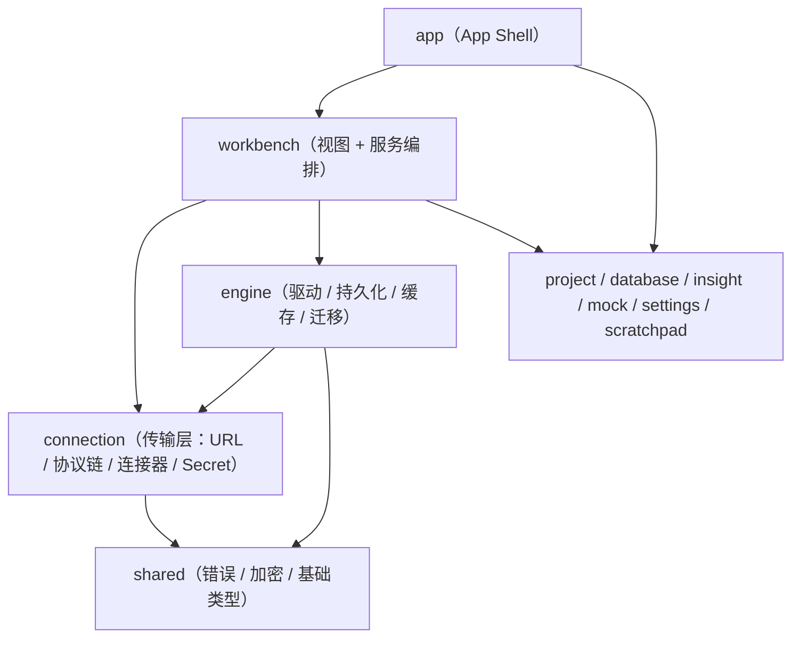
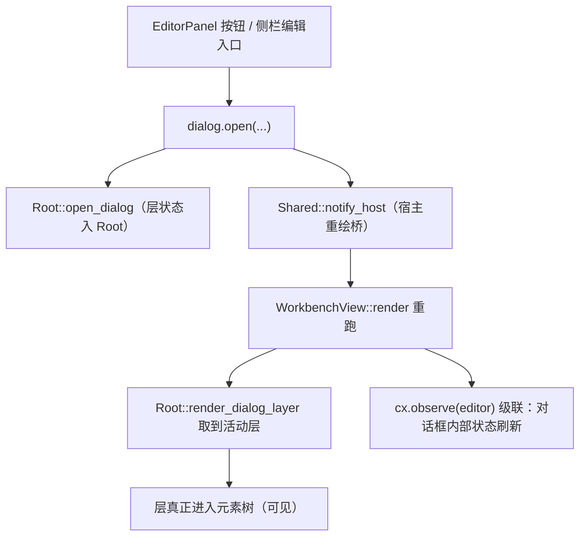
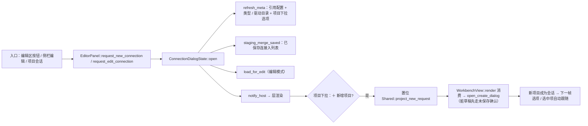
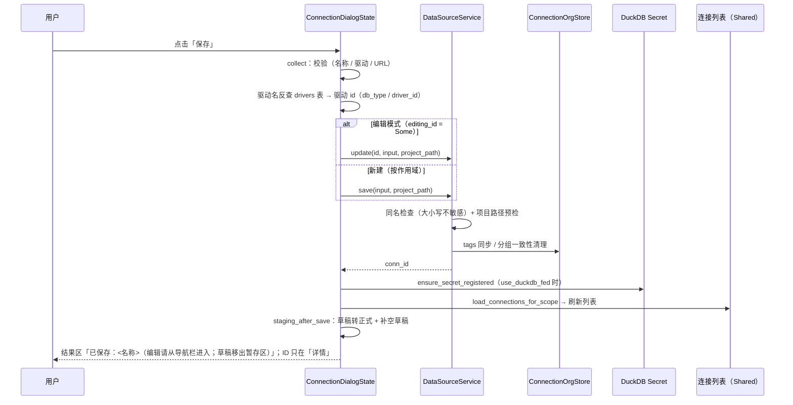
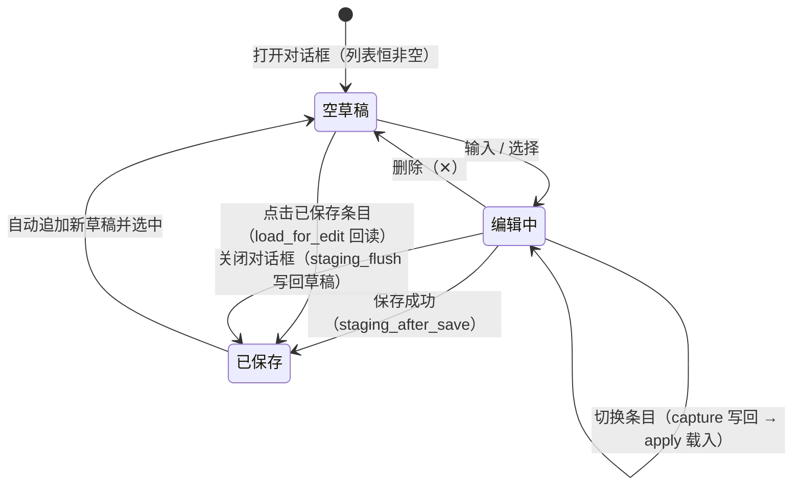
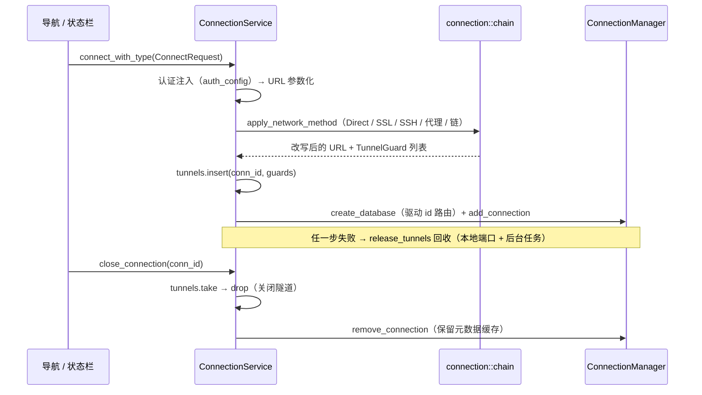
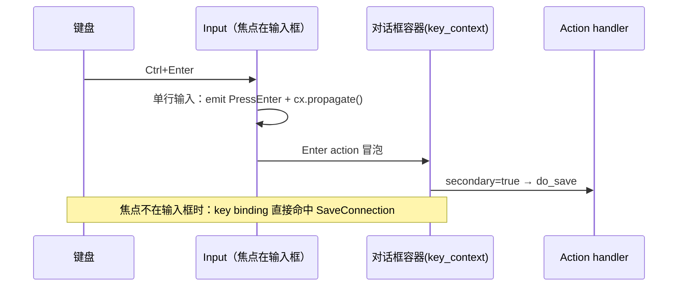

# 数据源连接模块 · 设计架构与数据流（M3）

> 状态：Phase A/B + Phase C（C1–C3、C5–C18）已实现；C4（模板导入导出）**能力就绪、UI 入口暂缓** ；已知缺口见 §14 · 2026-09-12
> 关联：`connection-prototype-design.md`（原型设计，含 §2.2 暂存列表规格）、`connection-dialog-prototype.html`（交互稿）、`connection-dev-plan.md`（开发方案与逐轮记录）、`../../theme/ui-constraints.md`（尺寸与控件约束）
> 读者：参与本模块维护 / 扩展的开发者；也用于排查「入口没反应」「保存后列表没刷新」这类跨层问题

---

## 1. 定位与边界

| 维度 | 结论 |
| --- | --- |
| 负责 | 连接的**新增 / 编辑 / 删除 / 测试**、作用域路由（G_/P_/GP_）、DuckDB Secret 加速、运行态连接与隧道、连接组织元数据（标签 / 分组）的读写入口 |
| 不负责 | 数据源**导航树与对象浏览**（属 database-nav）、元数据内省实现（属 database crate + engine 缓存）、分析资产 |
| 核心交互载体 | 「新建 / 编辑数据源连接」模态对话框（一个对话框内可连续编辑多个连接） |
| 关键约束 | 视图层零裸色值（`cx.theme()`）、I/O 不在 render 中、`connection` crate 不得依赖 `engine`（依赖方向见 §2.1） |

---

## 2. 分层架构

### 2.1 依赖方向（硬约束）

> 规则：**Feature crates → engine, shared, gpui-kit**；`connection` 只允许依赖 `shared`。
> 因此「连接服务」拆成了两半：不依赖 engine 的传输/协议层下沉 `connection`；依赖 engine（持久化、驱动路由）的编排层留在 `workbench`。这就是 C3 分批收敛的由来。

### 2.2 文件落点

| 层 | 文件 | 职责 |
| --- | --- | --- |
| 视图 | `crates/workbench/src/components/connection_dialog/` | 对话框（五 Tab / Header / 侧栏暂存列表 / 三管理器覆盖层）——按职责拆分： |
| 视图 | ├ `mod.rs` | 模块声明与 re-export、常量、`ConnectionDialogState` 字段、输入控件工厂 |
| 视图 | ├ `state.rs` | 构造 / 元数据刷新 / 编辑回读 / `ClonedDialogState`（保存按钮的轻量视图） |
| 视图 | ├ `staging.rs` | `ConnectionDraft`、暂存状态机、持久化映射（`draft_to_row` / `row_to_draft`）、来源短码 |
| 视图 | ├ `render.rs` | `open()`：对话框元素树（Header / Tab / 侧栏 / footer / 快捷键 handler） |
| 视图 | ├ `managers.rs` | 三管理器覆盖层（认证 / 网络 / 环境）CRUD |
| 视图 | └ `helpers.rs` | 图标、Select 赋值、原型卡片/只读行、URL 重拼、作用域标签、尺寸常量（`GAP_*` / `LABEL_W` / `BADGE_*` / `PROJECT_W` / `DRIVER_W` / `TAB_BODY_H` / `STAGING_H` / `ROW_H`） |
| 视图 | └ `project_picker.rs` | 项目下拉项 `ProjectItem`（项目名 + 路径双列、搜索、末项「＋ 新增项目」） |
| 视图 | `crates/workbench/src/panels/`（`EditorPanel` / `Shared`） | 入口（`request_new_connection` / `request_edit_connection`）、项目下拉订阅（`ensure_dialog_subscription`）、宿主重绘桥、面板级共享状态（含 `project_new_request`） |
| 视图 | `crates/workbench/src/view.rs`（`WorkbenchView`） | 对话框层挂载（`Root::render_dialog_layer`）、观察编辑面板（通知级联） |
| 服务 | `crates/workbench/src/services/data_source_service.rs` | CRUD / 测试连接 / 同名检查 / 作用域路由 / 摘要解析（`parse_url_host_port_db`） |
| 服务 | `crates/workbench/src/services/workspace_loader.rs` | 列表可见性合并（全局 + 项目侧）、运行态 `connected` 填充、删除路由 |
| 服务 | `crates/workbench/src/services/connection_service.rs` | 会话生命周期（connect / close / 列表 / 元数据路径）、隧道登记与回收 |
| 服务 | `crates/workbench/src/services/secret_integration.rs` | DuckDB Secret 注册 / 注销（按 `use_duckdb_fed` 门控） |
| 传输 | `crates/connection/src/{url,url_params,chain,config,connector,factory,stream,known_hosts,secret,model}.rs` | URL 组装与脱敏、参数注入、协议链执行 + `TunnelRegistry`、连接器与流、Secret 语句 |
| 持久 | `crates/engine/src/persistence/{global_db,project_db,connection_store,project_connection_store,connection_org_store,connection_draft_store,driver_store,auth_store,network_store,env_store}.rs` | 全局库 / 项目库 / 最近连接 / 组织元数据 / **暂存草稿** / 驱动与类型目录 / 三类引用配置 |
| 持久 | `crates/engine/migrations/{global,project_meta}/*.sql` | 表结构演进（暂存草稿 = `global/020_add_connection_drafts.sql`） |
| 持久 | `crates/engine/src/migration/*` | 全局系统库初始化（`initialize_global_system` / `install_global_db_manager`）、DuckDB 迁移执行器 |

---

## 3. 概念模型

### 3.1 两层目录：数据库类型 vs 驱动实现

这是最容易误解的一组概念（曾出现「驱动类型下拉绑到了数据库类型」的实现错误）：

| 概念 | 表 | 例子 | 出现位置 |
| --- | --- | --- | --- |
| **数据库类型**（`DataSourceType`） | `data_source_types` | MySQL / PostgreSQL / SQLite / DuckDB / MariaDB / Oracle / ClickHouse…（按 `category`：relational / file-based / analytics / nosql） | 对话框**侧栏分类树**（行首显示类型 `icon` emoji） |
| **驱动实现**（`Driver`） | `drivers` | `MySQL (sqlx)` / `MySQL (Official)` / `SQLite (rusqlite)` / `DuckDB (duckdb-rs)` | 对话框 **Header「驱动」下拉**（只显示**实现短名**，如 `sqlx`） |

- 一个数据库类型下可有多个驱动实现（`drivers.type_id → data_source_types.id`）。
- **UI 分工（2026-09-11 去噪）**：类型只在左侧栏选（暂存条目最左侧显示缩小的类型 UI = 类型 `icon`）；右侧驱动下拉**不再重复类型名**，仅列当前类型的启用驱动并显示实现短名（`driver_short_name`：取 `name` 括号内部分，无括号时原值）。同一类型下短名唯一，跨类型同名（如两个 `Official`）不冲突——下拉选项按类型过滤。
- **落库语义**：连接记录的 `db_type` 与 `driver_id` 都存**驱动 id**（`drivers.id`，如 `mysql_native`）——与之对齐的是引擎运行时 `DriverRegistry` 的 key（`create_database(db_type)` → `DataSourceRouter::route` → registry），选错驱动即连不上。
- 文件型判定用驱动元数据 `drivers.is_file`（不再按名字硬编码）。
- 侧栏点击类型 → 自动选中该类型下第一个启用驱动（Header 联动）；草稿同时记录 `type_id` 与 `driver_id`（恢复时先定类型再定驱动）。

### 3.2 连接记录与作用域（G_/P_/GP_）

| 作用域 | ID 前缀 | 落库位置 | 语义 |
| --- | --- | --- | --- |
| 仅全局 | `G_` | `global.db` 的 `global_connections` | 系统级，所有项目可见 |
| 仅项目 | `P_` | 当前项目 `.RSmeta/project.db` 的 `connections` | 项目私有 |
| 全局 + 项目 | `G_` 定义 + `GP_` 快照 | 全局库 + 项目库各一条 | 项目引用全局快照；规则：项目可引用全局，全局不引用项目私有 |

> `GP_` 是**独立副本**（非活链接）：全局定义后续修改不会自动跟随；项目侧可用
> 「从全局定义同步」（对话框 footer，仅编辑 GP_ 时显示 → `DataSourceService::sync_snapshot_from_global`）
> 显式拉取最新配置与凭据密文；同步保留快照 ID / 创建时间 / 分组关系。

`update` 按 ID 前缀路由（`id_prefix::{is_project, is_snapshot}`）；`save` 按 UI 作用域选择落库；项目作用域必须提供项目根（未打开项目时由当前项目会话预填，可手改）。

**连接 ID 规则与改名语义**（决策 #32 / #93）：

| 场景 | ID 生成 | 改名行为 |
| --- | --- | --- |
| 新建（仅全局 / 全局+项目） | `G_conn_{名称}(_{日期})`——ID 由名称派生 | — |
| 新建（仅项目） | `P_conn_{随机后缀}` | — |
| **编辑**（任作用域） | **保留原 ID**（`update` 按 ID 定位，名称可改） | **改名不换 ID**（引用 / 缓存 / 审计关系不断） |
| 新建重名 | — | 被同名检查拦下（`ensure_name_available`，不会静默覆盖） |

- **界面与提示词不出现 ID（B 案，已落地）**：保存结果行、状态栏提示、快照同步提示、同名拦截消息全部只用**名称**；连接 ID 仅作为**内部标识**存在于库、日志与结果行的「详情」（需要报障时点开 / 复制）。
- 前缀 `G_`/`P_`/`GP_` 仍承担**作用域语义 + 存储路由**（`id_prefix` 单测锁定），不因 B 案而变。
- **后续版本（beta2）**：主键改为不可变 `ULID` + 存量迁移（原 **C 案**）：前缀只留作用域标记，`uid` 作真主键 / 外键锚点（缓存索引 / 审计 / 跨项目引用 / 导入导出都挂它）。不放在当前版本的理由：需迁全部表 + 改路由判定 + 保留兼容期，而当前并无阻塞性收益（B 案已消除“把 ID 当主键”的误读）。

### 3.3 复用引用（认证 / 网络 / 环境）

三类「可复用配置」贯穿连接配置：`auth_configs`（凭据，AES-256-GCM）、`network_configs`（协议链档案）、`environments`（含 5 类策略）。对话框内为「下拉引用 + 管理入口（覆盖层 CRUD）」；选中引用后字段只读（改档案一处全量生效）。

### 3.4 DuckDB Secret 本地加速

- 开启 `use_duckdb_fed` 的连接，保存后把源库凭据注册为 DuckDB `PERSISTENT SECRET`（`SET secret_directory` 指向应用目录，**不写用户主目录**；名称统一小写以匹配 DuckDB 标识符折叠）。
- 关闭开关时清理对应 Secret；Secret 注册失败只告警，不影响连接本身（加速是增强而非依赖）。

### 3.5 暂存草稿（`ConnectionDraft`）

一个对话框内可同时存在多个「正在编辑的连接」：

| 类型 | 特征 | 说明 |
| --- | --- | --- |
| **草稿（Draft）** | `saved_id = None` | 全部字段为内存快照；`✕` 可删除；保存成功后转正式；当前条目有未写回修改时名称旁显示`●` |
| **已保存（Saved）** | `saved_id = Some(id)` | 打开对话框时由 `DataSourceService::list()` 合并生成；点击走 `load_for_edit` 回读；**不在暂存列表删除**（删除入口归导航栏）；名称旁显示来源短码 `P/G/GP` |

- 快照字段 = Header + 五 Tab 的全部可编辑状态（`type_id` 数据库类型、`driver_id` 驱动 id、`driver_name` 实现短名、URL、凭据、作用域与项目路径、SSL、驱动属性、策略覆盖、三类引用）。
- **内存 + 跨会话持久化**：关闭对话框不丢失（状态挂在 `EditorPanel` 的对话框句柄上）；变更与关闭时写入 global.db 的 `connection_drafts` 表（迁移 `020`），重启后首次打开自动恢复。
- **凭据安全边界**：持久化表**不含密码列**（`ConnectionDraftRow` 无 password 字段，恢复后密码框为空），只随正式保存写入连接库（AES-256-GCM）。

### 3.6 元数据缓存身份指纹（规则已冻结，未接线）

**问题**：L2 元数据缓存按**连接 ID** 分文件（`conn_{id}.sqlite`），指向同一物理库的多条连接（改名 / 改密码 / 换驱动实现 / 加 SSL 参数）各自重建缓存、反复预热。

**身份**（`engine::persistence::metadata_identity`，纯函数、无 I/O、无 FS 访问）：

| 组成 | 取值 | 理由 |
| --- | --- | --- |
| 数据库**族** `type_id` | `data_source_types.id`（`mysql` / `postgres` / `sqlite` / `duckdb`） | 同库多驱动内省的是同一台库；驱动实现 id（`mysql_native`）**不进身份**，差异属“对象覆盖面”，由能力掩码在命中时校验 |
| 规范化地址 | 网络型 `net:{host}:{port}/{database}/{schema}`：主机小写、IPv6 去括号后统一补 `[]`、端口空 → 驱动默认端口、库名与 schema **不折叠**（大小写敏感）；文件型 `file:{规范化路径}`：去 `file:`/`sqlite:`/`duckdb:` scheme、去查询串与片段、`\`→`/`、折叠重复分隔符、去 Windows 三斜杠残留、Windows 下折叠大小写 | `h/db` 与 `h:3306/db` 必须同身份；`?mode=ro` / `?sslmode=require` / 超时等只影响“怎么连”，不改变“是哪个库” |
| 主体 `principal` | 用户名（优先）→ 认证档案 id → 认证类型 → `-` | 权限决定**可见对象集合**（`information_schema` 过滤 / schema 可见性 / 行级安全）：跨主体共享会让窄权限用户的缓存污染宽权限用户的树。密码与密钥**绝不进身份**（会进文件名与日志，且轮换即整份失效） |
| 格式版本 `format_version` | 当前 `CACHE_FORMAT_VERSION = 1` | 缓存结构变更时 +1 → 指纹变化 → 旧缓存自然分池（按约定不删除） |

- 规范化串（可读，供索引展示与排障）：`v1|mysql|net:db.internal:3306/orders/-|user:app_ro`。
- 指纹 = `sha256(规范化串)` 前 16 位十六进制（64 bit）；文件名 `meta_{fp}.sqlite`。索引表同时保存规范化串，命中时校验，不一致按“不可复用”处理（防碰撞）。
- **不可共享**（`fingerprint() == None`）：主机 / 路径为空、`:memory:` / `file::memory:` 等内存库。
- 指纹只作**缓存键**，不作连接主键与唯一性约束（连接 ID 规则见 `id_prefix`，两者职责正交）。

**适用边界（反例，满足不了就不能依赖共享）**：

- 身份把 `schema` 静态写进键——仅适用于“schema 固定在连接配置里”的模型；将来支持会话级 `search_path` / `currentSchema` 时，schema 必须随查询携带（或切换身份），否则会命中其它命名空间的缓存。
- 同一 `host:port` 背后是动态路由到不同后端（代理 / 负载均衡）时会误共享；兜底是在 `driver_properties` 提供显式 `identity_salt`（人工声明“这是独立目标”），或对该连接关闭共享。
- 若缓存将来包含与权限强相关或敏感的结构（行级采样、DBA 专属对象），键需增加“可见性级别”维度，否则不能跨主体共享。
- 两级共享（`target 级`（不含 principal）共享 catalog / schema 清单，`principal 级`单独存表 / 列等权限相关层）理论上能再省一半预热，但需要 L2 分层，**暂不做**：待出现“同库多账号”的真实用例再评估（观察项，不在 §14 计数内）。

**落地状态**：规则与纯函数已就绪（13 项单测），**路径仍按连接 ID**——切换与导航接入 L2 同轮进行（避免两套键并存的过渡期）。切换时需一并落地：

| 配套 | 内容 |
| --- | --- |
| 索引表 `metadata_cache_index` | `fingerprint`(PK) / `canonical_desc`(可读串) / `type_id` / `format_version` / `ref_conn_ids`(引用计数) / `last_used_at` / `size_bytes`：给「缓存管理」提供占用与孤儿视图，并让指纹**可读** |
| 引用计数与孤儿 | 连接删除只减引用，引用为 0 标记孤儿、**不自动删**（与“缓存只增不删”一致，唯一删除入口仍是「缓存管理」） |
| 并发预热 | 同一指纹被两条连接同时预热 → 进程内 per-fingerprint 互斥 + SQLite WAL / `busy_timeout`，避免写出半份缓存 |
| 存量迁移 | 旧 `conn_*.sqlite` 全部按 legacy 保留；需要时按需复制（copy，不 move）到指纹路径 |

---

## 4. 状态所有权与生命周期

### 4.1 状态地图

| 状态 | 存放 | 生命周期 | 谁写 | 谁读 |
| --- | --- | --- | --- | --- |
| 连接列表 / 选中 / 通知文案 | `Shared`（`Rc`） | 应用 | `workspace_loader`、对话框保存 / 删除后 | 侧栏、编辑区、状态栏 |
| 宿主重绘桥 `host_redraw` | `Shared`（`Rc<dyn Fn(&mut App)>`） | 应用 | `WorkbenchView::new` 注入 | 对话框打开 / 关闭、暂存操作 |
| 对话框状态（含草稿列表） | `EditorPanel.dialog: Option<Rc<ConnectionDialogState>>` | 首次打开 → 应用退出 | 对话框自身 | 对话框渲染、侧栏回调 |
| 草稿列表 / 光标 | `ConnectionDialogState.{drafts, draft_cursor}` | 同上 | `staging_*` 方法 | 暂存列表渲染 |
| 三类引用 / 驱动目录 | `ConnectionDialogState.{auth_list, network_list, env_list, types, drivers}` | 对话框打开时刷新 | `refresh_meta` | 各 Tab / 侧栏 |
| 运行时连接 / 隧道守卫 | `ConnectionService`（`ConnectionManager` + `TunnelRegistry`） | 连接建立 → 断开 | `connect_with_type` / `close_connection` | 状态点、元数据服务 |

### 4.2 对话框层挂载与宿主重绘（关键机制）

gpui 的 `cx.notify()` **只重渲染该视图子树**；而 `Root::open_dialog` 只通知 `Root`。对话框层挂在 `WorkbenchView::render` 中，因此：

- **打开 / 关闭**都必须通知宿主：打开漏通知 → 点了没反应；关闭漏通知 → 层残留。
- 对话框**内部**状态刷新（切 Tab、暂存切换、测试结果）走 `EditorPanel` 的 notify，由 `WorkbenchView` 的 `cx.observe` 级联到宿主。
- `WorkbenchView` 的事件回调（如侧边栏「编辑」）本身处于宿主 update 上下文，**不能**回调 `notify_host`（借用重入），依赖该回调末尾既有的 `cx.notify()`。

### 4.3 对话框打开 / 关闭语义

| 时机 | 行为 |
| --- | --- |
| 打开（新建） | `open(none)`：重入保护（先 `close_dialog`）→ 刷新引用 / 驱动目录 → 合并已保存连接入暂存列表 → 项目根预填（不覆盖已填值）→ 项目下拉按会话项目选中 |
| 打开（编辑） | `open(Some(id))`：额外 `load_for_edit(id)` 回读全部字段（项目下拉以回读路径为准） |
| 项目会话变更（对话框开着） | 每帧比较 `Shared::project` 快照 → 变则重建项目下拉选项并选中新项目（「＋ 新增项目」创建后即走此路径）；脏草稿不丢：项目根写回只取非空输入 |
| 保存成功 | **不关闭**：草稿转正式 + 自动补空草稿（连续编辑），结果区提示；连接列表即时刷新 |
| 取消 / Esc / 点遮罩 | `staging_flush`（写回当前草稿）→ `close_dialog` → 通知宿主移除层 |

---

## 5. 数据流

### 5.1 打开对话框

### 5.2 保存链路（新建 / 编辑）

### 5.3 暂存列表状态机（多连接连续编辑）

capture / apply 的数据边界（切换条目的正确性依赖它）：

| 方向 | 覆盖内容 |
| --- | --- |
| `capture_draft`（表单 → 草稿） | 名称 / 类型与驱动（`type_id` + `driver_id` + 实现短名）/ URL / 用户名密码 / 备注 / 作用域与项目路径 / SSL 四项 / 缓存路径 / 联邦开关 / 当前 Tab / 协议链 / 驱动属性 / 策略覆盖 / 三类引用 |
| `apply_draft`（草稿 → 表单） | 同上；驱动先恢复类型再按驱动 id（回退短名）选中；字符串型 Select 为空时清空选中（`set_selected_index(None)`） |

持久化时机（`connection_drafts` 表；详见 §3.5）：

| 时机 | 行为 |
| --- | --- |
| 首次打开对话框 | `staging_restore`：仅当仍为初始「单个空草稿」时用库中条目替换（避免覆盖本会话已编辑内容），并 `apply_draft(0)` 载入表单 |
| 变更操作（添加 / 切换 / 删除 / 保存后） | `staging_persist`：全量替换写入（条目通常个位数） |
| 关闭对话框（保存并关闭 / 取消 / Esc / 遮罩） | `staging_flush`：先写回当前表单再落库 |

### 5.4 运行时连接与隧道

### 5.5 键盘快捷键（Action + key context）

对话框层独立于「workbench」key context，快捷键在为对话框容器声明的 `"connection-dialog"` 上下文中生效（app 层 `bind_keys`，见 `crates/app/src/main.rs`）：

| 按键 | Action | 说明 |
| --- | --- | --- |
| `Ctrl+Enter` | `SaveConnection` | 保存；焦点在输入框内时由 Input 的 `Enter` action（`secondary = true`）冒泡到容器兜底 |
| `Ctrl+T` | `TestConnection` | 测试连接 |
| `↑` / `↓` | `DraftPrev` / `DraftNext` | 切换暂存条目（焦点在输入框内时 ↑↓ 仍归 Input 的光标移动） |
| `Esc` | gpui-base `Cancel` | 关闭对话框（组件内置，context "Dialog"；关闭路径与取消一致写回草稿） |

### 5.6 模板导入导出（C4）

走**剪贴板 JSON**（无文件对话框依赖），仅限**未保存且非空**草稿：

| 项 | 约定 |
| --- | --- |
| 格式标识 | `kind = "rds.connection.template"`（防误粘贴） |
| 版本 | `version = 1`；导入拒绝高于当前版本 |
| 字段 | 名称 / `type_id` / `driver_id` / URL / 用户名 / 备注 / 作用域与项目路径 / SSL 模式 / 标签 / 联邦开关 |
| 不含 | **密码**、分组（项目级 id 无跨库意义）、协议链内联值与缓存路径 |
| 失败 | 解析 / 校验失败返回中文消息且**不修改**暂存列表 |

---

## 6. 关键设计决策与取舍

| # | 决策 | 理由 / 代价 |
| --- | --- | --- |
| 1 | 传输/协议层下沉 `connection`，编排层留 `workbench` | 依赖方向硬约束；代价是「连接服务」被拆两处，需按职责定位 |
| 2 | `db_type` / `driver_id` 存**驱动 id** | 与引擎 `DriverRegistry` key 对齐；驱动目录可扩展（多实现同库） |
| 3 | 对话框状态用 `Rc<ConnectionDialogState>` | 侧栏 / 管理器的回调需要克隆状态句柄调用方法；代价是 `EditorPanel` 字段非 `Entity`（不参与 gpui 观察，靠 `host_redraw` + `observe` 显式驱动） |
| 4 | 打开 / 关闭显式通知宿主重绘 | 绕开「Root 的 notify 到不了子视图」；代价是每个新入口都要记得调用（已有 4 类测试兜底） |
| 5 | 保存后**不关闭**对话框，另提供「保存并关闭」 | 连续编辑多个连接的前提；「保存并关闭」兼容会话式操作（`do_save` 共用同一闭包） |
| 6 | 草稿**跨会话持久化**到 `connection_drafts`（无密码列） | 应用退出不丢草稿；凭据不落此表，恢复后密码框为空，安全边界不变 |
| 7 | 已保存连接在暂存列表**不提供删除** | 删除是不可逆操作，入口统一收敛到导航栏（有确认与作用域路由） |
| 8 | 引用配置「选中即只读」 | 复用语义（改一处全量生效）的强制体现；代价是不能局部覆盖引用字段 |
| 9 | 图标按资产路径加载（`lucide()`） | `IconName` 只含组件默认子集；`AllAssets` 注册全量 Lucide，按路径可用 |
| 10 | 测试/编译固定 `-j 2` | 并发链接重型 crate 会耗尽内存（DuckDB 已改动态链接）（rustc 崩溃 + 宿主卡顿，见 `.cargo/config.toml`） |
| 11 | 暂存条目直显来源短码（`P/G/GP`）与脏标记（`●`） | 连续编辑时快速辨识作用域与未写回修改；不引入自绘 tooltip（gpui-kit 0.6 需 TooltipOverlay 集成，收益不值） |
| 12 | 快捷键用 Action + `key_context("connection-dialog")` | 对话框层不在 workbench 元素子树内，需独立 context；焦点在输入框时靠 `Enter` action 冒泡兜底 |
| 13 | 对话框拆为 `connection_dialog/{mod,state,staging,render,managers,helpers}.rs`（后续新增 `project_picker.rs`，共 7 个） | 单文件降至 176 行（入口）；子模块 `use super::*` 共享导入，公开路径不变；同步删除废弃的 `collect`/`hops_valid` 副本 |
| 14 | 草稿存储双入口：生产需全局单例，测试 `set_db_path_override` | 未初始化全局系统的进程（测试 / 降级启动）拒绝写库，避免误写用户真实 `global.db` |
| 15 | 类型在左侧选、驱动只显示实现短名 | 消除重复噪音（每个驱动项不再携带类型名）；代价是驱动短名依赖 `name` 括号约定，靠 `driver_short_name` 纯函数 + 单测兜底（无括号时原值不丢信息） |
| 16 | 暂存条目类型徽标用类型 `icon`（emoji） | 与左侧类型树同一套视觉语言，零图标资产成本；无类型/旧草稿时回退状态点，Header 同步提示（“请先在左侧选择数据库类型”） |
| 17 | Tab 内容区固定高度 + 内部滚动 | 切换 Tab 不重排侧栏 / Header（布局稳定优先于“对话框自适应高度”） |
| 18 | 模板导入导出走**剪贴板 JSON**（无文件对话框） | gpui 0.6 无跨平台文件选择开箱能力；剪贴板天然支持测试注入（`write_to_clipboard` / `read_from_clipboard`）；代价是需先复制到文件才能存档 |
| 19 | 作用域分段按钮**自绘**（不用 `Button` 变体） | RDS 主题未覆盖 `button_secondary_foreground`，组件变体会出现“文字不可见仍可点击”；自绘完全走 `theme.colors` token |
| 20 | 类型回推改为“仅未选类型时补全” | 避免“用户选了类型但驱动仍是旧值”时侧栏高亮弹回旧类型（真机反馈的“类型会变动”） |
| 21 | 侧栏两区（暂存 / 类型树）与 Tab 内容均**固定高度 + 内部滚动** | 条目 / 类型 / 内容再多也不拉长对话框（布局恒定优先）；代价是空间利用率略低 |
| 22 | 项目栏放**备注行右侧固定位置**，`仅全局` 时置灰不可编辑 | 作用域与项目语义相邻（备注行空间充裕）；三态切换不引起布局移动 |
| 23 | Header 定宽元素：名称 10.5rem / 驱动 11rem / 作用域分段短标签 | 切换类型时后续元素位置不移动；类型名过长用 `text_ellipsis`（固定布局优先于完整展示） |
| 24 | 模板导入导出**能力先就绪、UI 入口暂缓** | 避免当前阶段界面变动；方法 `pub` + 测试覆盖，后期只需接两个按钮 |
| 25 | Header 收敛为 **3 行 + 统一标签列（2.75rem）**，行序按用户建议布局 | 降低信息密度与视觉噪音：① 类型徽标（仅图标）· 名称（弹性）· 作用域分段；② 备注（弹性）· 项目（定宽 17rem）；③ 驱动（定宽 11rem）· URI（弹性）；类型徽标常驻行首，未辨识时显示 `?` |
| 26 | 项目栏为**单下拉**（项目名 + 路径左右结构），**无编辑 / 列表模式切换**（路径输入仍是单一数据源） | 真机反馈：两态切换与 ✎/列表按钮徒增噪音；单下拉即可含尽“选项目”语义；选中项由 render 写回路径输入，保存与作用域预检统一读路径 |
| 27 | UI 尺寸**常量化 + 规范文档**（间距五档 / 字体三档 / 图标三档 / 区域固定尺寸） | 之前只有颜色有硬约束，尺寸靠口头约定 → 反复微调；现由 `theme/ui-constraints.md` + `helpers.rs` 常量约束，新代码一律引用 |
| 28 | 项目下拉**末项固定为 `＋ 新增项目`**，选中 → 置位 `Shared::project_new_request` → 宿主开「新建项目」入口 | 下拉项与路径映射存在 `project_options`（label → 路径，新增项无路径）；用“确认事件 → 置位共享状态 → 宿主 render 消费”解开“事件回调不能直接重建面板”的借用冲突（与 `open_edit` 同模式）；有未保存草稿时先走未保存确认，避免静默丢弃 |
| 29 | 项目会话变更检测在**每帧比较**（不再写在 `meta_refreshed` 一次性守卫内） | 「＋ 新增项目」会在对话框打开期间创建并切换项目，下拉选项与选中项必须即时跟上；比较仅一次 `Option<(String,String)>` 借用，开销可忽；也避免仅因会话变更就重跑建 runtime + 查库的元数据拉取 |
| 30 | 对话框订阅在**面板入口**（`EditorPanel::request_*`）建立，**不得**在 `ConnectionDialogState::open` 内建 | `open` 是在面板 `update` 上下文里被调用的，在那里再 `entity.update(cx, …)` 会 panic（`cannot update … while it is already being updated`）；`ensure_dialog_subscription` 用面板自身的 `cx.subscribe_in` 直接建，句柄由面板持有、释放即取消 |
| 31 | 项目下拉项类型 `ProjectItem` 与 `PROJECT_NEW_LABEL` 声明为 **`pub` 并从 `connection_dialog` 再导出** | `ConnectionDialogState::project_sel` 是公开字段，字段类型不能比字段更私有（`private_interfaces` 警告）；集成测试也需能命名该类型以驱动下拉 |
| 32 | **无可用驱动的类型不可选**（类型树置灰 + 右标「暂无驱动」+ `select_type` 拒绝 + 结果行给原因），且类型目录查询加 `WHERE enabled = 1` | 类型目录与驱动目录是两层，可选不等于可用；让用户在入口就看到真实能力，避免“选完存不了”；代价是未接驱动前无法预选类型 |
| 33 | **项目侧更新用 `COALESCE(?9, password_encrypted)`**（空密码 → 保留原密文） | 与全局库 `update_global_connection` 语义对齐：编辑一次（密码框留空）不应把项目侧凭据清空——这是 C18 打通项目侧编辑后暴露的必然路径 |
| 34 | **GP_ 快照为独立副本，同步走显式入口**（`sync_snapshot_from_global` + footer 按钮，仅 GP_ 编辑时显示） | 快照语义简单可预测（不做隐式跟随）；同步拉取全局最新配置与凭据密文，保留快照 ID / 创建时间 / 分组关系；代价：用户需手动触发 |
| 35 | 项目下拉动作项顺序：**「不需要项目（仅全局）」→「打开现有目录…」→ 末项「＋ 新增项目」** | “不需要项目”不是清除选择（项目作用域必须有项目，否则保存必被拦）——它把作用域切为「仅全局」，与落库语义一致；末项仍保持“新增”不变 |
| 36 | **能力矩阵改读 `drivers.capabilities`**（UI 只保留「能力键 → 中文标签」字典；驱动声明字典外的键追加展示） | 旧实现渲染硬编码的 6 项布尔常量，与面板上“能力由驱动声明”的文案自相矛盾；改为跟库后，驱动新增能力（如 `federation`）无需改 UI |
| 37 | **策略覆盖清单改读 `environment_policies`**（选中环境 → 启用策略；摘要直接取 `policy_config` 的值），覆盖键 = `policy_type`；未选环境则不展示可覆盖项 | 旧实现硬编码 6 项（read_only / no_ddl…）且与库里 5 类策略（security / schema / performance / audit / ui）没有映射关系；现“清单 + 值 + 勾选项”均跟库，代价是覆盖键语义变更（旧存值忽略，不影响其它字段） |
| 38 | 环境管理器策略标签按 `policy_type` 字典映射；**新建策略只建空模板**（`policy_config = NULL`）并明确提示“配置项待编辑器实现” | 旧实现用 `POLICY_KEYS` 下标匹配 `policy_type`（永远 None → 5 条策略全部错标「只读连接」），且新建时会把 `read_only` 这类“假类型”写进 `environment_policies` |
| 39 | `DataSourceService::get` 重命名为 **`get_global`**（语义显式） | 该方法只查 `global_connections`；两处历史缺陷（对话框回读 / 导航连接）都因“以为它查全部”而起，命名就应带前提 |
| 40 | **项目根预检（读写分离）**：写路径（save / update / delete / 快照同步）要求目录存在且含 `.RSmeta`，否则明确报错；读路径（项目侧回读 / 列表加载 / 分组读写）判定不合法即降级为空并告警，**绝不创建目录** | `ProjectDatabaseManager::open` 与 `ConnectionOrgStore::open_project` 都会 `create_dir_all(.RSmeta)`：传入任意目录（旧草稿 / 手改路径 / 外来路径）就会在磁盘上凭空造出“项目骨架”，属于最难排查的脏数据；判定函数 `workspace_loader::is_project_root`（忽略大小写，兼容历史 `.RSMETA` 写法） |
| 41 | **项目侧连接时间戳由存储层兜底**：`create_connection` / `update_connection` 用 `COALESCE(NULLIF(?,''), CURRENT_TIMESTAMP)` | 全局侧一直用 SQL `CURRENT_TIMESTAMP`，而项目侧把调用方传入的空串原样写入 → 项目连接的 `created_at` / `updated_at` 长期为空（排序 / 展示都是脏数据）；现在调用方给真实值就用、给空则用当前时间 |
| 42 | **统一项目元数据目录拼写为 `.RSmeta`**（engine `project_db` / `connection_org_store`、insight、workbench `nav_store`） | 代码库曾同时存在 `.RSmeta`（project 模块，权威，45 处）与 `.RSMETA`（早期写法）；Windows 大小写不敏感所以一直“能用”，在大小写敏感系统上会分叉成两个目录（连接写 `.RSMETA`、项目模块读 `.RSmeta`）——属于隐性的跨平台数据错位 |
| 43 | **「认证方法」进 UI 与草稿**：常规 Tab「数据库认证」卡片新增下拉（选项来自 `drivers.supported_auth_types`）；保存写 `auth_method`；草稿持久化新列（迁移 `023`）；`apply_draft` 后按驱动重建选项 | 此前 UI 没有该字段、`collect` 硬编码 `None` → 连接链路里“引用认证配置”因缺 `auth_method` 被静默跳过（引用了档案却不注入凭据）；且草稿切换会丢该选择 |
| 44 | **连接链路兜底**：`auth_method` 缺失时用认证配置自己声明的 `auth_type` 注入凭据 | 存量数据（旧连接 / 其它入口创建）没有 `auth_method`，不能因为“新 UI 已补字段”就继续不生效；服务层回退保证引用语义真正落地 |
| 45 | **暂存列表按作用域合并已保存连接 + 清理幻影条目**：改用 `workspace_loader::load_connections_for_scope`（全局 + P_/GP_，与导航同一加载器）；`saved_id` 已不在可见集合内的条目被清除（未保存草稿永不清理） | 原实现用 `DataSourceService::list()`（只查全局）→ 项目侧连接在暂存列表里根本不出现（与文档 §2.2「按作用域可见性合并」不符）；连接在导航栏删除后暂存里会留下“已保存”幻影条目，点进去是空表单 |
| 46 | 草稿合并在**全局库未初始化时跳过**（不调用加载器的“默认数据目录”回退） | `load_connections_for_scope` 在缺少单例时会回退到用户真实数据目录——那会让测试 / 降级启动碰到真实库；宁可少一个便利功能 |
| 47 | **地址列随驱动变形 + 单一地址输入框**：网络型 Header ③ = `驱动 + URI`（可编辑输入框，占位取驱动 `url_template`）；文件型 Header ③ = `驱动 + 地址`（**只读路径或引导文案**），可编辑地址与 `打开文件… / 新建文件…` 放在「常规 → 连接设置」 | 真机反馈：选了 SQLite 仍显示 `mysql://host:3306/db` 占位，且同一地址在 Header 与卡片各有一个框（分不清权威值）；文件型没有 URI 语义，标签/占位/控件都应随驱动变化（决策 #25 的 Header 3 行结构保留，只是第③行随类型变形） |
| 48 | **常规 Tab 按驱动动态渲染卡片**：文件型只保留「连接设置（地址 + 打开/新建）+ 组织」；网络型四张卡（连接设置 / 数据库认证 / 连接安全 / 组织），且 SSL 卡片仅当驱动声明 `ssl` 时出现 | 真机反馈：SQLite 下出现认证 / 用户名 / 密码 / SSL 卡片，全是无效噪声；“四张卡并排”是网络型的设计（原型 §3.1 原文即“文件库则切换为文件选择”，本轮把“切换”真正实现） |
| 49 | **文件型地址落 `database` 列（修真实缺陷）**：`parse_url_host_port_db` 对文件型驱动返回 `Some(路径)`（去 scheme、修 Windows 三斜杠前导 `/`）；`build_effective_url` 对文件型不注入凭据 | 旧实现对 `sqlite`/`duckdb` 直接返回 `(None, None, None)` → 项目侧（P_/GP_）文件连接 **路径丢失**，`connection::url::build_connection_url` 会报“文件型连接缺少数据库路径”，编辑回读的地址框也是空的（全局侧因引擎自解析而“看起来正常”，掩盖了这个缺陷） |
| 50 | **文件型输入清洗（`strip_file_db_noise`）**：落库前清掉 `username`/`password`/`auth_method`/`auth_config_id`/`network_config_id` 与 `advanced_options` 里的 `ssl`/`network_chain` | 从 MySQL 切到 SQLite 后表单残留的凭据 / 网络链 / TLS 会被写入文件型连接（脏数据，且让“同一连接的凭据来自哪”变得模糊）；策略覆盖等文件型仍有效的选项保留 |
| 51 | **常规 / 高级 Tab 改为「单列分组大纲」，弃用并排卡片**：`outline_section`（标题行 = chevron + 图标 + 标题，点击折叠）+ `form_row`（标签定宽 + 控件弹性）+ `text_row`（只读值纯文本）+ `hint_line`；分组默认全展开，折叠态存 `collapsed_sections`（进程内，不落库） | 真机反馈：并排卡片靠 `flex_wrap + min_w` 均分，窄宽下换行（3+1）、卡高不齐、卡内长值被挤——本质是“用的布局语言不适合一张要填的表”。单列大纲只有一列宽度，阅读顺序即填写顺序，不可能出现换行/遮挡/挤压 |
| 52 | **输入框可见性（对比度）根因修复**：RDS 主题 `input.border` 由 `#D4D4D4` → `#B0B0B0`（Light）、`#3C3C3C` → `#4F4F4F`（Dark）；只读值改为**纯文本行**，不再用与卡底同色的白框 | 根因：`Input` 的边框色就是 `theme.colors.input`（JSON 的 `input.border`），而 Light 下输入框底 = `background` = 卡片底 = `#FFFFFF`，只剩一条极浅的 `#D4D4D4` 细线——真机表现为“输入框几乎看不见”。`val_readonly` 白底白框同理 |
| 53 | **字段集合改为「驱动 schema × 连接方式」的函数**：新增 `helpers::driver_form_fields`（解析 `drivers.config_schema.fields[]`）+ `field_spec` / `address_field` / `address_row_label`；行的存在性 / 标签 / 占位来自声明，schema 为空时回退内置字段 | 为“将来数据源多种多样（服务型 / 文件型 / HTTP / NoSQL）”留口：新驱动只靠 DB 行就能改变表单；未映射字段与「字段 ⇄ URL」双向组装列入 §14 / 原型 §7 待办（现 URL 仍为唯一权威） |
| 54 | **高级 Tab 与常规 Tab 共用同一套大纲组件**；DuckDB 加速从 warning 边框卡片改为分组（warning 色标题 + `启用` / `缓存路径` 行） | 同一对话框内不引入第二套排版语言（卡片已弃用）；warning 色标题保留权重，但不再用“框套框”制造层次 |
| 55 | **分组 = 整幅面板 + 标题栏底部分隔线**；**只读值回到“数据框”**（白底 + `input` 边框）；表单行标签列 `4.25rem` + 间距 `0.375rem`（`hint_line` 同步缩进对齐） | 真机反馈第三轮：① “连接设置 / 认证信息等区域分辨不清”→ 大纲分组需要容量（面板浅底 `group_box` + 分隔线）；② “连接设置没有数据框”→ #52 把只读值改成纯文本过度收敛了（现在是**白底数据框放在浅底面板上**，两个需求同时满足）；③ “标签和输入框距离太远” → 标签列 92px → **68px**、间距 12px → **6px**（仍是定宽列，保证控件左边缘对齐） |
| 56 | **未选类型 / 驱动：表单正常渲染但整体禁用**（`Input/Select/Checkbox/Button` 统一 `.disabled(true)`，SSL 组也以禁用形态出现） | 真机要求：“未选择数据库类型时输入框都要显示，只是置灰不可输入”；不这样做会出现“能打字但存不了”的无效输入 |
| 57 | **文件选择分两个系统对话框**：`打开文件…` = `prompt_for_paths`（Windows 带 `FOS_FILEMUSTEXIST`，只能选已存在文件）；`新建文件…` = **`prompt_for_new_path`**（真正的保存对话框，可输入新文件名；不存在则 `File::create`，已存在则直接引用且**不清空**）；取消 / 失败 / 无响应均写入结果行 | 旧实现用打开对话框当“新建”用 → 用户输入新文件名被 Windows 拒掉，表现为“新建功能没实现”；且三种结局都被静默吞掉，看着像按钮没反应 |
| 58 | **连接设置字段可编辑 + 字段 ⇄ URI 双向同步**（网络型）：主机 / 端口 / 数据库为 `Input`，与 Header URI 双向同步（任一侧改动同步另一侧）；字段→URI 用 `connection::url_params::rewrite_url_authority`（scheme 无关，保留凭据 / 查询串；端口空→驱动默认端口；数据库空→去路径；主机空→不重建）；同步状态存 `fields_synced_for: (驱动 id, URI)`，渲染层每帧只执行一个方向（避免循环） | 真机反馈“连接设置无法输入”：上一版把三字段做成**只读摘要**（“编辑在 Header URI”）与用户预期不符——工业级连接管理器（DataGrip / TablePlus）都允许直接改主机/端口/库，URI 与字段互为体现。新增 `rewrite_url_authority` 是因为既有 `rewrite_url_host_port` 只认 mysql/postgres 两个协议且强制重写端口 |
| 59 | **结构尺寸统一登记到 `crates/workbench_shell/src/ui.rs`**（`DIALOG_*` 一组），对话框不再自带一套尺寸常量；间距改用工作台统一 `GAP_SM/MD/LG`（`GAP_SM` 由 0.375rem 对齐为全局的 0.25rem），圆角用 `theme.radius` | 用户侧新增全局 UI 规范（`rds-ui-spec` skill + `ui-design-spec.md` + `ui_contract` 契约测试）要求“结构尺寸先进 `ui.rs` 登记、局部间距用 Tailwind 尺度、视图不得写裸尺寸”——对话框不能继续做一个尺寸孤岛 |
| 60 | **启动时注册内置驱动**：`engine::migration::initialize_global_system()` 首行调 `AutoDriverRegistrar::auto_register()`（幂等：`HashMap::insert`） | 🔴 真机「测试连接」报 `CONN_DRIVER_NOT_FOUND: Driver 'sqlite' not found in registry`——全仓搜下来 **只有测试里调过注册**，应用启动路径根本没注册过 `DriverRegistry`；这不只影响测试连接，**导航树连接、重连也都会失败**（同一个注册表） |
| 61 | **文件型工厂改从 `to_url()` 取地址**：`SqliteDriverFactory` / `DuckDbDriverFactory` 先 `config.to_url()`（尊重 `url_override`：服务层 / 对话框传的就是它），再去 `sqlite://` 前缀与查询串；回退顺序 `url_override → database → file_path` | 网络型工厂一直用 `config.to_url()`，只有文件型工厂直接读 `config.database` → 服务层传了 `url_override` 也会报「Database path is required for SQLite」（修完 #60 后用户下一次点击就会撞上）；查询串（driver_properties 追加）不能拼进文件名 |
| 62 | **暂存条目“当前项”显示正在编辑的表单**：`staging_display_type_id(草稿类型, live 类型)`——光标位条目用表单快照，其余用已存草稿；名称与脏标记同源（同一份 live 快照） | 真机反馈：选 SQLite 后条目仍显示 mysql 图标——草稿只在“切条目 / 保存 / 关闭”时写回，显示层不能等写回；同时删掉重复计算快照的 `draft_dirty`（脏标记改用同一份 live） |
| 63 | **元数据缓存身份指纹** = 数据库族 + 规范化地址 + principal + 缓存格式版本；**驱动实现 id 不进身份** | 缓存按连接 ID 分文件时，改名 / 改密 / 换驱动 / 调连接参数都会整份重建；指纹让同一物理库共享 L2。驱动差异属“对象覆盖面”（能力掩码校验），不是身份差异。规则与单测先冻结（`metadata_identity`），路径切换另轮 |
| 64 | **principal 进身份，密码与密钥绝不进** | 权限决定可见对象集合（`information_schema` 过滤 / schema 可见性 / 行级安全）：跨主体共享会让窄权限缓存污染宽权限视图；密码进身份则轮换即失效，且会进文件名与日志 |
| 65 | 指纹只作**缓存键**，不作连接主键 / 唯一性约束 | 与连接 ID 职责正交：主键要长期稳定（不可变），缓存键要可再生、可丢失、可校验碰撞——混用会重演“一个字符串承担四种职责”的问题 |
| 66 | 指纹切换时机 = **导航接入 L2 的那一轮**（本轮只落规则与纯函数） | 若先按连接 ID 铺开再换指纹，同一段编排要改两遍，并留下两套键并存的过渡期；同时索引表 / 引用计数 / 并发互斥都是 L2 编排的一部分 |
| 67 | **驱动派生数据按（驱动 id + 声明原文）缓存**（`DriverDerived`：表单字段 / 能力 / 认证方法），渲染期只克隆已解析结果；**地址占位只在真正变化时写入** | 旧实现每帧 `driver_form_fields` / `driver_capabilities` / `driver_auth_types` 重新解析 `config_schema` / `capabilities` / `supported_auth_types`（对同一份字符串反复反序列化）；而 `InputState::set_placeholder` 在 gpui-base 里是**无条件赋值 + `cx.notify()`**（`input/base/state.rs`）→ 每帧写占位会让地址输入框每帧重绘。缓存键取声明原文而非“驱动 id”，所以驱动目录刷新 / 声明变化会自动失效重算；与 `fields_synced_for` 同一约定：刷新点仍在 `render`（权威同步点） |
| 68 | **作用域判定单一来源**：`id_prefix::{is_global_connection, uses_project_storage}`（`G_` 与遗留 `conn-` → 全局库；`P_`/`GP_` → 项目库），服务层 3 处与 `nav_runtime` 4 处全部改调它，不再各自写前缀推导 | 历史隐患：服务层把遗留 `conn-` 视作全局，而 `nav_runtime` / `database::NavSource::from_conn_id` 把它归为项目 → 同一连接的标签 / 导航状态可能写错库；“同一事实两处实现”是这类缺陷的温床，谓词收归 engine 后 M4 也能直接复用 |
| 69 | **隧道注册表挂在 `ConnectionManager`**（`ConnectionManager::tunnels()`）而不是 `ConnectionService` 实例字段；`ConnectionService::new` 从 manager 取，传独立管理器的测试仍天然隔离 | 生产连接入口是短生命周期的（每次调用 `new` 一个服务）。守卫存实例字段时，隧道会随建立它的临时实例释放——即使传了 `network_method`，也会“刚建好就关掉” |
| 70 | **网络配置类型键归一化**：`parse_network_config_json` 先 `trim().to_ascii_lowercase()` 再匹配，并接受 `ssh_tunnel` / `tls` / `http` / `socks_proxy` 等别名；对话框新增 `NETWORK_TYPES = [ssh, proxy, ssl, chain]`（**规范键**）并在打开管理器时按类填充类型下拉、写库前白名单校验 | UI 写入的是 `SSH` / `Proxy` 这类大写标签，而解析器只匹配小写 → 档案存在、连接也引用了，但**整条链静默不生效**（审计 #20 第二层根因）；管理器类型下拉此前借用认证选项（`password`/`ssh_key`/`proxy_pwd`），会把错值写进 `network_type`（第三层） |
| 71 | **网络配置改为结构化字段表单**（`ssh` / `proxy` / `socks` / `ssl`）：字段声明 + JSON 组装/校验/回填全部是纯函数（`helpers::{network_field_specs, build_network_config_json, network_config_values}`），渲染层只摆输入框；`chain` 仍走原始 JSON | 原先只有一个「数据(JSON)」文本框，用户要手写 `SshConfig` / `ProxyConfig` 的 JSON；且**编辑时只回填名称**，保存会把 config 覆盖成空。字段与 `connection::config` 的 serde 模型对齐（单测直接反序列化验证），校验必填 / 端口 / 布尔与 SSH 认证二选一，错误写结果行不落库 |
| 72 | **撤下内联协议链 UI**（`Hop` 占位模型 / 上移下移 / 拓扑预览 / `advanced_options.network_chain` 写入全部删除）；多跳统一走**类型 `chain` 的网络档案**（管理器中填 JSON 数组，连接入口解析为 `ConnectionMethod::Chain` 并逐跳执行）；网络 Tab 只留「引用下拉 + 管理入口 + 诚实提示 + 数据路径预览」 | 内联链的 `Hop` 只有 `kind/label/enabled`，**没有任何主机与凭据字段，根本无法执行**；它既造出“配了就该生效”的假象，又在初始状态里种了两条假数据（`跳板机·prod-gw` / `公司代理·http`，属于 §15 禁的 UI 造数据）。而同样能力已由档案路径完整提供（含多跳），所以是删除而非补齐；`connection_drafts.hops_json` 列保留（不迁移 schema），固定写 `[]`，旧草稿的占位链直接忽略 |
| 73 | **暂存列表显示与脏比对不再构造整份 `ConnectionDraft`**：新增 `LiveEntryView`（名称 / 类型 / 脏标记）与 `form_matches_draft`（逐字段、无分配比较），`render` 里整表 `Vec<ConnectionDraft>` 克隆改为逐行短借用；`InputState::value()` 返回 `SharedString`（引用计数克隆）是「无分配比较」成立的前提 | 旧实现每帧要：克隆整张草稿表（N × ~40 字段）+ 构造一份完整快照做脏比对（~40 次 `to_string` + 两个 `Vec` 克隆）。现在每帧只剩：光标位 2 个短字符串 + 每行 3 个展示字段。代价是“表单字段集合”与 `snapshot_form` 出现两处定义，靠等价性测试（`connection_staging::form_matches_draft_agrees_with_snapshot`）锁定不漂移 |
| 74 | **测试连接与真实连接同源**：`ConnectionService::{inject_auth_config_credentials, build_probe_config}` 成为**唯一**的“档案 → 建连参数”组装点（`connect` 与测试共用）；测试连接按同一规则注入认证档案凭据、**真实建立网络档案隧道**（探测结束即 drop 守卫）、应用驱动属性 / 高级选项；档案缺失 / 读取失败 / 注入失败必须产生**可见说明**（不允许静默）；`DataSourceService::test(input, project_path)` 增加项目根入参以解析 P_/GP_ 档案；`url_params::merge_credentials` 统一「字段凭据 → URL」的写法（userinfo 百分号转义） | 旧 `test` 只吃表单字段：引用认证档案时 UI 已把用户名 / 密码换成只读说明 → **测试必然缺凭据**（假失败；宽松库还会假成功）；引用 SSH / 代理档案也不走隧道 → 测试结论与真实连接相反。同源后「测试通过」与「连接能建立」共用同一条组装路径，差异只剩“不注册连接池 / 不落库”；userinfo 转义顺带修掉「密码含 `@` 把 host 截断」的隐患 |
| 75 | **档案引用完整性与严格模式（A2）**：① 管理器列表显示**被引用计数**（`ReferenceCount{global,project}`，`count_references_batch` 一次取齐）、删除被引用的认证 / 网络 / 环境配置被拦下（`DataSourceService::ensure_no_references`，消息含引用数与范围）；② 引用的档案不存在 / 读不出 / 注入失败一律**报错**（`inject_auth_config_credentials` 返回 `Result`），不再回退“直连 + 无凭据”；③ 引用了网络档案但解析不出连接方式（被删 / 类型未知 / 内容非法）时，`connect` 与测试连接都拒绝静默直连 | 静默降级是安全缺陷：用户以为走跳板机 / 专用账号，实际走公网直连；引用计数与拦截把“删档案”的后果在执行前说清。计数范围 = 全局库 + 当前打开项目（未打开项目的引用不可见，已登记为 #33），所以拦截是“尽力而为”，连接时的显式报错是兼底 |
| 76 | **认证档案 `auth_data` 字段化（A5）+ 列表真脱敏**：① `helpers::{auth_field_specs, build_auth_config_json, auth_config_values}`（与网络档案同款纯函数；**字段键严格对齐后端读取端**：`username`/`password`、`keyPath`/`passphrase`、`certPath`/`certKeyPath`、`principal`/`keytabPath`），认证管理器按类型展开真实字段（`password`/`ldap`/`pg_class`/`kerberos`/`ssh_key`/`proxy_pwd`，`AUTH_TYPES` 由 3 项扩到 6 项），校验必填 / SSH 凭据二选一 / 代理凭据成对；编辑回填走新增的 `DataSourceService::auth_config_detail_by_name`（单条解密）；② **列表真脱敏**：存储层 `list_auth_configs` 会解密后返回明文（内部凭据注入用），服务层列表接口现在把 `auth_data` 置空——列表只需要 id/name/type，明文不进 UI 内存 | 原实现只有一个「数据(JSON)」文本框，用户必须手写 camelCase 的 `keyPath` / `certPath` / `keytabPath`，写错就等于没配（静默）；同时「列表脱敏」一直只是注释里的承诺（实际返回解密明文），本模块是本地进程但也应遵守最小暴露面 |
| 77 | **「新建文件…」与「打开文件…」职责互斥**：新建选到已存在文件时**不引用、不覆盖**（原文件一个字节不动），结果行提示「该文件已存在，未创建：…；请换一个文件名，或用「打开文件…」引用它」；建议文件名按**驱动 id** 给（`duckdb` → `new_database.duckdb`，其余文件型 → `new_database.db`），与 `is_file_db` 同一来源 | 上一版（决策 #57）为“避免误损数据”让新建选到已存在文件时直接引用——真机上的表现是「点新建却引用了旧库」，用户直接问「duckdb 的新建为什么还是打开功能」。新建就该产出新文件；要复用已有库请用打开。顺带消除“类型 id / 驱动 id”两套事实来源（建议名原先只看 `selected_type`） |
| 78 | **暂存列表分区展示（草稿 / 已保存连接）**：在条目类别切换处插一行小标题（「草稿（未保存）」/「已保存连接（点条目可编辑）」） | 暂存区为了让“一个对话框里连续编辑多条已保存连接”成立，会把库中连接并入列表（决策 #26/#45）；不分区时用户会问「暂存的连接为什么可以读到数据库实际的连接」。分区**不改变数据来源**（草稿仍只存 `connection_drafts`），只把两类条目的来源说清楚。**（已被决策 #80 取代：现在两类不再共存于暂存区）** |
| 79 | **网络档案凭据加密入库（§14 #34 关闭）**：`network_store::{encrypt_network_config, decrypt_network_config}`——写路径加密 `config` 内任意层级的 `password` / `passphrase`（覆盖 SSH 扁平字段、代理 `auth.password`、`chain` 数组内每跳；`AES:` 前缀幂等），读路径解密；`reencrypt_all_network_configs` 一次性迁移存量明文（`initialize_global_system` 调用，幂等、失败仅告警）；服务层 `list_network_configs` 改真脱敏（`config` 置空）+ 新增 `network_config_detail_by_name`（编辑回填）；项目库直查 SQL 路径（`project_query_network_config_with_auth`）补解密 | 网络档案的 SSH / 代理密码此前明文落库（`auth_store` 只加密 `auth_data`），库文件被复制 / 备份即泄露跳板机与代理凭据，与「凭据必须加密」约束冲突。直查 SQL 那条路径是集成测试拖出来的真实缺陷：加密后若不解密，隧道会拿 `AES:…` 当密码用 |
| 80 | **暂存区只放未保存草稿**（用户决策）：`staging_merge_saved` → `staging_prune_saved`（不再从库并入已保存连接，只清理历史残留的 `saved_id` 条目）；保存成功后草稿**移出**暂存区（不再标记为“已保存条目”）+ 补空草稿；`staging_persist` / `staging_restore` 都过滤 `saved_id`（表里不留已保存条目）；保存成功文案改为「编辑请从导航栏进入」 | 旧设计把库中连接并入暂存区（决策 #26/#45，为“一个对话框连续编辑多条连接”）；真机反馈用户直接问「暂存的连接为什么可以读到数据库实际的连接」——「暂存 = 草稿」的心智模型更强，已保存连接统一从导航栏进入编辑（那里本来就有 ✎ 入口，也有删除入口） |
| 81 | **跨项目引用计数 + 项目库存量迁移（#33 关闭 / #34 残留消除）**：① `DataSourceService::count_references_batch` 除全局库与当前项目外，还遍历**项目名册**（`GlobalDatabaseManager::get_all_projects`）里的其它项目库，`ReferenceCount` 增加 `other: Vec<String>`（记项目名、去重），拦截消息改为「全局 N 条、当前项目 N 条、其它项目 N 条（项目名…）」；② engine 新增 `network_store::reencrypt_project_network_configs(root)`（`{root}/.RSmeta/project.db`，库/表不存在即跳过、**不建目录不建表**），`initialize_global_system` 在全局库迁移之后遍历名册逐库迁移 | 此前删除守卫只统计「全局 + 当前打开项目」：删档案后打开另一个项目 → 那边的连接全部报「引用的认证配置不存在」且无从得知谁在用（#33）；项目库存量明文也不在启动迁移范围内（#34 残留）。两件事共用同一份「已知项目」来源（名册），一趟做完。代价：每次管理器刷新 / 删除前会打开 N 个项目库（N = 名册项目数，通常个位数） |
| 82 | **结果行分级（`ResultLine` = 级别 + 摘要 + 可选详情）**：① 4 个级别 `ResultLevel::{Info, Success, Warning, Error}` 决定配色（`success` / `warning` / `danger` / `muted_foreground`）；② 唯一写入口 `set_result_ok(result, ok, summary)` / `set_result(result, level, summary)` 取代「写文本 + 设布尔」两步；③ 摘要 **> 80 字（按 `char` 计，非字节）或含换行** 时，行尾出现「详情 / 收起」+「复制」（复制走 `App::write_to_clipboard`，内容 = `detail_text()`），展开正文 `max_h(6rem)` + 纵向滚动；④ `result_ok: Cell<bool>` 字段删除（级别是单一事实来源），测试接缝改为 `result_level()` / `result_summary()`；⑤ **Warning 级有真实生产者**（否则分级就是装饰）：`DataSourceService::set_connection_groups` 由“只打日志”改为返回 `Result`，保存路径在分组未落库时把结果行降为 warning 级（「已保存：<名称>（分组未同步：原因）」）；⑥ `detail: Option<String>` 的**真实生产者**是保存成功结果行（#32 B 案）：摘要只有名称，连接 ID 与落点放详情——短摘要有详情时也会出现「详情 / 复制」入口（长摘要则由长度阈值触发，`detail_text()` 无详情时回退到摘要） | 旧结果行只有「成功 / 失败」布尔 + 单行文本：真机排障时 SSH / 认证 / SQL 的长错误被压成一行，既看不到全文也复制不走。选“就地分级 + 详情”而不是 gpui-kit 的 `Alert` / `Notification`：后者需要重排 footer 层级并与对话框的遮罩 / 焦点栈对齐，收益不抵改动面（可后续叠在结果行之上） |
| 83 | **窗口测试「节点是否真的渲染」只认 `debug_selector`**：结果行三个测试锚点（`conn-result-toggle` / `conn-result-copy` / `conn-result-detail`）在 `.id(...)` 之外补 `.debug_selector(...)`（非测试构建自动降为 no-op） | gpui 的 `VisualTestContext::debug_bounds` 读的是每帧 `debug_bounds` 表，而**只有 `Interactivity::debug_selector` 会往表里写**（`gpui-0.2.2/src/elements/div.rs` 的 paint 分支）——`.id(...)` 只登记元素状态，不登记坐标。本模块同款先例是 gpui-component `Root::render_dialog_layer` 的 `dialog-layer`。用 `.id` 写断言会得到“永远 None 的假绿”（短消息断言恰好恒真，长消息断言恒假） |
| 84 | **Tab 条 / 分段控件 / 开关全部改走 gpui-kit 组件（#15 关闭）**：`TabBar::new("conn-tabs").underline().with_size(Size::Small)`（Tab 条）、`TabBar::new("scope-seg").segmented().with_size(Size::Small)`（作用域三态）、`Switch`（DuckDB 加速 / 策略覆盖，**默认尺寸 36×20**，与原型 HTML 的开关一致）；策略开关回调改 `set_policy_override(policy_type, want: bool)`（组件传的是**请求值**而非取反）；两处开关接 `form_disabled` | 自绘版无 hover / 键盘 / a11y / disabled，三处开关尺寸互不一致，且未选驱动时仍可点（“能配但存不了”）。迁移后尺寸/颜色走组件与主题 token（未在主题里声明的 `switch.background` / `tab_bar.segmented.background` 回退组件默认值），视觉变化：Tab 为下划线指示条（2px `primary`，带 spring 动画）、作用域为浅底分段 + 白色胶囊（不再是主色填充） |
| 85 | **Tab 可见下标映射提为纯函数**（`helpers::{dialog_tab_defs, visible_tab_index}`） | `TabBar` 的选中/点击都用**可见下标**，而文件型驱动隐藏「网络」Tab 后可见下标与内部索引错开一位——写错了就是“点能力显示网络内容”。拍成纯函数 + 单测（含“隐藏项被选中 → 回退 0”的降级） |
| 86 | **ElementId 用业务键（#17 关闭）**：驱动属性行 `prop-del-{key}`（与“同 key 覆盖”写入语义一致）、暂存行 `draft-{saved_id \| new-{i}}`（持久实体不用位置 id）、策略覆盖换 `policy-` 命名空间（原来与分组标题共用 `sec-`，`policy_type` 命中分组 id 时会串状态） | 位置 id 在增删 / 重排后会把按 id 记录的控件状态（hover / 滚动 / 按压）串到别的行；未保存草稿的列表身份本就是下标（`staging_*` 全部以 index 为键），因此保留 `new-{i}` 并在注释里说明理由 |
| 87 | **`project_path` 收敛为数据载体（#18 关闭）**：它**不渲染输入框**，只由项目下拉写入（选中项目 / 「打开现有目录…」/「＋ 新增项目」）、被保存 / 测试 / 快照同步 / 分组同步读取；删除对它无意义的 `set_placeholder`，并修掉 `state.rs` 里残留的「手动输入路径…」注释 | 旧注释承诺“项目根可编辑”但没有任何渲染点，与「项目单下拉」的决策 #26/#28 矛盾；无项目时用户靠下拉的「打开现有目录…」修正路径，不需要手输入口 |
| 88 | **连接对话框纳入尺寸契约（#14 关闭）**：模块内 `px(...)` 清零——`min_w(px(0.))` → `min_w(rems(0.))`、`.px(rems(…))` → `px_1()/px_2()/px_3()`（值相等，仅徽标内距 3px→4px）、图标 `px(14.)/px(13.)` → `rems(ui::ICON_SIZE_SM)`、色条 → `ui::TREE_ACTIVE_BAR`，新增 `DIALOG_STATUS_DOT_SIZE` / `DIALOG_CHIP_RADIUS`；`ui_contract::view_layer_has_no_raw_size_literals` 扫描范围扩到对话框 6 个文件 | 契约用的是 `!src.contains("px(")` 这种粗糙判据，`.px(rems(1.))` 也会命中——所以局部横向内距统一走 Tailwind 尺度方法（与 view.rs / panels/ 同一规则）；纳入扫描后该模块不会再回退 |
| 89 | **标签单一权威 = `connection_tags`（#31 关闭；2026-09-17 回填迁移收尾，兼容回退已删）**：新增 `DataSourceService::overlay_authoritative_tags`（`list` / `get_with_project` 读取时叠加）——**表里有该连接的记录就用表**；表里没有 = 该连接**无标签**（含“已清空”）；行内 `tags` JSON 降为写入侧的兼容投影（v1 数据形态 / 导出）。存量数据由启动时的一次性回填迁移（`initialize_global_system` → `connection_org_store::backfill_{all,project}_connection_tags`，全局库 + 项目名册，幂等、不建表）导入；仅当权威表**根本打不开**时降级保留投影并告警 | 双源读取（行 JSON + 表）长期有漂移风险（“写进去了但检索不到 / 反之”）。曾有“每连接回退”的兼容窗口（表无记录则用 JSON），代价是表外清理会让 JSON 复活；回填迁移到位后该窗口关闭：**单一权威且不会再复活**。注：首次纳入项目名册的项目在下一次启动完成回填（与网络档案迁移同一窗口） |
| 90 | **未保存确认后**直接推进**项目动作（#4 关闭）**：`PendingAction` 增 `CreateProject(ProjectInputs)` / `OpenFolder(ProjectInputs)`，新增 `request_create_project` / `request_open_folder` 两个入口（脏 → 弹确认并携带动作；干净 → 直接开），`advance_pending` 负责推进 | 以前脏草稿下点项目栏的两个动作项：确认后请求就被丢掉了（回到选择器得重新点一次）。`ProjectInputs` 是可克隆的实体把手，因此把目标动作作为待办携带到确认之后是最直接的实现（`open_unsaved_dialog` 已具备“先关确认再推进”的层栈纪律） |
| 91 | **类型树不做折叠（§14 #11 判定：不做）**：分类头保持平铺，靠侧栏内部滚动容纳；触发重新评估的条件写进 §14 #11（类型目录 > 15 项或分类 > 6 时再上折叠） | 当前目录是 4 类共 ≤ 10 项（关系型 5 / 文件型 1 / 分析型 2 / NoSQL 2），一屏能看完；折叠会多一层点击与一份折叠状态（要考虑搜索命中时自动展开），收益不抵成本。驱动插件生态把目录撑大后再做，届时可照原型早期版本的可折叠分类实现 |
| 92 | **项目栏动作请求的“决策 + 只消费一次”收归 `Shared::take_project_action_request`（#9 部分关闭）**：返回 `ProjectActionRequest::{CreateProject, OpenFolder}`（同帧两标记 → 新建优先且两个都清）；`WorkbenchView::render` 改为 `if let Some(request) = …` + `match` | 旧写法在 render 里直接 `replace(false)` 两个标记再 `if/else`：“标记 → 动作”的映射与“不会重复开窗”都只能在无窗口环境下验证 → 现抽出后可直接单测（`produce → consume → 二次 None`、同帧竞态）。**残留**：“真的把目标对话框开起来”仍需 `WorkbenchView` 可测试化（服务注入桥），见 §14 #9 |
| 93 | **连接 ID 命名采用 B 案（`#32` 关闭）+ C 案记入 beta2**：① 生成规则与路由**不动**（`G_conn_{名}` / `P_conn_{随机}` / `GP_conn_{名}_{日期}`）；② **界面与提示词不再出现 ID**——新增 `saved_result`（保存结果行：摘要只有名称，ID + 落点进「详情」）、状态栏提示去 ID、快照同步提示改用重载后的名称、同名拦截消息去 ID；③ 改名语义成文：**编辑改名不换 ID**（`update` 按 ID 定位），新建重名被拦（不静默覆盖）；④ 主键改 ULID + 存量迁移（原 C 案）列为 **beta2** 条目，范围见 §3.2 | “用户看到 ID 里的名字片段会误以为是稳定主键”是**语义误导**（不是功能缺陷）：B 案用零迁移的方式消除误读，且「详情 / 复制」保留了报障所需的 ID；C 案收益（主键真正稳定）当前无阻塞性需求（缓存复用已由指纹负责，决策 #65），而需迁全部表 + 改路由判定 + 兼容期——所以放 beta2 而不是本版 |
| 94 | **对话框「两列行」高度先定（`DIALOG_BODY_HEIGHT = 32.5rem`），侧栏与 Tab 内容区各自填满**：行 / 侧栏 / 内容区三处都用 `h + min_h + max_h` 三向夹住；`DIALOG_TAB_BODY_HEIGHT`（20.5rem）在本对话框内不再引用（`insight` 的对比视图仍在用，值保留）；并用窗口测试断言两列等高 + 切 Tab 高度一致 | 只给 `h()` 时**夹不住** flex 子项的自动最小尺寸（`min-height:auto` 按内容）：实测侧栏自然高 522px vs 右列 328px —— 既让右列下方留 194px 空白，又让**侧栏内容（类型树条目数）反向决定对话框高度**（目录 / 驱动插件增长则对话框变高）。而 `.min_h_0()` 在该组合下未生效（三向显式约束才夹住，实测 120px→412px 回归）。“两列等高”是原型 §2「布局恒定」的前提（左栏内部滚动的剩余高度才可预测） |
| 95 | **标签回填的**职责拆分（补齐 #89 的时序缺口）：全局库在**启动迁移**（`migration::global_init::migrate_legacy_data`，抽成可测函数以便断言“启动真的调了”）；项目库在**打开项目、跑完项目迁移之后**（`ProjectDatabaseManager::open` → `backfill_project_connection_tags`）再补一次 | 项目库的 `connection_tags` 由**项目迁移**创建，而启动迁移早于项目被打开：只靠启动补，会出现“升级后第一次打开项目看不到旧标签，要重启一次才回来”（实测：表不存在时回填按“不建表”规则返回 0）。两处都幂等，重复跑不再写入 |
| 96 | **驱动属性页默认值改取驱动声明（§15 漏网修复）**：属性页初值不再由 UI 提供，改为**按当前驱动**填 `drivers.driver_properties`（`helpers::driver_property_defaults` 解析，键序稳定）；换驱动即重填，`props_synced` 记「上次写入的驱动 id + 默认值」，当前值不等于它 = 用户手改过 → **不覆盖**；`new()` 的 `ssl_mode=prefer` / `connect_timeout=10` 初值与 `load_for_edit` 对空属性的 `connect_timeout=10` 兜底**一并删除**；属性页提示行注明「默认值取驱动声明」 | 旧初值是 UI 自己编的两个键，对 `mysql_async` / `tokio-postgres` 都是**未知参数**（连接直接报错，见能力矩阵 §2.1 的「未知参数」列），对 sqlx 则静默无效——同一对键在两个实现上一种报错一种无声，“属性页写了不生效”的最后一段就在这儿。配合引擎侧「声明以代码为准 + 启动 upsert」（`engine/src/driver/declaration.rs`），属性页展示的默认值与真下发的键**同一份声明**（拿掉一个键只需改 `descriptors.rs`） |
| 97 | **属性行标注「去向」+ 常用键提示（能力矩阵 §7 #9 阶段 2）**：引擎新增 `property_spec`（每驱动：库认的键清单 + 中文标签 + 副作用提醒 + 未知键的效果），对话框属性页：① 每行下方标一句去向（会下发 / 会忽略 / **会报错** / 不下发，弱化/警告/危险三色，锚点 `conn-prop-note-{key}`）；② Tab 底部列该驱动常用键（`known_keys`，最多 8 条）；③ 添加属性时立即给分级反馈（危险 → 错误行、忽略/不下发 → 警告行、真下发 → 成功行）。**不在下发路径上过滤**：用户写的键照原样进连接串（静默丢弃用户配置比报错更糟） | 同一个键在四个客户端库上有**四种命运**（sqlx 静默忽略 / 两个 native 直接报错 / 文件型不下发），而属性页只显示 `key = value`——用户只能等连接失败（或默默不生效）才知道，且无法区分“我写错了”与“这个驱动不支持”。加上 #90 之后，属性页已经是“默认值取声明”，不给“去向”就只算一半诚实 |
| 98 | **文件型属性真下发（能力矩阵 §7 #9 阶段 3）**：SQLite → `native/sqlite.rs::plan_connection`（`journal_mode` / `synchronous` / `busy_timeout` / `foreign_keys` / `cache_size` / `temp_store` 转 PRAGMA，`mode` 转开库标志）；DuckDB → `native/duckdb.rs::plan_connection`（`access_mode` 转开库配置，`threads` / `memory_limit` / `temp_directory` / `max_temp_directory_size` / `preserve_insertion_order` 转 `SET`）。取值**白名单校验**后才拼 SQL（用户输入不能直接进语句），应用后**读回比对**（做不到就报错，不静默降级）；旧驼峰名（`journalMode` / `busyTimeout` / `memoryLimit`…）作为别名仍能生效并在属性页标出映射；清单外的键不执行（记 warn + 属性页标「不认这个键」）；DuckDB 的 `SET` 有意排在 `DuckDBManager::configure_connection` **之后**（用户写的值胜过应用默认）。｜ 属性页从“写下就存在”变成“写下就生效”：`foreign_keys=ON` / `busy_timeout=3000` / `access_mode=read_only` 这些以前只是字符串，现在真作用在开库上。**声明默认值有意不设**：`journal_mode=WAL` 会改库文件落盘格式、`foreign_keys=ON` 会让既有违规写入开始报错，这类改变用户数据的决定不该由默认值静默做——要改的人在属性页写 |

---

## 7. 测试策略

| 层次 | 文件 | 覆盖 |
| --- | --- | --- |
| 传输单测 | `crates/connection/src/*`（含 `chain.rs`） | URL 处理族 / 参数注入 / 隧道注册表 / Secret（含 `rewrite_url_authority`：scheme 无关改写、凭据与查询串保留、端口/数据库边界） |
| 传输集成 | `crates/connection/tests/tunnel_roundtrip.rs` | SOCKS5 / HTTP CONNECT / 两跳链真实数据往返 + 守卫释放关闭 |
| 服务层 | `data_source_lifecycle.rs` | 保存 / 回读 / 更新 / 删除 / 同名拦截 / 作用域预检 / tags 同步 / **空密码更新保留原密文** / **项目侧回读（`get_with_project`）** / **GP_ 快照同步（含错误路径）** / **导航入口项目侧解析** / **环境策略按环境名读库** / **文件型路径落 `database`（全局 + 项目两侧；更新不清空；可还原连接 URL）** / **驱动目录 id 能在 DriverRegistry 解析 + SQLite 真实文件测试连接（建库 + 版本探测）** |
| 服务层 | `real_connections.rs` / `connection_scope_and_state.rs` / `global_service_singleton.rs` | 加载器契约 / 可见性与运行态 / 单例生产路径 |
| 服务层 | `connection_tunnel_cleanup.rs` | 连接失败后隧道回滚（`tunnel_count == 0`） |
| 窗口 | `connection_dialog_ui.rs` | 打开 / 渲染 / 关闭、五 Tab、编辑入口、状态保留、重入不叠加 |
| 窗口 | `dialog_host_layer.rs` | 入口调起（`debug_bounds("dialog-layer")`）、关闭移除层、面板 notify 级联 |
| 窗口 | `connection_staging.rs` | 暂存：切换保留字段 / 删至最后补位 / 保存后转正式补位 / 已保存不参与删除 |
| 窗口 | `connection_drafts_persist.rs` | 跨会话恢复：变更落库 → 新状态恢复草稿与表单；**密码不落库**（恢复后为空） |
| 窗口 | `connection_type_driver.rs` | 类型 × 驱动两层选择：选类型→下拉切到该类型启用驱动并默认选中（短名）；按驱动 id 回读（跨类型同名短名不歧义）；快照携带 `type_id` / `driver_id`；**无可用驱动的类型被拒绝并给出原因**；**文件型与网络型常规 Tab 互切渲染不 panic**（占位 / 分组集合随驱动重建）；**分组折叠态切换后重渲染**；**主机/端口/数据库 ↔ URI 双向同步（含幂等）**；**地址占位按驱动推导且只在变化时写入（`url_placeholder_for` 缓存与输入框实际占位一致）** |
| 窗口 | `connection_project_picker.rs` | 项目下拉：会话项目置顶 + 选中（默认选当前项目、项目根写回路径）/ 末项 `＋ 新增项目` 在选项中 / 确认「新增项目」→ 置位 `project_new_request` 并清空选中 / 确认普通项目 → 路径写回 / 空确认无副作用 / 下拉项搜索与 `path`·`is_new` 契约（宿主走生产入口 `request_new_connection`） |
| 服务层 | `data_source_lifecycle.rs::nav_runtime_resolves_project_connection_with_project_path` | 导航入口项目侧解析：带项目根可解析（作用域回推为“仅项目”）、无项目根报「数据源不存在」 |
| 单测 | `connection_dialog/helpers.rs`（内嵌） | `driver_short_name` 括号提取与回退 / `find_driver_by_value` 三路匹配 / 类型过滤 / 类型徽标 emoji 回退 / `type_has_driver` / **能力 JSON 解析与矩阵（字典外键保留）** / **策略类型↔标签往返与配置摘要（不造值）** / **地址标签与占位随驱动推导（url_template 示例值 / 文件型提示）** / **文件型输入清洗（凭据·网络·TLS 不落库，策略覆盖保留）** / **`config_schema.fields` 解析（存在性·标签·type、缺失与非法输入不造字段）** |
| 窗口+服务 | `connection_multi_save.rs` | 连续保存两条连接（单例临时库）：暂存列表转正式 + 补空草稿；库中两条可读回 |
| 存储单测 | `engine::persistence::connection_draft_store`（内嵌） | 行序 roundtrip / 全量替换语义 / 表无 password 列（安全约定） |
| 存储单测 | `engine::persistence::metadata_identity`（内嵌，13 项） | 身份指纹：默认端口归一（`h/db` ≡ `h:3306/db`）/ 主机小写折叠而库名与 principal 不折叠 / IPv6 括号归一 / 类型族与格式版本改变身份 / 空地址与内存库不共享 / 文件路径跨 scheme·分隔符·查询串归一 / UNC 保留前导 `//` / 指纹形状与 `meta_{fp}.sqlite` 约定 |
| 存储单测 | `engine::persistence::id_prefix`（新增 1 项） | 作用域判定单一来源：`G_` 与遗留 `conn-` → 全局库；`P_`/`GP_` → 项目库（`is_global_connection` / `uses_project_storage`） |
| 服务层 | `data_source_lifecycle.rs::snapshot_sync_pulls_latest_global_definition`（扩展） | 快照同步除配置 / 凭据外，**标签权威表（`connection_tags`）同步更新**；同步前项目侧保持旧值（快照=独立副本） |
| 服务层 | `data_source_lifecycle.rs::global_delete_cleans_project_group_membership` | 全局连接加入项目分组后删除 → 项目库成员关系清理、分组定义保留（防 B3 幻影成员） |
| 服务层 | `data_source_lifecycle.rs::referenced_network_profile_reaches_connect_request` | 网络配置档案（类型用 UI 实际会写的 `Proxy` 大写）→ `resolve_network_method_with_project` 可解析 → `build_connect_request` 带出 `network_method` + `P_` 路由到项目侧（修「配了跳闸机却直连」） |
| 服务单测 | `connection_service`（内嵌 +2） | 同一管理器下的服务实例共用隧道注册表（独立管理器保持隔离）；网络配置类型键大小写 / 别名归一（未知类型不 panic 返回 None） |
| 单测 | `connection_dialog/helpers.rs`（内嵌 +4） | 网络配置字段：类型→字段声明覆盖（含大写 / 别名；`chain` 走 JSON）/ 组装的 JSON **可被 `connection::config` 的 serde 模型直接反序列化**（proxy·ssh 密码·ssh 私钥·ssl）/ 必填与端口与布尔校验 + SSH 认证二选一 / 编辑回填往返（非法 JSON 不反填） |
| 单测 | `connection/src/url_params.rs`（内嵌 +1） | `merge_credentials`：普通凭据与既有写法等价 / `p@ss:w/rd` 转义（`%40` `%3A` `%2F`）/ 仅密码（`:p%20wd@`）/ 已有 userinfo 原样 / 非 URL（文件路径）原样 |
| 服务层 | `data_source_lifecycle.rs::probe_config_applies_referenced_auth_profile`（A1） | 测试配置与真实连接同源：引用存在的认证档案 → 凭据（解密后）注入 URL 并回填字段凭据（`config.username` / `password`）+ 说明含「已应用认证档案凭据」；引用不存在的档案 → URL 原样且说明含「未找到引用的认证档案」（不静默） |
| 服务层 | `data_source_lifecycle.rs::probe_config_applies_referenced_network_profile`（A1/A2） | 网络档案在测试连接时**真实建隧道**：不可达 SSH 跳板（`127.0.0.1:1`）→ `build_probe_config` 返回 Err（「网络档案应用失败」）；**类型未知的档案 → 同样失败**（不因解析不了而退回直连） |
| 服务层 | `data_source_lifecycle.rs::manager_reference_count_and_delete_guard`（A2） | 引用计数：无引用为 0 / 空 id 不误报 / 全局 1 条与项目 1 条分别可见 / 未打开项目时项目侧为 0；删除守卫：被引用的认证与网络配置返回 Err 且消息含范围（「全局 1 条、当前项目 1 条」） |
| 单测 | `connection_service::referenced_network_profile_without_method_is_rejected`（A2） | 引用了网络档案但未解析出连接方式 → `connect_with_type` 直接 Err（在 `apply_network_method` 之前拦下，不建隧道、不碰数据库） |
| 单测 | `connection_dialog/helpers.rs`（内嵌 +4，A5） | 认证字段：类型覆盖（6 类规范键 + 别名）/ 组装键与后端读取端一致（驼峰 `keyPath` / `certPath` / `principal`）/ 校验（必填、SSH 二选一、代理成对、未知类型拒绝）/ 编辑回填往返 / **闭环：组装结果喂给 `inject_auth_into_url` 能真正注入 URL** |
| 服务层 | `data_source_lifecycle.rs::auth_config_detail_by_name_decrypts_for_edit`（A5） | 列表接口脱敏（`auth_data` 置空，不出明文）；`auth_config_detail_by_name` 返回解密后 JSON（编辑回填）；不存在 → `Ok(None)` |
| 单测 | `connection_dialog/helpers.rs`（内嵌 +2，文件选择语义） | `new_db_file_suggested_name`（按驱动 id 判族，大小写与未知驱动回退）/ `create_new_db_file`（不存在 → 创建**空**文件并采用地址；**已存在 → 不采用、不清空**原文件） |
| 存储单测 | `engine::persistence::network_store`（内嵌 +4，§14 #34） | 敏感键加密（SSH 根级 / 代理嵌套 `auth.password` / `chain` 数组内每跳）/ 幂等（已 `AES:` 不重复加密）/ 非 JSON·标量·明文旧值容错 / 写读路径往返（库里密文、读回明文）/ 存量明文一次性迁移（改动数 1 → 再跑 0） |
| 服务层 | `data_source_lifecycle.rs::network_profile_secrets_are_encrypted_and_masked_in_list`（#34） | 网络档案密码**密文落库**（直读原始列断言无明文 + 含 `AES:`）；服务层列表脱敏（`config` 置空）；`network_config_detail_by_name` 返回明文；**连接解析链路拿到明文**（覆盖项目库直查 SQL 路径的解密回归） |
| 存储单测 | `engine::persistence::network_store`（内嵌 +1，项目库迁移） | `reencrypt_project_network_configs`：项目 / 库不存在 → 0 且**不建目录**；无 `network_configs` 表 → 0 且**不建表**；有明文 → 迁移 1 条且幂等 |
| 服务层 | `data_source_lifecycle.rs::manager_reference_count_and_delete_guard`（扩展，#33） | 跨项目引用：登记第二个项目 + 其项目侧连接引用同一档案 → `other == ["另一项目"]`（每项目只计一次）；未打开任何项目时同样可见；拦截消息含「全局 1 条」与「其它项目 1 条（另一项目）」 |
| 窗口 + 单测 | `connection_dialog_ui.rs::result_line_levels_and_detail_entry` + `helpers.rs`（内嵌 +1，#28） | 结果行分级：级别可读（`result_level()` 供 UI 着色）/ 短消息不渲染详情入口 / 长错误渲染「详情」+「复制」且未展开时不渲染正文 / 展开后正文节点出现；`result_needs_detail` 阈值按 **char** 计（80 字不折叠、81 字折叠）与换行判定；服务层 `data_source_lifecycle::group_sync_failure_is_reported_to_caller`（项目库不可用 → 返回 Err 带原因，供结果行降级展示） |
| 单测 | `connection_dialog/helpers.rs`（内嵌 +1，#15） | `dialog_tab_defs` / `visible_tab_index`：文件型不出现「网络」Tab、能力 / 高级的可见下标错开一位、隐藏项被选中时回退第 1 项（Tab 与内容不会错配） |
| 契约 | `ui_contract.rs`（#14 扩展） | 尺寸契约扫描范围扩到连接对话框 6 文件（`!contains("px(")`）；颜色契约保持覆盖（含全部对话框文件） |
| 服务层 | `data_source_lifecycle.rs::tag_reads_follow_the_authority_table`（#31 + 2026-09-17 回填） | 标签权威表：保存后表与 JSON 同步可见 / 直接改表 → 读取跟随（表为准）/ 服务清空 → 不复活旧 JSON / **表里无记录 → 无标签（不再回退行内 JSON）** / **回填迁移幂等**：行内 JSON 导入权威表后读取可见，再跑一次为 0 |
| 单测 | `connection_org_store.rs`（内嵌 +2，2026-09-17 回填迁移） | `tag_backfill_imports_legacy_json_rows_only`：仅迁移“表无记录 + JSON 非空”的行（去空白 / 去重）；空 JSON / 非数组 / 表里已有记录 → 一律不动（不覆盖用户数据）；二次运行为 0（幂等）。`tag_backfill_skips_missing_files_and_tables`：库文件不存在 → 0 且不建目录；无 `connection_tags` 表 → 0 且**不建表**；全局库版本同（`global_connections`） |
| 窗口 | `project/src/ui/tests.rs::project_action_continues_after_unsaved_confirm`（#4） | 脏草稿下请求「＋ 新增项目」先出确认且不动编辑区 / 走「放弃并继续」同一调用序列 → 编辑区被清空且**新建对话框直接打开**（表单重置）/ 干净时「打开现有目录…」直接开窗 |
| 单测 | `connection_dialog/mod.rs`（内嵌 +1，#32 B 案） | `saved_result`：摘要含名称且**不含连接 ID**（短摘要不触发折叠）；详情含 ID（“详情 / 复制”入口因此出现，供排障）；空名回退「未命名连接」；`conn_display_name` 去空白 |
| 单测 | `connection_project_picker.rs::project_action_request_is_consumed_exactly_once`（#9） | 宿主消费分支：无请求 → `None`；新建 / 打开目录各自“取回一次即消”（二次取回为 `None`，不重复开窗）；同帧两标记 → 新建优先且两个标记均被清除（不会在下一帧补开一窗） |

约定：测试全部落临时目录、不触真实库；`#[gpui_kit::test]` 且**禁用通配导入**（避免 `#[test]` 宏遮蔽，见 gpui-kit-dev skill）。窗口测试若要断言“节点真的进了元素树”，只能用 `cx.debug_bounds("<selector>")` + 目标节点上的 **`.debug_selector(...)`**：gpui 只登记 debug selector（`.id(...)` 不登记），非测试构建自动 no-op（决策 #83）。

---

## 8. 实现进度与后续

已实现（本轮）：

| # | 项 | 实现位置 |
| --- | --- | --- |
| 1 | 「保存并关闭」按钮 | `render.rs` footer（与保存共用 `do_save` 闭包） |
| 2 | 草稿跨会话持久化（无密码） | `global/020_add_connection_drafts.sql` + `engine::persistence::connection_draft_store` + `staging_{restore,persist}` |
| 3 | 侧栏条目来源短码 / 脏标记 | `staging.rs::saved_scope_short` + `staging.rs::draft_dirty`（render 处徽标与 `●`） |
| 4 | 键盘导航 | `crates/workbench/src/commands.rs`（actions）+ `app/main.rs`（bind_keys）+ `render.rs`（容器 handler） |
| 5 | 拆分对话框单文件 | `components/connection_dialog/{mod,state,staging,render,managers,helpers}.rs` + `project_picker.rs` |
| 6 | 导航栏「在对话框中编辑」入口 | `database/src/nav_view.rs::render_connection_row`（✎ 按钮 → `shared.open_edit`） |
| 7 | 真机集成用例 | `tests/connection_multi_save.rs`（连续保存两条） |
| 8 | 文档防腐 | 本文（§2.2 / §3.5 / §5.3 / §5.5 / §6 / §7 / §9） |
| 9 | 类型 × 驱动两层选择去噪（左侧选类型 / 右侧驱动实现短名；未选类型时 Header 提示） | `helpers.rs`（`driver_short_name` / `type_badge`）、`state.rs`（`select_type` / `set_driver_by_value`）、`render.rs` |
| 10 | 暂存条目类型徽标 + 草稿 `type_id` / `driver_id`（迁移 `021`） | `staging.rs`、`global/021_add_draft_type_driver.sql` |
| 11 | **布局稳定**：Tab 内容区固定高度 + 内部滚动（切 Tab 不再改变对话框高度） | `render.rs`（`tab_body` + `overflow_y_scrollbar`） |
| 12 | **性能修复**：元数据 / 暂存恢复一次性（`meta_refreshed`）——避免 dialog builder 重渲染反复建 runtime + 查库 | `mod.rs` 字段 + `render.rs` + `panels/editor.rs::request_*` |
| 13 | **Header 去拥挤**：作用域三态分段按钮 + 项目栏（当时为“项目名 + 悬停气泡”，现已被 #20 的单下拉取代） | `render.rs`（`project_hover` 已删除） |
| 14 | **标签 / 分组入口**：常规 Tab「组织」卡片（标签输入 + 项目分组勾选）；服务与存储同步（替换语义，迁移 `022`） | `render.rs`、`data_source_service.rs`、`connection_org_store.rs::set_connection_groups` |
| 15 | 文档体系补全：用户指南（含 USIT 清单）+ 数据字典 / 降级矩阵 / 性能可观测安全 / 成熟度评估 | `connection-user-guide.md`、本文 §10–§13 |
| 16 | **C4 模板导入导出**（剪贴板 JSON，无密码；导出仅未保存非空草稿；导入校验 kind/version） | `staging.rs::templates_{export,import}` + `render.rs` 标题行按钮 + `tests/connection_template.rs` |
| 17 | **UI 缺陷修复**（真机反馈）：分段控件自绘 / 驱动选中校正 / 类型回推仅补空 / 备注宽度 / 来源提示 | `render.rs`、`state.rs`、`staging.rs` |
| 18 | **布局再收敛**：暂存区 7.5rem 固定 + 滚动；类型树占满剩余 + 滚动；项目栏移至备注行（仅全局灰显）；类型徽标定宽省略；模板 UI 入口撤下 | `render.rs`（决策 #21–#24） |
| 19 | **Header 再设计**：3 行（类型徽标 + 名称 + 作用域 / 备注 + 项目 / 驱动 + URI），统一标签列 2.75rem；类型徽标定宽 6rem、未辨识时提示；作用域分段短标签 | `render.rs`、`helpers.rs`（`header_label`）（决策 #25） |
| 20 | **项目栏单下拉 + 新增项目入口**：项目名（左）+ 路径（右、头部省略）左右结构，末项 `＋ 新增项目`；`handle_project_confirm` 为确认落点（可测）；项目会话变更每帧检测并自动跟随；宿主消费 `project_new_request` 开「新建项目」（有脏草稿先走未保存确认） | `project_picker.rs`（新增）、`state.rs`、`render.rs`、`panels/`、`view.rs`；测试 `tests/connection_project_picker.rs` 4 项（决策 #26 / #28 / #29） |
| 21 | **项目侧连接编辑回读**：`DataSourceService::get_with_project`（P_/GP_ 路由到项目库）+ `map_project_connection_to_data_source`；`load_for_edit` 带项目根（`open` 取会话快照 / `apply_draft` 取条目路径），分组回显同源 | `services/data_source_service.rs`、`connection_dialog/{state,staging,render}.rs`；测试 `tests/data_source_lifecycle.rs`（新增 1 项 + GP 用例补断言） |
| 22 | **订阅建立位置修正（回归修复）**：项目下拉订阅从 `open()`（面板 `update` 上下文，重入 panic）移到面板入口 `ensure_dialog_subscription`；`EditorPanel::dialog_state()` 暴露状态供宿主 / 测试只读访问；窗口测试改走生产入口 `request_*` | `panels/`、`connection_dialog/render.rs`；回归由 `tests/dialog_host_layer.rs` 3 项守住（决策 #30） |
| 23 | **导航入口同源修复**：`nav_runtime::load_entry(_with)` 改用 `get_with_project`（原先只查全局库 → 项目侧连接点「连接」报「数据源不存在」） | `services/nav_runtime.rs`；测试 `tests/data_source_lifecycle.rs::nav_runtime_resolves_project_connection_with_project_path`（§14 #8 的同类风险已排查） |
| 24 | **已知问题清单**：架构 §14（13 项，🔴/🟡/⚪）；原型 HTML 与三份连接文档按当前实现全量同步一遍 | 本文 §14、`connection-prototype-design.md`、`connection-user-guide.md`、`connection-dialog-prototype.html` |
| 25 | **类型可用性（§14 #1/#2 关闭）**：类型目录按 `enabled` 过滤；无可用驱动的类型置灰 + 「暂无驱动」标注 + `select_type` 拒绝并在结果行说明；驱动下拉同理禁用占位 | `engine/persistence/driver_store.rs`、`connection_dialog/{render,state,helpers}.rs`；测试 `connection_type_driver.rs` + `helpers.rs` 单测 |
| 26 | **项目下拉补「打开现有目录…」**（§14 #3 关闭）：动作项两枚（打开现有目录 / ＋ 新增项目，后者仍为末项），宿主置位 `project_open_request` → `open_folder_dialog` | `project_picker.rs`、`state.rs`、`panels/`、`view.rs`；测试 `connection_project_picker.rs` |
| 27 | **GP_ 快照同步 + 项目侧密码保留**（§14 #5 关闭 + 新缺陷修复）：`sync_snapshot_from_global` + footer「从全局定义同步」（仅 GP_ 编辑时显示）；`ProjectConnectionStore::update_connection` 改 `COALESCE` 保留空密码时的原密文 | `services/data_source_service.rs`、`connection_dialog/render.rs`、`engine/persistence/project_connection_store.rs`；测试 `data_source_lifecycle.rs`（+2 项） |
| 28 | **数据来源审计：零 UI 造数据**（§15）：能力矩阵改读 `drivers.capabilities`；高级 Tab 策略覆盖改读 `environment_policies`（切环境自动重查，覆盖键 = `policy_type`）；环境管理器策略标签按 `policy_type` 映射（修复“全部错标只读连接”与写假类型）；`get` → `get_global`；项目下拉补「不需要项目（仅全局）」（§14 #6 关闭） | `connection_dialog/{helpers,state,render,managers}.rs`、`services/data_source_service.rs`、`staging.rs`（草稿字段改存策略类型）；测试 `helpers.rs`（+2 单测）、`data_source_lifecycle.rs`（+1：策略按环境名读库）、`connection_project_picker.rs`（+1 项） |
| 29 | **脏数据防护与接口一致性（USIT 前置）**：项目根预检（读写分离，不建目录）/ 项目侧时间戳存储层兜底 / 项目元数据目录拼写统一 `.RSmeta` / 暂存列表按作用域合并 + 幻影条目清理 | `services/{data_source_service,workspace_loader}.rs`、`engine/persistence/{project_db,connection_org_store,project_connection_store}.rs`、`insight/rule_registry.rs`、`nav_store.rs`、`connection_dialog/staging.rs`（决策 #40–#42、#45、#46） |
| 30 | **「认证方法」闭环**：UI 下拉（驱动声明）+ 保存 / 回读 / 草稿新列（迁移 023）+ 连接链路按配置 `auth_type` 兜底 | `connection_dialog/{render,state,staging,helpers,mod}.rs`、`services/connection_service.rs`、`engine/migrations/global/023_*.sql`、`engine/persistence/connection_draft_store.rs`（决策 #43、#44） |
| 31 | **常规 Tab 按驱动动态渲染（USIT 第 1 轮）**：地址标签 / 占位随驱动（网络型取 `url_template`，文件型取文件提示）；文件型 Header 不再放地址框，改在「连接设置」卡内（地址 + `打开文件…` / `新建文件…`）；文件型卡片集合收敛为「连接设置 + 组织」；SSL 卡片按驱动声明显示 | `connection_dialog/{helpers,state,render}.rs`（决策 #47、#48；`pick_db_file` 走 `App::prompt_for_paths`） |
| 32 | **文件型地址数据链修复 + 落库清洗**：`parse_url_host_port_db` 文件型返回路径（去 scheme / 修三斜杠）；`build_effective_url` 文件型不注入凭据；`strip_file_db_noise` 清洗凭据 / 网络 / TLS；`reconstruct_url` 文件型回裸路径 | `services/data_source_service.rs`、`connection_dialog/{helpers,state}.rs`（决策 #49、#50）；测试：`data_source_lifecycle::file_db_path_survives_save_and_readback`、`helpers` 内嵌 2 项、`connection_type_driver` +1 |
| 33 | **常规 / 高级 Tab 改单列分组大纲（USIT 第 2 轮）**：`outline_section` / `form_row` / `value_box` / `hint_line`；分组折叠态（`collapsed_sections`，默认全展开）；字段集合改由 `drivers.config_schema` 推导（存在性 / 标签 / 占位，地址行取 `type=file`）；主题 `input.border` 提对比度（修“输入框几乎看不见”） | `connection_dialog/{helpers,state,render}.rs`、`assets/themes/rds-theme.json`（决策 #51–#54）；测试：`helpers` 内嵌 +1（schema 解析）、`connection_type_driver` 补折叠断言 |
| 34 | **大纲视觉收敛 + 文件选择修复（USIT 第 3 轮）**：分组改「整幅面板（`group_box`）+ 标题栏分隔线」；只读值改回**数据框**（白底 + `input` 边框，放在浅底面板上）；标签列 92px→**68px**、间距 12px→**6px**；未选类型/驱动时表单**显示但禁用**（含 SSL 组以禁用形态出现）；`新建文件…` 改用系统**保存**对话框（`prompt_for_new_path`）+ 取消/失败写结果行 | `connection_dialog/{helpers,state,render,mod}.rs`（决策 #55–#57）；`check` 零警告 + 工作台 98 项测试全绿 |
| 35 | **连接设置可编辑 + 字段⇄URI 双向同步（USIT 第 4 轮）**：主机/端口/数据库 改 `Input`；`connection::url_params::rewrite_url_authority`（scheme 无关，保留凭据/查询串）+ `data_source_service::rebuild_url_from_fields`（幂等、主机空不重建、端口空用默认端口）；渲染层每帧单方向同步（`fields_synced_for` 防循环）；结构尺寸登记到 `ui.rs`（`DIALOG_*`）并对齐全局间距/圆角方案 | `connection/src/url_params.rs`、`services/data_source_service.rs`、`connection_dialog/{helpers,state,render,mod}.rs`、`ui.rs`（决策 #58、#59）；测试：URL 改写 1 项 + 重建 1 项 + 窗口双向同步 1 项（104 项全绿） |
| 36 | **驱动注册与文件型取址修复 + 暂存条目显示同步（USIT 第 5 轮）**：① `initialize_global_system` 首行注册内置驱动（修 `CONN_DRIVER_NOT_FOUND`，同时修好了导航连接 / 重连）；② sqlite / duckdb 工厂改从 `to_url()`（url_override）取地址（修「Database path is required」）、去前缀与查询串；③ 暂存条目当前项显示 live 表单类型/名称（修“表单已 SQLite、条目还显示 mysql 图标”），删掉重复算快照的 `draft_dirty` | `engine/{migration/global_init.rs, driver/factory.rs, driver/auto_register.rs}`、`connection_dialog/{helpers,render,staging}.rs`（决策 #60–#62）；测试：engine `auto_register` 内置 id 断言、`data_source_lifecycle::catalog_drivers_resolve_and_sqlite_probe_succeeds`（真实文件探测）、`helpers::staging_type_badge_prefers_live_form_for_current_entry` |
| 37 | **元数据缓存身份指纹（规则冻结，未接线）**：新增 `engine::persistence::metadata_identity`（纯函数 + 13 项单测）——身份 = 数据库族 + 规范化地址 + principal + 格式版本；驱动实现 / 密码 / 连接参数不进身份；`fingerprint()` = sha256 前 16 hex、`cache_file_name()` = `meta_{fp}.sqlite` | `crates/engine/src/persistence/metadata_identity.rs`（决策 #63–#66）、文档 §3.6；**路径未切换**（仍 `conn_{id}.sqlite`），索引表与并发互斥待导航接入 L2 时落地 |
| 38 | **渲染热路径收敛（第一批，§14 #16）**：① 驱动派生数据（表单字段 / 能力 / 认证方法）改 `DriverDerived` 缓存（键 = 驱动 id + 三份声明原文），不再每帧解析声明 JSON；② 地址占位改「变化才写」（复用已有 `url_placeholder_for` 字段做守卫）—— `set_placeholder` 是无条件赋值 + notify | `connection_dialog/{helpers.rs（DriverDerived）,state.rs（driver_derived）,mod.rs,render.rs}`（决策 #67）；测试：`helpers::driver_derived_parses_declarations_and_keys_on_them`、`connection_type_driver::address_placeholder_is_cached_and_follows_driver`；**遗留**：类型 / 驱动目录每帧深拷贝与 `snapshot_form` 脏比对仍待收敛（#16 后半） |
| 39 | **M3↔M4 契约审计修复（本轮）**：① 快照同步补标签权威表（`connection_tags`）；② 删除全局连接时清理项目侧分组成员（项目根合法时）；③ 作用域判定收归 `id_prefix::{is_global_connection, uses_project_storage}`（服务层 3 处 + `nav_runtime` 4 处，遗留 `conn-` 归全局库）；④ `nav_runtime::rename_group` 适配 engine `update_group` 新增的 `sort_order` 参数（保留库中现值） | `engine/persistence/id_prefix.rs`、`services/{data_source_service.rs,nav_runtime.rs}`（决策 #68）；测试见 §7；审计结论与 M4 侧待办见 **§16** |
| 40 | **网络配置真正生效（审计 #20 收口）**：① `nav_runtime::connect_entry` 解析引用的网络档案 → `ConnectionMethod` 并随 `ConnectRequest` 传出（新增可测纯函数 `build_connect_request`）；② 隧道注册表改挂 `ConnectionManager`（决策 #69），修「守卫随临时服务实例释放」；③ 类型键归一化 + 对话框 `NETWORK_TYPES` 规范键 + 管理器类型下拉按类填充（决策 #70） | `engine/connection_manager.rs`、`connection/chain.rs`（`shares_with`）、`services/{nav_runtime.rs,connection_service.rs}`、`connection_dialog/{mod.rs,managers.rs}`；测试：`referenced_network_profile_reaches_connect_request` + `connection_service` 内嵌 2 项 |
| 41 | **网络配置结构化字段表单（审计 #24 表单部分收口）**：新增字段声明 + 纯函数 JSON 组装 / 校验 / 回填（`helpers::{network_field_specs, build_network_config_json, network_config_values}`）；管理器按类型展开真实字段（`ssh`：主机/端口/用户名/密码或私钥/目标主机与端口；`proxy`/`socks`：主机/端口/认证/直连主机；`ssl`：校验证书 + 三个路径），`chain` 仍走原始 JSON；编辑时回填真实字段（此前只回填名称 → 保存会把 config 覆盖成空） | `connection_dialog/{helpers.rs,mod.rs,state.rs,managers.rs,render.rs}`（决策 #71）；测试：`helpers` 内嵌 +4 |
| 42 | **撤下内联协议链（审计 #25 关闭）**：删除 `Hop` 模型 / 链列表 UI（上移下移启用删除）/ 添加入口 / 拓扑预览 / `advanced_options.network_chain` 写入 / `hops_valid`；网络 Tab 改为「引用下拉 + 管理入口 + 诚实提示 + 数据路径预览（本机 → 档案/直连 → 目标数据库）」；多跳走 `chain` 类型档案（JSON 数组）；同时移除初始状态里的两条假跳数据（§15 零 UI 造数据） | `connection_dialog/{render.rs,state.rs,staging.rs,mod.rs}`（决策 #72）；`connection_drafts.hops_json` 列保留固定写 `[]`；测试：工作台 33 lib + 各连接套件全绿 |
| 43 | **暂存列表热路径收敛（§14 #16 后半关闭）**：`LiveEntryView` + `form_matches_draft`（逐字段无分配比较）；整表草稿克隆 → 逐行短借用；脏标记与显示名/类型徽标改为读「表单显示视图」 | `connection_dialog/{staging.rs,render.rs}`（决策 #73）；测试：`connection_staging::form_matches_draft_agrees_with_snapshot`（等价性 + 脏标记 + 越界 None） |
| 44 | **测试连接与真实连接同源（审计 A1，§14 #26 关闭）**：`ConnectionService::{inject_auth_config_credentials, build_probe_config}`（认证档案凭据 + 真实隧道 + 高级选项 / 驱动属性，`connect` 与测试共用）；`DataSourceService::test(input, project_path)`；`url_params::merge_credentials`（userinfo 转义）；`load_auth_data_from_db` 增加库入参（测试可注入临时库） | `services/{connection_service.rs,data_source_service.rs}`、`connection/src/url_params.rs`、`connection_dialog/render.rs`（决策 #74）；测试：`data_source_lifecycle` +2、`url_params` +1；工作区 check 零警告 |
| 45 | **档案引用完整性与严格模式（审计 A2，§14 #27 部分关闭）**：管理器列表显示被引用计数（批量查询）；删除被引用档案被拦下（`ensure_no_references`）；档案缺失 / 网络档案无法解析 → `connect` 与测试连接双双报错（不再静默无凭据直连） | `services/data_source_service.rs`（`ReferenceField`/`ReferenceCount`/`count_references*`/`ensure_no_references`）、`services/connection_service.rs`（`inject_auth_config_credentials` 返回 `Result` + 网络守卫）、`connection_dialog/{managers.rs,mod.rs,state.rs}`（决策 #75）；测试：`data_source_lifecycle` +1、`connection_service` 内嵌 +1 |
| 46 | **认证档案字段化与列表脱敏（审计 A5，§14 #30 关闭）**：`helpers` 新增认证字段声明 / 组装 / 回填纯函数（键对齐后端读取端）；认证管理器按 6 类认证类型展开字段（此前只有 JSON 文本框）；`AUTH_TYPES` 3→6；编辑回填走 `auth_config_detail_by_name`（单条解密）；服务层 `list_auth_configs` 真脱敏（`auth_data` 置空） | `connection_dialog/{helpers.rs,managers.rs,mod.rs}`、`services/data_source_service.rs`（决策 #76）；测试：`helpers` 内嵌 +4、`data_source_lifecycle` +1；新增待办 #34（网络档案 `config` 内密码未加密） |
| 47 | **文件选择语义修正（真机反馈）**：「新建文件…」选到已存在文件不再“直接引用”，改为提示换名 / 用「打开文件…」（原文件不动）；建议文件名按驱动 id 给（`new_database.duckdb` / `.db`） | `connection_dialog/{state.rs,helpers.rs}`（决策 #77）；测试：`helpers` 内嵌 +2（`new_db_file_suggested_name` / `create_new_db_file`） |
| 48 | **暂存列表分区**：条目按类别插小标题（草稿（未保存）/ 已保存连接（点条目可编辑）），来源一眼可分 | `connection_dialog/render.rs`（决策 #78）；**已被 #50 / 决策 #80 取代**（暂存区不再有已保存条目） |
| 49 | **网络档案凭据加密（§14 #34 关闭）**：写路径加密 `config` 内 `password` / `passphrase`（任意层级 + `chain` 数组）、读路径解密、存量明文一次性迁移、服务层列表真脱敏 + `network_config_detail_by_name`、项目库直查 SQL 路径补解密 | `engine/persistence/network_store.rs`、`engine/migration/global_init.rs`、`services/{data_source_service.rs,connection_service.rs}`、`connection_dialog/managers.rs`（决策 #79）；测试：engine 内嵌 +4、`data_source_lifecycle` +1 |
| 50 | **暂存区只放未保存草稿（用户决策）**：移除「并入已保存连接」；保存后草稿移出暂存区（不再有“已保存条目”）；持久化 / 恢复都过滤 `saved_id`；保存成功文案改为「编辑请从导航栏进入」 | `connection_dialog/{staging.rs,render.rs}`、`tests/{connection_staging,connection_multi_save}.rs`（决策 #80）；回归：`connection_staging` 6 项 / `connection_multi_save` 3 项 / `connection_drafts_persist` 全绿 |
| 51 | **跨项目引用计数 + 项目库存量迁移（#33 关闭 / #34 残留消除）**：引用计数遍历项目名册（`other: Vec<项目名>`，每项目只计一次）；拦截消息列出范围与项目名；`reencrypt_project_network_configs` + 启动时逐库迁移（不建目录 / 不建表） | `services/data_source_service.rs`、`engine/persistence/network_store.rs`、`engine/migration/global_init.rs`（决策 #81）；测试：engine +1、`data_source_lifecycle` 扩展 1 项 |
| 52 | **结果行分级（§14 #28 关闭）**：`ResultLevel` + `ResultLine`（摘要 / 详情）、统一写入口 `set_result_ok` / `set_result`、长消息「详情 / 收起」+「复制」、详情限高内滚动；`result_ok` 布尔删除，测试接缝改 `result_level()` / `result_summary()`；三个测试锚点补 `debug_selector`；分组同步失败改由 warning 级结果行告知（`set_connection_groups` 返回 `Result`） | `connection_dialog/{mod,state,staging,render}.rs`、`helpers.rs`（`result_needs_detail` / `RESULT_SUMMARY_MAX_CHARS`）、`services/data_source_service.rs`（决策 #82 / #83）；测试：`helpers` 内嵌 +1、`connection_dialog_ui::result_line_levels_and_detail_entry`、`data_source_lifecycle::group_sync_failure_is_reported_to_caller`、`connection_type_driver` 改用级别断言 |
| 53 | **组件化迁移 + 尺寸契约（§14 #15 / #14 关闭）**：Tab 条 → `TabBar::underline()`、作用域三态 → `TabBar::segmented()`、两处开关 → `Switch`（接 `form_disabled`，策略开关改 `set_policy_override`）；`dialog_tab_defs` / `visible_tab_index` 提为纯函数；对话框 `px(...)` 清零（`min_w(rems(0.))` / `px_N()` / `ui::*`）并纳入 `ui_contract` 尺寸扫描 | `connection_dialog/{mod,render,helpers,state}.rs`、`ui.rs`、`tests/ui_contract.rs`（决策 #84–#88）；测试：`helpers` 内嵌 +1、`ui_contract` 5 项全绿 |
| 54 | **Id 业务键 + `project_path` 收敛（§14 #17 / #18 关闭）**：`prop-del-{key}` / `draft-{saved_id \| new-i}` / `policy-` 独立命名空间；`project_path` 明确为数据载体（不渲染输入框）并去掉无意义占位写入 | `connection_dialog/{render,state,mod}.rs`（决策 #86/#87） |
| 55 | **标签单一权威（§14 #31 关闭）**：`overlay_authoritative_tags`（表为准 + 行 JSON 兼容回退）接入 `list` / `get_with_project` | `services/data_source_service.rs`（决策 #89）；测试：`data_source_lifecycle::tag_reads_follow_the_authority_table`（`data_source_lifecycle` 28 项） |
| 56 | **首次引导 + 未保存确认后推进项目动作（§14 #29 / #4 关闭）**：常规 Tab 顶部空态引导条（仅“未选类型 + 名称/地址为空”时出现）；`PendingAction::{CreateProject,OpenFolder}` + `request_create_project` / `request_open_folder`，确认后直接开目标对话框 | `connection_dialog/render.rs`、`project/src/ui.rs`、`view.rs`（决策 #90）；测试：`project/src/ui/tests.rs::project_action_continues_after_unsaved_confirm` |
| 57 | **项目栏动作请求的消费收归 `Shared` 并单测（§14 #9 部分关闭）**：`ProjectActionRequest` + `take_project_action_request`（同帧两标记 → 新建优先且都清），`view.rs` 改 `if let Some + match` | `panels/`、`view.rs`（决策 #92）；测试：`connection_project_picker::project_action_request_is_consumed_exactly_once` |
| 58 | **连接 ID 采用 B 案（§14 #32 关闭）**：`saved_result`（名称入摘要 / ID 入详情）+ `set_result_line`；状态栏提示、快照同步提示、同名拦截消息均去 ID；`conn_display_name` 统一空名回退 | `connection_dialog/{mod,render}.rs`、`services/data_source_service.rs`（决策 #93）；测试：`mod.rs` 内嵌 +1；C 案（ULID 主键 + 迁移）写入 **beta2**（见 §3.2） |

后续可选（未做）：

| # | 项 | 价值 | 前置 |
| --- | --- | --- | --- |
| A | C4 模板导入导出（无密码） | 团队间共享连接配置；与草稿快照结构天然同源 | 按用户决策暂缓（本轮不做） |
| B | 暂存条目拖拽排序 / 「测试全部」 | 批量配置的可用性 | gpui-kit 0.6 无开箱拖拽，可用上下移替代 |
| C | 自绘 tooltip（暂存条目短码释义） | 减少认知成本 | 需接入 gpui-base `TooltipOverlay` |
| D | 分组 / 标签管理与视图（新建分组、按标签检索） | 组织能力的消费侧 | 导航模块（database-nav） |
| E | ~~项目下拉支持**浏览目录打开其他项目**~~（**已完成**：决策 #26/#41 补 `project_open_request` + 「打开现有目录…」，#4 又让它在脏草稿下确认后直接开窗） | — | — |
| F | 国际化 / 可访问性 / 指标（§13 缺口） | 平台级能力 | 全局排期 |
| G | **连接主键改 ULID + 存量迁移**（原 C 案，**beta2**）：前缀只留作用域标记，`uid` 作真主键 / 外键锚点（缓存索引 / 审计 / 跨项目引用 / 导入导出） | 主键与名称彻底解耦（B 案只解决“误读”，ID 仍与名称同构） | 需迁全部表 + 改路由判定 + 兼容期；触发条件：出现名称变更频繁 / 需要外部稳定引用（集成 / API）的真实需求，或与「缓存索引表」同轮做 |
| H | ~~标签权威表的**回填迁移**（把存量 `tags` JSON 灌进 `connection_tags`）→ 删掉兼容回退~~（**已完成 2026-09-17**：`connection_org_store::{backfill_all_connection_tags, backfill_project_connection_tags, ConnectionOrgStore::backfill_tags_from_json}` 写入 `initialize_global_system` 的一次性迁移（全局库 + 项目名册，幂等、不建表不建目录）；读取侧 `overlay_authoritative_tags` 不再回退行内 JSON） | — | — |

---

## 9. 实现位置映射

| 设计决策 | 代码 |
| --- | --- |
| 对话框（五 Tab / Header / 侧栏 / 暂存列表 / 管理器） | `crates/workbench/src/components/connection_dialog/{render,managers,helpers}.rs` |
| 草稿快照与暂存方法 | `connection_dialog/staging.rs`（`ConnectionDraft` + `staging_*`） |
| 快捷键 Action | `crates/workbench/src/commands.rs` + `crates/app/src/main.rs` |
| 入口与宿主重绘桥 | `crates/workbench/src/panels/`（`EditorPanel::{request_new_connection, request_edit_connection}`、`Shared::{host_redraw, notify_host}`） |
| 对话框层挂载与通知级联 | `crates/workbench/src/view.rs`（`Root::render_dialog_layer`、`cx.observe(editor)`） |
| 连接 CRUD / 测试 / 作用域路由 | `crates/workbench/src/services/data_source_service.rs` |
| 列表可见性与运行态 | `crates/workbench/src/services/workspace_loader.rs` |
| 会话与隧道登记 | `crates/workbench/src/services/connection_service.rs` + `crates/connection/src/chain.rs` |
| 驱动 / 类型目录与三类引用 | `crates/engine/src/persistence/{driver_store,auth_store,network_store,env_store}.rs` |
| 组织元数据（标签 / 分组） | `crates/engine/src/persistence/connection_org_store.rs` |
| 暂存草稿持久化 | `crates/engine/src/persistence/connection_draft_store.rs` + `crates/engine/migrations/global/020_add_connection_drafts.sql` |
| Secret 加速 | `crates/workbench/src/services/secret_integration.rs` + `crates/connection/src/secret.rs` |
| 暂存行为测试 | `crates/workbench/tests/connection_staging.rs`、`connection_drafts_persist.rs`、`connection_multi_save.rs` |
| 类型 × 驱动与去噪 | `connection_dialog/{helpers,state}.rs`（`driver_short_name` / `find_driver_by_value` / `select_type`）、`tests/connection_type_driver.rs` |
| 标签 / 分组入口 | `connection_dialog/{render,staging,state}.rs`（组织卡片 + 草稿字段）、`services/data_source_service.rs`（`list_groups` / `groups_of` / `set_connection_groups`）、`engine/connection_org_store.rs`（`set_connection_groups`） |
| Layout 稳定与性能标记 | `render.rs`（两列行高 `DIALOG_BODY_HEIGHT` + 侧栏 / Tab 内容区三向夹住；`meta_refreshed` 字段）；尺寸常量登记在 `crates/workbench_shell/src/ui.rs` |
| 编辑回读的驱动定位（目录时序） | `connection_dialog/state.rs`（`pending_driver_value` + `replay_pending_driver_locator`）、`render.rs`（`refresh_meta` 之后重放） |
| 渲染状态矩阵 / 编辑回填测试 | `crates/workbench/tests/connection_render_matrix.rs`、`connection_edit_backfill.rs` |
| 项目栏下拉与新增项目入口 | `connection_dialog/project_picker.rs`（`ProjectItem`）、`state.rs::handle_project_confirm`、`render.rs::subscribe_project_confirm`、`panels/editor.rs::ensure_dialog_subscription`、`view.rs`（消费 `project_new_request`） |
| 项目侧连接解析（编辑回读 / 导航连接） | `services/data_source_service.rs::get_with_project`、`connection_dialog/state.rs::load_for_edit`、`services/nav_runtime.rs::load_entry(_with)` |
| 用户使用指南 | `docs/architecture/connection/connection-user-guide.md` |

---

## 10. 数据字典与迁移

### 10.1 表一览（连接模块相关）

| 表 | 库 | 关键列 | 用途 |
| --- | --- | --- | --- |
| `global_connections` | global | `id`(G_)、`name`、`db_type`、`driver_id`、`url`、`username`、`password_encrypted`、`scope` 相关、`tags`、`advanced_options`、`driver_properties`、`use_duckdb_fed`、`metadata_path` | 连接定义（全局） |
| `connections` | project | 同上（P_/GP_） | 连接定义（项目侧） |
| `data_source_types` | global | `id`、`name`、`category`、`icon`、`enabled` | 侧栏类型目录（icon 为 emoji，如 🐬 / 🐘）；查询只取 `enabled = 1`（禁用类型不上类型树） |
| `drivers` | global | `id`、`type_id`、`name`、`driver_kind`、`is_file`、`default_port`、`url_template`、`config_schema`、`capabilities`、`driver_properties`、`enabled` | 驱动目录（**种子 6 个实现 / 4 种数据库**：`mysql`(sqlx) / `mysql_native`(Official) / `postgres`(sqlx) / `postgres_native`(Official) / `sqlite` / `duckdb`；无可用驱动的类型在类型树上置灰不可选，见 §14 #1） |
| `auth_configs` | global | `id`、`name`、`auth_type`、`auth_data`(AES) | 认证引用 |
| `network_configs` | global | `id`、`name`、`method`、`chain`(JSON)、`capabilities` | 网络引用（协议链） |
| `environments` | global | `id`、`name`、`policies`(JSON) | 环境 + 策略 |
| `connection_tags` | global + project | `connection_id`、`tag` | 标签**权威检索表** |
| `connection_groups` / `connection_group_members` | project | `id`/`name`/`sort_order`；`group_id`/`connection_id`/`sort_order` | 项目级分组（多对多 + 组内排序） |
| `connection_drafts` | global | `position`、`name`、`saved_id`、`type_id`、`driver_id`、`driver_name`、`url`、`username`、`remark`、`scope`、`project_path`、`ssl_*`、`cache_path`、`duckdb_fed`、`active_tab`、`hops_json`、`props_json`、`sec_overrides_json`、`auth_ref`、`network_ref`、`env`、`tags`、`groups_json` | 对话框暂存列表（**无密码列**） |

### 10.2 字段语义要点

- `db_type` / `driver_id`：**均为驱动 id**（如 `mysql_native`），与引擎 `DriverRegistry` key 对齐；显示名（`MySQL (sqlx)`）仅存于 `drivers.name`，UI 展示用 `driver_short_name` 取括号内实现名。
- `tags`：JSON 数组文本；检索与导航消费统一读 `connection_tags`（`tags` 为兼容投影）。
- `advanced_options`：内嵌 `ssl`（mode/ca/cert/key）与 `policy_overrides`。
  **`ssl` 是生效的（2026-09-19 接线）**：「连接安全」分组的值在连接与测试连接两条路上都会落到连接上——
  URL 部分（互不相同的参数词汇）写进连接串，证书路径与校验意图走 `DriverConnectionConfig.tls`（结构化，
  native 驱动据此构造 TLS 连接器）；**网络档案优先**。各驱动的能力边界（如 MySQL Official 的客户端证书
  只接受 PKCS#12）见 `../driver-capability-matrix.md` §2.1。
- `connection_drafts.position`：列表下标即主键（全量替换写入）。

### 10.3 迁移清单（连接模块相关）

| 迁移 | 内容 |
| --- | --- |
| `global/008` | 数据源模块建表（types / drivers / connections / 引用配置） |
| `global/009` | ID 前缀约定 |
| `global/010` | `auth_method` |
| `global/011` | 配置索引 |
| `global/012` | 网络配置 `auth_config_id` |
| `global/013` | 原生驱动（`mysql_native` / `postgres_native`） |
| `global/014` | 驱动 ID 与 Registry key 对齐 |
| `global/016` | 驱动属性 |
| `global/017` | 网络能力集 |
| `global/020` | `connection_drafts`（暂存列表） |
| `global/021` | 草稿 `type_id` / `driver_id` |
| `global/022` | 草稿 `tags` / `groups_json` |
| `global/023` | 草稿 `auth_method`（认证方法；空串 = 未选） |
| `project_meta/*` | 项目侧连接 / 分组 / 导航状态（见导航模块方案） |

> 迁移采用 include_dir 编译期嵌入 + 版本号幂等执行；新增列一律带默认值，旧行安全。
>
> **非 SQL 的一次性数据迁移**（代码内幂等，写在 `initialize_global_system`）：① 网络档案明文凭据加密（全局 + 项目名册）；② **连接标签回填**（`connection_org_store::backfill_{all,project}_connection_tags`：把行内 `tags` JSON 灌进权威表 `connection_tags`，只处理“表里无记录”的连接，不建表不建目录）。两者都覆盖全局库 + 项目名册，失败仅告警。

---

## 11. 错误处理与降级矩阵

| 失败点 | 用户可见表现 | 处理策略 |
| --- | --- | --- |
| 全局系统未初始化 | 列表空 + 提示 | 降级运行（连接 CRUD 不可用，其余界面可用） |
| 保存失败（校验 / 同名 / 落库） | 结果行红色 + 原因，对话框不关闭 | 草稿保留，可修正后重试 |
| 测试连接失败 | 结果行红色 + 原因 | 不写库；协议链隧道回滚 |
| 隧道建立后握手失败 | 连接报错 | `release_tunnels` 回收（本地端口 + 后台 accept） |
| DuckDB Secret 注册失败 | 无提示（日志告警） | 不影响连接本身（加速为增强能力） |
| 标签 / 分组同步失败 | 标签：无提示（日志告警）；分组：结果行 **warning 级**（「已保存：…（分组未同步：原因）」） | 不阻断保存；分组这一步不再静默（#28） |
| 草稿持久化失败 | 无提示（日志告警） | 内存草稿仍可用 |
| 元数据（引用 / 类型 / 驱动）拉取失败 | 对应下拉为空 | 不阻断其他字段；下次打开重试 |
| 标签权威表不可用（库损坏 / 打不开） | 无提示（日志告警），列表**降级显示行内 `tags` 投影** | 不阻断列表读取（#31）；仅此错误路径才读投影，正常路径只读权威表 |
| 标签回填迁移失败（启动时） | 无提示（日志告警） | 不阻断启动；该库的旧数据标签读取为空（行内投影不再作为读取来源），修库后下次启动重试（迁移幂等） |
| 未打开项目 + 项目作用域 | 保存被拦截并提示 | 引导改「仅全局」或先打开项目 |
| 项目侧连接（P_/GP_）编辑回读但无项目根 | 表单为空（不报错、不误写） | `get_with_project` 返回 `None`；对话框保持空表单，可改用全局连接或先打开项目 |
| 驱动目录缺该驱动 | 下拉未选中 | 完整名 / 短名回退解析；仍失败需手选类型 |

---

## 12. 性能、可观测性与安全

**性能约束与手段**

- 元数据（引用 / 类型 / 驱动 / 分组）**每次打开对话框拉取一次**：`meta_refreshed` 标记避免 dialog builder 重渲染时反复建 tokio runtime + 查库。
- 驱动下拉只含当前类型启用驱动；类型过滤在内存完成。
- 暂存列表条目通常为个位数，全量替换写入（DELETE + INSERT）。
- Tab 内容区固定高度 + 内部滚动：切换 Tab 不重排侧栏 / Header。
- 协议链 ≤ 4 跳；隧道按连接 ID 注册与回收。

**可观测性**

- 日志 target：`data_source_service`（保存 / 更新 / 标签 / 分组）、`connection_service`（会话与隧道）。
- 关键事件：保存成功 / 失败、标签同步、分组同步、Secret 注册失败。
- 实例日志：`target/rds-app.log` / `target/rds-app.err.log`。
- 诊断接口：`ConnectionService::tunnel_count`（测试与排查隧道泄漏）。

**安全边界**

| 项 | 做法 |
| --- | --- |
| 连接凭据 | `auth_store` AES-256-GCM；连接记录存 `password_encrypted`；**编辑时密码框留空＝保留原密文**（全局与项目侧均为 `COALESCE` 语义，不会因一次保存把凭据清空） |
| 草稿 | `connection_drafts` **无密码列**；恢复后密码框为空 |
| DuckDB Secret | `PERSISTENT` + `SET secret_directory` 指向应用目录（不写用户主目录） |
| URL 展示 | 列表 / 日志脱敏（`mask_password_in_url`） |
| 模板导入导出（C4） | **能力已实现**（`ConnectionTemplate` + `templates_{export,import}`，剪贴板 JSON，不含凭据；2 项测试）；**UI 入口按决策暂缓**，入口接上后无需改存储 |

---

## 13. 成熟度评估（工业级对照）

| 维度 | 现状 | 评级 | 主要缺口 |
| --- | --- | --- | --- |
| 需求与边界 | 模块边界明确（不含导航视图） | 良 | — |
| 架构与依赖 | 硬约束 + 六文件分层 + 类型所有权清晰 | 良 | — |
| 数据模型 | 表 / 字段 / 迁移字典（§10）+ 兼容策略 | 良 | 缺模式版本号（草稿 JSON 结构演进） |
| 交互设计 | 原型文档 + 可交互 HTML + 主题 token 映射 | 良 | 缺多分辨率 / 高 DPI 截图基线 |
| 使用文档 | 用户指南 + USIT 清单（`connection-user-guide.md`） | 良 | 缺录屏 / 动图 |
| 测试 | 单测 / 窗口测试 / 服务集成 / 真机用例；临时库隔离；**状态矩阵渲染冒烟 + 编辑回填端到端**（2026-09-17 补） | 良 | 缺 UI 图像回归、缺 fuzz / 属性测试 |
| 错误处理 | 降级矩阵（§11）+ 结果行分级与可复制详情 | 中良 | 缺统一错误码（诊断文本已可复制） |
| 性能 | 一次性元数据、固定布局、写入量小 | 中 | 缺基准数据与大数据量（数千连接）验证 |
| 可观测性 | 结构化日志 + 诊断接口 | 中 | 缺指标（metric）与面板 / 追踪 |
| 安全 | 凭据加密、草稿无密码、Secret 隔离、日志脱敏 | 良 | 缺审计日志与凭据轮换策略 |
| 国际化 | 中文硬编码 | 弱 | 无 i18n 框架接入 |
| 可访问性 | 快捷键 + 焦点可用 | 中 | 缺屏幕阅读器语义与焦点顺序规范 |
| 发布与回滚 | 迁移幂等 + 版本号 | 中良 | 缺向下回滚脚本 |

**结论**：核心链路（新建 / 编辑 / 暂存 / 保存 / 测试 / 作用域 / 组织元数据）已达到
“可交付的工业级雏形”：架构、数据模型、迁移、测试与使用文档齐备，缺陷集中在
**i18n / 可访问性 / 可观测指标 / 性能基准 / 审计与凭据轮换**——这些属于平台级能力，
建议随全局（非本模块单独）能力排期。

---

## 14. 已知问题与后续项（待办清单）

> 状态说明：以下均为**当前实现在真机 + 测试中确认存在**的缺口或取舍，不是猜测。
> 按“是否阻断主链路”分三级：🔴 影响可用性 / 🟡 体验或语义不完整 / ⚪ 工程与文档债。
> **2026-09-12 更新**：#1 / #2 / #3 / #5 / #6 / #8 已关闭（见下方“已关闭”段）；同时修复了 3 处**“UI 自造业务数据”**（能力矩阵 / 策略覆盖 / 环境管理器策略标签，见 §15）。剩余 #4、#7、#9–#13。
> **USIT 第 1 轮（同日）**：又关闭 2 项——文件型连接地址丢失（🔴 数据链缺陷）与常规 Tab 不随驱动动态渲染（🟡），见「已关闭（USIT 第 1 轮）」段。
> **A1 轮（同日）**：关闭 #26（测试连接与真实连接同源）；新增 #27–#32（档案引用完整性 / 结果行分级 / 首次使用引导 / auth_data 字段化 / 标签单源 / 连接 ID 命名待拍板）。
> **A2 轮（同日）**：#27 部分关闭（引用计数 + 删除拦截 + 档案缺失显式报错）；残留（跨项目全量引用扫描）登记为 #33。
> **A5 轮（同日）**：#30 关闭（认证档案字段化 + 列表真脱敏）；新发现网络档案 `config` 内密码明文入库，登记为 #34。
> **#34 轮（同日）**：#34 关闭（网络档案凭据加密 + 列表脱敏 + 存量迁移）；另按用户决策将暂存区改为**只放未保存草稿**（决策 #80）。
> **#33 轮（同日）**：#33 关闭（引用计数覆盖项目名册）+ #34 残留消除（项目库存量明文启动时逐库迁移）；共用同一份「已知项目」来源，见决策 #81。
> **#28 轮（2026-09-13）**：#28 关闭（结果行分级 + 详情 / 复制，见下段）；顺带补上「窗口测试如何断言节点真的渲染」的机制说明（`debug_selector` 而非 `.id`，见 §7 约定与决策 #83）。
> **#32 轮（2026-09-13）**：连接 ID 采用 **B 案**（界面与提示词不出现 ID；名称入摘要、ID 入「详情」；改名语义成文）；原 C 案（ULID 主键 + 迁移）列入 **beta2**，见 §3.2 / 决策 #93。
> **登记补充（2026-09-13 晚）**：新增两条 ⚪——**#35** `SettingsService` 读取 global 未安装时 panic（本模块 7 个宿主已内联兜底；根治归 `settings` crate）、**#36** 保存结果行的「详情 / 复制」入口是否算噪音（待 USIT 定夺）。同时把后续表的 **E（项目下拉浏览目录）标为已完成**（改由 #26/#41 的「打开现有目录…」+ #4 的确认后直接推进提供，无需另做宿主入口）。
> **#15/#14/#17/#18/#29/#31/#4 轮（2026-09-13）**：本模块可做的 7 项一次性关闭——组件化迁移（Tab 条 / 分段控件 / 开关）、尺寸契约纳入扫描、ElementId 业务键、`project_path` 收敛、首次引导、标签单一权威、未保存确认后直接推进项目动作。至此本模块只剩 **🟡 #7**（分组管理在导航侧）与 **⚪ #9 / #10 / #11 / #12 / #13**（宿主分支测试 / 原型 HTML / 类型树折叠 / 全局尺寸迁移 / 图像回归），以及 **#19 / #21 / #22 / #23**（M4 与宿主侧）与 **#32 / #1**（待拍板 / 平台）。
> **全量回归轮（2026-09-17）**：新增两个测试套件（**渲染状态矩阵** + **编辑回填端到端**），由此**拖出一个真缺陷**——编辑既有连接时类型 / 驱动未回填（驱动定位早于目录加载，见下方“已关闭（全量回归轮）”）。关闭 **#13 的一部分**（状态矩阵渲染冒烟）；16 个测试目标 / 145 用例全绿，四条真机连接（MySQL·PG·SQLite·DuckDB）测试连接 + 真实连接双链路通过。
> **台账对账（2026-09-19）**：与 `docs/architecture/module-status.md` §3 对账，补登记两项该台账挂号的 M3 缺口——**#37 SSH 主机密钥默认放行**、**#38 DuckDB Secret 注册门控不一致**（两处都已在下方表格内给出根因与建议）；同台账 §6.1 记录的 `zz_fixture_probe.rs` 入库事件已在仓库侧处置（取消跟踪 + `**/tests/zz_*.rs` 忽略规则），**仍待用户轮换口令**。另：本模块测试数字按台账 §2 的逐包口径重算（不再使用跨 crate 组合的“N 目标 / M 用例”）。
> **驱动类型审计轮（2026-09-19）**：与 `driver-capability-matrix.md` §2.1 联动，拖出并修掉**三个静默失效**——① **驱动 id 被当 scheme**（`build_connection_url` 拿 `db_type` 拼 `{driver}://`，而 `mysql_async` 只认 `mysql://`、`tokio-postgres` 只认 `postgres://`）→ 建连前归一；② **DuckDB Secret 类型按驱动 id 查表**（`mysql_native` → `None` → 静默不注册）→ 新增族解析 `secret_type_of`；③ **「连接安全」SSL 卡片只落库不生效** → 接入连接与测试连接两条路（按驱动分派词汇、档案优先）。另删掉两份重复的驱动声明（`driver/metadata.rs` 528 行零引用 + `driver/driver_config.rs` 未编译）。详见下段与 `driver-capability-matrix.md` §2/§2.1/§7。

**已关闭（驱动类型审计轮，2026-09-19：SSL 卡片生效 · Official 驱动连接串 · Secret 族归一）**

| # | 关闭方式 | 验证 |
| --- | --- | --- |
| 新增（🔴） | **驱动 id 当 scheme → Official 驱动保存后点「连接」必失败**：新增 `connection::url_params::normalize_url_scheme`，两个 native 工厂在建连前归一（`factory::{mysql_native_url, postgres_native_url}` 提为可测纯函数） | `engine::driver::factory::tests::native_urls_carry_the_client_scheme_not_the_driver_id`、`connection::url_params::tests::scheme_normalization_keeps_the_rest_of_the_url`；**真机待验** |
| 新增（🔴） | **`advanced_options.ssl` 填了不生效**（只在对话框读写）：新增 `ConnectionService::apply_inline_ssl_override` + 自由函数 `inline_ssl_override` / `method_has_ssl_hop`，`connect_with_type` 与 `build_probe_config` **同源**接入（档案优先；测试连接结果行附「已应用「连接安全」SSL 覆盖」） | `connection_service` 内嵌 2 项（解析 / 档案优先）、`url_params` 新增 4 项（各库词汇 / 做不到则报错 / 模式解析 / scheme 归一） |
| 新增（🔴） | **DuckDB Secret 类型按族给**：`secret_type_of`（族 id 快路径 → 未命中查 `driver_catalog::type_id_of`）+ `driver_store::get_type_id`；补 `mariadb → MYSQL` | `secret_integration` 内嵌 2 项、`driver_store::tests::type_id_resolves_driver_implementation_to_family`（内存库） |
| 新增（🟡） | **驱动侧 TLS 能力补齐**（`driver-capability-matrix.md` §7 #7/#8）：新增 `connection::config::TlsRequest` → `DriverConnectionConfig.tls`，驱动侧 `mysql_async_ssl_opts` / `pg_tls_connector` 按请求构造连接器——`postgres_native` 的 `danger_accept_invalid_certs(true)` 改为按模式决定（verify 档真校验），`mysql_native` 支持 CA 与 verify（客户端证书限 PKCS#12，PEM 报可见错误） | `mysql_native::tls_request_becomes_ssl_opts`、`postgres_native::{tls_policy_follows_the_request, broken_cert_material_is_a_visible_error}`、`url_params::native_urls_never_carry_cert_paths`、`connection_service::tls_request_derivation_matches_url_injection_rules` |
| 新增（⚪） | **两份重复的驱动声明删除**：`engine/src/driver/metadata.rs`（零引用）与 `engine/src/driver/driver_config.rs`（未编译，含第二个同名 `BuiltinDriverDiscovery`）；`mod.rs` 重导出一并去掉 | `cargo check --workspace --all-targets` 零警告；台账记入 `driver-capability-matrix.md` §2/§5 |

**已关闭（#15/#14/#17/#18/#29/#31/#4 轮，2026-09-13：组件化 · 尺寸契约 · 标识 · 标签 · 引导 · 项目动作）**

| # | 关闭方式 | 验证 |
| --- | --- | --- |
| 15（🟡） | **Tab 条 / 分段控件 / 开关为自绘**：迁到 `TabBar::underline()`（Tab 条，Small）/ `TabBar::segmented()`（作用域三态，Small：与原型 HTML 的 24–26px 分段等高）/ `Switch`（DuckDB 加速 + 策略覆盖，默认 36×20）；两处开关接 `form_disabled`；策略开关回调改 `set_policy_override(policy_type, want)`（组件传请求值）；可见下标映射提为纯函数 `dialog_tab_defs` / `visible_tab_index`（决策 #84/#85） | `helpers::dialog_tabs_hide_network_for_file_db_and_map_visible_index`；窗口回归：`connection_dialog_ui` 4 / `connection_type_driver` 7 / `connection_staging` 6 / `dialog_host_layer` 4 全绿（组件带 spring 动画，headless 渲染无异常） |
| 14（⚪） | **连接对话框存量裸 `px(...)`**：`min_w(px(0.))` → `min_w(rems(0.))`（16 处）、`.px(rems(…))` → `px_1/2/3()`（5 处，值相等）、图标 → `rems(ui::ICON_SIZE_SM)`、色条 → `ui::TREE_ACTIVE_BAR`、新增 `DIALOG_STATUS_DOT_SIZE` / `DIALOG_CHIP_RADIUS`；`ui_contract` 尺寸契约扫描扩到对话框 6 文件（决策 #88） | `ui_contract` 5 项全绿（`view.rs` / `panels/` / 对话框模块一起扫描） |
| 17（⚪） | **下标参与 ElementId**：驱动属性 `prop-del-{key}`、暂存行 `draft-{saved_id \| new-i}`、策略覆盖 `policy-{policy_type}`（不再与分组标题共用 `sec-`）（决策 #86） | 编译期 + 现有窗口回归（渲染路径全覆盖） |
| 18（⚪） | **`project_path` 无渲染点**：明确为数据载体（下拉写入，保存 / 测试 / 快照 / 分组同步读取），删除无意义的 `set_placeholder` 与「手动输入路径…」残留注释（决策 #87） | 编译期 + `connection_project_picker` 6 项 / `connection_dialog_ui` 4 项回归 |
| 29（⚪） | **首次使用引导缺失**：常规 Tab 顶部引导条（五步流程 + 快捷键 + 草稿不丢的说明），仅“未选类型 + 名称/地址都空”时出现，选完类型自动消失（决策 #90 同轮） | 窗口回归（渲染不 panic）；USIT 清单 V 段 |
| 31（⚪） | **标签双源**：读取以 `connection_tags` 为准（`overlay_authoritative_tags`，含“已清空”），表里无记录时才回退行内 `tags` JSON；写入仍双写（JSON 降为兼容投影）（决策 #89） | `data_source_lifecycle::tag_reads_follow_the_authority_table`（表为准 / 清空不复活 / 旧库回退 / 双写可见） |
| 4（🟡） | **脏草稿下的项目动作**：`PendingAction::{CreateProject,OpenFolder}` + `request_create_project` / `request_open_folder`；确认后**直接**打开目标对话框（不再要求回二次点击），确认前不动编辑区（决策 #90） | `project/src/ui/tests.rs::project_action_continues_after_unsaved_confirm` |

**已关闭（#28 轮，2026-09-13：结果行分级）**

| # | 关闭方式 | 验证 |
| --- | --- | --- |
| 28（🟡） | **结果行只有成败不分级**：新增 `ResultLine { level, summary, detail }`（`ResultLevel::{Info,Success,Warning,Error}`）+ 统一写入口 `set_result_ok` / `set_result`；渲染按级别着色（`success` / `warning` / `danger` / `muted_foreground`）；摘要 **> 80 字（按 char 计）或含换行** → 行尾出现「详情 / 收起」与「复制」（`App::write_to_clipboard`），展开正文 `max_h(6rem)` 内滚动；「测试中…」为 Info 级；`result_ok: bool` 字段删除（级别即单一事实来源），测试接缝为 `result_level()` / `result_summary()`；**Warning 级有真实生产者**：`set_connection_groups` 返回 `Result`，分组未落库时保存仍成功但结果行降为 warning（带原因） | `connection_dialog_ui::result_line_levels_and_detail_entry`（短消息无入口 / 长错误两入口 / 未展开无正文 / 展开有正文）、`helpers::result_detail_needed_only_for_long_or_multiline_summaries`、`data_source_lifecycle::group_sync_failure_is_reported_to_caller`、`connection_type_driver`（级别 + 摘要断言） |

**已关闭（#33 轮，2026-09-12：跨项目引用与存量迁移）**

| # | 关闭方式 | 验证 |
| --- | --- | --- |
| 33（🟡） | **引用计数不覆盖未打开的项目**：`count_references_batch` 增加「项目名册」遍历（`get_all_projects` → 逐库读 `connections`，路径过 `is_project_root`），`ReferenceCount` 增 `other: Vec<项目名>`（每项目只计一次）；拦截消息从「未打开项目中的引用不在统计内」改为「统计范围：全局库 + 已登记项目库」并列出项目名 | `manager_reference_count_and_delete_guard`（新增跨项目段） |
| 34 残留 | **项目库存量明文不在启动迁移范围**：新增 `network_store::reencrypt_project_network_configs`（库/表不存在即跳过，不建目录、不建表），`initialize_global_system` 在全局库迁移后遍历名册逐库迁移（失败仅告警） | `project_migration_skips_missing_db_and_table` |

**已关闭（#34 轮，2026-09-12：网络档案凭据加密）**

| # | 关闭方式 | 验证 |
| --- | --- | --- |
| 34（🔴） | **网络档案 `config` 内密码明文入库**：`network_store` 写路径加密 / 读路径解密（`password` / `passphrase`，覆盖 SSH / 代理 / `chain` 各跳，`AES:` 幂等）；存量明文启动时一次性迁移（幂等、失败仅告警）；服务层列表真脱敏 + 单条解密回填；**项目库直查 SQL 路径补解密**（加密后不解密会让隧道拿 `AES:…` 当密码，由集成测试拖出） | `network_store` 内嵌 4 项、`network_profile_secrets_are_encrypted_and_masked_in_list` |

**已关闭（A5 轮，2026-09-12：认证档案字段化）**

| # | 关闭方式 | 验证 |
| --- | --- | --- |
| 30（⚪） | **`auth_configs.auth_data` 裸 JSON**：管理器改为按认证类型展开字段（`auth_field_specs` + `build_auth_config_json` + `auth_config_values`），键与后端读取端严格一致（含驼峰 `keyPath` / `certPath` / `keytabPath`），校验必填 / SSH 二选一 / 代理凭据成对；`AUTH_TYPES` 3→6（`password`/`ldap`/`pg_class`/`kerberos`/`ssh_key`/`proxy_pwd`）；编辑回填走单条解密接口；顺带把服务层列表接口改为**真脱敏**（此前注释说脱敏、实际返回解密明文） | `auth_field_specs_cover_supported_types`、`auth_config_json_uses_backend_keys`、`auth_config_json_validation_and_roundtrip`、`auth_config_json_is_readable_by_backend_injector`、`auth_config_detail_by_name_decrypts_for_edit` |

**已关闭（A2 轮，2026-09-12：档案引用完整性与严格模式）**

| # | 关闭方式 | 验证 |
| --- | --- | --- |
| 27（🟡，部分关闭） | **档案引用完整性**：① 管理器列表显示**被引用计数**（`count_references_batch`，全局 + 项目一次取齐）；② 删除被引用的认证 / 网络 / 环境配置被拦下，消息含引用数与范围（原型 §3.6「被引用的配置不可删除」）；③ 引用的认证 / 网络档案缺失或无法解析时，`connect` 与测试连接**双双报错**（不再静默回退「直连 + 无凭据」）。**残留**：计数只覆盖全局库 + 当前打开项目（未打开项目里的引用不可见），跨项目全量扫描与“引用方列表”UI 见新 #33 | `manager_reference_count_and_delete_guard`、`referenced_network_profile_without_method_is_rejected`、`probe_config_applies_referenced_{auth,network}_profile` |

**已关闭（A1 轮，2026-09-12：测试连接与真实连接同源）**

| # | 关闭方式 | 验证 |
| --- | --- | --- |
| 26（🔴） | **测试连接忽略认证 / 网络档案**：`test` 只看表单字段，而引用档案时 UI 已把用户名 / 密码换成只读说明 → 缺凭据（假失败；宽松库假成功）、不走隧道（与真实连接结论相反）。现抽 `ConnectionService::{inject_auth_config_credentials, build_probe_config}`（`connect` 与测试共用）：按 `auth_method`（缺失回退档案 `auth_type`）注入凭据 → **真实建立隧道**（探测结束 drop 守卫）→ 应用驱动属性 / 高级选项；档案缺失 / 读取失败 / 注入失败全部产生**可见说明**（不再静默）；`test(input, project_path)` 增加项目根入参（P_/GP_ 档案才能解析）；`url_params::merge_credentials` 统一「字段凭据 → URL」写法（userinfo 转义，修「密码含 `@` 截断 host」） | `probe_config_applies_referenced_auth_profile`（凭据进 URL + 回填字段 + 档案缺失可见）、`probe_config_applies_referenced_network_profile`（不可达 SSH → 直接失败）、`url_params::merge_credentials` 单测 |

**已关闭（本轮）**

| # | 关闭方式 | 验证 |
| --- | --- | --- |
| 6（🟡） | **项目下拉补「不需要项目（仅全局）」**：单选即把作用域切为「仅全局」并清空项目路径（不是“清除选择”——项目作用域必须有项目） | `connection_project_picker.rs::confirm_no_project_switches_scope_to_global` |
| 8（⚪） | **`DataSourceService::get` → `get_global`**（命名带前提，调用点一眼可辨；对话框/导航统一走 `get_with_project`） | 全工作区测试无回归 |
| 新增（🔴） | **UI 自造数据 ×3（审计发现，见 §15）**：① 能力矩阵改读 `drivers.capabilities`；② 策略覆盖清单/值改读 `environment_policies`（切环境重查）；③ 环境管理器策略标签按 `policy_type` 映射（此前 5 条策略全被错标「只读连接」，新建还会写假类型） | `helpers.rs` 单测（能力/策略解析与字典）+ `data_source_lifecycle.rs::environment_policies_come_from_db_by_env_name` |

**已关闭（本轮）**

| # | 关闭方式 | 验证 |
| --- | --- | --- |
| 1（🔴） | **无驱动类型不可选**：类型树对无可用驱动的类型置灰并右标「暂无驱动」，`select_type` 拒绝切换并在结果行给出原因（内置 6 个实现 / 4 种数据库，其余类型待驱动插件） | `connection_type_driver.rs::type_without_enabled_driver_is_refused` + `helpers.rs::type_has_driver_requires_enabled_driver` |
| 2（🟡） | **类型目录按 `enabled` 过滤**：`driver_store::get_data_source_types` 加 `WHERE enabled = 1`（与其文档语义一致） | 全工作区测试（engine 228 / workbench 81）无回归 |
| 3（🟡） | **项目下拉补「打开现有目录…」**：动作项顺序 = 「打开现有目录…」→ 末项「＋ 新增项目」（保持末项约定）；宿主置位 `project_open_request` → `project::ui::open_folder_dialog` | `connection_project_picker.rs`（5 项，含 `confirm_open_folder_requests_folder_dialog`） |
| 5（🟡） | **GP_ 快照同步**：新增 `DataSourceService::sync_snapshot_from_global(snapshot_id, project_path)`（配置 + 凭据密文一并复制；保留 ID / 创建时间 / 分组）+ 对话框 footer「从全局定义同步」（仅编辑 GP_ 时显示） | `data_source_lifecycle.rs::snapshot_sync_pulls_latest_global_definition`（含错误路径：非快照 ID / 缺项目路径 / 全局定义已删） |
| 新增（🔴） | **项目侧更新会清空密码（本轮排查发现并修复）**：`ProjectConnectionStore::update_connection` 改为 `password_encrypted = COALESCE(?9, password_encrypted)`，与全局库 update 语义一致 | `data_source_lifecycle.rs::project_update_keeps_password_when_blank` |

**已关闭（USIT 第 1 轮：常规 Tab 动态渲染）**

| # | 关闭方式 | 验证 |
| --- | --- | --- |
| 新增（🔴） | **文件型连接地址丢失（USIT 发现）**：`parse_url_host_port_db` 对 `sqlite`/`duckdb` 改为返回 `Some(路径)`（去 scheme / 修 Windows 三斜杠前导 `/`）；`build_effective_url` 文件型不注入凭据。旧实现下项目侧（P_/GP_）文件连接路径写不进去 → `build_connection_url` 报“文件型连接缺少数据库路径”、编辑回读地址为空 | `data_source_lifecycle.rs::file_db_path_survives_save_and_readback`（含全局 / 项目两侧 + 更新 + URL 还原） |
| 新增（🟡） | **常规 Tab 未随驱动动态渲染**：地址标签 / 占位随驱动推导（不再固定 `mysql://…`）；文件型只保留「连接设置（地址 + 打开/新建）+ 组织」；SSL 卡片按驱动声明；文件型落库前清洗凭据 / 网络 / TLS | `helpers.rs` 单测 2 项 + `connection_type_driver.rs::file_type_general_tab_renders_and_switches_back` |
| 新增（🔴） | **内置驱动从未注册（USIT 发现）**：`initialize_global_system` 首行调 `AutoDriverRegistrar::auto_register()`（幂等）——此前只有测试调注册，应用启动路径没注册过 `DriverRegistry`，测试连接报 `CONN_DRIVER_NOT_FOUND`，导航连接 / 重连同样会失败 | `engine/driver/auto_register.rs` 单测（内置 id 断言）+ `data_source_lifecycle::catalog_drivers_resolve_and_sqlite_probe_succeeds` |
| 新增（🔴） | **文件型工厂忽略 `url_override`（USIT 发现）**：sqlite / duckdb 工厂改从 `to_url()` 取地址（去前缀与查询串）——原先只读 `config.database`，服务层传 url_override 也会报「Database path is required for SQLite」 | 同上（真实文件探测：成功且磁盘出现空库文件） |
| 新增（🟡） | **暂存条目与表单不一致（USIT 发现）**：当前条目的类型徽标 / 名称改取 live 表单快照（`staging_display_type_id`），不再等草稿写回 | `helpers::staging_type_badge_prefers_live_form_for_current_entry` |

**已关闭（全量回归轮，2026-09-17：渲染矩阵 + 编辑回填）**

| # | 关闭方式 | 验证 |
| --- | --- | --- |
| 新增（🔴） | **编辑既有连接时类型 / 驱动不回填（本轮拖出）**：`EditorPanel::request_edit_connection` → `open` → `load_for_edit` 发生在**驱动目录加载之前**（目录在首帧 `refresh_meta` 才拉），那时按 `db_type` / `driver_id` 反查必失败 → 左侧类型树无选中、驱动下拉为空、类型徽标不显示（名称 / 地址 / 备注 / 标签回填不受影响，因为不依赖目录）。修法：新增 `pending_driver_value` 记录未定位的驱动值，目录就绪后由 `replay_pending_driver_locator`（在 `refresh_meta` 之后）重放一次定位；命中即清空，目录仍空（服务降级）则保留待下次 | `connection_edit_backfill::editing_saved_connection_backfills_form`（真实服务落库 → 编辑入口 → 逐项断言名称 / 地址 / 备注 / 标签 / 类型 / 驱动 / 作用域 + 五 Tab 渲染 + 已保存连接不进暂存区） |
| 13（⚪，部分） | **缺 UI 状态矩阵冒烟**：新增 `connection_render_matrix` —— 空态引导条「出现 → 填名称消失 → 清空复现」（判据是表单内容而非一次性标记）、五个 Tab 在**全局库未初始化**时逐一渲染、作用域三态切换渲染、结果行四级渲染、**暂存区固定高度回归**（草稿累加到 13 条时 `conn-staging-scroll` 高度必须不变） | 同文件 2 项，全绿（图像回归 / 性能基准 / fuzz 仍缺） |
| 新增（⚪） | **测试锚点补缺**：渲染层此前只有结果行三处 `debug_selector`，矩阵断言需要“节点真的渲染”的坐标；补 `conn-general-guide`（引导条）/ `conn-staging-scroll`（暂存滚动容器）/ `conn-tab-body` / `conn-side-panel` 四处（不改布局，仅测试构建登记坐标） | 上述两个套件 |
| 新增（🔴） | **两列不等高 + 侧栏撑高对话框（本轮拖出，决策 #94）**：侧栏自然高 522px、Tab 内容区固定 328px → 右列下方留 194px 空白，且**类型树条目数反向决定对话框高度**（目录增长即变高）。修法：先定行高（`DIALOG_BODY_HEIGHT = 32.5rem`，三向夹住），侧栏与内容区各自同高填满；`DIALOG_TAB_BODY_HEIGHT` 降为内容区最小高参考值 | `connection_edit_backfill`（目录就绪 → 侧栏 == 内容区 == 520px）、`connection_render_matrix`（降级路径同样等高） |
| 新增（🟡） | **存量标签回填的时序缺口（决策 #95，补齐 #89）**：项目库的 `connection_tags` 由项目迁移创建，而启动迁移早于项目被打开 → 旧项目库（无该表）**拿不到回填**，表现为“升级后第一次打开项目看不到旧标签，重启一次才回来”。修法：启动迁移抽为可测函数 `migrate_legacy_data`（全局 + 名册项目）；项目库在 `ProjectDatabaseManager::open` 跑完迁移后立即回填一次 | `migration::global_init::startup_migration_backfills_tags_for_global_and_project`（全局 + 项目各 1 条 + 幂等 + 防“函数写了没接线”）、`persistence::project_db::opening_project_backfills_legacy_connection_tags`（真实时间线：建表 → 手写旧行 → 再打开 → 标签已在权威表） |

**已关闭（契约审计轮，2026-09-12，详见 §16）**

| # | 关闭方式 | 验证 |
| --- | --- | --- |
| 新增（🟡） | **标签双源漏同步**：`sync_snapshot_from_global` 只复制 JSON `tags`，权威检索表 `connection_tags` 仍是旧值 → `tag:x` 检索与后续标签视图读到同步前标签；现补 `sync_connection_tags` | `data_source_lifecycle::snapshot_sync_pulls_latest_global_definition`（扩展标签断言） |
| 新增（🟡） | **删除全局连接残留项目侧分组成员**：`delete` 的全局分支只清全局库（`cleanup_connection_org(..., None)`），而「全局连接加入项目分组」是合法配置 → 分组视图出现幻影成员；现带项目根时一并清理（非项目根跳过，避免误清全局库） | `data_source_lifecycle::global_delete_cleans_project_group_membership` |
| 新增（⚪） | **遗留 `conn-` 作用域判定两侧不一致**（服务层视作全局、`nav_runtime` 视作项目 → 标签 / 导航状态可能写错库）；现统一由 `id_prefix::{is_global_connection, uses_project_storage}` 判定 | `engine::persistence::id_prefix` 新增单测；M4 侧 `NavSource::from_conn_id` 待另一会话改依赖 `id_prefix`（#23） |
| 新增（🔴） | **协议链 / SSH 隧道保存后不生效（三层根因一次性收口）**：① 所有生产 connect 路径 `network_method: None` → 入口解析档案（`resolve_network_method_with_project`）并随请求传出；② 解析器只认小写类型键，而 UI 写入 `SSH`/`Proxy` → 大小写 / 别名归一；③ 隧道守卫存 `ConnectionService` 实例字段，而生产入口每次新建服务 → 注册表改挂 `ConnectionManager`（同一管理器共用，测试仍隔离）。另：对话框管理器类型下拉此前借用认证选项 → 按类填充规范键 + 写库白名单 | `referenced_network_profile_reaches_connect_request`（服务层）；`connection_service` 内嵌 2 项（注册表共享 / 类型键归一）；`connection_tunnel_cleanup` 回归通过 |

| # | 级别 | 问题 | 影响 | 建议 |
| --- | --- | --- | --- | --- |
| 1 | 🔴 | ~~驱动目录只内置 4 种库的实现~~（**已关闭**：无驱动类型置灰不可选 + 结果行说明；驱动插件机制仍待平台排期。**注**：实际种子为 6 个实现 / 4 种数据库——MySQL·PostgreSQL 各有 sqlx 与 Official 两个实现） | 选中不可用类型会被拒绝；用户能在类型树直接看到「暂无驱动」 | 中期：接驱动安装（plugin）机制 |
| 2 | 🟡 | ~~类型树不按 `enabled` 过滤~~（**已关闭**） | — | — |
| 3 | 🟡 | ~~项目下拉无「打开现有目录」~~（**已关闭**） | — | — |
| 4 | 🟡→✅ | ~~「＋ 新增项目」/「打开现有目录…」在编辑区**有脏草稿**时走「先关闭当前项目 → 回选择器」~~（**已关闭**：`PendingAction::{CreateProject,OpenFolder}`，确认后直接打开目标对话框，见决策 #90） | — | — |
| 5 | 🟡 | ~~GP_ 快照与 G_ 定义无同步策略~~（**已关闭**：新增显式同步入口） | 语义明确为：快照=独立副本，仅显式同步时刷新 | 后续可选：同步时的差异预览 |
| 6 | 🟡 | ~~项目栏无「清除选择」~~（**已关闭**：改为「不需要项目（仅全局）」——切作用域而非留下无效空态） | — | — |
| 7 | 🟡 | 分组的新建 / 管理在 **database-nav 侧**，本模块只能勾选 | 导航侧分组管理未落地前，用户无法在 UI 创建分组（对话框只显示「暂无分组」） | 随 database-nav Phase B/C 排期 |
| 8 | ⚪ | ~~`DataSourceService::get`（只查全局库）仍是公开 API~~（**已关闭**：重命名为 `get_global`） | — | — |
| 9 | ⚪ | **部分关闭（2026-09-13）**：宿主消费分支的“标记 → 动作”映射与“只消费一次”已由 `Shared::take_project_action_request` + 单测覆盖（含同帧竞态）。**残留**：“真的把目标对话框开起来”那一段（依赖窗口与宿主管线）仍需 `WorkbenchView` 可测试化 | 该路径的剩余局部只能手动验证 | 待 `WorkbenchView` 可测试化（需服务注入桥）后补窗口测试 |
| 10 | ⚪ | 原型 HTML 为手工维护的示意稿 | 与实现存在漂移风险（需人工同步）。**2026-09-13 已同步一轮**：Tab 改下划线、作用域改浅底分段、开关改组件尺寸、新增结果行（分级 + 详情 / 复制）与首次引导条，**删掉早就撤下的内联协议链**（决策 #72 漏同步）；顶部加“非权威”声明 + 同步戳（决策号），漂移从此可被发现 | 以 `connection-prototype-design.md` 为权威，HTML 仅作视觉参考；根治（从实现截图 / 渲染基线生成）仍需平台工作 |
| 11 | ⚪→🚫 | 类型树**不可折叠**（分类平铺）。实测种子目录：relational 5 / file-based 1 / analytics 2（nosql 2 条 `enabled=0` → 整类不显示）＝**3 分类 + 8 项** | —（**判定：不做**，理由见决策 #91：侧栏已固定高度 + 内部滚动，折叠的交互与状态成本不抵收益） | **三选项（待拍板）**：**① 维持现状**（推荐）；**② 上折叠**——必须同时满足三条规则：搜索命中**自动展开**该分类、选中类型所在分类**始终可见**、默认全展开且折叠态不落库（ElementId 用独立命名空间 `type-cat:{id}`）；成本 ≈60–80 行 + 3 个测试（折叠集合纯函数单测 + 窗口测试：折叠后不渲染 / 搜索自动展开 / 选中分类不被折）+ 原型与 HTML 同步；**③ 替代：分类头吸顶（sticky）**——不引入点击与状态，类型变多时滚动中不迷失；需先核实 0.6.1 滚动容器是否支持 pinned header，不支持则退为“滚动时顶部常驻当前分类名”。**重评触发**：类型 > 15 项或分类 > 6（驱动插件生态） |
| 12 | ⚪ | UI 尺寸常量化**只覆盖本模块**（`ui-constraints.md` 三阶段迁移第一阶段） | 其他模块仍写字面量；**注**：`view.rs` / `panels/` 已清零，尺寸契约已把连接对话框一并扫描（决策 #88），剩下的欠债在其他模块（设置 / 项目 / 导航） | 按 `ui-constraints.md` §迁移计划推进（属各模块自身工作，不在连接模块范围内） |
| 13 | ⚪→部分✅ | **状态矩阵渲染冒烟已补（2026-09-17）**：引导条出现 / 消失 / 复现、五 Tab 降级渲染、作用域三态、结果行四级、暂存区固定高度回归（`connection_render_matrix`）；仍缺 UI 图像回归基线 / 大数据量性能基准 / fuzz | 关键状态不再可能“无人触碰”；余下缺口不影响主链路 | 图像回归 / 性能基准 / fuzz 归平台级排期 |
| 14 | ⚪→✅ | ~~连接对话框仍有存量裸 `px(...)`~~（**已关闭**：模块内 `px(...)` 清零 + `ui_contract` 尺寸契约扫描扩到对话框 6 文件，见决策 #88） | — | — |
| 15 | 🟡→✅ | ~~**Tab 条 / 分段控件 / 开关为自绘**~~（**已关闭**：迁到 `TabBar::underline()` / `TabBar::segmented()` / `Switch`，开关接 `form_disabled`，可见下标映射提为纯函数，见决策 #84/#85） | — | — |
| 16 | ⚪→✅ | ~~**渲染热路径上的写状态与重计算**~~（**已关闭**）：第一批（决策 #67）驱动派生数据缓存 + 地址占位守卫；后半（决策 #73）暂存列表 `LiveEntryView` + `form_matches_draft` + 逐行短借用。**唯一保留项**：`render.rs` 里类型 / 驱动目录的每帧克隆（类型 ≤10、驱动 ≤6，各仅若干小字符串，量级远小于已收敛的两项）| 每帧 JSON 反序列化、额外 notify 循环与整表草稿克隆均已消除 | 若将来目录规模增长（驱动插件生态）再优化：把 `types` / `drivers` 改为 `Rc<Vec<…>>` 快照（会改动 `pub` 字段类型，需同步测试赋值写法），当前收益不抵改动面 |
| 17 | ⚪→✅ | ~~**下标参与 ElementId**~~（**已关闭**：`prop-del-{key}` / `draft-{saved_id \| new-i}` / `policy-` 独立命名空间；未保存草稿保留位 id 的理由已写明，见决策 #86） | — | — |
| 18 | ⚪→✅ | ~~`project_path` 只有写入没有渲染点~~（**已关闭**：明确为数据载体 + 删除无用占位写入与残留注释，见决策 #87） | — | — |
| 19 | 🟡 | **元数据缓存身份指纹未接线**：规则与纯函数（`engine::persistence::metadata_identity`，§3.6）已就绪，但 L2 路径仍按连接 ID（`conn_{id}.sqlite`）；`metadata_cache_index`（引用计数 / 孤儿 / 可读描述）与同指纹并发预热互斥未建 | 同一物理库的多条连接仍各自重建缓存（重复预热）；改名 / 改密 / 换驱动后命中旧缓存的收益尚未兑现 | 与 database-nav 接入 L2 的 Phase C 同轮：路径切 `meta_{fp}.sqlite` + 索引表 + per-fingerprint 互斥 + 旧 `conn_*.sqlite` 按 legacy 保留（不删） |
| 20 | 🔴→✅ | ~~协议链 / SSH 隧道保存后不生效~~（**已关闭**：三层根因一次性收口，见上方已关闭段） | — | 残留见 #24 |
| 21 | ⚪ | **启动即有项目会话时不加载 P_/GP_**（`view.rs:165` 用 `load_persisted_connections`，L168 才解析会话）；**关闭项目不清理残留**（`project/ui.rs::do_close` 不触发 `on_opened`） | 项目标签页看不到项目连接；关闭项目后残留行点“连接/编辑”必失败（`project_root=None`） | workbench 宿主侧：构造后按会话刷新一次；关闭后等价刷新（或给 `ProjectUiHost` 加 `on_closed`）；触碰 `view.rs` / `project` UI，需与布局会话协调 |
| 22 | ⚪ | **M4 导航行无删除入口**：唯一入口在编辑区详情卡（`panels/editor.rs`）；导航行点击也不写 `shared.selected` | M4 用户路径上没有删除能力；删除目标不直观（默认只指第一条） | M4 侧（另一会话）：行内 / 右键删除调同一 `workspace_loader::delete_connection`，删除成功后清导航缓存与状态 |
| 23 | ⚪ | **M4 标签 / 分组视图未接线**：`nav_runtime::{list_tags,set_tags,*group*}` 有 API、零调用；`database::model::ConnectionGroup` 是未消费的重复模型；`database::model::NavSource::from_conn_id` 自实现前缀推导（与 `id_prefix` 分裂） | 用户看不到 / 改不了标签与分组；遗留 `conn-` ID 在导航侧归错库 | M4 侧（另一会话）：B3 视图接线（消费 `nav_runtime` 组织 API）；`NavSource::from_conn_id` 改依赖 `engine::persistence::id_prefix`（M3 侧已收归单一来源，决策 #68） |
| 24 | 🟡→✅ | ~~网络配置仍难以在 UI 里真正建成~~（**表单部分已关闭**：本轮改为结构化字段表单 + 组装的 JSON 经 serde 模型单测验证；编辑回填真实字段；`chain` 仍走 JSON） | — | 残留见 #25 |
| 25 | ⚪→✅ | ~~内联协议链仍是占位（`Hop` 无主机 / 凭据字段，不参与执行）~~（**已关闭**：整块 UI 撤下，多跳改走 `chain` 档案；初始状态里的两条假跳数据一并移除，见决策 #72） | — | 后续如需“可视化多跳编辑器”，应在**档案侧**做（复用 `chain` 的 `ChainHop` 模型与 `network_field_specs` 思路），不在连接表单里做 |
| 26 | 🔴→✅ | ~~测试连接与真实连接不同源（忽略认证 / 网络档案）~~（**已关闭**：抽唯一组装点 `build_probe_config`，`connect` 与测试共用；详见上方 A1 轮已关闭段） | — | — |
| 27 | 🟡→✅ | ~~档案引用完整性缺失~~（**部分关闭**：引用计数 + 删除拦截 + 档案缺失显式报错；残留「跨项目全量引用扫描」见 #33） | — | — |
| 28 | 🟡→✅ | ~~结果行只有成败不分级~~（**已关闭**：`ResultLine` 分级 + 详情 / 复制，见上方「已关闭（#28 轮）」段与决策 #82） | — | — |
| 29 | ⚪→✅ | ~~**首次使用引导缺失**~~（**已关闭**：常规 Tab 顶部空态引导条，仅“未选类型 + 名称/地址为空”时出现） | — | 后续可选：类型树 hover 说明（需接 Tooltip 覆盖层） |
| 30 | ⚪→✅ | ~~`auth_configs.auth_data` 仍是裸 JSON 文本~~（**已关闭**：字段化组装 / 校验 / 回填纯函数 + 管理器按类型展开字段 + 列表真脱敏，见 A5 已关闭段） | — | — |
| 31 | ⚪→✅ | ~~**标签双源未收敛**~~（**已关闭**：读取以权威表 `connection_tags` 为准；行内 JSON 降为写入侧兼容投影，**2026-09-17 回填迁移后读取不再回退**，见决策 #89） | — | — |
| 32 | ⚪→✅ | ~~**连接 ID 命名方案待拍板**~~（**已关闭**：采用 **B 案**——生成规则 / 路由不动，界面与提示词不再出现 ID（名称入摘要、ID 入「详情」），改名语义成文“编辑改名不换 ID / 新建重名被拦”；原 **C 案（ULID 主键 + 迁移）列为 beta2**，见 §3.2 与决策 #93） | — | — |
| 33 | 🟡→✅ | ~~引用计数不覆盖未打开的项目~~（**已关闭**：遍历项目名册 + `other` 记项目名，见 #33 已关闭段） | — | — |
| 34 | 🔴→✅ | ~~网络档案 `config` 里的 SSH / 代理密码是明文入库~~（**已关闭**：写/读加解密 + 存量迁移（全局库 + 项目库）+ 列表脱敏 + 直查 SQL 路径补解密，见 #34 已关闭段） | — | — |
| 35 | ⚪ | **`SettingsService` 的读取方法在 global 未安装时直接 panic**（`cx.global::<Settings>()`）：本模块 7 个窗口测试宿主在 `EditorPanel::new` 处集体挂掉（`no state of type rds_settings::model::Settings exists`） | 任何不经 app 启动路径构造面板的入口（测试 / 将来的 headless / 脚本）都会碰；目前只能在每个宿主手写“注入默认设置” | 两选一：① `crates/settings` 的访问器自愈（与 `workbench_shell::product_tokens::apply_from_path` 同风格：缺失即装默认）；② 保持 panic 但提供 `settings::test_support::install_default(cx)` 单一入口。本模块已按方式②在 7 个宿主内联注入（归属 `settings` crate 决定） |
| 36 | ⚪ | **保存成功的结果行**每次都出现「详情 / 复制」入口（因为 B 案把连接 ID 挂在 `detail` 上，而 `detail.is_some()` 即渲染入口） | 每次保存多两个小链接；对不需要 ID 的用户可能是噪音 | 待 USIT 定夺：① 保持现状（按需可见，最省事）；② 改为“点开时才展开”的懒加载；③ 只在 `name` 为空/冲突场景才附详情 |
| 37 | 🟡 | **SSH 主机密钥默认放行（台账 `module-status.md` §3 挂号）**：生产连接器硬编码 `create_known_hosts_checker(true)`（`connection/src/connector.rs`）——未知主机一律放行且只写日志，也不把新主机回写 `known_hosts`（无 TOFU）；`load_default` 失败（无 `~/.ssh/known_hosts`）时回退 `allow_all` | 首次连接（或本地没有 known_hosts 时）不校验主机身份：中间人可被静默接受；已记录主机的密钥**变更**仍会拒（有比对）——即“变更报错、首次不报” | 三选一：① 保持现状 + 在 UI/日志标明“本次为首连（未校验）”；② 首次连接弹一次指纹确认（接 `window.open_alert_dialog`），确认后写入 `known_hosts`（真正的 TOFU）；③ 提供“严格校验”开关（驱动属性 / 高级 Tab）。建议 ② 作为默认 + ③ 作为内网退路（当前 LAN 夹具 `lan_disable_tls` 同风格） |
| 38 | 🟡 | **DuckDB Secret 注册门控不一致（台账 `module-status.md` §3 挂号）**：保存 / 更新 / 删除路径**有**门控（`use_duckdb_fed` 才注册；关闭与删除时移除），但**连接路径无门控**——`connection_service` 两处 `ensure_secret_registered`（含别名注册分支）不判断 `use_duckdb_fed`，任何连接都会注册；项目侧保存分支**完全不注册**；连接路径注册的 Secret 在断开时**不回收** | ① 未开加速的连接也会在分析库里留下 Secret 残渣（凭据面扩大、“这个 Secret 哪来的”难追）；② P_/GP_ 开了加速但未连过时无 Secret（行为与全局侧不一致）；③ 反复连不同库会累积 Secret 记录 | 统一成一条规则：“**加速开 → 注册；加速关 / 删除 / 断开 → 移除**”，并补齐：① `connection_service` 两处按 `use_duckdb_fed` 门控（或统一走 `DataSourceService` 的唯一入口）；② 项目侧保存 / 快照同步时按同一规则注册；③ 断开（`disconnect`）时回收；④ 加一个“按连接 ID 枚举 / 收敛残留”的诊断（比 `remove_connection_secret_at` 更宽：支持列出与批量清理） |

---

## 15. 数据来源审计（零 UI 造数据）

> 背景：用户提出“**保证都是从后台库里读写，没有前端自己造的数据**”。
> 本模块为本地桌面应用（GPUI 进程内直连 engine 服务 → SQLite / DuckDB），**不存在独立后端服务**：
> “前后端联通”在这套架构里 ＝ **UI 只经 `DataSourceService` / engine 商店读写本地库**（无 HTTP / IPC 层）。
> 因此本节把每个 UI 数据项逐一列出来源，并标注允许的例外（代码内 domain 枚举 / 标签字典 / 用户输入）。

### 15.1 允许的三类“非库数据”（非造数据）

| 类型 | 例子 | 为什么允许 |
| --- | --- | --- |
| **domain 枚举** | `ConnectionScope`（仅全局/项目/全局+项目）、`SSL_MODES`、`AUTH_TYPES`、`MAX_HOPS=4` | 协议/契约内的固定取值，与后端同一套语义（`url_params` 的 SSL 注入、`id_prefix` 前缀） |
| **标签字典** | 能力键 → 中文（`tree` → 数据库导航）、策略类型 → 中文（`security` → 安全策略）、分类名（关系型/文件型…）、地址占位文案（按驱动类型：文件型给 `.db/.sqlite` 等文件提示） | 只做“键 → 显示名 / 提示语”，不产生或补全业务取值；库里出现字典外的键时**原样展示**；网络型占位则由 `drivers.url_template` + `default_port` 拼出（不是字典） |
| **用户输入/派生值** | 名称、URI、主机/端口/数据库（从 URI 解析）、项目根、标签文本 | 本身就是用户输入；派生值由同一份输入算出（`parse_url_host_port_db`），非凭空构造 |

### 15.2 逐项来源表（本轮审计结果）

| UI 元素 | 数据来源 | 状态 |
| --- | --- | --- |
| 类型树（分类 / 类型 / 图标 / 可选性） | `data_source_types`（`enabled=1`）+ `drivers`（可用性判定） | ✅ |
| 驱动下拉（实现短名） | `drivers`（`type_id` 过滤 + `enabled`） | ✅ |
| 能力矩阵 | **`drivers.capabilities`（本轮修复）** | ✅（旧为硬编码 6 项） |
| 属性行下方标「去向」 | **`engine::driver::property_spec`**（键 → 会下发 / 会被忽略 / 会报错 / 不下发；依据 = 各客户端库源码）+ 该驱动常用键清单 | ✅（**2026-09-19**：#91——此前用户只能等连接失败或默默不生效才知道；属性页旧初值也是 UI 编的，见 #90） |
| 认证/网络/环境引用下拉 | `auth_configs` / `network_configs` / `environments` | ✅ |
| 管理器列表（认证 / 网络 / 环境）与「被引用 N」 | 列表来自 `auth_configs` / `network_configs` / `environments`（名称 / 类型 / 内容）；认证列表的 `auth_data`、网络列表的 `config` 在服务层**置空脱敏**（A5 / #34）；计数为真实统计（`global_connections` + 当前项目库 `connections`） | ✅（计数与脱敏不再由 UI 估算） |
| 网络档案 `config` 内的密码 | 用户填写 → 服务层组装 → 存储层**加密后**落库（`AES:` 前缀）；连接解析 / 编辑回填走解密读路径 | ✅（#34：旧为明文落库） |
| 环境策略摘要（高级 Tab） | `environment_policies.policy_config` | ✅ |
| 策略覆盖勾选项 | **`environment_policies`（选中环境的启用策略；本轮修复）** | ✅（旧为硬编码 6 项） |
| 环境管理器策略列表 / 落库类型 | **`environment_policies.policy_type`（本轮修复错标与假类型写入）** | ✅ |
| 项目下拉（项目名 + 路径） | `project::service::list_recent` + 当前会话（项目库/全局项目表） | ✅ |
| 分组勾选 | 项目库 `connection_groups` / `connection_group_members` | ✅ |
| 标签 | **权威表 `connection_tags` 为准**（`overlay_authoritative_tags`：表里有记录就用表，含“已清空”）；行内 `tags` JSON 仅作旧数据 / 同步失败时的兼容回退（#31） | ✅（旧为双源并存） |
| 暂存列表草稿 | `connection_drafts`（无密码列）+ 会话内快照 | ✅ |
| 暂存列表已保存条目 | `workspace_loader::load_connections_for_scope`（全局 + 项目库合并） | ✅ |
| 连接设置卡（网络型：主机/端口/数据库） | 从当前 URI 输入解析（用户输入派生）；**行的存在性与标签取 `drivers.config_schema.fields[]`**（未声明则不出该行；schema 为空才回退内置三行）；字段**可编辑**，改动经 `rebuild_url_from_fields` 回写 URI（反向：URI → 字段） | ✅ |
| 连接设置卡（文件型：地址） | 用户选择/输入的文件路径；系统选择器返回真实路径（新建时才创建空文件） | ✅ |
| 地址标签与输入占位 | 标签固定（文件型 = 地址 / 网络型 = URI，按用户要求不被 schema 覆盖）；网络型占位取 `drivers.url_template` + `default_port`（文件型走类型文案字典）；文件型地址行**占位**优先取 `config_schema` 的 `type=file` 字段 `placeholder` | ✅ |
| 结果行提示（保存 / 测试 / 同步） | 服务层真实返回（`DataSourceService::{save,update,test}` 等）；UI 只做**级别归类与展示**（`ResultLine`），短消息原样一行，长消息 / 多行折叠为「详情」，**正文与复制内容都是服务层原文**（不截断、不改写、不补全） | ✅（#28：此前只有成败布尔 + 单行文本） |
| 测试连接结果（版本 / 延迟 / 范围说明） | 真实探测（`DataSourceService::test`）：认证档案凭据**从库读取并解密**后注入、网络档案**真实建隧道**、驱动属性 / 高级选项来自连接字段与库；范围说明（「已应用认证档案凭据 / 已建立网络档案隧道 / 档案缺失」）由服务层返回，UI 只拼接展示 | ✅（A1：此前档案被静默忽略） |
| 模板导入导出（能力就绪） | 草稿快照（库 + 会话状态），不含密码 | ✅（UI 入口待接） |
| 驱动安装 `/install` | 占位错误（“待后续版本”） | ⚠️ 诚实地报不可用，**不造假数据** |

### 15.4 脏数据防护（写入侧守卫）

> 审计不只查“读得对不对”，也查“写下去的是不是脏的”。以下守卫都在**服务 / 存储层**，
> 与 UI 无关，任何入口（对话框、导航、脚本、将来插件）都会经过。

| 守卫 | 位置 | 防的是什么 | 验证 |
| --- | --- | --- | --- |
| 项目根预检（写路径报错） | `data_source_service::{save,update,delete,sync_snapshot_from_global}` | 把连接写进非项目目录 → `open()` 会顺手造出 `.RSmeta` 骨架（磁盘脏数据 / 半成品落库） | `data_source_lifecycle::project_scope_rejects_non_project_root` |
| 项目根预检（读路径降级） | `data_source_service::get_with_project` / `open_org_store` / `workspace_loader::load_project_connections` | 一次回读 / 列表刷新就在磁盘上建目录（读操作有副作用） | 同上 + `connection_scope_and_state::loader_degrades_on_non_project_root_without_creating_dirs` |
| 项目根判定容错 | `workspace_loader::is_project_root` | 大小写 / 前导点写错导致“真项目判成非项目”（本轮自己的回归就是它拦住的） | `workspace_loader` 内嵌单测（含 `.RSmeta` 为文件 / 普通目录 / 不存在） |
| 时间戳兜底 | `ProjectConnectionStore::{create,update}_connection` | 项目侧 `created_at` / `updated_at` 为空串 | `data_source_lifecycle::project_update_keeps_password_when_blank`（含时间戳断言） |
| 空密码保留原密文 | `ProjectConnectionStore::update_connection`（`COALESCE`） | 编辑一次（密码框留空）就把凭据清成 NULL | 同上 |
| 幻影条目清理 | `connection_dialog::staging_merge_saved` | 已删连接在暂存列表留下“已保存”空壳 | `connection_multi_save::staging_merge_prunes_phantom_and_keeps_drafts` |
| 分组与字段声明 | `helpers::{driver_form_fields, field_spec, address_field}` | 未声明字段被凭空渲染（“假行”）；schema 非法时造默认字段 | `helpers` 内嵌单测（真实种子 schema / 缺 key / 非法 JSON） |
| 草稿无密码 | `connection_drafts` 表结构（无 password 列） | 凭据落盘 | `connection_drafts_persist` |
| 旧值不硬套新语义 | 策略覆盖（`policy_type`）/ 草稿布尔数组 | 旧数据被误读成新格式 | 解析失败即忽略（`load_for_edit` / `row_to_draft`） |
| 文件型地址规范化 | `data_source_service::normalize_file_db_path` | 用户输入的 `sqlite://…` / 三斜杠 / 裸路径写法不一 → `database` 列存法不一致，回读与连接 URL 还原都对不上 | `data_source_service` 内嵌单测（4 种写法）+ `data_source_lifecycle::file_db_path_survives_save_and_readback` |
| 文件型输入清洗 | `connection_dialog::helpers::strip_file_db_noise` | 切类型后残留的凭据 / 网络链 / TLS 被写进文件型连接 | `helpers` 内嵌单测（凭据·网络·TLS 清空，策略覆盖保留，非法 JSON 不静默丢） |
| userinfo 转义 | `connection::url_params::merge_credentials`（保存 / 更新 / 测试共用） | 密码 / 用户名含 `@` `:` `/` `?` `#` `%` 时 URL 结构被破坏（host 被截断 / 端口歧义）→ 落库 URL 与实际连接目标不一致 | `url_params` 内嵌单测（`p@ss:w/rd` → `%40 %3A %2F`，仅密码与已有 userinfo 分支）+ `probe_config_applies_referenced_auth_profile` |
| 删除引用守卫 | `DataSourceService::ensure_no_references`（管理器删除路径） | 删除仍被连接引用的认证 / 网络 / 环境配置 → 悬空引用（用户以为已清理） | `manager_reference_count_and_delete_guard` |
| 档案缺失不降级 | `connection_service::{inject_auth_config_credentials, build_probe_config}` + `connect` 网络守卫 | 档案被删 / 类型未知时静默直连（用户以为走的是隧道 / 专用账号）；测试与真实连接结论相反 | `probe_config_applies_referenced_auth_profile`（缺失报错）、`referenced_network_profile_without_method_is_rejected` |
| 网络档案凭据加密 | `network_store::{encrypt_network_config, decrypt_network_config}`（写 / 读路径）+ `reencrypt_all_network_configs`（存量迁移） | SSH / 代理密码明文落库 → 库文件被复制 / 备份即泄露跳板机凭据 | `network_store` 内嵌 4 项 + `network_profile_secrets_are_encrypted_and_masked_in_list` |
| 直查 SQL 不漏解密 | `connection_service::project_query_network_config_with_auth` | 绕过 `network_store` 读路径 → 隧道拿 `AES:…` 当密码（加密后才暴露） | 同上（第 4 步断言解析结果密码为明文） |
| 项目库凭据迁移 | `network_store::reencrypt_project_network_configs` + 启动遍历项目名册 | 项目库里的历史明文密码长期不加密（只覆盖全局库） | `project_migration_skips_missing_db_and_table` |
| 删除拦截覆盖面 | `count_references_batch` 遍历项目名册（`other`） | 删档案时漏掉未打开项目的引用 → 那边连接变悬空，且不知谁在用 | `manager_reference_count_and_delete_guard`（跨项目段） |

### 15.3 约束与回归手段

- **新代码规则**：新增 UI 数据项前先回答“它来自哪张表 / 哪个服务方法”；只能从字典来的东西（标签）不得携带取值。
- **回归手段**：字典与解析函数均有单测（`helpers.rs`）；按库读取的服务方法有集成测试（`data_source_lifecycle.rs`）；渲染层不产生业务值，因此不需要图像基线也能拦住“造数据”类回归。
- **待办**：驱动安装能力（§14 #1 的中期项）落地后，`drivers` 目录会真实增长，类型树的可用性判定无需改动即生效。

---

## 16. M3 ↔ M4（数据库导航）契约面审计（2026-09-12）

> 背景：用户要求核对“新增数据源模块与 db-nav 是否打通”。结论按**证据**给出（`file:line` 为核对时的位置）；跨模块（M4 侧）缺口归另一会话，本节只做登记。

| 契约点 | 生产方（M3） | 消费方（M4） | 状态 |
| --- | --- | --- | --- |
| 连接列表可见性 | `workspace_loader::load_connections_for_scope`（全局 + 项目侧 P_/GP_ 合并） | 面板读 `shared.connections`（`panels/`） | ✅ 打通（刷新时机见 #21） |
| 来源短码 `P/G/GP` | `engine::persistence::id_prefix`（本轮收归单一来源）；对话框暂存条目 `saved_scope_short` | `database::model::NavSource::from_conn_id`（M4 自实现） | ⚠️ 半通（遗留 `conn-` 判定不一致；M3 侧已统一，M4 侧待改 → #23） |
| 运行时连接 | `nav_runtime::connect_entry(_with)` → `get_with_project` + 解析网络档案（本轮） | 导航面板按钮 | ✅ 打通（网络方式随请求带出） |
| 断开 | `nav_runtime::disconnect_entry` → `close_connection`（保留 L2 缓存） | 导航面板按钮 | ✅ 打通 |
| 删除 | `workspace_loader::delete_connection(conn_id, project_root)` → `DataSourceService::delete`（作用域路由 + Secret / 组织清理） | 仅编辑区详情卡；**导航行无入口** | ⚠️ M4 侧缺 UI（#22） |
| 编辑 | `EditorPanel::request_edit_connection`（生产入口：订阅 + 宿主重绘） | 导航行 ✎ | ✅ 打通 |
| 标签 | `DataSourceService::{save,update,delete}` + 本轮补齐的 `sync_snapshot_from_global` → `connection_tags`（权威检索表） | `nav_runtime::{list_tags,set_tags}` | ⚠️ M3 侧已闭环；**M4 视图未接线**（#23） |
| 分组 | `ConnectionOrgStore`（项目库；多对多 + 组内排序）+ 对话框勾选（替换语义）+ 本轮补的全局连接删除清理 | `nav_runtime::{list_groups,create_group,rename_group,delete_group,*_member}` | ⚠️ 服务层打通；M4 视图未接线（B3，另一会话进行中） |
| L2 元数据缓存 | `MetadataCacheManager::build_metadata_path`（按 `conn_id`）；`ConnectionService::ensure_metadata_cache` | **无调用方**（导航当前走实时内省） | ⛔ 未接（Phase C；路径切身份指纹见 §3.6 / C8） |
| 连接状态点 | `workspace_loader::fill_connected`（来自 `ConnectionManager` 运行态） | 导航行状态点 | ✅ 打通 |
| 类型 / 驱动目录 | `DataSourceService::{list_types,list_drivers}` | 导航不消费（无需） | — 非契约 |
| 项目会话切换 | `project_host::refresh_after_open`（打开 / 切换后刷新列表） | 面板读同一 `shared.connections` | ⚠️ 半通（启动 / 关闭两处不刷新 → #21） |

**命名辨析（审计中确认无实际混用，但极易误读）**：`global_connections.metadata_path` / 对话框「缓存路径」是 **DuckDB 联邦加速**的缓存路径（自由文本），与 L2 元数据缓存 `conn_{id}.sqlite` 是两回事；前者随连接落库（`connection_service.rs:408` 一带）、后者由 `MetadataCacheManager` 管理。改 L2 键时**不要**动 `metadata_path` 列语义。

> **2026-09-12 补充（A1/A2）**：`ConnectionService::connect` 现在对「引用的认证 / 网络档案缺失或无法解析」**直接报错**（不再静默直连 / 无凭据连接），且 `url_params::merge_credentials` 会对 userinfo 做百分号转义。M4 侧**无需改动**：`nav_runtime::connect_entry` 原本就透传 `Result`，导航面板把错误消息展示出来即可。若将来想在导航行上预检并标记“引用悬空”，属 M4 侧增强（可在 B 系列登记）。
