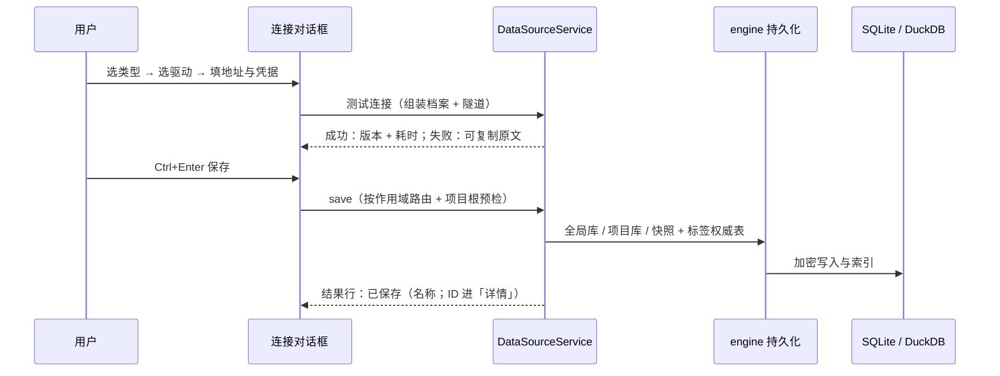
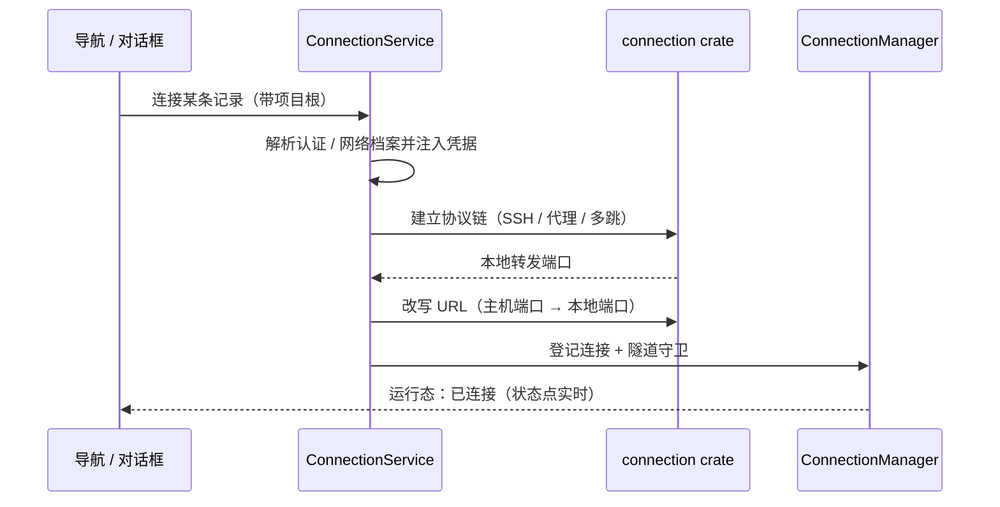
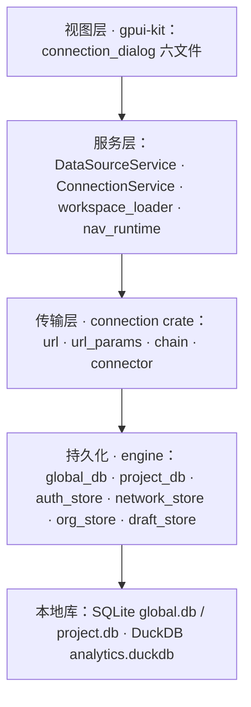

# RdataStation · 数据源连接 —— 一页看懂

> 左侧选类型、右侧选驱动、填完点保存——连接落进正确的作用域，凭据加密、草稿不丢、**测通即真通**。
> **两层目录 · 三态作用域 · 五 Tab · 六个驱动实现 · 零 UI 造数据。**
>
> 本页是**可贴版**（纯文本 + 流程图，适合贴进 PR / wiki）；视觉版见 [`connection-showcase.html`](connection-showcase.html)
> （自包含、明暗双主题、离线可开，首屏可在四种数据库类型间切换，看表单与 Tab 如何联动）。
> 两版的章节一一对应；本页把「六个驱动实现」排在第 5 节，视觉版把它做进首屏窗口示意图。

---

## 一句话

**选类型 → 选驱动 → 填连接 → `Ctrl+T` 试通 → `Ctrl+Enter` 保存。**

它不是一个"填 URL 的弹窗"：类型目录、驱动实现、认证与网络档案、TLS、环境策略、多连接暂存、作用域路由、凭据加密，是一条完整的闭环。
**这条连接发到哪个库、连不上差哪一步、密码存在哪里——界面上都写着。**

### 它替你做到的事

| 你关心的 | 它给什么 |
| --- | --- |
| 这算哪个库、该用哪个驱动 | **两层目录**：数据库类型（目录 10 类、启用 8 类）× 驱动实现（内置 6 个：MySQL / PostgreSQL 各有 `sqlx` 与 `Official` 两条路径，SQLite `rusqlite`，DuckDB `duckdb-rs`），UI 只显示实现短名 |
| 会不会"测通了却连不上" | **同源**：测试连接与真实连接共用唯一组装点——认证档案凭据、协议链隧道（SSH / 代理 / 多跳）、驱动属性走同一条路 |
| 存到哪去了 | **作用域三态**：仅全局 / 仅项目 / 全局+项目快照；ID 前缀 `G_` / `P_` / `GP_` 路由；读路径不建目录、不建表 |
| 密码写在哪 | AES 加密入库；列表接口真脱敏；**草稿表没有密码列**；DuckDB 加速的凭据进应用私有目录的 persistent secret |
| 配一半被打断了 | **多连接暂存**：连续配置多条，切条目自动写回，关窗不丢，跨会话恢复（固定高度 + 内部滚动） |
| 界面上那些数据可信吗 | **零 UI 造数据**：类型树、驱动目录、能力矩阵、环境策略全部读库；每个 UI 数据项都有来源审计表 |
| 弹窗会不会来回跳 | **布局恒定**：两列同行高 32.5rem；切 Tab、加草稿、目录变化都不改对话框高度（有窗口测试守着） |

> 数字口径以模块文档为准；工程数字（测试规模、真机清单）见第 10 节。

---

## 1. 为什么它不再是一个「填 URL 的弹窗」

V1 留下四处"看着有、实际是假"的底座，这一版逐条换成了真东西：

| 旧样子 | 现在 |
| --- | --- |
| 一个 URL 输入框打天下：类型靠猜、驱动不存在 | **两层目录**：左侧类型树（分类 + 图标 + 可用性），右侧驱动实现下拉（短名去噪）；无可用驱动的类型**置灰 + 「暂无驱动」**，点它不切换并说明原因 |
| 保存到哪全凭当前上下文，项目与全局互相污染 | **作用域三态**显式选择 + ID 前缀路由；写路径先做**项目根预检**（不合法直接失败，不落半成品），读路径**绝不建目录 / 建表** |
| 测试连接只看表单字段——引用了认证档案也照样"成功" | **同源组装**：`build_probe_config` 与 `connect` 共用；档案缺失 / 读取失败 / 注入失败都产生**可见说明**，不静默回退"直连无凭据" |
| 密码明文入库、草稿里带密码、诊断消息带 ID | 凭据 AES 加密（全局 / 项目 / 网络档案三处一致）+ 清单脱敏 + **草稿无密码列** + 消息只给名称不给 ID |

---

## 2. 三个高光

如果只记三件事：

**① 驱动是"实现"，不是"类型"。**
`mysql` 与 `mysql_native` 是同一类数据库的两条实现路径；`postgres` 与 `postgres_native` 同理。类型与驱动分开存、分开选，
落库时都写**驱动 id**（与引擎注册表对齐），所以"换实现"不会换掉连接的语义。

**② 一条连接，三种落点，语义写死在 ID 里。**
`G_` 全局 / `P_` 项目 / `GP_` 项目快照。快照是**独立副本**，要跟随全局定义时用显式入口「从全局定义同步」（只在编辑 `GP_` 时出现）——
不存在"什么时候同步"的运气成分。

**③ 每一个"做不到"都带着原因。**
无驱动 → 行尾「暂无驱动」；引用的档案被删 → 测试连接与真实连接**双双报错**并说明；被引用的档案 → 删除被拦下并列出引用数与项目名；
项目路径不是项目根 → 直接拒绝而不是建出一个假项目。**"按了没反应"在这套界面里是不允许的。**

---

## 3. 四个剧本 · 它替你做什么

每一步都用现有按钮，能照着做。

### 剧本 A · 第一次接一台库 → 30 秒走完四步

| 步 | 动作 | 怎么做 |
| --- | --- | --- |
| 1 | 选类型 | 左侧类型树点「MySQL」（没有可用驱动的类型是灰的，点不动） |
| 2 | 选驱动 | 右侧驱动下拉自动切到该类型的实现，显示短名 `sqlx`；需要官方实现就换成 `Official` |
| 3 | 填连接 | 常规 Tab：地址（网络型为 `URI`，文件型为「地址」+ 打开/新建文件）、认证方法、用户名 / 密码；SSL 卡片按驱动声明出现 |
| 4 | 试通 + 存 | `Ctrl+T` 看版本与耗时（结果行分级着色）→ `Ctrl+Enter` 保存；`保存并关闭` 可一步收尾 |

### 剧本 B · 一次配十条 → 不打断、不丢草稿

| 步 | 动作 | 怎么做 |
| --- | --- | --- |
| 1 | 接着加 | 左侧「暂存列表 → ＋ 添加」：当前表单自动写回上一条，表单变空开始下一条 |
| 2 | 来回改 | 点任意条目切换（切换前自动写回）；`↑` / `↓` 也能切换；条目左侧是**缩小的类型徽标**，一眼看出是哪类库 |
| 3 | 中途关了 | 直接 `Esc` / 点遮罩：草稿写回 `connection_drafts`（**无密码列**），下次打开对话框自动恢复 |
| 4 | 存完接着来 | 保存成功**不关窗**，草稿转正式并自动补一条空草稿——连续录入不用反复开关 |

### 剧本 C · 这条连接只属于当前项目 → 快照与同步

| 步 | 动作 | 怎么做 |
| --- | --- | --- |
| 1 | 选作用域 | Header 作用域分段切到「仅项目」或「全局+项目」；仅全局时项目栏置灰（保留占位，不跳布局） |
| 2 | 选项目 | 项目栏下拉：项目名 + 路径双列，末项固定「＋ 新增项目」（有脏草稿时先确认，确认后直接开新建项目窗口） |
| 3 | 需要时同步 | 编辑 `GP_` 快照时点 footer 的「从全局定义同步」：配置 + 凭据密文一并刷新，保留 ID / 创建时间 / 分组 |

### 剧本 D · 连不上 → 三步定位到具体原因

| 步 | 动作 | 怎么做 |
| --- | --- | --- |
| 1 | 先试通 | `Ctrl+T`：失败时结果行是**红色**并可直接「复制」原文；「测试中…」是弱灰的进行中态 |
| 2 | 看引用 | 如果表单显示"已引用认证 / 网络档案"：档案被删或类型无法解析 → 测试与真实连接都会报同一句原因（不静默直连） |
| 3 | 看隧道 | 多跳 / SSH 场景：探测结束即释放隧道；真实连接的失败原因不会与测试结论相反（同源组装） |

---

## 4. 一次保存的全流程

运行时连接（从导航或对话框点「连接」）走另一条：

> 隧道守卫挂在连接管理器上：断开或失败时精确释放本地端口，不残留后台进程（集成测试断言残留隧道数为 0）。

---

## 5. 两层目录 · 类型 × 驱动

类型目录来自 `data_source_types`（按 `enabled` 过滤），驱动来自 `drivers`。**同一种库可以有多个实现**：

| 数据库类型 | 分类 | 内置驱动实现 | 状态 |
| --- | --- | --- | --- |
| MySQL 🐬 | 关系型 | `mysql`（SQLx）· `mysql_native`（Official） | 可选 |
| PostgreSQL 🐘 | 关系型 | `postgres`（SQLx）· `postgres_native`（Official） | 可选 |
| SQLite 🪶 | 文件型 | `sqlite`（rusqlite） | 可选 |
| DuckDB 🦆 | 分析型 | `duckdb`（duckdb-rs） | 可选 |
| MariaDB / Oracle / SQL Server / ClickHouse | 关系型 · 分析型 | — | 置灰「暂无驱动」 |
| MongoDB / Redis | NoSQL | — | 目录未启用，不出现在树上 |

**表单随驱动变形**：文件型隐藏「网络」Tab，只留「连接设置（地址 + 打开/新建文件）+ 组织」；网络型给出 URI / 主机 / 端口 / 数据库、认证与 TLS 卡片。
字段集合来自驱动的 `config_schema` 声明——新驱动只靠一行库数据就能改变表单形状。

---

## 6. 五 Tab · 一个对话框

| Tab | 看什么 | 数据来源 |
| --- | --- | --- |
| 常规 | 连接设置（随驱动变形）+ 数据库认证 + 连接安全（TLS）+ 组织（标签 / 分组） | 驱动声明 + 库表 |
| 网络 | 引用网络档案（SSH / 代理 / SOCKS / 多跳链），文件型自动隐藏 | `network_configs` |
| 能力 | 驱动声明的能力矩阵（只读） | `drivers.capabilities` |
| 驱动属性 | 驱动自定义键值（可增删） | `drivers.driver_properties` |
| 高级 | 环境 + 安全策略覆盖 + DuckDB 联邦加速 | `environments` / `environment_policies` |

**布局是定死的**：左侧栏（暂存列表固定 7.5rem + 类型树占满剩余）与右侧 Tab 内容区**同行高 32.5rem**，超出各自内部滚动；
切 Tab、加草稿、目录变化都不会改变对话框高度。

**快捷键**：`Ctrl+T` 测试连接 · `Ctrl+Enter` 保存 · `↑` / `↓` 切换暂存条目 · `Esc` 关闭（先写回草稿）。

---

## 7. 安全与凭据

| 面 | 做法 |
| --- | --- |
| 落库 | 连接与档案的凭据一律加密（AES）；存量明文在启动时**一次性迁移**（幂等、失败不阻断） |
| 读出 | 列表接口返回**脱敏**值；只有"编辑回填 / 连接注入"这两个明确路径才解密 |
| 草稿 | `connection_drafts` **没有密码列**——草稿只承载非敏感字段 |
| DuckDB 加速 | 凭据注册为 **persistent secret**，落到应用私有目录（`{system}/secrets`），不写用户主目录、不落明文 |
| 引用完整性 | 被连接引用的认证 / 网络档案**不可删除**；拦截消息给出引用数与项目名（含未打开项目的名册扫描） |
| 消息 | 结果行里只有名称与可操作信息，**不出现连接 ID**；诊断原文可一键复制 |

---

## 8. 零造数据 · 契约测试

- **来源审计**：每个 UI 数据项都能回答"来自哪张表 / 哪个服务方法"；只能来自字典的（如能力键 → 中文标签）不得携带取值。
- **写路径守卫**：项目根预检；同名连接不静默覆盖；保存失败不留半成品（全局已写、项目失败会明确报错）。
- **契约测试**：尺寸（禁裸 `px(...)`）与颜色（禁裸 `rgb(...)` / `hsla(...)`）扫描本模块全部文件；
  固定高度必须 `h + min_h + max_h` 三向显式约束（只给 `h()` 会被内容撑高，实测回归：暂存区 120px → 412px，已修复并加测试）。
- **标签单一权威**：读取只认 `connection_tags`；存量数据的回填是**两处幂等迁移**（启动时；以及打开项目、项目迁移建好表之后），
  所以升级后第一次打开项目也能立刻看到旧标签。

---

## 9. 架构 · 依赖只向下

| 层 | 关键落点 |
| --- | --- |
| 视图 | `connection_dialog/{render, state, staging, managers, helpers, project_picker}.rs` |
| 服务 | `services/{data_source_service, connection_service, workspace_loader, nav_runtime}.rs` |
| 传输 | `connection/src/{config, chain, connector, known_hosts, url, url_params}.rs` |
| 持久化 | `engine/src/persistence/*`（含 `metadata_identity` 缓存指纹规则） |
| 尺寸常量 | `workbench_shell/src/ui.rs`（`DIALOG_*` 一组） |

**没有 HTTP / IPC 层**——"前后端联通"在本模块即"UI 只经服务层读写本地库"。

---

## 10. 质量与证据

| 维度 | 数字 / 手段 |
| --- | --- |
| 自动化测试（逐包口径） | 连接 crate **48 项**（单元 44 + 集成 `tunnel_roundtrip` 4）；工作台连接套件 **15 个目标 / 75 项**（`data_source_lifecycle` 28 · `connection_project_picker`/`connection_type_driver` 各 7 · `connection_staging` 6 · `real_connections` 5 · `connection_dialog_ui`/`dialog_host_layer` 各 4 · …）；引擎 lib **443 项**（含标签回填 / 网络档案加密 / 启动迁移接线等本模块用例）。全仓对照：84 目标 / 1963 通过——数字口径与逐目标明细见 [`../module-status.md`](../module-status.md) §2 |
| 窗口级测试 | 打开/关闭、五 Tab 渲染、作用域三态、结果行分级、首次引导三态、**暂存区与两列高度恒定**、编辑回填逐项断言 |
| 真机验收 | 4 条连接（MySQL · PostgreSQL · SQLite · DuckDB）× 测试连接 + 真实连接双链路；最近一次实测 MySQL / PG / SQLite 全部通过，DuckDB 那条因目标库文件被 DBeaver 占用而失败（环境原因，非代码缺陷，见台账 §6.2） |
| 集成测试 | 隧道数据往返（SOCKS5 / HTTP CONNECT / 两跳链）、连续保存、草稿跨会话、项目侧空密码保留、跨项目引用拦截 |
| 契约测试 | 尺寸与颜色扫描本模块全部文件 |
| 文档体系 | 架构与 **95 条设计决策** / 原型设计 / 使用指南与 USIT 清单 / 开发计划 / 可交互原型与宣传页 |

---

## 11. 边界 · 这些事它不做

| 不做 | 为什么 / 什么时候做 |
| --- | --- |
| 数据源导航树、分组视图、标签视图 | 属另一模块（M4）；本模块只提供数据与契约 |
| 模板导入导出（UI 入口） | 能力与测试已就绪，UI 入口按计划暂缓（避免当前阶段界面变动） |
| 类型树折叠 | 实测只有 3 分类 8 项，侧栏已固定高度 + 内部滚动；重评触发：类型 > 15 项或分类 > 6 |
| 分组的新建 / 管理 | 在导航侧；本模块只勾选所属分组 |
| 元数据缓存的复用（身份指纹） | 规则与纯函数已冻结，接线与导航接缓存同轮落地 |
| 驱动安装（插件） | 平台能力；在此之前其余类型置灰并写「暂无驱动」 |
| 连接主键改用 ULID | 列入 beta2（当前前缀方案已能表达作用域，改名不换 ID 的语义已成文） |

---

## 12. 文档地图

| 想了解 | 读什么 |
| --- | --- |
| 代码在哪、改前必守什么 | [`README.md`](./README.md)（模块入口） |
| 长什么样（视觉权威） | [`connection-prototype-design.md`](./connection-prototype-design.md)、[`connection-dialog-prototype.html`](./connection-dialog-prototype.html) |
| 为什么这样设计、怎么运转 | [`connection-dialog-architecture.md`](./connection-dialog-architecture.md)（概念模型 / 数据流 / 95 条决策 / 降级矩阵 / 待办清单 / 数据来源审计） |
| 怎么用、怎么验 | [`connection-user-guide.md`](./connection-user-guide.md)（含 USIT 验收清单） |
| 做到哪了 | [`connection-dev-plan.md`](./connection-dev-plan.md) |
| 视觉版本页 | [`connection-showcase.html`](connection-showcase.html) |
