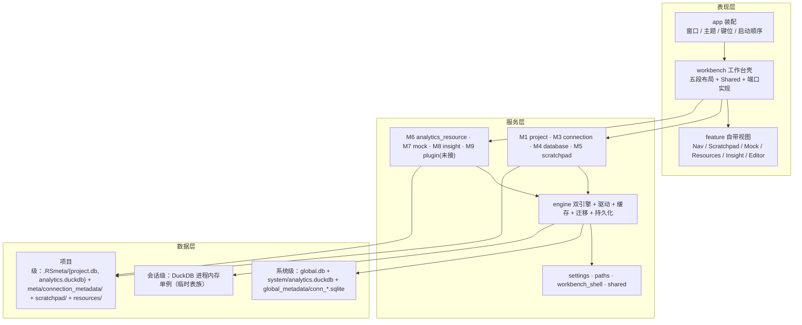

# RdataStation v2 核心设计（现状版）

> **本文件的定位**：与 `docs/architecture/<模块>/*-architecture.md`（设计意图）并列的**现状版**。
> 每一节都区分三件事：**［档］**设计文档这么写 / **［验］**代码实测如此 / **［偏］**两者有偏差。
> **权威冲突时**：模块 `README.md` 与 `<模块>-dev-plan.md` §0 最新，`*-architecture.md` 的头部状态行与「实现位置」列最易过期。
>
> 基线：2026-09-17。本会话已修项见文末《附录 A》。

---

## 0. 如果只记五件事

1. **单体桌面应用 + 16 个业务 crate**。三层架构：GPUI-kit 表现层 / feature crates 服务层 / 双引擎数据层；依赖只向下、无环。
2. **数据层是「双层 × 双引擎」**：系统级共享 + 项目级物理隔离；SQLite 记事务元数据、DuckDB 做分析；**两套迁移器、两本版本账本，不可混用**。
3. **视图层的核心模式是「宿主端口」**：feature crate 定义 `trait XxxHost` + 自带视图，`workbench` 实现端口只做转接；`workbench_shell` 只放两侧共用的纯数据。
4. **元数据访问有唯一闸门** `database::MetadataService`，下接驱动 `MetadataBrowser`；导航侧再套 `NavCache`（cache-aside）。缓存是**三层**：L1 内存 / L2 每连接 SQLite / L3 实时内省（**L3 不是缓存**）。
5. **接通度极不平均**：M1/M3/M4/M5/M6/M7 与编辑器执行链是活的；**M9 plugin 整包未接通**；engine 缓存层约 150 个公开项零调用；L1 只有失效没有填充。

---

## 1. 系统定位与架构主干

**定位［档］**：本地优先 + 查询后分析的数据库工作台。差异化 = 双层数据 + 双后台引擎 + 查询结果一键进 DuckDB 二次分析。



### 1.1 三层架构［档］［偏］
- **表现层**：GPUI-kit（`gpui-component` / `gpui-base`）；视图**随 feature crate**，不设集中 `views/`。
- **服务层**：feature crates（M1~M9）；`workbench` 退化为壳层组合。
- **数据层**：见 §3。
- **［偏］命名**：`overview.md:29,46` 写系统级为 `global.sqlite + shared.duckdb`，实际是 `global.db + system/analytics.duckdb`（`engine/src/migration/global_init.rs:20-24`）；`shared.duckdb` 全仓零出现。

### 1.2 双引擎分工［档］
| 负载 | 引擎 | 示例 |
|---|---|---|
| 事务元数据 | SQLite（rusqlite） | 连接、历史、草稿、资源目录、洞察缓存、日志 |
| 分析计算 | DuckDB（duckdb-rs） | 二次分析、联邦查询、画像、mock、快照 |

SQLite 保存 DuckDB 表/视图的注册信息（名称/来源/版本/血缘）；**写回源库只走原生通道**。
**引擎初始化三个事实［验］**：DuckDB 内核走**动态链接**仓库内预编译库；DuckDB 内存实例是**进程级单例 + `Mutex` 全局串行**；临时表按来源前缀分族（结果集 `tmp_q_*`、洞察 `tmp_i_*`、mock `temp_mock_*`），由 `duckdb::temp_table` 统一命名与回收。

---

## 2. crate 图与依赖规则

| crate | 职责 | 依赖（内部） | 备注 |
|---|---|---|---|
| `app` | App Shell：启动装配、键位、主题、全局库初始化 | 几乎全部 | 339 行；`lib.rs` 是空 lib target |
| `workbench` | 五段布局、`Shared`、命令面板、**所有宿主端口实现** | engine/connection/database/project/insight/mock/scratchpad/analytics_resource/editor | 20.8k 行，最大 |
| `workbench_shell` | 纯数据 + 尺寸常量 + 产品 token | gpui-kit/serde | 608 行，零反向依赖 ✅ |
| `project` (M1) | 项目生命周期、`.RSmeta`、实例锁、名册 | engine/shared/paths | 自带视图 + `ProjectUiHost` |
| `connection` (M3) | **传输层**：协议链（SSH/SSL/代理）、URL、DuckDB Secret | shared | 只依赖 shared ✅ |
| `database` (M4) | 导航域模型 + `NavigatorService` + `MetadataService` + `NavCache` | engine/shared/workbench_shell | 元数据唯一闸门 |
| `engine` (M2) | 双引擎、驱动层、连接管理、多级缓存、迁移、持久化、SQL 服务、日志 | shared/paths | 49.9k 行，最大 |
| `scratchpad` (M5) | 草稿箱：文件语义 + 回收站 + 监控 | shared/gpui-kit/workbench_shell | 自带视图 + `ScratchpadHost` |
| `analytics_resource` (M6) | 资产归档/取回/版本（sha256 指纹） | engine/shared | 自带视图 + `ResourcesHost` |
| `mock` (M7) | 元数据驱动造数据（只进分析引擎） | engine/shared | 自带视图 + `MockHost` |
| `insight` (M8) | 列/表/库画像 + TOML 规则引擎 | engine/shared | **DuckDB 为中心** |
| `plugin` (M9) | WASM / Sidecar 宿主 | engine/shared | ❌ **无依赖方，未接通** |
| `editor` | SQL 编辑器内核 + 执行编排 + 结果/历史 | engine/shared（**无 database**） | 端口注入式装配 |
| `settings` | 应用级偏好登记/持久化/设置页 | gpui-kit/workbench_shell/paths | 登记表 + 原子写 |
| `paths` | 运行时路径唯一解析点 | dirs | 821 行，最底层 |
| `shared` | 错误/模型/加密/拖放 | paths/gpui-kit | 仅 4 个模块有真实使用方 |

**规则［档］**：Feature ↛ `app`；Feature 之间不依赖对方 view（走 command/event/端口）；只有 ≥2 使用方才进 `shared`；运行时路径只能走 `paths::*`；依赖无环且指向更小更稳定的 crate。

**实测［验］**：无反向依赖、无环；`workbench_shell` 零反向依赖。
**实测违规**：`NavSource::from_conn_id` 手写前缀判定（权威在 `engine::persistence::id_prefix`）——共 4 处第二实现。

---

## 3. 数据层：落盘真相表

| 落点 | 内容 | 唯一定义处 | 现状 |
|---|---|---|---|
| `<RDS_HOME>/config/settings.json` | 应用级偏好（5 节 10 项） | `settings/src/lib.rs` | 原子写 ✅ |
| `<RDS_HOME>/data/system/global.db` | `project_info`、`global_connections`、`data_source_types`、`drivers`、`auth_configs`、`network_configs`、`environments(+policies)`、`connection_tags`、`connection_drafts`、`app_logs`、`plugin_store` | `migrations/global/*` | ✅ |
| `<RDS_HOME>/data/system/analytics.duckdb` | 系统级分析库 | `migration/global_init.rs:24` | ✅（DuckDB 原生格式） |
| `<RDS_HOME>/data/system/global_metadata/conn_{id}.sqlite` | 全局连接的 **L2 元数据缓存** | `persistence/metadata_cache.rs:82-115` | ✅ 4 类对象 |
| `{项目}/.RSmeta/project.db` | `project`、`connections`、`connection_tags/groups`、`queries`、`project_versions`、`analytics_resources(+versions/folders/tags)`、mock 生成记录 | `migrations/project_meta/*` | ⚠️ M1 用 rusqlite 直开（6 处）与 engine 池并存 |
| `{项目}/.RSmeta/analytics.duckdb` | **项目分析库**（mock 落库、结果二次分析） | `persistence/project_db.rs:380` | ✅（本会话修：曾落成 SQLite 格式） |
| `{项目}/meta/connection_metadata/conn_{id}.sqlite` | 项目连接的 L2 缓存 | 同 L2 | ⚠️ `open` 内含 `create_dir_all`（读路径建目录） |
| `{项目}/.RSmeta/project_metadata/` | M1 自建「每连接一个元数据库」 | `project/src/store.rs:35` | ❌ 生产零调用（与 L2 两套并存） |
| `{项目}/.RSmeta/scratchpad/config.json` | 草稿箱内部态（引用 + file_meta） | `scratchpad/src/store.rs:29` | ⚠️ 裸 `fs::write`（非原子） |
| `{项目}/.RSmeta/trash/<id>/{payload,manifest.json}` | 项目级回收站（`origin` 区分来源） | `scratchpad/src/trash.rs` | ✅ M5/M6 共用 |
| `{项目}/.RSmeta/resources/versions/<id>/<v>/` | 资产历史副本 | `analytics_resource/src/payload.rs:30` | ✅ |
| `{项目}/scratchpad/`、`resources/`、`mock/` | 用户可见内容目录 | 各模块 `MODULE_DIR_NAME` | ✅ |
| `<RDS_HOME>/logs/app.YYYY-MM-DD` | 日志（7 天 / 256MiB / 单文件 16MiB 停写） | `engine/src/logging/config.rs` | ✅ |
| DuckDB 进程内存单例 | 会话级临时表族 | `duckdb::{manager,temp_table,analysis}` | ✅ |

**全局纪律［档］**：路径只走 `paths::*`；启动**第一条语句**重定向进程 `TEMP/TMP/TMPDIR`（`app/src/main.rs:34`）；测试数据根由 `paths` 的 `test-support` 自动隔离（有静态契约测试）。

### 3.1 对象模型：四族 + 一条引用［验］

数据层封装的不是「一套 Database / Schema / Table 领域对象」，而是四族 + 一条引用（2026-09-19 实查）：

| 族 | 类型 | 定义处 |
| --- | --- | --- |
| **值 / 结果** | `QueryResult` · `Row` · `Value` · `ArrowBatch` · `Stream` | `shared/src/{models,stream,arrow}.rs` |
| **连接** | `ConnectionConfig` / `ConnectionInfo`（运行时）· `ConnectionInfo` / `ConnectionRecord`（持久化）· `ConnectionDraftRow` · `AuthConfig` / `Environment` · `Ssl/Ssh/ProxyConfig`（connection crate） | 各自 store |
| **结构** | 驱动侧 `NodeInfo` / `ColumnDetail` / `IndexDetail` / `ConstraintDetail` · 落盘侧 `IndexEntry` / `IndexSearchHit` · L1 `MetadataCacheKey/Value` · 视图侧 `NavNode` / `NavPath` / `PropertyRef` | `driver/traits.rs`、`persistence/metadata_cache.rs`、`cache/`、`database/model.rs` |
| **结论** | `TableProfile` / `ColumnStats` / `QualityScore` … | `insight/src/model/types.rs` |
| **引用**（跨模块寻址） | `ObjectRef` + `ObjectKind`（连接 + 类别 + catalog / schema / 父对象 / 名字）· `key()`（与导航树节点 key 同构）· `from_index_hit()`（索引命中 → 引用） | `engine/src/refs.rs`，`pub use` 到 engine 根 |

**引用为什么放 engine**：它是数据层身份，不能住在导航视图里——搜索 / 命令这类 Feature 不该为了一个寻址类型反向依赖 `database`。
**本次收敛**（2026-09-19）：删掉 `database::model::{TableRef, SchemaRef}` 两个同形类型 → `ObjectRef`；
`ObjectKind → PropertyKind` 的映射只留 `database::model::property_ref_of` 一处；Quick Open 的元数据行键改用 `ObjectRef::key()`
（它之前自拼「连接 + 种类 + 父对象 + 名字」，**不含 catalog / schema**，`sales.orders` 与 `archive.orders` 会撞键）。

**驱动接口面已收敛**（2026-09-19 第二批）：删掉 v1 的 `SchemaObject`——它多带的 `children`（懒加载整棵树，无人读取）、
`table_name` / `event`（触发器专有，无人填充，而 postgres 真填的那份又被上层丢掉）三个字段都是死字段，
且 5 个原生驱动的 `list_tables` 都在做「`NodeInfo` 降级成 `SchemaObject`」的空转。现在 `Database::list_*` 与 `MetadataBrowser::get_*`
返回**同一套** `NodeInfo`：实现了浏览器的驱动直接转发，`MetadataService` 的三处手工映射随之消失；L1 的
`MetadataCacheValue::SchemaObjects` 改名 `Nodes`，并删掉零消费者的 `get_columns` / `set_columns`（它们与 `get_columns_detail`
共用同一个 key，是**同一个键两种值类型**的二义性）。**顺带接通**：触发器所属表从驱动内省（`event_object_table`）
经 `NodeInfo::parent_name` 走到 `PropertyRef.parent` → 属性面板「关联表」。

**仍存的差异（关注点不同，不是重复类型）**：表在本仓仍有四份——L2 `tables` 行（带 id / `last_sync` 存储元数据）、
`IndexEntry`（索引行）、`NavNode`（UI 状态：展开态 / 错误位）、`Insight TableColumnMeta`（来源是 DuckDB `DESCRIBE`，
不是元数据内省，带 `ordinal_position`）；
`shared/src/types.rs` 整模块（27 个 v1 DTO：`DatabaseMeta` / `SchemaMeta` / `TableMeta` / `ColumnMeta` …）在 v2 **零消费**；
无 `TableId` / `SchemaId` 这类稳定 ID（跨模块引用靠名字，L2 自增 id 与导航拼串 key 不互通）。

---

## 4. 缓存设计

> ⚠️ **本仓库有三套不同的 L1/L2/L3 词表**，混用是审计误判的高发点。先分清，再看现状。

### 4.1 词表 A：导航元数据缓存分级（**唯一权威口径**：`database/README.md:32`）

| 层 | 承载 | 设计时延 | 代码 | 现状［验］ |
|---|---|---|---|---|
| **L1** | 进程内内存元数据缓存 | <0.1ms | `engine::cache::{MetadataCache, CacheManager}` | ✅ **已接线**（2026-09-17）：读命中即返回、L2 命中与实时内省均回填、`fresh` 跳过并清空；**大 schema（>500 对象）有意不进 L1**（2026-09-18） |
| **L2** | 每连接 SQLite（`conn_{id}.sqlite`） | <5ms | `engine::persistence::metadata_cache` + `database::cache::NavCache` | ✅ 活（schema/表/视图/列 4 类）；其余 ~72 方法零调用 |
| **L3** | **实时内省（不是缓存）** | 10~500ms | `database::MetadataService` → 驱动 `MetadataBrowser` | ✅ 活；L2 未命中时的事实源 |

**读取时序［档］**：展开节点 → L1 → L2 → L3 → 成功后异步回写 L2 + L1 → 渲染。

**设计意图［档］**：这套分级不是为了“快一点”，而是为了**对标 DBeaver / DataGrip 的大库多 schema 浏览**——
“大型数据库（如 Oracle）可能有 10 万+ 张表，元数据记录可达数百万条”（`persistence/metadata_cache.rs:10`）、
“内省级别对标 DataGrip 2026.1”（`driver/introspection.rs:7`）、
“大 schema（10 万+ 表）渲染卡顿 → `get_tables_chunk` 分页 + 虚拟列表”（`database-nav-dev-plan.md:307`）。

**意图 → 机制 → 现状［验］**：

| 意图所需 | 设计里的机制 | 现状 |
|---|---|---|
| 命中极快（毫秒内） | **L1 内存**（<0.1ms） | ✅ **本日接线**（2026-09-17）：读命中即返回、L2 命中与实时内省均回填 L1、`fresh` 跳过并清空；4 个测试用「空连接管理器」反证命中 |
| 每次读的固定开销 | ——（设计未单列，但实测为瓶颈） | ✅ **本日接线**：`MetadataCachePool` 池化后，每缓存文件只做一次「开文件 + 5 条 PRAGMA + 迁移校验」（此前每次访问都付） |
| 10 万表分页懒加载 | `metadata_index` + `get_objects_chunk` + 虚拟列表 | ✅ **已全线接通**（2026-09-18）：`rebuild_schema_index` 冷启动后重建；> `CHUNK_THRESHOLD`（500）的 schema 首屏只从索引取一页（表/视图各自分块）+「加载更多」按 `offset` 追加；计数来自索引（展开 schema 不再为标题里的数字全量物化）；≤ 500 仍走 L1 全量（零回归）。虚拟列表仍未做（靠分页限制条数） |
| 内省深度自适应 | `IntrospectionLevel::from_object_count`（1000 / 3000 阈值） | ✅ 已接线（2026-09-17）：内省后自动定级并登记；“是否预取列”据此门禁 |
| 多 schema 并发预热 | `MetadataCachePool`（连接复用） | ✅ **本日接线**（同步形态；旧版的异步+信号量正是它零调用的原因） |
| schema 级统计 | `get_schema_object_counts` | ✅ **已接线**（2026-09-18）：`NavCache::object_counts` 供文件夹标题计数与分页阈值判断。注：索引只写 schema/table/view/column，故 `routine_count` 恒 0（例程仍走实时内省） |
| 同步状态与进度 | `update_sync_status` / `get_sync_status` | ❌ 零调用（进度今天走 `nav_jobs` 的原子量，不落表） |
| 元数据搜索 | FTS（`rebuild_fts_schema` / `search_fts`） | ✅ **内容档已接**（2026-09-19）：迁移 011 改存内容 + trigram；写入挂在 `rebuild_schema_index` 同批（schema 级幂等）；消费方 = Quick Open 的 `#` 档（≥ 3 字）。两个旧硬伤已修：旧写侧引用不存在的 `views` 表、旧表 contentless 读不到身份。**仍缺**：源码（定义文本）搜索 |
| 增量同步（只拉变化） | `incremental_sync` + 快照 + `sync_operations` | ❌ 零调用（有意不补，同上） |
| **预热 / 邻接预取** | C1 `warm_schemas` / C2 `prefetch_columns` | ✅ **已接线**（`nav_jobs.rs:234,252`、`nav_view.rs:4056`） |
| 首屏只取当前层 | cache-aside 懒加载 | ✅ 活（schema / 表 / 视图 / 列） |

**结论（2026-09-19 更新）**：意图里“让大库依然快”的几件关键事现已落地——**L1 回填、分块索引 + 导航侧分页消费、内省级别、连接池、计数、搜索两档（名称 + 内容）**；仍故意不补的是 **增量同步与身份指纹键**（尚无消费者），
因而今天能保证“小库秒开”且**大 schema 首屏可控（只取一页）**、**跨连接按名称 / 按注释找对象**；尚未兑现的是“搜索后一键定位到树上那一层”与“源码（定义文本）搜索”。

**L2 路径［验］**：全局 `{system}/global_metadata/conn_{id}.sqlite`；项目 `{project}/meta/connection_metadata/conn_{id}.sqlite`。

**失效规则［档］［偏］**
| 动作 | 设计 | 实现 |
|---|---|---|
| 手动刷新 | 清 L1；L2 **标 stale**，展开时增量重载（**不删 L2**） | `fresh=true` → `prune_schema` **删 L2 行**再重写（措辞与实现不同） |
| 断开连接 | 只关运行时连接，**L2 保留** | ✅ 一致 |
| 内省级别变更 | 标记 L2 过期 | ❌ `IntrospectionLevel` 注册表零调用 |

**缓存键（身份指纹）［档］**：未来由 `meta_{fp}.sqlite` 取代 `conn_{id}`，让指向同一物理库的多条连接共享 L2；指纹**只作缓存键不作主键**，不含连接 id/显示名/驱动实现 id/密码/连接参数。落点在 `engine::persistence::metadata_identity`（13 项单测）——**未接线**（该模块零调用）。

### 4.2 词表 B：engine `CacheManager` 的 `CacheLevel`（**未启用，另一套语义**）

`crates/engine/src/cache/cache_manager.rs:12-20`：`L1 = 进程内内存` / `L2 = 进程间共享内存` / `L3 = 磁盘`，按**存储介质与可见性**划分。
现状［验］：`l2_enabled=false`、`l3_enabled=false`（默认），`l2_capacity` / `l3_path` 无消费方，`CacheLevel` 枚举**零调用**；`CacheManager` 实际只持 `l1_metadata` + `query_cache`。**与词表 A 不是一回事。**

### 4.3 词表 C：insight 的分析深度（不是缓存）

`insight-architecture.md:15-17`：L1 描述统计（列画像）/ … / L3 关系与结构（多列规则 + Schema 洞察）。属**洞察层级**，与缓存无关。

### 4.4 查询缓存（独立一路）

`engine/src/cache/query_cache.rs`：进程内 `lru::LruCache`，键 = `hash(conn_id + sql)`。
- 现状［验］：`SqlExecuteOptions::use_cache` 默认 `false`，生产调用点全部显式/隐式关闭 → **从不触发**（唯一 `true` 在测试路径）。
- `clear_by_connection` 曾不按连接过滤（`removed` 恒 0），**本会话已修**。
- `CacheVersionManager`（L2 版本链 V1→V8）：文档称"打开 L2 时校验版本并迁移"，代码**零调用**［验］。

---

## 5. 驱动与元数据访问

### 5.1 两层 trait［验］

```
Database（能力面）                      MetadataBrowser（对象树面）
  query / query_with_params               get_catalogs
  query_with_cancel / begin_transaction   has_schema_level      ← 能力位
  meta() / ping / pool_status             get_schemas / get_tables
  list_catalogs/schemas/tables/columns…   get_table_detail（含列）
  get_routine_source                      get_indexes / constraints
  联邦：register_external_database        get_sequences / triggers
  as_metadata_browser() ─── 转型 ───►
```

- 6 个实现：`native/{mysql, postgres, sqlite, duckdb, mysql_native, postgres_native}.rs`。
- `has_schema_level()`：MySQL / SQLite / DuckDB = `false`（Catalog 直接挂文件夹）；PostgreSQL = `true`。
- 统一结构：`NodeInfo` / `ColumnDetail` / `NodeDetail` / `IndexDetail` / `ConstraintDetail`（**一个对象一份表示**，2026-09-19 起）。
- `Database::list_*` 与 `MetadataBrowser::get_*` **返回同一套类型**：实现了浏览器的驱动直接转发（`list_tables` → `get_tables`），
  只实现 `list_*` 的桥接驱动（JDBC 那类）也不会被降级。`MetadataService` 的每个方法都是「browser 优先 → list_* 兜底」的**纯转发**；
  序列 / 触发器保留「浏览器层空则回退」，以解 trait 默认空实现的遮蔽（PostgreSQL 的序列 / 触发器即如此）。

### 5.2 唯一闸门与消费链［验］

```
NavView → nav_jobs（后台线程 + 独立 tokio 运行时）→ NavigatorService（cache-aside）
   ├─ 命中 → NavCache（L2 SQLite）
   └─ 未命中 → MetadataService → MetadataBrowser → 目标库 → 回写 L2（+L1，若接线）
```
消费者：导航树（主）、属性面板、mock 导入列结构（`workbench/services/mock_generator.rs`）。

---

## 6. 迁移与引擎初始化

| | SQLite 侧 | DuckDB 侧 |
|---|---|---|
| 入口 | `migration::MigrationManager::migrate(path, type)` | `migration::duckdb::{migrate_at_path, apply_migrations}` |
| 类型 | `Global` / `ProjectMeta` / `ConnectionMetadata` | `ProjectAnalysis`（系统分析库同用） |
| 账本 | SQLite 文件内的 `schema_version` | DuckDB 内的 `schema_version` |
| 目录 | `migrations/{global, project_meta, connection_metadata}/` | `migrations/project_analysis/` |
| 防线 | **`ProjectAnalysis` 被直接拒绝** | 建库产物断言头部偏移 8..12 == `DUCK` |

**已修的关键陷阱**：M1 建项目曾用 rusqlite 建 `analytics.duckdb` → 产出 **SQLite 格式**文件。危害不是"打不开"（DuckDB 内置 SQLite 存储后端会照常读写，`duckdb_databases().type = 'sqlite'`），而是**格式分裂 + 两侧共用一张迁移账本 + 第三方工具打不开**，且"`Connection::open` 成功"类断言会假通过。

---

## 7. 视图层设计（GPUI-kit）

### 7.1 结构［验］
- 单窗口 + 单体 `WorkbenchView`（1968 行）+ `Shared`（28 个 pub 字段，`ui_contract` 白名单锁住）。
- **五段布局**：标题栏 36px / 左右活动栏 48px / 左右 Dock（起步 240 / 280，随 `font_size` 缩放）/ 状态栏。
- **三模式边栏**（显示 / 隐藏 / 收起）用 Dock 0.6 的 `set_dock` / `toggle_dock` / `remove_dock`；**权威同步点在 render**（`Shared` → DockArea 单向）。

### 7.2 宿主端口模式（视图层核心设计）［验］

| 模块 | 端口 trait | 方法数 | 实现方 |
|---|---|---|---|
| M4 导航 | `database::nav_host::NavHost` | — | `workbench/components/nav_host.rs` |
| M5 草稿箱 | `scratchpad::host::ScratchpadHost` | 10（4 个带默认实现） | `workbench/components/scratchpad_host.rs` |
| M6 资产库 | `analytics_resource::resource_view::ResourcesHost` | 13 | `workbench/components/resource_host.rs` |
| M7 Mock | `mock::mock_view::MockHost` | 12 | `workbench/components/mock_host.rs` |
| M1 项目 | `project::ui::ProjectUiHost` | 6 字段 + 3 桥 | `workbench/components/project_host.rs` |
| 编辑器 | 非 trait：`attach_*` 注入 + `QueryRunner` 端口 | 6 | `workbench/services/editor_{exec,files,connections,session,channels}.rs` |

**共同纪律［档］**：端口只收「换个宿主还成立吗」的能力（项目根 / 只读 / 提示 / 重绘 / 交给中央编辑区）；自己的设施与重活**不进端口**；动作一律回宿主并带 `Window` / `App`；只读护栏放视图层；`render` 是纯读路径。

### 7.3 后台任务模式［验］
四个 `jobs` 同构：**进程级单工作线程 + 结果槽 + 定时泵**（`scratchpad::jobs` / `database::nav_jobs` / `workbench::resource_jobs` / `workbench::mock_jobs`）。
**缺口**：`resource_jobs` 入队 `let _ = tx.send(...)` 吞错 + 两个 `return` 出口 → `pending` 只增不减、面板永久「加载中」（`mock_jobs` 是正确写法）。

---

## 8. 逐模块契约速查

| 模块 | 一句话 | 入口 / 端口 | 状态［验］ |
|---|---|---|---|
| **M1 project** | 一实例一项目；名册在全局库、本体在 `.RSmeta`；OS 字节锁排他 | `project::service::*` + `ProjectUiHost` | 主线活；`project.json` 非原子写、render 期查库仍在 |
| **M2 engine** | 双引擎基础设施 + 统一数据访问层 | `SqlService` / `ConnectionManager` / `DuckDBManager` / `MetadataCacheManager` | 活的 11 个缓存方法 + 6 个 Manager 方法；~150 项零调用 |
| **M3 connection** | 传输层：协议链 + URL + DuckDB Secret | `chain::apply_network_method` / `TunnelRegistry` / `SecretManager` | 编排在 workbench；SSH 主机密钥默认放行、Secret 无门控不清理 |
| **M4 database** | 元数据导航 + 属性面板 | `MetadataService` / `NavigatorService` / `NavCache` | 最健康；`delete_schema` / `prune_schema` 已修 |
| **M5 scratchpad** | 文件语义草稿区 + 项目级回收站（按来源只看自己的） | `ScratchpadStore` / `jobs` / `ScratchpadHost` | 活；`config.json` 非原子写、删除/改名不查编辑器脏状态；回收站类型已上提到 `engine::persistence::trash`（P0.8） |
| **M6 analytics_resource** | 只读、有版本、带来源的正式存档 | `ArchiveService` / `PayloadStore` / `IndexRepair` / `ResourcesHost` | 闭环完整 + 104 单测；回收站（移入 / 还原 / 永久删除 / 清空 + 对话框）已落，共用 `engine::persistence::trash` |
| **M7 mock** | 输入列定义 → 输出可信测试数据（不读真实数据） | `MockEngine` / `MockHost` | 生成/预览/落库活；策略层在 workbench（与 `mock/history.rs` 口径相反） |
| **M8 insight** | DuckDB 为中心的画像 + TOML 规则引擎 | `InsightService` / `InsightView` | 面板路径按 D29 只用 DuckDB 临时表；源库侧 3 函数是登记在册欠账（已留痕） |
| **M9 plugin** | WASM / Sidecar 宿主 | 无 | ❌ 整包无调用方；两个 0 字节模块；`SidecarClient` 判据反了 |
| **editor** | 内核 + 三档能力（文本 ⊂ SQL ⊂ 分析） | `EditorShared` + `QueryRunner` | 执行/结果/历史/高亮活；补全未做；`execution` panic 后永久 busy |
| **settings** | 偏好登记 + 原子持久化 + 设置页 | `SettingsService` / `registry::REGISTRY` | 活（10 项）；`effect` 字段无人消费、跨进程写无锁 |

---

## 9. 横切机制

- **错误**：`shared::error::CoreError` 六域（Common / Connection / Database / Query / Storage / Transaction）+ 工厂函数。缺口：写路径 `let _ =` 吞错。
- **日志［档］**：一条 tracing 事件三出口（stderr / 按天文件 / `app_logs` 异步批量），三道闸 + 两出口脱敏（模式不跨行）；「日志装配必须在全局库之后」是硬约束。
- **异步/线程**：tokio 全域；导航侧有进程级桥接运行时（`nav_runtime::bridge_runtime`），但 workbench 另有 **10 处 `Runtime::new()`**。
- **连接**：`ConnectionManager`（连接池 + 隧道注册表 + 空闲回收）；文件型库同 URL 多 id 走**别名**（同一 `Arc<dyn Database>`，文件只开一次）。
- **DuckDB 单例**：内存闸 2GB、溢写口 `<RDS_HOME>/tmp`、`max_temp_directory_size` 10GB；临时表按来源前缀管理。
- **依赖治理［档］**：版本唯一入口在根 `[workspace.dependencies]`；四件精确锁定（gpui-kit 家族 / specta / sqlglot-rust / arrow 跟随 duckdb）；DuckDB 动态链接 `third_party/duckdb/1.5.5`，**crate 版本与库版本必须成对升级**。

---

## 10. 纪律与实测缺口

**已文档化的 skill（`.agents/skills/`）**：`rds-architecture`（依赖方向 / 归属判定 / 文档位置）、`gpui-kit-dev`、`rds-layout`、`rds-theme`、`rds-ui-spec`。

**尚未文档化的缺口**：

| 类 | 缺口 | 证据 |
|---|---|---|
| 落盘契约 | 无「格式/结构断言」纪律 | `analytics.duckdb` 格式陷阱骗过整套测试 |
| 错误纪律 | 写路径允许 `let _ =` | `delete_schema` / `save_view` / `resource_jobs` |
| 运行时纪律 | 未禁 `Runtime::new()` 与 render 期 I/O | workbench 10 处 |
| 单一来源 | `.RSmeta` / 前缀判定 / 尺寸常量有第二实现 | 6 / 4 / 9 处 |
| 死代码 | 无「零调用冻结」机制 | engine ~150 项、plugin 整包 |
| 文档新鲜度 | `*-architecture.md` 头部状态行最易过期 | 见 §12 |
| 门禁 | **无 CI**；无 fmt 门（244/401 文件待格式化） | 无 `.github/` |
| 本机脚本入库 | 本机诊断脚本（含内网地址与明文口令）曾被提交并**已推到公开仓库**；「未跟踪」不能靠文件头自己声明 | `crates/workbench/tests/zz_fixture_probe.rs`（commit `7814b9b6`）；已 `git rm --cached` + `.gitignore` 新增 `**/tests/zz_*.rs`，详见 `module-status.md` §6.1 |
| 测试基线分散 | 各模块文档里的数字是不同日期的快照，长期漂移（本轮实测：engine 382→443、database 38→42、workbench 106→110、mock 165→190…） | `module-status.md` §6.3；现已收拢为一份可复现台账 |

---

## 11. 设计健康度总表

| 能力 | 设计意图 | 状态 | 证据 |
|---|---|---|---|
| 驱动统一抽象 | 一站式接库 | ✅ 6 驱动全覆盖 | `native/*.rs` |
| 元数据统一闸门 | 唯一入口 | ✅ 但双通道并存 | `metadata_service.rs` |
| L2 元数据缓存 | 连接级落盘缓存 | ✅ 4 类对象 | `database/src/cache.rs:13` |
| L1 内存缓存 | 命中 <0.1ms | ✅ 已接线（读/回填/刷新清空） | `cache/metadata_cache.rs` + `navigator_service.rs` |
| L2 连接复用 | 每缓存文件一个池 | ✅ 已接线（建池时迁移 + 预热） | `persistence/metadata_cache_pool.rs` |
| 增量同步 / FTS / 分块索引 | 大库体验 | ⚠️ 分块索引**数据侧已通**（UI 待接）；FTS / 增量同步仍零调用（有意不补，等消费者） | `persistence/metadata_cache.rs` |
| 双引擎分工 | SQLite 元数据 / DuckDB 分析 | ✅（格式已统一） | — |
| 项目双层隔离 | 项目互不可见 | ✅ | `.RSmeta` + 锁 |
| 资产版本化 | 可复现 | ✅ 指纹 + 版本副本 + 索引修复 | `payload.rs` |
| 洞察规则引擎 | TOML 驱动 + 静态门 | ✅ 面板路径；源库路径是欠账 | `insight-architecture.md` D52 |
| Mock 生成 | 不读真实数据 | ✅ 生成不写库、ATTACH 跨库直写 | `mock-architecture.md` §6 |
| 插件宿主 | 四类扩展点 | ❌ 整包未接通 | 无依赖方 |
| 编辑器补全 | 走 `MetadataService` | ❌ 未实现 | 无 `database` 依赖 |
| 设置项消费 | 登记即被消费 | ⚠️ `effect` 字段无人读 | `registry.rs` |
| CI / 质量门 | — | ❌ 无 | 无 `.github/` |

---

## 12. 文档新鲜度规律与偏差清单

**规律**：各模块 `README.md` 与 `<模块>-dev-plan.md` §0 最新；`*-architecture.md` 的**头部状态行**与**「实现位置」列**最易过期。

| 文档位置 | 声称 | 实际 |
|---|---|---|
| `editor` 架构/README（3 处） | 执行入口是 `EditorService::execute(target)` | `EditorShared::submit` + `QueryRunner` 端口 |
| `editor` README §3 / 架构 §3.1 | `editor → database` 依赖、`completion.rs` 存在 | `Cargo.toml` 无该依赖；文件不存在（补全未做） |
| `editor` 架构 §3.6 | `GridDataSource` / `GridEditSink`、`view/widgets/grid/` | 零匹配；实际在 `view/results/` |
| `analytics-resource-architecture.md:4` 等 | `indexer.rs` / `detail_view.rs` / `service.rs` 未创建 | 均已落地（498 / 496 / 997 行） |
| `plugin-architecture.md` §2 | plugin 7488 行 | 实际 4630 行；两个文件 0 字节 |
| `layout/panels-modules.md` | 4 个路径（`panels/nav.rs`、`panels/scratchpad_panel.rs`、`services/scratchpad_jobs.rs`、`services/nav_jobs.rs`） | 均已不存在（3 个未标注去向） |
| `connection-dialog-architecture.md` §16 | L2 缓存"无调用方 ⛔ 未接" | 读路径已接（写侧 `ensure_metadata_cache` 确实零调用） |
| `settings-architecture.md` K1 / §8 | 构造期直读、分节含 `general`/`engine` | 已改走 service；实际分节无这两节、有 `logging` |
| `overview.md:29,46` | `global.sqlite + shared.duckdb` | `global.db + system/analytics.duckdb` |
| `project/src/lib.rs:4-14` | 布局 `meta/project.db`、`analytics/data.duckdb` | `.RSmeta/{project.db, analytics.duckdb}` |

---

## 附录 A：本会话已修（基线内）

| # | 缺陷 | 处理 |
|---|---|---|
| 1 | M1 建项目产出 SQLite 格式的 `analytics.duckdb` | 改走 DuckDB 迁移器；`MigrationManager` 拒绝 `ProjectAnalysis`；建库断言 `DUCK` 魔数 |
| 2 | `delete_schema` 引用不存在的 `views` 表 → 「刷新元数据」静默失效 | 改为只删 `tables`（视图即其中一行），级联交给 FK；补用户可见回归测试 |
| 3 | `save_view` 漏写 NOT NULL 的 `table_id` → 视图定义从未落库 | 补 `table_id`（`id = table_id` 维持 1:1 幂等） |
| 4 | `save_column` 把 `is_primary` 写进 `is_identity` | 第 7 参数改为真正有含义的 `is_identity` |
| 5 | `query_cache::clear_by_connection` 不按连接过滤 → 断连清不掉缓存 | 条目自带 `connection_id`；补定向清理测试 |
| 6 | L1 内存缓存恒空（只失效不填充） | 补齐读/回填/刷新清空 + 表视图分键（`Views` 键早已存在但无 getter） + 4 个测试 |
| 7 | 每次缓存访问都重开 SQLite（开文件 + PRAGMA + 迁移校验） | 重塑并接线 `MetadataCachePool`（同步形态、建池时迁移、RAII 归还）；`delete` 前先弃池（Windows 句柄） |
| 8 | `metadata_index` 恒空 → 分页 / 计数无数据源 | `rebuild_schema_index`（冷启动内省后重建，幂等先删后插）挂到 `NavCache::rebuild_index`，导航在表文件夹那趟调用 |
| 9 | `metadata_index` 不在外键级联链上 → 删 schema 留孤儿 | `delete_schema` 显式清 `metadata_index`（由新测试抓到） |
| 10 | `IntrospectionLevel` 注册表零调用 | 内省后按对象数自动定级；`prefetch_columns` 据级别门禁 + 3 个测试 |

> 缓存部分的逐项对照与 DBeaver / DataGrip 对比见
> `docs/architecture/database/metadata-cache-vs-dbeaver-datagrip.md`。

---

## 附录 B：本文件如何维护

1. **改动落盘契约时**（文件格式、表结构、迁移账本、JSON 布局）：更新 §3 / §6 对应行，并补一条断言。
2. **改动接通状态时**（某能力从"零调用"变"活"或反之）：更新 §11 健康度总表与 §8 模块速查。
3. **发现文档与代码不符时**：写进 §12 偏差清单，不要只改模块文档——两边都要留痕。
4. **词表冲突**（如 §4 的 L1/L2/L3）：先确认口径来源，再决定是统一命名还是显式区分。
