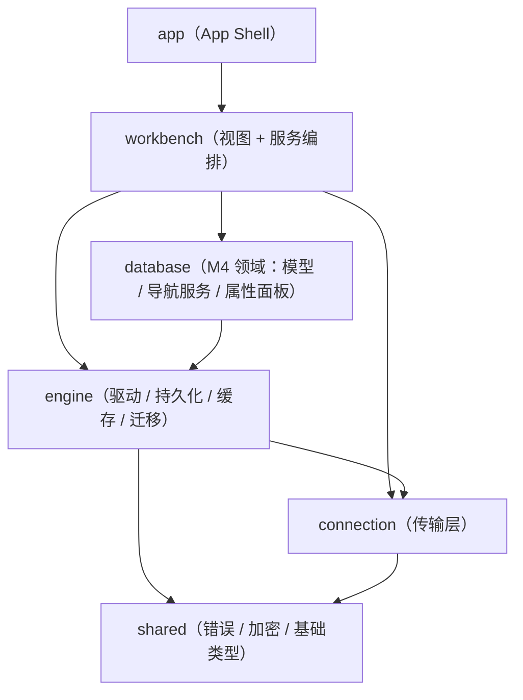
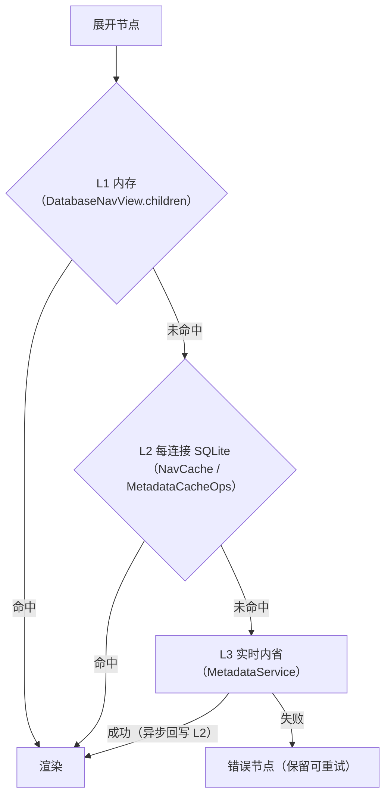

# 数据源管理 / 数据库导航模块 · 设计理念与架构（M4）

> 状态：方案 A（v5）+ v6/v7 降密与徽标语义 —— **V2–V10 已全部实现** · 2026-09-13
> 关联：`database-navigator-prototype-design.md`（视觉与交互规格）、`database-navigator-prototype.html`（交互稿）、`database-nav-dev-plan.md`（任务与逐轮记录）、`database-navigator-user-guide.md`（使用手册）、`../ui/ui-design-spec.md`（尺寸常量）、`../theme/theme-design.md`（配色）
> 读者：维护 / 扩展本模块的开发者；也用于排查「导航不刷新」「render 期卡顿」「同一连接在多个分组重复出现」这类跨层问题

---

## 1. 定位与边界

| 维度 | 结论 |
| --- | --- |
| 负责 | 数据源在左 Dock 的**组织与呈现**（分组 / 标签 / 归属域 / 状态）、对象树懒加载与浏览、连接 / 断开入口、元数据缓存编排、属性面板 |
| 不负责 | 连接本身的定义与 CRUD（属 M3 `connection`）、驱动实现与内省（属 `engine` / `database::MetadataService`）、分析资产（属 M6） |
| 核心载体 | 左 Dock `LeftPanel::Database` 面板（`SidebarPanel::render_database_nav`），未独立拆文件 |
| 关键约束 | 视图层**零裸色值**（`cx.theme()` + 产品语义 token）、**render 期零 I/O**、依赖方向不得成环、缓存**永不自动删除** |
| 面板职责一句话 | **定位 + 连接 + 浏览**；配置归对话框，详情归属性面板 |

---

## 2. 设计理念（v6/v7 冻结）

### 2.1 一句话心智模型

> **导航栏 = 定位 + 连接 + 浏览；配置归对话框，详情归属性面板。**
> **结构靠分组，检索靠筛选，细节靠面板。事实只读，组织可写。**

### 2.2 三条边界规则（裁决「信息放哪」）

1. **一问一主**：三个问题（我的东西在哪 / 符合某条件的在哪 / 这一个的细节）各有且**仅有一个**承载位 —— **分组 / 筛选 / 属性面板**；任何信息不许同时占两位。
2. **事实 vs 组织**：系统产生的**事实**（类型、驱动、归属域、地址、状态）只做**筛选与展示**；用户产生的**组织**（分组、标签）才是结构化的用户意图。**事实永不变成结构**。
3. **密度预算**：行内常驻元素**上限 3 个**，且**每元素只承载一个"事实"**（徽标因颜色 / 形状双通道承载 2 个事实，仍算 1 个元素）。当前合规构成 = **徽标 + 名称 + 归属域列**；行操作（`+` / `✎` / 连接·断开）仅在 hover / 选中显，不计入常驻密度。

> 修这条规则的动机很具体：v5 的行内有 **6 个常驻元素**（箭头 / 状态点 / 名称 / 归属域码 / 驱动 id / 🗂），在 240px 面板里名称被挤、驱动显示成内部 token（`postgres_native`）、🗂 与右键菜单重复。

### 2.3 概念定位表

| 概念 | 定位（本质是什么） | 回答的问题 | 关系 | 谁维护 | 表达位 | 明确禁止 |
| --- | --- | --- | --- | --- | --- | --- |
| **分组** | 结构 / 归属**容器** | 「我的库放在哪」 | 连接 ↔ 分组 **多对多** | 用户手工、可排序 | **树一级（唯一结构轴）** | 不做自动分类 |
| **标签** | 横切**描述 / 检索键** | 「和什么相关的库」 | 连接 → 标签 **多值** | 用户（可半自动） | **筛选 + 搜索**；行内**可选显示** | 不进树、不排序 |
| **归属域**（原「来源 / 作用域」） | 记录的**存储域 / 来源** | 「这条记录存在哪、谁能看到」 | 1 条记录 = 1 域 | **系统** | **行内右对齐固定列**（可隐藏）+ 筛选 | 不参与组织 |
| **类型** | 数据库**身份 / 分类** | 「这是什么库」 | 类型 1 → N 驱动 | 系统（目录） | **徽标形状**（+ 内叠字母） | 不靠颜色、不常显全名 |
| **驱动** | 连接的**实现契约** | 「用哪套代码连」 | 驱动 N → 1 类型 | 系统（目录） | **属性面板 + 徽标 hover 卡** | 不做组织、不进常显行 |
| **状态** | **运行时健康** | 「现在能不能用」 | 每连接 1 个 | 系统 | **徽标颜色**（与类型共用同一元素） | 不冒充记录有效性 |

**命名约定**：原「来源 / 作用域」统一改称**「归属域」**（英文 `scope` / provenance 保留）。含义不变，仅避免与「分组」的中文语感混淆（两者都容易被读成"适用范围"）。代码里 `NavSource` / `source_filter` / `source_short_code` 为历史命名，语义即归属域。

### 2.4 视觉通道预算：颜色给状态、形状给类型

单元素承载两个事实，靠**两个正交视觉通道**：

| 通道 | 承载 | 取值 |
| --- | --- | --- |
| **颜色** | 状态（可操作性） | 已连接 `success` / 连接中 `info` / 未连接 `muted`（灰） / 失败 `danger` |
| **形状** | 数据库类型（静态身份） | `type_id` → Lucide 剪影（见 §4.4） |

**为什么颜色给状态而不是类型**：颜色是**最稀缺**的视觉通道。用户扫导航栏时最高频的问题是"哪个能用"，而不是"这是 MySQL 还是 PG"。把颜色给状态，等于把"灰色 = 不可用、彩色 = 可用"这条最强的前注意（pre-attentive）线索用于最高频决策；类型的区分交给形状 + 内叠 2 字母（形状负责扫视加速，**字母是权威识别**，灰显时也不依赖颜色）。

### 2.5 为什么「分组」与「标签」既不合并、也不各占一个分区

两者形状相同（都是"连接所属集合"的多对多），因此**必须用表达位区分**，而不是再加一个维度：

- **分组 = 结构**：可排序、手工维护、占树一级（用户意图的骨架）。
- **标签 = 筛选**：扁平、无序、自由多值，**永不进树**（横切检索）。

若把标签也做成一级分区，就会重现 v5 被否掉的「按来源标签页」问题：同一件事有两个入口（功能重复），且一级结构位被系统维度挤占。

---

## 3. 分层与依赖方向

### 3.1 依赖方向（硬约束）



- **M4 领域与服务在 `crates/database`（非 UI）**：`model.rs`（`NavNode`/`NavSource`/`NavPath`/`NavState`）、`navigator_service.rs`（缓存编排 / 懒加载 / 预热 / 分页）、`cache.rs`（L2 cache-aside）、`property_panel.rs`（属性注册表）。
- **GPUI 视图在 `crates/workbench`**：`panels/mod.rs::SidebarPanel`（导航面板）+ `EditorPanel::render_property_panel`（属性面板）。
- **Feature 之间不得互相依赖 view**；`database` 不依赖 `workbench`。

### 3.2 render 期零 I/O（核心纪律）

GPUI 的 `render` 是纯读路径。本模块把一切 I/O 移出：

| 数据 | 加载方式 | 落点 |
| --- | --- | --- |
| 树节点（schema / 表 / 列） | **后台工作线程**（串行队列 + 结果队列），主线程轮询回填 | `workbench/services/nav_jobs.rs` |
| 属性面板数据 | 同上（`enqueue_properties` / `drain_props_results`） | 同上 |
| 分组 / 标签 / 展开态（本地 SQLite 小读） | `cx.defer_in`（本帧之后执行，完成后重绘） | `database/src/nav_view.rs::reload_nav_org` / `ensure_nav_state_loaded` |
| **驱动目录**（徽标形状 / 驱动显示名） | 与分组数据一起 `defer_in` 一次性加载 → `Shared::driver_catalog` | `nav_runtime::driver_catalog()` |

> 跨线程不传 `Rc` / GPUI `Entity`：后台只回结果，主线程应用。

---

## 4. 概念模型与数据

### 4.1 归属域（存储域）与 ID 前缀

| 短码 | 语义 | 存储位置 | ID 前缀 |
| --- | --- | --- | --- |
| `P` | 本项目创建、仅本项目可见 | 项目库 | `P_` |
| `G` | 系统级、所有项目可见 | 全局库 | `G_` |
| `GP` | 全局定义 + 当前项目共享快照 | 项目库（快照） | `GP_` |

- 判定统一走 `engine::persistence::id_prefix`（不各自实现前缀推导，遗留 `conn-` 视为全局）。
- 归属域是**记录的存储域**，不是分类：它决定可见性与生命周期，因此是系统事实。

### 4.2 树模型

| 节点 | 呈现 | 数据来源 |
| --- | --- | --- |
| 分组 | 色条 + 名称 + 健康度 + 计数 + 全折叠 | `connection_groups` |
| 连接（数据源） | **徽标（色=状态·形=类型） + 名称 + 归属域列**（+ 可选标签） | `shared.connections`（加载器） |
| Catalog | 文件夹 | `MetadataService::list_catalogs` |
| Schema | 文件夹（仅支持独立 Schema 层的驱动） | `MetadataService::list_schemas` |
| 类别文件夹 | 表 / 视图 / 过程·函数 / 序列·触发器 | 按对象 `kind` 分组 |
| 表 / 视图 | `i-table` / `i-view` | `list_tables` |
| 列 | `i-col` + 类型 + `PK`/`FK` | `list_columns` |

**层级链（懒加载，逐级展开）**：`连接 → Catalog → [Schema] → 类别文件夹 → 表 / 视图 → 列`。

- **后台已实现全部 6 级**：`database::navigator_service::load_children` 按 `NavPath` 分派到
  `load_catalogs` / `load_schemas` / `load_folders` / `load_objects` / `load_columns`；
  每级 cache-aside（命中 L2 直接返回，未命中实时内省并回写）。
- **层级按数据库类型动态决定（Schema 层可选）**：驱动通过 `MetadataBrowser::has_schema_level()`
  声明是否存在独立 Schema 层；`load_schemas` 仅在为 `true` 时保留，否则让 Catalog 直接承载
  类别文件夹（`load_folders(conn_id, catalog, catalog)`，内省仍以 `catalog` 作 schema 参数）。
  树形差异只在服务层决定，`NavPath` / `NavNode` / 渲染层不因类型分叉。
- **各驱动约定**：MySQL `false`（`catalog = database`，无独立 Schema 层）；SQLite `false`；
  DuckDB `false`（当前内省按固定 `main` schema 取表）；PostgreSQL `true`
  （`catalog(库名) → schema(public 等)`）。无 Schema 层驱动的 `get_schemas` 返回空列表，
  **不再回退为 catalog 列表**（旧实现由此产生同名重复层）。未知驱动默认 `true`（保底保留）。
- **PostgreSQL 只列当前库**：一条 PG 连接只绑定一个数据库，`information_schema` 仅暴露当前库；
  `get_catalogs` 由 `pg_database` 全量改为 `current_database()`，避免出现无法展开的兄弟库假节点。
  跨库浏览（展开时另开一条连接）留待后续。
- **实测（2026-09-13，真实端点）**：MySQL `mall_business → 表 (7) → order → 16 列`；
  PG `postgres → public → 表 (12) → inventory_ledger → 7 列`；SQLite `main → 表 (25) → attachment → 8 列`；
  DuckDB `main → 表 (8) → cities → 列`。

### 4.3 分组 / 标签（`engine::persistence::ConnectionOrgStore`）

```
connection_groups              -- 项目库：分组定义（id, name, description, sort_order, …）
connection_group_members       -- 项目库：分组↔连接 多对多（group_id, connection_id, sort_order, is_primary）
connection_tags                -- 连接↔标签 多值（connection_id, tag）；全局库与项目库各有
```

- 分组是**项目级**；标签在全局库（全局连接）与项目库（P_/GP_）分别存放，读取时合并。
- 连接记录的 `tags` JSON 字段仅作**兼容投影**，权威源是 `connection_tags`。
- 服务读写入口在 `workbench/services/nav_runtime.rs`（按归属域路由到全局库 / 项目库）。
- **主组**：`connection_group_members.is_primary` 标记同一连接唯一主组（`set_primary_group` / `clear_primary_group` / `list_primary_group_pairs`）；未指定时由树渲染回退到分组排序最前。列由 `ensure_tables` 幂等补齐（含 `PRAGMA` 检查后的 `ALTER TABLE`），不依赖迁移执行顺序。

### 4.4 驱动目录（徽标映射）

`nav_runtime::driver_catalog()` 同步读全局 `drivers` 表，得到 `driver id → { type_id, name }`。徽标形状取 `type_id`：

| 类型 | 形状（`gpui-kit-assets` 全量 Lucide） | 字母 | 类型 | 形状 | 字母 |
| --- | --- | --- | --- | --- | --- |
| `postgresql` | `icons/database.svg` | PG | `mssql` | `icons/server.svg` | MS |
| `mysql` | `icons/cylinder.svg` | MY | `oracle` | `icons/hexagon.svg` | OR |
| `mariadb` | `icons/coins.svg` | MA | `clickhouse` | `icons/chart-column.svg` | CH |
| `sqlite` | `icons/file.svg` | SQ | `mongodb` | `icons/leaf.svg` | MG |
| `duckdb` | `icons/layers.svg` | DK | `redis` | `icons/braces.svg` | RD |

- **无需新增资产**：`AllAssets` 已注册全量 Lucide，按路径引用。
- 目录外类型 → 回退 `icons/database.svg` + 类型名首 2 字母（空则 `DB`）。
- 映射函数 `database/src/nav_view.rs::nav_type_badge`（纯函数，带单测）。
  **展示名不在这里（2026-09-19 改）**：类型名 / 分类来自**类型目录**
  （`data_source_types`）——`driver_catalog::DriverMeta` 同一次只读扫描把 `type_name` / `type_category` 一并带出，
  `nav_view::{nav_type_label, nav_type_short_label}` 目录优先、内置表降为兜底；
  属性面板「数据库类型」行同源。理由：新增库族不必改 UI，且同一个库在对话框 / 导航 / 属性面板不会显示成两套名字。
  徽标形状与 2 字母**仍为硬编码映射**（原型 §2.3 的有意设计：字母是权威识别，形状是冗余强化）。

### 4.5 导航状态（视图状态）

`navigator_state`（全局库 / 项目库）：`conn_id, scope, expanded_keys, selected_key, filter_text, version`。
展开态按连接持久化；**归属域与附加 facet 筛选持久化在 `settings.json` 的 `Navigator::filters`**（UI 偏好，跨项目；V7 已落地）。

---

## 5. 数据流

### 5.1 展开节点的三级缓存读取



- 全部在**后台工作线程**执行，UI 显示「加载中…」；`nav_jobs` 用结果队列 + 主线程轮询回填。
- 大 schema 客户端分页：每批 `ui::NAV_FOLDER_PAGE_SIZE`（200），行尾「加载更多」（**只在数据侧还有未取的**时出现；已加载的行全部进虚拟列表，渲染窗口已退场，2026-09-20）。

### 5.2 连接 / 断开

```
单击连接行  → 选中（聚焦面板，供键盘导航）+ 展开/折叠
展开连接根  → 未建连则**先自动建连**（`ensure_connected_for_browse`）再排后台加载
双击连接行  → 属性面板（靠右停靠）
右键 / 面板头「连接·断开」→ nav_runtime::{connect_entry, disconnect_entry}
断开        → 关闭运行时连接，**元数据缓存保留**（可离线浏览、重连秒开）
```

> **为何展开要先建连**：对象树加载走 `NavigatorService` → `MetadataService::get_database`，
> 它从全局 `ConnectionManager` 取运行时句柄；未建连时取不到，会冒泡为用户看到的
> `[CONN_NOT_FOUND] Connection 'xxx' not found`。因此连接根展开前必须确保已建连
>（行内不再提供连接 / 断开按钮，连接入口为右键菜单）。
>
> **展开态恢复的坑**：`expanded` 会随 `navigator_state` **跨重启恢复**，但运行时连接**不跨重启**。
> 因此渲染期（`render_connection_row`）仅当**运行时已连接**（内存态 `connected`）时才排后台加载；
> 否则不排队，改显一行提示「未连接 · 右键「连接」或再次展开」（避免启动即报 `CONN_NOT_FOUND`）。
> 用户再次展开会走自动建连。

**运行时生命周期硬约束（排障要点）**：`nav_runtime` 的同步入口（`connect_entry` /
`disconnect_entry` / `is_connected` / `load_entry_with`）统一在其**进程级 `BRIDGE_RUNTIME`
（`OnceLock<Runtime>`）** 上执行，与 `app::init_global_system` 同一约定。

> 为何必须常驻：sqlx / 原生驱动的连接池建立在首次 `connect` 的运行时上，池的后台任务
> （连接 I/O、`min_connections` 维持、生命周期回收）随该运行时存活。若每次调用都
> `Runtime::new()` 再丢弃，池会随运行时空转而**永久不可用**——表象是「点连接看似成功，
> 但对象树 / 预热全部挂起（用户感知为无法连接）」。实测：建池后丢弃运行时，再在另一运行时
> 上查询该池 → 恒定超时；改为进程级共享运行时 → 即时成功。

**建连鲁棒性（2026-09-13）**：`ConnectionService::connect_with_type` 在建立连接时：

1. **LAN 直连关 TLS**：未配置 SSL / SSH / 代理档案（`None` 或 `Direct`）、且主机为
   LAN / 本机（IP 字面量私有段或 `localhost`）、且驱动为 sqlx 系（`mysql` / `postgres`）时，
   向 URL 追加 `sslmode=disable` / `ssl-mode=DISABLED`，规避 sqlx 默认 `prefer` 的握手卡顿。
   原生驱动（`*_native`）、公网地址、已有同名参数一律不动。由设置项 `connection_defaults.lan_disable_tls` 控制（默认开）。
2. **可配建连超时 + 重试一次**：超时取 `settings.json` 的 `connection_defaults.connect_timeout_ms`
   （默认 15s，设置面板可选 5/15/30/60s）。超时或失败自动重试一次（间隔 300ms），
   仍失败则报 `ConnectionError::Timeout` / 原错误；重试均需回收网络隧道守卫。

> 设置项经 `settings::connection_defaults()`（进程级快照）读取：async 上下文拿不到 GPUI global，
> 由 `save_settings` / `SettingsService::init` 发布。

### 5.3 分组 / 标签写入

```
右键「移动到分组…」→ 行内归组编辑器（多选组 + 新建分组）；行尾 `+` → 行内标签编辑器（两入口职责互不重叠）
提交 → nav_runtime::{add_to_group, remove_from_group, set_tags} → ConnectionOrgStore
成功后 reload_nav_org() 重读分组/成员/标签并重绘
```

### 5.4 显示开关（`⋯` 菜单）

```
⋯ → 显示标签 / 显示归属域
  → settings::SettingsService::{set_show_tags, set_show_scope}
  → 写 settings.json（navigator 分区）+ cx.refresh_windows() 即时生效
```

---

## 6. 关键设计决策与取舍

| # | 决策 | 理由 / 代价 |
| --- | --- | --- |
| 1 | 去掉按归属域的标签页，归属域降级为筛选 + 属性 | 标签页与行内短码功能重复；且 `GP` 归属「项目」使分区语义不一致（v5） |
| 2 | **分组升为树一级**（含「未分组」），多对多 | 一级结构位交给用户意图；代价是同一连接多组时需处理重复呈现（V6 已解：主组全亮 + 引用行） |
| 3 | 标签用**独立表**而非 JSON 字段 | `tag:x` 检索与统计需要索引；连接记录 `tags` 仅作兼容投影 |
| 4 | **归属域短码常显为右对齐固定列** | 稳定对齐列比"忽隐忽现"更好扫视；代价是单一域场景下信息冗余（用开关兜底） |
| 5 | **徽标双通道**（色=状态 / 形=类型） | 颜色给可操作性、形状给身份；代价是类型需形状 + 字母双编码以保证可学性 |
| 6 | **驱动不进常显行** | 驱动是实现细节，且 `driver id` 是内部 token；代价是需保证属性面板/tooltip 有它的落点 |
| 7 | 行操作（`+`/`✎`/连接·断开）**hover / 选中才显** | 降低常驻密度；代价是依赖 `group_hover`，且须保证右键 + 键盘可达（已满足） |
| 8 | **render 期零 I/O**：后台线程 + `defer_in` | 保证滚动/渲染帧稳定；代价是状态回填有轮询延迟，实现复杂度上升 |
| 9 | 元数据 / 状态缓存**永不自动删除** | 断开、刷新、删除连接都保留缓存（离线可浏览、重连秒开）；唯一删除路径 = 显式「缓存管理 → 清理」；代价是磁盘需可见可管 |
| 10 | 预热采用方案 C（仅 catalogs/schemas） | 全量预热成本高、命中率低；折中只预热目录层 |
| 11 | 归属域命名统一为**「归属域」** | 避免与「分组」语感混淆；代价是历史代码命名（`source_*`）与文档术语并行 |
| 12 | 属性面板 = **事实的唯一权威展示位** | 避免同一事实在多处定义（一问一主）；行内只做摘要 |

---

## 7. 降级与容错

| 场景 | 行为 |
| --- | --- |
| 驱动目录读取失败 | `driver_catalog()` 返回空表 → 徽标回退通用形状 + 类型名首字母；导航仍可用 |
| 项目根不合法（缺 `.RSmeta`） | 项目侧读取降级为空 + 提示，**不创建目录骨架**（读路径无副作用） |
| 内省失败（网络 / 权限） | 该节点标记错误，可右键「刷新元数据」重试；不影响其它节点 |
| 全局库未初始化 | 加载器回退到"默认数据目录"；测试与降级启动用注入路径隔离 |
| 缓存文件缺失 / 版本不符 | 走 L3 实时内省并回写；`CacheVersionManager` 负责结构升级（旧缓存不删） |

---

## 8. 性能与可观测

- **后台任务**：单工作线程 + mpsc 串行队列；进度与取消是原子量，面板显示「预热 d/t + 取消」。
- **分页**：类别文件夹首批 200 条（`ui::NAV_FOLDER_PAGE_SIZE` = `nav_jobs::PAGE_SIZE`），数据侧还有未取的时行尾显示「加载更多」；渲染侧不再有窗口（已加载的行全进虚拟列表）。
- **列预取**：展开「表」文件夹后排队前 20 张表预取列（`nav_jobs::PREFETCH_BATCH`）。
- **缓存管理**：`components/cache_dialog.rs` 展示各连接缓存占用，逐条 / 全部清理（唯一删除路径）。
- **已知限制**：工作线程**串行**，大预取会延迟用户展开响应 → 后续可做优先级 / 双队列。

---

## 9. 测试策略

| 层 | 手段 | 例 |
| --- | --- | --- |
| 纯函数 | 单元测试 | `panels::tests::type_badge_maps_known_types_and_falls_back`、`settings::model` 默认值 |
| 来源契约 | 扫描 UI 源码 | `workbench/tests/ui_contract.rs`：`view.rs` / `panels/` 不得出现裸 `px(...)` / 裸色值；尺寸常量与 `ui-design-spec` 一致 |
| 对话框宿主层 | 窗口测试 | `workbench/tests/dialog_host_layer.rs`（新数据源入口 → 对话框层渲染） |
| 加载器 / 作用域 | 集成测试 | `workbench/tests/connection_scope_and_state.rs`（全局 + P_/GP_ 合并、运行态） |
| 数据库域 | 单元测试 | `crates/database`（模型 / 缓存笔记） |

> **注意**：`ui_contract` 的 `contains("px(")` 也会命中 `h_px()`（子串），1px 细线请用 `ui::HAIRLINE`。

---

## 10. 实现位置映射

| 能力 | 落点 |
| --- | --- |
| 面板容器 / 头部 / 筛选 chips | `workbench/src/database/src/nav_view.rs::{render_database_nav, nav_source_chip}` |
| 树（分组 + 连接 + 对象） | `database/src/nav_view.rs::{render_nav_tree, render_group_header, render_connection_row, render_nav_node}` |
| 徽标（状态色 + 类型形状） | `database/src/nav_view.rs::{nav_type_badge, NavBadgeStatus, render_connection_row}` |
| 驱动目录缓存 | `workbench/src/services/nav_runtime.rs::driver_catalog` → `DatabaseNavView::driver_catalog` |
| 行内编辑器（归组 / 标签分离） | `database/src/nav_view.rs::{render_group_editor, render_tag_editor}`（入口：右键「移动到分组…」、行尾 `+`） |
| 右键菜单 | `panels/` 的 `ContextMenuExt::context_menu` |
| 键盘导航 | `workbench/src/commands.rs`（`FocusNavSearch` / `NavUp` / `NavDown` / `NavExpand` / `NavCollapse` / `NavOpenProperties`）+ `app/main.rs` 绑定 |
| 后台任务（树 / 属性 / 预热 / 预取） | `workbench/src/services/nav_jobs.rs` |
| 导航领域模型 | `database/src/model.rs` |
| 导航编排 + L2 cache-aside | `database/src/navigator_service.rs`、`database/src/cache.rs` |
| 实时内省 | `database/src/metadata_service.rs` |
| 属性面板注册表 | `database/src/property_panel.rs` + `EditorPanel::render_property_panel` |
| 分组 / 标签权威存储 | `engine/src/persistence/connection_org_store.rs` |
| 导航状态存储 | `workbench/src/services/nav_store.rs` |
| 缓存管理对话框 | `workbench/src/components/cache_dialog.rs` |
| UI 偏好（短码 / 属性面板宽度 / 显示标签 / 显示归属域 / facet 筛选） | `settings/src/model.rs::{Navigator, NavigatorFilters}` + `settings/src/lib.rs` |
| 尺寸常量 | `workbench_shell/src/ui.rs`（`NAV_BADGE_SIZE` / `NAV_SCOPE_COL_SHORT|TEXT` / `NAV_ADD_TAG_SIZE` / `NAV_FOLDER_PAGE_SIZE` …） |

---

## 11. 已知问题与后续项

> 本表是本模块**唯一权威待办清单**（与 `dev-plan` / 手册表述不一致时以本表为准）。
> 状态：✅ 已完成 · 🟡 部分完成 · ⬜ 未做。

| # | 状态 | 项 | 说明 |
| --- | --- | --- | --- |
| 1 | ✅ | **V6 多组引用样式 + 显式主组** | 已实现（2026-09-13）：主组全亮 + 其它组 `∈ 主组名` 引用行（`database/src/nav_view.rs::render_reference_row`），点击跳转主组；主组由 `connection_group_members.is_primary` 显式存储（右键 `设为主组 ▸`，仅归组的连接可见），未指定回退分组排序最前（`membership[conn][0]`）。 |
| 2 | 🟡 | **V7 `筛选 ▾` facet 弹层** | 已实现（2026-09-13）：归属域 chips 常驻 + 「筛选 ▾ N」弹层（类型 / 驱动 / 标签单选子菜单 + 清除）；搜索 `scope:/source:/type:/driver:/tag:` 作额外约束。**遗留**：搜索 token 与 chips **单向叠加**（不回写 chips），未做双向同步。 |
| 3 | ✅ | **徽标 hover 卡** | 已实现（2026-09-13）：0.6.1 无通用 `.tooltip()` 扩展，改用 `gpui_kit::component::hover_card::HoverCard`（300ms 延迟）显类型 / 状态 / 驱动（`nav_badge_hover_card`）。 |
| 4 | ✅ | **属性面板的驱动显示名** | 已实现（2026-09-13）：「驱动」行显示 `drivers.name · driver_id`（如 `PostgreSQL (Official) · postgres_native`），并新增「数据库类型」行（`load_properties(..., db_type)`）。 |
| 5 | ⬜ | 工作线程串行 | 大预取会延迟用户展开响应；可做优先级 / 双队列。 |
| 6 | ⬜ | 大 schema 列内联阈值 | >50 列建议改为「在属性面板查看列」而不内联渲染。 |
| 7 | ⬜ | 标签命名规范 | 建议约定 `key:value`（`env:prod`），便于 `tag:` 语法稳定解析。 |
| 8 | ⬜ | facet 筛选无 SQLite 行 | facet 走 `settings.json`（UI 偏好）；若将来需**按连接**记忆筛选，再扩 `navigator_state`。 |
| 9 | ✅ | **MySQL 元数据内省为空** | 已修（2026-09-13）：sqlx MySQL 的 Arrow 转换把 VARCHAR/TEXT 列误判为 `Binary`（`Vec<u8>` 探测先于 `String`），令下游 `StringArray` 下转全失败 → catalog / schema / table / column 全空。修复：先按声明类型名判文本族；TEXT 与真 BLOB 在协议层同名 `BLOB`，改用**字节可否 UTF-8 解码**区分。单测 `driver::native::mysql::tests::mysql_text_and_binary_classification`。 |
| 10 | ✅ | **序列 / 触发器被默认空实现遮蔽** | 已修（2026-09-14）：`MetadataService::{list_sequences,list_triggers}` 优先走 `MetadataBrowser::{get_sequences,get_triggers}`，而四个驱动都没实现这两个方法（trait 默认返回空），**遮蔽**了 PG 已实现的 `Database::list_sequences/list_triggers`——「序列」文件夹永不出现。修法：浏览器层返回空时回退 `Database::list_*`。实测 PG `public` 序列由 0 → 12 条。**仍缺**：MySQL / SQLite / DuckDB 未实现序列·触发器内省（本就是空）。 |
| 11 | ✅ | **例程源码未接 + MySQL 取错列** | 已修（2026-09-14）：`get_routine_source` 在四个驱动与 `MetadataService` 都实现，但**无调用方**；现接入属性面板「源码」分区（`PropertyRef` 不带过程/函数种类，先按存储过程取、未命中再按函数取）。顺带修复 MySQL / MySQL(native) 的 `SHOW CREATE` **取列 1（sql_mode）而非 DDL**：改为按列名 `Create …` 定位。实测：PG `CREATE OR REPLACE FUNCTION public.fn_batch_insert_material(...)`；MySQL `CREATE DEFINER=... PROCEDURE \`batch_insert_order\`(...)`。 |
| 12 | ✅ | **属性面板覆盖不足** | 已修（2026-09-14）：`PropertyKind` 新增 `Routine` / `Sequence` / `Trigger`；`load_objects` 对所有类别对象都挂 `property`（此前仅表 / 视图有，例程 / 序列 / 触发器既无「查看属性」也无「刷新元数据」）。 |
| 13 | ✅ | **限定名重复段** | 已修（2026-09-14）：无独立 Schema 层的驱动（MySQL / SQLite / DuckDB）导航把 schema 传成 catalog，`qualify` 与 `nav_qualified_name` 会出现 `db.db.name`；两者相等时只留一份。 |
| 14 | ⬜ | 系统库 / 系统 schema 不过滤 | MySQL `information_schema` / `mysql` / `sys` / `performance_schema`、PG `pg_toast` 等照常列出；待「自定义显示数据库 / Schema」架构统一处理。 |
| 15 | ⬜ | PostgreSQL 跨库浏览 | 现只列当前库（避免假节点）；DBeaver 式「展开兄弟库时另开一条连接」未做。 |
| 16 | ⬜ | Mock / 洞察占位 + SQL 区受限 | Mock（M7）/ 洞察（M8）面板仍为占位；中央编辑区的 SQL 可执行区目前仅 `use_duckdb_fed` 连接可见。 |
| 17 | ✅ | 导航侧菜单缺口 | 已补（2026-09-14）：**测试连接**（独立会话探测）；表 / 视图 **生成 SQL ▸**（INSERT / UPDATE / DELETE，列走后台任务 + L2）；**复制连接（模板）**（行内输入新名，**不带密码**，同名拦截）；**共享至项目**（仅 `G_`）/ **取消共享**（仅 `GP_`）；**删除连接**（二次确认，缓存保留）。 |
| 18 | ✅ | 拖拽与手动排序 | 已做（2026-09-16）：① 表 / 视图 → 编辑器插入限定名（SQL 区插光标处 / 编辑区兜底追加）；② 连接行 → 分组头归组（含「未分组」= 移出全部）；③ 连接行 → 连接行 = 组内插到该行之前；④ **分组头 → 分组头 = 分组排序**（拖到「未分组」头 = 排到最后；另给右键「上移 / 下移分组」，边界置灰）；⑤ `Alt+↑/↓` 把选中连接在容器内移一位。落库每次**整容器写 `0..n`**（`set_member_order_all` / `set_group_order`）。 |
| 19 | ✅ | 新建分组无描述表单 | 已做（2026-09-16）：`components/group_form_dialog.rs` 新建 / 编辑共用（名称 + 描述）；新建预填自动去重默认名；名称必填 + 内联提示；入口面板头 `🗂＋` / 分组右键（新建 / 编辑分组…）/ 组内联编辑器。 |
| 20 | 🟡 | 缓存首版限制（C3–C6） | 命中判据「非空即有数据」（空列表会回落实时内省）；刷新 `prune_schema` 连带失效兄弟文件夹缓存；列级删除不剪枝；每次 `NavCache::open` 新建连接 + 跑幂等迁移。详见 `dev-plan` C3 说明。 |
| 21 | ⬜ | C8 身份指纹未接线 | `engine::persistence::metadata_identity` 纯函数已就绪但未接线；因此同库 / 同文件的多条连接（包括别名后）仍各存一份 L2。 |
| 22 | ✅ | 组内「未排按名称」只在渲染侧 | 已做（2026-09-16）：成员序号加**未手动排序哨兵** `MEMBER_ORDER_UNSET = -1`（迁移 022 按「组内序号全同 = 从未手动排序」归一存量数据）；`list_group_members_detailed` 暴露「已排 / 未排」分区；视图纯函数 `nav_order_members` 把未排段按名称升序。分组之间本就用 `sort_order, name` 排序，无需改。 |
| 23 | 🟡 | **搜索结果「在树中定位」** | 已接（2026-09-19）：**两个入口**——导航搜索结果行的「定位」与 **Quick Open 命中行的 `⌥↵`**（`QuickOpenLocate` 动作 → `Shared::request_reveal` → 侧栏 render 消费 → `NavView::reveal_ref`）；两者共用 `RevealTarget::from_ref` 一处映射，展开 连接 → catalog → schema → 文件夹（列再多展开一层表）并选中目标；**大 schema 走「位次 → 那一页」**（`MetadataCacheOps::get_object_position` + `nav_jobs::enqueue_locate_page`），窗顶显示「已定位到第 N 条 · 点此回到开头」（定位窗口里不摆「加载更多」，因为那时的行集是一窗不是前缀）。不可定位 / 索引里没有 / 链路报错都**当场一句可读说明**，不悬着。**遗留**：① ~~视觉上的「滚到眼前」仍缺~~ **已解**（2026-09-20 虚拟列表切片）：得回可编程滚动入口后，定位会把它滚进视口（`VirtualListScrollHandle::scroll_to_item`，窗口级验收 `reveal_scrolls_a_row_that_is_out_of_view`）；② 导航结果行的「定位」按钮点击路径未模拟鼠标（窗口测试直接调 `reveal_ref` 与 `⌥↵` 动作）。 |
| 24 | 🟡 | **导航树虚拟列表（十万行同屏 + 定位最后一跳）** | 已落（2026-09-20）：`NavRow` 扁平静态（`collect_nav_rows` 是顺序唯一权威）+ `gpui-base::v_virtual_list` 只画视口内的行（`843b5e1` / `2f51176`，实施记录见 `database-nav-dev-plan.md` §2.5）。**为什么不是组件库的 `List`**：它的 `render_item` 读不到面板实体（行数据得拷一份进委托）且假定全表行高统一，而 `v_virtual_list` 的 item 闭包拿得到 `&mut Context<Self>`、支持按索引给高度、不抢鼠标事件（拖拽 / 右键菜单 / 行内编辑器原样保留）。**已验**：8 阶段行序契约 · 行被真的画出来（尺寸与次序）· 键盘漫游投影覆盖未被画出的行。**遗留**：① ~~「滚到眼前」未接~~ **已接**（定位与键盘漫游都滚，见 #23）；② 拖拽 / 右键菜单 / 行内编辑器需真机走一遍（S4，**18 条清单见 `database-nav-dev-plan.md` §2.6**；`simulate_click` 全套跑不可靠，不写点击模拟）。 |

---

## 12. 相关文档

- 视觉与交互规格：`database-navigator-prototype-design.md`
- 可交互原型：`database-navigator-prototype.html`
- 任务与逐轮记录：`database-nav-dev-plan.md`
- 使用手册：`database-navigator-user-guide.md`
- 连接模块（上游）：`../connection/connection-dialog-architecture.md`
- 尺寸 / 主题：`../ui/ui-design-spec.md`、`../theme/theme-design.md`
