# 数据源管理 / 数据库导航模块 · 原型设计

> 状态：**待确认（v4，依据反馈修订）** · 关联文件：`database-navigator-prototype.html`（可交互原型）、`database-nav-dev-plan.md`（确认后编写）
> 参考基准：v1 导航器（`v1/docs/navigator/*`、`v1/frontend/extensions/builtin/database/**`、`v1/prototype/properties-panel-dbeaver.html`）、连接模块、布局、主题
> 技术栈：GPUI（gpui-kit 0.6），组件消费 `cx.theme()` 语义 token，**代码零裸 hex**

### v4 修订点

| # | 反馈 | 修订 |
| --- | --- | --- |
| 1 | 未打开项目无法启动软件 | 移除「未打开项目」分支；启动即绑定当前项目，项目标签恒可用（§2.1） |
| 2 | 连接可属多个分组、也可打多个标签 | 分组改 **多对多**（关联表）+ 新增多值 `tags` 字段（§2.2） |
| 3 | 元数据缓存与状态缓存都不应删除 | 断开 / 刷新 / 删除连接均**不删缓存**；仅显式「清理缓存」（§4.5 / §5.2） |
| 4 | 属性面板靠右，类似占用一个编辑面板 | 属性面板从模态改为**停靠中央编辑区右侧**的编辑面板（§7） |
| 5 | 来源用短码 | 来源标识用 **P / G / GP** 短码（§2.3） |
| 6 | 预热选 C | 首版采用折中方案（仅预热 databases/schemas）（§4.3） |
| 7 | 分组栏简单配色 | 分组头统一色（左侧 2px 色条），不做 8 色自定义（§2.2 / §9） |
| 8 | 新增通用 `search.match.background` | 采用该通用 token（§9） |
| 9 | DuckDB 分析表不属本模块 | **移除**内置「DuckDB 分析表」分组；本面板只管理数据源，分析资产归 M6（§3） |

## 0. 一句话定位

左 Dock `LeftPanel::Database` 面板：顶部**来源标签页（项目 / 全局）**按来源过滤，下面是**数据源管理 + 对象树**；数据源可属于多个**分组**、可打多个**标签**；连接下展开对象树（schema → 表 / 视图 / 存储过程 → 列）；双击对象或右键打开**靠右停靠的 DBeaver 式属性面板**。**本模块只管理数据源，不涉及分析资产。**

## 1. 设计基准与语义

| 维度 | 基准 | 说明 |
| --- | --- | --- |
| 布局 | 五段布局（已定） | 面板 = 左侧 Dock 内容，起步 240px（可拖拽调宽） |
| 数据源 | M3 `connection`（已实现） | 连接带**来源短码**：项目 `P` / 全局 `G` / 共享 `GP` |
| 导航 | M4 `database` + engine 元数据缓存（已实现） | `MetadataService` + `MetadataCacheManager` + `IntrospectionLevel` |
| 刷新 / 缓存 | v1 设计（§4） | 三级缓存 / 增量刷新 / 预热（C）/ 版本迁移；**缓存只增不删** |
| 分组 / 标签 | v1 `useGroupManager`（语义校正） | 分组多对多 + 多标签，项目级、与来源/标签页正交 |
| 属性面板 | DBeaver（`properties-panel-dbeaver.html` / `properties-registry.ts`） | 停靠编辑区右侧，属性网格 + 子实体 Tab |
| 配色 | `theme-design.md` | 侧栏 `sidebar`、选中 `list.active` + coral、弹层 `popover`、主按钮 `primary` |

### 1.1 三个正交概念

| 概念 | 定义 | 取值 | 存储 |
| --- | --- | --- | --- |
| **来源标识** | 连接的归属来源（决定可见性与生命周期） | 短码 `P` / `G` / `GP` | 连接记录字段 |
| **标签页** | 面板顶部按来源过滤的视图 | 项目 / 全局 | 视图状态（记忆） |
| **分组** | **项目下**用户自定义的连接集合（树形组织） | 任意，**多对多** | 关联表（项目库） |
| **标签** | 连接上的**多值**轻量标记（横切检索/过滤） | 任意多值 | 连接 `tags` 字段 |

- 四者互不隶属：分组与标签都**不随来源/标签页改变定义**；一个连接可同时属于多个分组、带多个标签。
- 「共享」`GP` = 全局定义 + 当前项目快照，在**项目标签**下可见。

### 1.2 为什么合并「管理」与「导航」

`layout-design.md` §7 未决项已写明「连接入口归属 → 并入数据库导航栏数据源节点」：顶部工具栏 = 管理动作，树根 = 数据源节点，节点右键承载管理菜单。

### 1.3 现状与目标

| 层 | 现状 | 本设计 |
| --- | --- | --- |
| 视图 | `panels.rs::render_connection_list` + `render_navigation_placeholder` | 新面板 `DatabaseNavPanel`：标签页 + 分组 + 对象树 |
| 导航数据 | `workbench/services/db_navigator.rs` 只读 DuckDB 分析库 | **移出本模块**；外部库走 `MetadataService` |
| 缓存 | engine 已实现 L1/L2，导航未接入 | 导航服务编排（§4），**不删缓存** |
| 连接状态 | `ConnectionItem.connected` 仅记录有效性 | 接入运行时连接服务（§5） |
| 分组 / 标签 / 展开态 | 无 | **新增后台表 / 字段**（§2.2 / §6.4） |

## 2. 面板布局

```
┌ 左侧 Dock 240px（sidebar 底）────────────────┐
│ 数据源              [＋][🗂＋][⟳][断开][⋯]   │  ← 面板头 36px
├ 标签页（按来源过滤）──────────────────────────┤
│ [ 项目 ●3 ]  [ 全局 ]                        │
├ 搜索（筛选 数据源/表/列/标签）─────────────────┤
│ [🔍 筛选数据源 / 表 / 列 / 标签…]   [.*] [Aa] │
├ 树主体（滚动、虚拟化 >50）───────────────────┤
│ ▾ 核心库                      2              │  ← 自定义分组（简单配色：左侧色条）
│     ▾ ● 生产 PG          GP  PG              │  ← 连接（状态点 + 来源短码 + 驱动）
│       ▾ 📁 analytics                         │
│         ▾ ▦ 表                      23       │
│           ▾ orders                 1.2M      │  ← 选中
│               order_id        PK  bigint     │
│               customer_id      bigint · FK   │
│           ▸ customers               86K      │
│         ▸ 👁 视图 / ƒ 过程 / ≡ 序列           │
│     ▸ ○ 本地 MySQL       P   MY              │
│ ▾ 报表                        1              │
│     ▸ ● 报表 SQLite      P   SQ              │
│ ▾ 未分组                      1              │
│     ▸ ○ 临时 PG          P   PG              │
├ 底部状态（10.5px muted）─────────────────────┤
│ 3 已连接 · 1 离线 · 缓存 12 分钟前           │
└──────────────────────────────────────────────┘
```

### 2.1 标签页（项目 / 全局）

- 面板头下方标签栏：「项目」/「全局」，按来源过滤；激活下划线 `list.active.border`（coral）。
- 「项目」= 来源为 `P` 与 `GP` 的连接；「全局」= 来源为 `G` 的连接。
- **应用启动即绑定当前项目**（未打开项目无法启动），故「项目」标签恒可用，无「未打开项目」分支。
- 各标签独立记忆：搜索词、展开态、滚动位置、选中项。

### 2.2 分组（多对多）与标签（多值）

| 维度 | 分组 Group | 标签 Tag |
| --- | --- | --- |
| 语义 | 树形组织（用户自定义集合） | 轻量横切标记（检索/过滤） |
| 基数 | 连接 ↔ 分组 = **多对多** | 连接 → 标签 = **多值** |
| 属性 | 名称、描述、（可选）排序 | 纯文本 |
| 归属 | 项目级（项目库） | 连接字段 |
| 与来源关系 | 正交，不随标签页变 | 正交 |

**落库（新增后台表 / 字段）**

```
connection_groups              -- 项目库：分组定义
  id, name, description, sort_order, created_at, updated_at
connection_group_members       -- 项目库：分组↔连接 多对多关联
  group_id, connection_id, sort_order          -- (group_id, connection_id) 唯一
connection_tags                -- 标签（独立表）：连接↔标签 多值
  connection_id, tag, created_at               -- (connection_id, tag) 唯一
```

- 新增分组：面板头 `🗂＋` 或分组右键；表单 = 名称 + 描述。
- 归组：拖拽连接进/出分组、组内外排序；连接右键「分组 ▸」可多选组；批量移动。
- 标签：连接右键「标签 ▸」或连接属性里编辑；支持多值；搜索支持按标签过滤。
- 「未分组」固定分组（收纳不属于任何组的连接），不可删；**允许手动排序**；空分组隐藏。
- **配色**：分组头仅用统一色（左侧 2px 色条 + 略深底），不做 per-group 8 色自定义（反馈 7）。
- 标签用**独立表**（非 JSON 字段），便于 `tag:x` 检索与统计。

### 2.3 来源短码（项目 / 全局 / 共享）

| 短码 | 语义 | 取色（token） | 提示（tooltip） |
| --- | --- | --- | --- |
| `P` | 本项目创建、仅本项目可见 | `info` | 项目连接 |
| `G` | 系统级、所有项目可见 | `muted.foreground` | 全局连接 |
| `GP` | 全局定义 + 当前项目共享快照 | `primary`（coral） | 项目共享（全局快照） |

状态点：已连接 `success` / 连接中 `info`+脉冲 / 未连接 `muted` / 失败 `danger`。驱动徽标：`info`(PG) / `warning`(MySQL) / `success`(SQLite) / `primary`(DuckDB)。

### 2.4 空态

当前项目无数据源时显示引导（图标 + 标题「还没有数据源」+ 说明 + 「新建连接」）。

## 3. 树模型与节点（不含分析资产）

| 节点 | 图标角色 | 数据来源 | 可展开 |
| --- | --- | --- | --- |
| 分组 | 色条 + 计数 | `connection_groups` | ✅ |
| 连接（数据源） | 驱动徽标 + 状态点 + 来源短码 | `DataSourceService::list()` | ✅ catalog/schema |
| Catalog / Schema | 文件夹 | `MetadataService::list_catalogs/list_schemas` | ✅ |
| 类别文件夹 | 表 / 视图 / 存储过程·函数 / 序列·触发器 | 按对象 `kind` 分组 | ✅ |
| 表 / 视图 | `i-table` / `i-view` | `list_tables` | ✅ 列 |
| 列 | `i-col` + 类型 + `PK`/`FK` | `list_columns` | ❌ |
| 存储过程 / 函数 | `i-fn` | `list_procedures` / `list_functions` | 源码预览 |
| 序列 / 触发器 | `i-seq` / `i-bolt` | `list_sequences` / `list_triggers` | ❌ |

> **范围**：DuckDB 分析表 / 分析资源（M6）**不在本面板**；本模块只管理数据源与其元数据对象树。

## 4. 元数据加载与缓存（对齐 v1，缓存只增不删）

> v1 缓存文档：`v1/docs/navigator/06-CACHE-OPTIMIZATION.md`、`database-navigator-optimizations.md` §2.17/§3。

### 4.1 三级缓存读取

```
展开节点 → L1 内存（MetadataCache / CacheManager，<0.1ms）
           ├ 命中 → 渲染
           └ 未命中 ↓
         L2 每连接 SQLite（MetadataCacheManager::open + MetadataCacheOps，<5ms）
           ├ 命中 → 回填 L1 + 渲染
           └ 未命中 ↓
         L3 实时内省（database::MetadataService，10~500ms）
           └ 成功 → 异步回写 L2 + L1 → 渲染
```

L2 路径（engine `build_metadata_path`）：全局 `{system}/global_metadata/conn_{id}.sqlite`；项目 `{project}/meta/connection_metadata/conn_{id}.sqlite`。

### 4.2 增量刷新（v1 V7）

- `detect_all_changes`（对象 hash 快照比对）→ `ChangeDetectionResult` → `incremental_sync` 只落变更；快照 `save_snapshot` / `get_snapshot` / `has_snapshot`。
- 刷新粒度：单连接（工具栏 ⟳）/ 单 schema / 单表（节点右键）/ 全部（「更多」）。
- 触发：手动、连接重建、内省级别变更、预热完成。

### 4.3 预热（采用方案 C）

| 方案 | 首次体验 | 额外负载 | 复杂度 | 结论 |
| --- | --- | --- | --- | --- |
| A 懒加载 | 逐节点等待 | 最低 | 最低 | — |
| B v1 智能预热（并发 2 / 100ms / 上限 5·10·50） | 顺畅 | 中 | 中 | 后续可升 |
| **C 折中：仅预热 databases / schemas** | schema 秒开、表按需 | 低 | 低 | **首版采用** |

- C 参数：`enabled=true, depth=databases|schemas, delay=100ms, maxDatabases=5, maxSchemas=10, maxTables=0, concurrency=2`。
- 进度 / 取消 / 状态复用 `is_syncing` / `get_sync_status` / `cancel_sync`。

### 4.4 邻接节点预加载

展开表时预取相邻表/列（可配置并发/深度，失败静默）。

### 4.5 缓存失效（不删除）

| 触发 | 动作 |
| --- | --- |
| 手动刷新 | 清 L1；L2 标记 stale，展开时增量重载（**不删 L2**） |
| 断开连接 | 只关运行时连接，**L2 保留**（离线可浏览 / 重连秒开） |
| 删除连接 | **缓存文件保留**（避免误删后全量重拉）；提供显式「清理缓存」入口 |
| 内省级别变更 | 标记 L2 过期（`set_level` / `from_object_count`） |
| DDL 监听（未来） | 智能失效相关表（v1 设计，未落地） |
| 版本不符 | `CacheVersionManager` 迁移 |

> 提供「缓存管理」入口：查看各连接缓存占用、显式清理（唯一删除路径）。入口**两处都有**：设置面板 + 数据源面板头「更多」。

### 4.6 缓存版本迁移

engine 已迁移 `CacheVersionManager` + `CURRENT_CACHE_VERSION`（V1→…→V8 策略链）：打开 L2 校验版本，`needs_upgrade` 则 `migrate`；启动时静默执行。

### 4.7 进度与取消

| 能力 | 后端 | UI |
| --- | --- | --- |
| 同步状态 | `get_sync_status` → `SyncStatusInfo` | 连接节点转圈 + 底部进度 |
| 是否同步中 | `is_syncing` | 禁重复刷新 |
| 取消 | `cancel_sync` | 进度条「取消」 |
| 后台队列 | `enqueue_sync_task` / `get_next_sync_task` / `complete_sync_task` / `get_pending_task_count` | 「更多」查看队列 |
| 分块读取 | `get_tables_chunk` → `ChunkResult` | 大 schema「加载更多」 |

### 4.8 v1 API → v2 落点映射

| v1 接口 / 能力 | v2 落点 |
| --- | --- |
| `refresh_metadata_cache` / `clearMetadataCache` | `MetadataCacheOps::clear_metadata` + L1 清理 |
| `build_cache_index`（增量） | `MetadataCacheOps::build_metadata_index` / `enqueue_indexing_tasks` |
| `start_cache_warming` / `get_warming_progress` / `cancel_cache_warming` | 导航服务编排 `build_metadata_index` + `is_syncing` / `cancel_sync`（预热调度器为本模块新增） |
| `check_cache_version` / `execute_cache_migration` | `CacheVersionManager` / `CURRENT_CACHE_VERSION` |
| 增量同步（V7） | `detect_all_changes` / `incremental_sync` / `save_snapshot` |
| 分块读取 | `get_tables_chunk` |
| FTS 搜索 | `search_fts` |
| 内省级别 | `IntrospectionLevel` + `set_level` / `get_level` |

## 5. 连接 / 断开

### 5.1 动作与后端

| 动作 | 后端 | 缓存联动 |
| --- | --- | --- |
| 连接 | `ConnectionService::connect_with_type(ConnectRequest{connection_type, project_path, …})` | 打开/建 L2 + 预热（C） |
| 断开 | `ConnectionService::close_connection(conn_id)` | **保留缓存**（去掉 v1 的 `cache_manager.delete()`） |
| 切换活动连接 | `switch_connection(conn_id)` | 更新状态栏连接名 |
| 探测状态 | `has_connection` / `list_connections()` | 状态点 |
| 启动恢复 | `get_recent_connections()` | 可选重开上次连接 |

状态机：`未连接 → 连接中 → 已连接 / 失败`；连接中禁重复触发；失败节点内联可读原因 + 重试。

### 5.2 缓存永不删除（本版策略）

- 无论**元数据缓存**（L2 SQLite）还是**状态缓存**（`navigator_state` / 分组），**默认都不删除**。
- 断开 / 刷新 / 删除连接：均保留缓存文件与状态记录。
- 唯一删除路径：设置里的**「缓存管理 → 清理」**（可单连接 / 全量），并给出占用大小预览。
- 优点：离线可浏览、重连秒开、误删连接可恢复元数据；代价：磁盘会累积 —— 用「缓存管理」与 TTL 标记（而非删除）来治理。

## 6. 核心交互

### 6.1 节点操作

| 交互 | 行为 |
| --- | --- |
| 单击节点 | 选中 |
| 单击箭头 | 展开 / 折叠（懒加载） |
| **双击对象** | **右侧属性面板**（DBeaver，§7） |
| **双击连接** | 连接 / 断开切换 |
| 拖拽表到编辑器 | 插入限定名到 SQL 光标处 |
| 右键 | 上下文菜单（6.2） |

### 6.2 右键菜单

**连接节点**：连接 / 断开 · 编辑连接… · 测试连接 · 查看属性 · 刷新元数据 · **分组 ▸**（多选）· **标签 ▸**（多值）· 复制连接（模板，无明文凭据）· 共享至项目 / 取消共享 · 删除连接（二次确认 + 清理 DuckDB Secret，**保留缓存**）。

**表 / 视图**：查看数据（中央只读预览，`LIMIT 200`）· 查看属性 · 新建查询（SELECT）· 生成 INSERT/UPDATE/DELETE · 复制名称 / 限定名 · 生成 Mock 数据 · 刷新此表元数据。

**分组节点**：新建分组 / 重命名 / 编辑描述 · 删除分组（**不删成员连接与缓存**）· 在此新建连接 · 折叠。

**列 / 索引 / 约束 / 例程**：查看属性 · 复制名 · 生成 Mock（列）。

### 6.3 搜索

- 本地筛选：过滤已加载节点的名称与标签，命中自动展开祖先链。
- FTS 全量搜索（≥2 字符）：`MetadataCacheOps::search_fts`，snippet 高亮；结果落**中央编辑区**专用面板。
- 可按**标签**过滤（`tag:prod` 式语法可选）。
- `↑↓` 选择、`Enter` 打开、`Esc` 清空；300ms 防抖、上限 500。

### 6.4 状态持久化：SQLite 表 vs K-V 文件（选型建议）

先区分两类「状态」：

| 类别 | 内容 | 特征 | 建议落点 |
| --- | --- | --- | --- |
| **结构化状态** | 展开/选中/过滤（`navigator_state`）、分组与成员（M:N）、标签（多值） | 关系型、随项目物理隔离、量大、需按连接/标签检索 | **SQLite**（project.db / global.db，新增表 + migrations） |
| **UI 偏好** | 属性面板宽度、导航面板宽度、短码⇄文字开关、主题 | app 级、跨项目、非结构化、极小 | **settings.json**（`crates/settings` 已有持久化） |

**为什么结构化状态用 SQLite，而不是 v1 式 K-V**：

| 维度 | SQLite 表 | K-V 文件（v1 localStorage 等价物） |
| --- | --- | --- |
| 关系（多对多 / 多标签 / 按标签检索） | ✅ join + 索引 | ❌ 需全量反序列化后内存过滤 |
| 项目物理隔离 | ✅ project.db 天然隔离 | ⚠️ 单文件，需自造 key 前缀隔离 |
| 事务 / 迁移 / 版本 | ✅ engine `migrations` + `CacheVersionManager` | ⚠️ 手写版本号与迁移 |
| 数据量（展开键 / 大库对象） | ✅ | ⚠️ 全量读写 |
| 纯 UI 偏好（面板宽度） | 过重 | ✅ 轻 |

- v1 用 localStorage 是 webview 环境所限；v2 原生 + 双层 SQLite，没有 localStorage，等价选择就是「SQLite 表 vs JSON/K-V 文件」。
- **结论**：结构化状态进 SQLite（新增表，随项目/全局库分区），UI 偏好进 `settings.json`；**不新增独立 K-V 文件**（避免绕开事务/迁移/检索）。
- 参考现有设施：engine `WorkbenchContextStore`（`global.db` 结构化表，已含 `Navigator`/`Properties` 面板类型）可复用其形态；本模块的 `navigator_state` 因是项目级，建议落 `project.db`（全局连接的状态落 `global.db`）。

**新增表**（结构化状态）：

```
navigator_state   -- conn_id, scope, expanded_keys, selected_key, filter_text, version, updated_at
connection_groups / connection_group_members / connection_tags   -- 见 §2.2
```

- 写入防抖 800ms；状态与缓存一样**不随断开/删除清除**。

### 6.5 快捷键与显示偏好

- `↑↓` 移动、`→`/`←` 展开折叠、`Enter` / `F4` 打开属性、`F2` 编辑连接、`Ctrl+F` 聚焦搜索。
- **来源短码 ⇄ 文字**：提供用户开关（设置内），默认短码 `P/G/GP`，可切换为「项目 / 全局 / 共享」。偏好存 `settings.json`。

## 7. 属性面板（DBeaver 对标，停靠编辑区右侧）

> 参考 `v1/prototype/properties-panel-dbeaver.html` 与 `properties-registry.ts`。**形态：占据中央编辑区右侧的编辑面板**（不是模态），可通过关闭按钮/tab 收起。

```
中央编辑区（DockArea Center）
┌───────────────────────────────┬──────────────────────┐
│ 查询编辑器 / 数据预览            │ 属性面板（靠右停靠）    │
│                               │ ┌──────────────────┐ │
│                               │ │ ▦ analytics.orders│ │  ← 对象头 + 关闭
│                               │ ├──────────────────┤ │
│                               │ │ 属性 | 数据        │ │  ← 顶部 Tab
│                               │ ├──────────────────┤ │
│                               │ │ 类型     BASE TABLE│ │  ← 属性网格（label/value）
│                               │ │ 行数     1,204,388 │ │
│                               │ │ 引擎     InnoDB    │ │
│                               │ │ 列数     18        │ │
│                               │ ├──────────────────┤ │
│                               │ │ 列 约束 索引 外键 DDL│ │  ← 子实体 Tab
│                               │ │ # 名称    类型      │ │  ← 内容表 / DDL
│                               │ │ 1 order_id bigint  │ │
│                               │ └──────────────────┘ │
└───────────────────────────────┴──────────────────────┘
```

- **入口**：双击任意对象节点；右键「查看属性」；`F4`。同节点 300ms 去抖。
- **位置**：打开后**直接填充编辑区右侧内容区**（与编辑区左右分栏，分隔条可拖拽，**宽度记忆到 `settings.json`**），与「查看数据」共用同一分栏；关闭后编辑区恢复整宽。
- **顶部 Tab**：`属性` / `数据`（`数据` = 只读预览）。
- **属性网格**：由**类型注册表**给出 label/value；窄栏下为单列 label/value 行。
- **子实体 Tab**：列 / 约束 / 索引 / 外键 / 触发器 / DDL（按类型裁剪），内容为表格或 DDL 代码。
- **类型注册表**（v1 `properties-registry.ts`）覆盖：connection / catalog / schema / table / view / column / index / constraint / procedure / function / sequence / trigger。
- **数据来源**：缓存明细优先（`load_node_detail` / `load_table_indexes` / `load_table_foreign_keys`），缺字段按需实时补齐；DDL 由内省拼装。

落点：`crates/database/src/property_panel.rs`（注册表 + 字段组装）+ 编辑区右侧面板视图（`crates/workbench`）。

## 8. 关键帧与状态流

```mermaid
flowchart TD
    A[启动, 已绑定当前项目] --> B{当前项目有数据源?}
    B -- 否 --> C[空态: 新建连接]
    B -- 是 --> D[默认标签: 项目]
    D --> E[按分组渲染连接, 带来源短码/标签]
    E --> F[双击对象 → 右侧属性面板 / 双击连接 → 连接切换]
    F --> G[连接中 → 已连接]
    G --> H[打开 L2 缓存 + 版本迁移, 不删缓存]
    H --> I[后台预热 databases/schemas, 可取消]
    D --> J[展开节点]
    J --> K{L1/L2 命中?}
    K -- 是 --> L[即时渲染]
    K -- 否 --> M[L3 内省 + 进度] --> N[增量回写 L2/L1] --> L
    E --> O[右键 → 查看数据 / 生成 SQL / Mock / 分组 / 标签]
    E --> P[搜索 → FTS → 结果落编辑区]
    E --> Q[刷新 → 清 L1 / L2 stale → 增量重载]
    F --> R[断开 → 关闭运行时连接, 保留 L2 与状态]
```



## 9. 主题映射（token → 视觉）

> 色值只存在于 `assets/themes/rds-theme.json`，组件经 `cx.theme()` 读取，**禁止写裸 hex**。

| 元素 | Token | RDS Light | RDS Dark |
| --- | --- | --- | --- |
| 面板底 | `sidebar.background` | `#F3F3F3` | `#252526` |
| 面板头 / 分隔线 | `sidebar.border` | `#E7E7E7` | `#3C3C3C` |
| 标签激活下划线 | `list.active.border`（coral） | `#C25B46` | `#E8846F` |
| 正文 / 弱文字 | `sidebar.foreground` / `muted.foreground` | `#616161` / `#8E8E8E` | `#CCCCCC` / `#8A8A8A` |
| 行悬停 / 选中 | `list.hover.background` / `list.active.background` | `#F0F0F0` / `#E4E4E4` | `#2A2D2E` / `#37373D` |
| 分组头（统一色） | 左色条 `list.active.border` + 底 `sidebar.accent.background` | — | — |
| 来源短码 `P` / `G` / `GP` | `info` / `muted.foreground` / `primary` | — | — |
| 状态点 | `success` / `info` / `muted` / `danger` | — | — |
| 驱动徽标 | `info`(PG) / `warning`(MySQL) / `success`(SQLite) / `primary`(DuckDB) | — | — |
| 属性面板 / 右键菜单 | `popover.background` / `foreground` + `border` | `#FFFFFF` / `#333333` | `#252526` / `#CCCCCC` |
| 属性子实体 Tab 激活 | `tab.active.background` + 顶条 `list.active.border` | — | — |
| 搜索命中高亮 | **新增通用 `search.match.background`** | `#FFF3C4` | `#4A3F00` |
| 预热进度条 | `accent.background` 底 + `primary` 进度 | — | — |

新增产品语义 token（与草稿箱共用）：

| 产品角色 | RDS Light | RDS Dark | 消费方 |
| --- | --- | --- | --- |
| `search.match.background` | `#FFF3C4` | `#4A3F00` | 搜索结果命中文本底 |

## 10. GPUI 落点映射

| 原型元素 | GPUI 落点 |
| --- | --- |
| 面板容器 | `crates/workbench/src/components/database_nav_panel.rs`（`DatabaseNavPanel: Entity<T>`，新增） |
| 左 Dock 装配 | `crates/workbench/src/panels.rs`（`SidebarPanel` 的 `LeftPanel::Database` 分支改调新面板） |
| 标签页 | 面板内自绘（或 gpui-kit `Tabs`） |
| 分组 / 标签模型与服务 | `crates/database/src/group.rs`（新增，`ConnectionGroup` + 多对多 + `tags`） |
| 分组 / 成员 / 标签持久化 | 新增 `connection_groups` / `connection_group_members` + `connections.tags`（`migrations`） |
| 展开态持久化 | 新增 `navigator_state`（engine `persistence`） |
| 导航领域模型 / 状态 | `crates/database/src/model.rs` |
| 导航编排服务（缓存/刷新/预热/搜索/分页） | `crates/database/src/navigator_service.rs`（新增） |
| 实时内省 | `crates/database/src/metadata_service.rs`（已有） |
| 缓存与增量/预热/队列/版本 | engine `MetadataCacheManager` / `MetadataCacheOps` / `CacheVersionManager`（已有） |
| 属性面板（注册表 + 视图） | `crates/database/src/property_panel.rs` + 编辑区右侧面板（`crates/workbench`） |
| 缓存管理（占用 / 清理） | engine `MetadataCacheManager::size` / `delete`，仅由设置入口调用 |
| 连接 / 断开 | `crates/workbench/src/services/connection_service.rs`（断开不再删缓存） |
| 新建 / 编辑连接对话框 | `crates/workbench/src/components/connection_dialog.rs`（复用） |
| 数据源列表 / CRUD / 标签 | `crates/workbench/src/services/data_source_service.rs`（已有，扩展 tags） |
| 主题 token | `assets/themes/rds-theme.json`（+ `search.match.background`） |
| 依赖声明 | `crates/workbench/Cargo.toml` 增加 `database.workspace = true`（无环） |

> M4 领域模型与服务在 `crates/database`（非 UI），GPUI 视图在 `workbench`。

## 11. 补充建议（供参考）

1. **`search.match.background` 与草稿箱合并**：草稿箱也缺此 token，一次注册两处共用，避免重复定义。
2. **多对多 + 多标签的索引**：`connection_group_members(group_id, connection_id)` 建联合主键/唯一索引；`tags` 若用 JSON 建议同时维护一张 `connection_tags(connection_id, tag)` 便于检索（避免全表 JSON 扫描）。
3. **分组/标签管理入口**：面板头加「管理分组与标签」覆盖层（批量重命名、合并分组、清理空标签），否则拖拽归组在连接多时效率低。
4. **缓存的可见与可控**：既然不删缓存，建议底部状态或设置里显示**缓存总占用**，并提供「清理某连接缓存」。避免磁盘无感膨胀。
5. **孤儿缓存回收策略**：删除连接后缓存保留，需定义「多久无引用后可提示清理」，否则长期会残留大量 `conn_{id}.sqlite`。
6. **来源短码需图例/tooltip**：`P/G/GP` 对新手有歧义，建议首次显示 tooltip + 设置里可切换为文字。
7. **属性面板与数据预览共用面板位**：避免编辑区同时开「数据」和「属性」两个面板占满右侧；用一个面板的两个 Tab 更省空间。
8. **标签命名规范**：建议约定 `key:value`（如 `env:prod`、`team:data`）以便搜索语法 `tag:env:prod` 稳定解析。
9. **连接排序**：分组内连接支持手动排序，且在「未分组」下按名称/最近使用排序，需明确默认规则。
10. **大 schema 的列内联展开阈值**：列内联展开在 >50 列时可能卡顿，建议超过阈值改为「在属性面板查看列」而不内联渲染。

## 12. 已确认决策（v4）

| # | 事项 | 决策 |
| --- | --- | --- |
| 1 | 标签存储 | **独立表** `connection_tags(connection_id, tag)`（非 JSON 字段） |
| 2 | 「未分组」排序 | **允许手动排序** |
| 3 | 属性面板宽度 | **记住拖拽宽度**（存 `settings.json`） |
| 4 | 缓存管理入口 | **两处都有**：设置面板 + 面板头「更多」 |
| 5 | 来源短码 | 默认短码 `P/G/GP`，**提供「短码 ⇄ 文字」开关** |
| 6 | 预热方案 | **C**（仅预热 databases/schemas） |
| 7 | 未打开项目 | 不存在该状态；启动即绑定当前项目 |
| 8 | 缓存删除 | 元数据/状态缓存**都不删**，仅显式「缓存管理 → 清理」 |
| 9 | 范围 | 本面板只管理数据源；DuckDB 分析表 / 分析资源归 M6 |
| 10 | 状态存储 | 结构化状态 → **SQLite 新增表**；UI 偏好 → `settings.json`（§6.4） |

## 13. 已确认细节

| # | 事项 | 决策 |
| --- | --- | --- |
| 1 | 属性面板宽度 | 打开即**填充编辑区右侧内容区**（左右分栏，可拖拽，宽度记忆） |
| 2 | `navigator_state` 分区 | 认可：项目级 → `project.db`，全局连接 → `global.db` |
| 3 | 同组连接默认排序 | 手动优先；未手动排序的**按名称**升序 |

---

设计已冻结，开发方案见 `database-nav-dev-plan.md`。
