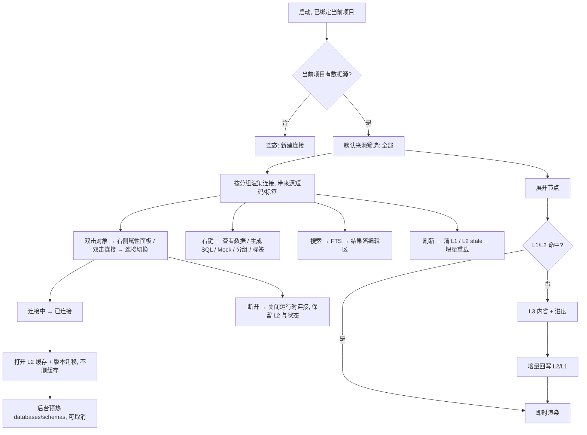

# 数据源管理 / 数据库导航模块 · 原型设计

> 状态：**方案 A 已实现（v5）；v6/v7 降密与徽标语义已实现（V2–V10，2026-09-13）** · 关联文件：`database-navigator-prototype.html`（可交互原型）、`database-nav-dev-plan.md`（开发方案）
> 参考基准：v1 导航器（`v1/docs/navigator/*`、`v1/frontend/extensions/builtin/database/**`、`v1/prototype/properties-panel-dbeaver.html`）、连接模块、布局、主题
> 技术栈：GPUI（gpui-kit 0.6），组件消费 `cx.theme()` 语义 token，**代码零裸 hex**

### v7 修订点（徽标语义与行内入口，2026-09-13）

| # | 反馈 | 修订 |
| --- | --- | --- |
| 1 | 徽标应同时表达状态与类型：**颜色 = 状态，形状 = 类型** | 行内最左徽标 = **单一元素承载两个事实**；状态点**并入徽标**（不再单独占位）；类型从“2 字母文字”升级为**形状 + 内叠字母**（§2.3） |
| 2 | 颜色这个稀缺通道应给**可操作性**（状态），不是**静态身份**（类型） | 采纳：`灰 = 不可用 / 彩 = 可用`；即使未连接呈灰，类型仍靠**形状 + 字母**区分，不依赖颜色 |
| 3 | 归属域短码**右对齐成列**（不再条件显） | 改为**右对齐固定列**常显（形成可扫视的对齐列）；是否需要该列由「⋯」设置决定（§2.1） |
| 4 | 行内 `+` 用于添加标签 | 行尾 `+` = **标签快捷入口**（展开行内标签编辑）；**归组仍走右键「分组 / 标签…」**，不新增第二个行内按钮（§6.1） |
| 5 | 标签显示 / 隐藏在「更多」处设置 | `⋯` 增「**显示标签**」开关（持久化 `settings.json`）；开启后行内以「最多 2 个小 chip + `+N`」呈现，超出进 tooltip（§2.2） |
| 6 | 密度预算应按“事实数”而非“元素数”计 | 修订规则 3：徽标承载 2 个事实算 1 个元素 → 行内常驻 **3 个**（徽标 + 名称 + 域码）（§1.1） |

### v6 修订点（降密与概念定位，2026-09-13）

| # | 问题 | 修订 |
| --- | --- | --- |
| 1 | 行内信息过密（6 槽位：箭头 / 状态 / 名称 / 归属码 / 驱动 id / 🗂） | **行内瘦身到「状态点 + 名称」**；第 3 个元素仅在“上下文无法推断”时出现（§1.1 / §2.3） |
| 2 | 驱动 id 常驻且是内部标识（`postgres_native`） | **驱动不进行**：显示名只在 tooltip / 属性面板（§2.3 / §7） |
| 3 | 行内 🗂 与右键「分组 / 标签…」重复 | **移除行内 🗂**；归组 / 标签统一走右键 + 键盘（§6.1 / §6.2） |
| 4 | 归属域在 chips 与行内重复 | **上下文去重**：筛选已收敛到单一归属域时，行内不显示短码（§2.1） |
| 5 | 四类正交属性缺统一定位 | **冻结定位表**（分组 / 标签 / 归属域 / 类型 / 驱动 / 状态）+ 三条边界规则（§1.1） |
| 6 | 「作用域」与「分组」中文语感都像“范围” | **改名「归属域」**（存域 / provenance），文档与 UI 统一（§1.1） |
| 7 | 多组重复呈现导致树垂直膨胀 | 主组全亮，其它组以**引用样式**出现（淡色 + `∈ 主组`）（§2.2） |
| 8 | 分组头只有计数 | 分组头加**聚合健康度** + 「全部折叠」（§2.2） |
| 9 | 类型未呈现、驱动代偿呈现 | **类型徽标常显**（基数小、互斥），作为数据库身份的扫视锚点（§2.3）→ **v7 细化为「形状 = 类型、颜色 = 状态」的双通道徽标** |

### v5 修订点（方案 A：消除「标签页 vs 来源徽标」重复）

| # | 反馈 | 修订 |
| --- | --- | --- |
| 1 | 已显示来源短码，为何还有项目/全局标签页（重复） | **去掉按来源的标签页**；来源降级为**筛选 chips + 行内短码**（§2.1） |
| 2 | 分组应是一级结构 | **自定义分组升为树的一级结构**（含「未分组」），不再被标签页挤到二级（§2.2） |
| 3 | 来源是连接的属性 | 来源（`P`/`G`/`GP`）仅作**属性**呈现与筛选，不做一级分区（§2.3） |

### v4 修订点

| # | 反馈 | 修订 |
| --- | --- | --- |
| 1 | 未打开项目无法启动软件 | 移除「未打开项目」分支；启动即绑定当前项目，项目标签恒可用（§2.1） |
| 2 | 连接可属多个分组、也可打多个标签 | 分组改 **多对多**（关联表）+ 新增多值 `tags` 字段（§2.2） |
| 3 | 元数据缓存与状态缓存都不应删除 | 断开 / 刷新 / 删除连接均**不删缓存**；仅显式「清理缓存」（§4.5 / §5.2） |
| 4 | 属性面板靠右，类似占用一个编辑面板 | 属性面板从模态改为**停靠中央编辑区右侧**的编辑面板（§7） |
| 5 | 来源用短码 | 来源标识用 **P / G / GP** 短码（§2.3） |
| 6 | 预热选 C | 首版采用折中方案（仅预热 databases/schemas）（§4.3） |
| 7 | 分组栏简单配色 | 分组头统一色（左侧 2px 色条），不做 8 色自定义（§2.2 / §9） |
| 8 | 新增通用 `search.match.background` | 采用该通用 token（§9） |
| 9 | DuckDB 分析表不属本模块 | **移除**内置「DuckDB 分析表」分组；本面板只管理数据源，分析资产归 M6（§3） |

## 0. 一句话定位

左 Dock `LeftPanel::Database` 面板：顶部**归属域 facet（全部 / 项目 / 全局 / 共享）+ 附加筛选（类型 / 驱动 / 标签）+ 搜索**，下面是**数据源管理 + 对象树**；数据源按**自定义分组**一级组织，可属于多个分组（主组全亮 + 其它组引用样式），标签只做筛选、不进树；连接行常驻「**徽标（颜色 = 状态 / 形状 = 类型）+ 名称 + 归属域短码（右对齐列）**」，行尾 hover 出 `+` 快速加标签，标签默认不显示（可在 `⋯` 开启）；续展开对象树（schema → 表 / 视图 / 存储过程 → 列）；双击对象打开**靠右停靠的 DBeaver 式属性面板**（事实的唯一权威展示位）。**本模块只管理数据源，不涉及分析资产。**

> **概念定位与边界规则见 §1.1**（v6 冻结）：“导航栏只做定位 + 连接 + 浏览；配置归对话框，详情归属性面板”。

## 1. 设计基准与语义

| 维度 | 基准 | 说明 |
| --- | --- | --- |
| 布局 | 五段布局（已定） | 面板 = 左侧 Dock 内容，起步 240px（可拖拽调宽） |
| 数据源 | M3 `connection`（已实现） | 连接带**归属域短码**：项目 `P` / 全局 `G` / 共享 `GP` |
| 导航 | M4 `database` + engine 元数据缓存（已实现） | `MetadataService` + `MetadataCacheManager` + `IntrospectionLevel` |
| 刷新 / 缓存 | v1 设计（§4） | 三级缓存 / 增量刷新 / 预热（C）/ 版本迁移；**缓存只增不删** |
| 分组 / 标签 | v1 `useGroupManager`（语义校正） | **路线 1**：分组 = 结构；标签 = 筛选；均与归属域正交（§2.2） |
| 属性面板 | DBeaver（`properties-panel-dbeaver.html` / `properties-registry.ts`） | 停靠编辑区右侧，属性网格 + 子实体 Tab |
| 配色 | `theme-design.md` | 侧栏 `sidebar`、选中 `list.active` + coral、弹层 `popover`、主按钮 `primary` |

### 1.1 概念定位（v6/v7 冻结）

| 概念 | 定位（本质是什么） | 回答的问题 | 关系 | 谁维护 | 表达位 | 明确禁止 |
| --- | --- | --- | --- | --- | --- | --- |
| **分组** | 结构 / 归属**容器** | “我的库放在哪” | 连接 ↔ 分组 **多对多** | 用户手工、可排序 | **树一级（唯一结构轴）** | 不做自动分类 |
| **标签** | 横切**描述 / 检索键** | “和什么相关的库” | 连接 → 标签 **多值** | 用户（可半自动） | **筛选 + 搜索**；行内**可选显示**（⋯ 开关） | 不进树、不排序 |
| **归属域**（原「来源 / 作用域」） | 记录的**存储域 / 来源** | “这条记录存在哪、谁能看到” | 1 条记录 = 1 域 | **系统** | **行内右对齐固定列**（可在 ⋯ 隐藏）+ 筛选 | 不参与组织 |
| **类型** | 数据库**身份 / 分类** | “这是什么库” | 类型 1 → N 驱动 | 系统（目录） | **徽标形状**（+ 内叠字母） | 不靠颜色、不常显全名 |
| **驱动** | 连接的**实现契约** | “用哪套代码连” | 驱动 N → 1 类型 | 系统（目录） | **属性面板 + tooltip** | 不做组织、不进常显行 |
| **状态** | **运行时健康** | “现在能不能用” | 每连接 1 个 | 系统 | **徽标颜色**（与类型共用同一元素） | 不冒充记录有效性 |

**心智模型**

> 导航栏的职责 = **定位 + 连接 + 浏览**；配置归对话框；详情归属性面板。
> 结构靠分组，检索靠筛选，细节靠面板。**事实只读，组织可写。**

**三条边界规则（裁决“信息放哪”）**

1. **一问一主**：三个问题（我的东西在哪 / 符合某条件的在哪 / 这一个的细节）各有且仅有一个承载位——**分组 / 筛选 / 属性面板**；任何信息不许同时占两位。
2. **事实 vs 组织**：系统事实（类型、驱动、归属域、地址、状态）只做**筛选与展示**；用户心智（分组、标签）才是**组织**；**事实永不变成结构**。
3. **密度预算**：行内常驻元素**上限 3 个**、且**每元素只承载一个“事实”**（徽标因颜色 / 形状双通道承载 2 个事实，仍算 1 个元素）。当前合规构成 = **徽标 + 名称 + 归属域列**；`+` 与行操作仅在 hover / 选中时显（不增加常驻密度）。新增属性默认进 facet 或属性面板。

> **命名**：原「来源 / 作用域」统一改称**「归属域」**（英文 `scope` / provenance 保留）。含义不变，仅避免与「分组」的中文语感混淆。历史文案中的“来源筛选 / 来源短码”即“归属域筛选 / 归属域短码”。

- 分组与标签都不随归属域筛选改变定义；一个连接可同时属于多个分组、带多个标签。
- 归属域是连接的**事实属性**：`GP` 共享 = 全局定义 + 当前项目快照，仅以短码 / 筛选呈现，不决定“进哪个标签页”。

### 1.2 为什么合并「管理」与「导航」

`layout-design.md` §7 未决项已写明「连接入口归属 → 并入数据库导航栏数据源节点」：顶部工具栏 = 管理动作，树根 = 数据源节点，节点右键承载管理菜单。

### 1.3 现状与目标

| 层 | 现状 | 本设计 |
| --- | --- | --- |
| 视图 | `panels.rs::render_connection_list` + `render_navigation_placeholder` | 新面板 `DatabaseNavPanel`：来源筛选 + 分组 + 对象树 |
| 导航数据 | `workbench/services/db_navigator.rs` 只读 DuckDB 分析库 | **移出本模块**；外部库走 `MetadataService` |
| 缓存 | engine 已实现 L1/L2，导航未接入 | 导航服务编排（§4），**不删缓存** |
| 连接状态 | `ConnectionItem.connected` 仅记录有效性 | 接入运行时连接服务（§5） |
| 分组 / 标签 / 展开态 | 无 | **新增后台表 / 字段**（§2.2 / §6.4） |

## 2. 面板布局

```
┌ 左侧 Dock 240px（sidebar 底）─────────────────┐
│ 数据源              [＋][🗂＋][⟳][断开][⋯]   │  ← 面板头 36px
├ 筛选（常驻）─────────────────────────────────┤
│ [🔍 名称 / 标签 / type: / scope: …] [筛选▾ 2]│
│ [全部]  项目   全局   共享                    │  ← 归属域 facet（常驻唯一 facet）
├ 树主体（滚动、虚拟化 >50）───────────────────┤
│ ▾ 核心库              1/2 · 2          ⇥     │  ← 分组头：色条+名+健康度(已连/总)+计数+全折叠
│     ▾ ◈ 生产 PG               GP    +      │  ← 连接：徽标（色=状态·形=类型）+ 名称 + 域码列
│       ▾ 📁 analytics                        │
│         ▾ ▦ 表                     23       │
│           ▾ orders              1.2M        │  ← 选中
│               order_id     PK  bigint       │
│               customer_id      bigint · FK  │
│         ▸ 👁 视图 / ƒ 过程 / ≡ 序列          │
│     ▸ ◈ 本地 MySQL            P             │
│ ▾ 报表            0/1 · 1 失败               │
│     ▸ ◈ 报表 PG               G             │
│ ▾ 未分组              1/1 · 1                │
│     ▸ ◇ 测试 SQLite           G             │
├ 底部状态（10.5px muted）─────────────────────┤
│ 3 已连接 · 1 离线 · 缓存 12 分钟前           │
└──────────────────────────────────────────────┘
```

> 图中 `◈` = 徽标（彩色 → 已连接；形状随类型）；`◇` = 同形状但灰色（未连接）。`+` 仅 hover / 选中时显现。

**连接行解剖（v7）**

```
[徽标]  名称 …………………………………………  [GP]   [+]
  ↑      ↑                              ↑     ↑
色=状态  flex_1 + text_ellipsis      右对齐列  hover/选中显（加标签）
形=类型（内叠 2 字母）
```

- **徽标 = 1 个元素承载 2 个事实**：**颜色 = 状态**（灰 = 不可用 / 彩 = 可用）、**形状 = 类型**（内叠 2 字母确认）；不再单独占一个状态点（§2.3）。
- **归属域短码右对齐固定列**：`P` / `G` / `GP`，形成可扫视的对齐列；是否显示该列由 `⋯` 设置决定（§2.1）。
- **行尾 `+` = 标签快捷入口**（hover / 选中显），点击展开行内标签编辑；**归组仍走右键**（§6.1）。
- **标签默认不显示**：`⋯ → 显示标签` 开启后以「最多 2 个小 chip + `+N`」呈现（§2.2）。
- **驱动不进行**：显示名与 driver id 只在徽标 tooltip + 属性面板（§2.3 / §7）。
- 名称 `flex_1 + min_w_0 + text_ellipsis`；徽标与域码均 `flex_none`（防长名挤压）。

> 实现状态（v5，2026-09-12）：面板头 `[＋][🗂＋][⟳][断开][⋯]` 已全部落地——`＋` 新建数据源、`🗂＋` 新建分组、`⟳` 刷新当前选中连接（§4.2）、`断开` 断开当前选中连接（仅已连接时可用，缓存保留）、`⋯` 更多（刷新全部 / 缓存管理）。
> 实现状态（v6/v7，2026-09-13）：**已实现** —— 行内瘦身 + 双通道徽标（含 hover 卡）、归属域右对齐固定列 + `⋯` 开关、标签行内可选显示（`⋯ → 显示标签`）+ 行尾 `+`、分组头健康度 / 全折叠、行操作悬停显示、多组引用样式（V6 派生的主组）、`筛选 ▾` facet 弹层 + 搜索 facet 语法（V7）。**仍待做** —— 显式「设为主组」（当前按分组排序派生）。

### 2.1 归属域筛选与 facet（原「来源筛选」）

- 面板头下方常驻一行归属域 chips：**全部 / 项目 / 全局 / 共享**（默认「全部」）——这是**唯一常驻 facet**（基数 3、互斥，符合密度预算）。
- 行尾「**筛选 ▾ N**」承载其余 facet：**类型 / 驱动 / 标签**（单选子菜单，可叠加）；`N` = 已生效的附加筛选项数（chips 与搜索 token 取并）。（✅ 已实现，2026-09-13）
- **归属域短码 = 行内右对齐固定列**（v7）：`P` / `G` / `GP` 常显，形成可扫视的对齐列；是否需要该列由 `⋯ → 显示归属域`（默认开）控制（§2.3）。
- 归属域是连接的**事实属性**（`P`/`G`/`GP`），筛选只做过滤，不占一级结构。
- **为什么去掉标签页**：标签页与行内短码表达同一件事（功能重复）；且 `GP` 归属「项目」使分区语义不一致。一级结构位让给**用户自定义分组**（§2.2）。
- 搜索框补充 `scope:global` / `type:postgres` / `driver:native` / `tag:prod` 语法，与 facet 互补（`source:` 作为 `scope:` 的历史别名保留）。
- **应用启动即绑定当前项目**：无「未打开项目」分支。
- 视图状态（归属域筛选 + 附加 facet、展开态、滚动、选中）按连接持久化（§6.4）。

**面板头 `⋯` 菜单（v7）**：刷新全部元数据 · 缓存管理… · **显示标签** · **显示归属域** · 管理分组与标签…（后三项持久化到 `settings.json` 的 `Navigator` 分区）。

### 2.2 分组（结构）与标签（检索）——路线 1

**分工（v6 冻结）**：分组 = **结构**（可排序 / 手工维护，占树一级）；标签 = **筛选**（扁平 / 无序 / 自由多值，**永不进树**）。两者形状相同（都是“连接所属集合”的多对多），因此必须用**表达位**区分，而不是再加一个维度。

| 维度 | 分组 Group | 标签 Tag |
| --- | --- | --- |
| 语义 | 结构 / 归属**容器**（树上可见） | 横切**描述 / 检索键**（不进树） |
| 基数 | 连接 ↔ 分组 = **多对多** | 连接 → 标签 = **多值** |
| 属性 | 名称、描述、排序 | 纯文本 |
| 归属 | 项目级（项目库） | 独立检索表 |
| 与归属域关系 | 正交，不随筛选变 | 正交 |

**分组头（v6）**：`色条(2px) + 名称 + 健康度(1/2) + 计数(2) + 全折叠(⇥，hover 显)`。

- 健康度 = `已连接/总数`，有失败时附加 `danger` 计数点——把状态**聚合到结构层**，省去逐行扫状态。
- `全折叠`：一键折叠全部同层分组（分组多时刚需）；分组右键菜单亦有「折叠其他」。

**多组重复呈现（v6，✅ 已实现 2026-09-13）**：同一连接属多个分组时，只在该连接的**主组**全亮呈现；其它组以**引用行**出现（`muted` 名称 + `∈ 主组名`，点击跳转到主组）。主组当前取分组排序最前的分组（`membership[conn][0]`）；显式「设为主组」仍待做。这样多对多不再线性撑高树。

**落库（新增后台表 / 字段）**

```
connection_groups              -- 项目库：分组定义
  id, name, description, sort_order, created_at, updated_at
connection_group_members       -- 项目库：分组↔连接 多对多关联
  group_id, connection_id, sort_order          -- (group_id, connection_id) 唯一
connection_tags                -- 标签（独立表）：连接↔标签 多值
  connection_id, tag, created_at               -- (connection_id, tag) 唯一
```

- 新增分组：面板头 `🗂＋` 或分组右键；表单 = 名称 + 描述。
- 归组：**右键「分组 / 标签…」**（唯一入口，v6 移除行内 🗂）+ 组内外手动排序；支持多选组。
- 标签：**右键「分组 / 标签…」** 或 **行尾 `+`** 编辑；多值；仅供筛选 / 搜索（`tag:prod`）。
- **标签行内显示（v7）**：默认**不显示**；`⋯ → 显示标签` 开启后，在名称与域码之间以「**最多 2 个小 chip + `+N`**」呈现（超出进 tooltip）。行高不变，不破坏对齐。
- 「未分组」固定分组（收纳不属于任何组的连接），不可删；**允许手动排序**；空分组隐藏。
- **配色**：分组头仅用统一色（左侧 2px 色条 + 略深底），不做 per-group 8 色自定义（反馈 7）。
- 标签用**独立表**（非 JSON 字段），便于 `tag:x` 检索与统计。
- **存储归属**（2026-09-11 上提）：分组与标签的服务读写统一到 `engine::persistence::ConnectionOrgStore`（**连接组织元数据**，M3 连接模块与 M4 导航共用）；本面板只做视图与交互；连接记录的 `tags` JSON 仅作兼容投影。

### 2.3 连接徽标（颜色=状态 · 形状=类型）与归属域列

**徽标 = 单一元素、双通道**

```
双通道徽标
├─ 颜色 → 状态（可操作性：能不能用）
└─ 形状 → 数据库类型（静态身份，内叠 2 字母确认）
```

**颜色 = 状态**（灰 = 不可用 / 彩 = 可用）

| 状态 | 取色（token） | 说明 |
| --- | --- | --- |
| 已连接 | `success` | 运行时可查 |
| 连接中 | `info` + 脉冲 | 建连 / 预热中 |
| 未连接 | `muted`（灰） | 记录存在、运行时未连 |
| 失败 | `danger` | 最近一次连接失败 |

**形状 = 类型**（取 `drivers.type_id`；剪影取自 `gpui-kit-assets` 全量 Lucide，**无需新增资产**）

| 类型 | 形状（资产路径） | 内叠字母 |
| --- | --- | --- |
| `postgresql` | `icons/database.svg` | `PG` |
| `mysql` | `icons/cylinder.svg` | `MY` |
| `mariadb` | `icons/coins.svg` | `MA` |
| `sqlite` | `icons/file.svg` | `SQ` |
| `duckdb` | `icons/layers.svg` | `DK` |
| `mssql` | `icons/server.svg` | `MS` |
| `oracle` | `icons/hexagon.svg` | `OR` |
| `clickhouse` | `icons/chart-column.svg` | `CH` |
| `mongodb` | `icons/leaf.svg` | `MG` |
| `redis` | `icons/braces.svg` | `RD` |

> 剪影为**建议取值**，需一轮视觉确认（在 16px 下是否互不混淆）；**字母是权威识别**，形状是冗余强化 + 扫视加速。
> 目录外的未来类型 → 回退 `icons/database.svg` + 类型名首 2 字母。

**归属域短码 —— 右对齐固定列**

| 短码 | 语义 | 取色（token） | 提示（tooltip） |
| --- | --- | --- | --- |
| `P` | 本项目创建、仅本项目可见 | `info` | 归属域：项目连接 |
| `G` | 系统级、所有项目可见 | `muted.foreground` | 归属域：全局连接 |
| `GP` | 全局定义 + 当前项目共享快照 | `primary`（coral） | 归属域：项目共享（全局快照） |

- 列宽固定（约 2.4rem）右对齐；未设置时整列留白，保证跨行对齐。
- 是否显示该列：`⋯ → 显示归属域`（默认开）。

**徽标 tooltip（统一给出全部事实）**

```
PostgreSQL（关系型）· 已连接 · 驱动 PostgreSQL (Official) · postgres_native
```

> **驱动呈现**：行内**不显示驱动**；tooltip 与属性面板承载（§7）。
> **状态点不再单独占位**（v7）——状态已由徽标颜色表达；类型也不靠颜色（颜色已被状态取用）。

### 2.4 空态

当前项目无数据源时显示引导（图标 + 标题「还没有数据源」+ 说明 + 「新建连接」）。

## 3. 树模型与节点（不含分析资产）

| 节点 | 图标角色 | 数据来源 | 可展开 |
| --- | --- | --- | --- |
| 分组 | 色条 + 计数 | `connection_groups` | ✅ |
| 连接（数据源） | **徽标（色=状态·形=类型）+ 名称 + 归属域列**（+ 可选标签） | `DataSourceService::list()` | ✅ catalog/schema |
| Catalog / Schema | 文件夹 | `MetadataService::list_catalogs/list_schemas` | ✅ |
| 类别文件夹 | 表 / 视图 / 存储过程·函数 / 序列·触发器 | 按对象 `kind` 分组 | ✅ |
| 表 / 视图 | `i-table` / `i-view` | `list_tables` | ✅ 列 |
| 列 | `i-col` + 类型 + `PK`/`FK` | `list_columns` | ❌ |
| 存储过程 / 函数 | `i-fn` | `list_procedures` / `list_functions` | 源码预览 |
| 序列 / 触发器 | `i-seq` / `i-bolt` | `list_sequences` / `list_triggers` | ❌ |

> **范围**：DuckDB 分析表 / 分析资源（M6）**不在本面板**；本模块只管理数据源与其元数据对象树。

## 4. 元数据加载与缓存（对齐 v1，缓存只增不删）

> v1 缓存文档：`v1/docs/navigator/06-CACHE-OPTIMIZATION.md`、`database-navigator-optimizations.md` §2.17/§3。

### 4.1 三级缓存读取

```
展开节点 → L1 内存（MetadataCache / CacheManager，<0.1ms）
           ├ 命中 → 渲染
           └ 未命中 ↓
         L2 每连接 SQLite（MetadataCacheManager::open + MetadataCacheOps，<5ms）
           ├ 命中 → 回填 L1 + 渲染
           └ 未命中 ↓
         L3 实时内省（database::MetadataService，10~500ms）
           └ 成功 → 异步回写 L2 + L1 → 渲染
```

L2 路径（engine `build_metadata_path`）：全局 `{system}/global_metadata/conn_{id}.sqlite`；项目 `{project}/meta/connection_metadata/conn_{id}.sqlite`。

**缓存键（身份指纹，规则已冻结 · 未接线）**：路径中的 `{id}` 将替换为**目标身份指纹**（`meta_{fp}.sqlite`），让指向同一物理库、同一访问主体的多条连接共享一份 L2（改名 / 改密码 / 换驱动实现 / 调连接参数都不重建缓存）。

| 进身份 | 内容 |
| --- | --- |
| 数据库族 | `data_source_types.id`（`mysql` / `postgres` / …），**不是**驱动实现 id（`mysql_native`） |
| 规范化地址 | 网络型：主机小写 + 端口（空→驱动默认端口）+ 库 / schema（大小写敏感，不折叠）；文件型：规范化路径（去 scheme 与查询串、`\`→`/`、Windows 折叠大小写） |
| 访问主体 | 用户名（优先）/ 认证档案 id / 认证类型——权限决定可见对象集合，**不能跨主体共享** |
| 格式版本 | `CACHE_FORMAT_VERSION`（当前 1）：缓存结构升级即分池（旧缓存不删） |

**不进身份**：连接 ID / 显示名（改名即失配）、驱动实现 id、密码与密钥（安全 + 轮换即失效）、SSL / 代理 / 超时等连接参数（只影响“怎么连”）。指纹 = `sha256(规范化串)` 前 16 hex，纯函数在 `engine::persistence::metadata_identity`（13 项单测）。切换与本模块接入 L2 同轮进行，并配套 `metadata_cache_index`（`canonical_desc` 可读描述 / `ref_conn_ids` 引用计数 / `last_used_at` / `size_bytes`）供「缓存管理」展示占用与孤儿。详见 `docs/architecture/connection/connection-dialog-architecture.md` §3.6。

### 4.2 增量刷新（v1 V7）

- `detect_all_changes`（对象 hash 快照比对）→ `ChangeDetectionResult` → `incremental_sync` 只落变更；快照 `save_snapshot` / `get_snapshot` / `has_snapshot`。
- 刷新粒度：单连接（工具栏 ⟳）/ 单 schema / 单表（节点右键）/ 全部（「更多」）。
- 触发：手动、连接重建、内省级别变更、预热完成。

### 4.3 预热（采用方案 C）

| 方案 | 首次体验 | 额外负载 | 复杂度 | 结论 |
| --- | --- | --- | --- | --- |
| A 懒加载 | 逐节点等待 | 最低 | 最低 | — |
| B v1 智能预热（并发 2 / 100ms / 上限 5·10·50） | 顺畅 | 中 | 中 | 后续可升 |
| **C 折中：仅预热 databases / schemas** | schema 秒开、表按需 | 低 | 低 | **首版采用** |

- C 参数：`enabled=true, depth=databases|schemas, delay=100ms, maxDatabases=5, maxSchemas=10, maxTables=0, concurrency=2`。
- 进度 / 取消 / 状态复用 `is_syncing` / `get_sync_status` / `cancel_sync`。

### 4.4 邻接节点预加载

展开表时预取相邻表/列（可配置并发/深度，失败静默）。

### 4.5 缓存失效（不删除）

| 触发 | 动作 |
| --- | --- |
| 手动刷新 | 清 L1；L2 标记 stale，展开时增量重载（**不删 L2**） |
| 断开连接 | 只关运行时连接，**L2 保留**（离线可浏览 / 重连秒开） |
| 删除连接 | **缓存文件保留**（避免误删后全量重拉）；指纹键落地后按 `ref_conn_ids` 引用计数标记孤儿（不自动删）；提供显式「清理缓存」入口 |
| 内省级别变更 | 标记 L2 过期（`set_level` / `from_object_count`） |
| DDL 监听（未来） | 智能失效相关表（v1 设计，未落地） |
| 版本不符 | `CacheVersionManager` 迁移 |

> 提供「缓存管理」入口：查看各连接缓存占用、显式清理（唯一删除路径）。入口**两处都有**：设置面板 + 数据源面板头「更多」。

### 4.6 缓存版本迁移

engine 已迁移 `CacheVersionManager` + `CURRENT_CACHE_VERSION`（V1→…→V8 策略链）：打开 L2 校验版本，`needs_upgrade` 则 `migrate`；启动时静默执行。

### 4.7 进度与取消

| 能力 | 后端 | UI |
| --- | --- | --- |
| 同步状态 | `get_sync_status` → `SyncStatusInfo` | 连接节点转圈 + 底部进度 |
| 是否同步中 | `is_syncing` | 禁重复刷新 |
| 取消 | `cancel_sync` | 进度条「取消」 |
| 后台队列 | `enqueue_sync_task` / `get_next_sync_task` / `complete_sync_task` / `get_pending_task_count` | 「更多」查看队列 |
| 分块读取 | `get_tables_chunk` → `ChunkResult` | 大 schema「加载更多」 |

### 4.8 v1 API → v2 落点映射

| v1 接口 / 能力 | v2 落点 |
| --- | --- |
| `refresh_metadata_cache` / `clearMetadataCache` | `MetadataCacheOps::clear_metadata` + L1 清理 |
| `build_cache_index`（增量） | `MetadataCacheOps::build_metadata_index` / `enqueue_indexing_tasks` |
| `start_cache_warming` / `get_warming_progress` / `cancel_cache_warming` | 导航服务编排 `build_metadata_index` + `is_syncing` / `cancel_sync`（预热调度器为本模块新增） |
| `check_cache_version` / `execute_cache_migration` | `CacheVersionManager` / `CURRENT_CACHE_VERSION` |
| 增量同步（V7） | `detect_all_changes` / `incremental_sync` / `save_snapshot` |
| 分块读取 | `get_tables_chunk` |
| FTS 搜索 | `search_fts` |
| 内省级别 | `IntrospectionLevel` + `set_level` / `get_level` |

## 5. 连接 / 断开

### 5.1 动作与后端

| 动作 | 后端 | 缓存联动 |
| --- | --- | --- |
| 连接 | `ConnectionService::connect_with_type(ConnectRequest{connection_type, project_path, …})` | 打开/建 L2 + 预热（C） |
| 断开 | `ConnectionService::close_connection(conn_id)` | **保留缓存**（去掉 v1 的 `cache_manager.delete()`） |
| 切换活动连接 | `switch_connection(conn_id)` | 更新状态栏连接名 |
| 探测状态 | `has_connection` / `list_connections()` | 状态点 |
| 启动恢复 | `get_recent_connections()` | 可选重开上次连接 |

状态机：`未连接 → 连接中 → 已连接 / 失败`；连接中禁重复触发；失败节点内联可读原因 + 重试。

### 5.2 缓存永不删除（本版策略）

- 无论**元数据缓存**（L2 SQLite）还是**状态缓存**（`navigator_state` / 分组），**默认都不删除**。
- 断开 / 刷新 / 删除连接：均保留缓存文件与状态记录。
- 唯一删除路径：设置里的**「缓存管理 → 清理」**（可单连接 / 全量），并给出占用大小预览。
- 优点：离线可浏览、重连秒开、误删连接可恢复元数据；代价：磁盘会累积 —— 用「缓存管理」与 TTL 标记（而非删除）来治理。

## 6. 核心交互

### 6.1 节点操作

| 交互 | 行为 |
| --- | --- |
| 单击节点 | 选中（**选中即聚焦导航面板**，供键盘操作） |
| 单击箭头 | 展开 / 折叠（懒加载） |
| **双击对象** | **右侧属性面板**（DBeaver，§7） |
| **双击连接** | 连接 / 断开切换 |
| 悬停 / 选中连接行 | 行尾浮出 **`+`（加标签）** 与行操作（断开、刷新、⋯）；常驻零 affordance |
| 拖拽表到编辑器 | 插入限定名到 SQL 光标处 |
| 右键 | 上下文菜单（6.2）——**归组的唯一入口** |

> **v6/v7**：移除行内 🗂 归组按钮（与右键菜单重复）；行尾 `+` 只负责**标签快捷编辑**，分组归组统一走右键。行操作全部可由键盘 / 右键到达，悬停显隐只影响“可见性”，不影响可达性（C7 键盘导航已覆盖）。

### 6.2 右键菜单

**连接节点**：连接 / 断开 · 编辑连接… · 测试连接 · 查看属性 · 刷新元数据 · **分组 / 标签…**（多选组 + 多值标签，含「设为主组」）· 复制连接（模板，无明文凭据）· 共享至项目 / 取消共享 · 删除连接（二次确认 + 清理 DuckDB Secret，**保留缓存**）。

**表 / 视图**：查看数据（中央只读预览，`LIMIT 200`）· 查看属性 · 新建查询（SELECT）· 生成 INSERT/UPDATE/DELETE · 复制名称 / 限定名 · 生成 Mock 数据 · 刷新此表元数据。

**分组节点**：新建分组 / 重命名 / 编辑描述 · 删除分组（**不删成员连接与缓存**）· 在此新建连接 · 折叠 · **折叠其他**（v6）。

**列 / 索引 / 约束 / 例程**：查看属性 · 复制名 · 生成 Mock（列）。

### 6.3 搜索

- 本地筛选：过滤已加载节点的名称与标签，命中自动展开祖先链。
- **facet 语法（v7，✅ 已实现 2026-09-13）**：`scope:global` / `type:postgres` / `driver:native` / `tag:prod`（`source:` 为 `scope:` 历史别名）。解析出的 token 作为**额外约束与面板 chips 叠加（AND）**，不写回 chips；未识别的 token 原样留在自由文本，避免“输入中丢字”。另：chips 侧的 `type` 存 `drivers.type_id`、`driver` 存驱动 id。
- **已保存视图（规划）**：可把 `scope:project tag:prod type:mysql` 存为命名视图，避免重复点 chips（存储与交互待定，见 §11）。
- FTS 全量搜索（≥2 字符）：`MetadataCacheOps::search_fts`，snippet 高亮；结果落**中央编辑区**专用面板。
- `↑↓` 选择、`Enter` 打开、`Esc` 清空；300ms 防抖、上限 500。

### 6.4 状态持久化：SQLite 表 vs K-V 文件（选型建议）

先区分两类「状态」：

| 类别 | 内容 | 特征 | 建议落点 |
| --- | --- | --- | --- |
| **结构化状态** | 展开/选中/过滤（`navigator_state`）、分组与成员（M:N）、标签（多值） | 关系型、随项目物理隔离、量大、需按连接/标签检索 | **SQLite**（project.db / global.db，新增表 + migrations） |
| **UI 偏好** | 属性面板宽度、导航面板宽度、短码⇄文字开关、主题 | app 级、跨项目、非结构化、极小 | **settings.json**（`crates/settings` 已有持久化） |

**为什么结构化状态用 SQLite，而不是 v1 式 K-V**：

| 维度 | SQLite 表 | K-V 文件（v1 localStorage 等价物） |
| --- | --- | --- |
| 关系（多对多 / 多标签 / 按标签检索） | ✅ join + 索引 | ❌ 需全量反序列化后内存过滤 |
| 项目物理隔离 | ✅ project.db 天然隔离 | ⚠️ 单文件，需自造 key 前缀隔离 |
| 事务 / 迁移 / 版本 | ✅ engine `migrations` + `CacheVersionManager` | ⚠️ 手写版本号与迁移 |
| 数据量（展开键 / 大库对象） | ✅ | ⚠️ 全量读写 |
| 纯 UI 偏好（面板宽度） | 过重 | ✅ 轻 |

- v1 用 localStorage 是 webview 环境所限；v2 原生 + 双层 SQLite，没有 localStorage，等价选择就是「SQLite 表 vs JSON/K-V 文件」。
- **结论**：结构化状态进 SQLite（新增表，随项目/全局库分区），UI 偏好进 `settings.json`；**不新增独立 K-V 文件**（避免绕开事务/迁移/检索）。
- 参考现有设施：engine `WorkbenchContextStore`（`global.db` 结构化表，已含 `Navigator`/`Properties` 面板类型）可复用其形态；本模块的 `navigator_state` 因是项目级，建议落 `project.db`（全局连接的状态落 `global.db`）。

**新增表**（结构化状态）：

```
navigator_state   -- conn_id, scope, expanded_keys, selected_key, filter_text, version, updated_at
connection_groups / connection_group_members / connection_tags   -- 见 §2.2
```

- 写入防抖 800ms；状态与缓存一样**不随断开/删除清除**。

### 6.5 快捷键与显示偏好

- `↑↓` 移动、`→`/`←` 展开折叠、`Enter` / `F4` 打开属性、`F2` 编辑连接、`Ctrl+F` 聚焦搜索。
- **来源短码 ⇄ 文字**：提供用户开关（设置内），默认短码 `P/G/GP`，可切换为「项目 / 全局 / 共享」。偏好存 `settings.json`。

## 7. 属性面板（DBeaver 对标，停靠编辑区右侧）

> 参考 `v1/prototype/properties-panel-dbeaver.html` 与 `properties-registry.ts`。**形态：占据中央编辑区右侧的编辑面板**（不是模态），可通过关闭按钮/tab 收起。

```
中央编辑区（DockArea Center）
┌───────────────────────────────┬──────────────────────┐
│ 查询编辑器 / 数据预览            │ 属性面板（靠右停靠）    │
│                               │ ┌──────────────────┐ │
│                               │ │ ▦ analytics.orders│ │  ← 对象头 + 关闭
│                               │ ├──────────────────┤ │
│                               │ │ 属性 | 数据        │ │  ← 顶部 Tab
│                               │ ├──────────────────┤ │
│                               │ │ 类型     BASE TABLE│ │  ← 属性网格（label/value）
│                               │ │ 行数     1,204,388 │ │
│                               │ │ 引擎     InnoDB    │ │
│                               │ │ 列数     18        │ │
│                               │ ├──────────────────┤ │
│                               │ │ 列 约束 索引 外键 DDL│ │  ← 子实体 Tab
│                               │ │ # 名称    类型      │ │  ← 内容表 / DDL
│                               │ │ 1 order_id bigint  │ │
│                               │ └──────────────────┘ │
└───────────────────────────────┴──────────────────────┘
```

- **入口**：双击任意对象节点；右键「查看属性」；`F4`。同节点 300ms 去抖。
- **位置**：打开后**直接填充编辑区右侧内容区**（与编辑区左右分栏，分隔条可拖拽，**宽度记忆到 `settings.json`**），与「查看数据」共用同一分栏；关闭后编辑区恢复整宽。
- **顶部 Tab**：`属性` / `数据`（`数据` = 只读预览）。
- **属性网格**：由**类型注册表**给出 label/value；窄栏下为单列 label/value 行。
- **子实体 Tab**：列 / 约束 / 索引 / 外键 / 触发器 / DDL（按类型裁剪），内容为表格或 DDL 代码。
- **类型注册表**（v1 `properties-registry.ts`）覆盖：connection / catalog / schema / table / view / column / index / constraint / procedure / function / sequence / trigger。
- **数据来源**：缓存明细优先（`load_node_detail` / `load_table_indexes` / `load_table_foreign_keys`），缺字段按需实时补齐；DDL 由内省拼装。
- **事实的唯一权威展示位（v6）**：连接的 `数据库类型` / `驱动（显示名 + driver id + driver_kind）` / `归属域` / `地址（host:port/db）` / `运行时状态` 全部在此展示；行内与 tooltip 只是它的快捷摘要，避免同一事实在多处定义（§1.1 规则 2）。

> **当前实现**：属性面板连接项显示 `名称` / `归属域` / `数据库类型` / `驱动`（✅ 已实现 2026-09-13：类型来自目录 `type_id`，驱动显示友好名 + id，如 `PostgreSQL (Official) · postgres_native`）。徽标 hover 卡已接 `gpui-kit` `HoverCard`（300ms 延迟显类型 / 状态 / 驱动；0.6.1 无通用 `.tooltip()` 扩展）。

落点：`crates/database/src/property_panel.rs`（注册表 + 字段组装）+ 编辑区右侧面板视图（`crates/workbench`）。

## 8. 关键帧与状态流



## 9. 主题映射（token → 视觉）

> 色值只存在于 `assets/themes/rds-theme.json`，组件经 `cx.theme()` 读取，**禁止写裸 hex**。

| 元素 | Token | RDS Light | RDS Dark |
| --- | --- | --- | --- |
| 面板底 | `sidebar.background` | `#F3F3F3` | `#252526` |
| 面板头 / 分隔线 | `sidebar.border` | `#E7E7E7` | `#3C3C3C` |
| 来源筛选 chips（选中 / 未选中） | `list.active.background` + `list.active.border` / `sidebar.foreground` | — | — |
| 正文 / 弱文字 | `sidebar.foreground` / `muted.foreground` | `#616161` / `#8E8E8E` | `#CCCCCC` / `#8A8A8A` |
| 行悬停 / 选中 | `list.hover.background` / `list.active.background` | `#F0F0F0` / `#E4E4E4` | `#2A2D2E` / `#37373D` |
| 分组头（统一色） | 左色条 `list.active.border` + 底 `sidebar.accent.background` | — | — |
| 来源短码 `P` / `G` / `GP` | `info` / `muted.foreground` / `primary` | — | — |
| 状态点 | `success` / `info` / `muted` / `danger` | — | — |
| 驱动徽标 | `info`(PG) / `warning`(MySQL) / `success`(SQLite) / `primary`(DuckDB) | — | — |
| 属性面板 / 右键菜单 | `popover.background` / `foreground` + `border` | `#FFFFFF` / `#333333` | `#252526` / `#CCCCCC` |
| 属性子实体 Tab 激活 | `tab.active.background` + 顶条 `list.active.border` | — | — |
| 搜索命中高亮 | **新增通用 `search.match.background`** | `#FFF3C4` | `#4A3F00` |
| 预热进度条 | `accent.background` 底 + `primary` 进度 | — | — |

新增产品语义 token（与草稿箱共用）：

| 产品角色 | RDS Light | RDS Dark | 消费方 |
| --- | --- | --- | --- |
| `search.match.background` | `#FFF3C4` | `#4A3F00` | 搜索结果命中文本底 |

## 10. GPUI 落点映射

| 原型元素 | GPUI 落点 |
| --- | --- |
| 面板容器 | `crates/workbench/src/panels.rs`（`SidebarPanel::render_database_nav`，按现有面板归属实现，未独立拆文件） |
| 左 Dock 装配 | `crates/workbench/src/panels.rs`（`SidebarPanel` 的 `LeftPanel::Database` 分支） |
| 归属域 facet（原来源筛选 chips） | `panels.rs::nav_source_chip`（全部 / 项目 / 全局 / 共享，默认全部） |
| 连接行瘦身 + 双通道徽标（v6/v7） | ✅ `panels.rs::{render_connection_row, nav_type_badge, NavBadgeStatus}`；驱动目录 `nav_runtime::driver_catalog()` → `Shared::driver_catalog`（`defer_in` 一次性加载，render 无 I/O） |
| 徽标 hover 卡（v7） | ✅ `panels.rs::nav_badge_hover_card`（`gpui_kit::component::hover_card::HoverCard`，300ms 延迟） |
| 归属域右对齐固定列 + 标签行内显示 + 行内 `+`（v7） | ✅ `panels.rs::render_connection_row` + `settings::SettingsService::{show_scope, show_tags}`（`⋯` 开关，持久化） |
| 筛选 facet 入口（类型 / 驱动 / 标签）（v7） | ✅ `panels.rs::{render_database_nav, build_facet_items, nav_facet_candidates, apply_facet, clear_nav_filters}` + `settings::model::NavigatorFilters`（`settings.json` 持久化）；搜索 token 解析 `parse_nav_search` |
| 分组头健康度 / 全折叠（v6） | ✅ `panels.rs::{render_group_header, render_nav_tree}`（`已连接/总数` + 失败计数 + 全折叠） |
| 多组引用样式 / 主组（v6） | ✅ `panels.rs::{render_nav_tree, render_connection_row, render_reference_row}`（主组全亮，其它组 `∈ 主组名` 引用行，点击跳主组）；主组按分组排序派生，显式「设为主组」待做 |
| 行操作悬停显隐（v6/v7） | ✅ `panels.rs::render_connection_row`（`.group("nav-conn-row")` + `.group_hover` + `.opacity`；右键 + 键盘仍为全量入口） |
| 属性面板（连接项类型 / 驱动友好名） | ✅ `crates/database/src/property_panel.rs::load_properties`（`db_type` 行）+ `navigator_service::load_properties` + `panels.rs::EditorPanel::render_property_panel` |
| 分组 / 标签模型 | `crates/database/src/model.rs`（`ConnectionGroup` / `ConnectionTag` / `NavSource`） |
| 分组 / 标签 / 状态持久化 | `crates/engine/src/persistence/connection_org_store.rs`（权威存储）+ `crates/workbench/src/services/nav_store.rs`（视图状态） |
| 分组一级视图 / 行内归组 | `panels.rs::{render_nav_tree, render_group_header, render_org_editor}` |
| 右键菜单（连接 / 对象 / 分组） | `panels.rs` 的 `ContextMenuExt::context_menu`（`gpui_kit::component::menu`） |
| 生成 SELECT → 编辑区 | `Shared::editor_set` + `SidebarEvent::EditorSqlRequest`（`panels.rs` / `view.rs` 消费） |
| 新建数据源入口（面板头 `＋` / 空态按钮） | `panels.rs::render_database_nav` / `render_nav_tree`（置位 `Shared::new_connection_request` + `SidebarEvent::NewConnectionRequest`），`EditorPanel::render` 消费并 `request_new_connection` |
| 面板头 `⟳ 刷新` / `断开当前连接` | `panels.rs::render_database_nav`（`Button::new("nav-refresh")` / `Button::new("nav-disconnect")`）+ `SidebarPanel::nav_current_connection`（选中节点为连接根）；动作走 `refresh_node` / `toggle_connection`，未选中 / 未连接时 `disabled` |
| 大 schema 分页（「加载更多」） | `panels.rs::{render_more_row, folder_limit}` + `ui.rs::NAV_FOLDER_PAGE_SIZE` |
| 快捷键（Ctrl+F / ↑↓ / →← / Enter·F4） | `workbench::commands::{FocusNavSearch, NavUp, NavDown, NavExpand, NavCollapse, NavOpenProperties}`；`panels.rs::{nav_move, nav_order, nav_open_properties}` |
| 导航 L2 缓存（cache-aside） | `crates/database/src/cache.rs`（`NavCache`）+ `navigator_service.rs`（`with_context(project_root, fresh)`）；底层 `engine::persistence::MetadataCacheOps` |
| 后台任务（C1 预热 / C2 预取 / 树加载 / 属性加载） | `crates/workbench/src/services/nav_jobs.rs`（工作线程 + 队列 + 结果队列 + 进度/取消）+ `navigator_service::{warm_schemas, prefetch_columns}`；render 不再做 I/O |
| 导航领域模型 / 状态 | `crates/database/src/model.rs` |
| 导航编排服务（缓存/刷新/预热/搜索/分页） | `crates/database/src/navigator_service.rs`（新增） |
| 实时内省 | `crates/database/src/metadata_service.rs`（已有） |
| 缓存与增量/预热/队列/版本 | engine `MetadataCacheManager` / `MetadataCacheOps` / `CacheVersionManager`（已有） |
| 属性面板（注册表 + 视图） | `crates/database/src/property_panel.rs` + 编辑区右侧面板（`crates/workbench`） |
| 缓存管理（占用 / 清理） | `crates/workbench/src/components/cache_dialog.rs`；engine `MetadataCacheManager::size` / `delete`，仅由本对话框调用（设置面板与导航面板头两处入口） |
| UI 偏好（短码开关 / 属性面板宽度） | `crates/settings/src/model.rs`（`Navigator` 分区）+ `settings_view.rs`；属性面板拖拽 `h_resizable`（`EditorPanel::render`） |
| 连接 / 断开 | `crates/workbench/src/services/connection_service.rs`（断开不再删缓存） |
| 新建 / 编辑连接对话框 | `crates/workbench/src/components/connection_dialog.rs`（复用） |
| 数据源列表 / CRUD / 标签 | `crates/workbench/src/services/data_source_service.rs`（已有，扩展 tags） |
| 主题 token | `assets/themes/rds-theme.json`（+ `search.match.background`） |
| 依赖声明 | `crates/workbench/Cargo.toml` 增加 `database.workspace = true`（无环） |

> M4 领域模型与服务在 `crates/database`（非 UI），GPUI 视图在 `workbench`。

## 11. 补充建议（供参考）

> v6/v7 已并入正文的项：行内瘦身 / **双通道徽标** / 归属域改名与**右对齐列**、移除行内 🗂、标签行内可选显示 + 行尾 `+`、分组头健康度 + 全折叠 + 多组引用样式、facet 入口 + 搜索 facet 语法（§1.1 / §2 / §6.1）。下表为**收敛后的待决策项**。

| # | 建议 | 状态（v7） |
| --- | --- | --- |
| 1 | `search.match.background` 与草稿箱合并 | ✅ 已落地（C5 产品 token） |
| 2 | 多对多 + 多标签的索引 | ✅ 已落地（联合主键 / 独立表） |
| 3 | 「管理分组与标签」覆盖层（批量重命名 / 合并分组 / 清理空标签） | ⬜ 待做（分组多时刚需） |
| 4 | 缓存总占用可见 + 单连接清理 | ✅ 入口已有（缓存管理对话框） |
| 5 | 孤儿缓存回收策略（多久无引用后提示清理） | ⬜ 待做 |
| 6 | 归属域短码 tooltip + 短码⇄文字开关 | ✅ 已落地 |
| 7 | 属性面板与数据预览共用面板位 | ✅ 已定（同一分栏两个 Tab） |
| 8 | 标签命名规范 `key:value`（`env:prod`） | ⬜ 待定（影响 `tag:` 解析） |
| 9 | 连接排序：组内手动优先，未排按名称；「未分组」同 | ✅ 已定 |
| 10 | 大 schema 列内联展开阈值（>50 列转属性面板） | ⬜ 待做 |
| 11 | **已保存视图**（`scope:project tag:prod` → 命名视图） | ⬜ 待定（v6 新提，§6.3） |
| 12 | **状态排序「最近连接」**（`recent_connections` 表已有） | ⬜ 待做（v6 新提） |
| 13 | **标签不冗余事实**（`type:` / `driver:` / `scope:` 不写入标签表，仅作隐式 facet） | ✅ v6 定为原则（§1.1 规则 2） |
| 14 | **标签行内显示开关**（`⋯ → 显示标签`，默认关） | ✅ v7 已实现（2026-09-13） |
| 15 | **筛选 ▾ facet 弹层 + 搜索 facet 语法** | ✅ v7 已实现（2026-09-13；facet 持久化 `settings.json`；搜索 token 作 AND 叠加） |
| 16 | **显式「设为主组」** | ⬜ 待做（当前按分组排序派生，需 `is_primary` 列或 `navigator_state`） |

## 12. 已确认决策（v5 / v6 / v7）

| # | 事项 | 决策 | 版本 |
| --- | --- | --- | --- |
| 1 | 标签存储 | **独立表** `connection_tags(connection_id, tag)`（非 JSON 字段） | v5 |
| 2 | 「未分组」排序 | **允许手动排序** | v5 |
| 3 | 属性面板宽度 | **记住拖拽宽度**（存 `settings.json`） | v5 |
| 4 | 缓存管理入口 | **两处都有**：设置面板 + 面板头「更多」 | v5 |
| 5 | 归属域短码 | 默认短码 `P/G/GP`，**提供「短码 ⇄ 文字」开关** | v5 |
| 6 | 预热方案 | **C**（仅预热 databases/schemas） | v5 |
| 7 | 未打开项目 | 不存在该状态；启动即绑定当前项目 | v5 |
| 8 | 缓存删除 | 元数据/状态缓存**都不删**，仅显式「缓存管理 → 清理」 | v5 |
| 9 | 范围 | 本面板只管理数据源；DuckDB 分析表 / 分析资源归 M6 | v5 |
| 10 | 来源呈现（方案 A） | **去掉按来源标签页**；来源 = 筛选 chips + 行内短码；**分组升为一级结构** | v5 |
| 11 | 状态存储 | 结构化状态 → **SQLite 新增表**；UI 偏好 → `settings.json`（§6.4） | v5 |
| 12 | **概念定位** | 冻结 6 概念定位表 + 3 条边界规则（一问一主 / 事实 vs 组织 / 密度预算） | v6 |
| 13 | **归属域命名** | 原「来源 / 作用域」改名**「归属域」**（scope / provenance） | v6 |
| 14 | **行内密度** | 常驻 **3 个**（徽标 + 名称 + 归属域列）；**徽标双通道**：颜色=状态 / 形状=类型 | v6/v7 |
| 15 | **驱动呈现** | 驱动**不进行**；显示名 / driver id 只在徽标 tooltip + 属性面板 | v6 |
| 16 | **归组入口** | **移除行内 🗂**；分组归组走右键 + 键盘 | v6 |
| 17 | **分组 / 标签分工** | **路线 1**：分组 = 结构（树一级）；标签 = 筛选（**不进树**） | v6 |
| 18 | **多组呈现** | 主组全亮 + 其它组**引用样式**（`∈ 主组`）；主组可指定 | v6 |
| 19 | **分组头** | 加**健康度**（`已连接/总数`）+ **全折叠** | v6 |
| 20 | **facet** | 归属域 chips 常驻；类型 / 驱动 / 标签进「筛选 ▾」 | v6 |
| 21 | **徽标语义（v7）** | **颜色 = 状态**（灰=不可用 / 彩=可用）、**形状 = 类型**（内叠 2 字母）；状态点**并入徽标**，不再单独占位 | v7 |
| 22 | **归属域行内呈现（v7）** | **右对齐固定列**常显（原“条件显”作废）；`⋯ → 显示归属域`（默认开） | v7 |
| 23 | **行内 `+`（v7）** | `+` = **标签快捷入口**；归组仍走右键（不新增第二个行内按钮） | v7 |
| 24 | **标签行内显示（v7）** | 默认**关**；`⋯ → 显示标签` 开启后「**≤2 chip + `+N`**」，超出进 tooltip | v7 |
| 25 | **密度预算（v7 修订）** | 上限 **3 元素** / 每元素一个“事实”（徽标双通道仍算 1）；`+` 与行操作仅 hover / 选中显 | v7 |
| 26 | **筛选入口（v7）** | 归属域 chips 常驻（唯一 facet）；类型 / 驱动 / 标签进「**筛选 ▾ N**」弹层（单选子菜单 + 清除）；`N` = 已生效附加项数 | v7 |
| 27 | **facet 持久化（v7）** | facet 筛选进 `settings.json` 的 `Navigator::filters`（UI 偏好）；展开 / 选中仍走 `navigator_state` | v7 |
| 28 | **搜索 facet 语法（v7）** | `scope:/source:/type:/driver:/tag:` 作**额外 AND 约束**与 chips 叠加，**不回写 chips**（避免输入框反馈环）；未识别 token 留自由文本 | v7 |
| 29 | **多组引用（v7 实现）** | 主组按分组排序派生（`membership[conn][0]`）；显式「设为主组」后续再加列 | v7 |

## 13. 已确认细节

| # | 事项 | 决策 |
| --- | --- | --- |
| 1 | 属性面板宽度 | 打开即**填充编辑区右侧内容区**（左右分栏，可拖拽，宽度记忆） |
| 2 | `navigator_state` 分区 | 认可：项目级 → `project.db`，全局连接 → `global.db` |
| 3 | 同组连接默认排序 | 手动优先；未手动排序的**按名称**升序 |

---

设计已冻结（v5 方案 A + v6 降密与概念定位），开发方案见 `database-nav-dev-plan.md`。
