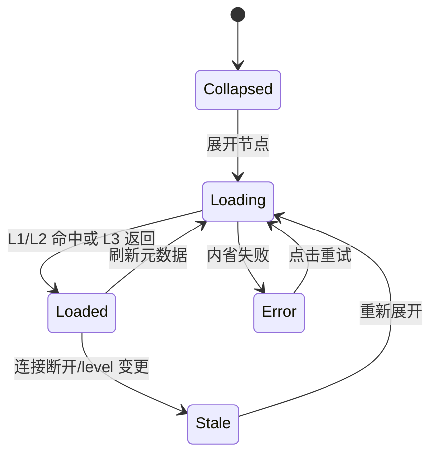
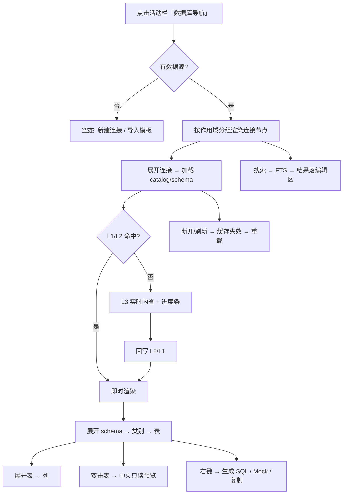

# 数据源管理 / 数据库导航模块 · 原型设计

> 状态：**待确认** · 关联文件：`database-navigator-prototype.html`（可交互原型）、`database-nav-dev-plan.md`（开发方案，确认后编写）
> 参考基准：v1 导航器（`v1/docs/navigator/*`）、连接模块（`docs/architecture/connection/connection-prototype-design.md`）、布局（`docs/architecture/layout/layout-design.md`）、主题（`docs/architecture/theme/theme-design.md`）
> 技术栈：GPUI（gpui-kit 0.6），组件消费 `cx.theme()` 语义 token，**代码零裸 hex**

## 0. 一句话定位

把当前左 Dock 里「连接列表（M3）+ 导航占位（M4）」两块，**合并为单一面板「数据源」**：上半是数据源管理（新建 / 编辑 / 连接 / 测试 / 删除 / 作用域），下半按作用域分组展开完整对象树（schema → 表 / 视图 / 存储过程 → 列）。这是 `LeftPanel::Database` 的正式内容。

## 1. 设计基准与 v2 语义变更

| 维度 | 基准 | 说明 |
| --- | --- | --- |
| 布局 | 五段布局（已定） | 面板 = 左侧 Dock 内容，`LeftPanel::Database`，起步 240px（Dock 可拖拽调宽） |
| 数据源 | M3 `connection`（已实现） | 连接配置双轨：`G_` 仅全局 / `P_` 仅项目 / `GP_` 项目引用全局快照 |
| 导航 | M4 `database` + engine 元数据缓存（已实现） | `MetadataService`（实时内省）+ `MetadataCacheManager`（L2 每连接 SQLite）+ `IntrospectionLevel` |
| 交互蓝本 | v1 `database-navigator.vue` + navigator 文档 | 懒加载树 / 搜索 / 展开状态持久化 / 分级内省 / 右键操作 |
| 配色 | `theme-design.md` | 侧栏 `sidebar`、选中 `list.active` + coral 左边条、弹层 `popover`、主按钮 `primary` |
| 主题 | `rds-theme.json` | 复用标准字段，尽量不新增产品语义 token（见 §9） |

### 1.1 为什么合并「管理」与「导航」

`layout-design.md` §7 未决项已写明「连接入口归属 → 并入数据库导航栏数据源节点」。v1 里数据源管理与对象树也是同一面板的两态。合并后：

- 顶部工具栏 = 数据源管理动作（新建 / 刷新 / 折叠 / 更多）；
- 树根 = 数据源节点（连接），节点本身承载「管理」上下文菜单；
- 不再需要单独的「连接列表」页，避免连接与对象树两处入口、状态割裂。

### 1.2 现状与目标

| 层 | 现状 | 本设计 |
| --- | --- | --- |
| 视图 | `panels.rs::render_connection_list`（M3 列表）+ `render_navigation_placeholder`（假数据） | 新面板 `DatabaseNavPanel`，连接节点 + 真实对象树 |
| 导航数据 | `workbench/services/db_navigator.rs` 只读 DuckDB **分析库**（表→列） | 扩展为统一导航服务：外部库走 `MetadataService`，本地分析库保留 |
| 元数据缓存 | engine 已实现（L1 内存 + L2 每连接 SQLite），**导航未接入** | 导航服务接入 L1/L2/L3 三级读取与回写 |
| 展开状态 | 无 | 按连接/作用域持久化（§5.4） |

## 2. 面板布局

```
┌ 左侧 Dock 240px（sidebar 底）────────────────┐
│ 数据源                    [＋][⟳][⤒][⋯]      │  ← 面板头 36px（Dock tab）
├ 搜索（筛选 连接/表/列）───────────────────────┤
│ [🔍 筛选数据源 / 表 / 列…]         [.*] [Aa] │
├ 树主体（滚动、虚拟化 >50）───────────────────┤
│ ▾ 本项目                            2       │  ← 作用域分组
│   ▾ ● 生产 PG                  GP  PG       │  ← 连接节点（状态点+驱动徽标）
│     ▾ 📁 analytics                           │
│       ▾ ▦ 表                        23      │  ← 类别文件夹
│         ▾ orders                    1.2M    │  ← 表（选中）
│             order_id          PK  bigint    │  ← 列（选中表的列内联）
│             customer_id        bigint · FK  │
│             amount             numeric(12,2)│
│         ▸ customers                 86K     │
│         ▸ payments                  1.1M    │
│       ▸ 👁 视图                      4       │
│       ▸ ƒ 存储过程 / 函数            7       │
│       ▸ ≡ 序列 / 触发器              3       │
│     ▸ 📁 public                              │
│   ▸ ○ 本地 MySQL                 P  MY       │
│ ▾ 全局                              2       │
│   ▸ ● 测试 SQLite                G  SQ       │
│   ▸ ● 报表 PG（离线）            G  PG       │
│ ▾ DuckDB 分析表                     5       │  ← 本地分析引擎
│   ▦ orders_clean                    本地     │
│   ▦ customer_profile                本地     │
│   ▸ v_monthly_sales                 视图     │
├ 底部状态（10.5px muted）─────────────────────┤
│ 3 已连接 · 1 离线 · 缓存 12 分钟前           │
└──────────────────────────────────────────────┘
```

| 区域 | 内容 | 说明 |
| --- | --- | --- |
| 面板头 | 标题 + 4 个图标按钮 | 新建连接 / 刷新当前连接 / 全部折叠 / 更多（管理项：刷新全部、导入模板、连接设置） |
| 搜索 | 单行输入 + `.*` 正则 + `Aa` 大小写 | 默认本地筛选已加载节点；有内容词时切 FTS 全量搜索（§5.3） |
| 树主体 | 分组 / 连接 / schema / 文件夹 / 对象 / 列 | 懒加载，展开时拉取子级 |
| 底部状态 | 连接统计 + 缓存新鲜度 | 「N 已连接 · M 离线 · 缓存 X 前」 |

### 2.1 空态

无任何数据源时，树区显示引导：大图标 + 标题「还没有数据源」+ 说明 + 「新建连接」「从模板导入」双按钮（原型 html 的 `空态` 状态）。

### 2.2 与活动栏的关系

活动栏「数据库导航」图标切换本面板（沿用现有点击三态逻辑）；面板头标题使用「数据源」（现 `LeftPanel::Database::label()` 为「数据库导航」，见待确认项 6）。

## 3. 树模型与分组

### 3.1 分组顺序（按可见性）

| 顺序 | 分组 | 来源 | 条件 |
| --- | --- | --- | --- |
| 1 | **本项目** | `project.db` / `connections`（`P_`）+ `GP_` 快照 | 打开项目时显示 |
| 2 | **全局** | `global.db` / `global_connections`（`G_`） | 始终显示 |
| 3 | **DuckDB 分析表** | 本地分析库 `analytics.duckdb` | 始终显示（空则隐藏） |
| 4 | 分析资源（可选） | M6 `analytics_resource` 目录 | 后续接入（待确认项 5） |

> 每个应用实例 = 一个项目（v2 语义）。`GP_` 节点同属「本项目」分组并带共享徽标。

### 3.2 节点类型

| 节点 | 图标角色 | 数据来源 | 可展开 |
| --- | --- | --- | --- |
| 连接（数据源） | 驱动徽标 + 状态点 | `DataSourceService::list()` | ✅ 加载 catalog/schema |
| Catalog / Schema | 文件夹 | `MetadataService::list_catalogs/list_schemas` | ✅ |
| 类别文件夹 | 表 / 视图 / 存储过程·函数 / 序列·触发器 | 由对象 `kind` 分组 | ✅ |
| 表 / 视图 | `i-table` / `i-view` | `list_tables` | ✅ 加载列 |
| 列 | `i-col` + 类型 + `PK`/`FK` 标记 | `list_columns` | ❌ |
| 存储过程 / 函数 | `i-fn` | `list_procedures` / `list_functions` | 源码预览 |
| 序列 / 触发器 | `i-seq` / `i-bolt` | `list_sequences` / `list_triggers` | ❌ |
| DuckDB 表 / 视图 | coral 图标 | `db_navigator::load_navigator_tree` | ✅ 列 |

### 3.3 作用域与状态徽标

| 徽标 | 语义 | 取色 |
| --- | --- | --- |
| `G` | 仅全局 | `border` + `muted.foreground` |
| `P` | 仅项目 | `info` 系 |
| `GP` | 全局 + 项目共享（快照） | `primary`（品牌 coral） |
| 状态点 | 已连接 / 未连接 / 连接中 / 失败 | `success` / `muted` / `info`+脉冲 / `danger` |

## 4. 元数据加载管线（复用 engine 三级缓存）

后端已具备完整缓存与内省能力，导航只需编排读取顺序：

```
展开节点 → 1. L1 内存缓存（engine MetadataCache，命中 <0.1ms）
           ├ 命中 → 渲染
           └ 未命中 ↓
        2. L2 每连接 SQLite（MetadataCacheManager / MetadataCacheOps，命中 <5ms）
           ├ 命中 → 回填 L1 + 渲染
           └ 未命中 ↓
        3. L3 实时内省（database::MetadataService → ConnectionManager，10~500ms）
           └ 成功 → 异步回写 L2 + L1 → 渲染
```

| 能力 | 复用现有实现 |
| --- | --- |
| L2 缓存文件 | `MetadataCacheManager::build_metadata_path`：全局 `system/global_metadata/conn_{id}.sqlite`；项目 `{project}/meta/connection_metadata/conn_{id}.sqlite` |
| 节点明细读写 | `MetadataCacheOps::load_node_detail` / `save_node_detail` / `list_tables_normalized` / `list_columns_normalized` |
| 分级内省 | `IntrospectionLevel::from_object_count`（≤1000 → L3，≤3000 → L2，否则 L1）+ `set_level` / `get_level` |
| 大 schema 分页 | `get_tables_chunk` → `ChunkResult`（「加载更多」） |
| 同步状态 | `get_sync_status` → `SyncStatusInfo`（进度条 / 当前对象） |
| 搜索 | `search_fts` → `FtsSearchResult`（snippet 高亮） |
| 缓存失效 | `invalidate_metadata_cache`（刷新连接）、level 变更标记 L2 过期 |

### 4.1 加载状态机



- 加载中：节点右侧转圈 + 底部进度（`SyncStatusInfo`）；已缓存节点仍可浏览。
- 失败：该节点显示红色错误占位 + 「重试」，**不静默吞噬**（v1 V10.8 教训）。
- 大 schema：`get_tables_chunk` 分批，末尾「加载更多」。

### 4.2 刷新与失效

| 触发 | 动作 |
| --- | --- |
| 工具栏 ⟳ | 刷新当前选中连接：清 L1 → 标记 L2 stale → 重新内省 |
| 连接右键「刷新元数据」 | 同上，单连接 |
| 断开连接 | 清 L1，保留 L2（离线可浏览缓存） |
| 内省级别变更 | 标记 L2 过期，下次展开重载 |

## 5. 核心交互

### 5.1 节点操作

| 交互 | 行为 |
| --- | --- |
| 单击节点 | 选中：更新右侧属性面板（§7），不改变中央编辑区 |
| 单击箭头 / 双击节点 | 展开 / 折叠（懒加载子级） |
| 双击表 / 视图 | 中央编辑区打开**只读数据预览**（自动 `LIMIT 200`，可排序/过滤） |
| 双击连接 | 连接 / 断开切换 |
| 拖拽表到编辑器 | 插入限定名到 SQL 光标处 |

### 5.2 右键菜单

**连接节点**

| 项 | 行为 | 后端 |
| --- | --- | --- |
| 连接 / 断开 | 建 / 断运行时连接 | `ConnectionManager`（待接入连接服务，见 connection-dev-plan 遗留项） |
| 编辑连接… | 打开既有连接对话框（全 Tab 预填） | `connection_dialog.rs` |
| 测试连接 | 内联显示 成功·版本·延迟 | `DataSourceService::test` |
| 刷新元数据 | 清缓存 + 重新内省 | §4.2 |
| 复制连接 | 以模板新建（不含明文凭据） | `DataSourceService::save` |
| 共享至项目 / 取消共享 | `G_` ↔ `GP_` 快照 | `snapshot_service` |
| 删除连接 | 二次确认 + 清理 DuckDB Secret | `DataSourceService::delete` |

**表 / 视图节点**

| 项 | 行为 |
| --- | --- |
| 查看数据 | 同双击（只读预览） |
| 新建查询（SELECT） | 中央编辑区新 tab，生成 `SELECT * FROM <限定名> LIMIT 200` |
| 生成 INSERT / UPDATE / DELETE | 追加到当前编辑器 |
| 复制名称 / 复制限定名 | 剪贴板 |
| 生成 Mock 数据 | 切右侧 `RightPanel::Mock`（M7） |
| 刷新此表元数据 | 单表失效（`save_node_detail` 覆盖） |
| 查看属性 | 右侧属性面板 |

**列节点**：复制列名 / 复制限定名 / 查看属性 / 生成 Mock。

> 生成 SQL 统一走编辑器命令（`workbench/commands.rs`），导航面板不直接依赖编辑器 view。

### 5.3 搜索

- **本地筛选**（默认，即时）：过滤已加载节点的名称，命中节点自动展开祖先链。
- **FTS 全量搜索**（输入 ≥2 字符且有连接）：调 `MetadataCacheOps::search_fts`，跨连接检索表/列/视图，结果含 snippet 高亮。
- 结果集较重 → **落中央编辑区**（专用「搜索」面板），侧栏只承载输入与摘要（与草稿箱 §4.3 同策略，避免 240px 拥挤）。
- 交互：`↑↓` 选择、`Enter` 在编辑区打开、`Esc` 清空；输入 300ms 防抖。

### 5.4 展开状态持久化

沿用 v1 双链路语义（global / project 分键），但 v2 落库而非 localStorage：

- 全局连接：`navigator_state`（global.db），key = `conn_id`
- 项目连接：`navigator_state`（project.db），key = `conn_id`

存 `expanded_keys / selected_key / filter_text / last_updated / version`。防抖 800ms 写入。**表结构待确认项 4**（新增迁移 vs 复用 metadata cache 表）。

### 5.5 快捷键

`↑↓` 移动选中、`→`/`←` 展开折叠、`Enter` 打开数据、`F2` 编辑连接、`Ctrl+F` 聚焦搜索、`Ctrl+Shift+P`（Quick Open）已全局。

## 6. 数据源管理动作汇总

| 动作 | 入口 |
| --- | --- |
| 新建连接 | 工具栏 `＋` / 空态按钮 / Quick Open 命令 |
| 编辑 / 测试 / 删除 / 复制 | 连接节点右键 |
| 连接 / 断开 | 双击连接 / 右键 |
| 作用域与共享 | 连接对话框（已有三态）+ 节点右键「共享至项目」 |
| 刷新 | 工具栏 ⟳ / 连接右键 |
| 导入 / 导出模板 | 面板头「更多」（无密码，C4） |

> 新建 / 编辑一律**复用现有连接对话框**（`workbench/components/connection_dialog.rs`），导航面板只负责打开并接收刷新事件。

## 7. 对象属性面板归属（M4 `property_panel`）

M4 规格含「对象树 + 属性面板」。当前右活动栏固定为 洞察 / Mock / 历史，属性面板落点有三选（**待确认项 1**）：

| 方案 | 描述 | 取舍 |
| --- | --- | --- |
| A（推荐） | 右侧 Dock 新增第 4 个面板「属性」（`RightPanel::Properties`），选中节点自动展开右侧 | 符合 DataGrip 习惯；改动右侧活动栏布局 |
| B | 作为中央编辑区的标签页显示 | 不动布局；属性与数据预览争空间 |
| C | 底部浮动详情条 / 弹层 | 最轻；信息量受限 |

## 8. 关键帧与状态流



## 9. 主题映射（token → 视觉）

> 实现时色值只存在于 `assets/themes/rds-theme.json`，组件经 `cx.theme()` 读取，**禁止写裸 hex**。

| 元素 | Token | RDS Light | RDS Dark |
| --- | --- | --- | --- |
| 面板底 | `sidebar.background` | `#F3F3F3` | `#252526` |
| 面板头 / 分隔线 | `sidebar.border` | `#E7E7E7` | `#3C3C3C` |
| 正文 / 弱文字 | `sidebar.foreground` / `muted.foreground` | `#616161` / `#8E8E8E` | `#CCCCCC` / `#8A8A8A` |
| 行悬停 | `list.hover.background` | `#F0F0F0` | `#2A2D2E` |
| 行选中底 | `list.active.background` | `#E4E4E4` | `#37373D` |
| 选中左边条 | `list.active.border`（品牌 coral） | `#C25B46` | `#E8846F` |
| 搜索输入框 | `background` + `input.border`；聚焦 `caret`/`primary` | `#FFFFFF` / `#D4D4D4` | `#1E1E1E` / `#3C3C3C` |
| 状态点（已连接） | `success` | `#16A34A` | `#89D185` |
| 状态点（未连接） | `muted.foreground` | `#8E8E8E` | `#8A8A8A` |
| 状态点（连接中） | `info` | `#2563EB` | `#3794FF` |
| 状态点（失败） | `danger` | `#DC2626` | `#F14C4C` |
| 驱动徽标 | `info`(PG) / `warning`(MySQL) / `success`(SQLite) / `primary`(DuckDB) | — | — |
| `GP` 共享徽标 | `primary` | `#C25B46` | `#E8846F` |
| DuckDB 分析表节点 | `primary` | `#C25B46` | `#E8846F` |
| 右键菜单 | `popover.background` / `foreground` + `border` | `#FFFFFF` / `#333333` | `#252526` / `#CCCCCC` |
| 搜索命中高亮 | 待定（见下） | — | — |

- 驱动徽标默认复用语义色（与草稿箱文件图标同策略）；若浅色下 `warning`(`#B45309`) 对比不足再调整。
- **搜索命中高亮**：v1 用黄色 `<mark>`，与草稿箱同源问题。建议新增产品语义 token `navigator.search.match.background`（Light `#FFF3C4` / Dark `#4A3F00`），未落地前用 `accent.background` 兜底（与 `scratchpad.search.match.background` 可合并为一个通用 `search.match.background`）。

## 10. GPUI 落点映射

| 原型元素 | GPUI 落点 |
| --- | --- |
| 面板容器（数据源） | `crates/workbench/src/components/database_nav_panel.rs`（`DatabaseNavPanel: Entity<T>`，新增） |
| 左 Dock 内容装配 | `crates/workbench/src/panels.rs`（`SidebarPanel` 的 `LeftPanel::Database` 分支改为调新面板，替换 `render_connection_list` / `render_navigation_placeholder`） |
| 导航领域模型（节点 / 状态 / 展开键） | `crates/database/src/model.rs`（填充占位：`NavNode` / `NavNodeKind` / `NavState`） |
| 导航编排服务（L1/L2/L3 + 搜索 + 分页 + 状态持久化） | `crates/database/src/navigator_service.rs`（新增） |
| 实时内省 | `crates/database/src/metadata_service.rs`（已有，直接调用） |
| 元数据缓存接入 | engine `MetadataCacheManager` / `MetadataCacheOps`（已有） |
| 对象属性 | `crates/database/src/property_panel.rs`（填充占位） |
| 本地 DuckDB 分析表 | `crates/workbench/src/services/db_navigator.rs`（并入导航服务；改用 `workspace_loader::global_analysis_db_path()`，修正现读 `global.duckdb` 的偏差） |
| 新建 / 编辑连接对话框 | `crates/workbench/src/components/connection_dialog.rs`（复用） |
| 连接数据源 | `crates/workbench/src/services/data_source_service.rs`（已有） |
| 树 / 分组 / 折叠 | 自绘递归行 + `Disclosure`；>50 条用虚拟列表 |
| 右键菜单 | gpui-kit 弹层（`PopupMenu` / 自绘 overlay），`popover` 取色 |
| 面板头 / 工具栏 | gpui-kit `Button`（`.icon().ghost()` 小尺寸） |
| 搜索输入 | `Input` + `InputState` |
| 依赖声明 | `crates/workbench/Cargo.toml` 增加 `database.workspace = true`（workbench → database，无环） |

> 架构遵循既有约定：M4 领域模型与服务在 `crates/database`（非 UI），GPUI 视图在 `workbench`（同 `connection` 模块的落点方式）。

## 11. 待确认项

1. **属性面板归属**（§7）：右侧新增「属性」面板（A，推荐）／中央编辑区标签（B）／底部详情条（C）——选哪个？
2. **面板命名**：面板头用「数据源」，而活动栏图标 tooltip 现为「数据库导航」——是否统一为「数据源」？
3. **分析资源分组**（§3.1 第 4 组）：是否在本轮纳入 `analytics_resource`（M6）只读引用？还是留到 M6 单独接？
4. **展开状态存储**：新增 `navigator_state` 表（global.db + project.db）承接入 `migrations`，还是暂存各自 metadata cache（`conn_{id}.sqlite`）？前者跨连接统一、后者随缓存清理。
5. **连接动作依赖**：「连接 / 断开」需要运行时连接服务（`ConnectionService`）接入，connection-dev-plan 中该遗留项尚未完成——本轮导航是否先只做「已保存连接」的元数据浏览，连接动作下一轮补齐？
6. **本地分析库路径**：现 `panels.rs` 读 `global.duckdb`，而 `workspace_loader::global_analysis_db_path()` 指向 `analytics.duckdb`——本轮顺带修正为后者（推荐）？
7. **搜索高亮 token**：新增通用 `search.match.background`，或先用 `accent.background` 兜底？
8. **搜索防抖 / 结果上限**：沿用 v1（300ms、结果上限 500）？

---

确认以上项后，编写 `database-nav-dev-plan.md`（Phase A/B/C 任务与验收）并进入开发。
