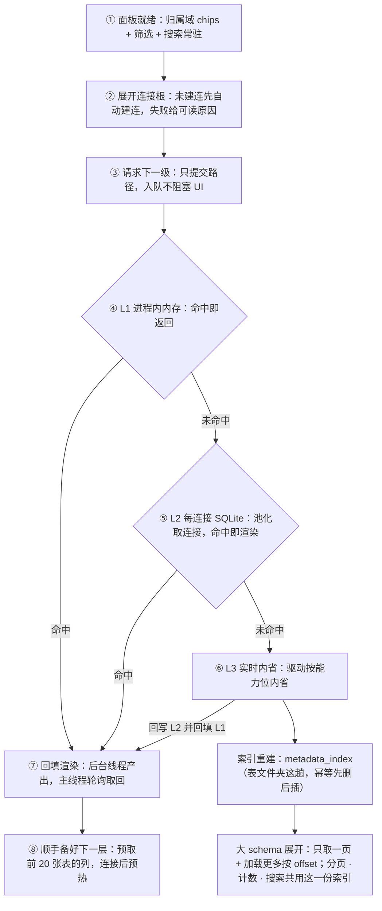

# RdataStation · 数据源管理 / 数据库导航 —— 一页看懂

> 左侧 Dock 里那个回答「有哪些数据源、它们里面有什么」的地方。
> **一实例一项目 · 三归属域 · 分组 = 结构 / 标签 = 检索 / 属性面板 = 事实。**
>
> 本页是**可贴版**（纯文本 + 表格 + mermaid，适合贴进 PR / wiki）；视觉版见
> [`database-navigator-showcase.html`](database-navigator-showcase.html)
> （自包含、明暗双主题、离线可开，首屏可在归属域 facet 间切换、可开关「显示标签 / 显示归属域」）。
> 两版章节一一对应；视觉版把面板线框放在首屏，本页把连接行解剖放在第 6 节。

---

## 一句话

**十几个库，一眼找到那一个——展开就自动连上，双击就看细节；十万张表也只先给你一页。**

它不是一个「连接列表」：组织（分组）、检索（标签 / 筛选 / 搜索）、事实（属性面板）各占一个位置，互不打架；
对象树逐级懒加载，元数据有**三级缓存**，展开连接时若未建连会**先自动建连**。
**只管理数据源与元数据**——不越界去做对话框、分析资产或别的模块本体。

### 它替你做到的事

| 你关心的 | 它给什么 |
| --- | --- |
| 一多就找不着 | **分组 = 结构**（可排序、多对多、主组全亮）+ **标签 = 检索**（多值、不进树）+ 归属域 facet + 搜索语法 `type:` / `scope:` / `tag:` / `driver:` |
| 十万张表怎么翻 | **索引分页**：超过 500 个对象的 schema，首屏只取一页（200 条）+「加载更多」按 `offset` 追加；大 schema 不进内存缓存 |
| 没展开到的地方能搜吗 | **跨连接名称搜索**：搜索框扫每个连接自己的元数据索引（中缀匹配，敲 `ord` 命中 `order_items`），结果区落在树顶，单击即看属性 |
| 展开会不会卡 | **render 期零 I/O**：加载 / 属性 / 预热 / 预取 / 搜索全在后台工作线程；失败带可读原因与重试 |
| 每次展开都要重开文件吗 | **不会**：L2 缓存按连接**池化复用**——「开文件 + PRAGMA + 迁移校验」每个缓存文件只付一次 |
| 缓存会不会被清掉 | **只增不删**：刷新只重建该范围，断开 / 刷新 / 删连接都不动缓存文件；唯一删除入口是显式「缓存管理…」 |
| 出错了看得出来吗 | 节点级失败带**可读原因** + 重试入口；未连接时不排加载、改显提示——**不静默吞错** |
| 会不会越界 | 只做数据源的**组织视图 + 对象树 + 属性面板**；连接对话框（M3）、SQL / Mock / 洞察本体、分析资产（M6）都不做 |

---

## 1. 为什么它不是一个「连接列表」

四处「看着有、其实是假」的底座，逐条换成了真东西。

| 旧样子（V1） | 现在 |
| --- | --- |
| 平铺一张连接表：没有分组、没有标签，库一多只能靠名字硬扫 | **分组 = 结构** + **标签 = 检索** + 归属域 facet + 搜索 facet 语法 |
| 「来源 / 作用域」被做成标签页分区，与行内标记重复表达同一件事 | 归属域回归**事实属性**：行内右对齐固定列 + 筛选；一级结构位让给用户自定义分组 |
| 展开对象树现查现拉，卡住界面；挂了只看到 `CONN_NOT_FOUND` | **展开即建连**；加载走后台线程 + 结果队列；失败带可读原因与重试入口 |
| 刷新即清、断开即删缓存文件 | **缓存只增不删**：唯一删除入口是显式「缓存管理…」（v1 教训换来的规则） |
| 「缓存」只有一层内存表，重启即空；大库一次性拉全 | **三级缓存 + 连接池 + 索引分页**：跨重启命中、每文件只付一次固定开销、十万表分块取数（本轮补齐，见 §7 / §8） |

---

## 2. 三条轴各归一地问

裁决「信息放哪」的三条边界规则。**一问一主**：三个问题各有且仅有一个承载位，任何信息不许同时占两位。

| 你问 | 谁回答 | 表达位 | 禁止 |
| --- | --- | --- | --- |
| 我的库放在哪 | **分组**（结构容器，多对多） | 树一级（唯一结构轴） | 不做自动分类 |
| 和什么相关的库 | **标签**（横切检索键，多值） | 筛选 + 搜索；行内可选显示 | 不进树、不排序 |
| 这一条记录存在哪 | **归属域**（`P` / `G` / `GP`） | 行内右对齐固定列 + 筛选 | 不参与组织 |
| 这是什么库 / 能不能用 | **类型**（形状）+ **状态**（颜色） | 同一个徽标的两个通道 | 不靠颜色表达类型、不常显全名 |
| 这一个的细节 | **属性面板**（事实唯一权威位） | 编辑区右侧停靠面板 | 导航行不重复这些细节 |

> **心智模型**：导航栏的职责 = **定位 + 连接 + 浏览**；配置归对话框，详情归属性面板。
> 结构靠分组，检索靠筛选，细节靠面板。**事实只读，组织可写。**

---

## 3. 四个高光

### HIGHLIGHT 1 · 一行只说三件事，且一个元素能说两件

常驻只有「徽标 + 名称 + 归属域列」，归属域**右对齐成列**，长名不会挤走它。
徽标本身是**双通道**：颜色 = 状态、形状 + 内叠 2 字母 = 类型。行尾 `+` 与 `✎` 只在 hover / 选中时出现。

`密度预算 ≤ 3` · `长名截断不挤压` · `连接 / 断开只走右键` · `hover 卡 300ms 补全事实`

### HIGHLIGHT 2 · 事实只读，组织可写

类型、驱动、归属域、地址、状态是**系统事实**，只做展示与筛选；分组与标签是**用户心智**，才是可写组织。
所以信息永不「同时占两位」：在哪 = 分组，符合什么条件 = 筛选，这一个的细节 = 属性面板。

`分组多对多 · 主组全亮` · `其余组以引用行出现，点击跳回` · `标签永不进树`

### HIGHLIGHT 3 · 展开不卡，而且记得住

树加载、属性、预热、预取、搜索全部进**单一后台工作线程 + 结果队列**；渲染期不做 I/O。
取数走 cache-aside 三级：L1 进程内 → L2 每连接 SQLite（**池化复用**）→ L3 实时内省；
L2 命中还会**回填 L1**，下一次展开就是内存命中。

`render 期零 I/O` · `L2 池化：每文件一次固定开销` · `命中回填 L1` · `失败可读原因 + 重试`

### HIGHLIGHT 4 · 十万表也只先给你一页

超过阈值（500 个对象）的 schema，展开时**只从元数据索引取一页**（200 条），
其余由「加载更多」按 `offset` 追加；这类大 schema **不进内存缓存**（省下的内存不请回来）。
搜索同理：跨连接扫索引，结果封顶，过期批次直接丢弃。

`阈值 500` · `首屏 200 条` · `加载更多按 offset` · `大 schema 不驻留内存` · `搜索单连接 50 / 总量 300`

---

## 4. 四个剧本 · 它替你做什么

### 剧本 A · 这条连接到底还能不能用 → 省下开对话框

1. **先看颜色**：徽标彩色 = 运行时可连，灰色 = 当前不可用；停一下看 hover 卡（类型 / 状态 / 驱动）。
   `徽标` `hover 卡`
2. **要确认就实测**：右键 → **测试连接**——独立会话探测，**不注册连接池、不写库**，结果落面板提示。
   `右键` `测试连接`
3. **真要用就展开**：展开连接根，未建连会先自动建连，再逐级加载。
   `▸ 展开` `自动建连`

### 剧本 B · 库太多，找不着东西 → 少翻树

1. **先收窄**：归属域 chips（全部 / 项目 / 全局 / 共享）一击收窄；行尾「筛选 ▾ N」叠加类型 / 驱动 / 标签。
   `归属域 chips` `筛选 ▾`
2. **再精确**：搜索框支持 facet 语法，与 chips 互补 —— `type:postgres` / `scope:global` / `tag:prod`。
   `type:` `scope:` `tag:`
3. **连没展开的也搜**：输入 ≥ 2 个字符，后台**跨连接搜元数据索引**；命中落在树顶「索引搜索」区，
   单击直接开属性面板——**不必先把树翻到那一层**。
   `索引搜索` `中缀匹配` `单击看属性`
4. **把常用固定下来**：拖连接行到**分组头**即归组；拖到「未分组」头 = 移出全部；分组头之间拖 = 调分组顺序。
   `拖到分组头` `Alt+↑↓`

### 剧本 C · 只想看一眼这张表长什么样 → 不动 SQL

1. **看事实**：双击任意对象或按 `Enter` / `F4`，右侧属性面板给出 DBeaver 式属性网格。
   `双击` `Enter / F4`
2. **看数据**：右键表 / 视图 → **查看数据**，注入 `SELECT * … LIMIT 200` 到 SQL 编辑器。
   `查看数据` `LIMIT 200`
3. **要写就生成**：右键 → **生成 SQL ▸**（INSERT / UPDATE / DELETE 模板）。列由后台任务取、命中 L2 不发查询，**只注入不执行**。
   `生成 SQL ▸` `不自动执行`

### 剧本 D · 把表结构拖进 SQL 里 → 不手抄

1. **抓住那一行**：展开到表 / 视图，按住拖动——载荷只带限定名与短名。
   `▦ 表` `拖拽`
2. **丢到 SQL 区**：落到 SQL 编辑区即插入限定名；落点都聚焦 SQL 区。
   `落到 SQL 区` `插入限定名`
3. **接着往下**：要造数据就右键 → **生成 Mock 数据**（仅表 / 视图）；要看分布就 **查看洞察**。
   `生成 Mock 数据` `查看洞察`

---

## 5. 一次展开的全流程



**三条纪律**

1. **render 期零 I/O**：加载一律入队 + 回填，渲染与点击回调里不 `block_on` 远程库。
2. **缓存只增不删**：清理只经显式「缓存管理」。
3. **类型差异只在服务层与驱动能力位**：节点模型与渲染层不为数据库类型分叉。

---

## 6. 连接行解剖

```
[徽标]  名称 …………………………………………  [GP]   [+]
  ↑      ↑                              ↑     ↑
色=状态  flex_1 + text_ellipsis      右对齐列  hover / 选中显（加标签）
形=类型（内叠 2 字母）
```

- **徽标颜色**：彩色 = 运行时可连；灰色 = 当前不可用。
- **徽标形状 + 2 字母**：数据库类型（`PG` / `MY` / `SQ` / `DK` …）。
- **名称**：`flex_1 + min_w_0 + text_ellipsis`，长名截断不挤压右侧。
- **归属域列**：`P` / `G` / `GP`，右对齐固定列，可在 `⋯` 关闭。
- **行尾操作**：`+` 加标签、`✎` 编辑，仅 hover / 选中时显。
- **标签**：默认不显示；开启后落在**名称下一行**（不挤占名称 / 归属域），最多 2 个小 chip + `+N`。

**面板头常驻五个动作**：`＋` 新建数据源 · `🗂＋` 新建分组 · `⟳` 刷新选中连接 · `断开` · `⋯`
（刷新全部元数据 / 缓存管理… / 显示标签 / 显示归属域）。

**分组头**：色条 + 名称 + **健康度（已连 / 总数）** + 计数 + 一键全折叠。

---

## 7. 三级缓存与取数管线（cache-aside）

**词表以 [`README.md`](README.md) §缓存 为准**：L1 / L2 是缓存，**L3 实时内省不是缓存**。

| 级 | 是什么 | 实现 | 设计时延 | 说明 |
| --- | --- | --- | --- | --- |
| **L1 内存** | 进程内 | `engine::cache::{MetadataCache, CacheManager}` | < 0.1ms | 命中即返回；L2 命中与实时内省都**回填** L1；`fresh`（刷新）跳过并清空该连接 |
| **L2 每连接 SQLite** | 跨重启 | `engine::persistence::metadata_cache` + `database::cache::NavCache` | < 5ms | 全局连接落系统目录、项目 / 共享连接落项目目录，**一连接一文件**；按连接**池化复用连接** |
| **L3 实时内省** | **不是缓存** | `database::MetadataService` → 驱动 `MetadataBrowser` | 10 ~ 500ms | 事实源；结果写回 L2 并回填 L1 |

**L2 里还有什么**：除规范化表（schema / 表 / 视图 / 列）外，还有一份**元数据索引** `metadata_index`
（粒度 schema / 表 / 视图 / 列，含行数估算），布局如下——索引是**分页、计数、搜索**三者共同的数据源：

```
L2 缓存文件（每连接一个 SQLite）
├── schemata / tables / view_definitions / columns …   规范化表：事实落点（池化读写）
├── metadata_index                                      索引：分页 / 计数 / 搜索
└── 冷启动内省一个 schema 后按该 schema 重建（幂等：先删后插）
```

**固定开销只付一次**：每个缓存文件建池时完成「开文件 + 5 条 PRAGMA + 一次迁移校验」，
之后取用零校验——这条以前是每次缓存访问都付，是 L2 命中也快不起来的隐藏成本。

**层级随数据库类型**（有没有独立 Schema 层由驱动能力位声明，渲染层不分叉）：

| 数据库 | 树的实际层级 | 备注 |
| --- | --- | --- |
| MySQL | `catalog → 表 / 视图 / 存储过程·函数 → 列` | 无独立 Schema 层 |
| PostgreSQL | `catalog（当前库） → schema → 表 / 视图 → 列` | 有独立 Schema 层 |
| SQLite | `main → 表 → 列` | 同 URL 多逻辑连接**共享同一物理连接**（别名） |
| DuckDB | `main → 表 → 列` | 同上；分析资产归 M6，不在本模块 |

---

## 8. 大库是怎么扛住的（十万张表）

设计意图来自真实场景：**大型数据库（如 Oracle）可能有 10 万+ 张表**。
下面每一行都是**已接线并有测试锚住**的能力；最后一栏是**还没做**的，一并写清。

| 机制 | 触发条件 | 行为 | 为什么这样做 |
| --- | --- | --- | --- |
| **索引分页** | 某类别对象数 > **500** | 只从 `metadata_index` 取一页（**200 条**）；「加载更多」按 `offset` 追加下一页 | 小 schema 走 L1 全量（命中是内存拷贝）更快；阈值以下行为不变 ⇒ 零回归 |
| **大 schema 不进 L1** | 同上 | L2 命中与实时内省两条路都不写进程内缓存 | 万级对象的列表常驻内存＝把省下的内存又请回来；这类 schema 下次展开本来就按索引分页 |
| **计数来自索引** | 展开 schema 节点 | 文件夹标题的数字（`表 (1234)`）取索引计数，**不再为写个数字全量物化** | 一次展开省下「拉全表清单只为数个数」；例程 / 序列 / 触发器不在索引里，仍走实时内省 |
| **内省级别自适应** | 按本 schema 对象数 | `IntrospectionLevel`（1000 / 3000 两档阈值）自动降级；级别低时**不为大 schema 预取列** | 对标 DataGrip：大库只拉名字，把列留到展开时取 |
| **刷新不吃索引** | 右键「刷新元数据」 | `fresh` 跳过 L1 / L2 / 索引，以实时内省为准；先删该 schema 旧行再重写 | 索引是刷新前的旧值；「先删后写」保证不残留已删对象 |
| **索引陈旧能自愈** | 翻到空块 | 把「总数」收敛到已加载数，收起「加载更多」 | 否则按钮会永远挂在树上、点了没反应 |
| **跨连接搜索** | 搜索框 ≥ 2 字符 | 后台扫每个连接自己的索引（名称档中缀匹配；内容档走 FTS，≥ 3 字）；单连接 50 条 / 总量 300 条封顶；渲染上限 100 条 | 交互操作不该被超大 schema 拖死；**没有缓存的连接不建文件**（不会敲个字就落一堆空缓存） |
| **搜索范围诚实** | 有未拉取余量时 | 命中行显示「筛选仅覆盖已加载」；结果区有命中时不再显示「没有匹配的数据源」 | 搜不到 ≠ 库里没有——差异必须说出口 |

**还没做（写清触发条件，不做「假装有」）**

| 缺什么 | 影响 | 什么时候必须做 |
| --- | --- | --- |
| ~~**搜索结果「在树中定位」**~~ | 搜到了能在属性面板看，也能一键展开并高亮到树上那一层 | ✅ **已接**（2026-09-19）：结果行的「定位」→ 展开 连接 → catalog → schema → 文件夹（列再多展开一层表）并选中；大 schema 按位次**直达那一页**，窗顶显示「已定位到第 N 条 · 点此回到开头」。余项：Quick Open 命中行（跳面板） |
| **虚拟列表** | 首屏只取 200 条已经够用，但「1 万条同屏」未验证 | 真实 10 万表库实测出现滚动卡顿时 |
| **源码（定义文本）搜索** | 内容档（FTS）只收名称 / 注释 / 数据类型，**定义文本不入索引** | 出现「我记得定义里有这个函数」的抱怨时 |
| **增量同步 / 身份指纹键** | 刷新是整 schema 重写；同一物理库多连接各自一份缓存 | 内省耗时或磁盘占用成为抱怨时 |

> 与 DBeaver / DataGrip 的逐维度对照、以及「哪些不该学」：见
> [`metadata-cache-vs-dbeaver-datagrip.md`](metadata-cache-vs-dbeaver-datagrip.md)。

---

## 9. 刷新 · 预热 · 预取

| 动作 | 粒度与行为 |
| --- | --- |
| **刷新** | `⟳` 刷新当前选中连接；`⋯ → 刷新全部元数据` 清掉已加载子节点后重载仍展开的连接根；节点右键刷新只重建该范围。**保留展开态**，重新渲染时按需再懒加载。清 L1 + 该 schema 的 L2 先删后写（索引一并重建） |
| **预热** | 连接成功后提交后台内省 catalogs / schemas 写入 L2；面板头显示「预热 n/m」，**可取消**；进度是原子量，主线程轮询重绘 |
| **邻接预取** | 表 / 视图文件夹首次展开后，后台预取**前 20 张表**的列；失败静默（预取是加成，不是前置条件）。大 schema 因内省级别降级而不预取 |
| **大 schema 兜底** | 超过 500 个对象的类别走**索引分页**：首屏 200 条 + 「加载更多」按 `offset` 追加；页间按 key 去重 |
| **缓存清理** | 唯一入口：`⋯ → 缓存管理…`。断开 / 刷新 / 删除连接都**不删**缓存（删除前会先释放连接池，Windows 句柄语义） |

---

## 10. 属性面板 · 事实的唯一权威位

- **怎么打开**：双击任意对象（连接 / 库 / schema / 表 / 视图 / 列 / 例程…），或 `Enter` / `F4`；
  索引搜索的命中行**单击**即可打开（还没展开到那层也行）。
- **长什么样**：DBeaver 对标，填充编辑区**右侧**一个面板位；分隔条可拖拽、**宽度记忆**。
- **为什么放这里**：行内已经排满三个事实位，细节不该再挤进树；配置类信息归对话框，事实类信息归面板——一问一主。
- **谁来用**：驱动名、完整类型、地址这些都在这；行内只用形状与颜色示意。

---

## 11. 键盘 · 右键 · 拖拽

| 按键 | 行为 | 备注 |
| --- | --- | --- |
| `Ctrl+F` | 聚焦导航搜索框 | 会自动切到本面板 |
| `↑` / `↓` | 移动**光标** | 在可见节点间 |
| `→` / `←` | 展开 / 折叠当前节点 | |
| `Enter` / `F4` | 打开当前节点的属性面板 | |
| `Alt+↑` / `Alt+↓` | 选中**连接**在所属容器内上移 / 下移一位 | 只对连接行生效 |
| `Esc` | 清空搜索 | 在搜索框内时 |

**拖拽**

| 抓住 | 落到 | 结果 |
| --- | --- | --- |
| 连接行 | 分组头 | 归组；拖到「未分组」头 = 移出全部分组 |
| 连接行 | 另一连接行 | 插到该行之前（组内外同理） |
| 分组头 | 分组头 | 调整分组顺序 |
| 表 / 视图 | SQL 编辑区 | 插入限定名并聚焦 |

> 每次落库都是「整容器一次性写 `0..n`」，保证序号完整、与屏上顺序一致。

**右键（三类）**

- **连接节点**：连接 / 断开 · 测试连接（独立会话 · 不写库）· 编辑连接… · 查看属性 ·
  移动到分组… · 设为主组 ▸ · 复制连接（模板）…（不含密码）· 共享至项目（仅 `G_`）/ 取消共享（仅 `GP_`）·
  删除连接（二次确认）· 复制名称 · 刷新元数据。
- **通用模块入口**（所有节点都有，位于菜单底部）：**在 SQL 编辑器中打开**（选中该连接 + 聚焦编辑区）· **查看洞察**（右 Dock 切到 Insight）。
- **表 / 视图专属**：查看数据（`SELECT * … LIMIT 200`）· 生成 SQL ▸ · 生成 Mock 数据 · 复制名称 / 限定名。
- **分组节点**：新建分组（表单：名称 + 描述）· 重命名（行内）· 编辑分组… · 上移 / 下移分组（边界置灰）·
  删除分组（**不删成员连接与缓存**）· 在此新建连接 · 折叠 · 折叠其他。「未分组」只给「新建分组」。

> **只注入不执行**：「查看数据」与「生成 SQL ▸」都只把 SQL 放进编辑区草稿；写语句更不该替用户跑。

---

## 12. 架构 · 视图自带，能力靠端口

```
依赖方向（硬约束：始终指向更小、更稳定的 crate）
  app ▸ Feature crates ▸ engine ▸ shared
  Feature ▸ gpui-kit（UI 基础设施）
  Feature ▸ workbench_shell（视图共用资产：尺寸常量 / 面板枚举 / 产品语义 token）
  任何 crate ▸ paths（运行时数据路径唯一解析点）

数据链路
  浏览对象：NavView → nav_jobs（工作线程）→ NavigatorService → MetadataService → 驱动 MetadataBrowser → 目标库
  缓存与索引：NavigatorService → NavCache → MetadataCacheOps（池化连接）→ 每连接 SQLite
  分页 / 计数 / 搜索：NavigatorService → metadata_index（同一份索引，三个消费方）
  组织数据：NavView → nav_store → ConnectionOrgStore → project.db / global.db（分组含 is_primary + 标签，独立表、按域分区）
  视图状态：navigator_state（展开 / 选中 / 过滤，按域分区；跨重启保留，运行时连接不保留）
  徽标来源：engine::persistence::driver_catalog → drivers 表（一次性加载；渲染期零 I/O）
  无中间层：进程内直连驱动，无 HTTP / 无 IPC
```

**本模块代码地图（视图在 `crates/database` 内自带）**

| 文件 | 职责 |
| --- | --- |
| `nav_view.rs` | **NavView** 实体：面板头 / 分组树 / 连接行 / 对象树 / 右键 / 拖拽 / 行内编辑 / 搜索结果区 |
| `nav_host.rs` | **NavHost** 端口（宿主实现）：连接清单与选中 · 项目根 · 提示与重绘 · 视图偏好 · 连接生命周期 · 需要窗口的对话框 |
| `nav_jobs.rs` | 后台任务：加载 / 分页 / 搜索 / 预热 / 预取 / 生成 SQL / 测试连接（单工作线程 + 结果队列 + 原子进度） |
| `navigator_service.rs` | 层级与懒加载编排：cache-aside、索引分页、索引计数、内省级别登记 |
| `cache.rs` | 导航侧 L2 读写门面：schema / 表 / 视图 / 列 + 索引分块读 + 计数器 + 索引搜索 |
| `metadata_service.rs` / `model.rs` / `property_panel.rs` / `commands.rs` | 内省调用 / 节点模型 / 属性面板投影 / 面板键盘动作 |

> **为什么单独说这件事**：面板视图以前住在工作台里，要穿过共享状态与一堆工作台服务。
> 视图下沉后，它**只认一个自己定义的 trait**（`NavHost`）；落库、驱动目录、对象树元数据这些「只依引擎」的能力不进端口，直接调。
> 于是依赖单向、面板可独立演进与测试，工作台侧只剩「持有实体 + 转发渲染」。

---

## 13. 质量与证据

| 维度 | 做法 |
| --- | --- |
| **契约测试兜底** | 结构尺寸必须等于设计值（常量单一来源 `workbench_shell::ui`）；视图源码**零裸色值、零裸 px**；共享状态字段白名单 |
| **纯函数优先** | 可测判定都拍成纯函数：搜索 facet 解析 / 类型徽标映射 / 限定名拼接 / 节点子键 / 归属域推导 / 分页追加去重 / 命中→属性定位 |
| **反证法锚住缓存与索引** | 给**空连接管理器**（任何实时内省必然失败）→「返回 Ok」即证明这一页/这一搜来自缓存；给分页与「大 schema 不进 L1」都加了这类断言 |
| **回归有「牙」** | 修门禁时先临时撤掉它，确认对应测试**变红**再恢复——避免「测试写了但测不到」 |
| **真机回归** | 四类数据库 × 项目 / 全局 / 共享，按**树的实际层级**逐条核对；每轮真实端点跑出的问题 → 结论 → 文档与测试同步 |

```
引擎侧单测    cargo test -p rds-engine --lib      → 443 passed / 0 failed（24 ignored）
导航侧单测    cargo test -p rds-database --lib    →  54 passed / 0 failed
契约检查      cargo check -p rds-engine -p rds-database --lib（零警告）
```

```
MySQL       mall_business → 表 (7) / 存储过程·函数 (4) → order → 16 列
PostgreSQL  postgres → public → 表 (12) / 视图 (1) → inventory_ledger → 7 列
SQLite      main → 表 (25) → attachment → 8 列
DuckDB      main → 表 (8) → cities → 列
```

> 验收清单见 [`database-navigator-user-guide.md`](database-navigator-user-guide.md) §9。

---

## 14. 边界 · 这些事它不做

| 做 | 不做 |
| --- | --- |
| 数据源的**组织视图**（归属域 / 分组 / 标签 / 筛选 / 搜索） | 连接**新建 / 编辑对话框本体** → M3 连接模块（本面板只给入口） |
| 对象树**懒加载 + 三级缓存 + 索引分页**、刷新、预热、预取 | SQL 编辑器 / Mock / 洞察的**本体** → 各自模块（本面板只给右键入口） |
| 连接 / 断开、缓存管理、**属性面板** | DuckDB **分析表与分析资产** → M6 资产库 |
| 常驻的模块入口（在 SQL 编辑器中打开 · 查看洞察 · 生成 Mock 数据） | 分析资产联邦开关等 M6/M7 领域开关（仅作展示） |
| 导航面板内的**名称搜索**（够用版） | **搜索 / 命令的完整交互**：已拍板**另立一个 crate**（类 VS Code 的 Quick Open / 命令面板），导航视图不再加搜索特性 |

---

## 15. 文档地图

| 文档 | 什么时候读它 |
| --- | --- |
| [`README.md`](README.md) | 模块入口：特点 / 边界 / 硬约束 / 代码地图（本页是它的宣传版） |
| [`database-navigator-architecture.md`](database-navigator-architecture.md) | **为什么这样设计 / 怎么运转**：心智模型、分层与 render 零 I/O、五条数据流、降级容错、已知问题（权威） |
| [`metadata-cache-vs-dbeaver-datagrip.md`](metadata-cache-vs-dbeaver-datagrip.md) | **缓存为什么这样设计**：与 DBeaver / DataGrip 的逐维度对照、三条硬约束、分页与搜索的落地记录、仍缺项的触发条件 |
| [`database-navigator-prototype-design.md`](database-navigator-prototype-design.md) | **长什么样**：面板布局、连接行解剖、双通道徽标、树模型、三级管线、右键菜单、主题映射 |
| [`database-navigator-prototype.html`](database-navigator-prototype.html) | 可点击的明暗双主题原型 |
| [`database-navigator-user-guide.md`](database-navigator-user-guide.md) | **怎么用**：界面导览、典型流程、快捷键、显示开关、FAQ、验收清单 |
| [`database-nav-dev-plan.md`](database-nav-dev-plan.md) | **做到哪了**：任务逐项状态、逐轮实现记录与踩坑、迁移与表、测试场景 |
| [`../core-design-current.md`](../core-design-current.md) | 全局视角的**现状版**：三层缓存词表澄清、逐模块接通状态 |
| [`../connection/README.md`](../connection/README.md) | 上游：连接的新建 / 编辑与作用域路由（M3） |

---

*本页是**宣传向速览**，章节与视觉版 [`database-navigator-showcase.html`](database-navigator-showcase.html) 一一对应。
权威口径以架构文档与原型设计为准；缓存与索引的行为细节以 [`metadata-cache-vs-dbeaver-datagrip.md`](metadata-cache-vs-dbeaver-datagrip.md) 与代码注释为准。*
