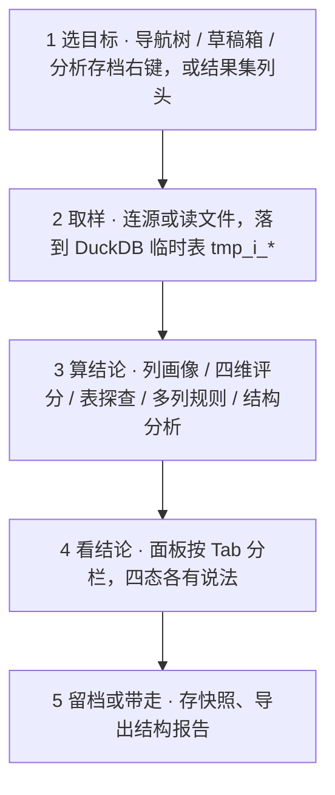
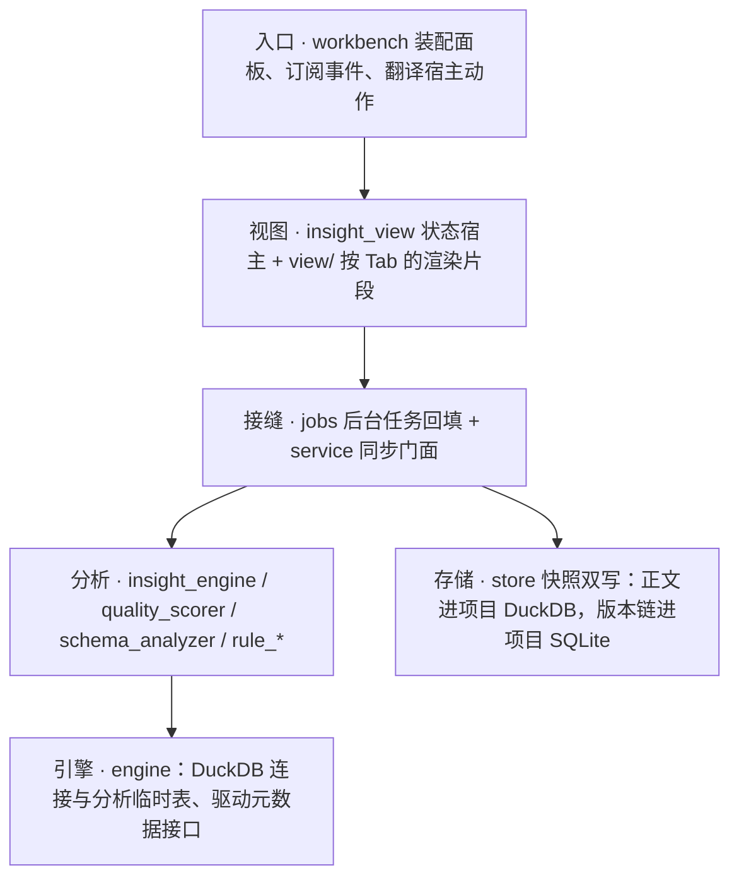

# 洞察（M8）· 一页看懂

> **一句话版本**：「洞察」给库表与文件一句能落地的结论——五 Tab 看完画像与结构健康，四维评分说清为什么，快照对比看变化；规则写 TOML 即可扩展，报告能导出带走。
>
> 本页是**宣传 / 分享稿**（快照日期 2026-09-18），数字与口径以模块文档为准（见文末文档地图）；视觉版孪生：`insight-showcase.html`（自包含、明暗双主题、离线可开）。

---

## 关键数字

| 数字 | 含义 |
| --- | --- |
| **5 个 Tab** | 列 · 表 · 多列 · 结构 · 历史——一屏看完一列、一张表、一次跨列分析、一个库的结构健康 |
| **16 条内置规则** | 列级 9 · 多列 4 · 表级 3；**加一个 TOML 就多一种洞察**，用户可按全局 / 项目级扩展 |
| **4 维评分** | 完整性 · 唯一性 · 类型一致 · 分布均匀；五档等级，列级与表级同一套阈值 |
| **4 类数据来源** | 导航树（含结构洞察）· 草稿箱 · 分析存档 · 编辑器结果集 |

---

## 它回答三个问题

| 你的问题 | 它给你的结论 |
| --- | --- |
| 这列能不能用？空值多不多、有没有异常值？ | **列画像四区**（基础统计 / 数据分布 / 数据质量 / 样本数据）+ **四维评分卡** |
| 这张表值不值得信？哪几列有问题？ | **表探查**：列清单（主键 / 类型 / 可空 / 质量分）+「评估全表」逐列串行出分 |
| 整个库结构有没有坑？ | **结构报告**：健康分 + 四区结论（外键候选 / 类型不一致 / 孤立表 / 冗余列） |
| 上个月和现在比，变好了还是变差了？ | **快照历史**：存一版、再存一版，固定方向对比（选中 → 最新） |

> 纪律：**没有数据就不摆数字**——不产假分数、不画假分布、不编造历史。

---

## 五个 Tab

| Tab | 给你什么 | 一条口径 |
| --- | --- | --- |
| **列** | 四区画像 + 评分卡（四维 × 五档） | NULL 显式呈现；分布画不出就说原因 |
| **表** | 列清单 + 评估全表（进度一列列回填）+ 表级质量 | 逐列串行，避免撞后端并发上限；点列名下钻到该列 |
| **多列** | 列多选（顺序即参数顺序）+ 规则单选 + 结果与门控提示 | 结果与失败提示同屏，表单不丢 |
| **结构** | 健康分 + 四区 + 表名下钻 + 导出 JSON / Markdown | 空区照常渲染：空 = 检查过、没问题 |
| **历史** | 快照保存 · 版本链 · 对比面板 · 清理 · 存储用量 | 清理按 30 天保留期，正文与版本链成对删 |

面板骨架（右 Dock 17.5rem 起步）：面板头（洞察 · ⚙ 规则管理 · ⟳ 重算）→ 目标头（目标名 + 类型徽标 + 空值率 / 行数）→ Tab 条 → 内容区；**评分卡钉在滚动区之外**（它是这一列的头号结论，不该滚走）。

---

## 一次洞察的旅程



- **入口只发意图**：点一下只改面板状态并发事件，取数在接缝（`jobs` / `service`）里做——渲染路径零 I/O。
- **编辑器入口不物化**：不建临时表，直接重跑一次 LIMIT 取样。

---

## 架构：谁负责什么



依赖只向下：`insight → engine → shared`；洞察不依赖任何业务 Feature crate，工作台只做装配。

| 关注点 | 落点 |
| --- | --- |
| 状态宿主（目标 / 五态 / 各 Tab 载荷 / 选择与折叠） | `crates/insight/src/insight_view.rs` |
| 渲染片段（按 Tab 分七个文件） | `crates/insight/src/view/` |
| 规则管理对话框 / 结构报告视图 | `crates/insight/src/{rule_view,schema_view}.rs` |
| 后台取数与回填 | `crates/insight/src/jobs.rs`、`service/` |
| 快照存储（双写成对回滚） | `crates/insight/src/store/` |
| 分析临时表生命周期 / 内存闸 | `crates/engine/src/duckdb/{analysis,temp_table}.rs` |

---

## 八个值得说的特点

1. **规则即文件**——三层作用域：内置（编译期内嵌 16 条）→ 全局 → 项目，后者覆盖前者；正文以文件为唯一真相源，进 git、可 diff、目录一改即热加载。
2. **结论可解释**——四维评分 × 五档等级，列级与表级共用同一套阈值与文案；全空列不产分（没有依据就不给分）。
3. **类型不靠猜**——类型族来自真实元数据（驱动接口），结构洞察零方言 SQL，换成 SQLite 也照样能用。
4. **不搬数据**——取样在 DuckDB 上做，中间临时表带 `tmp_i_` 前缀、用完即删；内存闸 2 GB、溢写进 `<RDS_HOME>/tmp`。
5. **快照可追溯**——一列一条版本链，方向固定「选中 → 最新」；30 天保留期清理，正文与版本链成对删，两侧条数对不上就转红。
6. **边界诚实**——能洞察的是「能出现在数据库导航树上的对象」（真驱动 + 活连接）与草稿箱 / 分析存档两块文件；只靠 `ATTACH` 或三方扩展到达的远程库不在承诺范围内。
7. **安全两道门**——规则 SQL 先过解析期静态门（只放行单条 `SELECT` / `WITH`，拒 DDL、多语句、文件与远端表函数）；项目规则再过信任门，未决定前不装配、不执行。如实声明：静态门是防呆，不是沙箱。
8. **结论可带走**——结构报告导出 JSON / Markdown（导出的是屏幕上这份结论）；报告里的表名可点，一键下钻回表探查。

---

## 加一条规则 = 新增一种洞察

不用改 Rust：写一个 `*.rule.toml`，声明 SQL 模板、输出映射与质量门控即可（下面是内置的「空值率检查」，节选）。

```toml
# {项目}/.RSmeta/insight-rules/column/null-check.rule.toml
[meta]
id = "null-check"
name = "空值率检查"
category = "column"
applies_to = ["Any"]            # 任意类型都能跑

[query]
template = """
SELECT COUNT(*) AS total,
       COUNT("{col}") AS non_null,
       ROUND((COUNT(*) - COUNT("{col}")) * 1.0 / NULLIF(COUNT(*), 0), 4) AS null_rate
FROM "{table}"
"""
parameters = ["table", "col"]

[[output]]                      # SQL 列 → 界面字段 + 值类型（解析期校验）
sql_name = "null_rate"
json_name = "null_rate"
value_type = "f64?"             # 空表时 NULL：没有空值率可言

[[quality]]                     # 质量门控：读的就是上面的输出字段
field = "null_rate"
max = 0.1
severity = "warning"
message = "空值率超过 10%"
```

三件事各说清一句话：**模板**是纯 SQL（只认参数占位）· **输出映射**声明名字与值类型（写错当场报错并列出可用取值）· **质量门控**字段必须真实存在（空值算「算不出来」，不算通过）。

---

## 从哪儿进，能洞察什么

| 入口 | 目标 | 取样口径 | 状态 |
| --- | --- | --- | --- |
| 导航树右键「查看统计」 | 库 / 表 / 列 | 连接 → DuckDB 临时表（源取样通道） | 已接 |
| 导航树右键「结构洞察」 | 库（schema） | 驱动元数据接口（零方言 SQL） | 已接 |
| 草稿箱行菜单 | 数据文件 | CSV / Parquet / Excel / JSON 直接读 | 已接 |
| 分析存档行菜单 | 已归档资源 | 经源取样通道（与导航树同口径） | 已接 |
| 编辑器结果集列头「洞察此列」 | 结果集的某一列 | 不物化：重跑 LIMIT 取样，跟随活动连接 | 已接 |
| 结构报告「导出 ▾」 | 当前报告 | JSON / Markdown，宿主选路径写文件 | 已接 |
| 分析表型存档（M6 本体层） | 分析产出的表 | DuckDB 直接读本体文件 | 等 M6 P4.1 |

---

## 质量与验证

| 项 | 数值（2026-09-18 实测） |
| --- | --- |
| 洞察模块单测 | **227** |
| 端到端集成（列画像，含与 DuckDB `SUMMARIZE` 交叉校验） | **14** |
| 界面契约（尺寸 / 颜色 / 面板登记） | **7** |
| 全仓 `cargo check --workspace --all-targets` | 零告警 |
| 真机结构洞察 | MySQL 47 表 / 318 列 · PostgreSQL 25 / 144 · SQLite 27 / 125 · DuckDB 10 / 27 |
| 真机源取样 | 四库 + 扩展源（Oracle 经扫描器）的机制回归 |

界面契约：尺寸只走 `ui.rs` 常量（视图不出现裸 `px()`）、颜色只走主题 token（代码零裸 hex），明暗双主题对比度 ≥ 4.5:1。

---

## 正在路上

- **表级 / Schema 快照对比**：语义属资产管理，界面与资产模型归 M6；差异计算与存储继续用洞察这一套。
- **分析表型存档洞察**：等 M6 Phase 4 本体层；存储口径倾向不复制（存配方 + 指纹），洞察直接读本体文件。
- **静态门升级为解析级**：从关键字黑名单升级为用引擎解析能力做策略检查。
- **多列 Tab 预取样**：源目标下样本表未就绪时，点「多列」自己先取一次样。

---

## 文档地图

| 文档 | 什么时候读 |
| --- | --- |
| `README.md` | 模块入口：一句话定位 · 边界 · 代码地图 · 硬约束 · 文档地图 |
| `insight-architecture.md` | 为什么这样设计：不变式 · 分层与归属 · 状态所有权 · 数据流 · **D1–D62 决策表** · 已知问题 K1–K19 |
| `insight-dev-plan.md` | 做什么、做到哪：§0 进度记录 · Phase 0–5 任务 · 测试场景 · **§10 收口清单（权威）** |
| `insight-user-guide.md` | 怎么用：入口 · 界面导览 · 典型流程 · **§4 规则编写指南** · FAQ |
| `insight-prototype-design.md` / `insight-prototype.html` | 长什么样、怎么交互（含与 v1 的逐项对照） |
| `insight-extension-notes.md` | 实现手段与第三方扩展调研（含可采取之处 10 条） |
| `insight-showcase.html` | 本页的**视觉版**（自包含、明暗双主题、离线可开） |

> 宣传稿的铁律：**数字只为表达服务，口径以模块文档为准**。改了实现请顺手核对本页的关键数字（5 / 16 / 4 / 4 与测试基线）。
