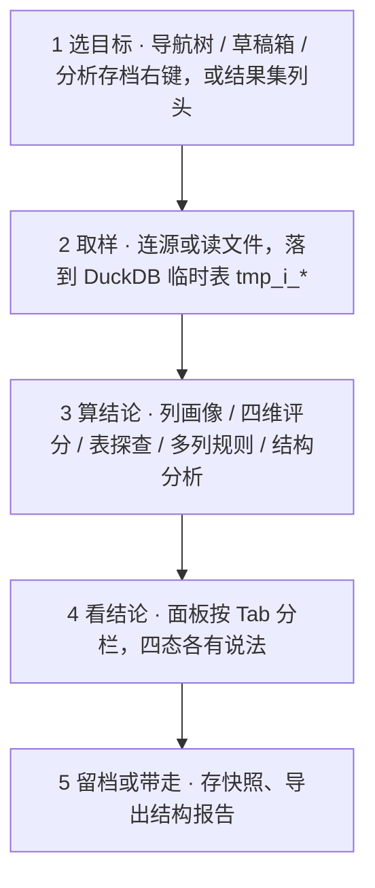
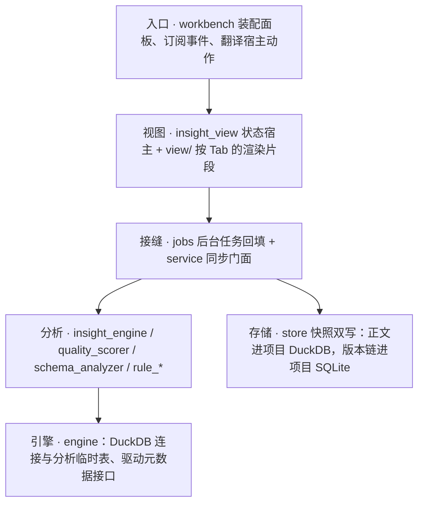

# RdataStation · 洞察（M8）—— 一页看懂

> 右 Dock 里那个**把数据变成结论**的地方：点一下表或某一列，画像、评分、结构健康就在右边。
> **五个 Tab · 16 条规则 · 四维评分 · 一条五步的闭环。**
>
> 本页是**可贴版**（纯文本 + 流程图，适合贴进 PR / wiki）；视觉版见 [`insight-showcase.html`](insight-showcase.html)（自包含、明暗双主题、离线可开，首屏的洞察面板可在五个 Tab 间点着看）。
> 两版的章节一一对应：视觉版把「五个 Tab」的示意放在首屏面板线框里，本页把它排在第 2 节。

---

## 一句话

**右键一张表——画像、评分、结构健康就在右边；存一版，下次就知道数据变了什么。**

它不是一个「看一眼数据」的侧边栏：取样、算分、出报告、留档、对比，是一条完整的闭环。
**每个数字都说得出出处——说不出的就不摆。**

### 它替你做到的事

| 你关心的 | 它给什么 |
| --- | --- |
| 这列能不能用 | **四区画像**（基础统计 / 数据分布 / 数据质量 / 样本数据）+ **四维评分卡**（完整性 · 唯一性 · 类型一致 · 分布均匀，五档等级） |
| 这张表哪几列有问题 | **表探查**：列清单（主键 / 类型 / 可空 / 质量分）+「评估全表」逐列串行出分，进度一列列回填 |
| 这个库结构有没有坑 | **结构报告**：健康分 + 四区结论（外键候选 / 类型不一致 / 孤立表 / 冗余列）+ 表名下钻 + 导出 JSON / Markdown |
| 数字可信吗 | 类型族来自**真实元数据**（驱动接口，不靠名字猜）；全空列**不产分**；分布画不出就说明原因；列画像另有与 DuckDB `SUMMARIZE` 的交叉校验（测试级） |
| 会不会把机器吃光 | DuckDB 连接上有**内存闸 2 GB**、溢写进 `<RDS_HOME>/tmp`；分析临时表带 `tmp_i_` 前缀、**用完即删** |
| 我加的规则安全吗 | 规则 SQL 先过**解析期静态门**；项目规则再有**信任门**（未决定不装配、不执行）；如实声明：不是沙箱 |
| 结论能带走吗 | **快照**（正文进项目 DuckDB、版本链进项目 SQLite）+ 结构报告导出 JSON / Markdown |

> 数字口径以模块文档为准；工程数字（测试数量、真机清单）见第 14 节。

---

## 1. 为什么它不是一个「统计面板」

V1 留下七处「看着有、实际是假」的地方，这一版逐条换成了真东西：

| 旧样子（V1） | 现在 |
| --- | --- |
| 底部四个 Tab 容器，多个面板**压根没挂载** | 右 Dock **五 Tab** + 一个目标模型（列 / 表 / 多列 / 结构 / 历史），每个 Tab 都取得到数 |
| 质量评分卡组件在、**数据恒空** | 四维评分真算：列级与表级共用同一套阈值；**全空列不产分** |
| 历史能看、**没有保存入口** | 保存入口就在历史 Tab 顶部（无项目置灰并写明原因）；双写成对，失败**回滚已写的那一半** |
| 多列分析**从未跑通** | 重新设计并实装：列序即参数序 + 类型族过滤 + 结果与门控提示同屏 |
| 存储用量是**前端估算** | 后端真实统计；拿不到就**整行不显示**（不编一个 0） |
| 导出 / 规则热加载 / 适用规则标签都没有入口 | 结构报告导出 JSON / Markdown；规则走**目录监听热加载**（⚙ 对话框里启停与新建） |
| `filterByValue`（按值筛选）语义错误 | 删除——洞察只做「结论」，交互式筛选属编辑器（M5） |

---

## 2. 五个 Tab · 一个目标模型

同一套目标、同一套四态（空 / 加载 / 错误 / 数据）；Tab 只决定「看哪一份载荷」，**载荷按 Tab 分开存**——切回来还是上次那份结果。

| Tab | 看什么 | 给什么结论 | 状态 |
| --- | --- | --- | --- |
| **列** | 一列的取值与分布 | 四区画像 + 四维评分卡（钉在滚动区之外） | 已实装 |
| **表** | 一张表的列与质量 | 列清单（主键 / 类型 / 可空 / 质量）+ 评估进度 + 表级质量 | 已实装 |
| **多列** | 两列以上的关系 | 按规则算出的结果 + 质量门控提示 | 已实装 |
| **结构** | 一个 schema 的形状 | 健康分 + 四区结论 + 可下钻的表名 | 已实装 |
| **历史** | 一列的快照链 | 版本列表 + 对比面板 + 清理 + 存储用量 | 已实装 |

> **诚实标注**：表级 / Schema 快照与「快照对比」属**二期**（那是资产管理的语义，界面与资产模型归 M6）；分析表型存档等 M6 Phase 4 的本体层。
> 没做的就不摆按钮——这套界面里没有「点了没反应」的入口。

---

## 3. 三个高光

如果只记三件事：

**① 每个数字都说得出出处。**
四维评分算总分、总分定等级，同一套阈值列级与表级共用；类型族来自真实元数据；样本口径常驻写明
（「行数与质量分基于全量统计；样本值为前 5 行，直方图至少 10 行」）。
该没有的数字就真的没有：全空列不给分、分布画不出说明原因、历史读不到就不显示用量。

**② 边界诚实，说不做的就真不做。**
能洞察的只有**能出现在数据库导航树上的对象**（真驱动 + 活连接）与**草稿箱 / 分析存档两块文件**；
只能靠 `ATTACH` 或三方扩展到达的远程库不在承诺范围内。
每一句「做不到」都带着原因：无项目时规则管理与快照置灰并写明、历史 Tab 在无项目时说「打开项目后可保存与查看快照」。

**③ 规则即文件，扩展不用改 Rust。**
16 条内置规则（列 9 · 多列 4 · 表 3）+ 三层作用域（内置 → 全局 → 项目）+ 目录监听热加载；
写一个 `*.rule.toml` 就多一种洞察（第 11 节有完整示例）。
两道安全门：规则 SQL 过解析期静态门，项目规则过信任门。

---

## 4. 四个剧本 · 它替你做什么

每一步都用现有按钮，能照着做。

### 剧本 A · 拿到一张没见过的表 → 先摸清它

| 步 | 动作 | 怎么做 |
| --- | --- | --- |
| 1 | 一眼看完这张表 | 导航树表节点右键 **查看统计** → 「表」Tab：列清单（序号 / 列名（PK）/ 类型 / 可空 / 质量分） |
| 2 | 让全部列都出分 | 点 **评估全表**：逐列串行，进度行写「正在评估 7/23 列…」，已算出的分数不会被清空 |
| 3 | 挑一列细看 | 点列名即下钻 → 「列」Tab：四区 + 评分卡（焦点列、类型徽标、空值率都在目标头） |

### 剧本 B · 想知道两列的关系 → 多列分析

| 步 | 动作 | 怎么做 |
| --- | --- | --- |
| 1 | 按顺序勾列 | 切「多列」Tab：勾选列**带序号**——顺序就是参数顺序（`col1` / `col2`），方向性规则不对称，所以序号必须露出来 |
| 2 | 选规则 | 规则按**类型族**自动判可用性：不相容的规则行会被置灰 |
| 3 | 执行 | 点 **执行分析**：结果与质量门控提示同屏（失败只挂一条提示，表单与已有结果都还在） |

### 剧本 C · 接手一个不熟的库 → 结构洞察

| 步 | 动作 | 怎么做 |
| --- | --- | --- |
| 1 | 从库上取报告 | 导航树库 / schema 节点右键 **结构洞察** → 「结构」Tab（取数走驱动元数据，零方言 SQL，SQLite 也支持） |
| 2 | 看结论 | 健康条（分数 + 等级 + 规模 + 需关注项数）+ 四个折叠区：外键候选 / 类型不一致 / 孤立表 / 冗余列；**空区照常渲染**——空 = 检查过、没问题 |
| 3 | 顺着表名往下看 | 报告里的表名最多摆 4 个热点，点一下切到该表的表探查 |
| 4 | 交给同事 | **导出 ▾** → JSON / Markdown（导出的是你屏幕上这份结论），宿主只负责选路径写文件 |

### 剧本 D · 数据变了要交差 → 快照与对比

| 步 | 动作 | 怎么做 |
| --- | --- | --- |
| 1 | 留一版 | 「历史」Tab → **保存**（快照落项目目录：无项目时按钮置灰并写明原因） |
| 2 | 数据更新后再留一版 | 回「列」Tab 点 ⟳ 重算看新结论，再回「历史」保存 |
| 3 | 看变在哪 | 点更早的一版 → 对比面板：方向固定**「选中 → 最新」**，逐字段 `旧 → 新` + 差值（方向用中性色，不预设好坏） |
| 4 | 到期清理 | **清理** → 确认框（写清删几天前、不可撤销）→ 回执；正文与版本链**成对删**，两侧条数对不上就转红 |

---

## 5. 一次洞察的旅程



- **入口只发意图**：点一下只改面板状态并发事件，取数在接缝（`jobs` / `service`）里做——渲染路径零 I/O。
- **编辑器入口不物化**：结果集做洞察时不建临时表，直接重跑一次 LIMIT 取样（所以也不存在「结果集临时表」要回收）。
- **取样口径**：源库连接经引擎打型；文件类数据源的读取器与工作台共用一套（CSV / Parquet / Excel / JSON）。

---

## 6. 列画像 · 四区与评分卡

| 区 | 内容 | 一条口径 |
| --- | --- | --- |
| 基础统计 | 总行数 / 非空 / 去重 / 极值等 | 行数与质量分基于**全量统计** |
| 数据分布 | 数值直方图 / 布尔占比 | 样本不足或类型未识别时**说明原因**，不造假分布 |
| 数据质量 | 提示列表（Info / Warning 两档） | 只有未过的门控项才被点出来；没有问题就说「未发现需要提示的质量问题」 |
| 样本数据 | 前 5 行，`NULL` 显式呈现 | 超长值按 200 字符截断（不撑破 17.5rem 的面板） |

**评分卡**钉在滚动区之外（分数是这一列的头号结论，不该滚走）：总分 + 五档等级 + 四维细条——
每根细条按**该维自己的等级**取色，短板一眼可见。

---

## 7. 表探查 · 列清单与评估全表

- 列清单：`#` / 列名（主键角标）/ 类型 / 可空 / 质量分；点列名即下钻到该列。
- 「评估全表」**逐列串行**（避免撞后端并发上限），按钮在评估中置灰并显示进度条与「正在评估 N/M 列…」。
- 重算**不清空**已算出的列分数（清空会让面板闪一下空白）。
- 表级质量卡：总分 + 等级 + 「N 列需关注 / 无问题列」+ 一句摘要。

---

## 8. 多列分析 · 列序就是参数序

- 勾选顺序 = 参数顺序（`col1` / `col2` …）；取消勾选直接从序列里移除。
- 规则可用性按**类型族**判定，不可用的规则行置灰（原因在规则行的类型提示里）。
- 结果为单值 KV 或表格；**质量门控提示只在未过时出现**。
- 失败只挂一条行内提示：表单与已有结果照旧可见（整页转错误态会让人以为表单坏了）。

---

## 9. 结构报告 · 四区与下钻

- 健康条：分数 + 等级 + 「N 表 · M 列 · 需关注 K 项」+ 摘要；右上就是**导出 ▾**。
- 四个折叠区**都渲染**（哪怕为空）：空区的意义是「检查过、没问题」。
- 表名下钻热点最多 4 个（长清单会把面板变成一条链接列表）。
- 取数只走驱动元数据接口：**没有方言分支、没有手写 SQL**——方言差异留在驱动层，所以 SQLite 也照样能用。

---

## 10. 快照与对比 · 变化看得见

- **保存**：正文进项目 DuckDB，版本链与元数据进项目 SQLite；双写失败**回滚已写入的那一半**，错误文案写清「已回滚」。
- **列表顺序**只由存储层的 `ORDER BY` 决定（渲染不再排序）；链被清理剪过的头部如实标「更早的版本已清理」，不谎称首版。
- **对比**方向固定「选中 → 最新」：最新一版不可点（没有更新的版本可比）；差值标方向、不评好坏。
- **清理**按 30 天保留期，正文与版本链成对删；回执里两侧条数对不上时转红——那是半写的信号。
- **存储用量**拿不到就整行不显示（编一个 0 会让人以为历史被清了）。

---

## 11. 规则 · 加一个 TOML 就多一种洞察

**三层作用域**（后者覆盖前者）· **16 条内置**（列 9 · 多列 4 · 表 3）· **正文以文件为唯一真相源**（进 git、可 diff、目录一改即热加载）：

```text
内置（编译期内嵌）→ {系统数据目录}/insight-rules/ → {项目}/.RSmeta/insight-rules/
```

一条规则写三段（下面是内置的「空值率检查」，节选）：

```toml
[meta]
id = "null-check"
name = "空值率检查"
category = "column"
applies_to = ["Any"]            # 任意类型都能跑

[query]
template = """
SELECT COUNT(*) AS total,
       COUNT("{col}") AS non_null,
       ROUND((COUNT(*) - COUNT("{col}")) * 1.0 / NULLIF(COUNT(*), 0), 4) AS null_rate
FROM "{table}"
"""
parameters = ["table", "col"]

[[output]]                      # SQL 列 → 界面字段 + 值类型（解析期校验）
sql_name = "null_rate"
json_name = "null_rate"
value_type = "f64?"             # 空表时 NULL：没有空值率可言

[[quality]]                     # 质量门控：读的就是上面的输出字段
field = "null_rate"
max = 0.1
severity = "warning"
message = "空值率超过 10%"
```

**校验早失败**（都在解析期，报错文案直接告诉你改哪儿）：
输出字段的 `value_type` 在白名单里 · 门控字段必须真实存在（报错会列出该规则已有的输出字段）· 一条规则被拒就是整条不加载，不会「部分生效」。

**两道安全门**：

| 门 | 挡什么 | 定位 |
| --- | --- | --- |
| 解析期静态门 | 只放行单条 `SELECT` / `WITH`；拒分号多语句、DDL 与 `ATTACH` / `COPY` 等、`read_*` 等表函数（校验前先剥字符串与注释） | **防呆**，不是安全边界——DuckDB 没有官方解析沙箱 |
| 项目规则信任门 | 项目层规则在用户做出决定前**不装配、不执行**；决定记在**全局库**（项目碰不到的地方） | 真正的边界：克隆不信任的仓库 + 打开项目是一个真实攻击面。无记录 / 查库失败一律按未决定（fail closed） |

---

## 12. 从哪儿进，能洞察什么

| 入口 | 目标 | 取样口径 | 状态 |
| --- | --- | --- | --- |
| 导航树右键「查看统计」 | 库 / 表 / 列 | 连接 → DuckDB 临时表（源取样通道） | 已接 |
| 导航树右键「结构洞察」 | 库（schema） | 驱动元数据接口（零方言 SQL） | 已接 |
| 草稿箱行菜单 | 数据文件 | CSV / Parquet / Excel / JSON 直接读 | 已接 |
| 分析存档行菜单 | 已归档资源 | 经源取样通道（与导航树同口径） | 已接 |
| 编辑器结果集列头「洞察此列」 | 结果集的某一列 | 不物化：重跑 LIMIT 取样，跟随活动连接 | 已接 |
| 结构报告「导出 ▾」 | 当前报告 | JSON / Markdown，宿主选路径写文件 | 已接 |
| 分析表型存档（M6 本体层） | 分析产出的表 | DuckDB 直接读本体文件 | 等 M6 P4.1 |

---

## 13. 架构 · 依赖只向下



`insight → engine → shared`；洞察不依赖任何业务 Feature crate，工作台只做装配。

| 关注点 | 落点 |
| --- | --- |
| 状态宿主（目标 / 五态 / 各 Tab 载荷 / 选择与折叠） | `crates/insight/src/insight_view.rs` |
| 渲染片段（按 Tab 分七个文件：header / column / table / multi / schema / history / mod） | `crates/insight/src/view/` |
| 规则管理对话框 · 结构报告视图 | `crates/insight/src/{rule_view,schema_view}.rs` |
| 后台取数与回填 · 同步门面 | `crates/insight/src/jobs.rs`、`service/` |
| 快照存储（双写成对回滚） | `crates/insight/src/store/` |
| 分析临时表生命周期 · 内存闸 | `crates/engine/src/duckdb/{analysis,temp_table}.rs` |
| 面板尺寸常量 | `crates/insight/src/ui.rs`（另有 `workbench_shell/ui.rs` 的通用尺寸） |

**状态只有一个写入者**：点击只改面板自身状态并发事件，数据回填全在接缝那一侧——所以「渲染一次发一次请求」这类问题在这套结构里不会出现。

---

## 14. 质量与证据

| 套件 | 数量 | 守什么 |
| --- | --- | --- |
| 洞察单测（`cargo test -p rds-insight --lib`） | **227** | 规则解析与校验 · 五 Tab 状态机与事件契约 · 渲染冒烟 · 快照存储与版本链 · 结构分析 |
| 端到端集成（`--test column_profile_e2e`） | **14** | 真 DuckDB 上的列画像 · 表探查评估 · 与 `SUMMARIZE` 的交叉校验 |
| 界面契约（`--test ui_contract`） | **7** | 零裸尺寸 / 零裸色值 · 面板模块登记 · 共享字段白名单 |
| 全仓编译 | 零告警 | `cargo check --workspace --all-targets` |

**真机**（需要环境变量，缺了就跳过）：

- `insight_schema_real`：结构洞察四库全绿——MySQL **47 表 / 318 列** · PostgreSQL **25 / 144** · SQLite **27 / 125** · DuckDB **10 / 27**
- `insight_source_real`：源取样四库 + **扩展源**（Oracle 经扫描器）的机制回归
- `insight_editor_entry`：编辑器结果集入口端到端（含真机腿）

**真机抓出来的真缺陷**（都已修 / 结案）：

- 洞察取数照 JSON 契约读引擎结果 → 恒得空行（结构洞察与源取样全空；改为进程内直读列与行）
- 洞察门面自建一次性 runtime × 宿主 sqlx 池 → PostgreSQL 下一条语句卡 **30 s**（改进程级单例 runtime 后 30.2 s → **16 ms**）
- MySQL `information_schema` 的元数据**列名全大写**，按小写找列会一个都读不到
- 类型族判定没剥 `UNSIGNED` → 数值列被判成未知

---

## 15. 边界 · 这些事它不做

**明确不做**（把这些交给对应的模块）：

- **不做 SQL 执行与结果集**——那是编辑器（M5）：洞察不画网格、不做交互式筛选（V1 的按值筛选语义错误，已删）。
- **不做对象树与元数据内省**（M4）：导航树上看到什么，取决于导航模块；洞察只管把拿到的元数据变成结论。
- **不做连接与运行态**（M3）：连不上时如实报原因，不自己重连或换库。
- **不物化结果集**：编辑器入口重跑 LIMIT 取样；因此「结果集临时表」的定向回收口维持空转（清场口已接）。
- **不做表级 / Schema 快照与快照对比**（二期）：语义属资产管理，界面与资产模型归 M6；差异计算与存储继续复用洞察这一套。

**如实声明**：

- 解析期静态门是**防呆**不是沙箱；信任门绑定项目**路径**而非内容（`git pull` 带进来的新规则不会重新确认）——这是有意的取舍。
- 只能靠 `ATTACH` 或三方扩展到达的远程库**不在**承诺范围内（扩展能读到的源确实能洞察，但那是机制能力，不是边界口径）。

**还没做的（都记在册）**：静态门升级为解析级策略检查 · 源目标下「多列」Tab 预取样 · 表级 / Schema 快照 · 分析表型存档入口（等 M6 P4.1）。

---

## 16. 文档地图

| 文档 | 什么时候读 |
| --- | --- |
| [`README.md`](README.md) | 模块入口：一句话定位 · 边界 · 代码地图 · 硬约束 · 文档地图 |
| [`insight-architecture.md`](insight-architecture.md) | 为什么这样设计：九条不变式 · 分层与归属 · 状态所有权 · 数据流 · **D1–D62 决策表** · 已知问题 K1–K19 |
| [`insight-dev-plan.md`](insight-dev-plan.md) | 做什么、做到哪：§0 进度记录（逐批带验证数字）· Phase 0–5 任务与落点 · **§10 收口清单（权威）** · §11 视图位移 |
| [`insight-user-guide.md`](insight-user-guide.md) | 怎么用：入口 · 界面导览与怎么看数字 · 典型流程 · **§4 规则编写指南（对外契约）** · FAQ |
| [`insight-prototype-design.md`](insight-prototype-design.md) / [`insight-prototype.html`](insight-prototype.html) | 长什么样、怎么交互（含**与 V1 的逐项对照**）；交互稿可点开来看 |
| [`insight-showcase.html`](insight-showcase.html) | 本页的**视觉版**：首屏面板可切五个 Tab，卡片化排版 + 吸顶导航 |
| [`insight-extension-notes.md`](insight-extension-notes.md) | 实现手段与第三方扩展调研（含不引扩展也能拿的 10 条） |

> 宣传稿的铁律：**数字只为表达服务，口径以模块文档为准**（本页数字快照 2026-09-18）。改了实现请顺手核对本页的关键数字（5 / 16 / 4 与第 14 节的两张表）。
