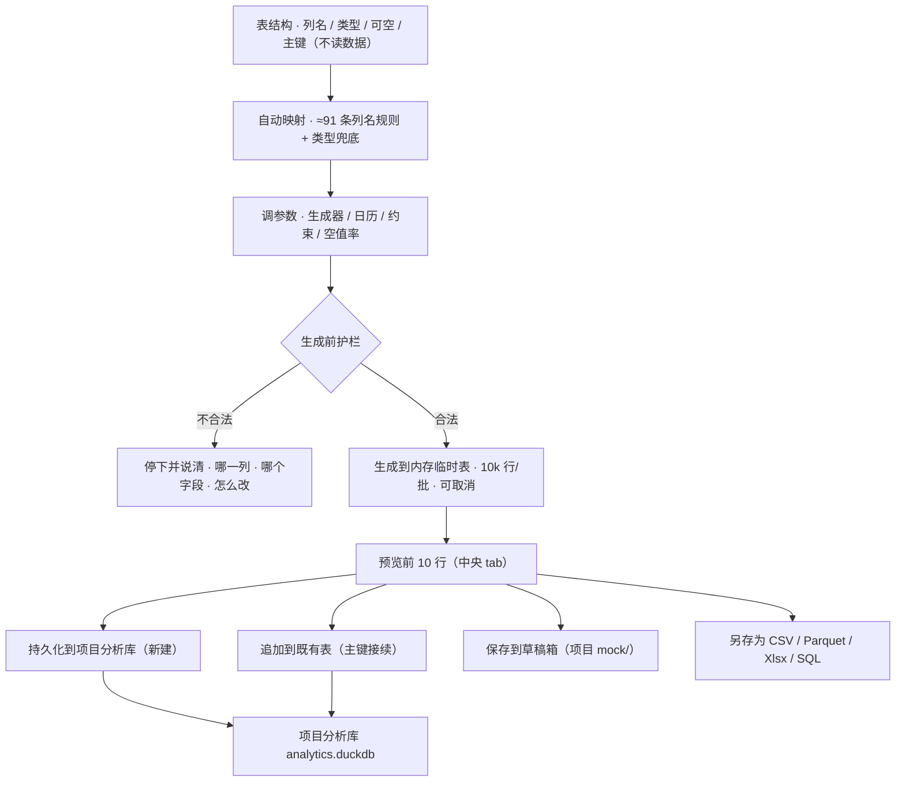
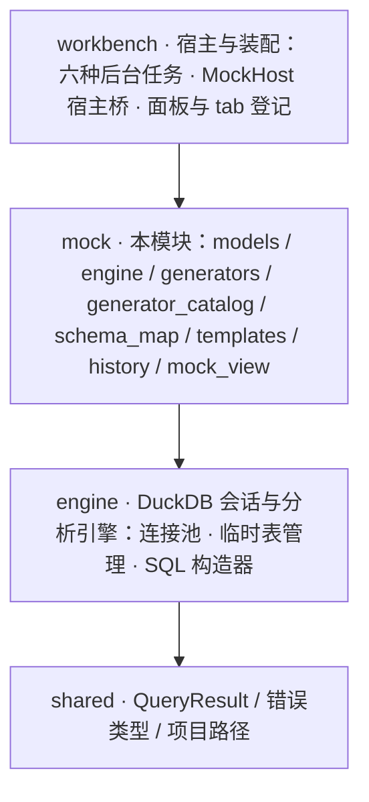

# RdataStation · Mock 数据生成 —— 一页看懂

> 把「表结构」变成可用的测试数据：**不读一行数据，却像真的**；生成只落内存，落地永远由你点出口。
> **143 个生成器变体 · 15 分类 · 4 个显式出口 · 0 行源数据读取。**
>
> 本页是**可贴版**（纯文本 + 表格 + 流程图，适合贴进 PR / wiki）；视觉版见 [`mock-showcase.html`](mock-showcase.html)
> （自包含、明暗双主题、离线可开，首屏可在「单表生成 / 多表场景」之间切换）。
> 两版的章节一一对应。

---

## 一句话

**给它一份列定义，它还你一表可信的假数据——而落地，永远由你点出口。**

从源库只取表结构（**不读一行数据**），自动推断每列怎么造：金额有长尾、到达数是计数、
时间戳落在工作日与工作时段。生成只落内存临时表，落地有四个显式出口。
**它替你省掉的，是「写脚本编数据 → 发现不像 → 再编一遍」这一整圈。**

### 它替你做到的事

| 你关心的 | 它给什么 |
| --- | --- |
| 数据像不像真的 | **143 个生成器变体**：对数正态 / 帕累托（长尾）· 泊松（计数）· Beta（比例）· 二项（次数）· 时序数值（趋势 + 周期 + 噪声）· 工作日历与工作时段 |
| 要不要脱敏 | **不读数据就没有脱敏问题**：与源库的唯一沟通是表结构（列名 / 类型 / 可空 / 主键） |
| 多久能用上 | 导航右键 → 调列 → 生成 → 落库，四步；列名规则（≈91 条）+ 类型兜底自动选生成器，换表即换数据 |
| 会不会误写 | **生成 ≠ 写入**：生成只产内存临时表与预览；新建遇同名报错、追加只增行，都不回传源库 |
| 大行数撑得住吗 | 单表上限 **100 万行**，10k 行/批写内存临时表，进度实时上报，可在批次边界取消 |
| 多表对得上吗 | 6 套内置场景模板 + 自建多表；关系声明在子表列上，取值域由**父表参数算出**（不读数据、O(1) 内存） |
| 出了岔子怎么办 | 护栏在**生成前**：空区间 / 负权重 / λ 非正 / 掩码写错 / 日期串不规范都拦下，并说清哪一列哪个字段 |

> 工程数字（测试基线、代码规模）见第 12 节；边界与「不做的事」见第 10 节。

---

## 1. 造数据以前为什么这么贵

| 旧做法 | 坑 | Mock 怎么做 |
| --- | --- | --- |
| 手写 INSERT / 脚本 | 几十万行要写循环或 `generate_series`，值域全靠手编；换一张表重写一遍；金额全是均匀随机，一眼假 | **表结构进来，生成器下去**：列名规则 + 类型兜底自动选生成器，换表即换数据 |
| 从生产库导一份 | 敏感数据要脱敏，脱敏又要写脚本；导出大表慢还可能拖垮生产库；样本随表结构漂移很快过期 | **不读数据就没有脱敏问题**：全程只碰表结构 |
| 拿一份「够用就行」的样本 | 行数、分布、时间跨度都不可控：压测发现不了性能问题，联调又对不上字段形状 | **行数 / 种子 / 分布 / 日历都能指定**：100 万行上限、固定种子可复现、时间戳落在工作日与工作时段 |

---

## 2. 三个高光

### 高光一 · 不读数据，也能像真的

143 个生成器覆盖业务数据最常见的形态：金额有长尾（对数正态 / 帕累托）、到达数是计数（泊松）、
比例恒在 0~1（Beta）、时间戳落在工作日与工作时段、指标带趋势与季节性（时序数值）。

- ≈91 条列名规则 + 类型兜底，置信度 **high / low / manual** 三态写在列卡上；
- 分布实现**自建**（Box-Muller / 逆变换 / Marsaglia-Tsang），不引分布库；
  泊松 `λ ≥ 30`、二项 `n > 64` 自动转正态近似，十万行不卡在 O(λ) 循环上。

### 高光二 · 生成 ≠ 写入

「生成」只产内存临时表与预览；落地必须点出口，而四个出口各自有独立语义：
**新建**（同名报错，不覆盖）· **追加**（主键自增接续）· **草稿箱** · **另存为**。
想再导一个格式不必重新生成。

### 高光三 · 护栏在生成前，而不是生成到一半

空区间、时间区间不足一分钟、负权重 / 全零权重、集合只填一半、`λ` 非正、`p` 越界、掩码写错、
日期串不规范……一律**生成前**拦下，并说清「哪一列、哪个字段、怎么改」；拦下之后会话照常可用。

---

## 3. 四个剧本 · 它替你做什么

### 剧本 A · 我要一张能联调的订单表（30 秒从源库到项目库）

1. **拿结构**：数据库导航里那张表右键「生成 Mock 数据」→ 面板打开、结构已导入、目标表名已预填；
2. **调列**：卡上换生成器、点「编辑」改参数；拿不准就点「智能」恢复按列名 / 类型的推断；
3. **生成预览**：行数 / 种子 / 语言在表头；点「生成」，前 10 行立刻出来；
4. **落库**：「持久化到项目分析库」；同名已存在会报错并引导改用「追加」。

### 剧本 B · 我要压测 JOIN，十万行起步（不卡界面、可取消）

1. **定规模**：行数填 200000（上限 100 万）；种子填一个数就固定住，方便反复对比同一份数据；
2. **后台生成**：进度按批上报（10k 行/批），随时可取消，取消后报「生成已取消」；
3. **落库或导出**：落库走 `ATTACH` 直写（数据不经 Rust 字符串）；也可以导出 CSV / Parquet 带走；
4. **复用**：配置存成模板，或在历史里「重放」这次配置。

### 剧本 C · 我要一整套能对上的多表数据（一次产 4 张表）

1. **选模板**：「场景模板 ▾」6 套内置（电商 / HR / 博客 / 金融 / 社交 / 通讯录）→ 载入为**工作副本**；
2. **按需改**：加表（当前草稿）/ 删表 / 改表名与行数；改行数时关系里的取值域跟着走；
3. **加关系**：「＋ 加关系」子表 / 子列 → 父表 / 父列（父列只列自增列）：取值域由父表参数算出，不读数据；
4. **生成并落地**：「生成 4 张表」→ 一张表一个 tab 检查；只落子表会被提醒「被引用的表不会跟着落库」，
   可一键「落库这 N 张」。

### 剧本 D · 我要「看起来就是真的」

1. **时间落对日子**：日期列勾「仅工作日」——工作周掩码（`1111100` = 周一~周五）+ 跳过日期（节假日）+ 上班日期（调休）；
2. **时间落对时段**：再勾「仅工作时段」，窗口自己填；起 > 止 按跨零点理解（夜班 `22:00~06:00`）；
3. **数值有形状**：金额换对数正态或帕累托；计数换泊松；比例换 Beta；指标用「时序数值」叠趋势与周期；
4. **预览确认**：前 10 行扫一眼是否落在工作日与工作时段；不满意改参数重生成。

---

## 4. 一次生成的六阶段

| 阶段 | 做什么 | 谁在管 |
| --- | --- | --- |
| 1 拿结构 | 导航右键定向导入，或手填连接 / 库 / schema / 表 | 只读列名 · 类型 · 可空 · 主键 |
| 2 自动映射 | ≈91 条列名规则 → 前后缀 → 模糊子串 → 类型兜底 | 置信度 high / low / manual |
| 3 调参数 | 生成器 / 参数 / 空值率 / 唯一；标量与集合、（日期）日历参数 | 非法值不收起对话框 |
| 4 生成 | 后台线程按 10k 行/批写内存临时表；**先跑参数护栏** | 可取消（批次边界） |
| 5 预览 | 中央 tab 给前 10 行；改配置旧结果作废、出口禁用 | 结果表 tab 只读 |
| 6 落出口 | 四个出口各自语义；多表时可「落库这 N 张」 | 出口不可取消，跑在后台 |

> 面板底部常显一句：**数据只写入项目分析库与文件，不回传源库（M7）**。

---

## 5. 四个出口 · 各自独立语义

出口只认**结果自己**（目标表名 + 列 + 临时表），不读草稿。

| 出口 | 落到哪 | 语义与边界 |
| --- | --- | --- |
| **持久化到项目分析库** | `{项目}/.RSmeta/analytics.duckdb`（新建表） | 同名表已存在 → **报错**并引导改用「追加」；写失败只回滚本次刚建的表。跨库直写（`ATTACH` + `INSERT SELECT`），数据不经 Rust 字符串 |
| **追加到既有表 ▾** | 同上，追加行 | 自增主键**接续表内最大值**；目标表缺列直接报缺哪几列；多余列保持默认值。「追加」不是「替换」 |
| **保存到草稿箱 ▾** | `{项目}/mock/mock_表名_时间戳.扩展名` | 项目文件，随项目走；未打开项目会被拒（改用「另存为」） |
| **另存为 ▾** | 你选的任意路径 | CSV / Parquet / Xlsx / SQL INSERT；**不需要项目**；导出不消耗临时表，可接着导另一个格式 |
| **落库这 N 张**（多表时） | 逐张新建 | 按关系闭包依次落库；同名的跳过并报出，**成功的不回滚** |

---

## 6. 生成器目录：143 变体 · 15 分类

目录（分类 / 中文标签 / 参数规格 / 默认构造）由 `tools/gen_mock_generator_catalog.py` 从 `models.rs` **穷尽派生**：
新增变体编译必失败，强制补齐规格；面板的分类子菜单、搜索对话框、参数表单全部吃同一份目录。

| 分类 | 数量 | 代表变体 |
| --- | --- | --- |
| 数值 | 16 | 自增 · 均匀 · **正态 · 对数正态 · 泊松 · 指数 · 帕累托 · Beta · 二项 · 时序数值** |
| 日期时间 | 9 | 区间随机 · 区间前后 · 顺序推进 · 带缺失的顺序推进（**七个都能挂工作日历**） |
| 文本 / Markdown | 17 | 固定值 · 词组 / 句子 / 段落 · 正则 · 模板字符串 · Markdown 系列 |
| 个人信息 | 15 | 姓名 · 邮箱 · 用户名 · 手机号 · 密码 |
| 地址与网络标识 | 24 | 城市 · 邮编 · 经纬度 · Geohash · IPv4/6 · MAC · 时区 |
| 商业 / 金融 | 22 | 公司 · 行业 · 职位 · 币种 · BIC · ISIN · 信用卡号 |
| 网络与技术 | 14 | UUID v1/v3/v4/v5 · URL · User-Agent · 语义化版本 · 路径 · MIME |
| 约束 | 3 | 取值集合 · 循环序列 · 加权选择（多行文本编辑） |
| 其余 5 类 | 17 | 图片 URL · 颜色 · Ferroid ID · 标准编码 · 汽车与行政 |

**两条找法**：分类子菜单（知道属于哪类）与搜索对话框（只记得名字：按中文标签 / 名称 / 分类，多词 AND）；
菜单顶部还有「最近使用」与「推荐」标记。

---

## 7. 两处排版：右 Dock 管表，中央 tab 做设计

| 位置 | 是什么 | 关键点 |
| --- | --- | --- |
| **右 Dock「Mock 生成」** | 管理表 | 表清单是**唯一入口**（状态点 + 表名 + 行数，点一行切 / 开 tab）；多表时子表行下挂 `↳` 关系子行；集合动作与集合任务的进度 / 取消；出口组 + 出口反馈 + 批量落库；折叠的生成历史（最近 20 次）与用户模板 |
| **中央 tab** | 这张表的设计与生成状态 | 表头：表名 / 行数 / 种子 / 语言 + 生成三态 + 场景模板菜单；进度 / 取消 / 失败原因就在表头（**状态单点**）；列卡片（生成器菜单 + 编辑 / 智能 / 删除 + 参数摘要 + 置信度徽标）；预览前 10 行；**一张结果表一个 tab**，切 tab 就是切表 |

**为什么拆两处**：「有哪些表 · 落了没 · 关系连到谁」是集合视角；「这张表怎么造 · 造到哪一步」是单表视角。
混在一栏里会出现两份进度、两个「当前表」。进度与取消**只画一处**：单表任务在中央表头，集合任务在右 Dock 场景清单下。

> 清单状态图例：`○` 未生成 · `◐` 生成中 · `●` 已生成 · `✓` 已落库 · `⚠` 引用的表没落库（多表时才有）。

---

## 8. 关系与多表 · 值怎么对得上

| 问题 | 它是怎么解的 |
| --- | --- |
| 关系写在哪 | 声明在**子表的列**上（列依赖 = 跨表引用）；加关系时自动把子列生成器对齐到父域 |
| 值从哪来 | 父列 `自增` + 父表行数 → 区间 `[start, start + step×(n−1)]`，**O(1) 内存、零读取**；父列不是自增就明确报「算不出取值域」 |
| 谁先谁后 | **不要求父表先于子表**：自关联与前向引用都合法，表序不用为关系让路 |
| 改了怎么办 | 改父表行数 → 关系行的取值域跟着变（界面直接显示 `1..1,000`）；改表名 → 同步所有指向它的关系并报出条数；删表 → 连带清掉指向它的关系 |
| 落地时会对不上吗 | 会——出口以「当前表」为单位，只落子表就会悬空。界面给 warning（「引用了 …：被引用的表不会跟着落库」）与「还有 N 张没落库」+ 一键**落库这 N 张**；**不替用户改已落地的数据** |

---

## 9. 工作日历 · 四个参数说清「什么时候上班」

挂在列上，七个日期生成器（`sequential_date` / `sequential_date_with_gaps` / `date` / `date_time` /
`date_time_before` / `date_time_after` / `date_time_between`）共用一套。

| 参数 | 取值 | 表达什么 |
| --- | --- | --- |
| **仅工作日** | 开 / 关 | 顺序日期**按工作日数推进**（跳过的日子不占行，日内时刻保持）；其余日期生成器落在休息日就重抽、不成则顺延 |
| **工作周**（周一~周日，1 上班） | `1111100` | 默认周一~周五；单休写 `1111110`，大小周按主要形态填 |
| **跳过日期**（节假日） | `YYYY-MM-DD` 一行一个 | 法定假日；留空则只按工作周判定 |
| **上班日期**（调休） | `YYYY-MM-DD` 一行一个 | 调休上班的周六日，**优先于**工作周与跳过列表 |
| **仅工作时段**（带时刻的四个生成器） | `HH:MM` ~ `HH:MM` | 默认 `09:00~18:00`；**起 > 止 按跨零点理解**（夜班 `22:00~06:00` 两段都会出现） |

**为什么不内置节假日表**：法定节假日与调休每年由通知发布，内置表必然**静默过期**——数据看着像真的，
只是落在不该上班的那天。两个列表把这件事交回用户；调休靠「上班日期优先」表达。

参数在**生成前**校验：掩码须是 7 位 0/1、日期串须是 10 位 `YYYY-MM-DD`（`2026-1-1` 会静默失效，所以直接拦）、
列表各限 366 条、窗口起 = 止被拒。

---

## 10. 边界 · 这些事它不做

### 三条硬约束（架构不变式）

| 约束 | 含义 |
| --- | --- |
| **① 不回传源库** | 全模块没有任何写入源库的代码路径；目标只有内存临时表与项目分析库（M7 硬约束 / 不变式 I1） |
| **② 只取结构，不取数据** | 与源库的唯一沟通是表结构；跨表引用的域由父表参数算出，没有跨库取数（不变式 I9） |
| **③ 不改已落地数据** | 「持久化」遇同名表报错、「追加」只增行；都不 DROP、不重写既有数据（不变式 I6） |

### 明确不做的事

| 不做 | 原因 / 出路 |
| --- | --- |
| 影子数据（读已落地数据、按其特征仿制） | 与「不读数据」的边界相反，属后续独立特性；本轮的引用设计不构成障碍 |
| 按别的列取值（跨列求值 / 表达式） | 本模块**不解释表达式**；真要做是一次带求值器的独立特性（v1 空壳字段已删） |
| 内置节假日表 / 业务日历数据 | 每年发通知，内置表必然过期；用户自定义列表已足够 |
| 把表直接写进全局分析库 | 输出恒为**项目级**；要进全局走资产库存档（M6）或草稿箱升级 |
| 跨模板 / 跨库引用 | 引用目标必须在**同一模板**内、父列可算域 |

---

## 11. 架构 · 依赖只向下

- `mock → engine → shared`，**只向下，没有反向依赖**；
- 视图随能力同 crate（`mock_view`），与 project / settings / insight 同例；
- 本模块**不认识**「项目 / 连接 / 文件对话框」——一律走宿主端口注入；
- **渲染期零 I/O**：副作用只在事件路径。

---

## 12. 质量与证据

下表为 **2026-09-18 实测**（`cargo test -p rds-mock --lib --tests` 与 workbench 的 mock 目标；`check --all-targets` 零告警）。

| 层面 | 数量与内容 |
| --- | --- |
| 单元测试 | **190** 项：视图 92（27 纯逻辑 + 65 GPUI headless 窗口）· 生成器 32 · 列名映射 23 · 引擎 14 · 模板 11 · 历史 7 · 持久化 6 · 目录 3 · 错误 2 |
| 集成测试 | 引擎公开 API **37**（含生成不写库 · 跨库直写 · 值到文本 · 参数护栏 · 工作日历端到端）· 持久化往返 **5** · 历史 / 模板 **4** · 临时表清理 **2** |
| 宿主侧 | workbench：装配 **12** · 后台任务 **11** · 取消 **1** |
| 目录自检 | **3** 项：变体数一致（143）· 每个规格都有标签与默认构造 · 变体 ↔ 分类往返 |
| 模板自检 | **4** 项：声明可解析 · 生成器域 ⊆ 父域 · 每个 `*_id` 列要么声明要么进白名单 · 白名单无幽灵条目 |
| 代码规模 | 本体约 **17.9k** 行（视图 6.1k · 目录生成物 2.5k · 生成器 2.3k · 引擎 1.8k · 模板 1.7k · 映射 1.0k · 历史 0.9k），另有测试约 **5.9k** 行 |
| 可复现性 | 同 seed + 同配置 → 逐值相同的序列；分布族另有一组统计冒烟（泊松均值 · 指数均值 · 帕累托下界 · Beta 值域 · 二项均值 · 时序周期抵消） |

---

## 13. 文档地图

| 想深入 | 看这里 |
| --- | --- |
| 为什么这样设计 | [`mock-architecture.md`](mock-architecture.md)：九条不变式 I1–I9 · 概念模型 · 数据流 · 决策表 D1–D42 · 已知问题 |
| 怎么用 | [`mock-user-guide.md`](mock-user-guide.md)：入口 · 界面导览 · 典型流程九条 · FAQ 排查 · USIT 验收清单 |
| 长什么样 | [`mock-prototype-design.md`](mock-prototype-design.md) 与 [`mock-prototype.html`](mock-prototype.html)（18 场景可切交互稿） |
| 做到哪 | [`mock-dev-plan.md`](mock-dev-plan.md)：Phase A–G 任务 · 测试场景 T1–T35 · 进度记录 |
| 模块入口 | [`README.md`](README.md)：特点 · 边界 · 代码结构 · 能力状态 |
| 视觉版本页 | [`mock-showcase.html`](mock-showcase.html)：自包含 · 明暗双主题 · 首屏可切 |
| crate 视角 | [`../../../crates/mock/README.md`](../../../crates/mock/README.md) |

---

*RdataStation · Mock 数据生成（M7）—— 把「表结构」变成可用的测试数据；生成只落内存，落地永远由你点出口。
数字口径以模块文档与代码为准（快照 2026-09-18）。*
