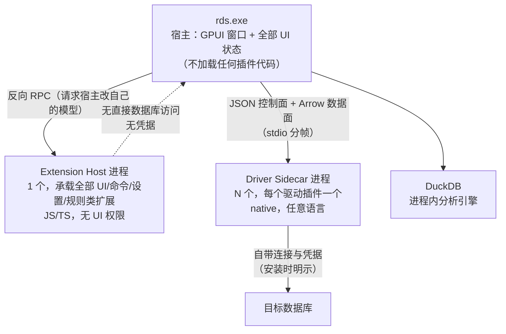

# 插件系统（M9）— 原型设计（VS Code 模式）

> 本文给出「按 VS Code 模式」的插件形态原型：**进程与信任边界 / 清单 / API 面 / 激活时机 / 贡献点映射 / 示例插件**。
> 关系：`plugin-architecture.md` 记设计意图，`plugin-dev-plan.md` 记排期与改动清单，本文只定「扩展长什么样」。
>
> **本文不推翻 dev-plan 的 D1（三轨承载）**，而是把其中「面板/命令/设置 = 脚本」那一轨的**具体形态**定下来，并回答「这个方式是否合适」。
> 视觉与尺寸口径仍以 `../ui/`、`../theme/` 为准；本文不定义新的视觉原语。

---

## 1. 一句话形态

> **宿主 = RdataStation 的 GPUI 窗口；扩展 = 独立「扩展宿主进程」里的 JS/TS 模块；扩展不碰渲染路径，只通过 `rds.*` RPC 请求宿主修改宿主自己的 UI 模型。**

对照 VS Code 的原文表述（已核实的公开口径）：

| VS Code 的做法 | 本原型的对应 |
| --- | --- |
| 扩展运行在独立 extension host 进程 | 同：`rds extension host`（一个新进程，不是 GPUI 进程内的 wasm） |
| 扩展**禁止任意 UI**（无 DOM、无自定义样式表），只能通过贡献点 + Webview | 同：只能通过贡献点；**Webview 可提供，但限两种承载**（全屏面板 / 独立窗口，Q8 定案见 §11.2） |
| `contributes` 声明 + `activationEvents` 懒激活 | 同：`contributes.*` + `activation` |
| `engines.vscode` 版本闸（必填、不可 `*`） | 同：`engines.rds`（必填） |
| 扩展与 VS Code **同权**，只有 Workspace Trust 与发布者信任 | **本原型更强**：`rds.*` 是能力门控的，权限可精确到方法（§4.4） |

---

## 2. 进程与信任边界



三条硬约束（**是原型的一部分，不是建议**）：

| # | 约束 | 理由 |
| --- | --- | --- |
| 1 | **驱动插件不在扩展宿主里** | 驱动要原生 socket / TLS / 连接池；且一个驱动崩溃不该拖垮所有扩展 |
| 2 | **扩展宿主不直接访问数据库** | 它只能通过 `rds.connections` / `rds.results` 反向请求宿主 → **凭据不出宿主进程**（守护 dev-plan §4.6.3 的口径） |
| 3 | **扩展代码不进入渲染路径** | 与「`render` 是纯读路径」的既有纪律一致；也让「零裸尺寸 / 零裸色值」两条契约测试继续可守 |

---

## 3. 清单（`plugin.toml`）

沿用既有 `PluginManifest`（TOML，`crates/plugin/src/manifest.rs`），按 VS Code 的 `contributes` 语义增量扩展：

```toml
schema_version = 1

[extension]
id           = "publisher.sql-notebook"     # 反向域名式 id（VS Code 惯例）
version      = "1.2.0"
display_name = "SQL Notebook"
description  = "把查询结果组织成可复跑的笔记本"
publisher    = "example"
license      = "MIT"
engines.rds  = "^0.2"                       # 必填，不允许 "*"
categories   = ["Notebooks", "Data"]

[main]                                       # 扩展宿主的入口（懒加载）
module     = "dist/extension.js"
activation = [
  "onCommand:sqlNotebook.open",              # 命令
  "onConnection:mysql",                      # 连上某类库（≈ onLanguage）
  "onView:sqlNotebook.explorer",             # 展开某视图
  "onInsightRule",                           # 洞察面板被打开
  "onStartupFinished",                       # 启动完成（慎用）
]

# ---------- 静态贡献：宿主启动时只登记"声明"，不加载代码 ----------

[[contributes.commands]]
command  = "sqlNotebook.open"
title    = "打开 SQL Notebook"
category = "Notebook"

[[contributes.commands]]
command = "sqlNotebook.exportCurrent"
title   = "导出当前结果为 Notebook"

[[contributes.menus]]
# 挂载点是宿主的固定枚举（见 §6）
"nav/item/context"    = [{ command = "sqlNotebook.addToNotebook", when = "viewItem == table" }]
"result/grid/context" = [{ command = "sqlNotebook.exportCurrent", when = "result.hasSelection" }]
"title/overflow"      = [{ command = "sqlNotebook.open", group = "navigation" }]

[[contributes.configuration]]
key     = "sqlNotebook.defaultRowLimit"
type    = "number"
default = 1000
scope   = "project"                          # application | project | session（对齐 settings 三分法）
label   = "默认取样行数"

[[contributes.views]]
id       = "sqlNotebook.explorer"
name     = "Notebooks"
location = "left"                            # left | right | center
icon     = "media/notebook.svg"
when     = "projectTrusted"

[[contributes.insightRules]]                 # RdataStation 特有：洞察规则（TOML 或 JS 声明）
[[contributes.mockGenerators]]               # RdataStation 特有：造数生成器
[[contributes.exporters]]                    # 导出格式
[[contributes.drivers]]                      # 驱动（**另起 native 进程**，见 §2 约束 1）

[dependencies]
"publisher.common-utils" = "^1.0"
```

**字段来源与理由**：

| 字段 | 来自 | 为什么必须 |
| --- | --- | --- |
| `id` | VS Code `publisher.name` | 全局唯一 + 可归属（卸载/升级/引用对账都靠它） |
| `engines.rds` | VS Code `engines.vscode` | **必填且不可 `*`**；加载与安装两处都要真的拒绝（现 `check_engine_compatibility` 未被强制） |
| `activation` | VS Code `activationEvents` | 不激活不加载代码——**启动性能的结构性保证** |
| `contributes.*` | VS Code `contributes` | 声明式，宿主启动时零成本登记 |
| `when` 子句 | VS Code `when` 上下文键 | 菜单/视图的可用性条件，避免插件自己判断 |

---

## 4. API 面：`rds` 模块

### 4.1 设计原则

| # | 原则 |
| --- | --- |
| 1 | **窄面**：只 8 个命名空间。VS Code 的 `vscode` 模块有 300+ 成员、十几个命名空间，是十年积累——照抄不可行，也不必要 |
| 2 | **一切创建动作都返回句柄**：`createStatusBarItem()` 返回一个宿主创建的句柄，插件只能改属性。**插件无法凭空画东西** |
| 3 | **一切订阅返回 `Disposable`**：卸载/失活时统一释放（VS Code 的核心模式） |
| 4 | **行集用 Arrow**：`rds.results.getRows(range)` 返回 `RecordBatch`，与 dev-plan §4.5 的数据面一致，不给 JSON 字符串 |
| 5 | **改 UI 是请求，不是命令**：`showInformationMessage` 而不是 `appendToDom` |
| 6 | **重计算下沉 `rds.duckdb`**：扩展要做聚合/变换，就写成 SQL 交给 DuckDB，**不在 JS 里 map/reduce**。这不是绕开限制，而是与产品定位一致（DuckDB 是引擎，JS 是胶水）；也是 Q7 选 QuickJS（无 JIT）之后必须写进 API 文档的纪律 |

### 4.2 命名空间（原型定稿）

```
rds.commands      registerCommand(id, handler) -> Disposable
                  executeCommand(id, ...args)
                  getCommands()

rds.window        showInformationMessage / showWarningMessage / showErrorMessage
                  showQuickPick / showInputBox
                  createStatusBarItem(alignment, priority) -> StatusBarItem
                  withProgress(title, task)

rds.workspace     getConfiguration(section) -> Configuration
                  onDidChangeConfiguration(handler) -> Disposable
                  projectPath / globalStoragePath / logPath

rds.connections   list() / get(id) / getActive()
                  onDidChangeActive / onDidConnect / onDidDisconnect

rds.metadata      getSchemas(conn) / getTables(conn, schema) / getColumns(conn, schema, table)
                  onDidChange(conn)

rds.results       getActive() -> ResultHandle?
                  getRows(handle, range) -> RecordBatch     // Arrow，不是字符串
                  export(handle, format, path)
                  onDidChange(handler)

rds.duckdb        query(sql, params?) -> RecordBatch        // 只读 + 临时表
                  createTempTable(name, batch)               // 只写分析库

rds.log           info / warn / error                        // 进应用日志，带扩展 id 前缀
```

### 4.3 句柄类型（宿主拥有，插件只读/改属性）

```
StatusBarItem   .text / .tooltip / .command / .show() / .hide() / .dispose()
ResultHandle    .columns / .rowCount / .sourceConnection / .isStale
```

### 4.4 权限：比 VS Code 更严（本原型的加分项）

VS Code 的扩展与编辑器**同权**（只有 Workspace Trust 与发布者信任两道门）。本原型可以更严，因为 `rds.*` 是 RPC——**每个方法都能单独门控**：

```toml
[capabilities]
"rds.connections"       = ["list", "get"]        # 不给 getActive 也行
"rds.metadata"          = ["*"]
"rds.results.getRows"   = "project-data"         # 需要项目可见的数据
"rds.duckdb.query"      = "read-only"
"rds.duckdb.createTempTable" = true
"rds.workspace.getConfiguration" = true
"fs.write"              = ["${globalStorage}"]   # 只能写自己的存储目录
"net.http"              = []                     # 扩展宿主默认无网络
```

**默认拒绝**：未声明的命名空间调用直接返回 `capability_denied`（错误码见 dev-plan §4.2.2），宿主在 UI 上给出可读原因。

---

## 5. 激活与生命周期

```
① 扫描   <RDS_HOME>/plugins/<publisher>.<name>/plugin.toml   （目录：paths::plugins_dir，待补）
         → 校验 schema_version / engines.rds（不匹配即拒绝，报出两个版本号）
         → **不运行任何代码**，只登记静态贡献

② 启动   宿主把静态贡献合并进三个注册表：
         CommandRegistry / PanelRegistry / 设置登记表
         （命令面板里能看到插件命令，但扩展代码**还没加载**）

③ 激活   某个 activation 事件被触发
         → 在 Extension Host 进程里加载 module（懒）
         → 调 activate(context)
           context = { subscriptions, extensionId, extensionPath,
                       globalStoragePath, workspaceState, globalState }

④ 运行   扩展只能通过 rds.* 反向 RPC 请求宿主；订阅返回 Disposable

⑤ 失活   deactivate() → 释放全部 subscriptions
         → 超时（本原型取 2s）后强杀该扩展所在宿主；**宿主 UI 不受影响**
```

**崩溃与隔离**：

| 事件 | 表现 | 恢复 |
| --- | --- | --- |
| 某扩展抛异常 | 该扩展的 `handler` 调用返回错误，其余扩展不受影响 | 扩展自己 catch；宿主记日志 |
| Extension Host 进程崩溃 | 全部扩展失活；宿主弹「扩展宿主已崩溃」 | 一键重启扩展宿主；驱动连接不受影响 |
| Driver Sidecar 崩溃 | 只有那个连接的会话失效 | 如实报错（不静默重连）；可手动重启该驱动 |

---

## 6. 贡献点映射表（VS Code ↔ RdataStation）

| VS Code 贡献点 | RdataStation 对应 | 宿主实现位置 | 状态 |
| --- | --- | --- | --- |
| `commands` | 同 | `quick_open/commands.rs` → `CommandRegistry` | 需建（dev-plan P4） |
| `menus` | 挂载点：`nav/item/context`、`result/grid/context`、`editor/title`、`title/overflow`、`statusBar` | 各面板的既有右键菜单 | 需建 |
| `keybindings` | 同（键位冲突由宿主裁决） | app 层 `cx.bind_keys` | 待定（Q9） |
| `configuration` | 设置项（作用域 `application`/`project`/`session`） | `settings` 登记表 + 准入五条 | 需建 |
| `views` / `viewsWelcome` | 左右 Dock 面板 + 中央 tab | `LeftPanel`→`PanelId` + `PanelRegistry`（**未注册 id 显示占位**） | 需建（dev-plan P4） |
| `TreeDataProvider` | 插件自己的树（宿主渲染，插件给节点数据） | `gpui_kit::component::list` 系 | 需建 |
| `WebviewPanel` / `CustomEditor` | **本原型不提供**（见 §11 Q8） | — | ❌ |
| `languages` / LSP / hover / completion | SQL 方言的补全 / 格式化 / hover | editor 补全端口（**当前是欠账**：`editor` 无 `database` 依赖） | 依赖前置 |
| `debuggers` / `tasks` / `terminal` | ❌ 不映射 | — | ❌ |
| `sourceControl` / `testing` / `chat` | ❌ 不映射 | — | ❌ |
| **（VS Code 没有的）** | | | |
| — | `contributes.drivers`（native sidecar） | `engine` 驱动注册面 + dev-plan §4.1 | 需建 |
| — | `contributes.insightRules`（洞察规则） | `crates/insight` 规则加载（TOML 三层作用域已就绪） | 可接 |
| — | `contributes.mockGenerators`（造数生成器） | `crates/mock` 生成器目录（143 变体） | 待定 |
| — | `contributes.exporters`（导出格式） | `editor` 五种导出 | 待定 |

**这张表决定了原型的落地顺序**：`commands` / `menus` / `configuration` / `views` 四项是 VS Code 模型的最小可用集，也正是 dev-plan P4 要建的三张注册表。

---

## 7. 示例插件（完整走一遍所有机制）

**「表大小看板」**：贡献一个左侧面板 + 一个命令 + 一个设置项 + 一个导航树右键项。

```js
// dist/extension.js
const rds = require('rds');

function activate(context) {
  // ① 命令（声明已在 plugin.toml，这里注册实现）
  context.subscriptions.push(
    rds.commands.registerCommand('tableBoard.refresh', async () => {
      const limit = rds.workspace.getConfiguration('tableBoard').get('topN', 20);
      const conn = rds.connections.getActive();
      if (!conn) return rds.window.showInformationMessage('请先连接一个数据源');

      // ② 元数据：宿主已有三级缓存，扩展不直连数据库
      const tables = await rds.metadata.getTables(conn, undefined);

      // ③ 进度：宿主渲染进度条，扩展只上报
      await rds.window.withProgress('统计行数', async (report) => {
        for (const [i, t] of tables.entries()) {
          report(i / tables.length, t.name);
        }
      });

      // ④ 把结果交给宿主渲染（扩展不画 UI）
      await rds.views.update('tableBoard.explorer', {
        title: `Top ${limit} 表`,
        items: tables.slice(0, limit).map(t => ({
          label: t.name, description: t.comment ?? '', id: t.name,
        })),
      });
    })
  );

  // ⑤ 订阅：返回 Disposable，失活时自动释放
  context.subscriptions.push(
    rds.connections.onDidChangeActive(conn => rds.log.info(`活动连接切换到 ${conn?.name}`))
  );
}

function deactivate() {}   // 无需额外清理：全部挂在 context.subscriptions
```

**注意这份示例里被刻意避免的东西**：没有 `div()`、没有样式、没有像素；树是宿主渲染的，扩展只给 `{label, description, id}`。**这就是 VS Code 模型的核心收益。**

> 本节讲的是**扩展宿主侧**（面板数据、命令、设置）。若面板必须自己画（图表、仪表盘这类），走的是 webview 承载 —— 形态、边界与可点的原型见 §11.2。

---

## 8. 与既有设计的接缝

| 既有设计 | 本原型如何接 |
| --- | --- |
| `PluginManifest`（唯一契约，dev-plan D3） | 本文 §3 是它的**扩展**，不是第二份清单 |
| 三层对象模型（P1） | 驱动插件按 §4.1 的 `PluginProcess → DriverInstance → Session` 跑，**不经过扩展宿主** |
| 能力矩阵（dev-plan §4.4） | 驱动能力在 `contributes.drivers` 的 `[capabilities.driver]`；扩展能力在 `[capabilities]` 的 `rds.*` |
| 项目引用对账（dev-plan §4.8） | 扩展与驱动都进 `project_resources(kind=…)`；未装 → 占位面板（「项目引用了 X，未安装」） |
| `render` 纯读路径 + 零裸尺寸/零裸色值 | **本原型天然满足**：扩展代码不在渲染路径，UI 全部由宿主用既有常量与 token 渲染 |
| 凭据口径（dev-plan §4.6.3） | 扩展宿主**拿不到凭据**（它不连库）；只有驱动进程拿得到，且安装时明示 |

---

## 9. 与 gpui-shell 的分工（两个模型互补，不是二选一）

| | VS Code 模型（本文） | gpui-shell 模型（`gpui-kit` 自带） |
| --- | --- | --- |
| 扩展产出 | **对宿主的请求**（改状态栏、挂菜单、给树数据） | **一棵界面描述树**（脚本描述、Rust 材质化） |
| 扩展能否定义视觉 | 不能（用宿主既有控件） | 能（用宿主给的原语 + 主题 token） |
| 宿主原语 | 无（只有贡献点） | `div`/`h_flex`/`Button`/`Input`/`PathBuilder`… |
| 适合 | 覆盖 ~90% 需求：命令、面板数据、设置、通知、状态栏 | 「我需要一个带表格和按钮的自定义界面」 |
| 上游状态 | 需自建（本文即设计） | `publish = false`、M0，等发布 |

**分工建议**：**默认走 VS Code 模型**（能力可控、UI 一致、启动快）；「自定义界面」作为**显式声明的可选能力**，后端可以是 gpui-shell（待发布）或独立的「插件视图区」（若提供 webview）。**不要**让两条路对同一块 UI 都能改——那会产生两套视觉语言。

---

## 10. 明确不做

- 任意 UI（DOM/样式表/自绘）——与 VS Code 同口径，且与「零裸尺寸/零裸色值」契约冲突
- 扩展宿主直接访问数据库或凭据
- 驱动插件跑在扩展宿主里
- 一个 300+ 成员的 `rds` API 面（只做 §4.2 那 8 个命名空间）
- 调试器 / 任务 / 终端 / 源码管理 / 测试 / 聊天类贡献点（产品无此域）
- 让扩展改宿主的布局状态机（面板位置由用户的布局决定，扩展只能声明 `location` 偏好）
- **Node / npm 兼容层（有意不做）**：不提供 `require('fs')`、`node:` 命名空间、npm 依赖解析。理由：本产品的扩展面向**数据与元数据编排**，npm 的富池优势在这里收益有限；代价是 38 MiB 级运行时与构建复杂度（见 §11 Q7）
- **在 JS 里做重计算**：不提供大数组/批量变换的性能承诺；`rds.duckdb` 是唯一的重计算出口（§4.1 原则 6）

---

## 11. 新的待定决策

| # | 决策 | 选项 | 说明 |
| --- | --- | --- | --- |
| **Q7** | **JS 运行时从哪来** | ✅ **已定：(a) 内置 QuickJS（经 `rquickjs`）** —— 见下方小字 | 两条前置已确认：① 重计算交给 DuckDB（可接受）；② 不兼容 npm（可接受，本产品面向数据领域，npm 优势不大） |
| **Q8** | **是否提供 Webview** | ✅ **可提供，但限两种承载**（全屏面板 / 独立窗口）；混排**写得出、但会被原生子窗口盖住**（z-order）→ 实践上不支持 —— 依据见 §11.2 | `gpui-wry` 与 `gpui-kit` **同仓不同 crate**，需单独加依赖且**本仓应锁 `=0.6.1`**（否则顶起整条 gpui 栈）；它与 `gpui-shell`（`publish = false`）**不是同一回事** |
| **Q9** | **键位贡献是否开放** | (a) 开放（宿主裁决冲突）｜(b) 不开放，只允许在命令面板里出现 | VS Code 开放；但你们有「注册了才宣传」的快捷键纪律，冲突裁决规则要先定 |
| **Q10** | **wasm 轨是否保留** | (a) 保留为「纯计算/性能轨」｜(b) 冻结（用 JS 宿主吸收） | 见 §12 |

### 11.1 Q7 定案依据（2026-09-20 核实）

**V8（`rusty_v8` v152.2.0，2026-08-20）各平台预编译静态库的**下载体积**（`denoland/rusty_v8` Release 资产，gzip 后）：

| 平台资产 | 体积 |
| --- | --- |
| `librusty_v8_release_x86_64-unknown-linux-gnu.a.gz` | 37.9 MiB |
| `librusty_v8_release_x86_64-pc-windows-msvc.lib.gz` | 38.1 MiB |
| `librusty_v8_release_aarch64-unknown-linux-gnu.a.gz` | 36.7 MiB |
| `librusty_v8_release_aarch64-apple-darwin.a.gz` / `x86_64-apple-darwin` | 38.8 / 38.6 MiB |
| `librusty_v8_debug_x86_64-unknown-linux-gnu.a.gz` / `aarch64-apple-darwin` | 78.9 / 100.4 MiB |

附带：**Windows 只有 MSVC 资产，无 `windows-gnu`**；换 target 或清 target 目录都要重下这一份。

**QuickJS（`rquickjs` 0.14.0，2026-09-18）**：

| 项 | 值 |
| --- | --- |
| 许可 / 活跃度 | **MIT**；436 万总下载 / **195 万近期** / 43 个版本 |
| `rquickjs-sys` crate | **2.13 MB**，内含 **C 源码 82,647 行（21 文件）+ 头文件 13,437 行（60 文件）** → **vendored QuickJS，无外部下载** |
| `bindgen` | **可选 feature**；默认用随 crate 预生成的绑定 → **Windows 只需 C 编译器（MSVC `cl.exe`），不需要 LLVM/libclang** |

**为什么「V8 的强项我们用不上」**（本次调研的关键判断）：

| V8 的优势 | 在本产品的处境 |
| --- | --- |
| npm / Node 生态兼容 | 扩展模型**故意不给 Node 能力**（`rds.*` 能力门控、宿主默认无网络无文件系统、明确不做 Node 兼容层）→ 为用不上的能力付 38 MiB + 链接代价 |
| JIT 性能 | 扩展的活是「元数据编排 + RPC + 少量变换」，不是热循环；**重计算有更好的出口：`rds.duckdb`** |

一句话：**我们不需要一个跑得快的 JS，只需要一个装得下的 JS。**

**未核实**：① `rusty_v8`/`deno_core` 与 `rquickjs` 的**最终二进制净增量**（必须本地实测）；② rquickjs 的 CI 矩阵是否含 Windows 作业（本次抓 `raw.githubusercontent` 报 `missing Content-Type header`，未取到）；③ 冷启动耗时对比数字。

**本地验证（比 CI 矩阵更贴你们的环境）**：

```sh
# A 档：先记基线，再加依赖比体积
cargo build --release -p rds-app && ls -l <产物路径>
# 加 rquickjs 后重跑，比体积差 + 首次构建耗时

# B 档：隔离 target 目录，避免污染现有构建缓存
CARGO_TARGET_DIR=target-v8 cargo build --release -p rds-app
# 观察 rusty_v8 build script 的下载量（~38 MiB）与首次构建耗时
```

### 11.2 Q8 定案依据（2026-09-20 核实）

> 前提纠正：早期稿子把 webview 与 `gpui-shell` 一并列为「上游未就绪」——**不准确**。`gpui-shell` 是 `publish = false`，而 `gpui-wry` **已发布**。

| 项 | 值 |
| --- | --- |
| crate 名 | **`gpui-wry`**（仓库路径 `crates/webview`） |
| 最新版本 / 更新 | **0.6.4** / 2026-09-18（**本仓应锁 `=0.6.1`**，理由见下） |
| 许可 / 发布 | **Apache-2.0**；`publish = true`，docs.rs 有文档 |
| 下载 | 2,686 总 / **2,433 近期**（近 90% 是近期 → 活跃使用中） |
| 依赖 | `wry = { version = "0.53.3", package = "lb-wry" }`（longbridge 的 wry fork，**有版本依赖、非 git pin**） |
| 本仓应锁 | **`=0.6.1`**（理由见下方「版本耦合」） |

**归属澄清：`gpui-kit` 到底支不支持 webview？**（2026-09-20 核实）

| 问题 | 答案 |
| --- | --- |
| 是同一个项目吗 | **是**。`gpui-wry` 的 `repository` 字段 = `github.com/longbridge/gpui-kit/tree/main/crates/webview` —— 与 `gpui-kit` **同仓**（0.5.0 时代该路径挂在 `longbridge/gpui-component` 下，改名后并入 gpui-kit；最早一版发布于 2025-12-08） |
| 是同一个 crate 吗 | **不是**。`gpui-kit 0.6.1` 的依赖只有 `gpui-base` / `gpui-component`(可选) / `gpui-kit-assets`(可选) / `gpui-pre` / `gpui-pre-platform` —— **没有 `gpui-wry`**。故「用 gpui-kit 就自带 webview」**不成立**，要另加一行依赖 |
| 会是两套 GUI 世界吗 | **不会**。两者都依赖 `gpui-pre`（本仓 lock 是 `0.3.4`）→ `WebViewElement` 直接进现有视图的布局，类型系统同源 |
| `egui-kit` 呢 | crates.io 上**不存在这个名字**（404）。若指 egui（Emil 的 immediate-mode GUI），它**没有官方 webview**，社区做法同自接 `wry`、踩同一个 z-order 问题 —— 与本项目无关，本项目用的是 GPUI |

**版本耦合：这条决定依赖怎么写**（2026-09-20 核实）

| `gpui-wry` | 对 `gpui-pre` 的要求 | 与本仓 lock（`gpui-pre 0.3.4` + `gpui-kit 0.6.1`）|
| --- | --- | --- |
| **0.6.1**（2026-09-09）| `^0.3.1` | ✅ **兼容**（0.3.4 满足）；只增 `lb-wry` 及其平台树，**不动现有 GUI 栈** |
| 0.6.4（2026-09-18，最新）| `^0.3.5` | ⚠️ 会把 `gpui-pre` 从 0.3.4 顶到 0.3.5。`gpui-base`/`gpui-kit` 对 `gpui-pre` 都是 `^0.3.1`（caret），所以**技术上可解析**，但这是**上游没发布过的组合** |

→ **写法**：要用就写 **`gpui-wry = "=0.6.1"`**（精确锁，与本仓 `gpui-kit 0.6.1` 同代），**不要写 caret `0.6.1`** —— 否则解析到 0.6.4 并连带顶起整条 gpui 栈。将来升 gpui-kit 时 `gpui-kit` / `gpui-wry` / `gpui-pre` **三个一起升**（沿用根 `Cargo.toml` 里「表现层同版本」那条纪律）。

**附带实测：升 gpui-kit 到底会动多少东西**（2026-09-20，`cargo update -n`，只预演、不写锁）：

| 预期操作 | 实测结果 |
| --- | --- |
| `cargo update -p gpui-kit` | **连动 29 个包**：`gpui-kit` / `gpui-base` / `gpui-component`(+macros) / `gpui-kit-assets` 0.6.1 → 0.6.4，同时 `gpui-pre*` 整族 0.3.4 → 0.3.5，另新增 `objc2-screen-capture-kit`（仅 macOS） |
| `cargo update -p gpui-pre`（只动它） | **锁纹丝不动**（Locking 0 packages）—— 说明这一代是被上游成组钉住的，单独动其中一个解析不动 |

两个结论：

1. **本仓要升就整组升** —— 正好印证根 `Cargo.toml` 里那条「表现层必须同版本」的注释。
2. **不要跑裸 `cargo update`** —— manifest 写的是 caret（`gpui-kit = "0.6.1"`），裸 update 会**静默**把整条 UI 栈顶到 0.6.4 代。要升就写 `-p gpui-kit`，让这次改动是一份**可 review 的成组变更**。

**未核实**：加 `lb-wry 0.53.3` 后的**二进制净增量与首次构建耗时**（参照 §11.1 的 A/B 档写法本地实测）。渲染侧由系统 WebView2 / WKWebView 承担，**不随我们的产物打包**（wry 的既有事实，非本次实测）。

**API 很薄，但有逃生口**：

```
WebView        new(webview, window, cx) / load_url(url) / show() / hide()
               visible() / bounds() / back() / raw() / handle()
WebViewHandle  raw()
WebViewElement new(...)                     ← 作为 GPUI 元素挂进布局
```

`raw()` 返回底层 `&wry::WebView` → **`evaluate_script` / `load_html` / IPC handler 等能力都在**。所以「limited features」指的是**这层封装薄**，不是能力阉割。

**三条限制的准确归属**：

| 限制 | 归属 | 影响 |
| --- | --- | --- |
| "experimental / limited features" | README 自述 | 上层 API 可能变；但底层 wry 成熟 |
| **只支持 macOS / Windows** | **GPUI 集成层**，不是 wry 层（wry 三平台都支持：WebView2 / WKWebView / webkit2gtk） | Linux 上不可用；但它有替代路径（自接 wry 或等上游） |
| 渲染在 GPUI 窗口之上、会盖住背后元素 | 原生子窗口的本质 | **只在「混排」时是真问题**（见下） |

**按承载分三档（这才是 Q8 的真正答案）**：

| 档 | 用法 | z-order 问题 | 判断 |
| --- | --- | --- | --- |
| ① | **全屏面板**：占满某个 Dock 面板或中央 tab 的全部内容区 | **不存在**（背后没有需要露出的 GPUI 元素） | ✅ 推荐 |
| ② | **独立窗口**：官方建议的形态 | 不存在 | ✅ 推荐（OAuth、独立图表窗） |
| ③ | **与 GPUI 元素混排**：同屏还有下拉 / 菜单 / 对话框要浮在上面 | **真实且难解**——GPUI 的 dialog/overlay 会被原生子窗口盖住 | ❌ **实践上不支持**（不是 API 不允许：`WebViewElement` 本来就能进布局；是**层级不受 GPUI 控制**。宿主若给这一档，必须自己保证浮层不被盖住，做不到就别开） |

**一条必须写清的架构含义**：**webview 里的 JS 与扩展宿主不是一回事。** 它没有 `rds.*`（那是「宿主 ↔ 扩展宿主」的 RPC，走 stdio 帧），要拿数据只能走 `raw()` 暴露的 `evaluate_script` / 自定义 IPC handler。所以自洽的分工只有一种：**webview = 展示层 / 绘图层，编排仍在扩展宿主**。这正好对上「宿主把结果集投喂进图表，图里只做渲染」这条链路（数据面仍按 D4 走 Arrow，见 plugin-dev-plan §4.2.4 与 §4.5）。

**形态原型（可直接打开，不需要 gpui-wry 就能评审）**：`docs/architecture/plugin/prototype/webview-chart-panel.html`

单文件、离线、无构建，把上面几条结论做成能点的东西：X/Y/聚合方式一改就**向宿主发命令**（面板自己不聚合）、导出 PNG 走**能力门控**、主题跟宿主明暗切换、通道断开有横幅。底部「宿主模拟器」的两列日志就是 `evaluate_script`（宿主→面板）与 IPC handler（面板→宿主）在真实现里的位置。

> 2026-09-20 用 Node + 最小 DOM 桩跑过一次冒烟（脚本已删）：握手顺序为 `capabilities → theme → result`；启动结果集 4 列 / 12 行且首行数值有限；改维度后确实走完「面板发 `chart.rerender` → 宿主重算 → 回投 3 行」往返；取消能力后点导出确实回 `-32006 capability_denied`。

**战略意义（比「自定义界面」更重要）**：**webview 是复用 Vega / Plotly / D3 / ECharts 的唯一路径。** README 里「图表 / 仪表盘 / 报表（留给插件生态）」这句话，**没有 webview 就只能靠自绘，而自绘的生态基本为零**。所以 Q8 不只是「要不要让插件画界面」，而是**图表生态要不要的问题**。

**一个需要产品回答的前置：是否支持 Linux？** 代码里三个平台的 `cfg` 分支都有（`engine/src/cache/lru_cache.rs` 三平台、`insight/src/jobs.rs` windows+macos、`project/src/ui.rs` windows），但 README **未声明目标平台**。

- 若 Win + macOS 为主 → webview 可作为**正式能力**，Linux 上如实置灰
- 若要 Linux 同等支持 → webview 只能作为**平台可选能力**，清单 `platforms` 字段（§3 已有）就是为这类情况准备的

**建议**：把 webview 作为**显式声明的可选能力**开放，**限 ① ② 两种承载**；插件在能力声明里写 `requires: webview`，宿主据平台置灰并给出原因（对照 dev-plan §4.2.2 的错误码 `-32006 capability_denied`）。

---

## 12. 这个方式是否合适

### 12.1 结论

**合适，但只能借骨架。** 具体来说：

| VS Code 的哪一条 | 对 RdataStation 是否合适 | 判断 |
| --- | --- | --- |
| **声明式 `contributes`** | ✅ 合适，必须抄 | 启动时零成本登记；你们已有 manifest 与三张待建注册表 |
| **`activationEvents` 懒激活** | ✅ 合适，必须抄 | 启动性能的结构性保证；不激活不加载代码 |
| **独立扩展宿主进程** | ✅ **合适，且是前提** | 崩溃隔离 + 不阻塞 UI + API 可独立演进。你们已有 sidecar 基建（进程/协议/健康检查） |
| **扩展禁止任意 UI** | ✅ 合适 | 与「`render` 纯读路径」一致，且继续守住零裸尺寸/零裸色值 |
| **`engines` 版本闸** | ✅ 合适 | 但必须真的拒绝（现 `check_engine_compatibility` 未被强制） |
| **发布者信任 + 市场签名** | ✅ 合适 | dev-plan P5 已规划 Ed25519 + 逐资源 SHA-256 |
| **扩展与宿主同权** | ❌ **不合适**（应更严） | 我们的 `rds.*` 可精确门控 → 比 VS Code 更安全，**不要退回同权** |
| **300+ 成员的 API 面** | ❌ 不合适 | 十年积累；只做 §4.2 的 8 个命名空间 + `proposed` 机制 |
| **in-process Node/Electron** | ❌ 不合适 | 见 Q7；这是本原型最大的成本项 |
| Webview 作为唯一自定义 UI 出口 | ✅ 可用，仍有边界 | 见 Q8 与 §11.2：`gpui-wry` 已发布，但**只限全屏面板 / 独立窗口**；混排会踩 z-order |

### 12.2 三个必须说清的风险

| 风险 | 说明 | 缓解 |
| --- | --- | --- |
| **JS 运行时的体积与分发** | VS Code 靠 Electron 白拿 Node；我们没有 | **已定（Q7 = QuickJS）**；「重计算走 DuckDB」「不兼容 npm」已写进 §4.1 原则 6 与 §10 |
| **`rds` API 一旦发布就不能破坏** | VS Code 的稳定性承诺是生态成立的前提 | 从 v1 起就按「只增不改」设计；破坏性变更走新的 `rds/v2` 命名空间（对照 Zed 的 `since_v*` 目录冻结） |
| **两条 UI 路线产生两套视觉语言** | 若同时开放 gpui-shell 与 Webview | 只允许一条作为「自定义界面」出口（Q8），且必须显式声明能力 |

### 12.3 一个顺带的重要结论：**wasm 轨的必要性下降**

按 VS Code 模型上了 JS 扩展宿主之后，原先给 wasm 轨准备的场景（轻量分析、规则、生成器）大多被 JS 吸收，而且 JS 在这些场景更好（无需编译、生态好、作者多）。wasm 真正剩下的独有价值只有两条：

1. **无 IO 能力 + 可 fuel/epoch 限额**——比扩展宿主进程更硬的沙箱；
2. **同一份制品离线可验**（无依赖解析）。

**建议（待 Q10 拍板）**：把 wasm 轨从「三轨之一」降为**可选性能轨**，并**冻结 `crates/plugin/src/wasm/` 的现状**（不自建、不扩建），等真有需求再启。这样 M9 的范围会明显收窄——**这是 VS Code 模式带来的实际简化**。

---

## 13. 与 dev-plan 的关系（落地顺序）

本原型**不改变** dev-plan §5 的阶段顺序，只把 P4 的内容具体化：

| dev-plan 阶段 | 本原型补充的内容 |
| --- | --- |
| P0 地基 | 无变化（权限骨架、paths、清单字段） |
| P1 sidecar 端到端 | 无变化（驱动进程与扩展宿主互不相干） |
| P2 / P2.5 | 无变化（元数据与 Arrow 直灌） |
| **P4 注册表 + 引用 + 网格** | **本原型 §4（`rds` API 面）与 §5（激活/生命周期）在此落地**：三张注册表 + 扩展宿主进程 + `activate/deactivate` |
| P5 分发与签名 | 补：`contributes` 的 schema 校验、发布者信任、`engines.rds` 强制 |
