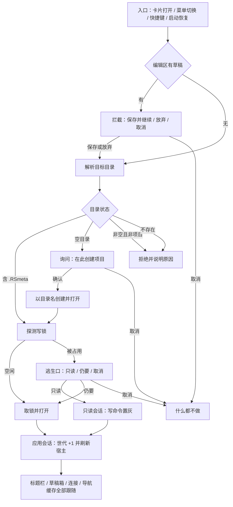
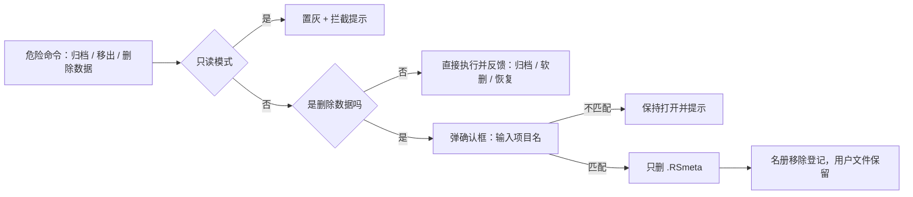
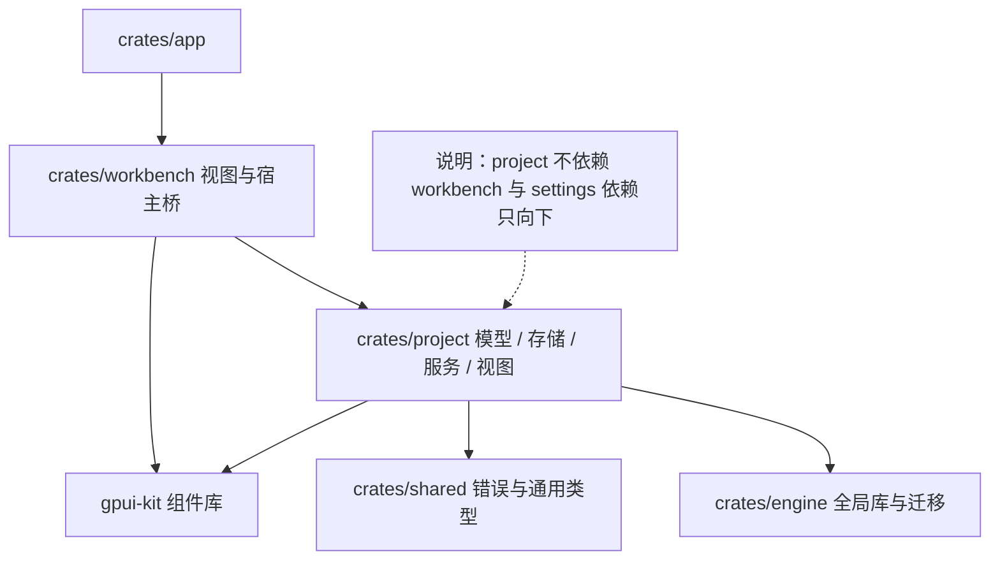

# RdataStation · 项目管理 —— 一页看懂

> 工作台入口那格「项目」背后的事：**打开哪个项目、它现在能不能写、删掉能不能找回。**
> **一实例一项目 · 名册与本体分离 · 危险操作三道门 · 命令只有一份口径。**
>
> 本页是**可贴版**（纯文本 + 表格，适合贴进 PR / wiki / 聊天）；视觉版见
> [`project-showcase.html`](project-showcase.html)（自包含、明暗双主题、离线可开；首屏可在
> 「选择器 / 项目设置 / 逃生口」三个线框间切换，可模拟只读置灰与搜索 facet 收窄）。
> 两版章节一一对应；视觉版把界面线框放在首屏，本页把它拆进第 7 / 9 / 10 节。

---

## 一句话

**一个窗口只装一个项目——打开就是拿到写锁，切项目就是关掉它；磁盘上的东西只在一处记账。**

它不是一个「打开文件夹…」按钮：**项目要登记**（名册，否则下次找不到）、**写锁要独占**
（一个实例一个项目，被占用时给逃生口）、**删数据要点名**（输入项目名，且只删 `.RSmeta`，
用户文件留着）、**改坏了能回头**（移出可找回、路径失效可重定位）。

### 它替你做到的事

| 你关心的 | 它给什么 |
| --- | --- |
| 我上次那个项目在哪 | 名册（全局库 `project_info`）+ 搜索（名称 / 描述 / 路径）+ 固定置顶 + 排序（最近打开 / 名称 / 创建时间，跨会话保留） |
| 会不会开重、把库写坏 | **OS 文件锁**写进 `.RSmeta/project.lock`：一个实例一个项目；被占用时三选一——**只读打开 / 仍要打开 / 取消** |
| 只想看一眼，不想改 | **只读打开**：写命令**可见但置灰**（卡片菜单 / 标题栏菜单 / 设置面板），真去触发也会被拦下并说原因 |
| 切项目时草稿怎么办 | **未保存拦截**：保存并继续（另存为项目草稿）/ 放弃更改并继续 / 取消；确认后**直达**目标对话框，不用回选择器再点一次 |
| 删错了怎么办 | **移出列表**是软删（磁盘不动，可在「已移除」找回）；真删数据要**输入项目名**，且只清 `.RSmeta`——`scratchpad/`、`.sql` 等用户文件不动 |
| 目录被搬走了 | 卡片标记「路径已失效」→ **重新定位…** 指到新目录（名册与本体一起改） |
| 项目信息散在各处吗 | 名称 / 描述**双写**：名册（列表用）+ 项目本体 `project.json` / `project.db`（项目自己用）；**磁盘目录名永不因为改名而变** |
| 排障要看内部结构 | 设置·存储段是 `.RSmeta` **结构树**（目录在前 + 大小 + 合计 + 行尾「复制路径」），另有「打开 `.RSmeta`」入口（会暴露内部结构，界面已注明） |
| 怎么记住常用连接 | 设置·默认项：把某个连接记为项目**默认连接**（写项目本体 `settings.json`，空 = 不设默认），候选来自当前作用域可见的连接 |

---

## 1. 为什么它不是一个「打开文件夹…」按钮

四处「看着能做、其实没兜住」的做法，逐条换成了真东西。

| 常见做法 | 现在 |
| --- | --- |
| 随手打开一个目录就算项目：下次靠记忆找路径，重装或换机器就失联 | **名册 + 本体两层**：全局库记「有哪些项目、最近打开、是否固定、是否移除」，`.RSmeta` 记「这个项目自己怎么跑」 |
| 同一个项目开两个窗口，各自写各自的库，最后不知道谁对 | **一个实例一个项目**：打开 = 取 OS 文件锁；占用时**不硬拒**，给「只读打开 / 仍要打开 / 取消」逃生口（陈旧锁会被自动释放） |
| 删项目 = `rm -rf`，用户文件一起没了，也无法后悔 | **软删可找回**（移出列表）+ **硬删要点名**（输入项目名，`danger` 按钮），且只删 `.RSmeta` |
| 有草稿时点「切换项目」直接丢内容 | **未保存拦截**三态确认；选「保存并继续」会先把草稿另存成项目草稿（重名自动加序号）再继续 |

---

## 2. 一个项目，两处记录（心智模型）

**两处记录各回答一个问题，谁也不许越界。**

| 记录 | 位置 | 回答 | 谁可写 |
| --- | --- | --- | --- |
| **名册** | 全局库 `project_info`（跨项目共享） | 我**有哪些项目**、最近打开、固定 / 已移除、显示名与描述 | 项目管理自己（创建 / 改名 / 固定 / 软删 / 恢复） |
| **本体** | `{项目}/.RSmeta/`（随项目走） | 这个项目**自己怎么跑**：配置、连接引用、分析库、版本台账、写锁 | 项目视图 + 各功能模块（Query / Mock / 洞察都写这里） |

```
{项目}/                     ← 用户文件与项目元数据同处一个目录，但删数据只动后者
├── scratchpad/  *.sql      ← 用户文件：任何操作都不碰
└── .RSmeta/                ← 本体（设置里的结构树就是它）
    ├── project.json        ← 项目信息（名称 / 描述 / 路径 / 版本）
    ├── project.db          ← 项目级元数据（SQLite）
    ├── analytics.duckdb    ← 项目分析库
    ├── project.lock        ← 写锁（OS 文件锁，进程退出自动释放）
    ├── config/settings.json← 项目偏好：默认连接（U3）在这里
    └── queries/  project_metadata/
```

> **两条不变量**
> 1. **名册是「找得到」的权威，本体是「用得对」的权威**：改名只改显示名与两处记录，**磁盘目录名永不变**。
> 2. **删除只动 `.RSmeta`**：名册记账与用户文件是两条命，删数据不牵连任何一条。

---

## 3. 三个高光

### HIGHLIGHT 1 · 一个实例一个项目，但不把人堵死

写锁是 **OS 文件锁**（`project.lock`）：进程退出 / 崩溃自动释放，不会留下「打不开的项目」。
锁被占用时不是一句「已在另一实例打开」了事，而是**三选一逃生口**：

`只读打开` · `仍要打开`（确认对方已退出后接管）· `取消` ；占用者 pid 直接写进对话框，
并说明「若该进程已退出（崩溃 / 断电留下的陈旧锁），锁会被系统释放，选『仍要打开』即可接管」。

### HIGHLIGHT 2 · 危险操作三道门，每一道都能单独拦住手滑

```
①可见性门   只读模式：写命令全部置灰 —— 点不动，且一眼看得出为什么
②确认门     删除数据：必须输入项目名 —— 复制粘贴都会慢一拍
③范围门     只删 .RSmeta —— 用户文件（scratchpad / *.sql）原地不动
```

`软删与硬删分开` · `移出列表可在「已移除」找回` · `硬删按钮用 danger 变体`

### HIGHLIGHT 3 · 每一类命令只有一份口径

同一对象上的命令**不写两套**：标题栏菜单与卡片菜单各自是一份**纯函数规格**
（顺序 / 文案 / 图标 / 可用性），渲染只按 id 挂事件。于是：

`⋯ 下拉 = 右键菜单`（同一份卡片规格）· `选择器 Tab = Tab 键可达`（语义 Button 自带焦点）·
`只读置灰策略只有一处` · `规格可逐项断言`（`PopupMenu` 不暴露内部项，抽出来才测得到）

---

## 4. 四个剧本 · 它替你做什么

### 剧本 A · 从零到一个能写 SQL 的项目 → 省下手抄路径

1. **新建**：填名称（校验：非空 / ≤ 64 字 / 不含 `\ / : * ? " < > |`）；位置点「浏览…」用**系统目录选择器**
   （只允许选目录、单选），下方实时显示 `目标：位置/名称` 预览。
   `＋ 新建项目` `浏览…` `目标预览`
2. **或者打开现有的**：指向含 `.RSmeta` 的目录即可；**空目录**会先问一句「在空目录创建项目？」
   （确认后以目录名为项目名在其中创建并打开），**非空且非项目**才会拒绝。
   `🗀 打开文件夹…` `空目录询问`
3. **或者什么都不建**：「▦ 从示例项目开始」在系统数据目录生成一个带示例草稿的示例项目——无网络也能开工。
   `示例项目` `welcome.sql`

### 剧本 B · 项目被别的实例占着，但我只想看一眼 → 不动写锁

1. **看提示**：打开时弹逃生口，写清占用者 pid 与三个选项。
   `逃生口` `pid`
2. **选「只读打开」**：能看不能改——卡片菜单 / 标题栏菜单 / 设置里的写命令**全部置灰**，
   输入框也禁用；真去触发（例如快捷键或程序路径）会被第二道拦截层拦下并给提示。
   `只读（写操作已禁用）`
3. **看够了就退**：只读**不禁看、不禁走**——切项目、关闭项目、在资源管理器中显示照常可用。
   `切换项目…` `关闭项目`

### 剧本 C · 手上有草稿，但要切项目 → 内容不丢

1. **点切换 / 关闭**：编辑区有未保存草稿时先出拦截对话框（不是先丢掉）。
   `未保存拦截`
2. **选一条路**：**保存并继续**（草稿另存为项目草稿 `未命名.sql`，重名自动加序号）/
   **放弃更改并继续** / **取消**。
   `保存并继续` `放弃更改并继续`
3. **继续往下走**：确认后**直达**你原本要去的对话框（新建项目 / 打开目录），
   不需要回选择器再点一次——这是被拦一次之后最容易招骂的地方。
   `PendingAction` `直达目标`

### 剧本 D · 磁盘上的项目我不要了 → 分两步，能后悔

1. **先轻后重**：只想让它从列表消失 → 卡片 `⋯` →「移出列表」（软删；磁盘不动）。
   `移出列表` `软删`
2. **要找回**：选择器「已移除」Tab → `⋯` →「恢复」。
   `已移除` `恢复`
3. **真要清掉**：卡片 `⋯` →「删除数据…」（红色危险按钮）→ 输入项目名 → 确认；
   只删 `.RSmeta`，用户文件留着。设置·危险区是同一批命令的第二个入口。
   `删除数据…` `输入项目名` `只删 .RSmeta`

---

## 5. 一次打开的全流程



**三道岔路各自的兜底**

| 岔路 | 兜底 |
| --- | --- |
| 草稿 | 三态确认；「保存并继续」把草稿落成项目草稿；确认后**直达**目标动作 |
| 空目录 | 不擅自当项目打开，也不直接拒绝——问一句再创建 |
| 锁占用 | 不硬拒：只读打开（默认推荐）/ 仍要打开（清陈旧锁后重抢）/ 取消 |

---

## 6. 危险区 · 三道门



| 命令 | 语义 | 能后悔吗 |
| --- | --- | --- |
| 归档 / 取消归档 | 状态 `active ⇄ archived`，仍在名册（列表可筛 `状态:archived`） | 随时反向操作 |
| 移出列表 | 软删：从最近 / 全部隐藏，磁盘不动 | 「已移除」Tab → 恢复 |
| 删除数据 | 硬删：删 `.RSmeta` 并从名册移除 | 不能（所以要点名） |

---

## 7. 卡片解剖

```
┌──────────────────────────────────────────────────────────────────┐
│ 风控看板        active   ★                      [打开]  [⋯]      │  ← 显示名 · 状态 · 固定 · 主操作 · 更多
│ D:\work\风控看板                                                  │  ← 完整路径（不截断来源）
│ 月末对账用的项目（描述，有才显示）                                  │  ← R7：描述属于元信息
│ 最后打开：2026-09-19 10:12 · 状态：active                          │
│ ⚠ 路径已失效，可能已移动或删除        ● 已在另一实例打开            │  ← 只在有问题时出现
└──────────────────────────────────────────────────────────────────┘
```

| 位置 | 元素 | 规则 |
| --- | --- | --- |
| 主操作 | 「打开」按钮 | 常显；与右键 / 菜单里的「打开」同一入口（同样过未保存拦截） |
| 次要命令 | `⋯` 下拉 / 右键菜单 | 同源规格：打开 · 固定 · 在资源管理器中显示 · 移出列表 · 删除数据…（失效时换成重新定位…） |
| 状态 | 文本 + 颜色 | `active` 绿 / `archived` 灰 / `offline` 黄 / `syncing` 蓝；**不靠颜色单独表意** |
| 固定 | ★ | 固定项置顶，跨会话保留（写名册 `is_pinned`） |
| 只读 | 菜单项置灰 | 只读打开时写命令置灰；读命令（打开 / 显示位置 / 恢复查看）保留 |

---

## 8. 搜索与筛选

搜索框既是自由文本，也是 **facet 查询**：

| 写法 | 含义 |
| --- | --- |
| `风控` | 自由文本：匹配名称 / 描述 / 路径（大小写不敏感） |
| `状态:archived` | 按状态收窄（`active` / `archived` / `offline` / `syncing`；`状态:全部` 解除约束） |
| `固定:是` | 只看固定项（也认 `true` / `yes` / `1`；`固定:否` 反之） |
| `锁:是` | 只看已被另一实例占用的项目（`锁:否` 反之） |
| `状态:offline 对账` | facet 与自由文本**叠加（AND）** |

- 与「状态：」筛选按钮**取交集**（两边都要过），facet 不写回按钮，避免「回写 → 重解析」的反馈环与光标跳动。
- **认不出的 token 一律回落自由文本**（`描述:报表`、`状态:离`、`C:\data`）——口径与 database 导航面板一致：
  光标还在输入框里，列表不该被一个半成品 token 清空。
- facet 生效时计数旁标注「已按 facet 收窄」，否则用户会以为「搜不到 = 数据没了」。

---

## 9. 只读模式 · 两道防线

| 防线 | 做法 | 覆盖 |
| --- | --- | --- |
| ① 可见性 | 写命令**可见但置灰**（`disabled`），设置面板写控件禁用、只读说明常显 | 卡片菜单 · 标题栏菜单 · 设置（名称 / 描述 / 保存 / 默认连接 / 创建版本 / 危险区三件套） |
| ② 拦截层 | `read_only_blocked`：写入口先过一道守卫，被拦下就写提示并重绘 | 保存项目信息 · 归档 · 创建版本 · 默认连接 · 以及任何绕过 UI 的调用路径 |

> 只读是「**不许写**」，不是「不许看、不许走」：切换项目 / 项目设置 / 在资源管理器中显示 /
> 关闭项目始终可用——用户永远能退出去。

---

## 10. 键盘 · 右键 · 菜单

| 操作 | 入口 |
| --- | --- |
| `Tab` / `Shift+Tab` | 搜索框 → 最近 / 全部 / 已移除 → 状态 → 排序 → 卡片上的「打开」/`⋯`；全部是语义 `Button`，自带焦点环与 `tab_stop` |
| `Enter` / `Space` | 激活当前聚焦控件（切 Tab、换状态筛选、切换排序、开菜单）——gpui 元素在 **KeyUp** 上派发键盘点击 |
| `↑↓` / `Enter` / `Esc` | 下拉菜单内导航 / 选中 / 关闭（组件自带） |
| 右键卡片 | 调出该卡片命令菜单（与 `⋯` 同源） |
| `Ctrl+Shift+P` / `Ctrl+Shift+W` | 切换项目 / 关闭项目（工作台命令） |

> 命令入口三处、规格一份：**标题栏菜单**（`project_menu_entries`）· **卡片 `⋯` 与右键**（`card_menu_entries`）。
> 需要键盘焦点的元素不用会变的 `ElementId`（例如状态筛选按钮的 id 固定为 `picker-status`，
> 不随筛选值变——否则一换筛选就丢焦点）。

---

## 11. 架构 · 视图自带，能力靠宿主注入



**为什么视图在 crate 里**：面板视图以前住在工作台，要穿过一堆工作台服务。现在 `project` crate
自带视图（`ui.rs`），宿主（工作台）只提供**六个注入点**，依赖单向、可独立演进与测试：

| 注入点 | 宿主给什么 |
| --- | --- |
| `state` / `session` | 项目 UI 状态（选择器 / 设置 / 只读 / 世代）与当前会话（根 + 名） |
| `ProjectUiNotifier` | 重绘桥（弱引用，避免宿主与视图成环） |
| `ProjectEditorBridge` | 编辑区桥：草稿是否脏 / 取草稿内容 / 清空 / 标记已保存 |
| `save_sort` | 排序偏好持久化（写设置服务） |
| `on_opened` | 打开后刷新宿主（连接列表 / 导航缓存 / 结果归属 / mock 临时表清场） |
| `connections` | 默认连接候选（全局 + 项目作用域连接，投影成 id + 名称） |

```
代码地图（crates/project/src）
  models.rs   域模型：Project / ProjectInfo / ProjectConfig / ProjectPath / Version
  store.rs    .RSmeta 创建·加载·迁移 + 配置就地读写 + 依赖自检
  lock.rs     实例锁：OS 文件锁 + project.lock.owner 占用者信息
  service.rs  编排：列表 / 创建 / 打开（含只读）/ 关闭 / 改名 / 固定 / 归档 / 软删 / 恢复 / 硬删 / 重定位 / 默认连接 / 版本
  ui.rs       视图：选择器 · 标题栏菜单 · 卡片与菜单规格 · 设置 · 语义对话框 · 宿主桥
  ui/tests.rs 窗口测试与纯函数测试
```

**render 是纯读路径**：需要磁盘或名册的显示内容（`.RSmeta` 结构树、描述、缺失驱动、默认连接值）
在**事件路径**取一次存进快照（`SettingsSnapshot`），渲染只读快照——不在每帧遍历目录或查库。

---

## 12. 质量与证据

| 维度 | 做法 |
| --- | --- |
| **窗口测试** | 真窗口 + headless 跑视图：选择器渲染 / 对话框开关 / 未保存拦截 / 排序持久化 / 浏览目录 / 空目录询问 / 只读拦截 / 键盘激活（`Tab` 停靠 + `Enter` 真改状态，按 KeyUp 语义发键） |
| **纯函数优先** | 可判定的都拍成纯函数：搜索 facet 解析 · 可见条目筛选 · 菜单规格 · 结构树枚举 · 卡片描述 · 默认连接文案——逐项断言，不依赖窗口 |
| **契约与规范** | 视图零裸色值（一律 `cx.theme().colors.*`）；尺寸走 rem 常量；不用通配导入（会撞 gpui 的 `test` 宏）；对话框按栈语义关闭 |
| **跨模块回归** | 名册端到端（创建登记 → 固定置顶 → 软删隐藏 → 已移除找回）与磁盘集成（`.RSmeta` / 实例锁 / 默认连接）各有一组集成测试 |

```
cargo test -p rds-project -j 2
  lib                 43 通过（20 项窗口测试 + 9 项纯函数 + 存储 / 锁 / 模型内部用例）
  project_registry     1 通过（名册端到端）
  project_store        4 通过（磁盘 .RSmeta · 实例锁 · 默认连接）
cargo test -p rds-workbench --lib -j 2   → 110 通过
cargo check --workspace --all-targets    → 零告警
```

> 使用侧验收清单见 [`project-user-guide.md`](project-user-guide.md) §9；
> 视图测试的坑（`#[test]` 宏遮蔽、对话框要有 `Root`、键盘激活在 KeyUp）见
> [`project-view-architecture.md`](project-view-architecture.md) §6。

---

## 13. 边界 · 这些事它不做

| 做 | 不做 |
| --- | --- |
| 项目的**生命周期与名册**：创建 / 打开 / 只读 / 切换 / 关闭 / 改名 / 描述 / 默认连接 / 归档 / 移出 / 找回 / 硬删 / 重定位 | **连接的新建与编辑**（连接对话框属连接模块，这里只记「默认连接」这一个偏好） |
| 选择器（最近 / 全部 / 已移除 · 搜索 facet · 状态筛选 · 排序 · 固定） | **SQL 执行 / Mock 生成 / 洞察本体**（各自模块；这里只提供入口与项目归属） |
| 项目设置（概览 / 基本信息 / 默认项 / `.RSmeta` 结构树 / 依赖自检 / 版本快照 / 危险区） | **移动或另存项目目录**（改名不动目录，移动不在本期） |
| 未保存草稿拦截、实例锁与逃生口 | **版本恢复与对比**（只做快照台账，恢复未列） |
| 示例项目（离线可开工） | **DuckLake 远程项目**（`ProjectPath::Remote` 仅模型层预留，UI 不接受 URL） |
|  | 提升 / 引用（promote / snapshot，原型已列范围为不做） |

**已知待办**（记在 [`project-dev-plan.md`](project-dev-plan.md) §8）

| 项 | 说明 |
| --- | --- |
| ~~窗口退出路径的草稿兜底~~ | ✅ 已做（2026-09-19）：`app` 注册 `Window::on_window_should_close` → 每份打开文档的会话落库（存了再走，不拦人） |
| 执行 SQL 的只读拦截测试 | 项目侧的只读拦截已有窗口测试；editor 侧执行路径未测 |
| 菜单快捷键展示 | `PopupMenuItem` / `DropdownButton` 在 gpui-kit 0.6.1 没有 shortcut 槽位，等组件支持 |

---

## 14. 文档地图

| 文档 | 什么时候读它 |
| --- | --- |
| [`README.md`](README.md) | 模块入口：一句话 / 文档索引 / 特点速览 / 状态（本页是它的宣传版） |
| [`project-prototype-design.md`](project-prototype-design.md) | **交互语义与范围**：9 条决策、CRUD 全表、状态机、主题映射、范围外清单（权威） |
| [`project-prototype.html`](project-prototype.html) | **长什么样**：选择器 / 项目菜单 / 新建 / 设置 / 拦截与锁弹层的可交互原型（明暗双主题） |
| [`project-dev-plan.md`](project-dev-plan.md) | **怎么分工做的**：P0/A/B/C 任务、进度记录（含每轮补齐）、测试场景、风险、实现位置映射、§8 未开发清单 |
| [`project-view-architecture.md`](project-view-architecture.md) | **视图怎么接宿主**：`ProjectUiHost` 契约、状态所有权、对话框栈语义、窗口测试方案与三个坑 |
| [`project-user-guide.md`](project-user-guide.md) | **怎么用**：界面导览、典型流程、状态与提示速览、键盘操作、数据与安全、FAQ、验收清单 |
| `../../../crates/project/README.md` | crate 入口：模块特点提炼、代码落点、约定（改代码前先读它） |

---

> 快照：2026-09-19 · 对应 `cargo test -p rds-project -j 2` 全绿（lib 43 / 集成 5）与
> `cargo check --workspace --all-targets` 零告警。数字会过期，口径在测试与文档里。
