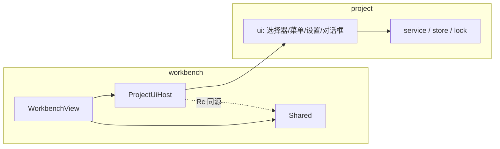

# 项目视图架构 · 宿主桥与窗口测试（M1 / A3）

> 状态：**已实现**（2026-09-11） · 关联：`project-prototype-design.md`（交互语义）、`project-dev-plan.md`（任务与进度）
> 适用读者：改 `crates/project/src/ui*` 或 `crates/workbench/src/components/project_host.rs` 的人

## 1. 目标与约束

GPUI-kit 编码指南要求「同一业务能力的 model / service / view / dialog 放同一 feature crate」。项目视图原先在 `crates/workbench/src/components/project_ui.rs`，与 `crates/project` 的 model / service 分离，且反向依赖 `workbench::Shared`、`workbench::WorkbenchView` 与 `settings::SettingsService`。

A3 把视图整体迁入 `crates/project/src/ui.rs`，并把「宿主能力」抽成显式契约：

| 约束 | 落地方式 |
| --- | --- |
| `project` 不依赖 `workbench` / `settings` | 全部外部依赖经 `ProjectUiHost` 注入，crate 只多一个 `gpui-kit` 依赖 |
| 宿主仍是唯一的渲染与 I/O 权威 | 视图只返回 `Div`；I/O 只发生在事件回调（对话框点击 / Action / 构造期） |
| 状态只有一份 | state / session 以 `Rc` 共享，宿主与视图看到的是同一份 |

## 2. 契约：`ProjectUiHost`

```rust
pub struct ProjectUiHost {
    pub state: Rc<RefCell<ProjectUiState>>,          // 选择器 / 菜单 / 设置 / 对话框错误 / 锁 / 只读 / 世代
    pub session: Rc<RefCell<Option<OpenProject>>>,   // 当前项目（根 + 名），与宿主 Shared.project 同源
    pub notifier: Rc<dyn ProjectUiNotifier>,         // 重绘宿主视图
    pub editor: Rc<dyn ProjectEditorBridge>,         // 未保存草稿判定 / 内容 / 清空 / 清脏
    pub save_sort: Rc<dyn Fn(ProjectSort, &mut App)>,// 排序偏好持久化
    pub on_opened: Rc<dyn Fn(&mut App)>,             // 打开项目后的宿主刷新
}
```

构造用 `ProjectUiHost::new(state, session, notifier)` + `with_editor` / `with_sort_saver` / `with_on_opened`（`#[non_exhaustive]`，字段不对外展开）。

三个桥 trait 只描述行为，不描述宿主类型：

| trait | 方法 | workbench 实现 |
| --- | --- | --- |
| `ProjectUiNotifier` | `notify(&mut App)` | `WeakEntity<WorkbenchView>` → `entity.update(cx, notify)` |
| `ProjectEditorBridge` | `is_dirty` / `sql` / `clear(window, cx)` / `mark_clean` | 读写 `Shared::{editor_dirty, editor_sql, editor_clear}` |
| （排序偏好）| `Fn(ProjectSort, &mut App)` | `SettingsService::set_project_sort_mode` |

`()` 实现了 `ProjectEditorBridge`（全 no-op），因此测试与无编辑区宿主可以省略 `with_editor`。

### 为什么 notifier 是 `WeakEntity`

host 存在 `WorkbenchView` 的字段里（`project_host: Option<ProjectUiHost>`），而 notifier 指向该实体。若用强 `Entity` 就形成 `WorkbenchView → host → Entity<WorkbenchView>` 的引用环，视图永不析构。弱引用 + `WeakEntity::update` 失败即忽略，正好符合「窗口已关，不必重绘」。

### 状态所有权

| 数据 | 宿主侧字段 | 视图侧入口 |
| --- | --- | --- |
| 当前项目 | `Shared.project` | `host.current()` / `host.root()` / `host.set_current(...)` |
| UI 状态 | `Shared.project_ui` | `host.state`（`Rc` 同源） |
| 编辑区 | `Shared.editor_*` | `host.editor` |
| 排序偏好 | `settings.json` | `(host.save_sort)(...)`；构造期首帧由宿主直读 |



## 3. 生命周期与 I/O 位置

| 时点 | 发生什么 | 在哪 |
| --- | --- | --- |
| 构造（`WorkbenchView::new(cx)`） | 装配 host；直读 `settings.json` 取排序；无项目时加载首屏列表 | 构造期（不在 render） |
| render | `render_picker` / `render_settings` 只读 state 并返回元素；标题栏菜单用 `build_project_menu` 产 `PopupMenu`（宿主 `Button::dropdown_menu` 只负责下拉宿主） | `WorkbenchView::render` |
| 事件回调 | 动作函数（打开 / 关闭 / 增删改查 / 对话框提交）做 I/O 并 `host.notify` | 各处 `on_click` / `on_action` |
| 对话框 | 由 `window.open_dialog` / `open_alert_dialog` 承载；关闭时机由提交结果决定 | 事件上下文 |

## 4. 对话框关闭时机（栈语义）

`Root` 的对话框是**栈**：`window.open_dialog` push，关闭时 `pop` 最后一个。因此：

- `Dialog::on_ok` 一律返回 `false`，不依赖其返回值关闭；
- 提交成功时由回调显式 `window.close_dialog(cx)`；
- 被拦截的动作（打开 / 关闭项目）若会另开对话框（如锁占用），必须**先关本对话框、再推进动作**，否则 `pop` 会关掉新开的那个。

未保存拦截因此拆成两段：`prepare_unsaved`（另存草稿 + 清空编辑区，失败则写 `dialog_error` 并保持打开）→ `advance_pending`（执行被拦截的动作）。

校验错误统一存 `ProjectUiState::dialog_error`：对话框 builder 每帧重读，提交失败时写入并 `notify`，无需重建 builder 闭包状态。

### 位置字段：系统目录选择器

原型的「位置 = 目录选择 + 预览 `位置/名称`」由三件组成：

| 件 | 实现 |
| --- | --- |
| `浏览…` 按钮 | `pick_directory`：`App::prompt_for_paths(files:false, directories:true, multiple:false)` → `Window::spawn` 等 oneshot → `AsyncWindowContext::update` 拿 `&mut Window` 回填 `InputState::set_value`（取消则保持原值） |
| 目录输入行 | `directory_row`：输入框（`flex_1`）+ 浏览按钮，新建 / 打开 / 重定位共用 |
| 目标预览 | `target_preview`：新建对话框展示 `目标：位置/名称`，位置或名称为空时给占位提示 |

要点：`set_value` 需要 `&mut Window`，而异步回调里只有 `AsyncApp`，因此必须走 `Window::spawn`（而非 `Context::spawn`）+ `AsyncWindowContext::update`。测试用 `TestAppContext::simulate_path_prompt_response` 模拟用户选择，注意它**应答已入队的请求**，所以要先用 `pick_directory` 发起、再模拟响应。

## 5. 远程项目（范围说明）

远程项目（`ProjectPath::Remote { url, project_id }`，DuckLake）**只在模型层预留**：`models.rs` 有类型与 `remote()` 构造器，v1 蓝本有对应命令分支；但 `CreateProjectInput` / `ProjectStore::create` / `inspect_target` 全部只处理本地路径，本期明确不做（`project-dev-plan.md`「不做」清单）。新建对话框因此用一行 muted 文案明示范围，避免用户把 URL 填进「位置」。

## 6. 窗口测试方案

位置：`crates/project/src/ui/tests.rs`（`#[cfg(test)] mod tests;`），20 项测试（17 项 GPUI headless 窗口测试 + 3 项纯函数测试）。

### 骨架

| 部件 | 作用 |
| --- | --- |
| `Recorder` | 记录宿主桥调用：重绘次数 / 写回的排序值 / 草稿脏标记 / 清空次数 / 清脏次数 |
| `TestNotifier` / `TestEditor` | `ProjectUiHost` 的两个桥替身，零副作用 |
| `test_host(&rec)` | 组装 host（state / session 与视图共享同一 `Rc`） |
| `Harness` | 宿主视图替身：按状态渲染选择器 / 设置 / 菜单，并挂 `Root::render_dialog_layer` |
| `open_harness(cx, host)` | `cx.add_window_view(|window, cx| Root::new(harness, window, cx))`，返回 host、输入实体与 `VisualTestContext` |

### 覆盖清单（对应 dev-plan §4 场景）

| 测试 | 场景 |
| --- | --- |
| `picker_renders_without_project` | 4：无项目态选择器渲染（空列表不崩） |
| `settings_and_menu_render_for_open_project` | 4 / 13：设置面板 + 菜单内容渲染；只读标记来自宿主 state |
| `create_dialog_opens_and_rejects_empty_name` | 1 / 2：`Dialog` 打开；空名校验失败、错误入 state、对话框保持 |
| `delete_dialog_requires_exact_name` | 6：删除确认名称匹配 |
| `request_close_intercepts_dirty_editor` | 10：脏编辑区 → 关闭被拦截 |
| `request_open_intercepts_dirty_editor` | 10：脏编辑区 → 打开被拦截、不切项目 |
| `cycle_sort_persists_through_host_callback` | 4：排序循环 + 宿主持久化回调 + 重绘请求 |
| `lock_busy_dialog_offers_escape_hatches` | 11：锁占用 `AlertDialog` 打开且不改会话 |
| `cards_and_menus_construct_for_all_states` | 8 / 6：卡片三分支（活跃 / 失效重定位 / 已移除恢复 + 固定）与更多菜单 |
| `browse_fills_location_from_system_picker` | 1：浏览目录 → 回填位置输入框（并断言选择器选项为「仅目录 / 单选」） |
| `browse_cancel_keeps_location` | 1：取消选择器 → 位置输入框保持原值 |
| `empty_dir_prompts_create_in_place` | 2：空目录 → 询问式创建（不直接当项目打开） |
| `save_project_info_rejects_invalid_name` | 5：改名校验（非法字符 / 空） |
| `read_only_blocks_project_info_save` | 11 / C1：只读下写命令被拦（写 notice、不改会话）且设置面板仍可开 |
| `title_bar_menu_builds_in_both_modes` | A4 / C1：两种模式的标题栏菜单都构造得出来（`PopupMenu::build` + `is_empty`） |
| `picker_controls_activate_from_the_keyboard` | C4：`Tab` 能停靠 + `Enter` 能真的改状态（Tab / 状态筛选 / 排序） |
| `visible_items_filters_by_status_and_needle` | 4 / R4：搜索子串 ∩ 状态筛选（纯函数） |
| `menu_spec_greys_out_write_commands_in_read_only` | C1：只读置灰清单（写命令置灰、读命令与出口可用） |
| `menu_spec_keeps_escape_hatches_without_leading_separator` | C1 / B1：分隔线位置与「逃生口不被藏住」 |

不覆盖：真实建库与迁移（`crates/project/tests/project_store.rs` 集成测试）、双实例并发（手动清单）、主题视觉（`theme-preview.html` 基准）。

### 三个必须知道的坑

1. **`#[test]` 自相残杀**：gpui 的 `test` 宏展开成裸 `#[test]`。测试模块若 `use gpui_kit::*`（或 `use super::*` 间接引入它），`#[test]` 会解析到 gpui 的宏自身，无限递归 —— 报错 `recursion limit reached while expanding #[test]`，且提高 `recursion_limit` 只会让需求跟着翻倍。解法：测试模块显式列举依赖（含 `AppContext as _` / `StyledExt as _` / `WindowExt as _` 等 trait）。
2. **对话框要有 `Root`**：`window.open_dialog` 依赖窗口根为 `component::Root`；且宿主视图的 `render` 必须自己挂 `Root::render_dialog_layer(window, cx)`，否则对话框存在但不渲染。断言用 `window.has_active_dialog(cx)`。
3. **键盘激活在 KeyUp，不在 KeyDown**：gpui 的可点元素在 `KeyUpEvent` 上派发 `ClickEvent::Keyboard`；`cx.simulate_keystrokes("enter")` 只发 KeyDown，验证「Enter 能点」时必须 `simulate_event(KeyDownEvent)` + `simulate_event(KeyUpEvent)` 各发一次（另：`Tab` 顺序来自上一帧布局，先 `window.draw(cx).clear(cx)` 再 `window.focus_next(cx)`）。

## 7. 实现位置映射

| 设计决策 | 代码文件 |
| --- | --- |
| 项目视图（选择器 / 菜单 / 设置 / 对话框） | `crates/project/src/ui.rs` |
| 宿主契约（`ProjectUiHost` / 三个桥 trait / `OpenProject`） | 同上（文件头「宿主桥」一节） |
| workbench 侧桥接与装配 | `crates/workbench/src/components/project_host.rs` |
| 会话类型与解析 | `crates/project/src/ui.rs`（`OpenProject`）、`crates/workbench/src/services/project_session.rs`（`resolve`） |
| 共享状态字段 | `crates/workbench/src/panels/`（`Shared::{project, project_ui, editor_*}`） |
| 标题栏项目槽 + 菜单 | `crates/workbench/src/view.rs`（`render_title_bar`；`Button::dropdown_menu` + `project::ui::build_project_menu`） |
| 菜单规格（顺序 / 文案 / 可用性） | `crates/project/src/ui.rs`（`project_menu_entries` 纯函数 + `attach_project_menu_handler`） |
| 窗口测试 | `crates/project/src/ui/tests.rs` |
| 视图测试规范 | `.agents/skills/gpui-kit-dev/SKILL.md`（「窗口测试」一节） |
| 位置字段（系统目录选择器 / 目标预览） | `crates/project/src/ui.rs`（`pick_directory` / `directory_row` / `target_preview`） |

## 8. 验证方式

```bash
cargo check --workspace --all-targets          # 零告警
cargo test --workspace -j 2                    # 全量（-j 2 硬性要求）
cargo test -p rds-project --lib -j 2           # 只跑项目 crate（34 项，迭代快）
cargo build -p rds-app -j 2                    # codegen 验证（check ≠ 能出机器码）
```

注意：`cargo test --workspace` **必须带 `-j 2`**（并行链接重型 crate 会耗尽内存（DuckDB 已改动态链接），见 `.cargo/config.toml` 的 `test-all` 别名）。
