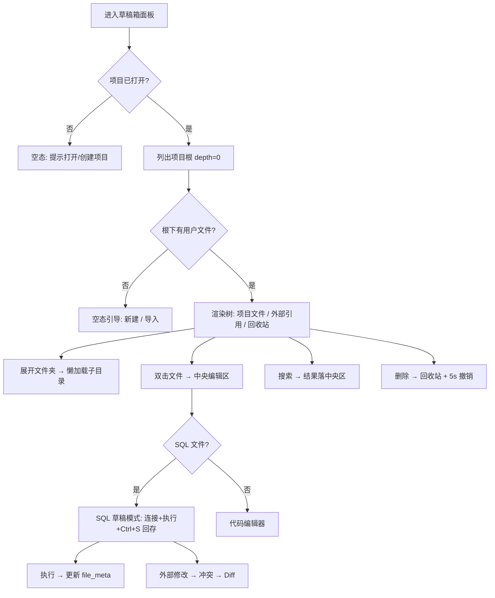
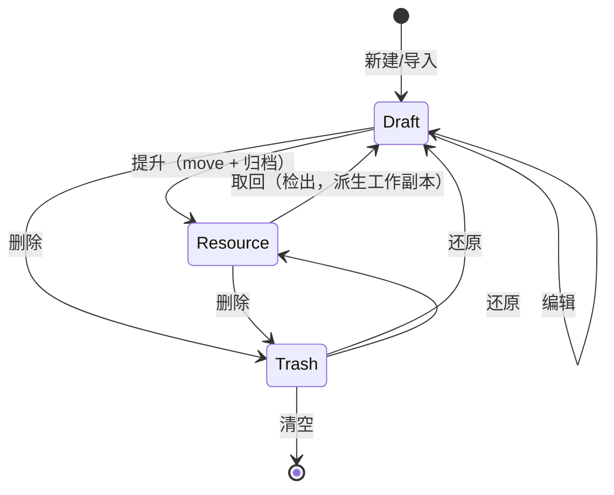

# 草稿箱模块 · 原型设计（项目工作区）

> 状态：**模块根语义 + 项目级回收站 + 面板自身闭环（新建/重命名/删除→回收站+撤销/过滤/引用移除）已落地**（2026-09-11） · 关联文件：`scratchpad-prototype.html`（可交互原型）、`scratchpad-dev-plan.md`（开发方案与进度）
> 参考基准：v1 实现（`v1/backend/src/core/scratchpad`、`v1/frontend/extensions/builtin/scratchpad`）与设计（`v1/docs/backend/SCRATCHPAD_DESIGN.md`、`SCRATCHPAD_SCHEMA.md`、`v1/docs/frontend/SCRATCHPAD.md`）
> 布局服从 `docs/architecture/layout/layout-design.md`（五段布局，左侧 Dock 240px，`LeftPanel::Draft`）；配色服从 `docs/architecture/theme/theme-design.md`（RDS Light/Dark，`assets/themes/rds-theme.json`）
> 技术栈：GPUI（gpui-kit 0.6），组件消费 `cx.theme()` 语义 token，**代码零裸 hex**

## 1. 设计基准与 v2 语义变更

| 维度 | 基准 | 说明 |
| --- | --- | --- |
| 布局 | 五段布局（已定） | 草稿箱 = 左侧 Dock 内容，`LeftPanel::Draft`，起步宽度 240px（可拖拽调宽） |
| 后端 | `crates/scratchpad`（已迁移） | `models` / `state` / `store`，47 个方法（列表/CRUD/回收站/搜索/替换/Diff/外部引用/可分析文件） |
| 交互蓝本 | v1 `ScratchpadPanel.vue` + `TreeNode` | 工具栏 / 分层树 / 内联创建重命名 / 右键菜单 / 回收站 / 搜索上下文 / 多选 / 撤销栏 |
| 配色 | `theme-design.md` | 侧栏 `sidebar`、选中 `list.active` + coral 左边条、弹层 `popover`、主按钮 `primary` |
| 主题 | `rds-theme.json` | 复用标准字段，尽量不新增产品语义 token（见 §6） |

### 1.1 核心模型：模块独立根目录

v1 的草稿箱是项目下的隐藏子目录 `{project}/.scratchpad/`。v2 定稿为 **每个模块在项目根下拥有一个可见的内容目录**（模块中心）：

- **草稿箱根 = `{project}/scratchpad/`**（可见、可编辑），面板只展示此目录内的内容——「在 `scratchpad/` 里的就是草稿」，无需忽略规则、无需扫描整个项目。
- 草稿箱**内部元数据**（配置/文件元数据）落 `.RSmeta/scratchpad/`，不进内容目录。
- **回收站为项目级 `.RSmeta/trash/`**，收录草稿与资源等模块删除的条目（自带来源信息，见 §9）。
- 未来 `resources/`（M6 分析资源）、`mock/`（M7）同样是项目根下的模块目录。

```
{project}/
├── scratchpad/                      ← 草稿箱根（模块内容，可见）
│   ├── data/report.sql
│   ├── 临时订单分析.sql
│   └── sample.csv
├── resources/                       ← M6 分析资源（后续）
├── mock/                            ← M7 Mock 产物（后续）
└── .RSmeta/                         ← 隐藏：项目内部元数据
    ├── project.db / project.json / analytics.duckdb
    ├── session/                     # 编辑器标签/未命名缓冲区（后续）
    ├── scratchpad/config.json       # 草稿文件元数据 + 外部引用
    └── trash/                       # 项目级回收站（草稿 + 资源）
```

> 设计取舍：保留面板名「草稿箱」（活动栏图标 / Quick Open `打开草稿箱` 命令已注册）；「草稿」与「正式资产」由 **`scratchpad/ → resources/` 的提升（存档）机制** 区分（§9.3）。

## 2. 面板布局（240px 左 Dock）

草稿箱面板嵌入左侧边栏，结构自上而下四段：面板头 / 工具栏 + 搜索 / 树主体 / 底部状态。宽度受限，工具栏压成单排小图标按钮。

```
┌ 左侧边栏 240px（sidebar 底）──────────┐
│ 草稿箱                          [⋯]  │  ← 面板头（Dock tab，36px）
├ 工具栏（icon 按钮，28px）─────────────┤
│ [＋][📁＋][导入][引用][⤓][↻]        │
├ 搜索框（可切换 文件名 / 内容）────────┤
│ [🔍 搜索文件…]              [.*][Aa] │
├ 树主体（滚动，虚拟列表 >50）─────────┤
│ ▼ 📁 草稿 · 营销分析                   │
│   ▸ 📁 data                          │
│   📜 临时订单分析.sql          ●     │  ← ● 脏点（未保存）
│   🐍 transform.py                    │
│   📊 sample.csv                      │
│   [新文件名…]                        │  ← 内联创建（选中文件夹后）
│ ▼ 🔗 外部引用 (1)                    │
│   ⚡ 下载数据  D:\data\              │
│ ▶ 🗑 回收站 (3)                      │
├ 底部状态（11px，muted）──────────────┤
│ 12 个文件 · 3 个文件夹 · 项目:营销分析 │
└──────────────────────────────────────┘
```

### 2.1 工具栏（单排图标，悬浮出文字提示）

| 按钮 | 行为 | 对应后端 |
| --- | --- | --- |
| `＋` 新建文件 | 选中文件夹下内联输入；可选模板（SQL/JSON/Markdown/Python） | `create_entry` |
| `📁＋` 新建文件夹 | 选中文件夹下内联输入目录名 | `create_entry(is_folder)` |
| `导入` | 系统文件对话框 → 复制进项目根（或选中目录） | `import_external_file` |
| `引用` | 添加外部目录/文件别名引用（不复制） | `add_external_reference` |
| `⤓` 排序 | 名称 / 大小 / 修改时间，点击切换升降序 | 前端计算（`list_directory_entries` 数据） |
| `↻` 刷新 | 重新拉取树（文件监控之外的兜底） | `list_local_entries` |

### 2.2 空态

项目根无任何用户文件时显示引导（大图标 + 标题 + 说明 + 「新建」「导入」双按钮），避免 240px 版面显得空洞。

## 3. 树与分组

- **项目文件**（根组）：`ScratchpadEntry` 递归树，文件夹最多 4 层（`MAX_DEPTH`）；初始 `depth=0` 懒加载，展开文件夹时按需 `list_directory_entries(parent)`。
- **外部引用**：`ExternalReference{ alias, path }` 平铺列表，标题带计数；校验路径合法且不含 `..`（v1 `isRefValid`），非法项置灰并给出提示。
- **回收站**：折叠区，标题带计数；展开后 `list_trash` → 每项「恢复」，头部「清空」。
- **行视觉**：
  - 选中：`sidebar.accent.background` 底 + 左侧 2px `list.active.border`（品牌 coral）条
  - 悬停：`list.hover.background`
  - 文件夹展开箭头 `Disclosure`（▸/▼）；文件图标按后缀映射（§6.3）
  - 修改时间：相对时间（<1 分钟 / N 分钟 / N 小时 / N 天，7 天内），置于行尾 muted
  - 脏点 `●`：`dirtyFiles` 集合中的文件，颜色 `primary`；`Ctrl+S` 保存后消失

## 4. 核心交互

### 4.1 新建 / 重命名（内联，非模态）

- 新建：选中文件夹 → 工具按钮 → 树中该目录下插入输入框，Enter 提交、Escape 取消；**根目录新建**默认创建在项目根。
- 模板：新建文件时可从 `SQL / JSON / Markdown / Python` 选模板，自动补后缀并填充占位内容。
- 重命名：右键「重命名」或 `F2` → 行内输入框；提交时输入禁用 + 旋转指示，防重复提交；空值不提交。

### 4.2 打开文件（联动中央编辑区）

```
双击文件
  └── 按后缀选择编辑器
        ├── .sql → 中央编辑区 SQL 编辑器（草稿箱文件模式）
        │     · 标题 = 文件名；Ctrl+S → 保存回 `scratchpad/`（原子写）
        │     · 保留连接选择与完整执行引擎（单/多语句、选中执行）
        │     · 自动恢复 file_meta.last_connection_id
        │     · 关闭方言转换 / DuckDB 加速 / 执行计划（草稿场景不需要）
        ├── .py / .json / .md / .txt → 代码编辑器（语法高亮）
        └── 其他 → 系统默认程序打开
```

> 同一文件不重复开 Tab，已存在则聚焦。多文件 Tab 体系属中央编辑区独立工作项；Phase C 先打通「单文件 → 编辑器 → 回存」。

### 4.3 搜索（两种模式，重结果落中央区）

- **文件名模式**（默认）：输入实时过滤树（匹配名称 + 引用别名/路径）。
- **内容模式**：`.*` 切正则（前端 `Regex` 预校验）、`Aa` 切大小写敏感；调 `search_file_content` 流式扫描（大文件不跳过，`BufReader` 逐行，30s/文件超时，结果 500 条截断）。
- 结果含**匹配行 + 前后 2 行上下文**，高亮匹配文本；点击行号 → 打开文件并跳转到该行。
- 结果集较大，渲染在**中央编辑区**（专用「搜索」面板），侧栏只承载输入与摘要，避免 240px 拥挤。

### 4.4 文件操作

| 操作 | 行为 | 后端 |
| --- | --- | --- |
| 删除 | 软删除进 `.RSmeta/scratchpad/trash/`；底部弹出 5s 撤销栏 | `delete_entry` / `restore_from_trash` |
| 批量删除 | 多选（Ctrl 点选 / Shift 范围 / Ctrl+A 全选）→ 右键或 Delete | `delete_entry` × N |
| 剪切移动 | 右键「剪切」→ 粘贴到目标文件夹（`fs::rename`）→ 5s 撤销栏 | `move_entry` |
| 复制 | 右键「复制」→ 粘贴生成 `_copy` 副本 | `create_entry` + `read/save_file` |
| 导入 | 系统文件对话框复制进项目 | `import_external_file` |
| 外部引用 | 添加别名 + 路径引用（不复制）；可移除 | `add/remove_external_reference` |
| 打开所在位置 | 系统文件管理器定位 | `open_in_system_explorer` |

### 4.5 编辑态与冲突

- `Ctrl+S` 原子写回项目文件；文件监控（`notify`）发现外部修改 → 冲突对话框（重新加载 / 忽略），并置脏点。
- 拖拽文件节点到中央编辑区 → 插入文件内容到光标处。
- **Diff 对比**：冲突时「查看差异」→ `diff_with_content`（`similar` 行级）→ 弹窗红/绿标记 → 接受右侧。
- **搜索替换**：结果区替换栏 → 预览计数 → 全部替换（`replace_in_file`，支持正则）→ 原子写回 → 刷新结果。

### 4.6 提升为分析资源（存档）

右键「提升为分析资源」→ **移动**到 `resources/` 并**归档锁定（只读）**；数据源绑定/来源随文件归档。想修改只能从资源管理处**取回**（检出）为草稿工作副本（§9.3）。跨模块协作走 **command / event**，草稿箱不直接依赖分析资源模块的视图。

### 4.7 键盘导航

`↑↓` 切换选中、`Enter` 打开、`F2` 重命名、`Delete` 删除、`Ctrl+N` 新建、`Ctrl+A` 全选、`Escape` 取消内联输入/关闭菜单。

## 5. 关键帧与状态流



## 6. 主题映射（token → 视觉）

> 实现时色值只存在于 `assets/themes/rds-theme.json`，GPUI 组件经 `cx.theme()` 读取，**禁止写裸 hex**（`theme-design.md` §5）。

### 6.1 容器与导航

| 元素 | Token | RDS Light | RDS Dark |
| --- | --- | --- | --- |
| 面板底 | `sidebar.background` | `#F3F3F3` | `#252526` |
| 面板头 | `tab_bar.background` / `sidebar.background` | `#F3F3F3` | `#252526` |
| 分隔线 / 边框 | `sidebar.border` / `border` | `#E7E7E7` / `#D4D4D4` | `#3C3C3C` |
| 正文 / 弱文字 | `sidebar.foreground` / `muted.foreground` | `#616161` / `#8E8E8E` | `#CCCCCC` / `#8A8A8A` |
| 行悬停 | `list.hover.background` | `#F0F0F0` | `#2A2D2E` |
| 行选中底 | `sidebar.accent.background` | `#E4E4E4` | `#37373D` |
| 选中左边条 | `list.active.border`（品牌 coral） | `#C25B46` | `#E8846F` |
| 工具图标（常态/悬停） | `muted.foreground` / `foreground` | `#8E8E8E` / `#333333` | `#8A8A8A` / `#CCCCCC` |
| 搜索输入框 | `background` + `input.border`；聚焦 `caret`/`primary` | `#FFFFFF` / `#D4D4D4` | `#1E1E1E` / `#3C3C3C` |
| 脏点 `●` | `primary.background` | `#C25B46` | `#E8846F` |
| 右键菜单 | `popover.background` / `popover.foreground` + `border` | `#FFFFFF` / `#333333` | `#252526` / `#CCCCCC` |
| 撤销栏 | `popover.background` + `border`；按钮 `primary` | — | — |
| 危险项（清空回收站/删除） | `danger` | `#DC2626` | `#F14C4C` |
| 成功（导入/提升） | `success` | `#16A34A` | `#89D185` |

### 6.2 分组头与徽标

| 元素 | Token | 说明 |
| --- | --- | --- |
| 分组标题（项目文件/外部引用/回收站） | `muted.foreground` + 字号 11px | 全大写/加粗由样式决定 |
| 计数徽标 | `muted.background` 底 + `muted.foreground` 字 | 胶囊样式 |
| 外部引用图标 | `info` | 路径引用语义 |
| 回收站图标 | `muted.foreground` | 非危险常态 |

### 6.3 文件类型图标色（复用标准字段，零 hex）

| 类型 | 后缀 | Token |
| --- | --- | --- |
| 文件夹 | — | `warning`（琥珀） |
| SQL / 脚本 | `.sql` | `info` |
| Python | `.py` | `success` |
| 数据文件 | `.csv .tsv .parquet .xlsx .db .duckdb` | `base.cyan` |
| 文档 / 其他 | `.md .json .txt` … | `muted.foreground` |

> 以上均为设计映射，若实测对比度不足（尤其 `base.cyan` 在浅色下）再调整为产品语义 token；默认不新增 token。

### 6.4 搜索高亮（待确认，可选新增产品语义 token）

v1 使用黄色 `<mark>`。若沿用标准字段，可用 `accent.background`（coral 淡底，与选中态区分度偏低）。建议新增产品语义 token（与 `theme-design.md` §5.4 同类，注册/消费方式一致）：

| 产品角色 | RDS Light | RDS Dark | 消费方 |
| --- | --- | --- | --- |
| `scratchpad.search.match.background` | `#FFF3C4` | `#4A3F00` | 搜索结果匹配文本底 |

若 0.6 schema 拒绝扩展字段，按 `theme-design.md` §5.4 落 `assets/themes/product-tokens.json`；未落地前先用 `accent.background` 兜底。

## 7. GPUI 落点映射

| 原型元素 | GPUI 落点 |
| --- | --- |
| 面板容器（草稿箱） | `crates/workbench/src/panels.rs`（`SidebarPanel` 的 `ScratchpadView` / `render_scratchpad`） |
| 左 Dock 内容装配 | `crates/workbench/src/panels.rs`（`SidebarPanel` 的 `LeftPanel::Draft` 分支改调草稿箱视图） |
| 面板头 / 工具栏 | gpui-kit `Button`（`.icon().ghost()` 小尺寸） |
| 搜索输入 | `Input` + `InputState`（`cx.new(InputState::new)`） |
| 树 / 分组 / 折叠 | 自绘递归行 + `Disclosure`；>50 条用虚拟列表 |
| 右键菜单 | gpui-kit 弹层（`PopupMenu`/自绘 overlay），`popover` token 取色 |
| 导入 / 引用 / 冲突 / Diff 弹窗 | `Dialog` / 模态覆盖层 |
| 撤销栏 | 面板底部自绘条（`popover` + `primary`） |
| 域模型与存储 | `crates/scratchpad`（`models` / `state` / `store`），workbench 通过 workspace 依赖 `scratchpad` |
| 文件监控 | `notify`（v2 尚未接入，见 `scratchpad-dev-plan.md` Phase A） |
| SQL 草稿模式 | `crates/workbench/src/panels.rs` `EditorPanel`（新增 scratchpad-file 模式） |
| 提升为分析资源 | `analytics_resource` 服务，经 command/event 协作 |

## 8. 已确认决策

| # | 决策 |
| --- | --- |
| 1 | **模块独立根目录**：草稿箱根 = `{project}/scratchpad/`（项目根下可见目录），每个模块（草稿箱/资源/Mock）各有一个 |
| 2 | 内容目录用**可见英文名**（`scratchpad/`、`resources/`、`mock/`）；模块内部态（config/session/trash）统一放 `.RSmeta/<模块>/` |
| 3 | **回收站为项目级** `.RSmeta/trash/`，收录草稿 + 资源删除的条目，条目自带来源信息 |
| 4 | 编辑器采用**无根 + `OpenFile(绝对路径)` 命令**方式（编辑器不假设项目根） |
| 5 | 草稿**提升为资源 = 存档、锁定只读**；要修改只能从资源管理处**取回**（检出）后再提升为新版本 |

## 9. 元数据、回收站与提升

### 9.1 项目级回收站（已落地）

位置 `.RSmeta/trash/`，条目自包含：

```
.RSmeta/trash/<id>/
├── payload        # 被删的文件/目录（原样移入）
└── manifest.json  # { id, name, origin, original_rel_path, kind, deleted_at, size }
```

- `origin`：来源模块（`scratchpad` / `resources` / `mock` …）；`original_rel_path`：相对来源模块根的原路径。
- 还原按 `origin + original_rel_path` 放回；同名自动改名（`_1`），不覆盖。
- 草稿箱的还原入口只接受 `origin == scratchpad` 的条目；其他来源报错并提示在其模块中还原。
- 旧 `.scratchpad/.trash` 与上一版 `.RSmeta/scratchpad/.trash` 均一次性并入。
- 代码：`crates/scratchpad/src/trash.rs`（`ProjectTrash` / `TrashEntry` / `TrashManifest`）。

### 9.2 文件元数据 / 数据源引用 / 外部引用路径

原则：**只存 ID / 路径，绝不存凭据**（凭据仍在 `auth_store` AES 加密）。存于 `.RSmeta/scratchpad/config.json`：

```json
{
  "files": {
    "queries/order.sql": {
      "last_connection_id": "P_xxx",
      "last_executed_at": "2026-09-11T…",
      "bound_connections": ["P_xxx"]
    }
  },
  "external_references": [
    { "alias": "下载数据", "path": "D:\\data", "created_at": "…" }
  ]
}
```

- `files` 的 key = **相对 `scratchpad/` 的路径**（项目整体迁移不失效）。
- 数据源引用存连接 ID（`G_/P_/GP_`），打开文件时解析；执行后回写 `last_connection_id`；`bound_connections` 支持显式多数据源绑定（`ScratchpadStore::bind_connections`）。
- 外部引用存**绝对路径** + 别名（项目外的东西无法用相对路径）；`external_reference_status()` 加载时探测存在性，失效项置灰并提示「丢失」。
- 提升为资源时，数据源绑定/来源信息随文件归档（否则资源成为“孤儿 SQL”）。

### 9.3 提升 / 存档 / 取回



- **提升 = move**：`scratchpad/ → resources/`，草稿不残留（避免存档后还能改一份的分裂）。
- **锁定**：文件系统只读属性 + 应用级守卫（`resources/` 节点带锁标记，禁重命名/移动，编辑器只读打开）。
- **取回（检出）**：从资源**复制**一份到 `scratchpad/`（新名），资源本体不动、仍只读；修改后再提升为**新版本**（稳定 `resource_id` + `version`/`hash`），不覆盖旧版。
- 资源登记（`resource_id/version/hash/promoted_from/readonly`）建议落 `project.db`（可查询、供后续跨项目共享）；`resources/` 只存内容。

### 9.4 编辑器与会话边界

- 树只发 `OpenFile(绝对路径)`；编辑器无根，按**路径所属模块**决定模式：`resources/` 下→只读 + 锁标记；`scratchpad/` 下→可编辑 + 脏点 + `Ctrl+S` 回存。
- 未命名缓冲区归**窗口**，落 `.RSmeta/session/untitled/`；打开标签/游标按项目恢复。
- 同一文件的脏点/冲突由编辑器宿主（文档模型 + watcher）提供，树只做只读投影。
- 多窗口 = 多项目；项目态**不得**放进程单例（`ScratchpadState` 须由窗口/会话持有）。
