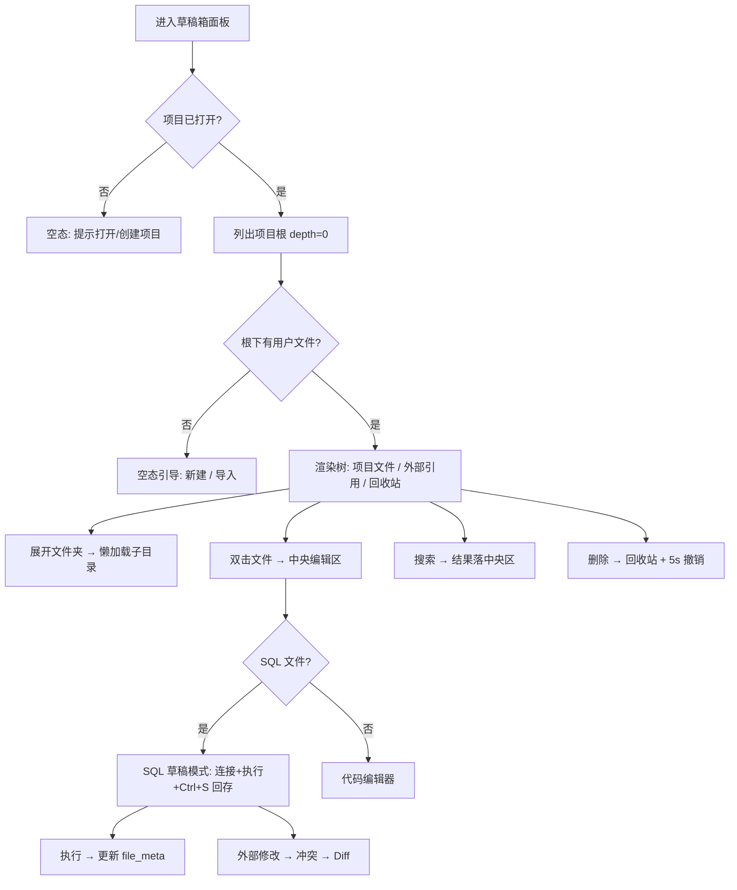
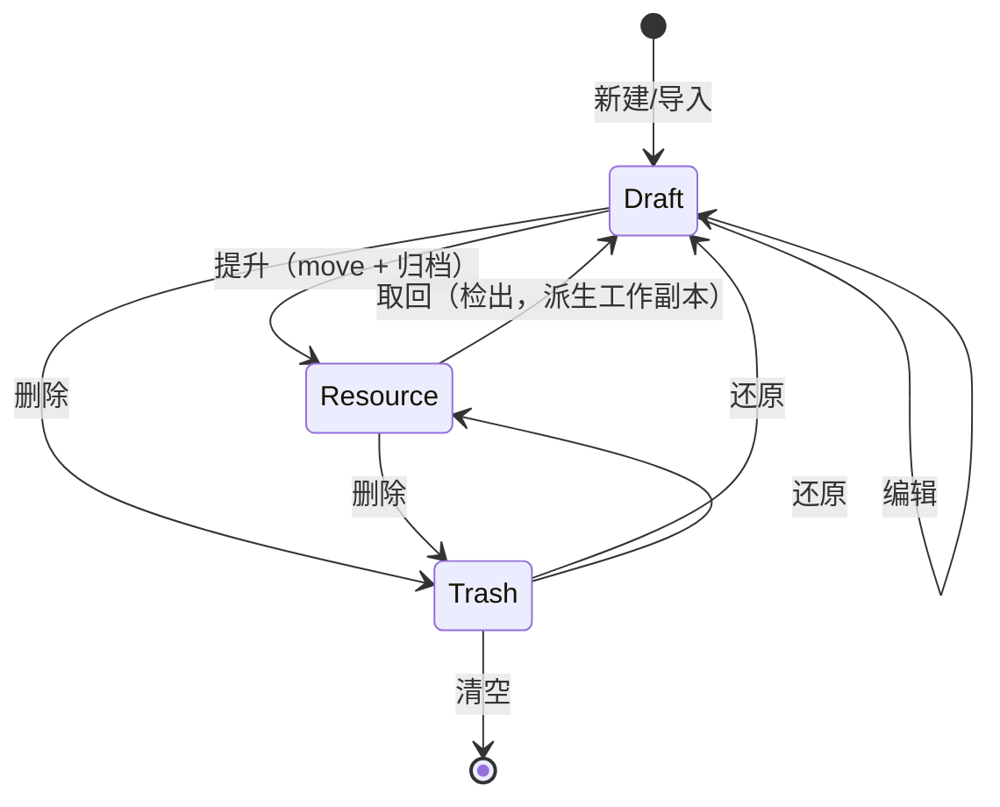

# 草稿箱模块 · 原型设计（项目工作区）

> 状态：**模块根 + 项目级回收站 + 面板自身闭环 + 导入/引用/右键菜单/键盘导航 + 内容搜索（高亮/替换）+ 新建模板 + 文件夹递归复制 + 虚拟列表/空态 已落地**（2026-09-15） · 关联文件：`scratchpad-prototype.html`（可交互原型）、`scratchpad-dev-plan.md`（开发方案与进度）、`crates/scratchpad/README.md`（crate 入口与特点提炼）
> 参考基准：v1 实现（`v1/backend/src/core/scratchpad`、`v1/frontend/extensions/builtin/scratchpad`）与设计（`v1/docs/backend/SCRATCHPAD_DESIGN.md`、`SCRATCHPAD_SCHEMA.md`、`v1/docs/frontend/SCRATCHPAD.md`）
> 布局服从 `docs/architecture/layout/layout-design.md`（五段布局，左侧 Dock 240px，`LeftPanel::Draft`）；配色服从 `docs/architecture/theme/theme-design.md`（RDS Light/Dark，`assets/themes/rds-theme.json`）
> 技术栈：GPUI（gpui-kit 0.6），组件消费 `cx.theme()` 语义 token，**代码零裸 hex**

## 1. 设计基准与 v2 语义变更

| 维度 | 基准 | 说明 |
| --- | --- | --- |
| 布局 | 五段布局（已定） | 草稿箱 = 左侧 Dock 内容，`LeftPanel::Draft`，起步宽度 240px（可拖拽调宽） |
| 后端 | `crates/scratchpad`（已迁移） | `models` / `state` / `store`，47 个方法（列表/CRUD/回收站/搜索/替换/Diff/外部引用/可分析文件） |
| 交互蓝本 | v1 `ScratchpadPanel.vue` + `TreeNode` | 工具栏 / 分层树 / 内联创建重命名 / 右键菜单 / 回收站 / 搜索上下文 / 多选 / 撤销栏 |
| 配色 | `theme-design.md` | 侧栏 `sidebar`、选中 `list.active` + coral 左边条、弹层 `popover`、主按钮 `primary` |
| 主题 | `rds-theme.json` | 复用标准字段，尽量不新增产品语义 token（见 §6） |

### 1.1 核心模型：模块独立根目录

v1 的草稿箱是项目下的隐藏子目录 `{project}/.scratchpad/`。v2 定稿为 **每个模块在项目根下拥有一个可见的内容目录**（模块中心）：

- **草稿箱根 = `{project}/scratchpad/`**（可见、可编辑），面板只展示此目录内的内容——「在 `scratchpad/` 里的就是草稿」，无需忽略规则、无需扫描整个项目。
- 草稿箱**内部元数据**（配置/文件元数据）落 `.RSmeta/scratchpad/`，不进内容目录。
- **回收站为项目级 `.RSmeta/trash/`**，收录草稿与资源等模块删除的条目（自带来源信息，见 §9）。
- 未来 `resources/`（M6 分析资源）、`mock/`（M7）同样是项目根下的模块目录。

```
{project}/
├── scratchpad/                      ← 草稿箱根（模块内容，可见）
│   ├── data/report.sql
│   ├── 临时订单分析.sql
│   └── sample.csv
├── resources/                       ← M6 分析资源（后续）
├── mock/                            ← M7 Mock 产物（后续）
└── .RSmeta/                         ← 隐藏：项目内部元数据
    ├── project.db / project.json / analytics.duckdb
    ├── session/                     # 编辑器标签/未命名缓冲区（后续）
    ├── scratchpad/config.json       # 草稿文件元数据 + 外部引用
    └── trash/                       # 项目级回收站（草稿 + 资源）
```

> 设计取舍：保留面板名「草稿箱」（活动栏图标 / Quick Open `打开草稿箱` 命令已注册）；「草稿」与「正式资产」由 **`scratchpad/ → resources/` 的提升（存档）机制** 区分（§9.3）。

## 2. 面板布局（240px 左 Dock）

草稿箱面板嵌入左侧边栏，结构自上而下四段：面板头 / 工具栏 + 搜索 / 树主体 / 底部状态。宽 240px，工具栏分两行（第二行在选择/剪贴板非空时出现）。

```
┌ 左侧边栏 240px（sidebar 底）──────────┐
│ 草稿箱                          [⋯]  │  ← 面板头（Dock tab，36px）
├ 工具栏第 1 行（icon 按钮）───────────┤
│ [＋][🗀][⬇导入][🔗引用]      [⇅][↻] │
├ 工具栏第 2 行（选择/剪贴板非空）──────┤
│ [✂][⧉][📋][🗑]           3 项      │
├ 搜索行（模式 chip）──────────────────┤
│ [文件名] [搜索…]         [.*][Aa][⏎]│  ← 内容模式才显示 .*/Aa/⏎
├ 树主体（滚动，命中落中央编辑区）──────┤
│ ▼ 草稿 (3)                          │
│   ▸ 🟧 data                          │  ← 类型色点（非图标 glyph）
│   🟦 临时订单分析.sql   2 分钟前 ●   │  ← 行尾：大小 · 相对时间
│   🟩 transform.py       1 小时前     │
│   ▸ 选中行显示 [↗][✎][✕]            │
│   [别名/文件名…]  ✓ ✕                │  ← 内联创建（不选中文件夹则建在根）
│ ▼ 🔗 外部引用 (1)                    │
│   🟦 下载数据  D:\data   [↗][✎][✕]  │  ← 引用：不复制，可改名/打开/移除
│ ▶ 🗑 回收站 (3)  [清空]              │
├ 底部状态（11px，muted）──────────────┤
│ N 个文件 · N 个文件夹 · N 项引用 · N 项回收站 · 排序 X │
└──────────────────────────────────────┘
```

> 与首版原型的差异（现已对齐产品）：工具栏拆两行；搜索为「模式 chip + 输入 + 内容模式开关」；行尾显示「大小 · 相对时间」；行操作选择时才显示（`↗` 打开位置 / `✎` 重命名 / `✕` 删除）；文件类型用**色点**而非图标 glyph；脏点（`●`）依赖编辑器宿主，Phase C 接入。

### 2.1 工具栏

| 行 | 按钮 | 行为 | 对应后端 |
| --- | --- | --- | --- |
| 1 | `＋` 新建文件 | **内联输入文件名 + 模板 chip**（空白/SQL/Python/Markdown/JSON：自动补后缀并填充占位内容）；落点 = 选中的文件夹（未选中文件夹则模块根，与粘贴一致） | `create_entry` + `save_file` |
| 1 | `🗀` 新建文件夹 | 同上，类型为目录（同样落在选中文件夹内） | `create_entry(is_folder)` |
| 1 | `⬇` **导入** | 系统文件对话框（多选）→ **复制**进草稿箱 | `import_external_file` |
| 1 | `🔗` **引用** | 选**文件或目录** → 内联输入**别名** → 只记路径（**不复制**） | `add_external_reference` |
| 1 | `⇅` 排序 | 名称/大小/修改时间，点击循环并切换升降序 | 前端计算 |
| 1 | `↻` 刷新 | 重新拉取根目录 | `list_local_entries(0)` |
| 2 | `✂`/`⧉`/`📋`/`🗑` | 剪切/复制/粘贴/删除（作用于多选；行尾显示已选数） | `move_entry` / `create_entry`+`save_file` / `delete_entry` |

### 2.2 导入 vs 引用（本质差异，务必区分）

| | 导入 | 引用 |
| --- | --- | --- |
| 物理行为 | **复制**进 `{项目}/scratchpad/` | **只记路径 + 别名**，不复制 |
| 归属 | 成为草稿本体 | 源文件仍在外部，草稿箱只是入口 |
| 项目迁移 | 随项目带走 | 可能失效（需可用性探测） |
| 体积 | 计入项目 | 不计入 |
| 失效处理 | — | 置灰 + 「（丢失）」，可重新引用 |
| 典型场景 | 随手写的 SQL / 测试数据 | 「下载目录的临时数据」「外部数据仓」 |

- 引用可指向**文件或目录**；别名可自定义、可后续改名（`rename_external_reference`）；可「在文件管理器中打开」（`open_in_system_explorer`）。
- 导入只导入文件（多选）；目录导入与文件夹递归复制待补。

### 2.3 空态

项目根无任何用户文件时显示引导（大图标 + 标题 + 说明 + 「＋ 新建」「🗀 文件夹」「⬇ 导入」按钮），避免 240px 版面显得空洞；搜索无结果时只显示一行「没有匹配的文件」。

## 3. 树与分组

- **草稿**（根组）：`ScratchpadEntry` 树；初始 `depth=0` 懒加载，展开文件夹时按需 `list_directory_entries(parent)`（子目录缓存），后端 `MAX_DEPTH=4` 仅作内容搜索 / 递归复制的遍历上限。
- **滚动与虚拟化**：草稿树是面板**唯一滚动区**（`v_virtual_list`，只渲染可视区行，`item_sizes` 按行高逐行给出，重命名行用控件高）；引用 / 回收站为底部固定区并限高（`SCRATCHPAD_GROUP_MAX_HEIGHT`），保证树始终有可用高度。
- **外部引用**：`ExternalReference{ alias, path }` 平铺列表，标题带计数；`external_reference_status()` 探测路径存在性，失效项置灰 + 「（丢失）」；行内 `↗` 打开 / `✎` 改名 / `✕` 移除。
- **回收站**：折叠区，标题带计数；展开后逐项「还原」，头部「清空」。
- **行视觉**：
  - 选中：`sidebar.accent` 底 + 左侧 2px `list.active.border`（品牌 coral）条
  - 悬停：`list.hover`
  - 文件夹展开箭头 `▸/▾`；文件/文件夹用**类型色点**（§6.3）
  - 行尾：文件显示「大小 · 相对时间」，文件夹显示相对时间（< 7 天相对，否则日期）
  - 行操作：仅在选中行显示（`↗` 打开位置 / `✎` 重命名 / `✕` 删除）
  - 脏点 `●`：待编辑器宿主（Phase C）提供

## 4. 核心交互

### 4.1 新建 / 重命名（内联，非模态）

- 新建：选中文件夹 → 工具按钮（或 `Ctrl+N`）→ 树中该目录下插入输入框（并自动展开），Enter 提交、`✓`/`Escape` 取消；未选中文件夹则建在模块根。
- 模板：新建文件时可从 `SQL / JSON / Markdown / Python` 选模板，自动补后缀并填充占位内容；切换模板会替换模板补的后缀，用户自写的其他后缀（如 `.txt`）不被改写。
- 重命名：右键「重命名」或 `F2` → 行内输入框；提交时输入禁用 + 旋转指示，防重复提交；空值不提交。

### 4.2 打开文件（已接：双击 / `Enter` / 右键「打开」）

```
双击文件（或 Enter、右键「打开」）
  → 置位 Shared::open_file_request = 绝对路径
  → 宿主消费 → editor::persist::open_file → 中央编辑区新标签
        · 同路径已打开：只激活该标签，**不重读**（重读会冲掉未保存的编辑）
        · 模式与只读等级由编辑器按路径自行判定（编辑器无根）
        · 打开失败 → 通知栏提示
```

**待补**（Phase C 余项）：SQL 草稿模式绑定连接（`file_meta.last_connection_id` 回填）、脏点回显、冲突 Diff、拖放导入/拖入编辑区。

目标形态（按后缀分派的工作项，当前由编辑器自行判定）：

```
.sql  → SQL 编辑器草稿模式：标题 = 文件名；Ctrl+S 回存 `scratchpad/`（原子写）
        保留连接选择与完整执行引擎；自动恢复 file_meta.last_connection_id
.py/.json/.md/.txt → 代码编辑器（语法高亮）
其他 → 交系统默认程序（当前仍由编辑器判定）
```

> 同一文件不重复开 Tab，已存在则聚焦（已实现）。

### 4.3 搜索（两种模式，重结果落中央区）

- **文件名模式**（默认）：输入实时过滤树（匹配名称；命中子树自动展开）。
- **内容模式**：`.*` 切正则、`Aa` 切大小写敏感、`⏎`（或输入框 Enter）运行；调 `search_file_content(query, case, 2, is_regex)`（严格白名单正则循环外编译一次；`BufReader` 逐行 / 30s 单文件超时 / 500 条截断）。
- 结果（匹配行 + 前后 2 行上下文）写入 `Shared::scratchpad_search`，由**中央编辑区**渲染（侧栏只承载输入与开关）。
- **待补**：点击命中跳转到文件（依赖 Phase C 编辑器打开）。命中文本高亮由后端 `SearchMatch::match_spans`（每行最多 16 段字节区间）驱动，颜色取产品 token `search.match.background`。
- **替换**：结果面板内嵌「替换为」输入 + 「全部替换」（预览计数：将替换 N 处 · M 个文件）；逐文件 `replace_in_file`（正则模式支持 `$1` 分组，字面量模式不解析 `$`）→ 原子写回 → 自动刷新结果；只读项目拒绝。

### 4.4 文件与引用操作

| 操作 | 行为 | 后端 |
| --- | --- | --- |
| 新建 / 重命名 | 内联输入（✓/✕，Enter 提交）；不选中文件夹时建在模块根 | `create_entry` / `rename_entry` |
| 删除 | 多选批量→**项目级**回收站 `.RSmeta/trash/`；底部撤销栏（5s 自动消失） | `delete_entry` / `restore_from_trash` |
| 剪切移动 | ✂ 后 📋 → 移入选中文件夹（未选文件夹则根） | `move_entry` |
| 复制 | ⧉ 后 📋 → 生成 `_copy` 副本（文件与**文件夹递归**均支持；复制到自身子树被拒） | `copy_entry` |
| **导入** | 系统文件对话框（多选）→ **复制**进草稿箱 | `import_external_file` |
| **引用** | 选文件或目录 → 自定义别名 → **只记路径**；可改名 / 打开 / 移除；失效项置灰 + 「（丢失）」+ `⟲` **重新引用**（只改路径） | `add` / `rename` / `remove` / `update_external_reference_path`、`external_reference_status` |
| 打开所在位置 | 系统文件管理器定位（草稿项与引用项均可） | `open_in_system_explorer` |
| 多选 | Ctrl 点选 / Shift 范围 / Ctrl+A 全选 | 前端 |

> 导入与引用的区别见 §2.2（复制 vs 链接）。

### 4.5 编辑态与冲突

- `Ctrl+S` 原子写回项目文件；文件监控（`notify`）发现外部修改 → 冲突对话框（重新加载 / 忽略），并置脏点。
- 拖拽文件节点到中央编辑区 → 插入文件内容到光标处。
- **Diff 对比**：冲突时「查看差异」→ `diff_with_content`（`similar` 行级）→ 弹窗红/绿标记 → 接受右侧。
- **搜索替换**：结果区替换栏 → 预览计数 → 全部替换（`replace_in_file`，支持正则与大小写）→ 原子写回 → 刷新结果。

> 已落地部分是「结果区替换栏」；脏点 / 冲突 Diff 等仍待编辑器宿主（Phase C）。

### 4.6 提升为分析资源（存档）

右键「提升为分析资源」→ **移动**到 `resources/` 并**归档锁定（只读）**；数据源绑定/来源随文件归档。想修改只能从资源管理处**取回**（检出）为草稿工作副本（§9.3）。跨模块协作走 **command / event**，草稿箱不直接依赖分析资源模块的视图。

### 4.7 键盘与右键

| 输入 | 行为 | 状态 |
| --- | --- | --- |
| `Ctrl+A` | 全选已加载条目（`scratchpad` key context） | ✅ |
| `F2` | 重命名唯一选中项 | ✅ |
| `Delete` | 删除选中（批量，含撤销栏） | ✅ |
| `Escape` | 取消内联编辑 | ✅ |
| 双击 | 文件：在编辑器中打开（同路径只激活、不重读）；文件夹：展开折叠 | ✅ |
| 右键 | 行上下文菜单：**打开** / 打开位置 / 重命名 / 剪切 / 复制 / 删除 | ✅ |
| `↑↓` / `Enter` / `Ctrl+N` | 树内键盘导航（选中项自动滚入视口）/ **Enter：文件→编辑器，文件夹→展开折叠** / 新建文件 | ✅ |

> 快捷键绑定在 `scratchpad` key context（`crates/workbench/src/commands.rs` + `crates/app/src/main.rs`）；点击行会聚焦面板，使快捷键生效。

## 5. 关键帧与状态流



## 6. 主题映射（token → 视觉）

> 实现时色值只存在于 `assets/themes/rds-theme.json`，GPUI 组件经 `cx.theme()` 读取，**禁止写裸 hex**（`theme-design.md` §5）。

### 6.1 容器与导航

| 元素 | Token | RDS Light | RDS Dark |
| --- | --- | --- | --- |
| 面板底 | `sidebar.background` | `#F3F3F3` | `#252526` |
| 面板头 | `tab_bar.background` / `sidebar.background` | `#F3F3F3` | `#252526` |
| 分隔线 / 边框 | `sidebar.border` / `border` | `#E7E7E7` / `#D4D4D4` | `#3C3C3C` |
| 正文 / 弱文字 | `sidebar.foreground` / `muted.foreground` | `#616161` / `#8E8E8E` | `#CCCCCC` / `#8A8A8A` |
| 行悬停 | `list.hover.background` | `#F0F0F0` | `#2A2D2E` |
| 行选中底 | `sidebar.accent.background` | `#E4E4E4` | `#37373D` |
| 选中左边条 | `list.active.border`（品牌 coral） | `#C25B46` | `#E8846F` |
| 工具图标（常态/悬停） | `muted.foreground` / `foreground` | `#8E8E8E` / `#333333` | `#8A8A8A` / `#CCCCCC` |
| 搜索输入框 | `background` + `input.border`；聚焦 `caret`/`primary` | `#FFFFFF` / `#D4D4D4` | `#1E1E1E` / `#3C3C3C` |
| 脏点 `●` | `primary.background` | `#C25B46` | `#E8846F` |
| 右键菜单 | `popover.background` / `popover.foreground` + `border` | `#FFFFFF` / `#333333` | `#252526` / `#CCCCCC` |
| 撤销栏 | `popover.background` + `border`；按钮 `primary` | — | — |
| 危险项（清空回收站/删除） | `danger` | `#DC2626` | `#F14C4C` |
| 成功（导入/提升） | `success` | `#16A34A` | `#89D185` |

### 6.2 分组头与徽标

| 元素 | Token | 说明 |
| --- | --- | --- |
| 分组标题（项目文件/外部引用/回收站） | `muted.foreground` + 字号 11px | 全大写/加粗由样式决定 |
| 计数徽标 | `muted.background` 底 + `muted.foreground` 字 | 胶囊样式 |
| 外部引用图标 | `info` | 路径引用语义 |
| 回收站图标 | `muted.foreground` | 非危险常态 |

### 6.3 文件类型色点（复用标准字段，零 hex）

| 类型 | 后缀 | Token（实现口径） |
| --- | --- | --- |
| 文件夹 | — | `warning`（琥珀） |
| SQL / 脚本 | `.sql` | `info` |
| Python | `.py` | `success` |
| 数据文件 / JSON | `.csv .tsv .parquet .xlsx .xls .json .ndjson .db .duckdb` | `primary`（品牌色） |
| 文档 / 其他 | `.md .txt` 及无后缀 | `muted_foreground` |

> 以上为**实现口径**（`scratchpad_view.rs::scratchpad_icon_color`）：早期设计曾写成 `base.cyan` 且把 `.json` 归入文档类，实测后者在同尺寸下对比度偏低、且 `.json` 多为数据，已归入数据文件并改用 `primary`。

### 6.4 搜索高亮

产品语义 token `search.match.background`（Light `#FFF3C4` / Dark `#4A3F00`，注册于 `crates/workbench_shell/src/product_tokens.rs` + `assets/themes/product-tokens.json`）已落地并消费于内容搜索结果面板（命中段底色）。

## 7. GPUI 落点映射

| 原型元素 | GPUI 落点 |
| --- | --- |
| 面板容器（草稿箱） | `crates/scratchpad/src/scratchpad_view.rs`（`ScratchpadView` / `render_scratchpad`；宿主能力经 `host.rs::ScratchpadHost`） |
| 左 Dock 内容装配 | `crates/workbench/src/panels/mod.rs`（`SidebarPanel` 持 `Entity<ScratchpadView>`，`LeftPanel::Draft` 分支转发渲染） |
| 面板头 / 工具栏 | gpui-kit `Button`（`.icon().ghost()` 小尺寸） |
| 搜索输入 | `Input` + `InputState`（`cx.new(InputState::new)`） |
| 内容搜索结果 + 替换栏 | `crates/scratchpad/src/scratchpad_view.rs::render_scratchpad_search_pane` + `crates/workbench/src/panels/editor.rs::replace_scratchpad_all`（结果展示在编辑区） |
| 空态引导 | `ScratchpadView::render_scratchpad_empty_state`（大图标 + 分组 `Button`） |
| 树 / 分组 / 折叠 | 草稿树用 `v_virtual_list`（`item_sizes` + 可视区渲染，`track_scroll` 支持键盘导航滚入）；分组头为自绘标签行 |
| 右键菜单 | gpui-kit 弹层（`PopupMenu`/自绘 overlay），`popover` token 取色 |
| 导入 / 引用 / 冲突 / Diff 弹窗 | `Dialog` / 模态覆盖层 |
| 撤销栏 | 面板底部自绘条（`popover` + `primary`） |
| 域模型与存储 | `crates/scratchpad`（`models` / `store` / `trash` / `watch` / `jobs` / `scratchpad_view` / `host`），workbench 通过 workspace 依赖 `scratchpad` |
| 文件监控 | `notify`（v2 尚未接入，见 `scratchpad-dev-plan.md` Phase A） |
| SQL 草稿模式 | `crates/scratchpad/src/scratchpad_view.rs` 发「打开」请求 → `crates/workbench/src/view.rs::open_in_editor`（新建文档时按 `file_meta` 预选连接） |
| 提升为分析资源 | `analytics_resource` 服务，经 command/event 协作 |

## 8. 已确认决策

| # | 决策 |
| --- | --- |
| 1 | **模块独立根目录**：草稿箱根 = `{project}/scratchpad/`（项目根下可见目录），每个模块（草稿箱/资源/Mock）各有一个 |
| 2 | 内容目录用**可见英文名**（`scratchpad/`、`resources/`、`mock/`）；模块内部态（config/session/trash）统一放 `.RSmeta/<模块>/` |
| 3 | **回收站为项目级** `.RSmeta/trash/`，收录草稿 + 资源删除的条目，条目自带来源信息 |
| 4 | 编辑器采用**无根 + `OpenFile(绝对路径)` 命令**方式（编辑器不假设项目根） |
| 5 | 草稿**提升为资源 = 存档、锁定只读**；要修改只能从资源管理处**取回**（检出）后再提升为新版本 |

## 9. 元数据、回收站与提升

### 9.1 项目级回收站（已落地）

位置 `.RSmeta/trash/`，条目自包含：

```
.RSmeta/trash/<id>/
├── payload        # 被删的文件/目录（原样移入）
└── manifest.json  # { id, name, origin, original_rel_path, kind, deleted_at, size }
```

- `origin`：来源模块（`scratchpad` / `resources` / `mock` …）；`original_rel_path`：相对来源模块根的原路径。
- 还原按 `origin + original_rel_path` 放回；同名自动改名（`_1`），不覆盖。
- 草稿箱的还原入口只接受 `origin == scratchpad` 的条目；其他来源报错并提示在其模块中还原。
- 旧 `.scratchpad/.trash` 与上一版 `.RSmeta/scratchpad/.trash` 均一次性并入。
- 代码：`crates/scratchpad/src/trash.rs`（`ProjectTrash` / `TrashEntry` / `TrashManifest`）。

### 9.2 文件元数据 / 数据源引用 / 外部引用路径

原则：**只存 ID / 路径，绝不存凭据**（凭据仍在 `auth_store` AES 加密）。存于 `.RSmeta/scratchpad/config.json`：

```json
{
  "files": {
    "queries/order.sql": {
      "last_connection_id": "P_xxx",
      "last_executed_at": "2026-09-11T…",
      "bound_connections": ["P_xxx"]
    }
  },
  "external_references": [
    { "alias": "下载数据", "path": "D:\\data", "created_at": "…" }
  ]
}
```

- `files` 的 key = **相对 `scratchpad/` 的路径**（项目整体迁移不失效）。
- 数据源引用存连接 ID（`G_/P_/GP_`），打开文件时解析；执行后回写 `last_connection_id`；`bound_connections` 支持显式多数据源绑定（`ScratchpadStore::bind_connections`）。
- 外部引用存**绝对路径** + 别名（项目外的东西无法用相对路径）；`external_reference_status()` 加载时探测存在性，失效项置灰并提示「丢失」。
- 提升为资源时，数据源绑定/来源信息随文件归档（否则资源成为“孤儿 SQL”）。

### 9.3 提升 / 存档 / 取回



- **提升 = move**：`scratchpad/ → resources/`，草稿不残留（避免存档后还能改一份的分裂）。
- **锁定**：文件系统只读属性 + 应用级守卫（`resources/` 节点带锁标记，禁重命名/移动，编辑器只读打开）。
- **取回（检出）**：从资源**复制**一份到 `scratchpad/`（新名），资源本体不动、仍只读；修改后再提升为**新版本**（稳定 `resource_id` + `version`/`hash`），不覆盖旧版。
- 资源登记（`resource_id/version/hash/promoted_from/readonly`）建议落 `project.db`（可查询、供后续跨项目共享）；`resources/` 只存内容。

### 9.4 编辑器与会话边界

- 树只发 `OpenFile(绝对路径)`；编辑器无根，按**路径所属模块**决定模式：`resources/` 下→只读 + 锁标记；`scratchpad/` 下→可编辑 + 脏点 + `Ctrl+S` 回存。
- 未命名缓冲区归**窗口**，落 `.RSmeta/session/untitled/`；打开标签/游标按项目恢复。
- 同一文件的脏点/冲突由编辑器宿主（文档模型 + watcher）提供，树只做只读投影。
- 多窗口 = 多项目；项目态**不得**放进程单例（`ScratchpadState` 须由窗口/会话持有）。
