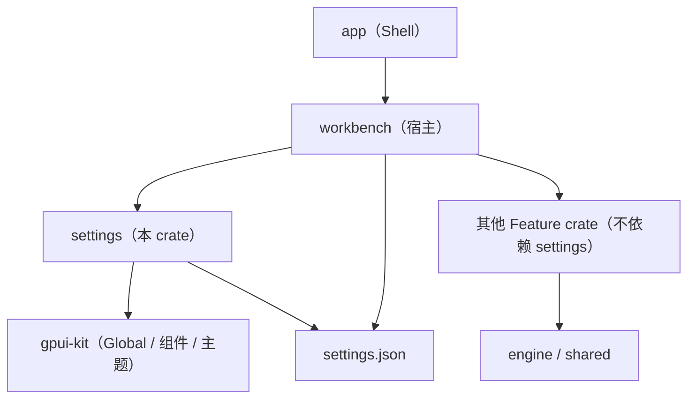

# 设置（应用级）· 设计理念与架构

> 状态：**首版（2026-09-16，待迭代）** · 关联：`settings-prototype-design.md`（长什么样）、`settings-crate-design.md`（crate 沿革，§2/§3 已由本文取代）、`../database/database-navigator-prototype-design.md` §6.4（落点选型来源）、`../project/project-view-architecture.md`（项目设置）
>
> **本文是一份准入裁决书**：它回答"什么算设置、该落在哪、以什么形态出现"。在它被推翻之前，任何新增设置项都应服从本文；**"先画一行再说"在本模块被明确禁止**。

## 0. 裁决摘要（一页读完）

| # | 问题 | 裁决 | 影响 |
| --- | --- | --- | --- |
| D1 | 设置是什么？ | **应用级、跨项目、极小的 UI 偏好**——回答"在哪看"，不回答"数据是什么" | 全局 |
| D2 | 有几层作用域？ | **三分法**：应用级（`settings.json`）/ 项目级（项目库或项目设置）/ 会话态（不持久化） | §2.2 |
| D3 | 什么能进设置？ | **准入五条**：真实消费方 · 跨项目 · 非会话态 · 值来源合法 · 稳定 key | §7.1 |
| D4 | 谁是权威？ | 每个 key **唯一写入者** = `SettingsService`；模块内快捷入口与设置页是同一值的两个入口，都走它 | §4 |
| D5 | 落在哪？ | 结构化 / 项目级 → SQLite；非结构化 + 跨项目 + 极小 → `settings.json`；**不新增 K-V 文件**（沿用 M4 §6.4 结论） | §2.2、§8 |
| D6 | 默认值从哪来？ | 代码常量（`model.rs` 的 `Default`）；「恢复默认」= 写回默认并持久化 | §6、§7 |
| D7 | 生效方式怎么表达？ | 三档：即时 / 下次操作 / 需重启；每项必须能判档，界面不得含糊 | 原型 §4.4 |
| D8 | 视图归谁？ | **视图随 crate**（`settings`），宿主只提供 overlay 与宿主桥（与 `mock` / `project` 同例） | §3 |
| D9 | 插件设置？ | **不做**：M9 等 beta3，落地前不设节、不画行 | §10 |
| D10 | 现有无生产者的字段？ | 6 项本期**裁撤或接上消费方**，不允许"有行无消费" | §7.2 |
| D11 | 配置坏了？ | 解析失败**不覆盖用户文件**：回退默认 + 上报；写盘失败必须能提示 | §9 |
| D12 | 语言 / 字号？ | v2 无 i18n；字号权威在主题资产 → 两者**都不作为设置项** | §13 K4、§14 Q4 |

## 1. 定位与边界

| 维度 | 结论 |
| --- | --- |
| 一句话定位 | 应用级偏好的**登记、持久化与呈现**：一处改、全局生效、重启还在 |
| 负责 | 偏好登记表（§6）、`settings.json` 读写与兼容、设置页视图、`OpenSettings` 等命令、主题模式的应用与切换、把偏好注入消费方 |
| 不负责 | 主题配色本身（资产 `rds-theme.json` + `product-tokens.json`，设置只存"选哪套模式"）、项目级状态（M1 项目设置）、结构化状态（导航展开/选中、知识库索引等 → SQLite）、会话态（展开/选中/草稿）、快捷键（各模块文档 + Quick Open） |
| 核心载体 | 设置页弹层（`settings/src/settings_page.rs`）+ 模块内入口（`⋯` 菜单、分隔条拖拽、选择器按钮） |
| 关键约束 | 准入五条（D3）；单一权威（D4）；render 期零 I/O（页面只在事件路径读写）；零裸色值 / 零裸 `px` |
| 与项目设置的分工 | **应用级 = 我这个人怎么用这个软件**（跨项目）；**项目级 = 这个项目怎么被处理**（随项目物理隔离） |

## 2. 概念模型

### 2.1 设置项的解剖

每个设置项必须有且只有以下字段（登记表 §6 的列）：

| 字段 | 说明 |
| --- | --- |
| `key` | 稳定点分命名（`<节>.<项>`，如 `navigator.show_tags`），**落 JSON 的字段路径即 key** |
| 作用域 | 应用级 / 项目级 / 会话态（三分法，§2.2） |
| 类型 | `bool` / 枚举 / 数值 / 文本（枚举必须给出全部取值与语义） |
| 默认值 | 代码常量；界面「恢复默认」的写入目标 |
| 生效方式 | 即时 / 下次操作 / 需重启 |
| 消费方 | **必须能点到具体符号**（`文件::函数`），否则不满足 A1 |
| 入口 | 设置页 / 模块内 / 两者（**登记 ≠ 上页**，§2.3） |

### 2.2 三层作用域（三分法）

| 层 | 落在哪 | 例子 | 判据 |
| --- | --- | --- | --- |
| **应用级** | `<RDS_HOME>/config/settings.json`（默认 RDS_HOME = 可执行文件所在目录） | 主题模式、导航显示开关、建连超时 | 跨项目复用 + 非结构化 + 极小 |
| **项目级** | 项目库 `project.db`（结构化）或项目设置（`.RSmeta/config/settings.json`，由 M1 自持） | 导航展开/选中（`navigator_state`）、洞察规则索引（SQLite 表）、项目名与描述 | 随项目物理隔离；离开该项目即无意义 |
| **会话态** | 不持久化（内存 / `Shared`） | 当前选中连接、洞察四区折叠态、搜索框文本、上次停留的设置节 | 重开即复位是**期望行为** |

> 依据：M4 §6.4 的选型结论（"结构化状态进 SQLite；UI 偏好进 `settings.json`；不新增独立 K-V 文件"）在此提升为**设置模块的通用判据**。
> 边界示例：`navigator.filters`（facet 筛选）目前落 `settings.json`，但它有"当前视图状态"的味道——登记在案、**不上设置页**；是否改为项目级见 §14 Q1。
> 第二个同类例子（2026-09-18）：`resources.collapsed_groups`（资产库分组折叠态）——它的状态是**项目专属**的，严格说属项目级；但它只有一屏的展开形状，进项目库要新迁移 + 后台往返，代价不抵收益，因此也暂住 `settings.json`（**按项目根分桶**，避免跨项目互相抹掉），并同样登记为待确认（§14 Q7）。

### 2.3 登记 ≠ 上页

| 入口类别 | 含义 | 例 |
| --- | --- | --- |
| 设置页 | 需要可发现性（用户会主动去找） | 主题模式、建连超时 |
| 模块内 | 天然入口在操作现场（拖拽、行操作、局部菜单） | 属性面板宽度（拖分隔条）、导航 facet 筛选（chips / `筛选 ▾`） |
| 两者 | 两处都合理，且必须**同值同源** | 显示标签 / 显示归属域（`⋯` 菜单 + 设置页）、项目列表排序（选择器循环按钮 + 设置页） |

规则：**登记是义务，上页是判断**；两个入口只允许同一 `SettingsService` 写入路径，禁止各自维护一份状态。

## 3. 分层与 crate 归属

| 结论 | 说明 |
| --- | --- |
| 视图随 crate | 设置页是 `settings` 的视图（`settings_page.rs`）；宿主 `workbench` 只做 overlay 挂载与回调注入 |
| **其他 Feature 不直接依赖 `settings`** | 现状：只有 `app` 与 `workbench` 依赖它（`Cargo.toml` 可查）。Feature 间不做横向依赖（`overview.md`），偏好由**宿主读设置后作为参数 / 宿主桥注入**（与 `MockHost`、`ProjectUiHost` 同例）。例：M6 的 `keepVersions` 由 workbench 读设置后传给 `analytics_resource` 的归档调用 |
| 为什么缓存管理不在本 crate | 缓存对话框要 engine（`rusqlite` / 元数据缓存清理）→ 引入 engine 会把数据库依赖拖进视图 crate；继续由宿主的 `on_open_cache` 回调承接 |
| 宿主桥 | `SettingsHost { on_close, on_open_cache, (将来) on_restart }`——宿主提供副作用，crate 只表达意图 |

**crate 现状**：`lib.rs`（服务 + 持久化 + `apply_by_key` / `value_by_key` 唯一读写路径）/ `model.rs`（分节 model）/ `registry.rs`（登记表 + `Slot` 分发表 + `presets` + 契约测试）/ `settings_page.rs`（两栏页面，**已接到工作台**）/ `commands.rs`（Action：`OpenSettings` / `CloseSettings` / `FocusSettingsSearch`）；**产品语义 token 已迁至 `workbench_shell::product_tokens`**（本 crate 重导，见 §13 K6）。

> 旧单列 `settings_view.rs` 与自持的 `ui.rs` **均已删除**：页面尺寸常量回归**壳层单点** `crates/workbench_shell/src/ui.rs`（依赖方向：`settings → workbench_shell`，而 shell 不依赖任何特性 crate）。

## 4. 状态所有权与读写路径

| 角色 | 唯一性 | 位置 |
| --- | --- | --- |
| 设置状态 | **单一 global**：`Settings`（GPUI `Global`） | `cx.set_global`（`SettingsService::init`） |
| 写入者 | **只有 `SettingsService::set_*`** | `lib.rs` |
| 读路径（有 `App`） | `SettingsService::get_*`（`cx.global::<Settings>()`） | 视图 / 宿主 |
| 读路径（无 `App` 的 async） | 进程级快照 `settings::connection_defaults()`（`RwLock`，由 `save_settings` / `init` 发布） | `lib.rs` |
| 落盘 | `save_settings(&Settings)`：全量写 JSON | `lib.rs` |

**写时序**（每个 `set_*` 固定三步）：`global_mut` 改值 → `save_settings` 全量落盘 → 通知（`Theme::change` / `cx.refresh_windows()` / 定向 `cx.notify()`）。

**禁令**：
1. 视图不得直接 `load_settings()`（现状有 2 处构造期直读：`WorkbenchView::new`、`EditorPanel::new` → 收口项 K1）；
2. 页面不得缓存第二份设置值用于展示（唯一来源是 service 读取）；
3. render 期不得读写设置（只在事件路径）。

## 5. 数据流（六条）

| # | 流 | 路径 |
| --- | --- | --- |
| 1 | 启动 | `SettingsService::init`（load → global → 发布连接默认值快照）→ 主题资产 `watch_dir` → 应用已存主题模式 → 绑快捷键 |
| 2 | 设置页改动（即时档） | 控件回调 → `SettingsService::set_*` → global → save → `Theme::change` / `refresh_windows` |
| 3 | 设置页改动（下次操作档） | 同上，但**不通知**（建连超时 / LAN TLS / 排序）——消费者在下次操作时读快照 |
| 4 | 模块内入口改动 | `⋯` 开关 / 分隔条拖拽结束 / 选择器按钮 → 同一个 `set_*` → 同一条落盘路径 |
| 5 | 恢复默认 | 行级 / 节级 → 写入默认值并落盘（**不是**删字段；用户文件保持显式） |
| 6 | 主题资产热更新 | `watch_dir` 回调 → 重新应用当前模式 + `attach_product_tokens` → 不回写设置 |

## 6. 设置项登记表（权威）

> 本表 = 页面清单（原型 §5）+ 搜索索引 + 契约测试基准 + 文档生成来源。新增项必须**同轮**改五处：`model.rs`（字段 + 默认）→ `lib.rs`（读写方法）→ 消费方 → 本表 → 原型 §5 清单。

| key | 节 | 类型 | 默认 | 生效 | 消费方 | 入口 | 期次 |
| --- | --- | --- | --- | --- | --- | --- | --- |
| `appearance.theme_mode` | 外观 | enum `light`/`dark` | `light` | 即时 | `app/src/main.rs`、`SettingsService::set_theme_mode` | 两者 | ✅ 已落地 |
| `navigator.source_short_code` | 数据源导航 | bool | `true` | 即时 | `database/src/nav_view.rs::render_connection_row` | 设置页 | ✅ 已落地 |
| `navigator.show_tags` | 数据源导航 | bool | `false` | 即时 | `database/src/nav_view.rs::render_connection_row` | 两者 | ✅ 已落地 |
| `navigator.show_scope` | 数据源导航 | bool | `true` | 即时 | `database/src/nav_view.rs::render_connection_row` | 两者 | ✅ 已落地 |
| `navigator.property_panel_width` | 数据源导航 | f32（rem） | `24.5` | 即时 | `panels/editor.rs::EditorPanel`（关闭面板时落盘） | 模块内（拖拽） | ✅ 已落地 |
| `navigator.filters` | 数据源导航 | struct（4 个 `Option<String>`） | 全空 | 即时 | `panels/mod.rs::SidebarPanel::new` + `database/src/nav_view.rs::write_nav_filters` | 模块内（chips / 筛选 ▾） | ✅ 已落地（作用域见 §14 Q1） |
| `projects.sort_mode` | 项目 | enum `last_opened`/`name`/`created` | `last_opened` | 下次操作 | `view.rs::WorkbenchView::new`（读）+ `components/project_host.rs`（写） | 两者 | ✅ 已落地（页面行待落地） |
| `connection_defaults.connect_timeout_ms` | 连接默认值 | u64（ms） | `15000` | 下次操作 | `workbench/services/connection_service.rs::connect_with_type` | 设置页 | ✅ 已落地 |
| `connection_defaults.lan_disable_tls` | 连接默认值 | bool | `true` | 下次操作 | `connection_service.rs::apply_lan_tls_default` | 设置页 | ✅ 已落地 |
| `resources.keep_versions` | 资产库 | i64（份数；`-1` = 全留、`0` = 只留元数据） | `5` | 下次操作 | `workbench/src/components/resource_host.rs` + `panels/resources.rs`（主线程读→`KeepVersions::from_setting`）→ `services/resource_jobs.rs::open_service` → `analytics_resource::ArchiveService::with_keep_versions` | 设置页 | ✅ 已落地（2026-09-18）|
| `resources.default_sort` | 资产库 | enum `name`/`archived_at`/`updated_at`/`size`/`version` | `name` | 下次操作 | `components/resource_host.rs::remember_sort`（写）+ `panels/resources.rs::build_resources_panel`（读，注入 `ResourcesPanel::set_sort`） | 两者 | ✅ 已落地（2026-09-18）|
| `resources.collapsed_groups` | 资产库 | 复合值：`{项目根: [分组 key]}` | `{}` | 下次操作 | `components/resource_host.rs::remember_collapsed`（写）+ `panels/resources.rs::build_resources_panel`（读，注入 `ResourcesPanel::set_collapsed`） | 模块内（不上页） | ✅ 已落地（2026-09-18；作用域见 §14 Q7） |
| `logging.min_level` | 日志 | enum `TRACE`/`DEBUG`/`INFO`/`WARN`/`ERROR` | `INFO` | 即时 | `crates/app/src/main.rs`（启动取值）；运行时经装配层注册的 sink → `engine::logging::reload_log_level` | 设置页（另有「查看日志…」/「打开日志目录」两个动作行） | ✅ 已落地（2026-09-16） |
| `resources.keep_versions` | 分析资产 | i32（`0` = 只留元数据；`-1` = 全留） | `5` | 下次归档 | `analytics_resource/src/service.rs`（现为常量 `DEFAULT_KEEP_VERSIONS`） | 设置页 | ⬜ 待 M6 P2.4 接线 |

> 命名约定：JSON 字段一律 **snake_case**（与现有 `theme_mode` / `source_short_code` / `sort_mode` 一致）。M6 文档里写的 `resources.keepVersions` 是同一项的早期命名，**已于 2026-09-18 落地为 `resources.keep_versions`**（M6 侧同步改口）。
> **设置层不依赖 `engine`**：`logging.min_level` 在设置侧是独立的 `LogMinLevel`（同词表），改级别后的“重载日志系统”由装配层（`crates/app`）注册的 sink 完成——反向依赖会把双引擎拖进设置层的依赖图。
> `navigator.filters` 是**复合值**（4 个可选筛选项打包），登记为一项；若将来拆成多个独立开关，需重新过准入五条。
> **代码侧权威是 `crates/settings/src/registry.rs`**（`SettingSpec` / `REGISTRY` / `sections()` / `page_rows()` + **`Slot` 分发表**（`slot_for` / `slot_kind` / `slot_is_scalar`）+ `presets` + 11 项契约测试）：本表与它必须逐项一致。改动顺序：**先改代码表 → 再改消费方 → 最后同步本表**。
> **唯一读写路径**：页面对某项的"读当前值 / 写新值 / 判是否偏离默认"全部走 `lib.rs::{value_by_key, apply_by_key}`（按 `Slot` 分发）；页面不直接碰 model 字段，也不落盘。新增项的接入首续：登记 → 模型 → 槽位 → 消费方 → 文档表。

## 7. 准入与退役

### 7.1 准入五条（缺一不入）

| # | 判据 | 反例（现存） |
| --- | --- | --- |
| A1 | **有真实消费方**：能点到 `文件::符号`；只被"展示"不算 | `engine.workspace_dir`（只在设置页显示） |
| A2 | **跨项目复用**：换项目仍成立 | 导航展开/选中（→ 项目库） |
| A3 | **非会话态**：重开复位不是缺陷 | 观察面板折叠态、搜索框文本 |
| A4 | **值来源合法**：库 / 常量 / 用户输入三选一，禁止 UI 自造 | 假"默认数据源"（与实际驱动目录不符） |
| A5 | **稳定 key + 默认值来源明确**：支持恢复默认与文档生成 | 无名临时开关 |

补充三条实现纪律：同一 key 不得两处可编辑（单输入源）；跨模块的语义不得塞进一个开关（一项一件事）；不得为"看起来完整"而设空壳节。

### 7.2 退役清单（7 项无生产者字段，**已于 2026-09-16 裁撤**）

| 字段 | 初判 | 处置 | 前置 / 说明 |
| --- | --- | --- | --- |
| `general.language` | 无 i18n，视图写死「中文（简体）」 | **删字段 + 删行** | 将来 i18n 立项时以 `appearance.language` 重新引入（含语言包加载路径） |
| `general.restore_last_workspace` | 无消费方（启动会话由 `project_session::resolve` 决定） | **删字段** | 若产品要"启动不恢复"，归 M1 会话设计，不进本页 |
| `appearance.font_size` | 字号权威在主题资产（`theme.font_size`） | **删字段** | 界面缩放另立（§14 Q4） |
| `engine.workspace_dir` / `engine.cache_dir` | 仅展示；目录布局由 M2 决定 | **删字段 + 删行** | 「可配工作区 / 缓存目录」登记为 M2 待办（需路径注入 + 迁移） |
| `connection_defaults.default_driver` | 仅展示；新建连接的默认类型应由驱动目录决定 | **删字段** | 若要"默认数据源"，归 M3（连接对话框读取） |
| `connection_defaults.query_timeout_ms` | 无消费方；查询超时权威在每条连接的高级选项 | **删字段** | 若要"全局默认查询超时"，归 M3（收集参数时兜底） |

> 删除是**向后兼容安全**的：`Settings` 未开 `deny_unknown_fields`，旧文件里的字段被忽略（但见 §13 K3：保存会丢弃未知字段）。
> **处置结果**：字段与对应界面行已从 `model.rs` / `settings_view.rs` 删除；兼容保证由 `model::tests::legacy_config_with_removed_sections_still_loads` 锁住（带已裁撤节的旧配置仍可解析）。

## 8. 持久化与迁移

| 项 | 现状 | 目标 |
| --- | --- | --- |
| 路径 | `<RDS_HOME>/config/settings.json`（2026-09-16 改：不再落 `%APPDATA%`） | 保持（`paths::config_dir()` 单一解析点，见 `../runtime/data-paths.md`） |
| 结构 | 分节对象（`appearance` / `navigator` / `resources` / `connection_defaults` / `projects` / `logging`） | 节随登记表增删，**节内字段名 = key 的后半段** |
| 兼容 | 每个新字段必须 `#[serde(default)]`（已有内嵌测试：旧配置缺 `navigator` 节仍可解析） | 保持；字段删除也安全 |
| 写盘 | **原子写**：临时文件 + rename；失败返回原因并记入进程级错误槽 | ✅ 已达成（2026-09-16） |
| 版本号 | 无 | 暂不引入 `schema_version`；**触发条件**：出现"同名 key 语义变更"（需要值迁移而非默认回退）时引入 |
| 分界 | — | 单文件 > 32KB / 需要事务性写入 / 需要按项目隔离 → 迁 SQLite（沿用 D5） |

## 9. 降级矩阵

| 场景 | 行为 | 状态 |
| --- | --- | --- |
| 文件不存在 | 全默认，首次写盘时创建 | ✅ 已实现 |
| 解析失败（坏 JSON） | 回退默认，**不覆盖**用户文件 | ✅ 已实现（但无告警 → K2） |
| 目录不可写 / 磁盘只读 | 本进程内生效，页面提示"仅本进程生效" | ✅ 已实现（错误槽 → 底栏上方危险色横幅；成功后自动收起） |
| 值为越界 / 未知枚举 | 消费方读时兜底（clamp / 回退默认表现），行内给出校验提示 | ⬜ 待明确（写入侧校验见 K3） |
| 未知 key（手改 / 降级） | 读取忽略；**保存会丢弃**（全量重写） | ⚠️ 已实现但需记录（K3） |
| 主题资产缺失 | `product_tokens` 空集 → 标准字段回退；主题仍可加载 | ✅ 已实现 |
| 项目库 / 全局库不可用 | 与本页无关（应用级设置不依赖数据库） | ✅ 天然隔离 |

## 10. 插件（M9）：beta3 预留

| 事实 | 证据 |
| --- | --- |
| 不在 app 依赖图 | 根 `Cargo.toml`：`default-members = ["crates/app"]`，注释明写 plugin 不在图上（避免 extism/wasmtime 编译成本） |
| 无视图 | workbench 侧「插件」是 `render_plugin_placeholder`；`plugin/src/plugin_view.rs` 只有一句 TODO |
| 未参与编译 | `lib.rs` 未声明 `commands / host / model / plugin_view / storage` → **5 个孤儿文件**（`storage.rs` 为迁移期产出） |
| 无 v2 设计文档 | `docs/architecture/` 无 `plugin/`；导航 README 的模块缺口表也没有 plugin 行 |
| v1 遗产仍在 | `specta` 的唯一保留理由写成"M9 或未来类型导出可能复用"；`extism` / `reqwest` 为单使用方依赖 |

**规则**：
1. **beta3 前**：设置页不设"插件"节，不画行，不预留空节（空壳节违反 §7.1 补充纪律）；
2. **beta3 时**：候选项（安装目录 / 默认信任级别 / 运行时开关 / 侧车端口范围 / 权限审批粒度）必须逐项过准入五条，且优先判断"是否属于会话态或项目级"（按三分法，插件启用范围很可能**项目级**）；
3. **顺带待办**：M9 自己的文档缺口（模块入口 + 五件套）与 5 个孤儿文件的处置，应在 beta3 立项时一并解决（登记于此，避免悬空）。

## 11. 测试策略

| 层 | 用例 | 现状 |
| --- | --- | --- |
| 纯函数 | 旧配置兼容（缺节 / 缺字段回退默认）、序列化往返、默认值表 | ✅ 2 项（`model.rs`），扩大覆盖到全部登记项 |
| **登记表一致性（新增契约测试）** | 扫描 `model.rs` 字段 ↔ 登记表 ↔ 页面行：**不允许"有字段无消费方"或"有行无字段"**；槽位形态与登记形态一致；上页的数值行必须有预设档 | ✅ 已落地（共 **22 项**：registry 11 / 页面 4 / lib 3 / model 2 / product_tokens 1，全绿零告警） |
| 视图窗口测试 | 切节、搜索过滤、恢复默认、禁用态带原因（按 `project/src/ui/tests.rs` 骨架，注意 `#[gpui_kit::test]` 与通配导入的坑） | 🟡 冒烟已补（渲染 + 默认节 + 程序性改词）；键盘输入路径无自动化覆盖，见 K10 |
| 写入路径 | 每个 `set_*` 之后 global 与磁盘一致（临时目录隔离） | ⬜ 新增 |
| 视图窗口测试 | 切节、搜索过滤、恢复默认、禁用态带原因（按 `project/src/ui/tests.rs` 骨架，注意 `#[gpui_kit::test]` 与通配导入的坑） | ⬜ 新增 |
| 尺寸 / 颜色契约 | 把设置页视图加入 `ui_contract` 的**尺寸**扫描（颜色扫描已含） | ⬜ 待落地（K7） |
| 双入口一致性 | 同一 key 在模块内入口与设置页改动后取值一致（用例：显示标签） | ⬜ 新增 |

## 12. 实现位置映射

| 设计决策 | 落点 |
| --- | --- |
| 页面形态与行规格 | `docs/architecture/settings/settings-prototype-design.md` §3/§4 |
| 页面实现 | `crates/settings/src/settings_page.rs`（新）；`settings_view.rs` 退役 |
| 尺寸常量 | `crates/workbench_shell/src/ui.rs`（5 个 `SETTINGS_*`，原型 §7） |
| 宿主 overlay 与互斥 | `crates/workbench/src/view.rs::render_settings_panel` |
| 命令 | `crates/settings/src/commands.rs`（`OpenSettings` 已有；`ToggleThemeMode` 待接线或删除） |
| 登记表落地 | 表格在本文 §6；实现侧以 `model.rs` 字段 + `lib.rs` 方法为准，契约测试负责两者一致 |
| 僵尸项裁撤 | `crates/settings/src/model.rs` + `settings_view.rs`（同轮删字段与行） |

**落地顺序（P0、P1、P2、P3 已完成；P4 与 P3.5/P3.6 待做）**：0 工作区收尾 → 1 model 裁撤 + 登记表与契约测试 ✅ → 1b 两栏页面实体 + 槽位分发表 ✅ → 1c 宿主替换 + 常量归位壳层 + 互斥与键位（P1.6 / P3.1–P3.4）✅ → 2 搜索 + 写盘失败可见 + 窗口测试 ✅ → 3 契约扫描 ✅ → 4 接线延伸（M6 `keep_versions` / 项目排序行；`ToggleThemeMode` 与 K1 待拍板）。逐项任务、验收与风险见 `settings-dev-plan.md` §2–§4。

## 13. 已知问题（K1–K9，权威）

| # | 状态 | 项 | 说明 |
| --- | --- | --- | --- |
| K1 | ⬜ | 两处构造期直读 `load_settings()` | `WorkbenchView::new`（排序偏好）、`EditorPanel::new`（属性面板宽度）绕过 service；构造期已有 `cx`，可改走 `SettingsService` |
| K2 | ✅ | **写盘失败静默**（已关闭，2026-09-16） | 改为原子写（临时文件 + rename）+ 返回 `Result` + 进程级错误槽；设置页在底栏上方给危险色提示，成功后自动收起 |
| K3 | ⬜ | 保存丢弃未知字段 | 全量重写 JSON，未知 key 一次保存即消失（手改文件 / 版本回退场景） |
| K4 | ⬜ | 无 i18n | 界面文案全中文硬编码；摆设字段 `general.language` 已随 2026-09-16 裁撤删除，i18n 另行立项 |
| K5 | ✅ | 原：非 Windows 配置目录回退临时目录（**已关闭**，2026-09-16） | 现由 `paths::config_dir()` 解析（`<RDS_HOME>/config`），不再自己读 `APPDATA` / 回退临时目录（见 `../runtime/data-paths.md`） |
| K6 | ✅ | 原：`product_tokens` 住在 settings（主题设施暂住特性 crate） | **2026-09-16 已迁出**：落到 `crates/workbench_shell/src/product_tokens.rs`（壳层视图共用资产）。驱动原因不只是“主题设施归位”——导航视图下沉到 `database` 后也要取色，住 settings 会造出 `database → settings`。settings 侧保留重导，`app` / `panels/` 消费方零改动 |
| K7 | ✅ | **尺寸契约扫描缺口**（已关闭，2026-09-16） | 颜色 + 尺寸扫描均含 `settings_page.rs`；8 个 `SETTINGS_*` 数值进契约 1 |
| K8 | 🟡 | `ToggleThemeMode` 未接线 | Action 已定义，无键位、无 `on_action`；按"没实现就不宣传"应**接线或删除**（§14 Q2） |
| K9 | ✅ | **页面宿主替换**（已关闭，2026-09-16） | 工作台渲染 `SettingsPage`（`SettingsHost` 注入关闭 / 缓存对话框），旧单列 `settings_view.rs` 已退役；页面同时缺 `↺` 的 hover 卡（无关紧要，见原型 §11 #9） |
| K10 | ⚪ | 键盘输入路径无自动化覆盖 | **实测**：headless 下合成的 `cx.emit` 不投递给 `subscribe_in` 订阅者，且 `InputState::set_value` 的值下一帧才可读——因此搜索框"真实输入 → Change → 订阅"只能人工验证（本仓另两个同款订阅同样只测程序性入口） |

## 14. 待确认（Q1–Q6）

| # | 问题 | 候选与影响 |
| --- | --- | --- |
| Q1 | `navigator.filters` 是应用级还是项目级？ | A：保持应用级（现状，跨项目复用筛选意图）· B：改项目级（"这个项目我常看哪类连接"）→ 影响登记表作用域列与将来迁移 |
| Q2 | `ToggleThemeMode` 接线还是删除？ | A：绑键位（如 `Ctrl+Shift+L`）+ workbench `on_action` · B：删除 Action，明暗只在设置页改（现状等价） |
| Q3 | 底栏是否给「打开 settings.json」？ | 影响"鼓励手改"与"报障便利"的取舍（原型 §12 Q1） |
| Q4 | 界面缩放的落点？ | A：主题资产字号倍率（需 gpui-kit 支持）· B：复活 `appearance.font_size` 作为倍率 · 影响 D12 与主题层 |
| Q5 | 行级校验放哪一侧？ | A：写入侧（`set_*` 返回 `Result`，页面显示原因）· B：读取侧兜底（现状）——A 更符合"失败可见" |
| Q6 | 是否需要"设置变更审计"（谁在什么时候改了哪项）？ | 当前无多用户，价值低；若将来有团队配置同步再议 |
| Q7 | `resources.collapsed_groups`（与 `navigator.filters`、`navigator.property_panel_width` 同类）该住哪？ | A：保持 `settings.json`（现状；按项目分桶，代价是绝对路径进配置文件、换项目路径即重置）· B：迁项目库（符合 §2.2 判据，但要新迁移 + 面板取数 / 写回走后台作业）——与 Q1 一同拍板 |
